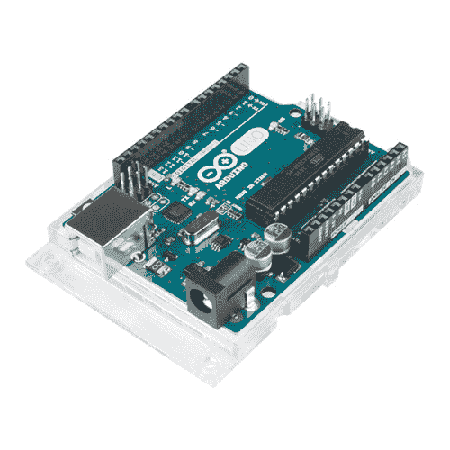
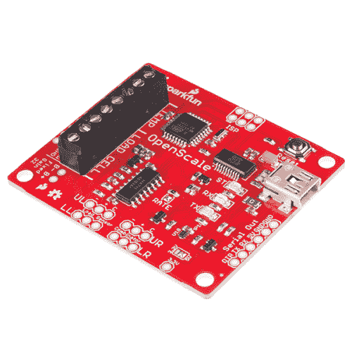
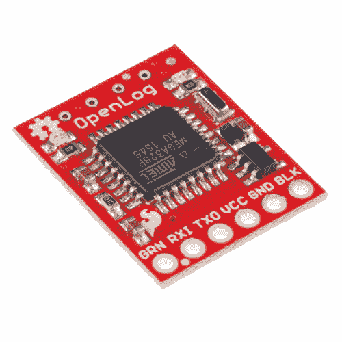
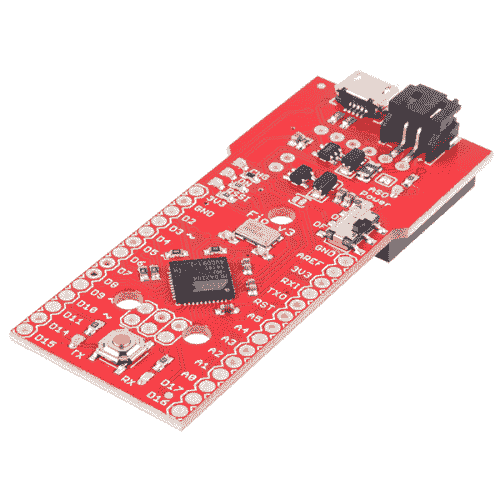
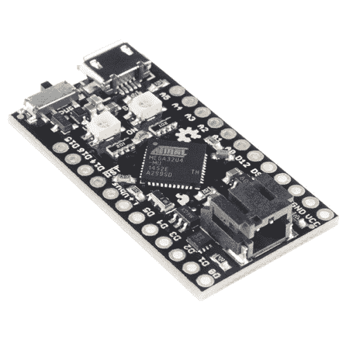
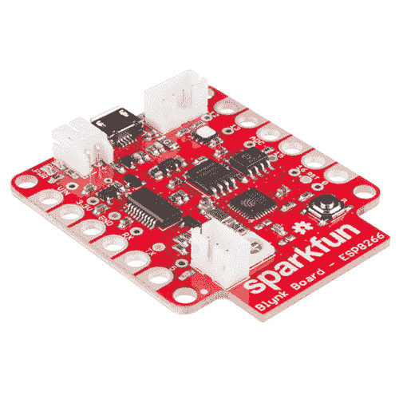

# 为您的项目选择 Arduino

> 原文：<https://learn.sparkfun.com/tutorials/choosing-an-arduino-for-your-project>

## 介绍

## 你只是在寻找 Arduino 板之间的规格吗？

查看我们的 **[Arduino 对比指南](https://www.sparkfun.com/standard_arduino_comparison_guide)** ！我们已经编译了我们携带的每个 Arduino 开发板，因此您可以快速比较它们，找到最适合您需求的开发板。

带我去那里！

让我们面对它，有很多不同的 Arduino 板。你如何决定你的项目需要哪一个？在本教程中，我们将看看 Arduino 板的多样化世界。我们将更深入地研究每种板，检查利弊和示例用例。

Arduino 是一个基于灵活易用的硬件和软件的开源电子原型开发平台。它是为艺术家、设计师、业余爱好者和任何对创建交互式对象或环境感兴趣的人设计的。或者更简单地说，你加载一些代码，它可以读取传感器，根据按钮的输入执行操作，控制电机，并接受[屏蔽](https://learn.sparkfun.com/tutorials/arduino-shields)以进一步扩展它的功能。真的，你几乎可以做任何事情。

所有 Arduino 板都有一个共同点:它们通过 [Arduino IDE](http://arduino.cc/en/Main/Software) 进行编程。这是允许你写和上传代码的软件。除此之外，还有很多不同之处。输入和输出的数量(一块电路板上可以使用多少个传感器、led 和按钮)、速度、工作电压和外形尺寸只是其中的几个变量。有些主板设计为嵌入式，没有编程接口(硬件)，您需要单独购买。有些可以直接使用 3.7V 电池，有些至少需要 5V。

### 建议观看

[https://www.youtube.com/embed/zJJkNJWWcIU/?autohide=1&border=0&wmode=opaque&enablejsapi=1](https://www.youtube.com/embed/zJJkNJWWcIU/?autohide=1&border=0&wmode=opaque&enablejsapi=1)

### 推荐阅读

如果你不知道什么是 Arduino，但发现自己在这里，你可能想从我们的[什么是 Arduino 教程开始？](https://learn.sparkfun.com/tutorials/what-is-an-arduino)。

 [### 什么是 Arduino？](https://learn.sparkfun.com/tutorials/what-is-an-arduino) What is this 'Arduino' thing anyway? This tutorials dives into what an Arduino is and along with Arduino projects and widgets.[Favorited Favorite](# "Add to favorites") 50 [### 逻辑电平](https://learn.sparkfun.com/tutorials/logic-levels) Learn the difference between 3.3V and 5V devices and logic levels.[Favorited Favorite](# "Add to favorites") 82

您还应该对 Arduino IDE 有很好的理解。如果你需要帮助安装它，请访问本教程。

 [### 安装 Arduino IDE](https://learn.sparkfun.com/tutorials/installing-arduino-ide) A step-by-step guide to installing and testing the Arduino software on Windows, Mac, and Linux.[Favorited Favorite](# "Add to favorites") 16

## 术语表

**微控制器(MCU):** 微控制器是 Arduino 板的心脏(或者更恰当地说，是大脑)。Arduino 开发板基于不同类型的 AVR 微控制器，每种微控制器都有不同的功能和特性。

**输入电压:**这是板卡的建议输入电压范围。该板的额定最大电压可能稍高，但这是安全的工作范围。要记住的一件方便的事情是，我们携带的许多[锂电池都是 3.7V，这意味着任何输入电压包括 3.7V 的电路板都可以直接由我们的锂电池组供电。](https://www.sparkfun.com/search/results?term=lithium&what=products)

**系统电压:**这是电路板的系统电压，即微控制器实际运行的电压。这是屏蔽兼容性的一个重要因素，因为逻辑电平现在是 3.3V，而不是 5V。你总是想确定你试图与之通信的任何外部系统能够匹配你的控制器的[逻辑电平](https://learn.sparkfun.com/tutorials/logic-levels)。

**时钟速度:**这是微控制器的工作频率，与它执行命令的速度有关。尽管有罕见的例外，大多数运行在 3V 的 ATmega 微控制器的时钟频率为 8MHz，而大多数运行在 5V 的微控制器的时钟频率为 16MHz。如果你知道你在做什么，Arduino 的时钟速度可以通过一些技巧来降低功耗。

**数字输入/输出:**这是 Arduino 板上断开的数字输入/输出(I/O)引脚的数量。每个都可以配置为输入或输出。有些能够 PWM，有些兼作串行通信引脚。

**模拟输入:**这是 Arduino 板上可用的[模拟输入](https://learn.sparkfun.com/tutorials/analog-to-digital-conversion)引脚的数量。模拟引脚标有“A ”,后跟其编号，它们允许您使用 ATMega 芯片中的模数转换器(ADC)读取模拟值。如果需要，模拟输入也可以配置为更多的数字 I/O！

**PWM:** 这是能够产生[脉宽调制](https://learn.sparkfun.com/tutorials/pulse-width-modulation)的数字 I/O 引脚的数量。(PWM)信号。PWM 信号类似于模拟输出；它允许您的 Arduino 在零和系统电压之间“伪造”一个模拟电压。

**UART:** 这是您的 Arduino 板可以支持的独立[串行通信](https://learn.sparkfun.com/tutorials/serial-communication)线路的数量。在大多数 Arduino 板上，数字 I/O 引脚 0 & 1 兼作串行发送和接收引脚，并与串行编程端口共享。一些 Arduino 板有多个 UARTs，可以同时支持多个串行端口。所有 Arduino 板都至少有一个 UART 用于编程，但有些板没有分解成可访问的管脚。

**闪存空间:**这是芯片可用于存储草图的程序内存量。并非所有这些内存都可用，因为只有很小一部分由引导加载程序占用(通常在 0.5 到 2KB 之间)。

**编程接口:**这是你如何将 Arduino 板连接到你的计算机上进行编程。有些主板上有一个 USB 插孔，您只需将它们插入 USB 电缆即可。其他人有一个可用的接头，以便您可以插入 [FTDI 基本分线点](https://www.sparkfun.com/search/results?term=ftdi+basic&what=products)或 [FTDI 电缆](https://www.sparkfun.com/search/results?term=ftdi+cable&what=products)。其他电路板，如 Mini，断开串行引脚进行编程，但与 FTDI 接头不兼容。任何带有 USB 插孔的 Arduino 板也有一些其他硬件来实现串行到 USB 的转换。然而，有些主板不需要额外的硬件，因为它们的微控制器内置了对 USB 的支持。

## 基于 ATmega328 的电路板

**Note:** The ATmega328P is the updated version of the ATmega328 microcontroller but operates very similarly. It is important to note, however, that the 328P will consume less power than the 328 and that the two chips will have varying chip signatures. In general though, the functionality and programming of the two are comparable. We will be referring to the ATmega328p as the ATmega328 throughout this tutorial.

ATmega328(以及之前的 ATmega168 和之前的 ATmega8，...)是 Arduino 平台的一个主要部分。32kB 闪存(程序空间)，多达 23 个 I/o，其中 8 个可以是模拟输入，工作频率高达 20 MHz。它的规格没有一个是华而不实的，但这仍然是一个坚实的 8 位微控制器。对于许多电子项目来说，328 提供的仍然绰绰有余。

本页上的 Arduino 板都以 ATmega328 作为其主 MCU 大脑。就 I/O 计数和内存而言，仅微控制器一项就使本页中的每块板几乎完全相同。它们的差异源于编程接口、外形和工作电压等因素。

### 主要事件:Arduino Uno

Arduino Uno 是 Arduino 的“库存”。这是我们与其他 Arduino 兼容主板进行比较的标准。如果你刚刚进入 Arduino，**这是从**开始的板。

 

将**添加到您的[购物车](https://www.sparkfun.com/cart)中！**

 **### [Arduino Uno - R3](https://www.sparkfun.com/products/11021)

[In stock](https://learn.sparkfun.com/static/bubbles/ "in stock") DEV-11021

这是新的 Arduino Uno R3。除了以前主板的所有功能外，Uno 现在使用 ATmega16U2 代替…

$27.95138[Favorited Favorite](# "Add to favorites") 162[Wish List](# "Add to wish list")**** 

将**添加到您的[购物车](https://www.sparkfun.com/cart)中！**

 **### [Arduino Uno - R3 贴片](https://www.sparkfun.com/products/11224)

[In stock](https://learn.sparkfun.com/static/bubbles/ "in stock") DEV-11224

这是新的 Arduino Uno R3。除了以前主板的所有功能外，Uno 现在使用 ATmega16U2 代替…

$26.9525[Favorited Favorite](# "Add to favorites") 31[Wish List](# "Add to wish list")**** ****Uno 有两种风格，[通孔](https://www.sparkfun.com/products/11021)和 [SMD](https://www.sparkfun.com/products/11224) ，使用通孔或表面贴装 ATmega328。通孔版本(如上图)很好，因为你可以取出芯片并换上一个新的(以防魔法，蓝烟被释放)，但 SMD 版本有可能更容易获得(PTH 芯片越来越多地被淘汰)。

Arduino Uno 可以通过 USB 接口或外部桶形插孔供电。要将其连接到计算机，您需要一根[B 型转 A 型 USB 电缆](https://www.sparkfun.com/products/512)(就像大多数打印机上的 USB 连接器一样)。

### 修改:红纸板

Arduino 最大的优点之一是整个项目都是开源的。原理图、硬件设计文件和源代码都可以免费查看和修改。在知识共享许可下发布，任何人都可以自由地重复硬件设计并制作他们自己的版本。这就是像 [RedBoard](https://www.sparkfun.com/products/13975) 这样的产品是如何产生的。它的外观和行为仍然像 Arduino Uno，但稍加修改，使主板更适合某些用途。

 

将**添加到您的[购物车](https://www.sparkfun.com/cart)中！**

 **### [spark fun red board——用 Arduino 编程 T3](https://www.sparkfun.com/products/13975)

[In stock](https://learn.sparkfun.com/static/bubbles/ "in stock") DEV-13975

SparkFun RedBoard 结合了 UNO 的 Optiboot 引导程序的简单性、FTDI 的稳定性和 shield com…

$21.5049[Favorited Favorite](# "Add to favorites") 89[Wish List](# "Add to wish list")** **RedBoard 与 Uno 几乎相同，但有几个关键区别:

*   **USB 连接器**:red board 使用较小的 mini-B 连接器，所以你需要一根 [mini-B-to-A USB 线](https://www.sparkfun.com/products/11301)将其连接到你的电脑上。
*   **USB 转串行转换器**:Arduino Uno 使用一个加载了定制固件的 ATmega16U4 在 USB 和串行之间转换。RedBoard 使用 FTDI FT232RL。这种差异只有在**安装驱动**时才真正普遍，因为每个驱动都需要不同的驱动文件。
*   **SMD vs PTH**:red board 只提供 SMD 版本，它通过将*的每个*元件表面贴装，使 SMD 更进一步。板子底部没有锋利的边缘！
*   **颜色**:果然名不虚传，红色车身来自~~法拉利~~ SparkFun 红色。它不会对 Arduino 的操作产生任何实际影响，但它肯定会影响电路板的 swag-factor。
*   **价格**:因为我们在科罗拉多州博尔德市内部制造主板，所以我们可以将价格降低一点。

像 Uno 一样，RedBoard 对初学者来说也很棒。总的来说，它应该提供和 Uno 一样的 Arduino 体验。为了更深入地比较 RedBoard 和 Uno，请查看我们的 [RedBoard vs. Uno 教程](https://learn.sparkfun.com/tutorials/redboard-vs-uno)。

 [### RedBoard 对 Uno

#### 2013 年 8 月 6 日](https://learn.sparkfun.com/tutorials/redboard-vs-uno) In this tutorial we discuss the differences and similarities between the RedBoard and the Arduino Uno (SMD and PTH). The development platforms[Favorited Favorite](# "Add to favorites") 15

### 对于专业人士来说

Arduino Pros 是 Uno 的缩小版。上面仍然有一个 ATmega328，但移除了连接器和 USB 到串行转换电路。基本上，这是 Arduino 仍然是 Arduino 的最低要求。顾名思义，这些板是为更有经验的 Arduino 用户设计的。

 

将**添加到您的[购物车](https://www.sparkfun.com/cart)中！**

 **### [Arduino Pro 328-5V/16 MHz](https://www.sparkfun.com/products/10915)

[33 available](https://learn.sparkfun.com/static/bubbles/ "33 available") DEV-10915

是蓝色的！太瘦了！是 Arduino Pro！SparkFun 对 Arduino 的极简设计方法。这是一个 5V 的 Arduino 运行…

$18.503[Favorited Favorite](# "Add to favorites") 23[Wish List](# "Add to wish list")**** 

将**添加到您的[购物车](https://www.sparkfun.com/cart)中！**

 **### [Arduino Pro 328-3.3V/8 MHz](https://www.sparkfun.com/products/10914)

[In stock](https://learn.sparkfun.com/static/bubbles/ "in stock") DEV-10914

是蓝色的！太瘦了！是 Arduino Pro！SparkFun 对 Arduino 的极简设计方法。这是一个 3.3V Arduino 运行测试…

$18.501[Favorited Favorite](# "Add to favorites") 16[Wish List](# "Add to wish list")**** ****你需要的不仅仅是一根 USB 线来为 Arduino Pro 编程；需要一个外部板来将 USB 从您的计算机转换为 Arduino 能够理解的[串行](https://learn.sparkfun.com/tutorials/serial-communication)。有各种各样的板和电缆可以完成这项任务，我们推荐 [FTDI 基本分线点](https://www.sparkfun.com/products/9716)。

该板可与板边缘的 6 引脚直角连接器对接。当您完成编程并准备将电路板插入项目时，只需拔掉 FTDI Basic。

更小的外形和无连接器意味着该板可以更加**定制**以适应项目。您可以将电线或连接器直接焊接到您需要的引脚上。话又说回来，它有着和 Uno 一样的管脚，所以它仍然和[盾](https://learn.sparkfun.com/tutorials/arduino-shields)兼容。

优点有两种: [5V/16MHz](https://www.sparkfun.com/products/10915) 和 [3.3V/8MHz](https://www.sparkfun.com/products/10914) 。5V/16MHz 板以与 Arduino Uno 相同的电压和速度运行。不过，3.3V/8MHz 电路板是独一无二的，因为它可以在较低的电压下工作。较低的工作电压使电路板更容易用电池供电(特别是 [LiPos](https://www.sparkfun.com/search/results?term=lithium) )，但这也意味着时钟速度必须降低。3.3V/8MHz 主板的运行速度是普通 Arduino Uno 的一半...但是对于许多应用来说，8MHz 仍然非常快。你仍然可以每秒钟开关 LED 超过一百万次！

当然，如果这个板子还是太大，你可以进一步缩小...

#### Pro Mini 的

迷你主板将 Arduino Pro 的所有剩余功能封装在一个更小的空间内。每个引脚仍然是断开的(实际上，*更多的*引脚被断开)，他们只是在一个非常不同的足迹。

 

将**添加到您的[购物车](https://www.sparkfun.com/cart)中！**

 **### [Arduino Pro Mini 328-5V/16 MHz](https://www.sparkfun.com/products/11113)

[In stock](https://learn.sparkfun.com/static/bubbles/ "in stock") DEV-11113

SparkFun 对 Arduino 的极简设计方法。这是一个 5V Arduino 运行 16MHz 引导加载程序。

$10.95137[Favorited Favorite](# "Add to favorites") 166[Wish List](# "Add to wish list")**** 

将**添加到您的[购物车](https://www.sparkfun.com/cart)中！**

 **### [Arduino Pro Mini 328-3.3V/8 MHz](https://www.sparkfun.com/products/11114)

[In stock](https://learn.sparkfun.com/static/bubbles/ "in stock") DEV-11114

SparkFun 对 Arduino 的极简设计方法。这是一个 3.3V Arduino 运行 8MHz 引导加载程序。

$10.9552[Favorited Favorite](# "Add to favorites") 91[Wish List](# "Add to wish list")*********An Arduino Pro Mini attached to an FTDI Basic, which provides power and uploads code.*

显然，这些板不兼容 shield，但它们兼容[试验板](https://learn.sparkfun.com/tutorials/how-to-use-a-breadboard)。您可以将插头焊接到 Pros 中，并跨在试验板的中间条上。小巧的外形也使它们非常有利于嵌入到项目中(如 [H2O pH 探针](https://www.sparkfun.com/news/1305))。

像普通的 Pro 主板一样，这些主板也有 [5V/16MHz](https://www.sparkfun.com/products/11113) 和 [3.3V/8MHz](https://www.sparkfun.com/products/11114) 两种型号。你仍然需要用 FTDI Basic 来编程。

### 等等

#### Arduino Fio

还有，Arduino Fio 也是。该板将 ATmega328 连接到 XBee(或 XBee 兼容)无线收发器，因此您的 Arduino 可以与其他设备进行无线通信。

 

将**添加到您的[购物车](https://www.sparkfun.com/cart)中！**

 **### [Arduino Fio](https://www.sparkfun.com/products/10116)

[In stock](https://learn.sparkfun.com/static/bubbles/ "in stock") DEV-10116

Arduino 漏斗 I/O (Fio)是由 Shigeru Kobayashi 基于[LilyPad](http://www…

$30.95 $10.832[Favorited Favorite](# "Add to favorites") 23[Wish List](# "Add to wish list")** **#### 带 Arduino Optiboot 的 ATmega328P

当你把 SparkFun RedBoard 或者 Arduino Uno 拿走除了微控制器之外的所有东西，你会得到什么？带有 Optiboot 的 ATmega328P 就是您所得到的，它在一个小得多的封装中提供了 RedBoard 和 Uno 的功能。在将 Arduino 放在试验板或项目上时，我们会用贴纸给针脚贴上标签，以供参考！

 

将**添加到您的[购物车](https://www.sparkfun.com/cart)中！**

 **### [带 Arduino Optiboot 的 atmega 328](https://www.sparkfun.com/products/10524)

[Out of stock](https://learn.sparkfun.com/static/bubbles/ "out of stock") DEV-10524

这个名字说明了一切。采用 DIP 封装的 ATmega328P，预装了 Arduino Optiboot (Uno 16MHz)引导加载程序。…

$6.509[Favorited Favorite](# "Add to favorites") 46[Wish List](# "Add to wish list")** **Optiboot (Arduino Bootloader)允许将 Arduino 代码上传到微控制器，而无需 RedBoard 或 Uno。当你想要一个基本的板的功能，但需要节省一些空间时，这是很方便的。要将代码从 Arduino IDE 上传到 ATmega328P，您需要一个 5V 电源、一个串行 UART 电路和一个 16MHz 晶振。一旦解决了这个问题，你就可以开始着手下一个项目了！

#### 红条

你曾经想要一个可以放进你的口袋保护套的红纸板吗？别再烦恼了！RedStick 具有许多您习惯于 ATmega328 板的相同功能，现在是有趣的尺寸！

 

### [踢腿 red stickT3](https://www.sparkfun.com/products/retired/13741)

[Retired](https://learn.sparkfun.com/static/bubbles/ "Retired") DEV-13741

2015 年，我们开发了 BadgerStick，作为一种有趣的互动方式，让人们了解焊接并参与 SparkFu…

9 **Retired**[Favorited Favorite](# "Add to favorites") 41[Wish List](# "Add to wish list")

尽管尺寸较小，但该板仍有 14 个数字 I/O 引脚，6 个 PMW 引脚、8 个模拟输入、UART、SPI、I2C 和外部中断。该板工作在 5V/16MHz，可以通过 USB 插头、单节 LiPo 电池甚至 2 节 AA 电池供电。板载升压转换器允许电路板在 **2 至 6 伏**的输入范围内供电。通过内置的 FTDI 和 USB 端，只需将主板直接连接到计算机的 USB 端口即可重新编程！(不需要外部 FTDI 板或 USB 电缆！)

#### RedBot 主板

RedBot 主板旨在为机器人控制提供简单、快速的开发。这是一个一体化的主板，包括 XBee 接头、预编程的 Optiboot (Uno)引导加载程序、用于传感器集成的大量引脚、TB6612FNG 双 DC 电机驱动器、电源开关和电机禁用开关，以便讨厌的机器人不会在你摆弄时试图逃跑。虽然专为魔术师和影子底盘设计，但伺服和传感器功能可以应用于许多机器人项目。

 

将**添加到您的[购物车](https://www.sparkfun.com/cart)中！**

 **### [SparkFun RedBot 主板](https://www.sparkfun.com/products/12097)

[Only 10 left!](https://learn.sparkfun.com/static/bubbles/ "only 10 left!") ROB-12097

SparkFun RedBot 主板是一个机器人开发平台，可与 Arduino IDE 配合使用。红色机器人是一个马达驱动器…

$36.955[Favorited Favorite](# "Add to favorites") 12[Wish List](# "Add to wish list")** **像许多标准的 ATmega328P 板一样，RedBot 的工作电压为 5V，工作频率为 16Hz，闪存为 32kB。引脚方面，它配有两个用于电机的 1x3 母接头，四个用于伺服系统的 2x3 公接头，以及两个 2x3 公接头传感器端口。由于该板是一个带有所有这些接头和连接器的电机驱动器-Arduino 组合，因此无需堆叠多个屏蔽，同时增加了定制。

#### open cales(open cales)

如果您正在进行一个项目，并且想要记录温度或测量静态负载的重量，那么 OpenScale 是您的理想选择。OpenScale 专为数据收集而设计，利用螺丝端子连接至温度传感器和称重传感器。该板配有内置 HX711 称重传感器放大器和 FTDI。

 

将**添加到您的[购物车](https://www.sparkfun.com/cart)中！**

 **### [spark fun open scale](https://www.sparkfun.com/products/13261)

[In stock](https://learn.sparkfun.com/static/bubbles/ "in stock") SEN-13261

SparkFun OpenScale 是一款简单易用的开源重量和温度测量解决方案。它有能力研究…

$34.5021[Favorited Favorite](# "Add to favorites") 28[Wish List](# "Add to wish list")** **在记录数据时，您将有很多选择。您只需使用 USB 端口将 OpenScale 连接至您的计算机。您也可以连接数据记录器(如 OpenLog)或使用串行 UART 端口与蓝牙发射器通信。该板的工作电压为 5V/16MHz。

OpenScale 的另一个好处是它是开源的。要将代码上传到 OpenScale，只需使用 Arudino IDE。该板带有一个与 Arduino Uno 兼容的引导加载程序，所以开始编码吧！

#### OpenLog(打开日志)

SparkFun OpenLog 是一款开源数据记录器，通过简单的串行 UART 连接工作。虽然它比 Arduino Pro Mini 小，但在 PCB 上没有那么多便于使用的引脚。该板包括一个 microSD 卡插槽，可处理高达 32GB 的数据，以存储您的项目为科学或调试目的而生成的所有串行数据。

 

将**添加到您的[购物车](https://www.sparkfun.com/cart)中！**

**[In stock](https://learn.sparkfun.com/static/bubbles/ "in stock") DEV-13712

SparkFun OpenLog 可以存储或“记录”大量的串行数据，并充当某种黑匣子。

$16.9522[Favorited Favorite](# "Add to favorites") 87[Wish List](# "Add to wish list")** **该板在 3.3V 下工作，需要 3.3V FTDI 进行编程

#### 微观视角

MicroView 将 ATmega328P 与 64x48 像素有机发光二极管相结合，以显示传感器数据、电子邮件、pin 状态等。微视图还具有全功能的 Arduino 库，使模块编程变得容易。该板包括 12 个数字 I/O 引脚(其中 3 个提供 PWM 输出，6 个提供模拟输入引脚)。

 

将**添加到您的[购物车](https://www.sparkfun.com/cart)中！**

 **### [SparkFun 微视-有机发光二极管 Arduino 模块](https://www.sparkfun.com/products/12923)

[In stock](https://learn.sparkfun.com/static/bubbles/ "in stock") DEV-12923

微视图是第一个芯片大小的 Arduino 兼容模块，它可以让您使用内置的…

$44.9547[Favorited Favorite](# "Add to favorites") 113[Wish List](# "Add to wish list")** **MicroView 在 5V/16MHz 下工作，需要 5V FTDI 或 MicroView USB 编程器上传代码。

* * *

这个清单可以一直列下去。如果你看到一个电路板，它有一个 6 针串行接口，所有的处理都由 ATmega328 完成，那么它的规格可能与 Arduino Pro 没有什么不同。

## 基于 ATmega32U4 的电路板

Arduino 进化链的下一步是将电路板的 USB 转串行编程部分合并到主 MCU 上。这意味着我们不得不放弃 ATmega328 因为它本身不支持 USB——而支持 ATmega32U4。除了额外的 USB 支持，32U4 在很大程度上类似于 328。两款都是 8 位 AVR，内置 32kB 闪存、22 条左右的 I/O 线、ADC、UARTs 和定时器等。

这些 ATmega32U4 板通常有比基于 ATmega328 的板便宜的好处——那里有一个更便宜的 T2 集成电路。它们还可以做普通 Arduino 板做不到的事情，比如模拟 USB 键盘/鼠标。不利的一面是，它们可能不太可靠，也更难使用。

### 阿尔杜伊诺·莱昂纳多

莱昂纳多是所有 ATmega32U4 Arduino 董事会的元老。它与 Arduino Uno 具有相同的外形和 I/O 布局(模拟、PWM、I ² C 引脚在同一位置),因此它仍然与 shield 兼容。

 

### Arduino Leonardo 头球攻门

[Retired](https://learn.sparkfun.com/static/bubbles/ "Retired") DEV-11286

Arduino 是一个开源的物理计算平台，它基于一个简单的 i/o 板和一个开发环境

10 **Retired**

达芬奇和 Uno 的区别？除了新的微控制器，以及缺乏第二个 USB 到串行转换 IC，没有多少。USB 连接器不同，莱昂纳多通过一根 [micro-B USB 线](https://www.sparkfun.com/products/10215)连接电脑。[驱动安装过程](http://arduino.cc/en/Guide/ArduinoLeonardoMicro?from=Guide.ArduinoLeonardo)也有点复杂——有时要把主板安装到你的电脑上可能需要一点额外的努力。

### Pro Micro

正如 Pro Mini 采用 Arduino Uno 的内脏并将其缩小一样，Pro Micro 也是达芬奇的微缩版。与 Pro Mini 不同，Pro Micro 不需要外部板来上传草图 32U4 会处理一切！

 

将**添加到您的[购物车](https://www.sparkfun.com/cart)中！**

 **### [Pro 微 5V/16MHz](https://www.sparkfun.com/products/12640)

[Out of stock](https://learn.sparkfun.com/static/bubbles/ "out of stock") DEV-12640

在 SparkFun，我们拒绝放弃“足够好”。这就是我们增加 Arduino 兼容微控制器产品线的原因…

$19.5080[Favorited Favorite](# "Add to favorites") 87[Wish List](# "Add to wish list")**** 

将**添加到您的[购物车](https://www.sparkfun.com/cart)中！**

 **### [Pro 微- 3.3V/8MHz](https://www.sparkfun.com/products/12587)

[Out of stock](https://learn.sparkfun.com/static/bubbles/ "out of stock") DEV-12587

在 SparkFun，我们拒绝放弃“足够好”。这就是我们增加 Arduino 兼容微控制器产品线的原因…

$19.5021[Favorited Favorite](# "Add to favorites") 39[Wish List](# "Add to wish list")**** ****Pro Micro 采用标准的 [5V/16MHz](https://www.sparkfun.com/products/11098) 工作范围或更独特的 [3.3V/8MHz](https://www.sparkfun.com/products/10999) 变体。

Pro Micros 是安装和运行起来比较复杂的 Arduino 板之一。在你的 Arduino 环境中启用它们需要额外的步骤，一个失误会(至少是暂时地)“毁掉”Pro Micro。如果你是一个高级的 Arduino-er，并且在头脑中有一个面向 USB 的小项目([迷你 USB 键盘/鼠标)，这些板是一个不错的选择？](https://www.sparkfun.com/tutorials/337))。

### 更多变种！

#### FioV3

列奥纳多设计中还有很多其他的重复片段。有 [Fio v3](https://www.sparkfun.com/products/11520) ，对于任何你可能想要添加 XBee 的 Arduino Leonardo 项目。

 

将**添加到您的[购物车](https://www.sparkfun.com/cart)中！**

 **### [Fio v3 - ATmega32U4](https://www.sparkfun.com/products/11520)

[34 available](https://learn.sparkfun.com/static/bubbles/ "34 available") DEV-11520

Fio v3 是由 ATmega32U4 驱动的 Arduino Fio 硬件的新版本。它不仅体积小，易于吸脂，而且是一款…

$36.95 $14.787[Favorited Favorite](# "Add to favorites") 13[Wish List](# "Add to wish list")** **### QDuino Mini

或者是添加了脂肪充电器和电池电量计的 [Qduino Mini](https://www.sparkfun.com/products/13614) ，以及两个 RGB LEDs(一个用于状态，另一个可由用户编程！).该板由 Quin 在 14 岁时设计，并在 SparkFun 制造。

 

将**添加到您的[购物车](https://www.sparkfun.com/cart)中！**

 **### [Qduino Mini - Arduino 开发板](https://www.sparkfun.com/products/13614)

[26 available](https://learn.sparkfun.com/static/bubbles/ "26 available") DEV-13614

Qduino Mini 是一个小巧的 Arduino 兼容板，内置电池连接器和充电器，以及一个燃油表…

$35.955[Favorited Favorite](# "Add to favorites") 40[Wish List](# "Add to wish list")** **#### 裸导电触摸板

然后就是光秃秃的导电触摸板。基本上，它是一个 Arduino Leonardo，旨在将几乎任何材料或表面变成传感器。该板配有内置电容触摸传感器、MP3 解码器 IC、microSD 卡插座和 LiPo charge IC，以创建灯开关、乐器和定制的交互表面。

 

将**添加到您的[购物车](https://www.sparkfun.com/cart)中！**

 **### [裸露的导电触摸板](https://www.sparkfun.com/products/13298)

[Out of stock](https://learn.sparkfun.com/static/bubbles/ "out of stock") DEV-13298

Bare Conductive 的触摸板是一种易于使用的 Arduino@Heart 板，它可以让您将几乎任何对象…

$64.503[Favorited Favorite](# "Add to favorites") 20[Wish List](# "Add to wish list")** **## 可穿戴 arduino

Arduino 市场的电子纺织品领域由 LilyPads 统治。这些可以被识别为独特的紫色，花状，圆形板。百合上的针被称为“花瓣”，它们有更大的孔，铜填充到板的边缘。这些设计使得[导电线](https://learn.sparkfun.com/tutorials/lilypad-basics-e-sewing)可以穿过这些孔，并与花瓣上暴露的铜进行电接触。

LilyPads 非常适合电子纺织品——结合了电子和织物魔法的项目。有关这些板的详细说明，请查看本教程。

 [### 为您的项目选择 LilyPad Arduino

#### 2015 . 10 . 27](https://learn.sparkfun.com/tutorials/choosing-a-lilypad-arduino-for-your-project) Not sure which LilyPad Arduino is right for you? We'll discuss the features of each and help you decide.[Favorited Favorite](# "Add to favorites") 13

## 更多动力！

你的 Arduino 需要一些额外的“牛肉”吗？需要更多的 I/O 引脚，还是更快的处理器？这就是 Arduino 像 Mega 或 Due 进入画面的原因。

### Arduino Mega:增强版的 Uno

Arduino Mega 是你将四个 Arduino Uno 装在一块主板上可能得到的东西。有 **54 个 I/O 管脚**，而不是 Uno 给你的 14 个。这是一大堆额外的 led！不是一个硬件串行端口，而是四个。而 Mega sports 有一个巨大的 **256 kB 的闪存**程序空间。更不用说 16 路模拟输入和 14 路 PWM 输出。超级大饭店什么都有。

 

将**添加到您的[购物车](https://www.sparkfun.com/cart)中！**

 **### [Arduino Mega 2560 R3](https://www.sparkfun.com/products/11061)

[In stock](https://learn.sparkfun.com/static/bubbles/ "in stock") DEV-11061

Arduino 是一个开源的物理计算平台，它基于一个简单的 i/o 板和一个开发环境

$48.9559[Favorited Favorite](# "Add to favorites") 77[Wish List](# "Add to wish list")** **超级计算机的大脑是一台 ATmega2560，一台完全升级的 ATmega328。除了大规模的处理器大修，Mega 仍然与 Arduino Uno 有许多共同之处。板上有一个辅助 IC(atmega 16 u 2)，用于将 USB 转换为串行，以允许 USB 编程。它以同样的速度运行——16 MHz。所有引脚都以保持板屏蔽兼容的方式断开。由于这些相似性，Mega 对于 Arduino 初学者和专家来说都是一个很好的选择。

如果你的 Arduino 项目因为没有足够的 I/O 而碰壁，或者如果你的程序空间快用完了，考虑升级到 Mega。

### Arduino 到期:Arduino 更难

你认为 Mega 很强大？Arduino Due 是 Arduino 平台上的一次革命。它采用了完全不同的处理器架构——ARM 而不是 AVR。它是一个 32 位处理器，时钟频率为 84 MHz，并具有本机 USB 支持。

 

### [阿杜因](https://www.sparkfun.com/products/retired/11589)

[Retired](https://learn.sparkfun.com/static/bubbles/ "Retired") DEV-11589

到期的是 Arduino 的第一个基于 ARM 的 Arduino 开发板。该板基于功能强大的 32 位 CortexM3 ARM 微控制器

15 **Retired**[Favorited Favorite](# "Add to favorites") 26[Wish List](# "Add to wish list")

这东西有许多其他主板没有的独特功能。比如:

*   两个**数模转换器**(DAC)，允许电路板输出真正的模拟值(而不是 PWM)。这意味着你可以播放音频了！
*   **USB on-the-go (OTG)** 功能允许 Due 同时充当 USB 设备和主机。这样你就可以连接其他 USB 设备——比如闪存盘、WiFi 模块或手机—*到*到期。
*   **直接存储器访问** (DMA)允许微控制器卸载存储器访问任务，因此它可以同时执行其他操作。

还有一些新的东西需要注意。Due 的处理器 ATSAM3X8E 不能在 5V 下工作，因此该板只能在 **3.3V** 下运行，这意味着它可能无法与所有的 shields 兼容。

Due 拥有一些令人惊叹的功能，但它也是一个更加**先进的**板。不建议初学者使用，但是如果你有一个项目可以利用 Due 的独特特性，那就去看看吧！

### 很小的

Teensy 系列是 PJRC 的微控制器系列，基于几种不同的强大集成电路。如果您安装了 Teensyduino 附加组件，则可以选择将 Teensy 与 Arduino IDE 一起使用。

#### Teensy++2.0

8 位 Teensy++ 2.0 在 5V/16MHz 下运行，将 AT90USB1286 上可用的所有 I/O 分解为试验板友好的 0.1 英寸间距接头。开发板有 127kB 的闪存可用于编程。有 46 个数字 I/O 引脚，8 个模拟输入和 9 个 PWM 输出。

 

### [Teensy++ 2.0](https://www.sparkfun.com/products/retired/11781)

[Retired](https://learn.sparkfun.com/static/bubbles/ "Retired") DEV-11781

Teensy++ 2.0 将 AT90USB1286 上可用的所有 IO 分解为 0.1 英寸间距的试验板友好型接头，因此您可以…

3 **Retired**[Favorited Favorite](# "Add to favorites") 10[Wish List](# "Add to wish list")

要编程，您只需为 Arduino IDE 安装 Teensyduino 插件，并通过 USB 上传。

#### 腾讯有限公司

32 位 Teensy LC 以 3.3V/48MHz 运行(引脚 17 除外，它可以为可寻址 LED 灯条输出 5V 电压)。该板还使 I/O 可用于试验板友好的 0.1 英寸间距接头。开发板有 62kB 的闪存可用于编程。共有 27 个 I/O 引脚，13 个模拟输入和 10 个 PWM 引脚。

 

将**添加到您的[购物车](https://www.sparkfun.com/cart)中！**

 **### [少女 LC](https://www.sparkfun.com/products/13305)

[Out of stock](https://learn.sparkfun.com/static/bubbles/ "out of stock") DEV-13305

Teensy LC 是一个 32 位微控制器板，为您提供了一个简单的选择，开始与 Teensy 的智慧…

$12.9517[Favorited Favorite](# "Add to favorites") 35[Wish List](# "Add to wish list")** **要编程，您只需为 Arduino IDE 安装 Teensyduino 插件，并通过 USB 上传。

#### 青少年 3.2

32 位 Teensy LC 以 3.3V/72MHz 运行，但 I/O 引脚可以承受 5V 电压。该板还使 I/O 可用于试验板友好的 0.1 英寸间距接头。开发板有 256kB 的闪存可用于编程。共有 34 个 I/O 引脚，21 个模拟输入和 12 个 PWM 引脚。

 

### [Teensy 3.2](https://www.sparkfun.com/products/13736)

[Out of stock](https://learn.sparkfun.com/static/bubbles/ "out of stock") DEV-13736

Teensy 3.2 是一款试验板友好型开发板，在一个小小的封装中提供了大量功能。

68[Favorited Favorite](# "Add to favorites") 83[Wish List](# "Add to wish list")

要编程，您只需为 Arduino IDE 安装 Teensyduino 插件，并通过 USB 上传。

### Arduino MKR 维多 4000

MKR Vidor 4000 是首款基于 FPGA 芯片和 SAMD21 微控制器的 Arduino。它包括一个 WiFi，BLE，MIPI 摄像头连接器，微型 HDMI，迷你 PCI express 连接器，I2C 连接器，LiPo 连接器和 USB 端口。该板可以执行高速数字音频和视频处理。

 

### Arduino MKR 维多 4000

[Retired](https://learn.sparkfun.com/static/bubbles/ "Retired") DEV-14870

Arduino MKR Vidor 4000 是高度可配置和强大的，它可以执行高速数字音频和视频处理…

**Retired**

该板工作电压为 3.3V，可通过 USB 电缆进行编程。

## 物联网！

### SparkFun ESP8266 的东西

ESP8266 是一款内置 WiFi 的低成本微控制器。默认情况下，电路板带有跟踪天线，但您也可以将外部天线连接到 u.FL 连接器。开发板分解出用于开发的 ESP8266 引脚，并包括一个 LiPo charge IC。非常适合将您的东西连接到云。最重要的是，有一个 ESP8266 板插件，以便它可以与流行的 Arduino IDE 一起使用。

 

将**添加到您的[购物车](https://www.sparkfun.com/cart)中！**

 **### [SparkFun ESP8266 东西](https://www.sparkfun.com/products/13231)

[In stock](https://learn.sparkfun.com/static/bubbles/ "in stock") WRL-13231

SparkFun ESP8266 是 ESP8266 WiFi SoC 的突破和开发板——物联网或 WiFi 的领先平台…

$18.5049[Favorited Favorite](# "Add to favorites") 93[Wish List](# "Add to wish list")** **虽然没有 Arduino Uno 那么多的 I/O 引脚(它有 11 个 I/O 引脚)，但它有一个时钟速度为 **80MHz** ， **512kB** 的闪存，所有引脚都可以输出 1kHz 左右的 PWM。您需要一个 3.3V FTDI 和电缆将代码上传到电路板。由于芯片是 **3.3V** ，所以需要一个逻辑电平转换器来连接任何高于系统电压的器件。电路板上没有接头。

### SparkFun ESP8266 东西开发板

ESP8266 的东西开发板和原来的 ESP8266 的东西基本一样。一个区别是没有 JST 连接器和 LiPo 充电电路。此外，开发板带有 FTDI 来上传代码，并且有一个选项来包括头。

 

将**添加到您的[购物车](https://www.sparkfun.com/cart)中！**

 **### [SparkFun ESP8266 东西开发板](https://www.sparkfun.com/products/13711)

[In stock](https://learn.sparkfun.com/static/bubbles/ "in stock") WRL-13711

SparkFun ESP8266 Thing Dev Board 是一款开发板，专门围绕 ESP8266 设计，集成了一个

$18.5070[Favorited Favorite](# "Add to favorites") 58[Wish List](# "Add to wish list")**** 

将**添加到您的[购物车](https://www.sparkfun.com/cart)中！**

 **### 

[28 available](https://learn.sparkfun.com/static/bubbles/ "28 available") WRL-13804

SparkFun ESP8266 带接头的东西开发板是一种围绕 ESP8266 设计的开发板，具有集成的…

$20.258[Favorited Favorite](# "Add to favorites") 14[Wish List](# "Add to wish list")**** ****### SparkFun Blynk 板(ESP8266)

使用您的 ESP8266 寻找应用程序？Blynk 板专为移动电话设计，包括流行的 ESP8266。使用 Blynk 应用程序，您可以通过拖放小部件来控制或监控您的东西，从而开始构建带有图形界面的项目！

 

### [spark fun Blynk Board-ESP8266](https://www.sparkfun.com/products/retired/13794)

[Retired](https://learn.sparkfun.com/static/bubbles/ "Retired") WRL-13794

SparkFun Blynk 板是专为与 Blynk 移动应用程序中的“小部件”一起工作而设计的，用于创建您的下一个…

16 **Retired**[Favorited Favorite](# "Add to favorites") 28[Wish List](# "Add to wish list")

虽然该板是为 Blynk 应用程序构建的，但可以在 Arduino IDE 中修改默认固件。该板包括内置跟踪天线、FTDI、可寻址的 WS2812 RGB LED、Si7021 温度和湿度传感器以及模数转换器。电路板上没有接头。但是，可以选择使用鳄鱼夹或极化连接器进行连接。

#### Arduino 以太网

市面上有无数兼容 Arduino 的电路板使用 ATmega328。许多像 Arduino Pros 一样，需要 FTDI Basic 来接收代码，但是他们添加了额外的硬件来使它们独一无二。Arduino 以太网就是一个很好的例子，Arduino Uno 和一个[以太网屏蔽](https://www.sparkfun.com/products/9026)被粉碎在一块板上。

 

### [Arduino 以太网 w/o PoE](https://www.sparkfun.com/products/retired/11229)

[Retired](https://learn.sparkfun.com/static/bubbles/ "Retired") DEV-11229

所以你想让你的 Arduino 在网上冲浪，但是你没有空间放 Arduino 板和以太网屏蔽。你在做什么…

2 **Retired**[Favorited Favorite](# "Add to favorites") 11[Wish List](# "Add to wish list")

引脚 10、11、12 和 13 保留用于与以太网模块接口，否则不应使用。这将可用引脚数减少到 9 个，其中 4 个可用作 PWM 输出。工作电压为**5V**；建议输入电压范围为 **7-12V** 。还有一个板载 microSD 读卡器，可提供额外的存储空间！

### Arduino 工业 101

Arduino Industrial 101 本质上是 Arduino Yún 的精简版，比 Yún 和 Uno R3 的占地面积更小。它有一个集成在基板上的 ATmega32u4 微控制器，Atheros AR9331 微处理器支持 LininoOS 嵌入式 Linux 操作系统。由于几乎一半的电路板被一个带有 U.FL 连接器的模块占用，该电路板不仅运行 Linux，而且还可以通过 Wi-Fi 运行！

 

### [阿杜诺工业 101](https://www.sparkfun.com/products/retired/14134)

[Retired](https://learn.sparkfun.com/static/bubbles/ "Retired") DEV-14134

Arduino Industrial 101 是基于 MIPS Linux 处理器的 Arduino 101 LGA 模块的 WiFi 评估板。随着…

**Retired**[Favorited Favorite](# "Add to favorites") 10[Wish List](# "Add to wish list")

有 3 个 GPIOs(其中 2 个可用作 PWM 输出)，4 个模拟输入，1 个引脚接头上的以太网信号(无标准以太网端口！)和内置的 DC/DC 转换器。ATmega32u4 的工作电压为 5V，而 AR9331 和相关的分支引脚的工作电压为 3.3V。片上稳压器为 AR9331 提供 3.3VDC 电源，但要注意连接。建议通过 micro-USB 连接以 5v 直流电压为电路板供电。

它有 16MB 的闪存，预装了 Linino 操作系统；它允许您与 Linux 托管的应用程序进行真实世界的连接。通过建立本地连接并将浏览器指向 Industrial 101 的配置面板(默认 *192.168.240.1* ，您可以选择您的 Wi-Fi 网络，然后使用 PuTTY 或终端访问 Linino OS 命令行。

你可以在线或离线上传你的代码。有了内置的 CDC，上传代码不需要 FTDI 分线点。该板没有预装接头，因此您需要进行一些焊接，但对于您的物联网项目来说，这绝对值得！

## 资源和更进一步

## 寻找合适的 Arduino？

查看我们的 **[Arduino 对比指南](https://www.sparkfun.com/standard_arduino_comparison_guide)** ！我们已经编译了我们携带的每个 Arduino 开发板，因此您可以快速比较它们，找到最适合您需求的开发板。

带我去那里！

你为你的项目选择了完美的 Arduino 吗？寻找更多 Arduino 教程？看看这些:

 [### 安装 Arduino IDE](https://learn.sparkfun.com/tutorials/installing-arduino-ide) A step-by-step guide to installing and testing the Arduino software on Windows, Mac, and Linux.[Favorited Favorite](# "Add to favorites") 16 [### Arduino 中的数据类型](https://learn.sparkfun.com/tutorials/data-types-in-arduino) Learn about the common data types and what they signify in the Arduino programming environment.[Favorited Favorite](# "Add to favorites") 38 [### LilyPad 基础:电子缝纫](https://learn.sparkfun.com/tutorials/lilypad-basics-e-sewing) Learn how to use conductive thread with LilyPad components.[Favorited Favorite](# "Add to favorites") 16 [### 在 Arduino IDE 中安装电路板定义](https://learn.sparkfun.com/tutorials/installing-board-definitions-in-the-arduino-ide) How do I install a custom Arduino board/core? It's easy! This tutorial will go over how to install an Arduino board definition using the Arduino Board Manager. We will also go over manually installing third-party cores, such as the board definitions required for many of the SparkFun development boards.[Favorited Favorite](# "Add to favorites") 3

或者试着看看这些资源。

 [### Enginursday:图形数据表

November 12, 2015](https://www.sparkfun.com/news/1947 "November 12, 2015: How and why we made them")[Favorited Favorite](# "Add to favorites") 8 [### Arduino 现场指南

March 30, 2016](https://www.sparkfun.com/news/2066 "March 30, 2016: Just in time for Arduino Day, we're bringing you the magic of infographics. ")[Favorited Favorite](# "Add to favorites") 3 [### 被忽视的 Arduino

March 26, 2019](https://www.sparkfun.com/news/2899 "March 26, 2019: Let's take a second look at the Arduino Leonardo with Andrew Shepherd.")[Favorited Favorite](# "Add to favorites") 1**********************************************