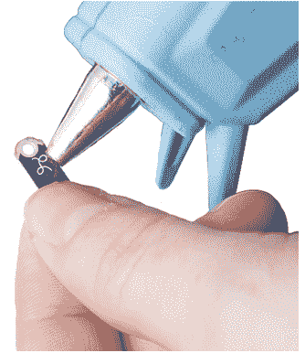
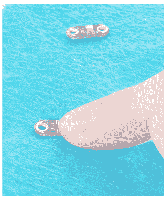
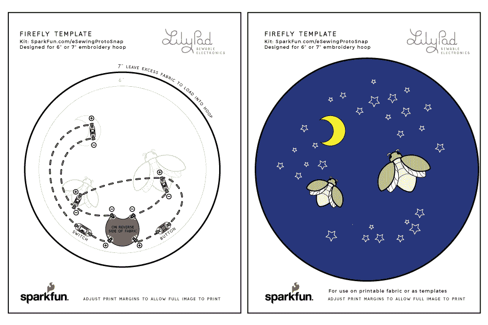

# LilyPad 电子缝纫 ProtoSnap 连接指南

> 原文：<https://learn.sparkfun.com/tutorials/lilypad-e-sewing-protosnap-hookup-guide>

## 介绍

LilyPad E-Sewing ProtoSnap 是在制作您的项目之前探索简单 E-Sewing 电路中按钮和开关如何工作的好方法。本指南将介绍电子缝纫原型中的各个组成部分，以及如何将其分解，以便在项目中使用。对于[E-seating proto snap](https://www.sparkfun.com/products/14546)和[E-seating proto snap 套件](https://www.sparkfun.com/products/14528)，您可以遵循本指南。

 

将**添加到您的[购物车](https://www.sparkfun.com/cart)中！**

### [lily pad E-seating proto snap](https://www.sparkfun.com/products/14546)

[In stock](https://learn.sparkfun.com/static/bubbles/ "in stock") DEV-14546

LilyPad E-Sewing ProtoSnap 是一个很好的方式来探索按钮和开关在简单的 E-Sewing 电路中的行为

$6.954[Favorited Favorite](# "Add to favorites") 11[Wish List](# "Add to wish list")**** 

将**添加到您的[购物车](https://www.sparkfun.com/cart)中！**

### [lily pad E-seating proto snap 套件](https://www.sparkfun.com/products/14528)

[In stock](https://learn.sparkfun.com/static/bubbles/ "in stock") KIT-14528

LilyPad E-Sewing ProtoSnap 套件是将按钮和开关整合到电子纺织品项目中的一个很好的方式，无需任何专业人员

$12.95[Favorited Favorite](# "Add to favorites") 9[Wish List](# "Add to wish list")**** ****### 推荐阅读

如果这是你的第一个可缝电子项目，我们建议你阅读我们的 LilyPad 电子缝纫教程。

 [### LilyPad 基础:电子缝纫

#### 2016 . 12 . 17](https://learn.sparkfun.com/tutorials/lilypad-basics-e-sewing) Learn how to use conductive thread with LilyPad components.[Favorited Favorite](# "Add to favorites") 16

## 硬件概述和功能

**Don’t snap apart your LilyPad E-Sewing ProtoSnap** until you're ready to use the pieces in a project. If you leave the pieces attached to the board, you'll be able to prototype and test your project before you start sewing.

像其他 [LilyPad ProtoSnap](https://www.sparkfun.com/categories/tags/protosnap) 系列电路板一样，电路板的各个部分都是预先布线的——允许您在缝纫前测试电路的功能。E-seating proto snap 包括三个白色[lily pad led](https://www.sparkfun.com/products/13902):两个连接到 [LilyPad 滑动开关](https://www.sparkfun.com/products/9350)，一个连接到 [LilyPad 按钮板](https://www.sparkfun.com/products/8776)。带有 3V 纽扣电池[的](https://www.sparkfun.com/products/338) [LilyPad 纽扣电池座](https://www.sparkfun.com/products/13883)为电路供电。这些部件通过称为走线的导电路径连接在一起。

### 所需材料和工具

#### 如果您正在使用[电子缝纫 ProtoSnap 套件](https://www.sparkfun.com/products/14528)，您还将拥有:

*   [导电线](https://www.sparkfun.com/products/10867)
*   [针](https://www.sparkfun.com/products/10405)
*   9 英寸 x12 英寸工艺毡

#### 要使用 E-Sewing ProtoSnap 创建成品项目，您还需要:

*   *上面列出的材料(如果不使用 E-seating proto snap 套件)*
*   毛毡或织物来缝合电路
*   钢笔、记号笔或粉笔
*   剪刀
*   热胶枪(带额外胶水)
*   *可选:*装饰用工艺用品(羽毛、亮片、纽扣等。)

## 探索示例电路

让我们试一下电路！

ProtoSnap 角落的 LilyPad 电池盒可容纳 20 毫米 CR2032 纽扣电池。安装好电池后，将电池盒上的开关滑动到 on 位置。

### 使用 LilyPad 滑动开关

LilyPad 滑动开关有一个标有开/关的小开关。当移动到关闭位置时，开关内部的零件相互远离，并打开电路(断开电路)。指示灯将不会亮起。当拨动开关移动到 ON 位置时，开关上的两个 sew 凸耳连接，允许电流流过并闭合电路。您应该会看到开关下方的两个 led 灯亮起。

### 使用 LilyPad 按钮

LilyPad 按钮板也是一种开关。当按钮自行离开时，连接到最右侧 LED 的电路开路。当您按下电路板中间的按钮时，它会连接两个 sew 标签并允许电流通过。当您放开按钮时，连接会再次打开，按钮会弹回原位。该按钮是瞬时开关的一个例子，仅当应用一个动作时才激活。

这与滑动开关略有不同，滑动开关是维护开关的一个例子，这意味着它的状态保持不变，直到发生变化。

*Learn more about buttons and switches in our [Switch Basics](https://learn.sparkfun.com/tutorials/switch-basics) tutorial.*

## 缝合到项目中

准备好加入项目了吗？首先，将币形电池从电池盒中滑出，放在一边。

小心地将 E-Sewing ProtoSnap 面板上连接的组件分开，为缝纫做准备。丢弃不可缝合的碎片和废料。如果你很难将碎片分开，使用一套钳子或斜切器。你将得到六个独立的 LilyPad 部件:带电池的电池座、三个 led、按钮和开关。

Always remove your battery when working on your circuit to avoid damaging your components.

### 设计您的项目

在一张纸上画出草图，或者在你的毛毡或布料上排列百合花图案，形成你的设计。此时，您可以以 ProtoSnap 格式重新创建片段的连接，或者设计自己的新配置。请记住，LED 的正极片必须连接到按钮或开关，以便由它们控制。led 的负极片应连接回电池座的负极片。

The image above is an example of a project diagram using the E-Sewing ProtoSnap. For instructions and downloadable template, visit the [Light-Up Plush](https://learn.sparkfun.com/tutorials/light-up-plush) tutorial.

电路设计完成后，用少量热胶或织物胶将 LilyPad 片固定在项目上，确保不要盖住缝翼片上的孔。在粘贴之前，请对照您的图表(或模板，如果使用 SparkFun 设计)仔细检查 LilyPad 的方向。

为了帮助你规划缝线，用粉笔或可洗记号笔在布料上画出你的线路图。

布置好电路后，小心地用导线将每个 LilyPad 组件连接在一起。组件之间的每个连接都应该是一根单独的导线，并避免与其他缝合线交叉。

#### 如果你从未用导电线缝制过，本教程将介绍基本知识。

 [### LilyPad 基础:电子缝纫

#### 2016 . 12 . 17](https://learn.sparkfun.com/tutorials/lilypad-basics-e-sewing) Learn how to use conductive thread with LilyPad components.[Favorited Favorite](# "Add to favorites") 16

### 解决纷争

对于任何电子项目，如果电路不工作，有时你必须排除故障。如果您的电路没有点亮，请尝试使用新电池或检查您的项目是否已打开。检查您的缝纫是否有任何松动的线或末端，这些线或末端可能会接触到电路的其他部分并导致[短路](https://learn.sparkfun.com/tutorials/what-is-a-circuit#short-and-open-circuits)。在 [LilyPad 基础:电子缝纫](https://learn.sparkfun.com/tutorials/lilypad-basics-e-sewing#troubleshooting)教程中了解更多关于项目故障排除的信息。

## 示例项目和模板

查看 Light-Up 毛绒项目教程，了解在项目中使用 E-Sewing ProtoSnap 的分步说明。

 [### 发光长毛绒

#### 2016 . 12 . 16](https://learn.sparkfun.com/tutorials/light-up-plush) Craft a light-up plush with LilyPad LEDs controlled by pressing a button and sliding a switch in the creature's hands.[Favorited Favorite](# "Add to favorites") 8

### 项目模板

寻找更多的项目创意？下面是一些模板，可以用来制作刺绣环或其他毛绒制品。点击按钮下载并打印(每张 2 页)。

[Download Firefly Template](https://cdn.sparkfun.com/assets/learn_tutorials/7/0/5/Firefly_eSewingTemplate.pdf)[Download Robot Template](https://cdn.sparkfun.com/assets/learn_tutorials/7/0/5/Robot_eSewingTemplate.pdf)
[Download Space Template](https://cdn.sparkfun.com/assets/learn_tutorials/7/0/5/Space_eSewingTemplate.pdf)
[Download Plush Cat Template](https://cdn.sparkfun.com/assets/learn_tutorials/7/0/5/PlushCat_eSewingTemplate_1.pdf)

## 资源和更进一步

有关 LilyPad E-Sewing ProtoSnap 的更多信息，请查看以下资源:

*   [示意图](https://cdn.sparkfun.com/assets/2/b/4/8/a/LilyPad-E-Sewing-Kit_v15.pdf)
*   [老鹰档案](https://cdn.sparkfun.com/assets/d/1/0/6/3/LilyPad-E-Sewing-Kit_v15_1.zip)
*   模板下载
    *   [萤火虫模板](https://cdn.sparkfun.com/assets/learn_tutorials/7/0/5/Firefly_eSewingTemplate.pdf)
    *   [机器人模板](https://cdn.sparkfun.com/assets/learn_tutorials/7/0/5/Robot_eSewingTemplate.pdf)
    *   [空间模板](https://cdn.sparkfun.com/assets/learn_tutorials/7/0/5/Space_eSewingTemplate.pdf)
    *   [毛绒猫](https://cdn.sparkfun.com/assets/learn_tutorials/7/0/5/PlushCat_eSewingTemplate_1.pdf)
*   [LilyPad 门户](https://www.sparkfun.com/lilypad_sewable_electronics)
*   [GitHub 库](https://github.com/sparkfun/LilyPad_E-Sewing_Kit)

这里有更多 LilyPad 可缝合电子项目可供尝试:

 [### 用电子纺织品点亮三角旗](https://learn.sparkfun.com/tutorials/light-up-pennant-with-e-textiles) Show your school spirit, geek pride, or fandom with a light up pennant using the LilyTwinkle or LilyPad Arduino.[Favorited Favorite](# "Add to favorites") 6 [### 带 LilyMini ProtoSnap 的夜光三角旗](https://learn.sparkfun.com/tutorials/night-light-pennant-with-lilymini-protosnap) Use the pre-programmed LilyMini ProtoSnap to make an interactive pennant that reacts to ambient light levels.[Favorited Favorite](# "Add to favorites") 5 [### 照明面罩](https://learn.sparkfun.com/tutorials/illuminated-mask) Use LilyPad LEDs, a switched battery holder, and coin cell battery to make a fun light up mask for your next costume party.[Favorited Favorite](# "Add to favorites") 6 [### 闪烁星座](https://learn.sparkfun.com/tutorials/twinkle-zodiac-constellation) Create a quick and easy piece of e-textile art based on a Zodiac sign using a LilyTiny, LilyPad LEDs, battery holder, conductive thread, and coin cell battery.[Favorited Favorite](# "Add to favorites") 12

在这些资源中了解更多可穿戴电子技术:

 [### 电子纺织品的绝缘技术](https://learn.sparkfun.com/tutorials/insulation-techniques-for-e-textiles) Learn a few different ways to protect your conductive thread and LilyPad components in your next wearables project.[Favorited Favorite](# "Add to favorites") 16 [### 规划可穿戴电子项目](https://learn.sparkfun.com/tutorials/planning-a-wearable-electronics-project) Tips and tricks for brainstorming and creating a wearables project.[Favorited Favorite](# "Add to favorites") 25 [### 为 LilyPad LED 项目供电](https://learn.sparkfun.com/tutorials/powering-lilypad-led-projects) Learn how to calculate how many LEDs your LilyPad project can power and how long it will last.[Favorited Favorite](# "Add to favorites") 8****