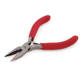
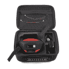
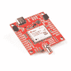

# Qwiic 适配器连接指南

> 原文：<https://learn.sparkfun.com/tutorials/qwiic-adapter-hookup-guide>

## 介绍

如果您需要将任何旧的 I ² C 板改造成支持 Qwiic 的板，SparkFun Qwiic 适配器板是理想的选择。这种适配器将 I ² C 引脚从 Qwiic 连接器断开，连接到您可以用您最喜欢的 I ² C 启用设备轻松焊接的引脚。

 

将**添加到您的[购物车](https://www.sparkfun.com/cart)中！**

### [SparkFun Qwiic 适配器](https://www.sparkfun.com/products/14495)

[In stock](https://learn.sparkfun.com/static/bubbles/ "in stock") DEV-14495

SparkFun Qwiic 适配器提供了将任何旧 I ² C 板改造成支持 Qwiic 的板的完美方法。

$1.601[Favorited Favorite](# "Add to favorites") 53[Wish List](# "Add to wish list")** **### 建议的材料

按照本教程，您将需要一个 I ² C 使能设备和一些头:

 

将**添加到您的[购物车](https://www.sparkfun.com/cart)中！**

### [破开头球——直击](https://www.sparkfun.com/products/116)

[In stock](https://learn.sparkfun.com/static/bubbles/ "in stock") PRT-00116

一排标题-打破适应。40 个引脚，可切割成任何尺寸。用于定制 PCB 或通用定制接头。

$1.7520[Favorited Favorite](# "Add to favorites") 133[Wish List](# "Add to wish list")**** 

将**添加到您的[购物车](https://www.sparkfun.com/cart)中！**

### [女标题](https://www.sparkfun.com/products/115)

[In stock](https://learn.sparkfun.com/static/bubbles/ "in stock") PRT-00115

单排 40 孔，内螺纹接头。可以用一把钢丝钳切割成合适的尺寸。标准 0.1 英寸间距。我们广泛使用它们…

$1.758[Favorited Favorite](# "Add to favorites") 71[Wish List](# "Add to wish list")**** 

将**添加到您的[购物车](https://www.sparkfun.com/cart)中！**

### [挣脱男头球-直角](https://www.sparkfun.com/products/553)

[In stock](https://learn.sparkfun.com/static/bubbles/ "in stock") PRT-00553

一排直角公接头-断开以适合。40 个引脚，可切割成任何尺寸。用于定制 PCB 或一般定制…

$2.255[Favorited Favorite](# "Add to favorites") 47[Wish List](# "Add to wish list")****** ******您还需要我们方便的 Qwiic 连接器来轻松地将适配器连接到您的开发板或系统。以下是几个选项:

 

将**添加到您的[购物车](https://www.sparkfun.com/cart)中！**

### [Qwiic 线缆- 100mm](https://www.sparkfun.com/products/14427)

[In stock](https://learn.sparkfun.com/static/bubbles/ "in stock") PRT-14427

这是一条 100 毫米长的 4 芯电缆，带有 1 毫米 JST 端接。它旨在将支持 Qwiic 的组件连接在一起…

$1.50[Favorited Favorite](# "Add to favorites") 32[Wish List](# "Add to wish list")**** 

将**添加到您的[购物车](https://www.sparkfun.com/cart)中！**

### [Qwiic 线缆- 500mm](https://www.sparkfun.com/products/14429)

[In stock](https://learn.sparkfun.com/static/bubbles/ "in stock") PRT-14429

这是一根 500mm 长的 4 芯电缆，带有 1mm JST 端接。它旨在将支持 Qwiic 的组件连接在一起…

$1.951[Favorited Favorite](# "Add to favorites") 25[Wish List](# "Add to wish list")**** 

将**添加到您的[购物车](https://www.sparkfun.com/cart)中！**

### [Qwiic 线缆- 50mm](https://www.sparkfun.com/products/14426)

[In stock](https://learn.sparkfun.com/static/bubbles/ "in stock") PRT-14426

这是一根 50 毫米长的 4 芯电缆，带有 1 毫米 JST 端接。它旨在将支持 Qwiic 的组件连接在一起…

$0.95[Favorited Favorite](# "Add to favorites") 29[Wish List](# "Add to wish list")**** 

将**添加到您的[购物车](https://www.sparkfun.com/cart)中！**

### [Qwiic 电缆-试验板跳线(4 针)](https://www.sparkfun.com/products/14425)

[In stock](https://learn.sparkfun.com/static/bubbles/ "in stock") PRT-14425

这是一根跳线适配器电缆，一端带有一个 Qwiic JST 母接头，另一端带有一个试验板连接…

$1.50[Favorited Favorite](# "Add to favorites") 34[Wish List](# "Add to wish list")******************Note:** Depending on your development board and system's voltage level, you may also need to use a logic level converter. Certain stackable breakout boards have a built in logic level converter (such as the [Qwiic Shield for Arduino](https://www.sparkfun.com/products/14352). If it is not included in the design, you will need to grab the [bi-directional logic level converter](https://www.sparkfun.com/products/12009).

### 工具

你需要一个烙铁、焊料和一般的焊接附件。要修改割台，您还需要尖嘴钳和斜口钳。

 

将**添加到您的[购物车](https://www.sparkfun.com/cart)中！**

### [尖嘴钳](https://www.sparkfun.com/products/8793)

[In stock](https://learn.sparkfun.com/static/bubbles/ "in stock") TOL-08793

迷你钳子。这些是很棒的小钳子！任何爱好者或电气工程师的必备。对于插入设备至关重要…

$3.501[Favorited Favorite](# "Add to favorites") 22[Wish List](# "Add to wish list")**** 

将**添加到您的[购物车](https://www.sparkfun.com/cart)中！**

### [斜切刀](https://www.sparkfun.com/products/8794)

[In stock](https://learn.sparkfun.com/static/bubbles/ "in stock") TOL-08794

迷你斜切刀。这些是很棒的小刀具！这是夹住引线和额外焊尾的必备工具。4 英寸长。

$2.753[Favorited Favorite](# "Add to favorites") 15[Wish List](# "Add to wish list")**** 

将**添加到您的[购物车](https://www.sparkfun.com/cart)中！**

### [无铅焊料- 100 克线轴](https://www.sparkfun.com/products/9325)

[In stock](https://learn.sparkfun.com/static/bubbles/ "in stock") TOL-09325

这是带有水溶性树脂芯的无铅焊料的基本线轴。0.031 英寸规格，100 克。这是一个好主意…

$9.957[Favorited Favorite](# "Add to favorites") 33[Wish List](# "Add to wish list")**** 

### [Hakko FX888D 焊台](https://www.sparkfun.com/products/retired/11704)

[Retired](https://learn.sparkfun.com/static/bubbles/ "Retired") TOL-11704

50 多年来，Hakko 一直生产高质量的焊接和脱焊工具。他们是可靠的，一个很好的价值…

53 **Retired**[Favorited Favorite](# "Add to favorites") 49[Wish List](# "Add to wish list")****** ******### 推荐阅读

如果你不熟悉 Qwiic 系统，我们推荐你在这里阅读[以获得一个概述](https://www.sparkfun.com/qwiic)。

|  |
| *[Qwiic 连接系统](https://www.sparkfun.com/qwiic)* |

如果你不熟悉下面的教程，我们也建议你看一看。

 [### 如何焊接:通孔焊接](https://learn.sparkfun.com/tutorials/how-to-solder-through-hole-soldering) This tutorial covers everything you need to know about through-hole soldering.[Favorited Favorite](# "Add to favorites") 70 [### 逻辑电平](https://learn.sparkfun.com/tutorials/logic-levels) Learn the difference between 3.3V and 5V devices and logic levels.[Favorited Favorite](# "Add to favorites") 82 [### I2C](https://learn.sparkfun.com/tutorials/i2c) An introduction to I2C, one of the main embedded communications protocols in use today.[Favorited Favorite](# "Add to favorites") 128

## 硬件概述

在你随意插入 I ² C 设备之前，你应该知道一些关于 Qwiic 系统的事情。首先要注意的是，所有的 Qwiic 设备都运行在 **3.3V** 上。因此，如果你有一个 5V 的设备，并且你没有使用带逻辑电平转换器的可堆叠分线板(如 Arduino 的 [Qwiic Shield)，你将需要一个](https://www.sparkfun.com/products/14352)[逻辑电平转换器](https://www.sparkfun.com/products/12009)来将你的信号提升到 5V。另外，请注意所有 Qwiic 器件的 I ² C 线上都有上拉电阻。因此，如果你的设备没有它，你需要添加或使用你的微控制器上的那些。

Qwiic 适配器配有两个 [4 针 1 毫米 JST 连接器](https://www.sparkfun.com/products/14417)，可快速将您的 I ² C 设备连接在一起。四个电镀通孔分别用于 SCL、SDA、3.3V 和 GND。这些引脚可用于将旧的 I ² C 使能器件转换为 Qwiic 使能板。

## 硬件装配

有几种不同的方法可以将 I ² C 设备连接到 Qwiic 适配器。最简单也可能是最干净的方法是使用头文件。这也允许适配器在将来重新连接到不同的 I ² C 设备。我发现我很喜欢 Qwiic 适配器上的 [90 度公接头](https://www.sparkfun.com/products/553)的外观，以及[母接头](https://www.sparkfun.com/products/115) I ² C 设备上的 90 度腿部弯曲。然而，你真的可以使用你喜欢的任何组合，这取决于你希望适配器相对于你的 I ² C 使能板如何定向。

使用[钳子](https://www.sparkfun.com/products/8793)，从直角公接头上折断一排 4 个销。使用[斜切刀](https://www.sparkfun.com/products/8794)，您需要牺牲一个插座，以便从母接头上切下一排 4 个插脚。用钳子小心地弯曲母接头的插脚，使其与 I ² C 装置成直角。[将](https://learn.sparkfun.com/tutorials/how-to-solder-through-hole-soldering)公接头焊接到 Qwiic 适配器，将母接头焊接到 I ² C 设备，如下图所示。

一旦你将接头焊接到每块板上，只需将你的适配器插入 I ² C 使能设备。使用 qw IC 电缆，将 qw IC 适配器插入您选择的可堆叠 qw IC 卡。假设您的开发板上加载了示例代码，您现在可以开始从支持 I ² C 的设备中读取数据了！

## 资源和更进一步

有关更多信息，请查看以下资源:

*   [示意图(PDF)](https://cdn.sparkfun.com/assets/2/4/7/e/6/SparkFun_Qwiic_Adapter.pdf)
*   [老鹰文件(ZIP)](https://cdn.sparkfun.com/assets/6/2/5/c/b/SparkFun_Qwiic_Adapter_1.zip)
*   [Qwiic 系统登陆页面](https://www.sparkfun.com/qwiic)
*   [Qwiic 适配器 GitHub 库](https://github.com/sparkfun/Qwiic_Adapter)

既然您已经准备好了 Qwiic 适配器，是时候看看一些支持 Qwiic 的产品了。

 

将**添加到您的[购物车](https://www.sparkfun.com/cart)中！**

### [踢腿 RTK 男T3](https://www.sparkfun.com/products/19984)

[Out of stock](https://learn.sparkfun.com/static/bubbles/ "out of stock") GPS-19984

SparkFun RTK Facet 是用于厘米级定位的全封闭 GNSS 接收器。非常适合高精度地理定位…

$699.954[Favorited Favorite](# "Add to favorites") 8[Wish List](# "Add to wish list")**** 

将**添加到您的[购物车](https://www.sparkfun.com/cart)中！**

### [踢腿式 GPS-RTK-SMA 突围-zed-F9(qwiic)T3](https://www.sparkfun.com/products/16481)

[In stock](https://learn.sparkfun.com/static/bubbles/ "in stock") GPS-16481

SparkFun GPS-RTK-SMA 提高了高精度 GPS 的标准，是一系列功能强大的 RTK 板中最新的一款

$274.9511[Favorited Favorite](# "Add to favorites") 33[Wish List](# "Add to wish list")**** 

将**添加到您的[购物车](https://www.sparkfun.com/cart)中！**

### [【spark fun GPS-RTK 2 Board-ZED-F9P(Qwiic)](https://www.sparkfun.com/products/15136)

[In stock](https://learn.sparkfun.com/static/bubbles/ "in stock") GPS-15136

SparkFun GPS-RTK2 是 ZED-F9P 模块的一个强大突破。ZED-F9P 是 GNSS 和 GPS 系统的顶级模块

$274.9521[Favorited Favorite](# "Add to favorites") 61[Wish List](# "Add to wish list")**** 

将**添加到您的[购物车](https://www.sparkfun.com/cart)中！**

### [SparkFun 发明家的工具包- v4.1](https://www.sparkfun.com/products/15267)

[In stock](https://learn.sparkfun.com/static/bubbles/ "in stock") KIT-15267

我们广受欢迎的 SIK 的第四版，为了更好的学习体验，从基础上完全重新制作！4.1 版现在有了…

$106.9512[Favorited Favorite](# "Add to favorites") 44[Wish List](# "Add to wish list")******** ********### 请多给我一些

以下是具有标准 I ² C 引脚排列并将与 Qwiic 适配器板一起工作的板的列表:

*   [9DoF Stick IMU - LSM9DS1](https://www.sparkfun.com/products/13944)
*   [9 自由度 IMU - MPU-9250](https://www.sparkfun.com/products/13762)
*   [6 自由度 IMU - LSM303C](https://www.sparkfun.com/products/13303)
*   [6 自由度 IMU - LSM6DS3](https://www.sparkfun.com/products/13339)
*   [三轴加速度计- LIS3DH](https://www.sparkfun.com/products/13963)
*   [三轴磁力仪- MAG3110](https://www.sparkfun.com/products/12670)
*   [三轴磁力仪- MLX90393](https://www.sparkfun.com/products/14160)
*   [罗盘模块- HMC6343](https://www.sparkfun.com/products/12916)
*   [大气传感器- BME280](https://www.sparkfun.com/products/13676)
*   [气压传感器- MS5803-14BA](https://www.sparkfun.com/products/12909)
*   [气压传感器- T5403](https://www.sparkfun.com/products/12039)
*   [湿度和温度传感器- Si7021](https://www.sparkfun.com/products/13763)
*   [数字温度传感器- TMP102](https://www.sparkfun.com/products/13314)
*   [粒子传感器- MAX30105](https://www.sparkfun.com/products/14045)
*   [空气质量传感器- CCS811](https://www.sparkfun.com/products/14181)
*   [ToF 测距仪- VL6180](https://www.sparkfun.com/products/12785)
*   [触觉电机驱动器- DRV2605L](https://www.sparkfun.com/products/14031)
*   [微型有机发光二极管显示器](https://www.sparkfun.com/products/13003)
*   [RGB 和手势传感器- APDS-9960](https://www.sparkfun.com/products/12787)
*   [RGB 光传感器- ISL29125](https://www.sparkfun.com/products/12829)
*   [LED 驱动器- LP55231](https://www.sparkfun.com/products/14031)
*   [DAC 分线点- MCP4725](https://www.sparkfun.com/products/12918)
*   [16 输出 I/O 扩展器- SX1509](https://www.sparkfun.com/products/13601)
*   [电池保姆- BQ24075](https://www.sparkfun.com/products/13777)******************************