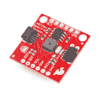
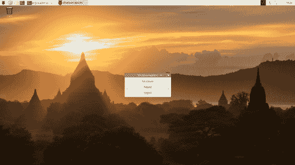
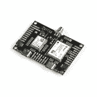

# 覆盆子酱连接指南的 Qwiic 帽子

> 原文：<https://learn.sparkfun.com/tutorials/qwiic-hat-for-raspberry-pi-hookup-guide>

## 介绍

这款 [Qwiic 的树莓派帽子](https://www.sparkfun.com/products/14459)是利用 SparkFun 的 Qwiic 生态系统的最快捷、最简单的方式，同时还能使用你已经熟悉并喜爱的树莓派。这个 Qwiic 帽子将您的 Raspberry Pi 上的 I ² C 总线(GND、3.3V、SDA 和 SCL)连接到 Qwiic 连接器阵列。它也有几个重要的引脚上的树莓皮打破了方便访问。由于 Qwiic 系统允许菊花链(只要您的设备在不同的地址)，您可以堆叠任意多的传感器，以创建一个感应电源塔！

[](https://www.sparkfun.com/products/14459) 

将**添加到您的[购物车](https://www.sparkfun.com/cart)中！**

 **### [树莓派的 SparkFun Qwiic 帽子](https://www.sparkfun.com/products/14459)

[In stock](https://learn.sparkfun.com/static/bubbles/ "in stock") DEV-14459

树莓派的 SparkFun Qwiic 帽子是进入 Qwiic 生态系统的最快捷、最简单的方式，并且仍然适用于

$6.505[Favorited Favorite](# "Add to favorites") 33[Wish List](# "Add to wish list")** **### 所需材料

按照这个连接指南，你需要任何带有 2x20 插头的树莓皮。

[](https://www.sparkfun.com/products/14643) 

### [树莓派 3 B+](https://www.sparkfun.com/products/14643)

[Out of stock](https://learn.sparkfun.com/static/bubbles/ "out of stock") DEV-14643

Raspberry Pi 3 B+在这里为您提供与以前相同的 Pi，但现在具有千兆位和 PoE 能力的以太网！

35[Favorited Favorite](# "Add to favorites") 75[Wish List](# "Add to wish list")

Pi Zero W 也可以，但是你需要确保[焊接](https://learn.sparkfun.com/tutorials/how-to-solder-through-hole-soldering)一些[插头](https://www.sparkfun.com/products/14275)到上面。

[](https://www.sparkfun.com/products/14275) 

将**添加到您的[购物车](https://www.sparkfun.com/cart)中！**

 **### [树莓 Pi GPIO 公头- 2x20](https://www.sparkfun.com/products/14275)

[In stock](https://learn.sparkfun.com/static/bubbles/ "in stock") PRT-14275

这种 2x20 公接头具有与树莓派相同的引脚数量和间距，但最好在与

$1.05[Favorited Favorite](# "Add to favorites") 18[Wish List](# "Add to wish list")****[](https://www.sparkfun.com/products/14277) 

### [树莓派零 W](https://www.sparkfun.com/products/14277)

[Out of stock](https://learn.sparkfun.com/static/bubbles/ "out of stock") DEV-14277

Raspberry Pi Zero W 仍然是你所知道和喜爱的 Pi，但尺寸大大缩小，只有 65 毫米长，30 毫米宽，而且…

44[Favorited Favorite](# "Add to favorites") 111[Wish List](# "Add to wish list")** **如果你没有任何 Qwiic 产品与之配合使用，你可能不会购买 Qwiic 帽子，对吗？如果你没有任何 Qwiic 产品，以下可能是一个不错的开始。

[](https://www.sparkfun.com/products/14348) 

### [【spark fun 环保组合 Breakout-CCS 811/BME 280(Qwiic)](https://www.sparkfun.com/products/14348)

[Out of stock](https://learn.sparkfun.com/static/bubbles/ "out of stock") SEN-14348

SparkFun CCS811/BME280 环境组合突破满足您所有的大气质量感测需求

20[Favorited Favorite](# "Add to favorites") 63[Wish List](# "Add to wish list")[](https://www.sparkfun.com/products/14495) 

将**添加到您的[购物车](https://www.sparkfun.com/cart)中！**

 **### [SparkFun Qwiic 适配器](https://www.sparkfun.com/products/14495)

[In stock](https://learn.sparkfun.com/static/bubbles/ "in stock") DEV-14495

SparkFun Qwiic 适配器提供了将任何旧 I ² C 板改造成支持 Qwiic 的板的完美方法。

$1.601[Favorited Favorite](# "Add to favorites") 53[Wish List](# "Add to wish list")****[](https://www.sparkfun.com/products/14414) 

将**添加到您的[购物车](https://www.sparkfun.com/cart)中！**

 **### [【spark fun GPS Breakout-xa 1110(Qwiic)](https://www.sparkfun.com/products/14414)

[In stock](https://learn.sparkfun.com/static/bubbles/ "in stock") GPS-14414

SparkFun XA1110 GPS Breakout 是一款 I2C 支持的小型模块，由于采用了 Qwiic Connect 系统，因此易于连接。电子邮件…

$34.955[Favorited Favorite](# "Add to favorites") 25[Wish List](# "Add to wish list")****[](https://www.sparkfun.com/products/14347) 

将**添加到您的[购物车](https://www.sparkfun.com/cart)中！**

 **### [【spark fun 光谱传感器分线点- AS7262 可见光(Qwiic)](https://www.sparkfun.com/products/14347)

[26 available](https://learn.sparkfun.com/static/bubbles/ "26 available") SEN-14347

SparkFun AS7262 可见光谱传感器突破将光谱学带到您的手掌上，比以往任何时候都更容易…

$27.952[Favorited Favorite](# "Add to favorites") 27[Wish List](# "Add to wish list")****** ******最后，您将需要我们方便的 Qwiic 电缆来轻松地将传感器连接到您的 Qwiic 帽子。以下是几个选项。

[](https://www.sparkfun.com/products/14427) 

将**添加到您的[购物车](https://www.sparkfun.com/cart)中！**

 **### [Qwiic 线缆- 100mm](https://www.sparkfun.com/products/14427)

[In stock](https://learn.sparkfun.com/static/bubbles/ "in stock") PRT-14427

这是一条 100 毫米长的 4 芯电缆，带有 1 毫米 JST 端接。它旨在将支持 Qwiic 的组件连接在一起…

$1.50[Favorited Favorite](# "Add to favorites") 32[Wish List](# "Add to wish list")****[](https://www.sparkfun.com/products/14429) 

将**添加到您的[购物车](https://www.sparkfun.com/cart)中！**

 **### [Qwiic 线缆- 500mm](https://www.sparkfun.com/products/14429)

[In stock](https://learn.sparkfun.com/static/bubbles/ "in stock") PRT-14429

这是一根 500mm 长的 4 芯电缆，带有 1mm JST 端接。它旨在将支持 Qwiic 的组件连接在一起…

$1.951[Favorited Favorite](# "Add to favorites") 25[Wish List](# "Add to wish list")****[](https://www.sparkfun.com/products/14426) 

将**添加到您的[购物车](https://www.sparkfun.com/cart)中！**

 **### [Qwiic 线缆- 50mm](https://www.sparkfun.com/products/14426)

[In stock](https://learn.sparkfun.com/static/bubbles/ "in stock") PRT-14426

这是一根 50 毫米长的 4 芯电缆，带有 1 毫米 JST 端接。它旨在将支持 Qwiic 的组件连接在一起…

$0.95[Favorited Favorite](# "Add to favorites") 29[Wish List](# "Add to wish list")****[](https://www.sparkfun.com/products/14428) 

### [Qwiic 线缆- 200mm](https://www.sparkfun.com/products/14428)

[Out of stock](https://learn.sparkfun.com/static/bubbles/ "out of stock") PRT-14428

这是一根 200 毫米长的 4 芯电缆，带有 1 毫米 JST 端接。它旨在将支持 Qwiic 的组件连接在一起…

[Favorited Favorite](# "Add to favorites") 21[Wish List](# "Add to wish list")****** ******### 必需的设置工具

作为台式机，这些设备是必需的:

*   USB 鼠标
*   USB 键盘
*   HDMI 监视器/电视/ [适配 VGA](https://www.sparkfun.com/products/12613)
*   [5V 电源](https://www.sparkfun.com/products/13831)

### 推荐阅读

如果你不熟悉 Qwiic 系统，我们推荐你在这里阅读[以获得一个概述](https://www.sparkfun.com/qwiic)。

| [](https://www.sparkfun.com/qwiic) |
| *[Qwiic 连接系统](https://www.sparkfun.com/qwiic)* |

如果你不熟悉下面的教程，我们也建议你看一看。

[](https://learn.sparkfun.com/tutorials/i2c) [### I2C](https://learn.sparkfun.com/tutorials/i2c) An introduction to I2C, one of the main embedded communications protocols in use today.[Favorited Favorite](# "Add to favorites") 128[](https://learn.sparkfun.com/tutorials/terminal-basics) [### 串行终端基础知识](https://learn.sparkfun.com/tutorials/terminal-basics) This tutorial will show you how to communicate with your serial devices using a variety of terminal emulator applications.[Favorited Favorite](# "Add to favorites") 46

## 硬件概述

Qwiic HAT 有 4 个 Qwiic 连接端口，都在同一 I ² C 总线上。除此之外，Raspberry Pi 上的一些图钉是为用户准备的。

[](https://cdn.sparkfun.com/assets/learn_tutorials/7/0/4/14459-04.jpg)

## 硬件装配

要开始使用 Qwiic 帽子，只需将它插入树莓 Pi 上的插头，确保帽子上的“USB”箭头指向树莓 Pi 上的 USB。

[](https://cdn.sparkfun.com/assets/learn_tutorials/7/0/4/Qwic_Boards_Tutorial-01.jpg)

一旦帽子插上电源，你就可以开始插入你可能有的任何支持 Qwiic 的传感器。

[](https://cdn.sparkfun.com/assets/learn_tutorials/7/0/4/Qwic_Boards_Tutorial-02.jpg)

## 获得操作系统

我们建议查看 Raspberry Pi 3 连接指南，以[安装操作系统](https://learn.sparkfun.com/tutorials/raspberry-pi-3-starter-kit-hookup-guide/all#getting-an-os)并将图像刷新到您的 microSD 卡，以获得详细说明。

[](https://learn.sparkfun.com/tutorials/raspberry-pi-3-starter-kit-hookup-guide) [### 树莓 Pi 3 入门套件连接指南

#### 2016 年 4 月 11 日](https://learn.sparkfun.com/tutorials/raspberry-pi-3-starter-kit-hookup-guide) Guide for getting going with the Raspberry Pi 3 Model B and Raspberry Pi 3 Model B+ starter kit.[Favorited Favorite](# "Add to favorites") 13

如果你从一张空白的 microSD 卡开始，你需要安装 Raspbian。如果您已经有了一个可以工作的 Raspbian 系统，请跳到下一节。请耐心等待——根据 microSD 卡的速度，每个步骤都可能需要一段时间。

1.  **下载映像** —下载您最喜欢的 Linux 发行版。对于初学者，我们建议获取 [NOOBS](https://www.raspberrypi.org/downloads/noobs/) 图像。
2.  **闪烁图像** —按照 [Raspberry Pi 3 套件连接指南的说明闪烁您的 microSD 卡](https://learn.sparkfun.com/tutorials/raspberry-pi-3-starter-kit-hookup-guide/all#getting-an-os)。你也可以按照官方的树莓派[安装说明](https://www.raspberrypi.org/documentation/installation/)进行操作。

## 配置 Pi

默认情况下，外设不开启。对于那些使用支持 Qwiic 的设备的用户，您需要启用 I2C 端口。有两种方法可以调整设置。这在我们的[树莓派 I2C 教程](https://learn.sparkfun.com/tutorials/raspberry-pi-spi-and-i2c-tutorial)中有所概述。

[](https://learn.sparkfun.com/tutorials/raspberry-pi-spi-and-i2c-tutorial) [### 树莓派 SPI 和 I2C 教程

#### 2015 . 10 . 29](https://learn.sparkfun.com/tutorials/raspberry-pi-spi-and-i2c-tutorial) Learn how to use serial I2C and SPI buses on your Raspberry Pi using the wiringPi I/O library for C/C++ and spidev/smbus for Python.[Favorited Favorite](# "Add to favorites") 24

我们已经包含了教程中的以下说明。要启用它，请按照以下步骤操作。

#### 通过桌面 GUI 进行 Raspberry Pi 配置

 您可以通过进入 **Pi 开始菜单** > **偏好设置** > **树莓 Pi 配置**来使用桌面 GUI。

[](https://cdn.sparkfun.com/assets/learn_tutorials/4/4/9/Raspberry-Pi-Configuration-User-Settings-GUI.png)*Click on image for a closer view.*

将弹出一个带有不同选项卡的窗口来调整设置。我们感兴趣的是**界面**标签。点击选项卡，为 **I2C** 选择**使能**。此时，您可以根据项目需要启用其他接口。点击**确定**按钮，同样如此。

[](https://cdn.sparkfun.com/assets/learn_tutorials/4/4/9/Raspberry-Pi-Configuration-Enable-Interfaces.png)*Click on image for a closer view.*

我们建议重新启动您的 Pi 以确保更改生效。点击 **Pi 开始菜单** > **首选项** > **关机**。因为我们只需要重启，所以点击**重启**按钮。

|  | [](https://cdn.sparkfun.com/assets/learn_tutorials/4/4/9/Raspberry-Pi-Menu-Shutdown.png) |
| *关机* | *关机、重启、注销* |

*Click on images for a closer view.*

#### raspi-配置工具通过终端

同样，我们可以使用`raspi-config`来启用它。

1.  运行`sudo raspi-config`。
2.  使用向下箭头选择`5 Interfacing Options`
3.  向下箭头指向`P5 I2C`。
4.  当它要求您启用 I2C 时，选择`yes`
5.  如果询问是否自动加载内核模块，也选择`yes`。
6.  使用向右箭头选择`<Finish>`按钮。
7.  当它要求重启时，选择`yes`。

[](https://cdn.sparkfun.com/assets/learn_tutorials/4/4/9/i2c-menu2.png)*Raspi-config for I2C*

系统将重新启动。当它重新启动时，登录并输入以下命令

```
language:bash
ls /dev/*i2c* 
```

Pi 应该响应

```
language:bash
/dev/i2c-1 
```

它表示用户模式的 I2C 界面。

## 扫描 I2C 设备

如果你正在使用 Raspberry Pi 快速连接到 I ² C 设备，最好的开始是扫描总线上的 I ² C 设备。

### 公用事业

有一组命令行实用程序可以帮助 I ² C 接口工作。你可以通过 apt 包管理器得到它们。输入以下命令。

```
language:bash
sudo apt-get install -y i2c-tools 
```

特别是，`i2cdetect`程序将探测总线上的所有地址，并报告是否存在任何设备。在命令行中输入以下命令。`-y`标志将禁用交互模式，这样您就不必等待确认。`1`表示我们正在扫描 I ² C 总线 1 上的 I ² C 设备(如 i2c-1)。

```
language:bash
i2cdetect -y 1 
```

您将从您的 Raspberry Pi 获得类似于下面的输出。

```
language:bash
pi@raspberrypi:~/$ i2cdetect -y 1
     0  1  2  3  4  5  6  7  8  9  a  b  c  d  e  f
00:          -- -- -- -- -- -- -- -- -- -- -- -- --
10: -- -- -- -- -- -- -- -- -- -- -- -- -- -- -- --
20: -- -- -- -- -- -- -- -- -- -- -- -- -- -- -- --
30: -- -- -- -- -- -- -- -- -- -- -- -- -- -- -- --
40: -- -- -- -- -- -- -- -- -- -- -- -- -- -- -- --
50: -- -- -- -- -- -- -- -- -- -- -- -- -- -- -- --
60: 60 -- -- -- -- -- -- -- -- -- -- -- -- -- -- --
70: -- -- -- -- -- -- -- -- 
```

该图表明在地址 **0x60** 有一个外设。根据 I ² C 总线上连接的设备，您的地址可能会有所不同。对于高级用户，您可以尝试使用`i2cget`、`i2cset`和`i2cdump`命令来读写其寄存器。

### Qwiic 复制驱动程序

现在您已经在 Pi 上设置了 I ² C，您可以开始在您的 Pi 上编程您的 Qwiic 设备，或者如果您想从一些示例开始，我们在下面链接的 GitHub 资源库中提供了大量用于 Qwiic 的 Python 驱动程序。你可以在[这篇博文](https://www.sparkfun.com/news/2958)中阅读更多关于 Python for spark fun Qwiic 系统的内容。

[SparkFun Qwiic Py GitHub Repo](https://github.com/sparkfun/Qwiic_Py)

## 资源和更进一步

有关更多信息，请查看以下资源:

*   [Qwiic 帽子示意图(PDF)](https://cdn.sparkfun.com/assets/b/6/8/c/8/Qwiic_HAT_for_Raspberry_Pi.pdf)
*   [Qwiic 帽子鹰文件(ZIP)](https://cdn.sparkfun.com/assets/4/3/8/6/2/Qwiic_HAT_for_Raspberry_Pi_1.zip)
*   [Qwiic 系统登陆页面](https://www.sparkfun.com/qwiic)
*   [Qwiic HAT GitHub 知识库](https://github.com/sparkfun/Qwiic_Hat_for_Raspberry_Pi)

既然你已经准备好了你的 Qwiic 帽子，是时候把它挂在一些支持 Qwiic 的产品上了。

[](https://www.sparkfun.com/products/16653) 

将**添加到您的[购物车](https://www.sparkfun.com/cart)中！**

 **### [spark fun Top pHAT for Raspberry Pi](https://www.sparkfun.com/products/16653)

[In stock](https://learn.sparkfun.com/static/bubbles/ "in stock") DEV-16653

SparkFun Top pHAT 是 Raspberry Pi 或任何 2x20 GPIO SBC 的基础机器学习插件！

$49.95[Favorited Favorite](# "Add to favorites") 20[Wish List](# "Add to wish list")****[](https://www.sparkfun.com/products/17259) 

将**添加到您的[购物车](https://www.sparkfun.com/cart)中！**

 **### [柔性 Qwiic 线缆- 100mm](https://www.sparkfun.com/products/17259)

[In stock](https://learn.sparkfun.com/static/bubbles/ "in stock") PRT-17259

这种极化 I2C 电缆绝缘是由硅制成的，比我们原来的 Qwiic 电缆更灵活，特别是在

$1.60[Favorited Favorite](# "Add to favorites") 8[Wish List](# "Add to wish list")****[](https://www.sparkfun.com/products/18295) 

将**添加到您的[购物车](https://www.sparkfun.com/cart)中！**

 **### [spark fun OpenLog Artemis Kit](https://www.sparkfun.com/products/18295)

[In stock](https://learn.sparkfun.com/static/bubbles/ "in stock") KIT-18295

SparkFun OpenLog Artemis 工具包旨在为您提供使用 OpenLog A…

$90.952[Favorited Favorite](# "Add to favorites") 6[Wish List](# "Add to wish list")****[](https://www.sparkfun.com/products/20167) 

将**添加到您的[购物车](https://www.sparkfun.com/cart)中！**

 **### [u-blox ZED-F9P NEO-D9S 组合突围](https://www.sparkfun.com/products/20167)

[Out of stock](https://learn.sparkfun.com/static/bubbles/ "out of stock") SPX-20167

这款多功能组合分线架将 u-blox ZED-F9P 多波段高精度 GNSS 模块与 NEO-D9S L 波段 GNSS cor……

$334.95[Favorited Favorite](# "Add to favorites") 5[Wish List](# "Add to wish list")******** ********### 但是我已经有传感器了！

如果你已经有一把 SparkFun 传感器和零件？多年来，SparkFun 一直在我们所有的 I2C 板上安装我们的标准 GND/VCC/SDA/SCL 引脚排列。这使得它可以连接一个 Qwiic 适配器，将您的 SparkFun I ² C 传感器或执行器安装到 Qwiic 系统上。

以下是具有标准 I ² C 引脚排列并将与 [Qwiic 适配板](https://www.sparkfun.com/products/14495)配合使用的主板列表:

*   [9DoF Stick IMU - LSM9DS1](https://www.sparkfun.com/products/13944)
*   [9 自由度 IMU - MPU-9250](https://www.sparkfun.com/products/13762)
*   [6 自由度 IMU - LSM303C](https://www.sparkfun.com/products/13303)
*   [6 自由度 IMU - LSM6DS3](https://www.sparkfun.com/products/13339)
*   [三轴加速度计- LIS3DH](https://www.sparkfun.com/products/13963)
*   [三轴磁力仪- MAG3110](https://www.sparkfun.com/products/12670)
*   [三轴磁力仪- MLX90393](https://www.sparkfun.com/products/14160)
*   [罗盘模块- HMC6343](https://www.sparkfun.com/products/12916)
*   [大气传感器- BME280](https://www.sparkfun.com/products/13676)
*   [气压传感器- MS5803-14BA](https://www.sparkfun.com/products/12909)
*   [气压传感器- T5403](https://www.sparkfun.com/products/12039)
*   [湿度和温度传感器- Si7021](https://www.sparkfun.com/products/13763)
*   [数字温度传感器- TMP102](https://www.sparkfun.com/products/13314)
*   [粒子传感器- MAX30105](https://www.sparkfun.com/products/14045)
*   [空气质量传感器- CCS811](https://www.sparkfun.com/products/14181)
*   [ToF 测距仪- VL6180](https://www.sparkfun.com/products/12785)
*   [触觉电机驱动器- DRV2605L](https://www.sparkfun.com/products/14031)
*   [微型有机发光二极管显示器](https://www.sparkfun.com/products/13003)
*   [RGB 和手势传感器- APDS-9960](https://www.sparkfun.com/products/12787)
*   [RGB 光传感器- ISL29125](https://www.sparkfun.com/products/12829)
*   [LED 驱动器- LP55231](https://www.sparkfun.com/products/14031)
*   [DAC 分线点- MCP4725](https://www.sparkfun.com/products/12918)
*   [16 输出 I/O 扩展器- SX1509](https://www.sparkfun.com/products/13601)
*   [电池保姆- BQ24075](https://www.sparkfun.com/products/13777)

查看相关教程:

[](https://learn.sparkfun.com/tutorials/raspberry-pi-spi-and-i2c-tutorial) [### 树莓派 SPI 和 I2C 教程

#### 2015 . 10 . 29](https://learn.sparkfun.com/tutorials/raspberry-pi-spi-and-i2c-tutorial) Learn how to use serial I2C and SPI buses on your Raspberry Pi using the wiringPi I/O library for C/C++ and spidev/smbus for Python.[Favorited Favorite](# "Add to favorites") 24************************