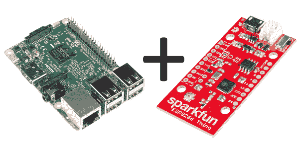

# 使用 Flask 向 Raspberry Pi 发送数据

> 原文：<https://learn.sparkfun.com/tutorials/using-flask-to-send-data-to-a-raspberry-pi>

## 介绍

在本教程中，我们将向您展示如何通过内部 WiFi 网络将数据从廉价的 WiFi 节点发送到 Raspberry Pi。它依赖于用于 [Python](https://www.sparkfun.com/python) 的 Flask 框架，这是一种创建可以执行 Python 脚本的 web 应用程序的相对简单易用的方法。

我们就用一个[树莓 Pi 3](https://www.sparkfun.com/products/13825) 和 [SparkFun ESP8266 的东西](https://www.sparkfun.com/products/13231)来演示一下。我们将从事物板向 RasPi 发送一个非常简单的信号——只是一个打开或关闭连接的 LED 的信号。希望从这个例子中可以明显看出如何发送更复杂的信号，以及如何在收到信号后运行更复杂的脚本。

### 推荐阅读

在你着手这个项目之前，你可能想看看其他一些教程。

 [### 如何焊接:通孔焊接](https://learn.sparkfun.com/tutorials/how-to-solder-through-hole-soldering) This tutorial covers everything you need to know about through-hole soldering.[Favorited Favorite](# "Add to favorites") 70 [### ESP8266 事物连接指南](https://learn.sparkfun.com/tutorials/esp8266-thing-hookup-guide) An overview of SparkFun's ESP8266 Thing - a development board for the Internet of...Things. This tutorial explains the circuitry driving the board, and how to get it up and running in an Arduino environment.[Favorited Favorite](# "Add to favorites") 34 [### 树莓 gPIo](https://learn.sparkfun.com/tutorials/raspberry-gpio) How to use either Python or C++ to drive the I/O lines on a Raspberry Pi.[Favorited Favorite](# "Add to favorites") 17 [### 树莓 Pi 3 入门套件连接指南](https://learn.sparkfun.com/tutorials/raspberry-pi-3-starter-kit-hookup-guide) Guide for getting going with the Raspberry Pi 3 Model B and Raspberry Pi 3 Model B+ starter kit.[Favorited Favorite](# "Add to favorites") 13

### 所需材料

你需要这个愿望清单上的项目来完成这个教程。可以进行替换；例如，可以用一个 [Raspberry Pi Zero W](https://www.sparkfun.com/products/14277) 来代替 Pi 3，并且可以采购单独的组件来代替完整的入门套件。