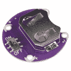
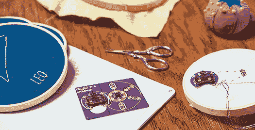
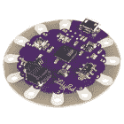
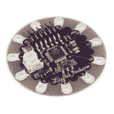
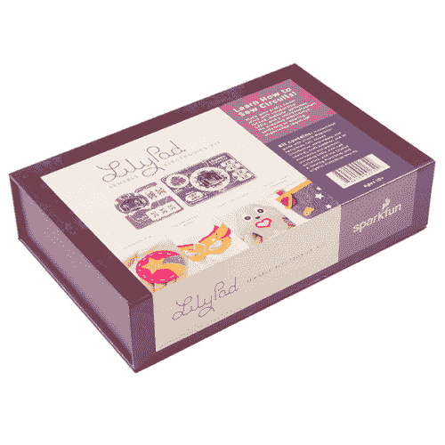

# LilyPad 入门

> 原文：<https://learn.sparkfun.com/tutorials/getting-started-with-lilypad>

## 介绍

LilyPad 系统是一套可缝合的电子部件，旨在帮助您构建柔软、可缝合、互动的电子纺织品项目。使用 LilyPad 是一种通过手工艺或纤维艺术的镜头来实验电子产品的好方法。每个 LilyPad 片具有大导电缝纫片，以便于缝纫，且具有圆形形状，以便不钩住织物或剪断线。在本指南中，我们将带您了解 LilyPad 系统的特性和一些基本概念。

[https://www.youtube.com/embed/FE9PpRbRJ-A/?autohide=1&border=0&wmode=opaque&enablejsapi=1](https://www.youtube.com/embed/FE9PpRbRJ-A/?autohide=1&border=0&wmode=opaque&enablejsapi=1)

LilyPad 系统是 Leah Buechley 在科罗拉多大学博尔德分校攻读计算机科学博士学位时设计的。该套件的商业版本于 2007 年推出，由 Leah 和 SparkFun Electronics 合作设计。

*LilyPad Creator [Leah Buechley](http://leahbuechley.com/)*

## LilyPad 基础:电路的零件

每一个 LilyPad 电路，无论多么复杂，都有三个基本部分: **(1)** 一个电源， **(2)** 电子元件之间的导电路径(导电线缝合)，以及 **(3)** 连接在一起的 LilyPad 片，用于点亮、发出声音或执行其他行为(您项目的“功能”)。

### 1.选择电源

所有 LilyPad 项目都需要一个电源——大多数使用 3V CR2032 纽扣电池或 3.7V 锂聚合物可充电电池。你需要哪种电源解决方案取决于几个因素:项目的规模、你选择的 LilyPad Arduino 的类型，以及你是愿意更换电池还是给电池充电。LilyPad 系列包括一个独立的可缝合硬币电池座或内置电池连接，用于 3V 硬币电池或 3.7V 锂聚合物电池(在部分 LilyPad 板上提供)。

 

将**添加到您的[购物车](https://www.sparkfun.com/cart)中！**

 **### [LilyPad 硬币电池座-开关式- 20mm](https://www.sparkfun.com/products/13883)

[In stock](https://learn.sparkfun.com/static/bubbles/ "in stock") DEV-13883

当然，你那闪烁的、带有芯片曲调的 T 恤衫在聚会上真的很酷...但是在某些时候你需要关掉它。还有…

$2.1012[Favorited Favorite](# "Add to favorites") 49[Wish List](# "Add to wish list")**** 

将**添加到您的[购物车](https://www.sparkfun.com/cart)中！**

 **### [LilyPad 简单动力](https://www.sparkfun.com/products/11893)

[In stock](https://learn.sparkfun.com/static/bubbles/ "in stock") DEV-11893

LilyPad Simple Power 是一个简单的 e-textile 板，充电速率为 500mA，可让您连接和充电 lipo 电池…

$11.50[Favorited Favorite](# "Add to favorites") 18[Wish List](# "Add to wish list")**** ****### 2.导电螺纹连接

LilyPad 板使用导电线缝合在一起，这是一种由不锈钢纤维制成的特殊线。使用导电线代替铜线将 LilyPad 片连接在一起，在组件之间提供了柔软和灵活的连接，并直接结合到织物中。每个 LilyPad 片有一个大的缝纫片，以适应各种针的尺寸，用于连接导线。

 

将**添加到您的[购物车](https://www.sparkfun.com/cart)中！**

 **### [【导电线- 60g(不锈钢)](https://www.sparkfun.com/products/11791)

[In stock](https://learn.sparkfun.com/static/bubbles/ "in stock") DEV-11791

这是大约 360 码长的导电线，由不锈钢纤维纺成，缠绕在线轴上。你可以用它来创作…

$51.5010[Favorited Favorite](# "Add to favorites") 39[Wish List](# "Add to wish list")**** 

将**添加到您的[购物车](https://www.sparkfun.com/cart)中！**

 **### [导电线筒- 30ft(不锈钢)](https://www.sparkfun.com/products/10867)

[In stock](https://learn.sparkfun.com/static/bubbles/ "in stock") DEV-10867

这是由不锈钢纤维纺成的 30 英尺长的导电线，缠绕在塑料线轴上。用它来缝合你所有的…

$3.953[Favorited Favorite](# "Add to favorites") 44[Wish List](# "Add to wish list")**** 

将**添加到您的[购物车](https://www.sparkfun.com/cart)中！**

 **### [导电线线轴- 12m(光滑，不锈钢)](https://www.sparkfun.com/products/13814)

[In stock](https://learn.sparkfun.com/static/bubbles/ "in stock") DEV-13814

这是由不锈钢纤维纺成的 12 米长的光滑导电线，缠绕在塑料线轴上。用它来缝合…

$4.95[Favorited Favorite](# "Add to favorites") 34[Wish List](# "Add to wish list")****** ******在 [Lilypad 基础:电子缝纫教程](https://learn.sparkfun.com/tutorials/lilypad-basics-e-sewing)中了解更多关于用导电线缝纫的信息。

 [### LilyPad 基础:电子缝纫](https://learn.sparkfun.com/tutorials/lilypad-basics-e-sewing) Learn how to use conductive thread with LilyPad components.[Favorited Favorite](# "Add to favorites") 16

### 3.百合花碎片

LilyPad 系列包括各种用于创意项目的可缝合组件。从各种颜色的 led、按钮、开关、传感器、蜂鸣器和控制器(Arduino)板中进行选择。点击查看所有的 LilyPad 单品[。您选择在项目中构建哪些部分将取决于您个人的愿景和目标。请继续阅读，了解更多关于不同类型的 LilyPad 项目。](https://www.sparkfun.com/lilypad_products)

*View the full line of LilyPad boards [here](https://www.sparkfun.com/lilypad_products).*

## LilyPad 项目的类型

LilyPad 项目可以分为三大类: **(1)** e 缝、 **(2)** 预编程、用 Arduino 编程的 **(3)** 。请阅读接下来的几节，了解每种项目类型的更多详细信息。

## 电子缝纫

不用编程，尝试用导电线缝纫的一个好方法是创建电子缝纫项目。

LilyPad LEDs 和 LilyPad 硬币电池座将点亮一个项目，可能性可以扩展到包括按钮或开关等简单的互动元素，您可以购买或自己制作。如果你是缝纫新手，或者想创造一个快速简单的发光工艺，我们推荐电子缝纫项目。

以下是一些可以尝试的电子缝纫项目:

 [### 发光长毛绒](https://learn.sparkfun.com/tutorials/light-up-plush) Craft a light-up plush with LilyPad LEDs controlled by pressing a button and sliding a switch in the creature's hands.[Favorited Favorite](# "Add to favorites") 8 [### 发光针](https://learn.sparkfun.com/tutorials/glowing-pin) Create a quick and easy piece of e-textile art using a LilyPad LED, battery holder, conductive thread, and coin cell battery.[Favorited Favorite](# "Add to favorites") 4 [### 照明面罩](https://learn.sparkfun.com/tutorials/illuminated-mask) Use LilyPad LEDs, a switched battery holder, and coin cell battery to make a fun light up mask for your next costume party.[Favorited Favorite](# "Add to favorites") 6

#### 建议的材料:

*   针
*   剪刀
*   毛毡或织物
*   热熔胶和胶枪
*   导电线
*   纽扣电池
*   LilyPad 硬币电池座
*   LilyPad 发光二极管
*   可选:LilyPad 按钮板、LilyPad 滑动开关、金属按扣、导电线

## 预编程电路

如果你准备用 led 尝试一些更闪亮的效果，或者探索编程项目如何工作而不自己编写代码，预编程的 LilyPad 板是一个很好的选择。

LilyPad 系列包括四款项目就绪的产品: [LilyTiny](https://www.sparkfun.com/products/10899) 、 [LilyTwinkle](https://www.sparkfun.com/products/11364) 、 [LilyTwinkle ProtoSnap](https://www.sparkfun.com/products/11590) 和[lily mini proto snap](https://www.sparkfun.com/products/14063)——只需缝合和发光！

 

将**添加到您的[购物车](https://www.sparkfun.com/cart)中！**

 **### [LilyTiny](https://www.sparkfun.com/products/10899)

[In stock](https://learn.sparkfun.com/static/bubbles/ "in stock") DEV-10899

LilyTiny 是一个很小的 LilyPad 板，旨在为您的项目添加华丽的功能，而不会占用太多的资源

$5.9512[Favorited Favorite](# "Add to favorites") 35[Wish List](# "Add to wish list")**** 

将**添加到您的[购物车](https://www.sparkfun.com/cart)中！**

 **### 

[In stock](https://learn.sparkfun.com/static/bubbles/ "in stock") DEV-11364

LilyTwinkle 是一个很小的 LilyPad 板，旨在为您的项目添加一些亮点。即使它只有几米那么小…

$5.959[Favorited Favorite](# "Add to favorites") 21[Wish List](# "Add to wish list")**** 

将**添加到您的[购物车](https://www.sparkfun.com/cart)中！**

 **### [LilyPad LilyMini 原声](https://www.sparkfun.com/products/14063)

[In stock](https://learn.sparkfun.com/static/bubbles/ "in stock") DEV-14063

LilyMini ProtoSnap 是开始学习创建交互式电子纺织品电路的好方法，在您开始之前…

$17.503[Favorited Favorite](# "Add to favorites") 15[Wish List](# "Add to wish list")**** 

将**添加到您的[购物车](https://www.sparkfun.com/cart)中！**

 **### 

[In stock](https://learn.sparkfun.com/static/bubbles/ "in stock") DEV-11590

ProtoSnap 系列是一种无需试验板即可构建项目原型的新方法。所有东西都连接在一个单独的业务对象上…

$19.501[Favorited Favorite](# "Add to favorites") 18[Wish List](# "Add to wish list")******** ********LilyTiny 和 LilyTwinkle 是小的 LilyPad 板，上面预装了程序。只要将它们连接到 LilyPad 硬币电池座和一些 LilyPad LEDs 上，就可以看到 led 上显示的不同光图案。LilyTiny 和 LilyTwinkle 都使用相同的电路板和控制器，但它们附带的代码不同。

### 莉莉蒂尼

LilyTiny 为每个编号的缝纫标签设置了不同的灯光图案。选项卡 0 控制“呼吸”渐变，选项卡 1 闪烁心跳模式，选项卡 2 创建开/关闪烁，选项卡 3 产生随机渐变效果(闪烁)。LilyTiny 是在项目中尝试不同照明模式的绝佳方式。

 

将**添加到您的[购物车](https://www.sparkfun.com/cart)中！**

 **### [LilyTiny](https://www.sparkfun.com/products/10899)

[In stock](https://learn.sparkfun.com/static/bubbles/ "in stock") DEV-10899

LilyTiny 是一个很小的 LilyPad 板，旨在为您的项目添加华丽的功能，而不会占用太多的资源

$5.9512[Favorited Favorite](# "Add to favorites") 35[Wish List](# "Add to wish list")** **试试看下面的 LilyTiny 演示。

[https://www.youtube.com/embed/8zV49FkbQzE/?autohide=1&border=0&wmode=opaque&enablejsapi=1](https://www.youtube.com/embed/8zV49FkbQzE/?autohide=1&border=0&wmode=opaque&enablejsapi=1)

*See the LilyTiny in Action*

以下是一些可供尝试的 LilyTiny 项目:

 [### LDK 实验 6:微控制器电路](https://learn.sparkfun.com/tutorials/ldk-experiment-6-microcontroller-circuits) Learn how to build a simple microcontroller circuit using the pre-programmed LilyTiny Board[Favorited Favorite](# "Add to favorites") 5 [### LilyTiny 毛绒怪物](https://learn.sparkfun.com/tutorials/lilytiny-plush-monster) Craft a stuffed monster while exploring the LilyTiny preprogrammed microcontroller. This is a project based on the Plush Monster Activity created at MIT's High-Low Tech Lab by Emily Lovell, Jie Qi, and Natalie Freed.[Favorited Favorite](# "Add to favorites") 12 [### 闪烁星座](https://learn.sparkfun.com/tutorials/twinkle-zodiac-constellation) Create a quick and easy piece of e-textile art based on a Zodiac sign using a LilyTiny, LilyPad LEDs, battery holder, conductive thread, and coin cell battery.[Favorited Favorite](# "Add to favorites") 12

#### 建议的材料:

*   针
*   剪刀
*   毛毡或织物
*   热熔胶和胶枪
*   导电线
*   莉莉蒂尼
*   LilyPad 硬币电池座
*   纽扣电池
*   LilyPad 发光二极管

### 百合

如果你正在寻找一个项目的整体闪光效果，LilyTwinkle 的所有四个编号标签都编程有随机褪色效果，模仿闪烁的星星或萤火虫。LilyTwinkle 还提供了 LilyTwinkle ProtoSnap，这是一个预连线板，包含测试和缝合 LilyTwinkle 项目所需的一切。

 

将**添加到您的[购物车](https://www.sparkfun.com/cart)中！**

 **### 

[In stock](https://learn.sparkfun.com/static/bubbles/ "in stock") DEV-11364

LilyTwinkle 是一个很小的 LilyPad 板，旨在为您的项目添加一些亮点。即使它只有几米那么小…

$5.959[Favorited Favorite](# "Add to favorites") 21[Wish List](# "Add to wish list")** **试着看看下面的 LilyTwinkle 的演示。

[https://www.youtube.com/embed/liS3mu7uifk/?autohide=1&border=0&wmode=opaque&enablejsapi=1](https://www.youtube.com/embed/liS3mu7uifk/?autohide=1&border=0&wmode=opaque&enablejsapi=1)

*See the LilyTwinkle in Action*

以下是一些可供尝试的 LilyTwinkle 项目:

 [### 软电路:LED 感觉披萨](https://learn.sparkfun.com/tutorials/soft-circuits-led-feelings-pizza) Here we will learn how to say how you feel with pizza. Electric pizza.[Favorited Favorite](# "Add to favorites") 4 [### 萤火虫罐组装指南](https://learn.sparkfun.com/tutorials/firefly-jar-assembly-guide) Make a soft circuit firefly jar with conductive thread, LEDs, and the LilyTwinkle 2 [### 闪光的不给糖就捣蛋包](https://learn.sparkfun.com/tutorials/twinkling-trick-or-treat-bag) Make a light up goodie bag with conductive thread, LEDs, and the LilyTwinkle 7

#### 建议的材料:

*   针
*   剪刀
*   毛毡或织物
*   热熔胶和胶枪
*   导电线
*   LilyTwinkle 或 LilyTwinkle 原始快照
*   LilyPad 硬币电池座(如果使用 ProtoSnap，则包括在内)
*   币形电池(如果使用 ProtoSnap，则包括在内)
*   LilyPad LEDs(如果使用 ProtoSnap，则包括在内)

### LilyMini 原型快照

 

将**添加到您的[购物车](https://www.sparkfun.com/cart)中！**

 **### [LilyPad LilyMini 原声](https://www.sparkfun.com/products/14063)

[In stock](https://learn.sparkfun.com/static/bubbles/ "in stock") DEV-14063

LilyMini ProtoSnap 是开始学习创建交互式电子纺织品电路的好方法，在您开始之前…

$17.503[Favorited Favorite](# "Add to favorites") 15[Wish List](# "Add to wish list")** **如果想要更具互动性的东西，可以试试 lily mini proto snap——一种预连线、预编程的 LilyPad 板，上面有 LilyPad 光传感器和 LilyPad 按钮。LilyMini 包括一个内置的硬币电池座，以消除额外的缝纫。使用预连线连接测试电路，然后拆开并缝合到项目中。LilyMini ProtoSnap 有三种预编程模式(由内置的 RGB LED 指示):白色(所有 LED 都打开)、洋红色(LED 以“呼吸”模式淡入淡出，速度受覆盖光传感器的影响)和青色(当光传感器被覆盖时，LED 闪烁)。

[https://www.youtube.com/embed/tL7klrrHkR8/?autohide=1&border=0&wmode=opaque&enablejsapi=1](https://www.youtube.com/embed/tL7klrrHkR8/?autohide=1&border=0&wmode=opaque&enablejsapi=1)

*See the LilyMini ProtoSnap in Action*

以下是一些可以尝试的 LilyMini 项目:

 [### LilyMini ProtoSnap 连接指南](https://learn.sparkfun.com/tutorials/lilymini-protosnap-hookup-guide) Explore the LilyPad LilyMini ProtoSnap and learn how to use it.[Favorited Favorite](# "Add to favorites") 6 [### 带 LilyMini ProtoSnap 的夜光三角旗](https://learn.sparkfun.com/tutorials/night-light-pennant-with-lilymini-protosnap) Use the pre-programmed LilyMini ProtoSnap to make an interactive pennant that reacts to ambient light levels.[Favorited Favorite](# "Add to favorites") 5

#### 建议的材料:

*   针
*   剪刀
*   毛毡或织物
*   热熔胶和胶枪
*   导电线
*   LilyMini ProtoSnap(包括纽扣电池)

## 用 Arduino 编程

有一个自定义项目的想法，并准备编程？LilyPad 系列有多种 LilyPad Arduino 微控制器可供选择，它们都与免费的 Arduino 软件兼容。

[LilyPad ProtoSnap Plus](https://www.sparkfun.com/products/14346) 是一个开始项目原型制作的好地方——它包括七个预先连接到 LilyPad 微控制器的 LilyPad 板，用于在缝纫前试验代码。

 

将**添加到您的[购物车](https://www.sparkfun.com/cart)中！**

 **### [LilyPad ProtoSnap 加](https://www.sparkfun.com/products/14346)

[In stock](https://learn.sparkfun.com/static/bubbles/ "in stock") DEV-14346

LilyPad ProtoSnap Plus 是一个可缝合的电子原型板，您可以使用它来探索电路和编程，测试

$42.95[Favorited Favorite](# "Add to favorites") 10[Wish List](# "Add to wish list")** **LilyPad 生态系统还包括四个独立的 LilyPad 控制器， [LilyPad Arduino USB](https://www.sparkfun.com/products/12049) 、 [LilyPad Arduino 328 主板](https://www.sparkfun.com/products/13342)、 [LilyPad Arduino 简单板](https://www.sparkfun.com/products/10274)和 [LilyPad Arduino 简单卡](https://www.sparkfun.com/products/10941)。这些控制板可以连接到大多数 LilyPad 板，用于照明、发声或感应项目。

 

将**添加到您的[购物车](https://www.sparkfun.com/cart)中！**

 **### [lily pad Arduino USB-atmega 32 u 4 板卡](https://www.sparkfun.com/products/12049)

[Out of stock](https://learn.sparkfun.com/static/bubbles/ "out of stock") DEV-12049

LilyPad 是一种可穿戴的电子纺织技术，设计有大型连接垫，允许它们缝进衣服和公司

$27.957[Favorited Favorite](# "Add to favorites") 39[Wish List](# "Add to wish list")**** 

将**添加到您的[购物车](https://www.sparkfun.com/cart)中！**

 **### [LilyPad Arduino 328 主板](https://www.sparkfun.com/products/13342)

[In stock](https://learn.sparkfun.com/static/bubbles/ "in stock") DEV-13342

LilyPad Arduino 328 主板是一款 Arduino 编程的微控制器，旨在轻松集成到电子纺织品中…

$17.502[Favorited Favorite](# "Add to favorites") 34[Wish List](# "Add to wish list")**** 

### [LilyPad Arduino 简易棋盘](https://www.sparkfun.com/products/retired/10274)

[Retired](https://learn.sparkfun.com/static/bubbles/ "Retired") DEV-10274

这是 LilyPad Arduino 简易板。它由带有 Arduino 引导程序的 ATmega328 控制。它的针脚比…少

**Retired**[Favorited Favorite](# "Add to favorites") 12[Wish List](# "Add to wish list") 

### [lily pad Arduino simple snap](https://www.sparkfun.com/products/retired/10941)

[Retired](https://learn.sparkfun.com/static/bubbles/ "Retired") DEV-10941

LilyPad SimpleSnap 是一种新的、简单的方法，可以用模块化的、可拆卸的 LilyPad 创建电子纺织品项目…

1 **Retired**[Favorited Favorite](# "Add to favorites") 10[Wish List](# "Add to wish list")**** ****查看[为您的项目选择 LilyPad Arduino】以并排比较每种板的功能。](https://learn.sparkfun.com/tutorials/choosing-a-lilypad-arduino-for-your-project)

 [### 为您的项目选择 LilyPad Arduino

#### 2015 . 10 . 27](https://learn.sparkfun.com/tutorials/choosing-a-lilypad-arduino-for-your-project) Not sure which LilyPad Arduino is right for you? We'll discuss the features of each and help you decide.[Favorited Favorite](# "Add to favorites") 13

## 资源和更进一步

### 从工具包开始

LilyPad 可缝制电子套件—包括制作 4 个电子缝纫项目所需的一切:发光针、发光面具、发光毛绒和夜灯三角旗(带 LilyMini)。还包括工艺用品。

 

将**添加到您的[购物车](https://www.sparkfun.com/cart)中！**

 **### [LilyPad 可缝电子套装](https://www.sparkfun.com/products/13927)

[In stock](https://learn.sparkfun.com/static/bubbles/ "in stock") KIT-13927

LilyPad 可缝制电子套件让您通过以下方式探索电子缝纫和电子纺织品的奇妙世界

$106.959[Favorited Favorite](# "Add to favorites") 39[Wish List](# "Add to wish list")** **### 规划您的项目

查看[规划可穿戴电子项目](https://learn.sparkfun.com/tutorials/planning-a-wearable-electronics-project)获取头脑风暴和原型制作技巧，以及技术考虑。

 [### 规划可穿戴电子项目

#### 2015 年 8 月 13 日](https://learn.sparkfun.com/tutorials/planning-a-wearable-electronics-project) Tips and tricks for brainstorming and creating a wearables project.[Favorited Favorite](# "Add to favorites") 25

### 获得灵感

看看我们的 [LilyPad 项目图库](https://www.sparkfun.com/lilypad_gallery)浏览用 LilyPad 制作的项目，或者阅读一些 [SparkFun 在 LilyPad 和可穿戴设备上的博文](https://www.sparkfun.com/news/tags/lilypad)。

********************************