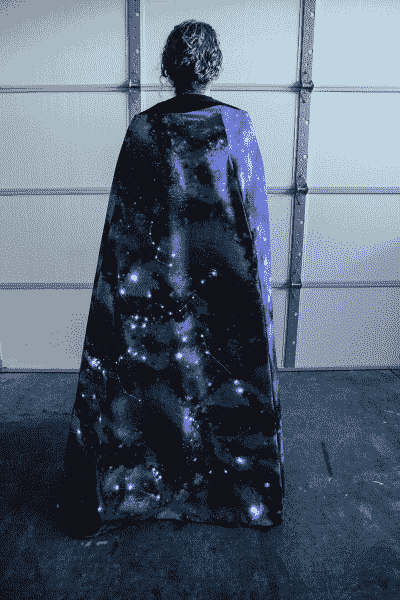

# 夜空万圣节服装

> 原文：<https://learn.sparkfun.com/tutorials/night-sky-halloween-costume>

## 介绍

在这个项目中，我们将使用导电线将[lily pad led](https://www.sparkfun.com/products/13902)连接到一个 [LilyTiny](https://www.sparkfun.com/products/10899) ，由 [LilyPad 电池座](https://www.sparkfun.com/products/13883)供电。按照下面的逐步说明制作您自己的。

**Heads up!** This project is designed for advanced sewers who have experience working with LilyPad products.

设计和建造时间:3-5 周

[https://www.youtube.com/embed/IIS0gVrKdlM/?autohide=1&border=0&wmode=opaque&enablejsapi=1](https://www.youtube.com/embed/IIS0gVrKdlM/?autohide=1&border=0&wmode=opaque&enablejsapi=1)

### 推荐阅读

如果这是你的第一个可缝合电子项目，我们建议你阅读我们的 LilyPad 基础教程。

 [### 极性](https://learn.sparkfun.com/tutorials/polarity) An introduction to polarity in electronic components. Discover what polarity is, which parts have it, and how to identify it.[Favorited Favorite](# "Add to favorites") 52 [### 串联和并联电路](https://learn.sparkfun.com/tutorials/series-and-parallel-circuits) An introduction into series and parallel circuits.[Favorited Favorite](# "Add to favorites") 58 [### 电子纺织品的绝缘技术](https://learn.sparkfun.com/tutorials/insulation-techniques-for-e-textiles) Learn a few different ways to protect your conductive thread and LilyPad components in your next wearables project.[Favorited Favorite](# "Add to favorites") 16 [### 规划可穿戴电子项目](https://learn.sparkfun.com/tutorials/planning-a-wearable-electronics-project) Tips and tricks for brainstorming and creating a wearables project.[Favorited Favorite](# "Add to favorites") 25 [### 为 LilyPad LED 项目供电](https://learn.sparkfun.com/tutorials/powering-lilypad-led-projects) Learn how to calculate how many LEDs your LilyPad project can power and how long it will last.[Favorited Favorite](# "Add to favorites") 8 [### LilyPad 基础:电子缝纫](https://learn.sparkfun.com/tutorials/lilypad-basics-e-sewing) Learn how to use conductive thread with LilyPad components.[Favorited Favorite](# "Add to favorites") 16

## 材料和工具

让我们来看一下将你的项目组合在一起所需要的所有东西。

### 夜空服装所需物品: