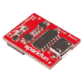

# AS726X 近红外/可见光谱传感器连接指南

> 原文：<https://learn.sparkfun.com/tutorials/as726x-nirvi>

## 介绍

AMS 的 AS726X 光谱传感器为消费者带来了一个前所未有的研究领域——光谱学！现在比以往任何时候都更容易测量和表征不同材料如何吸收和反射不同波长的光。不知道你想看光谱的哪一部分？你很幸运！Sparkfun 搭载了两种不同口味的光谱仪。 [AS7262](https://www.sparkfun.com/products/14347) 检测可见光范围内的波长，而 [AS7263](https://www.sparkfun.com/products/14351) 检测近红外(NIR)范围内低于可见光范围的波长。

[](https://www.sparkfun.com/products/14347) 

将**添加到您的[购物车](https://www.sparkfun.com/cart)中！**

 **### [【spark fun 光谱传感器分线点- AS7262 可见光(Qwiic)](https://www.sparkfun.com/products/14347)

[26 available](https://learn.sparkfun.com/static/bubbles/ "26 available") SEN-14347

SparkFun AS7262 可见光谱传感器突破将光谱学带到您的手掌上，比以往任何时候都更容易…

$27.952[Favorited Favorite](# "Add to favorites") 27[Wish List](# "Add to wish list")****[](https://www.sparkfun.com/products/14351) 

将**添加到您的[购物车](https://www.sparkfun.com/cart)中！**

 **### [](https://www.sparkfun.com/products/14351)

[In stock](https://learn.sparkfun.com/static/bubbles/ "in stock") SEN-14351

SparkFun AS7263 近红外(NIR)光谱传感器突破将光谱学带到您的手掌上，使它更容易…

$27.953[Favorited Favorite](# "Add to favorites") 23[Wish List](# "Add to wish list")**** ****[https://www.youtube.com/embed/NiWYv2zMf24/?autohide=1&border=0&wmode=opaque&enablejsapi=1](https://www.youtube.com/embed/NiWYv2zMf24/?autohide=1&border=0&wmode=opaque&enablejsapi=1)

### 所需材料

要遵循本连接指南，您需要以下 Qwiic 屏蔽之一，以符合您对微控制器的偏好:

[](https://www.sparkfun.com/products/14352) 

将**添加到您的[购物车](https://www.sparkfun.com/cart)中！**

 **### [ArduinoT3 的 SparkFun Qwiic 盾](https://www.sparkfun.com/products/14352)

[In stock](https://learn.sparkfun.com/static/bubbles/ "in stock") DEV-14352

SparkFun Qwiic Shield 是一种易于组装的板，它提供了一种简单的方法来将 Qwiic Connect 系统与

$7.508[Favorited Favorite](# "Add to favorites") 39[Wish List](# "Add to wish list")****[](https://www.sparkfun.com/products/14459) 

将**添加到您的[购物车](https://www.sparkfun.com/cart)中！**

 **### [树莓派的 SparkFun Qwiic 帽子](https://www.sparkfun.com/products/14459)

[In stock](https://learn.sparkfun.com/static/bubbles/ "in stock") DEV-14459

树莓派的 SparkFun Qwiic 帽子是进入 Qwiic 生态系统的最快捷、最简单的方式，并且仍然适用于

$6.505[Favorited Favorite](# "Add to favorites") 33[Wish List](# "Add to wish list")****[](https://www.sparkfun.com/products/14477) 

将**添加到您的[购物车](https://www.sparkfun.com/cart)中！**

 **### [光子盾](https://www.sparkfun.com/products/14477)

[28 available](https://learn.sparkfun.com/static/bubbles/ "28 available") DEV-14477

SparkFun Qwiic Shield for Photon 是一个易于组装的板，提供了一种简单的方法来整合 Qwiic 系统…

$6.50[Favorited Favorite](# "Add to favorites") 7[Wish List](# "Add to wish list")****** ******您还需要一根 Qwiic 电缆将屏蔽层连接到 AS726X，选择适合您需求的长度。

[](https://www.sparkfun.com/products/14427) 

将**添加到您的[购物车](https://www.sparkfun.com/cart)中！**

 **### [Qwiic 线缆- 100mm](https://www.sparkfun.com/products/14427)

[In stock](https://learn.sparkfun.com/static/bubbles/ "in stock") PRT-14427

这是一条 100 毫米长的 4 芯电缆，带有 1 毫米 JST 端接。它旨在将支持 Qwiic 的组件连接在一起…

$1.50[Favorited Favorite](# "Add to favorites") 32[Wish List](# "Add to wish list")****[](https://www.sparkfun.com/products/14429) 

将**添加到您的[购物车](https://www.sparkfun.com/cart)中！**

 **### [Qwiic 线缆- 500mm](https://www.sparkfun.com/products/14429)

[In stock](https://learn.sparkfun.com/static/bubbles/ "in stock") PRT-14429

这是一根 500mm 长的 4 芯电缆，带有 1mm JST 端接。它旨在将支持 Qwiic 的组件连接在一起…

$1.951[Favorited Favorite](# "Add to favorites") 25[Wish List](# "Add to wish list")****[](https://www.sparkfun.com/products/14426) 

将**添加到您的[购物车](https://www.sparkfun.com/cart)中！**

 **### [Qwiic 线缆- 50mm](https://www.sparkfun.com/products/14426)

[In stock](https://learn.sparkfun.com/static/bubbles/ "in stock") PRT-14426

这是一根 50 毫米长的 4 芯电缆，带有 1 毫米 JST 端接。它旨在将支持 Qwiic 的组件连接在一起…

$0.95[Favorited Favorite](# "Add to favorites") 29[Wish List](# "Add to wish list")****[](https://www.sparkfun.com/products/14428) 

### [Qwiic 线缆- 200mm](https://www.sparkfun.com/products/14428)

[Out of stock](https://learn.sparkfun.com/static/bubbles/ "out of stock") PRT-14428

这是一根 200 毫米长的 4 芯电缆，带有 1 毫米 JST 端接。它旨在将支持 Qwiic 的组件连接在一起…

[Favorited Favorite](# "Add to favorites") 21[Wish List](# "Add to wish list")****** ******### 推荐阅读

如果你不熟悉 Qwiic 系统，我们推荐你在这里阅读[以获得一个概述](https://www.sparkfun.com/qwiic)。

| [](https://www.sparkfun.com/qwiic) |
| *[Qwiic 连接系统](https://www.sparkfun.com/qwiic)* |

如果你不熟悉下面的教程，我们也建议你看一看。

[](https://learn.sparkfun.com/tutorials/how-to-solder-through-hole-soldering) [### 如何焊接:通孔焊接](https://learn.sparkfun.com/tutorials/how-to-solder-through-hole-soldering) This tutorial covers everything you need to know about through-hole soldering.[Favorited Favorite](# "Add to favorites") 70[](https://learn.sparkfun.com/tutorials/serial-communication) [### 串行通信](https://learn.sparkfun.com/tutorials/serial-communication) Asynchronous serial communication concepts: packets, signal levels, baud rates, UARTs and more 100[](https://learn.sparkfun.com/tutorials/light) [### 光](https://learn.sparkfun.com/tutorials/light) Light is a useful tool for the electrical engineer. Understanding how light relates to electronics is a fundamental skill for many projects.[Favorited Favorite](# "Add to favorites") 24[](https://learn.sparkfun.com/tutorials/i2c) [### I2C](https://learn.sparkfun.com/tutorials/i2c) An introduction to I2C, one of the main embedded communications protocols in use today.[Favorited Favorite](# "Add to favorites") 128[](https://learn.sparkfun.com/tutorials/qwiic-shield-for-arduino--photon-hookup-guide) [### Arduino 和光子连接指南的 Qwiic 屏蔽](https://learn.sparkfun.com/tutorials/qwiic-shield-for-arduino--photon-hookup-guide) Get started with our Qwiic ecosystem with the Qwiic shield for Arduino or Photon.[Favorited Favorite](# "Add to favorites") 5

## 硬件概述

as 7262 可检测 450、500、550、570、600 和 650 纳米的光，每种光的半峰全宽检测为 40 纳米。AS7263 可以检测 610、680、730、760、810 和 860 纳米的光，每个光具有 20 纳米的全宽半最大值检测。

### 沟通

⚡ **Warning:** You should only use a **3.3V** USB-to-serial converter when connecting to the serial port. Using a 5V USB-to-serial converter may damage the components on the board.

[](https://www.sparkfun.com/products/9873) 

将**添加到您的[购物车](https://www.sparkfun.com/cart)中！**

 **### [SparkFun FTDI 基本突破- 3.3V](https://www.sparkfun.com/products/9873)

[In stock](https://learn.sparkfun.com/static/bubbles/ "in stock") DEV-09873

这是我们[FTDI Basic](https://www . spark fun . com/products/retired/8772)的最新修订版。我们现在使用 SMD 6 针头…

$16.9566[Favorited Favorite](# "Add to favorites") 55[Wish List](# "Add to wish list")****[](https://www.sparkfun.com/products/14050) 

将**添加到您的[购物车](https://www.sparkfun.com/cart)中！**

 **### [SparkFun 连载基础突围- CH340G](https://www.sparkfun.com/products/14050)

[In stock](https://learn.sparkfun.com/static/bubbles/ "in stock") DEV-14050

SparkFun Serial Basic Breakout 是一款易于使用的 USB 转串行适配器，基于 WCH 的 CH340G IC。

$8.957[Favorited Favorite](# "Add to favorites") 23[Wish List](# "Add to wish list")****[](https://www.sparkfun.com/products/13746) 

将**添加到您的[购物车](https://www.sparkfun.com/cart)中！**

 **### [SparkFun Beefy 3 - FTDI 基础突围](https://www.sparkfun.com/products/13746)

[In stock](https://learn.sparkfun.com/static/bubbles/ "in stock") DEV-13746

这是为 FTDI FT231X USB 到串行 ic 的 3 FTDI 基本突破。此板的引脚匹配 FTDI …

$17.5012[Favorited Favorite](# "Add to favorites") 22[Wish List](# "Add to wish list")****** ******AS726X 是独特的，因为它可以通过 I ² C 接口(通过板载 Qwiic 连接器或电路板底部的引脚)和使用 at 命令的串行接口(电路板顶部的引脚)进行通信。

[](https://cdn.sparkfun.com/assets/learn_tutorials/6/8/5/i2cSerial.png)

虽然 I ² C 是默认设置(AS7262 和 AS7263 的默认 I ² C 地址都是 **0x49** )，但通过 UART 的串行通信可以通过以下方式启用:去除标有 JP1 的跳线的焊料，将焊料添加到标有 JP2 的跳线(在电路板背面)，并使用 Sparkfun 的 [USB 转串行](https://www.sparkfun.com/products/14050)分线点直接与计算机接口。JP1 还将 I ² C 总线连接至上拉电阻。如果多个传感器连接到总线并使能上拉电阻，并联等效电阻将产生过强的上拉电阻，使总线无法正常工作。一般来说，如果总线上连接了多个器件，则除一对上拉电阻外，应禁用所有上拉电阻。如果需要断开上拉电阻，可以通过移除下面突出显示的跳线 JP1 上的焊料来移除。

| [](https://cdn.sparkfun.com/assets/learn_tutorials/6/8/5/jp1.png) | [](https://cdn.sparkfun.com/assets/learn_tutorials/6/8/5/jp2.png) |

**Note:** Using both the AS7263 NIR and AS7262 VIS sensors in the same bus? Try using the Qwiic MUX board since they have the same I2C address!

[](https://www.sparkfun.com/products/retired/14685) 

### [【spark fun Qwiic Mux Breakout-8 通道(TCA9548A)](https://www.sparkfun.com/products/retired/14685)

[Retired](https://learn.sparkfun.com/static/bubbles/ "Retired") BOB-14685

SparkFun Qwiic Mux 分线架支持与多个具有相同地址的 I2C 设备进行通信，从而简化了

2 **Retired**[Favorited Favorite](# "Add to favorites") 15[Wish List](# "Add to wish list")

### 发光二极管

该板还提供多种方式照亮您试图测量的物体，以获得更准确的光谱读数。有一个板载的 5700K LED 是专门为此任务挑选的。然而，如果你不满意板载 LED，你可以抓住自己的通孔白炽灯。虽然你应该找到一个额定电压为 3.3V 的灯泡，但额定电压更高的灯泡，如 5V，仍然可以工作，但不会像 5V 时那样亮。我们发现 [Mouser](http://www.mouser.com/Optoelectronics/Lamps-Holders/Lamps/_/N-5g6r?P=1yzs1o7Z1z0wtyvZ1z0w0pvZ1yyg4qyZ1yyg4rqZ1z0ws3kZ1z0wa5iZ1yzubgzZ1yyg4r3Z1z0w8xrZ1z0yt45) 是寻找这些的好地方。如果你打算走这条路，并使用自己的灯泡，请确保通过移除 JP4 跳线的焊料来禁用板载 LED。

[](https://cdn.sparkfun.com/assets/learn_tutorials/6/8/5/jp4.png)

## 硬件装配

[](https://cdn.sparkfun.com/assets/learn_tutorials/6/8/5/Qwiic_Demo.jpg)

## 库概述

**注意:**此示例假设您在桌面上使用的是最新版本的 Arduino IDE。如果这是你第一次使用 Arduino，请回顾我们关于[安装 Arduino IDE 的教程。](https://learn.sparkfun.com/tutorials/installing-arduino-ide)如果您之前没有安装 Arduino 库，请查看我们的[安装指南。](https://learn.sparkfun.com/tutorials/installing-an-arduino-library)

在我们开始之前，我们需要下载并安装 SparkFun 的 AS726X Arduino 库。你可以通过搜索“ **SparkFun AS726X** ”来使用 Arduino 库管理器自动安装。或者您可以下载该库并使用下面的按钮安装它。

[Download the SparkFun AS726X Arduino Library (ZIP)](https://github.com/sparkfun/Sparkfun_AS726X_Arduino_Library/archive/master.zip)

在我们开始开发草图之前，让我们看看这个库的可用功能。

*   `bool begin(TwoWire &wirePort, byte gain, byte measurementMode);` -用用户给定的线端口、增益和测量值初始化传感器
*   `void takeMeasurements();` -传感器将光谱测量值写入存储位置。
*   `void takeMeasurementsWithBulb();` -点亮车载灯泡，呼叫`takeMeasurements();`，然后关闭车载灯泡。
*   `byte getTemperature();` -获取摄氏温度。
*   `float getTemperatureF();` -获取华氏温度。
*   `void setMeasurementMode(byte mode);` -将测量模式更改为 0、1、2 或 3
    *   0:连续读取 VBGY(可见光)/ STUV (IR)
    *   1:连续读取 GYOR(可见光)/ RTUX(红外)
    *   2:连续读取所有通道
    *   3:单次读取所有通道(上电默认)
*   `boolean dataAvailable();` -根据数据是否可供读取，返回`true`或`false`。
*   `void enableIndicator();` -打开表面安装的蓝色指示灯 LED。
*   `void disableIndicator();` -关闭表面安装的蓝色指示灯 LED。
*   `void setIndicatorCurrent(byte current);` -设置指示灯 LED 上的电流。默认为`current = 3`，即 8 mA。
    *   0: 1 毫安
    *   1: 2 毫安
    *   2: 4 毫安
    *   3: 8 毫安
*   `void enableBulb();` -打开表面安装的蓝色指示灯 LED。
*   `void disableBulb();` -关闭表面安装的蓝色指示灯 LED。
*   `void setBulbCurrent(byte current);` -设置指示灯 LED 和可选灯泡(它们并联)的电流限制。默认值为`current = 0`或 12.5 mA。
    *   0: 12.5 毫安
    *   1: 25 毫安
    *   2: 50 毫安
    *   3: 100 毫安
*   `void softReset();` -给传感器 1 秒钟的复位时间。
*   `void setGain(byte gain);` -传入 0、1、2 或 3 来改变增益。
    *   0: 1x
    *   1:3.7 倍
    *   2:16 倍
    *   3:64 倍(开机默认)
*   `void setIntegrationTime(byte integrationValue);` -设置取样的时间。
    *   取 0 到 255 之间的值。
    *   积分时间将为 2.8 毫秒* `integrationValue`。
*   `void enableInterrupt();` -拉低中断引脚。(注:尚未实施)
*   `void disableInterrupt();` -拉高中断引脚。
*   如果您只想访问一个通道，可以使用以下命令获取 AS7262(可见光)传感器的未校准和校准光谱读数:
    *   `int getViolet();`
    *   `int getBlue();`
    *   `int getGreen();`
    *   `int getYellow();`
    *   `int getOrange();`
    *   `int getRed();`
    *   `float getCalibratedViolet();`
    *   `float getCalibratedBlue();`
    *   `float getCalibratedGreen();`
    *   `float getCalibratedYellow();`
    *   `float getCalibratedOrange();`
    *   `float getCalibratedRed();`
*   类似的一组功能可用于访问 AS7263(近红外)传感器上的各个通道。
    *   `int getR();`
    *   `int getS();`
    *   `int getT();`
    *   `int getU();`
    *   `int getV();`
    *   `int getW();`
    *   `float getCalibratedR();`
    *   `float getCalibratedS();`
    *   `float getCalibratedT();`
    *   `float getCalibratedU();`
    *   `float getCalibratedV();`
    *   `float getCalibratedW();`

## 示例代码

### 例 1 -基本阅读

下面的草图将帮助您在所有 6 个通道上获取校准的光谱读数。上传草图后，打开波特率为 115200 的[串行监视器](https://learn.sparkfun.com/tutorials/terminal-basics)，显示传感器的光谱数据。

```
language:c
#include "AS726X.h"

AS726X sensor;

void setup() {
  Wire.begin();
  Serial.begin(115200);

  sensor.begin();
}

void loop() {
  sensor.takeMeasurements();
  //Prints all measurements
  if (sensor.getVersion() == SENSORTYPE_AS7262)
  {
    //Visible readings
    Serial.print(" Reading: V[");
    Serial.print(sensor.getCalibratedViolet(), 2);
    Serial.print("] B[");
    Serial.print(sensor.getCalibratedBlue(), 2);
    Serial.print("] G[");
    Serial.print(sensor.getCalibratedGreen(), 2);
    Serial.print("] Y[");
    Serial.print(sensor.getCalibratedYellow(), 2);
    Serial.print("] O[");
    Serial.print(sensor.getCalibratedOrange(), 2);
    Serial.print("] R[");
    Serial.print(sensor.getCalibratedRed(), 2);
  }
  else if (sensor.getVersion() == SENSORTYPE_AS7263)
  {
    //Near IR readings
    Serial.print(" Reading: R[");
    Serial.print(sensor.getCalibratedR(), 2);
    Serial.print("] S[");
    Serial.print(sensor.getCalibratedS(), 2);
    Serial.print("] T[");
    Serial.print(sensor.getCalibratedT(), 2);
    Serial.print("] U[");
    Serial.print(sensor.getCalibratedU(), 2);
    Serial.print("] V[");
    Serial.print(sensor.getCalibratedV(), 2);
    Serial.print("] W[");
    Serial.print(sensor.getCalibratedW(), 2);
   }

  Serial.print("] tempF[");
  Serial.print(sensor.getTemperatureF(), 1);
  Serial.print("]");

  Serial.println();
} 
```

如果需要，我们可以通过调用带有几个参数的`begin()`函数来更改 I ² C 使用的增益、测量模式和线路。首先，让我们来看看我们可以给哪个特征赋予什么值。

### 示例 2 -传感器设置

下面的示例代码将初始化我们的传感器，增益为 16 倍，测量模式为 0，以及我们常规的 I ² C 端口(如果你有合适的硬件，你可以在不同的 I ² C 端口上运行传感器，也许很小？).

```
language:c
#include "AS726X.h"
AS726X sensor;//Creates the sensor object
byte GAIN = 0;
byte MEASUREMENT_MODE = 0;

void setup() {
  Wire.begin();
  Serial.begin(115200);

  sensor.begin(Wire, GAIN, MEASUREMENT_MODE);//Initializes the sensor with non default values
}

void loop() {
  sensor.takeMeasurements();

  if (sensor.getVersion() == SENSORTYPE_AS7262)
   {
    //Visible readings
    Serial.print(" Reading: V[");
    Serial.print(sensor.getCalibratedViolet(), 2);
    Serial.print("] B[");
    Serial.print(sensor.getCalibratedBlue(), 2);
    Serial.print("] G[");
    Serial.print(sensor.getCalibratedGreen(), 2);
    Serial.print("] Y[");
    Serial.print(sensor.getCalibratedYellow(), 2);
    Serial.print("] O[");
    Serial.print(sensor.getCalibratedOrange(), 2);
    Serial.print("] R[");
    Serial.print(sensor.getCalibratedRed(), 2);
  }
  else if (sensor.getVersion() == SENSORTYPE_AS7263)
  {
    //Near IR readings
    Serial.print(" Reading: R[");
    Serial.print(sensor.getCalibratedR(), 2);
    Serial.print("] S[");
    Serial.print(sensor.getCalibratedS(), 2);
    Serial.print("] T[");
    Serial.print(sensor.getCalibratedT(), 2);
    Serial.print("] U[");
    Serial.print(sensor.getCalibratedU(), 2);
    Serial.print("] V[");
    Serial.print(sensor.getCalibratedV(), 2);
    Serial.print("] W[");
    Serial.print(sensor.getCalibratedW(), 2);
  }

  Serial.print("] tempF[");
  Serial.print(sensor.getTemperatureF(), 1);
  Serial.print("]");

  Serial.println();
} 
```

#### 预期产出

以下是将您的 AS726X 上线用于上述草图时的图片。(程序会打印“AS7263 在线！”相反，如果你有传感器)

[](https://cdn.sparkfun.com/assets/learn_tutorials/6/8/5/AS726Xdata.PNG)

## 资源和更进一步

现在，您已经成功启动并运行了您的 AS726X，是时候将它整合到您自己的项目中了！

有关更多信息，请查看以下资源:

*   [AS726X 原理图(PDF)](https://cdn.sparkfun.com/assets/8/4/2/2/f/Qwiic_Spectral_Sensor-AS726x_v10.pdf)-as 7262 和 AS7263 的原理图。
*   [AS726X Eagle 文件(ZIP)](https://cdn.sparkfun.com/assets/learn_tutorials/1/4/3/Qwiic_Spectral_Sensor-AS726x_1.zip)-as 7262 和 AS7263 的电路板设计文件。
*   [AS7262 数据表(PDF)](https://cdn.sparkfun.com/assets/parts/1/2/2/4/9/AS7262_Datasheet.pdf)-as 7262 可视传感器数据表。
*   [AS7263 数据表(PDF)](https://cdn.sparkfun.com/assets/learn_tutorials/1/4/3/AS7263_Datasheet.pdf)-as 7263 近红外传感器数据表。
*   [产品展示:Qwiic AS726X](https://youtu.be/NiWYv2zMf24)
*   [Qwiic 系统登陆页面](https://www.sparkfun.com/qwiic)
*   [Arduino 库](https://github.com/sparkfun/Sparkfun_AS726X_Arduino_Library)
*   [SparkFun AS726X GitHub 仓库](https://github.com/sparkfun/Qwiic_Spectral_Sensor_AS726X) -硬件回购

在同一个 I2C 总线上同时使用 AS7263 NIR 和 AS7262 VIS 传感器？尝试使用 Qwiic MUX 板，因为它们有相同的 I2C 地址！

[](https://learn.sparkfun.com/tutorials/qwiic-mux-hookup-guide) [### Qwiic MUX 连接指南

#### 2018 年 7 月 19 日](https://learn.sparkfun.com/tutorials/qwiic-mux-hookup-guide) Have a bunch of sensors with the same I2C address? Put them on the Qwiic MUX (TCA9548A) to get them all talking on the same bus 0

你的下一个项目需要一些灵感吗？查看一些相关教程:

[](https://learn.sparkfun.com/tutorials/qwiic-differential-i2c-bus-extender-pca9615-hookup-guide) [### Qwiic 差分 I2C 总线扩展器(PCA9615)连接指南](https://learn.sparkfun.com/tutorials/qwiic-differential-i2c-bus-extender-pca9615-hookup-guide) Learn how to extend the range of your I2C communication bus with the Qwiic differential I2C bus extender (PCA9615 ) breakout board.[Favorited Favorite](# "Add to favorites") 9[](https://learn.sparkfun.com/tutorials/qwiic-uv-sensor-veml6075-hookup-guide) [### Qwiic 紫外线传感器(VEML6075)连接指南](https://learn.sparkfun.com/tutorials/qwiic-uv-sensor-veml6075-hookup-guide) Learn how to connect your VEML6075 UV Sensor and figure out just when you should put some sunscreen on.[Favorited Favorite](# "Add to favorites") 2[](https://learn.sparkfun.com/tutorials/cryptographic-co-processor-atecc508a-qwiic-hookup-guide) [### 加密协处理器 ATECC508A (Qwiic)连接指南](https://learn.sparkfun.com/tutorials/cryptographic-co-processor-atecc508a-qwiic-hookup-guide) Learn how to use some of the standard features of the SparkFun Cryptographic Co-processor.[Favorited Favorite](# "Add to favorites") 6[](https://learn.sparkfun.com/tutorials/sparkfun-qwiic-thermocouple-hookup-guide) [### SparkFun Qwiic 热电偶连接指南](https://learn.sparkfun.com/tutorials/sparkfun-qwiic-thermocouple-hookup-guide) Learn how to hook up your Qwiic Thermocouple Amplifier.[Favorited Favorite](# "Add to favorites") 2**********************