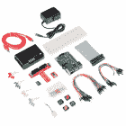
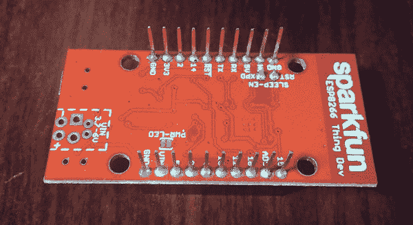

# SparkFun 故障排除提示

> 原文：<https://learn.sparkfun.com/tutorials/sparkfun-troubleshooting-tips>

## 介绍

“不行了！”使用电子设备时的常用语。但是，不要害怕。有许多故障诊断技巧，使诊断您的问题比看起来简单得多。在本教程中，我们将探索 SparkFun 技术支持部门经常出现的一些一般故障排除技巧和可能的解决方案。其中一些技巧可能不适用于所有的案例和项目，但是这是确定问题根源的一个好的起点。

### 假设

SparkFun 生产的开发板和分线板通常在包装和发送之前由技术人员在 [pogobed](https://learn.sparkfun.com/tutorials/constant-innovation-in-quality-control) 上进行测试和质量控制检查。让我们假设电路板是好的开始。

 [### 电子组件](https://learn.sparkfun.com/tutorials/electronics-assembly) How SparkFun assembles SMD electronics.[Favorited Favorite](# "Add to favorites") 23 [### 质量控制方面的不断创新](https://learn.sparkfun.com/tutorials/constant-innovation-in-quality-control) In this article, we share our recent advancements in quality control. Along with making our tests more thorough, we have also made them more efficient and robust.[Favorited Favorite](# "Add to favorites") 7

### 建议的工具

至少，低成本万用表是基本故障诊断的必备工具。根据您的设置，您可能需要额外的[工具](https://www.sparkfun.com/categories/46)和组件。

 

将**添加到您的[购物车](https://www.sparkfun.com/cart)中！**

 **### [-数字万用表基础](https://www.sparkfun.com/products/12966)

[In stock](https://learn.sparkfun.com/static/bubbles/ "in stock") TOL-12966

数字万用表(DMM)是每个电子爱好者的必备工具。斯帕克芬数字万用表，高…

$16.50 $9.9023[Favorited Favorite](# "Add to favorites") 57[Wish List](# "Add to wish list")** **### 推荐阅读

如果你不熟悉下面的概念，我们建议你看看这些技巧教程。项目的复杂性可能需要额外的技能来帮助您排除故障。

 [### 如何焊接:通孔焊接](https://learn.sparkfun.com/tutorials/how-to-solder-through-hole-soldering) This tutorial covers everything you need to know about through-hole soldering.[Favorited Favorite](# "Add to favorites") 70 [### 使用导线](https://learn.sparkfun.com/tutorials/working-with-wire) How to strip, crimp, and work with wire.[Favorited Favorite](# "Add to favorites") 50 [### 如何使用试验板](https://learn.sparkfun.com/tutorials/how-to-use-a-breadboard) Welcome to the wonderful world of breadboards. Here we will learn what a breadboard is and how to use one to build your very first circuit.[Favorited Favorite](# "Add to favorites") 79 [### 如何阅读原理图](https://learn.sparkfun.com/tutorials/how-to-read-a-schematic) An overview of component circuit symbols, and tips and tricks for better schematic reading. Click here, and become schematic-literate today 112 [### 串行终端基础知识](https://learn.sparkfun.com/tutorials/terminal-basics) This tutorial will show you how to communicate with your serial devices using a variety of terminal emulator applications.[Favorited Favorite](# "Add to favorites") 46 [### 如何使用万用表](https://learn.sparkfun.com/tutorials/how-to-use-a-multimeter) Learn the basics of using a multimeter to measure continuity, voltage, resistance and current.[Favorited Favorite](# "Add to favorites") 67

## 制造骚乱

“我想连接 10，080 个可寻址的发光二极管，这些发光二极管连接到一个无线模块网络，并由一个连接到鲨鱼的电路板控制。哦，我以前没有接触过电子产品。”

喔，喔，喔。让我们后退一大步，在疯狂地做一个项目之前，从简单开始。此外，请离开任何动物的项目！我们的技术支持部门收到一些有趣的案例。上面的例子是我们在支持中得到的问题的概括。在我们开始一个项目之前，让我们从基础开始，从哪里开始寻找信息。您将希望从签出任何相关联的文档开始。梦想远大，但从这些小步骤开始。

### 从产品页面和套件开始

我们 SparkFun 尽最大努力提供我们目录中销售的零件信息。除了阅读产品描述，还可以尝试查看产品页面的文档部分以获取资源。根据产品的不同，可能会有许多有用的链接。再来看看 [SparkFun FTDI 基本突破- 3.3V](https://www.sparkfun.com/products/9873) ！产品页面上链接的信息包括:

*   图表
*   Eagle 设计文件
*   连接和实验指南
*   项目教程
*   司机
*   数据表
*   用户手册
*   GitHub 仓库

如果您向下滚动经过推荐的产品，如果有与该产品相关的信息，可能会显示“产品帮助和资源”。这些内容包括教程、技术支持技巧以及在 [Hackster.io](https://www.hackster.io/) 下使用该部件的项目。在底部更深处(图中未显示)，您还会注意到用户提供的评论部分。

您也可以查看套件中使用的特定开发板，以便开始使用。每个工具包中都有基本的示例和项目来帮助您开始使用该产品。如果您以前没有使用过硬件电子设备或编程，您可能需要查看 SparkFun Inventor 的 3.3 版 RedBoard 或 micro:bit 工具包。这些套件不需要您将元件焊接在一起。

 

将**添加到您的[购物车](https://www.sparkfun.com/cart)中！**

 **### [SparkFun 发明家的工具包- v4.1](https://www.sparkfun.com/products/15267)

[In stock](https://learn.sparkfun.com/static/bubbles/ "in stock") KIT-15267

我们广受欢迎的 SIK 的第四版，为了更好的学习体验，从基础上完全重新制作！4.1 版现在有了…

$106.9512[Favorited Favorite](# "Add to favorites") 44[Wish List](# "Add to wish list")**** 

将**添加到您的[购物车](https://www.sparkfun.com/cart)中！**

 **### [red bot](https://www.sparkfun.com/products/12649)spark fun 发明人工具包

[In stock](https://learn.sparkfun.com/static/bubbles/ "in stock") ROB-12649

RedBot 的 SparkFun Inventor 工具包是一个很好的方式来开始使用 t…

$139.5025[Favorited Favorite](# "Add to favorites") 45[Wish List](# "Add to wish list")**** 

将**添加到您的[购物车](https://www.sparkfun.com/cart)中！**

 **### [LilyPad ProtoSnap 加](https://www.sparkfun.com/products/14346)

[In stock](https://learn.sparkfun.com/static/bubbles/ "in stock") DEV-14346

LilyPad ProtoSnap Plus 是一个可缝合的电子原型板，您可以使用它来探索电路和编程，测试

$42.95[Favorited Favorite](# "Add to favorites") 10[Wish List](# "Add to wish list")**** 

### [树莓派 3 B+入门套件](https://www.sparkfun.com/products/15361)

[Out of stock](https://learn.sparkfun.com/static/bubbles/ "out of stock") KIT-15361

Raspberry Pi 3 B+初学者工具包是一个很好的方式来获得对小型信用卡大小的计算机的可靠介绍。

2[Favorited Favorite](# "Add to favorites") 17[Wish List](# "Add to wish list") 

### [【spark fun】光子发明家工具包](https://www.sparkfun.com/products/retired/14684)

[Retired](https://learn.sparkfun.com/static/bubbles/ "Retired") KIT-14684

SparkFun Inventor 的光子工具包是一个很好的方式来开始新的物联网世界和 WiFi 开发。

**Retired**[Favorited Favorite](# "Add to favorites") 5[Wish List](# "Add to wish list") 

### [带 Blynk 板的 SparkFun 物联网入门套件](https://www.sparkfun.com/products/retired/14682)

[Retired](https://learn.sparkfun.com/static/bubbles/ "Retired") KIT-14682

带 Blynk 板的 SparkFun 物联网入门套件是了解物联网技术世界的绝佳方式，它包含…

2 **Retired**[Favorited Favorite](# "Add to favorites") 4[Wish List](# "Add to wish list") 

### [【spark fun】微型发明家套件:bit](https://www.sparkfun.com/products/retired/15228)

[Retired](https://learn.sparkfun.com/static/bubbles/ "Retired") KIT-15228

用于 micro:bit 的 SparkFun Inventor's Kit (SIK)是一个用 micro:bit 进行创意、连接和编码的好方法。

2 **Retired**[Favorited Favorite](# "Add to favorites") 15[Wish List](# "Add to wish list")****** ******### 数据表和手册

根据电路板的复杂程度，PCB 上可能有许多不同规格的元件。我们通常会考虑分线板上的主 IC，并查看 I/O 引脚的**绝对最大额定值**，芯片总体能够处理多少，以及 IC 能够做什么。试着看看我们之前关于[如何阅读数据手册的教程](https://www.sparkfun.com/tutorials/223)，了解阅读数据手册的技巧。用户手册还可以提供如何使用该产品的示例和应用说明。

### 在线资源研究

除了浏览 SparkFun 不断增长的[在线教程](https://learn.sparkfun.com/tutorials)、 [YouTube 视频](https://www.sparkfun.com/videos)和博客帖子(即 [Enginursdays](https://www.sparkfun.com/news/tags/enginursday) 、[工程圆桌](https://www.sparkfun.com/news/tags/engineering-roundtable)等)。)，网上还有其他几个资源。这里有一些可能有用的例子:

*   非火花制造零件
*   [指令](http://www.instructables.com/index)
*   [Hackster.io](http://www.hackster.io/)
*   [电子堆栈交换](http://electronics.stackexchange.com/)
*   论坛(即 [SparkFun](https://forum.sparkfun.com/) 、 [Arduino.cc](https://forum.arduino.cc/) 、[树莓派](https://www.raspberrypi.org/forums/)等。)

云无所不知...发布在互联网上。除了使用页面顶部的本地搜索引擎，尝试使用不同搜索查询的在线搜索引擎，看看是否有人做过类似于你正在做的事情。很有可能，世界上有人已经完成了这个项目(或类似的项目)，并且他们已经在网上提供了一些文档。

## 硬件检查

因此，您已经按照说明进行了操作，但是部件或项目没有按预期工作。你甚至试图完全按照连接指南和教程告诉你的去做！电子和编程工作的一部分是诊断问题，并找到补救措施使零件正常工作。不用担心；它发生在我们最好的人身上，挑战只会帮助我们学习和成长。让我们来看看您的电路中可能发生了什么！

### 检查您的连接

零件或项目是否有关联？让我们澄清一下“检查你的连接”是什么意思。常见的故障排除方法是检查硬件连接和电源是否存在物理问题。

#### [引脚之间是否导通，连接是否牢固？](#loose-wires)

任何松动的连接都会引起问题，因为这会导致电路不完整。最好仔细检查有线连接，以防电线连接错误或松动。下图显示了由于将细线插入试验板和母头插座，原型制作的电气连接不良。施加在电路上的任何碰撞和振动都会导致电路断开连接。

|  |  |  |
| **有些可靠:**激光雷达连接试验板 | **不可靠:**激光雷达连接到电路板和试验板 | **不可靠:**指纹扫描仪连接 Arduino Pro Mini 3.3V 母头 |

连接到试验板的小导线可能会变松，这取决于它的制造方式以及金属条的磨损程度。由于插座的公差，连接在母接头中的细导线更差。

为了更安全地连接，最好将电线焊接到接头引脚上，并增加热收缩。你也可以使用[spark fun snap able 原型板](https://www.sparkfun.com/products/13268)制作一个适配器，或者使用任何一个[原型板](https://www.sparkfun.com/categories/301)制作一个定制盾牌。

#### [有短裤吗？](#shorts)

如果有一根针接触到不应该接触的东西，电路中的短路会引起问题。确保组件触摸起来不会太热。如果针脚短路，请切断电源，检查松动的电线是否接触到不应该接触的东西。确保电路板不在金属桌面上。

#### [电线或电缆坏了吗？](#bad-wire)

有时电线或电缆损坏，导致电路无法连接。你可以试着用设置为测量导通性的[万用表检查电路](https://learn.sparkfun.com/tutorials/how-to-use-a-multimeter#continuity)。否则，请尝试使用不同的电线或电缆。

#### [你从哪里弄来的 USB 线？](#bad-usb)

某些电缆被设计为充电电缆，因此 USB 电缆中可能没有任何数据线连接。此外，电缆中可能有内部微裂缝。我们建议检查并使用不同的 USB 电缆。我们有一个例子，一位客户使用他学校实验室的 USB 电缆将代码上传到 Arduino。四根电缆中有三根是坏的，因为它们被损坏了。第四根电缆与他的设备一起工作。如果是这样的话，你可能想尝试订购一条全新的 [USB 线](https://www.sparkfun.com/categories/71)。

#### [部件的连接极性是否正确？](#polarity)

某些部件有特定的极性，只有连接在正确的位置时才会起作用。确保组件被正确填充。这包括电池、集成电路、微控制器、晶体管、稳压器、电解电容、二极管。更多信息，请查看我们的极性教程。

 [### 极性

#### 2013 年 6 月 14 日](https://learn.sparkfun.com/tutorials/polarity) An introduction to polarity in electronic components. Discover what polarity is, which parts have it, and how to identify it.[Favorited Favorite](# "Add to favorites") 52

#### [您使用了基本连接吗？](#basic-hookup)

如果一切看起来都连接正确，你可能想试着从头开始，看看基本的连接。此外，断开零件并重新连接每个电路有助于排除故障。这将有助于缩小问题的范围。

请记住，两个部分可能命名相似或看起来相同，但实际上并非如此。例如，虽然 Arduino Mega 2560 中有 Arduino 名称，但它可能无法直接替代使用 Arduino Uno R3 的电路。有些人可能没有意识到一些细微的差异(例如，不同的引脚位置、软件序列的限制、电路板定义等)。有时，您可能需要重新定义一个引脚或重新布线电路，以使其按预期工作。

通过仔细检查 IC 标签，确保从零件箱中取出正确的零件。例如，TMP36 不同于 BJT 晶体管。虽然包装看起来是一样的，但它们是不同的！这在我们的 SparkFun 发明家工具包中很常见。在另一个案例中，客户使用了不同的 n 沟道 mosfet。虽然 n 沟道 mosfet 看起来一样，但规格不同，导致电路中的晶体管不能完全导通。

### 检查你的焊点

#### [您的焊点是否理想，连接是否充分？](#bad-solder-joints)

啊，是的，我们再次检查连接。如果您尝试使用电线连接试验板上的分线板，您需要确保分线板和电线之间的连接足够。下面显示的三个图像不是理想的焊点。

在第一张图中，没有将接头引脚连接到试验板的焊点。如果您需要帮助焊接接头引脚，这是一个很好的主意，但如果您试图将 Pro Mini 连接到其他分线板，则不是这样。

***Not Reliable:** Pro Mini and Header Pins With No Solder on Breadboard*

第二个图像可能有焊料，但接头不理想。沿着行 30 的第一个引脚没有焊料。第 29 行的引脚在头部有一些焊料，但不与电路板接触。第 28 行的引脚没问题，但上面有太多的焊料。一些焊料滴也从引脚延伸。行 27 和 26 上的引脚有一个无意的焊接跳线。行 25 上的引脚可能在通孔焊盘和引脚上有焊料，但是它没有连接。唯一看起来有理想焊点的引脚是第 21 行的 RST 引脚。我们希望通过重新加热引脚或添加更多焊料来返工所有其他引脚，以确保引脚有足够的焊点。此外，Atmega328P IC 上的引脚之间存在无意的焊接跳线。要消除无意的焊料跳线，请尝试使用焊芯并检查下一个问题。

***Not Reliable:** Pro Mini With Poor Solder Joints*

第三张图片清楚地显示了 1x12 接头错误地焊接在 Pro Mini 上。焊料应涂在接头的短边上。容纳该引脚的黑色外壳应位于 PCB 和试验板之间。此外，焊点延伸了引脚的长度。由于直接头引脚的长度，Pro Mini 无法完全插入试验板。

***Not Reliable:** Pro Mini With Poor Solder Joints and Header on the Wrong Side*

解决办法是添加焊料或重新加工焊点，以实现牢固的连接。下图是 Pro Mini 上理想的焊点。有关焊接和理想焊点的更多信息，请查看我们的[通孔焊接教程](https://learn.sparkfun.com/tutorials/how-to-solder-through-hole-soldering#soldering-your-first-component-)。

***Reliable**:* *Ideal Solder Joints Between Arduino Pro Mini and Straight Header Pins*

#### [是否有跳线连接引脚？](#solder-jumpers)

根据电路的不同，您可能需要在电路板的某个部分安装一个焊接跳线。如果 IC 或接头引脚上有意外的焊接跳线，解决方案是返工电路板并移除焊接跳线。

下面是一个焊点的例子，这不是“西蒙说”PTH 焊接套件的目的。

要解决这个问题，你可以抓住一个焊芯来移除焊接跳线。有关如何使用焊芯的更多信息，请尝试查看此处标有“焊料跳线”的[故障排除部分](https://learn.sparkfun.com/tutorials/simon-says-assembly-guide#troubleshooting)

#### [线路板上是否有水溶性助焊剂残留？](#flux-residue)

如果您使用水溶性助焊剂，您需要确保清除残留在电路板上的任何水溶性助焊剂。这是为了防止引脚氧化和由枝晶引起的引脚之间的暂时短路。下图是产品面板上残留的水溶性助焊剂。

虽然一些电路可能在焊剂留在原处的情况下工作良好，但我们已经看到脏电路板对通过串行 UART(即上传代码到 Arduino 或发送 ASCII 字符到另一个 UART)或 I ² C 发送信号的电路板造成严重破坏。最好避免由残留在电路板上的水溶性焊剂引起的任何问题。事实上，我们组装的 [SparkFun 板如果使用这种助焊剂就会被清洗](https://learn.sparkfun.com/tutorials/electronics-assembly/washing)！

要去除水溶性助焊剂残留，可以用少许去离子水或异丙醇和牙刷。去离子水的替代品可能是先用非矿物质瓶装水，再用自来水供业余爱好使用。然而，自来水中的沉淀物可能会在未来形成并导致问题。使用压缩空气，你可以干燥电路板，去除电路板上多余的焊剂残渣或水。来自[热风枪](https://www.sparkfun.com/products/10326)或[返工站](https://www.sparkfun.com/products/10706)的热空气也可用于干燥电路板。

某些组件对水很敏感，因此您应该小心不要弄湿这些组件。以下是应避免与水接触的组件的简短列表:

*   字符液晶显示器
*   7 段 LED 显示屏
*   电池
*   GPS 模块
*   无线模块
*   大气压力传感器
*   滑动电位计
*   麦克风
*   扬声器
*   心率监护仪 IC

如果水被截留在其中，并且您为主板供电，可能会损坏组件。

### 电线长度

#### [您是否在使用超长电线？](#wire-length)

根据您使用的导电材料，导线和电线的电阻在一定距离内会增加。这在导电线的情况下更加明显，解决方案可能是[将你的线](https://learn.sparkfun.com/tutorials/powering-lilypad-led-projects#conductive-thread-resistance)加倍。

如果您使用的电线距离超过几百英尺，您也可能会注意到一些问题。例如，在某些情况下，I ² C 传感器在一定长度后无法正常工作。由于 I ² C 被设计成在[短距离](https://learn.sparkfun.com/tutorials/i2c)上工作，当在[一定数量的英尺](https://forum.arduino.cc/index.php?topic=57604.msg414074#msg414074)上使用时，传感器可能会有发送数据的问题。解决方案可能是[调整上拉电阻](https://www.sparkfun.com/news/2366)或巧妙发送数据(即，为每个传感器节点使用一个微控制器，并添加一个无线设备)。

### 检查另一台电脑

#### [您是否尝试过使用不同的电脑？](#another-computer)

我们建议使用另一台计算机检查该设备是否可以工作。我们遇到过设备不能在客户的笔记本电脑上工作，但可以在他/她的电脑上工作的问题。电脑的设置出了问题，导致他们无法正常使用该设备。

#### [您正在使用的 USB 集线器或 USB 端口是否有问题？](#usb-port)

尝试直接连接到 USB 端口，而不是通过 USB 集线器。该设备可能没有获得足够的电力，或者可能无法正常通信。此外，在 USB 3.0 上使用某些 USB 转串行转换器可能会出现问题。尝试在不同的计算机上测试。在某些情况下，当设备不能与 USB 3.0 端口一起工作时，客户可以让它在 USB 2.0 集线器上工作。

### 检查你的逻辑水平

#### [能否将 3.3V 传感器连接到 5V 电路板？](#logic-levels)

并非所有电路板都使用相同的逻辑电平电压。例如，用 Arduino 编程的 RedBoard 和 Arduino Uno R3 使用 5V 逻辑。然而，如果您使用其它板，如 ESP8266、SAMD21、Arduino Due 或 Raspberry Pi，I/O 引脚不支持 5V 电压。确保逻辑电平与您连接到开发板的任何设备匹配或兼容。

如果信号只需要向下转换，您可以使用[三个 10k 欧姆电阻构建一个分压器](https://learn.sparkfun.com/tutorials/retired---using-the-logic-level-converter#hardware-overview)。对于双向发送的信号，您可以使用逻辑电平转换器(即，[双向逻辑电平转换器](https://www.sparkfun.com/products/12009)、 [PCA9306 电平转换器](https://www.sparkfun.com/products/11955)、 [TXB0104 电压电平转换器](https://www.sparkfun.com/products/11771)、[等)。](https://www.sparkfun.com/categories/361))进行安全通信。有关逻辑电平的更多信息，请查看下面的教程。

 [### 逻辑电平

#### 2013 年 6 月 3 日](https://learn.sparkfun.com/tutorials/logic-levels) Learn the difference between 3.3V and 5V devices and logic levels.[Favorited Favorite](# "Add to favorites") 82

### 堆叠多块板

#### )一起放在您的开发板上？

也许可以将[的电路板堆叠在一起](https://learn.sparkfun.com/tutorials/arduino-shields/what-is-a-shield)，但这取决于每块电路板使用的引脚。尝试查看电路板的设计文件、原理图和基本示例代码，以确定每个屏蔽使用的引脚。将多个开发板堆叠在一起时，您可能需要重新路由引脚、重新定义引脚或更改代码中的串行地址(即 I ² C、SPI)。当使用多块电路板时，您将需要组合示例代码以使其在项目中工作。

### 检查你的位置是否有干扰

#### [组件在房间或建筑物中不工作吗？](#inteference)

你的电子产品中有[空中魔法](https://www.sparkfun.com/news/2482)还是[幽灵？也许吧。或者你可以试着在不同的地方使用这块板。如果你在建筑物内使用](https://youtu.be/IY-WVie_b_U)，这在 [GPS 接收机中很常见。为避免 GPS 锁定问题，请尝试在建筑物周边附近、室外或不同位置使用 GPS 接收器，以避开周围的建筑物，或者使用延伸到室外的外置天线。](https://learn.sparkfun.com/tutorials/alphanumeric-gps-wall-clock#lock-problems)

我们也看到了超声波传感器在我们建筑的某些部分使用时出现的问题。例如， [HC-SR04 超声波传感器](https://www.sparkfun.com/products/13959)在建筑的一个位置工作良好，但我们注意到 HVAC 的噪声被调整到足以干扰传感器。为了避免这种噪音，我们不得不在建筑的不同部分使用传感器。

使用磁力计并看到异常读数？这可能是由环境中的硬铁和软铁引起的。试着看看这个来自我们[退役的 9 自由度剃须刀的旧教程，找到更多关于硬铁和软铁的信息](https://github.com/Razor-AHRS/razor-9dof-ahrs/wiki/Tutorial#extended-magnetometer-calibration)。

### 检查你的能量

#### [你的电源够用吗？](#power-supply)

确保您的电源能够提供系统所需的电力。例如，如果你用 Arduino 点亮三个 [WS2812B 可寻址 led](https://www.sparkfun.com/products/13282)，5V/1A 电源就足够了。然而，如果你点亮两个或更多的 [5M 可寻址 LED 灯条](https://www.sparkfun.com/products/12026)，情况就不同了。对于这样的[大型装置](https://learn.sparkfun.com/tutorials/building-large-led-installations)，你需要一个足够长的电源，并且可能需要在每 5 米段之间增加电力。

如果电源不能提供足够的电力，您的微控制器或单板计算机可能会掉电。作为另一个例子， [Raspberry Pi 3](https://www.sparkfun.com/products/13825) 与之前的型号相比，消耗的电流稍微多一点。虽然之前的 5V/2A 电源适用于早期的树莓 Pi，但需要一个 [5.1V/2.5A 电源](https://www.sparkfun.com/products/13831)来为 Pi 3 提供充足的电源。

#### [为什么每次电机启动时，我的 Arduino 都会停止工作？](brown-out)

试着检查一下你的电源。可能是电机导致电压下降，导致微控制器掉电。通常建议将外部电源连接到电机，以防止掉电和复位微控制器。确保将 GND 连接到系统的其余部分，以供参考。你也可以使用一个更强大的电源，能够为电机和微控制器提供足够的电力。

#### [为什么我的项目使用的是连接到墙上插座的电源，而不是 9V 电池？](#9v-battery)

根据电池的化学成分和制造商，放电率可能与连接到墙上插座的电源不同。与其他类型的电池相比，9V 电池的内阻更高。此外，内部电阻因制造商而异。因此，它不是高电流应用的理想电源。你可能要考虑使用其他的[电池化学物质](https://learn.sparkfun.com/tutorials/battery-technologies)来为这个项目供电。

### 动力循环

#### [我的项目在连接到墙上插座的几个月里工作正常，但现在不能像预期的那样工作了。](#power-cycle)

通过切断电源并重新给电路供电，尝试对项目进行电源循环。如果有一个重置按钮，你可以只按那个按钮。您可能需要从墙上插座拔下电源，断开电源 Vin，等待几秒钟，将电源重新连接到 Vin，然后将电源插回墙上插座。尝试用万用表测试墙上适配器，看看它是否仍在输出电源，或者是否将已知正常的灯插入墙上插座。

### 热消散

#### [我的电机驱动器摸起来发热正常吗？](#heat-dissipation)

使用电机驱动器和电机时，散热是正常的。根据推动驱动器 IC 的力度和使用的电源，您可能需要一个散热器来实现电机驱动器的全部潜能。这种分线板通常被设计用来帮助散热。除了加散热片，还有[处理热量](https://learn.sparkfun.com/tutorials/stepoko-powered-by-grbl-hookup-guide/hardware-dealing-with-heat)的方法。

### 静电放电

#### [在触摸设备之前，您是否将自己接地？](#esd)

某些设备对静电敏感。当一个人四处走动时，他会积聚静电并通过电路板释放出来。冬天在地毯上行走会更糟糕。一定要摸到金属柜才能自己接地。虽然一些电路板可以处理一些小的冲击，但 IC 在某一点后可能会损坏。

### 产品的局限性

#### [您是否按预期使用组件？](#limits)

当一种产品被释放到野外时，它可能不会按预期使用。例如，通常你认为发光二极管是发光的。然而，可以使用[微控制器和 LED 来检测光线](https://www.sparkfun.com/news/2161)。

现在，不要期望所有组件都能够做它们不打算做的事情。例如， [XBee 系列 1 收发器](https://www.sparkfun.com/products/11215)可能能够无线传输数据，但不要指望它能够像 [WiFi 加密狗](https://www.sparkfun.com/products/13677)那样可靠地传输视频。规格(即数据速率)是不同的。

### 无线的

#### [为什么我的无线设备无法连接到无线网络？](#wifi-cred)

尝试检查您使用的 WiFi 网络名称和密码是否正确。可能是凭据输入不正确。支持 WiFi 的设备(如 [SparkFun ESP8266 Thing 开发板](https://www.sparkfun.com/products/13711))提供的示例代码要求您手动输入网络名称和密码。

就像检查另一台计算机一样，您可能希望在另一个 WiFi 网络上测试支持 WiFi 的设备。如果您在学校网络中使用支持 WiFi 的设备，使用该设备可能会有问题。由于学校的配置，您可能需要联系当地管理无线网络的 IT 部门，以允许设备连接。也有可能是无线路由器损坏或与启用无线功能的设备不兼容。

#### [为什么我的无线设备在金属外壳内无法工作？](#faraday-cage)

将无线设备放置在金属外壳内(即[法拉第笼](https://en.wikipedia.org/wiki/Faraday_cage))实质上限制并可以阻挡任何电磁场。正在发送或接收的信号将无法传输。尝试使用外置天线，以便收发器能够伸出金属外壳。

## 软件检查

外面有很多语言。在本教程和故障排除的范围内，我们将重点关注 Arduino IDE(集成开发环境)和将代码上传到 Arduino 开发板时的常见问题。但是，在其他开发环境中进行故障排除时，其中一些提示可能会有用。

### FTDI 驱动程序

#### [你安装 FTDI 驱动了吗？](#install-ftdi-drivers)

如果您之前没有上传到使用 FTDI 的 Arduino，或者没有将 FTDI 连接到您的计算机，您需要确保您已经安装了最新的 FTDI 驱动程序。尝试查看下面列出的教程，为您的操作系统安装驱动程序。该教程是基于 FTDI 的指示。想要更深入的指导，试着看看 [FTDI 的安装指南](http://www.ftdichip.com/Support/Documents/InstallGuides.htm)。

 [### 如何安装 FTDI 驱动程序

#### 2013 年 6 月 4 日](https://learn.sparkfun.com/tutorials/how-to-install-ftdi-drivers) How to install drivers for the FTDI Basic on Windows, Mac OS X, and Linux.[Favorited Favorite](# "Add to favorites") 12

请记住，设备驱动程序可能因开发板上安装的 USB 转串行转换器而异。如果您使用不同的芯片，您将需要安装各自的驱动程序。以下是其他几个驱动因素:

*   [CH340](https://www.sparkfun.com/ch340)
*   [CP2102](https://learn.sparkfun.com/tutorials/cp2102-usb-to-serial-converter-hook-up-guide#driver-installation)
*   [CY7C65213](https://learn.sparkfun.com/tutorials/sparkfun-usb-uart-breakout-cy7c65213-hookup-guide#installing-drivers)

有关不同驱动程序的更多信息，请查看这篇博文。

 [### 是什么驱动着你的 SparkFun 发明家套件？

August 14, 2019](https://www.sparkfun.com/news/2979 "August 14, 2019: USB-to-serial UART bridges like the CH340 make it easier to upload code to an Arduino and pass serial data to/from your computer. Make sure to install the respective drivers before getting started.")[Favorited Favorite](# "Add to favorites") 0

#### [如何知道我是否安装了驱动程序？](#com-port-enumeration)

设备插入后，在 Arduino IDE 的菜单中选择**工具>串行端口**时，可以看到一些 COM 端口。当你拔掉设备并重新打开**工具>串口**时，你可能会看到一个 COM 端口消失了。通过排除过程，您可以看到它枚举到了哪个 COM 端口。当您打开设备管理器检查*端口(COM & LPT)* 树时，您也可以看到这一点。

#### [如何知道我的 USB 转串行转换器是否正在发送串行数据？](#echo-test)

为了验证 FTDI 或任何 USB 到串行转换器正在工作，您可以进行串行环回测试或[回声测试](https://learn.sparkfun.com/tutorials/terminal-basics/connecting-to-your-device)。为了执行该测试，需要在 UART 引脚 Rx 和 Tx 之间连接一根跳线。

用设置 **9600** 波特，8-无-1-无打开串行终端(如 Tera Term)。通过在串行终端上打字，任何使用键盘发送的字符都会在屏幕上显示出来。您还应该看到 Rx 和 Tx 状态 led，指示数据正在发送。

### Arduino IDE 版本

#### [我的 Arduino IDE 有问题吗？](#arduino-ide)

Arduino IDE 的每个版本都有改进和优点。然而，在代码编译的方式上可能会有不可预见的错误和差异。如果错误输出中有警告，[通常你可以忽略它们](https://forum.arduino.cc/index.php?topic=347693.0)。如果您在编译时遇到问题，有时您需要在计算机上卸载并重新安装 Arduino IDE。您也可以尝试删除某些 [Arduino 文件](https://forum.arduino.cc/index.php?topic=440638.msg3034559#msg3034559)。

如果基于 Arduino 的开发板不需要特定的 IDE 版本，可以尝试回滚并使用 Arduino IDE 的[较低版本(如 v1.6.5)](https://www.arduino.cc/en/Main/OldSoftwareReleases#previous) 。在下一个版本发布之前，回滚并使用稳定/工作的 IDE 进行测试可能是解决方案。

### 电路板选择

#### [您是否选择了正确的电路板定义？](#board-selection)

如果您没有选择正确的纸板定义，您将无法上传代码。有关正确选择主板的更多信息，请查阅 Arduino 的相关文档。你可以在**工具>板**选择菜单中找到 Arduino 板定义的列表。

#### [为什么我在板卡选择菜单中看不到我的 Arduino 板卡？](#board-addon)

由于[不同的文件结构要求](https://playground.arduino.cc/Main/CustomizeArduinoIDE)，Arduino IDE v1.6+可能会有一些问题。这可能会导致 Arduino 板不出现在默认列表中。

最新的 SparkFun Arduino 兼容主板更新可以在 SparkFun Arduino 主板插件 GitHub 存储库中找到。该存储库包含对 SparkFun 的 Arduino 兼容开发板的支持，以及如何安装开发板插件的说明:

[SparkFun Arduino Board Add-On GitHub Repo](https://github.com/sparkfun/Arduino_Boards)

如果您尝试安装最新的主板，但代码仍然无法编译，您可能需要回滚到主板插件的以前版本。如果发布了一个以上的主板版本，您应该能够在主板管理器中点击主板，并看到不同版本的小下拉菜单。

### COM 端口选择

#### [您是否选择了正确的 COM 端口？](#com-selection)

您需要确保您在**工具>串口**菜单中选择了正确的 COM 端口。插上设备后，当你在 Arduino IDE 的菜单中选择**工具>串口**时，你可以看到一些 COM 端口。当你拔掉设备并重新打开**工具>串口**时，你可能会看到一个 COM 端口消失了。通过排除过程，您可以看到它枚举到了哪个 COM 端口。当您打开设备管理器检查*端口(COM & LPT)* 树时，您也可以看到这一点。

### 已安装的 Arduino 库

#### [您的示例代码需要安装库吗？](#install-library)

如果你不安装这些库，Arduino 将无法理解某些功能，因为它们不是为它定义的。您通常可以看到示例代码试图将它包含在草图文件的顶部附近。我推荐阅读本教程来正确安装这些库。

 [### 安装 Arduino 库

#### 2013 年 1 月 11 日](https://learn.sparkfun.com/tutorials/installing-an-arduino-library) How do I install a custom Arduino library? It's easy! This tutorial will go over how to install an Arduino library using the Arduino Library Manager. For libraries not linked with the Arduino IDE, we will also go over manually installing an Arduino library.[Favorited Favorite](# "Add to favorites") 22

#### [我安装了必要的 Arduino 库，为什么还是不编译？](#reinstall-library)

尝试重新安装 Arduino IDE。有一次，当我们的一个工程师在使用一个库时遇到问题，他卸载并重新安装了 Arduino IDE。否则，您可能需要重新安装 Arduino 库。有时下载的库被破坏或意外安装错误，所以你需要重新安装 Arduino 库。

### 损坏的引导加载程序或砖砌的 Arduino

#### [如果引导加载程序损坏，如何恢复我的 Arduino？](#reinstall-bootloader)

如果你有另一个 Arduino 微控制器或 AVR 编程器，你可以重新安装引导程序。下面列出的教程是为使用 ATmega328P 的 Arduino Uno 编写的。如果您使用不同的 AVR 微控制器或 Arduino 兼容板，您可能需要选择不同的板定义来刻录其引导加载程序。

 [### 安装 Arduino 引导程序

#### 2013 年 12 月 4 日](https://learn.sparkfun.com/tutorials/installing-an-arduino-bootloader) This tutorial will teach you what a bootloader is and why you would need to install or reinstall it. We will also go over the process of burning a bootloader by flashing a hex file to an Arduino microcontroller.[Favorited Favorite](# "Add to favorites") 25

#### [我的装有 ATmega32U4 的 Arduino 在上传新代码后停止工作。我的基于 ATmega32U4 的微控制器怎么了？](#bricked-atmega32u4)

很可能是在上传代码时选择了错误的板定义，或者某些东西干扰了处理 COM 端口通信的寄存器。有一种方法可以恢复基于 ATmega32U4 的 Arduino，使用[双复位方法](https://learn.sparkfun.com/tutorials/pro-micro--fio-v3-hookup-guide/troubleshooting-and-faq#ts-reset)。你可能需要一个 AVR 程序员作为最后的手段。试着查看这里的[评论](https://learn.sparkfun.com/tutorials/pro-micro--fio-v3-hookup-guide/discuss#comment-56aa5cabce395f9f2d8b456d)，链接到更深入的关于用不同的引导程序恢复 ATmega32U4s 的技巧。

### 语义错误与调试

#### [为什么我的代码虽然可以编译，却无法运行？](#semantics)

这听起来像是一个非常普遍的问题，但很可能是一个语义错误。虽然代码能够编译并且没有语法错误，但是编写的代码可能不符合您的预期。假设硬件连接和电路板良好，有可能:

*   pin 或变量未正确初始化。
*   变量未正确计算和保存。
*   错误的变量被打印到串行监视器。
*   您正在使用数组[]之外的值。
*   波特率不匹配。
*   一个`delay()`函数正在阻止某一行足够快地执行。
*   代码序列没有正确执行。

根据项目的复杂程度，可能会出现这种情况的原因还有很多。最简单的调试方法是当我们到达代码的某个部分时打开 LED。然而，对 Arduino 代码进行故障排除的最佳方法是尝试使用 [serial.print()](https://www.arduino.cc/en/Serial/Print) 函数进行调试。如果使用正确，该函数更加灵活，可以指示我们输入了一行代码。

也许你想在按下一个按钮后或当一个传感器达到某个值时，将“我输入了这个功能”打印到串行监视器上。`serial.print()`功能也可用于检查变量，以了解传感器的输出范围。该函数也可用于验证计算。其他环境允许您单步执行代码来模拟可能发生的情况，而不需要使用`serial.print()`。

## SparkFun 故障排除清单

不管我们的经验水平如何，有了清单，故障率可以降低，问题有时可以更快地解决。以下是在对您的项目进行故障排除时应该自问的问题列表:

### 硬件检查

#### 检查您的连接

▢:针脚之间是否导通，连接是否牢固？▢有短裤吗？
▢是电线坏了还是电缆坏了？
▢你从哪里弄来的 USB 线？
▢部件的连接极性是否正确？▢你使用基本的连接方式了吗？
▢:你的焊点是否理想，连接是否充分？
▢:在应该连接引脚的地方有焊接跳线吗？▢:电路板上有水溶性助焊剂残留物吗？

#### 电线长度

▢:你在用超长的电线吗？▢，你试过用另一台电脑吗？
▢您使用的 USB 集线器或 USB 端口有问题吗？

#### 检查你的逻辑水平

▢:你能把一个 3.3V 的传感器接到 5V 的电路板上吗？

#### 堆叠多块板

▢:你是否堆叠了不止一块板子(例如，Arduino 盾牌，树莓帽，猎兔犬骨斗篷，等等。)一起放在您的开发板上？

#### 检查你的位置是否有干扰

▢:组件在特定的房间或建筑中不工作吗？

#### 电源

▢，你的电力供应充足吗？▢，你的 Arduino 会在每次你的马达启动时停止工作吗？
▢你的项目使用的是连接到墙上插座的电源，而不是 9V 电池吗？

#### 动力循环

▢:你的项目在连接到墙上插座的几个月里工作正常，但现在不能像预期的那样工作了吗？

#### 热消散

▢，你的汽车司机是不是越来越热了？这正常吗？

#### 静电放电

▢，你在接触这个装置之前接地了吗？

#### 产品的局限性

▢:你使用的组件符合预期吗？

#### 无线的

▢:你的无线设备不会连接到无线网络吗？▢:你的无线设备在金属外壳内不能工作吗？

### 软件检查

#### FTDI 驱动程序

▢:你安装 FTDI 驱动程序了吗？▢:你怎么知道你是否安装了 FTDI 驱动程序？
▢如何判断你的 FTDI 是否在发送串行数据？

#### Arduino IDE 版本

▢，你的 Arduino IDE 有问题吗？

#### 电路板选择

▢:你选择了正确的纸板定义吗？

#### COM 端口选择

▢:你选择了正确的通讯端口吗？

#### 已安装的 Arduino 库

▢:你的示例代码需要安装库吗？

▢:你已经安装了必要的 Arduino 库，为什么它还不能编译？

#### 损坏的引导加载程序或砖砌的 Arduino

▢:如果引导程序损坏了，你如何恢复你的 Arduino？
▢你的 Arduino 用 ATmega32U4 上传新代码后停止工作。基于 ATmega32U4 的微控制器后来怎么样了？

## 检查，测试，再检查

可能你匆匆走过一个台阶。尝试检查故障排除清单。或者你的假设是错的？检查你的假设。虽然很少，但有可能电路板上有坏的东西(例如，[墓碑式 SMD 组件](https://learn.sparkfun.com/tutorials/constant-innovation-in-quality-control#pre-testing-for-jumpers)，焊料不足或[坏 PCB](https://www.sparkfun.com/news/1161) )。

即使关掉电路，在另一个时间再回来，也有助于用不同的方法解决问题。

## 救命啊！

在完成故障排除清单、测试和复查后仍然有问题吗？我们发现 SparkFun 论坛是最好的联系方式，因为我们可以与社区分享最高水平的信息和文档。在 SparkFun 论坛发帖时，请准备好尽可能多的信息。在某些情况下，客户能够通过收集这些信息和浏览论坛来解决他们的问题:

*   **SparkFun 零件号(即 SKU)** -这可以在发票的项目列表或产品页面上找到。

    
*   **高质量、清晰的焊点和设置图像** -几张高质量、清晰的焊点和设置图像会很有用。确保图像聚焦，光线充足。在提交之前，查看照片以验证我们可以看到电路。
    下面的
    显示了一个很差的设置图像，在那里很难看出是怎么回事。不过，那块糖看起来确实很吸引人。

    

    下图显示了焊点的清晰图片，可以帮助我们排除故障。

    

    下图显示了设置和引脚连接的清晰图像。当电线被切断的时候，我们应该可以追踪连接。但是，如果有多根颜色相同的电线，则在进行故障排除时可能会出现问题。

    
*   **关于您的设置的信息** -这可能包括电源的电压和电流设置、主板是否通电、主板的修改、连接到系统的附加部件或您的环境。

* * *

一旦你准备好了这些信息，试着在论坛上发帖吧！

[SparkFun Forums](https://forum.sparkfun.com/)

## 资源和更进一步

查看下面 SparkFun 的一些资源:

*   [SparkFun 电子 GitHub 回购](https://github.com/sparkfun)
    *   [踢腿炸麻绳](https://github.com/sparkfun/Fritzing_Parts)
    *   [SparkFun 3D 模型回购](https://github.com/sparkfun/3D_Models)
    *   [SparkFun Arduino 板回购](https://github.com/sparkfun/Arduino_Boards/tree/master)
    *   [SparkFun 技术支持回购](https://github.com/SparkfunTechSupport/)

想要更多关于故障排除的信息吗？查看这些相关的博客帖子。

 [### 自制 PCB 的焊接和故障排除

February 6, 2017](https://www.sparkfun.com/news/2295 "February 6, 2017: Troubleshooting our second homebrewed breakout for the MLX90393.")[Favorited Favorite](# "Add to favorites") 0 [### 英语日:解决一个简单的问题

January 11, 2018](https://www.sparkfun.com/news/2573 "January 11, 2018: Sometimes troubleshooting requires you to think both literally and figuratively "outside the box."")[Favorited Favorite](# "Add to favorites") 0 [### Enginursday:激发故障排除的创造力

August 9, 2018](https://www.sparkfun.com/news/2746 "August 9, 2018: Let's talk about a PCB design error and troubleshooting the root cause.")[Favorited Favorite](# "Add to favorites") 1 [### 使用 SparkFun 和 inspectAR 调出 PCB

March 25, 2020](https://www.sparkfun.com/news/3268 "March 25, 2020: InspectAR joins us today with a look into their easy PCB design tool.")[Favorited Favorite](# "Add to favorites") 1********