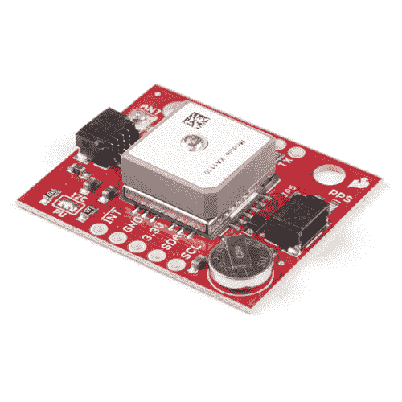
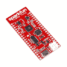
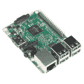
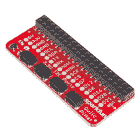
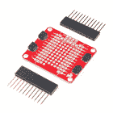
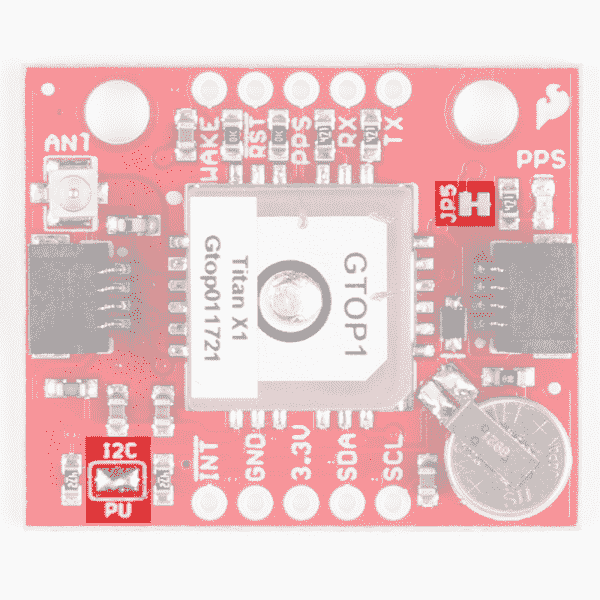
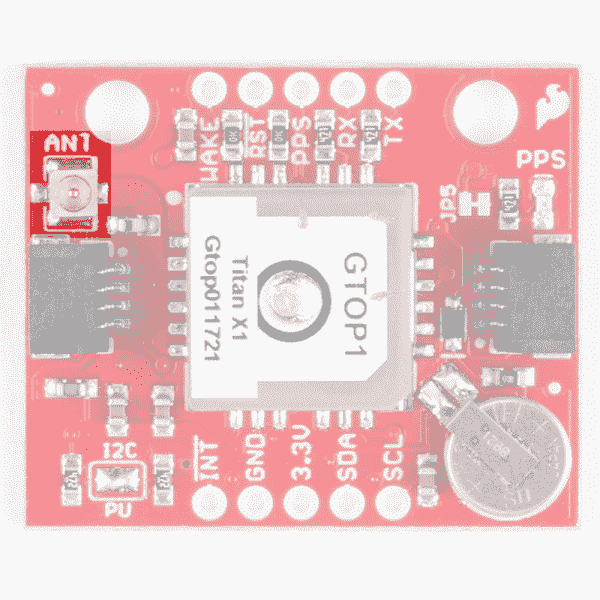
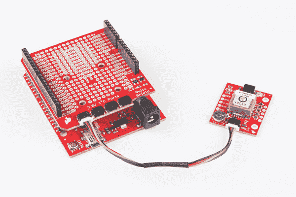
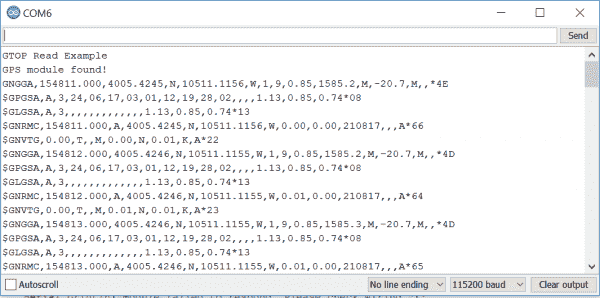
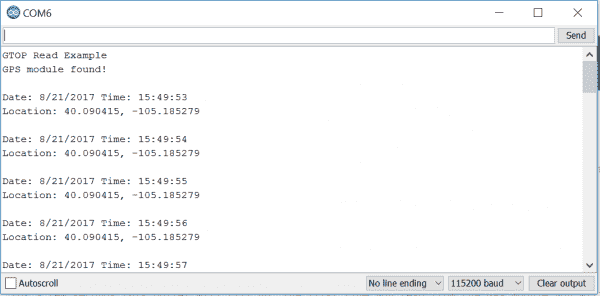

# SparkFun GPS 突破- XA1110 (Qwiic)连接指南

> 原文：<https://learn.sparkfun.com/tutorials/sparkfun-gps-breakout---xa1110-qwiic-hookup-guide>

## 介绍

GTOP 的 [XA1110 GPS 模块](https://www.sparkfun.com/products/14414)的确是一只珍禽。GPS 模块很难得到，但是一个 I ² C GPS+GLONASS 模块？现在我们用花生油做饭！这个小模块还利用了联发科 MT3333 芯片组，加载了专门的 SparkFun 固件，可以同时启用 I ² C 和串行端口。使用 I ² C 意味着你不必将你的串口与 GPS 捆绑在一起，让它向其他可能性开放。

[](https://www.sparkfun.com/products/14414) 

将**添加到您的[购物车](https://www.sparkfun.com/cart)中！**

 **### [【spark fun GPS Breakout-xa 1110(Qwiic)](https://www.sparkfun.com/products/14414)

[In stock](https://learn.sparkfun.com/static/bubbles/ "in stock") GPS-14414

SparkFun XA1110 GPS Breakout 是一款 I2C 支持的小型模块，由于采用了 Qwiic Connect 系统，因此易于连接。电子邮件…

$34.955[Favorited Favorite](# "Add to favorites") 25[Wish List](# "Add to wish list")** **该模块配置有板载 RTC 电池，可实现热启动功能。(XA1110 只需五秒钟来首次修复)U.FL 连接器让您可以选择通过 [U.FL 电缆](https://www.sparkfun.com/products/9145)连接[外部天线](https://www.sparkfun.com/products/464)

这个连接指南将告诉你如何开始计算你在地球上的位置。您还将学习如何将 GPS 的更新速率更改为 10 Hz，以及更改波特率。

[https://www.youtube.com/embed/JDpIKlNBPlk/?autohide=1&border=0&wmode=opaque&enablejsapi=1](https://www.youtube.com/embed/JDpIKlNBPlk/?autohide=1&border=0&wmode=opaque&enablejsapi=1)

### 所需材料

首先，你需要一个微控制器来控制一切。

[](https://www.sparkfun.com/products/13975) 

将**添加到您的[购物车](https://www.sparkfun.com/cart)中！**

 **### [spark fun red board——用 Arduino 编程 T3](https://www.sparkfun.com/products/13975)

[In stock](https://learn.sparkfun.com/static/bubbles/ "in stock") DEV-13975

SparkFun RedBoard 结合了 UNO 的 Optiboot 引导程序的简单性、FTDI 的稳定性和 shield com…

$21.5049[Favorited Favorite](# "Add to favorites") 89[Wish List](# "Add to wish list")****[](https://www.sparkfun.com/products/13907) 

将**添加到您的[购物车](https://www.sparkfun.com/cart)中！**

 **### [SparkFun ESP32 东西](https://www.sparkfun.com/products/13907)

[In stock](https://learn.sparkfun.com/static/bubbles/ "in stock") DEV-13907

SparkFun ESP32 Thing 是 Espressif 的 ESP32 的综合开发平台，ESP32 是他们的超级充电版本…

$23.5069[Favorited Favorite](# "Add to favorites") 83[Wish List](# "Add to wish list")****[](https://www.sparkfun.com/products/13774) 

将**添加到您的[购物车](https://www.sparkfun.com/cart)中！**

 **### [【粒子光子】](https://www.sparkfun.com/products/13774)

[Out of stock](https://learn.sparkfun.com/static/bubbles/ "out of stock") WRL-13774

Particle 的 IoT(物联网)硬件开发板 Photon 提供了构建互联网络所需的一切…

$19.0032[Favorited Favorite](# "Add to favorites") 51[Wish List](# "Add to wish list")****[](https://www.sparkfun.com/products/retired/13825) 

### [树莓派 3](https://www.sparkfun.com/products/retired/13825)

[Retired](https://learn.sparkfun.com/static/bubbles/ "Retired") DEV-13825

每个人都知道并喜欢 Raspberry Pi，但如果您不需要额外的外设来使其无线化会怎么样呢？覆盆子…

92 **Retired**[Favorited Favorite](# "Add to favorites") 97[Wish List](# "Add to wish list")****** ******现在，要进入 Qwiic 生态系统，关键是以下 Qwiic 屏蔽之一，以符合您对微控制器的偏好:

[](https://www.sparkfun.com/products/14352) 

将**添加到您的[购物车](https://www.sparkfun.com/cart)中！**

 **### [ArduinoT3 的 SparkFun Qwiic 盾](https://www.sparkfun.com/products/14352)

[In stock](https://learn.sparkfun.com/static/bubbles/ "in stock") DEV-14352

SparkFun Qwiic Shield 是一种易于组装的板，它提供了一种简单的方法来将 Qwiic Connect 系统与

$7.508[Favorited Favorite](# "Add to favorites") 39[Wish List](# "Add to wish list")****[](https://www.sparkfun.com/products/14459) 

将**添加到您的[购物车](https://www.sparkfun.com/cart)中！**

 **### [树莓派的 SparkFun Qwiic 帽子](https://www.sparkfun.com/products/14459)

[In stock](https://learn.sparkfun.com/static/bubbles/ "in stock") DEV-14459

树莓派的 SparkFun Qwiic 帽子是进入 Qwiic 生态系统的最快捷、最简单的方式，并且仍然适用于

$6.505[Favorited Favorite](# "Add to favorites") 33[Wish List](# "Add to wish list")****[](https://www.sparkfun.com/products/14477) 

将**添加到您的[购物车](https://www.sparkfun.com/cart)中！**

 **### [光子盾](https://www.sparkfun.com/products/14477)

[28 available](https://learn.sparkfun.com/static/bubbles/ "28 available") DEV-14477

SparkFun Qwiic Shield for Photon 是一个易于组装的板，提供了一种简单的方法来整合 Qwiic 系统…

$6.50[Favorited Favorite](# "Add to favorites") 7[Wish List](# "Add to wish list")****** ******您还需要一根 Qwiic 电缆将屏蔽层连接到 GPS 模块，选择适合您需要的长度。

[](https://www.sparkfun.com/products/14427) 

将**添加到您的[购物车](https://www.sparkfun.com/cart)中！**

 **### [Qwiic 线缆- 100mm](https://www.sparkfun.com/products/14427)

[In stock](https://learn.sparkfun.com/static/bubbles/ "in stock") PRT-14427

这是一条 100 毫米长的 4 芯电缆，带有 1 毫米 JST 端接。它旨在将支持 Qwiic 的组件连接在一起…

$1.50[Favorited Favorite](# "Add to favorites") 32[Wish List](# "Add to wish list")****[](https://www.sparkfun.com/products/14429) 

将**添加到您的[购物车](https://www.sparkfun.com/cart)中！**

 **### [Qwiic 线缆- 500mm](https://www.sparkfun.com/products/14429)

[In stock](https://learn.sparkfun.com/static/bubbles/ "in stock") PRT-14429

这是一根 500mm 长的 4 芯电缆，带有 1mm JST 端接。它旨在将支持 Qwiic 的组件连接在一起…

$1.951[Favorited Favorite](# "Add to favorites") 25[Wish List](# "Add to wish list")****[](https://www.sparkfun.com/products/14426) 

将**添加到您的[购物车](https://www.sparkfun.com/cart)中！**

 **### [Qwiic 线缆- 50mm](https://www.sparkfun.com/products/14426)

[In stock](https://learn.sparkfun.com/static/bubbles/ "in stock") PRT-14426

这是一根 50 毫米长的 4 芯电缆，带有 1 毫米 JST 端接。它旨在将支持 Qwiic 的组件连接在一起…

$0.95[Favorited Favorite](# "Add to favorites") 29[Wish List](# "Add to wish list")****[](https://www.sparkfun.com/products/14428) 

### [Qwiic 线缆- 200mm](https://www.sparkfun.com/products/14428)

[Out of stock](https://learn.sparkfun.com/static/bubbles/ "out of stock") PRT-14428

这是一根 200 毫米长的 4 芯电缆，带有 1 毫米 JST 端接。它旨在将支持 Qwiic 的组件连接在一起…

[Favorited Favorite](# "Add to favorites") 21[Wish List](# "Add to wish list")****** ******### 推荐阅读

如果你不熟悉 Qwiic 系统，我们推荐你在这里阅读[以获得一个概述](https://www.sparkfun.com/qwiic)。

| [](https://www.sparkfun.com/qwiic) |
| *[Qwiic 连接系统](https://www.sparkfun.com/qwiic)* |

如果你不熟悉下面的教程，我们也建议你看一看。

[](https://learn.sparkfun.com/tutorials/gps-basics) [### GPS 基础知识](https://learn.sparkfun.com/tutorials/gps-basics) The Global Positioning System (GPS) is an engineering marvel that we all have access to for a relatively low cost and no subscription fee. With the correct hardware and minimal effort, you can determine your position and time almost anywhere on the globe.[Favorited Favorite](# "Add to favorites") 31[](https://learn.sparkfun.com/tutorials/i2c) [### I2C](https://learn.sparkfun.com/tutorials/i2c) An introduction to I2C, one of the main embedded communications protocols in use today.[Favorited Favorite](# "Add to favorites") 128[](https://learn.sparkfun.com/tutorials/qwiic-shield-for-arduino--photon-hookup-guide) [### Arduino 和光子连接指南的 Qwiic 屏蔽](https://learn.sparkfun.com/tutorials/qwiic-shield-for-arduino--photon-hookup-guide) Get started with our Qwiic ecosystem with the Qwiic shield for Arduino or Photon.[Favorited Favorite](# "Add to favorites") 5

## 硬件概述

下表列出了 XA1110 的所有硬件特性和规格。

| **特性** | **范围** |
| 工作电压 | 3.3V: **调节到 1.8V - 3.6V** |
| 目前的 | 25 毫安(典型值) |
| 热/温/冷启动 | 1/5/15 秒 |
| 更新速率 | 1 赫兹(默认)，0.1-10 赫兹 |
| I ² C 接口 | 100kHz 和 400kHz (3.3V) |
| I ² C 地址 | 0x10 |
| 通用非同步收发传输器(Universal Asynchronous Receiver/Transmitter) | 9600 bps(默认)，4800-115200 bps (3.3V) |
| 位置精度 | < 3.0 米，启用 SBAS 时< 2.5 米 |
| 卫星 | 搜索时 99 次，追踪时 33 次 |
| 灵敏度 | -148dBm 采集，-165dBm 跟踪 |
| 最高海拔 | 80 公里(中间层)使用示例配置草图启用高空气球模式 |
| RTC 电池 | 5.5 毫安时，无需电源即可热启动 15 天 |

### 腿

下表列出了 XA1110 的所有引脚及其功能。

| 别针 | 描述 | 方向 |
| GND | 地面 | 在…里 |
| 3.3V | 力量 | 在…里 |
| 国家药品监督管理局 | 数据 | 在…里 |
| SCL | 时钟 | 在…里 |
| INT | 中断，当 NMEA 数据就绪时变为低电平，读取数据包后，引脚拉高 | 在外 |
| 叫醒 | 醒醒 | 在…里 |
| RST | 拉低将重置模块 | 在…里 |
| 再附言 | 每秒提供一个脉冲信号 | 在外 |
| 药方(prescription 的缩写) | UART 接收器；接受命令 | 在…里 |
| 谢谢 | UART 发送器；输出 GPS 信息 | 在外 |

## 可选功能

XA1110 分线点有几个可选特性。第一个是禁用每秒脉冲 LED 的选项。这可以通过用业余爱好刀切开 JP5 跳线上的连接来完成。如果多个传感器连接到总线并使能上拉电阻，并联等效电阻将产生过强的上拉电阻，使总线无法正常工作。一般来说，如果总线上连接了多个器件，则除一对上拉电阻外，应禁用所有上拉电阻。如果您需要断开上拉电阻，可以通过移除下面突出显示的上拉电阻跳线上的焊料来移除。下图显示了两种跳线。

[](https://cdn.sparkfun.com/assets/learn_tutorials/6/9/1/jumpers.png)

板上还有一个 U.FL 连接器，如下图所示，它可以与 [U.FL 电缆](https://www.sparkfun.com/products/9145)一起使用，以连接到[外部天线](https://www.sparkfun.com/products/464)

[](https://cdn.sparkfun.com/assets/learn_tutorials/6/9/1/antenna.png)

## 硬件装配

如果你还没有组装好你的 Qwiic 盾，现在是时候去上那个教程了。随着盾牌的组装，Sparkfun 的新 Qwiic 环境意味着连接传感器不可能更容易。只需将 qw IC 电缆的一端插入 XA1110 分线点，另一端插入 qw IC 屏蔽，即可上传草图并确定您的位置。这似乎太容易了，但这就是为什么我们这样做！

[](https://cdn.sparkfun.com/assets/learn_tutorials/6/9/1/Qwic_Titan_X1_GPS_Hookup_Guide-01.jpg)

## 库概述

首先，你需要下载并安装 Sparkfun I ² C GPS 库，这可以使用下面的按钮或使用 Arduino 库管理器来完成。

[Download the SparkFun I2C GPS Library](https://github.com/sparkfun/SparkFun_I2C_GPS_Arduino_Library/archive/master.zip)

**注意:**此示例假设您在桌面上使用的是最新版本的 Arduino IDE。如果这是你第一次使用 Arduino，请回顾我们关于[安装 Arduino IDE 的教程。](https://learn.sparkfun.com/tutorials/installing-arduino-ide)如果您之前没有安装 Arduino 库，请查看我们的[安装指南。](https://learn.sparkfun.com/tutorials/installing-an-arduino-library)

在我们开始开发草图之前，让我们看看这个库的可用功能。

*   `boolean begin(TwoWire &wireport = Wire, uint32_t i2cSpeed = I2C_SPEED_STANDARD);` - `begin()`用于启动 GPS，运行方式如下:
    *   以给定的端口和时钟速度开始运行 I ² C 端口
    *   Pings 模块并检查是否有响应
    *   如果收到响应，返回`TRUE`，否则返回`FALSE`。
*   `void check();` -检查模块是否有新数据。
*   `uint8_t available();` -返回可用的字节数。如果零可用，将调用 check()。
*   `uint8_t read();` -返回下一个可用字节。
*   `void enableDebugging(Stream &debugPort = Serial);` -输出各种信息协助调试。
*   `void disableDebugging();` -非常简单，关闭调试。
*   `boolean sendMTKpacket(String command);` -可用于向 GPS 模块发送命令或配置。
    *   MTK 上的输入缓冲区是 255 字节，因此字符串必须短于 255 字节。
    *   传输结束后，给模块 10 ms 时间来处理信息。
*   `String createMTKpacket(uint16_t packetType, String dataField);` -从 packetType 和任何设置创建一个配置语句(字符串)。更多信息参见[‘MTK NMEA 数据包’](https://cdn.sparkfun.com/assets/parts/1/2/2/8/0/PMTK_Packet_User_Manual.pdf)数据表。
*   `String calcCRCforMTK(String sentence);` - XORs 字节创建 MTK 包。

**注:**由于日本最近发射了一颗新的 QZSS 卫星，亚太地区(东经 70 度至-160 度)的用户可能会在两个小时内经历巨大的位置漂移。为了补救这一点，有两种选择。第一种是每 2 小时简单地重置模块。第二种选择是完全禁用 QZSS 功能。为此，只需在安装循环中使用以下命令。sendMTKpacket($PMTK352，1 * 2B<cr><lf>)；</lf></cr>

## 示例代码

你上一步应该已经下载了 SparkFun I ² C GPS 库，如果没有，就回去点击按钮下载。其中应该包含该库以及五个示例。我们将从前两个例子开始。

将以下示例上传到您选择的微控制器。

```
language:c
#include "SparkFun_I2C_GPS_Arduino_Library.h"
I2CGPS myI2CGPS; //Hook object to the library

void setup()
{
  Serial.begin(115200);
  Serial.println("GTOP Read Example");

  if (myI2CGPS.begin() == false)//Checks for succesful initialization of GPS
  {
    Serial.println("Module failed to respond. Please check wiring.");
    while (1); //Freeze!
  }
  Serial.println("GPS module found!");
}

void loop() //Writes GPS data to the Serial port with a baud rate of 115200
{
  while (myI2CGPS.available()) //available() returns the number of new bytes available from the GPS module
  {
    byte incoming = myI2CGPS.read(); //Read the latest byte from Qwiic GPS

    if(incoming == '$') Serial.println(); //Break the sentences onto new lines
    Serial.write(incoming); //Print this character
  }
} 
```

第一个例子输出原始的 [NMEA 句子](http://www.gpsinformation.org/dale/nmea.htm)。看起来像这样:

[](https://cdn.sparkfun.com/assets/learn_tutorials/6/9/1/Example1-output.PNG)

如果你的 GPS 没有卫星定位，你只会得到零而不是数字。如果您不能流利地使用 GPS，这些 NMEA 句子可能有点难以理解，所以让我们转到第二个示例，该示例将获取这些数据，并使用 TinyGPS 库将其转换为一些合理的纬度和经度数据。第二个例子需要 TinyGPS 库，可以使用下面的按钮下载。

[Download the Tiny GPS Library](https://github.com/mikalhart/TinyGPSPlus/archive/master.zip)

下面的示例代码将采用这些 NMEA 句子，并使用`displayInfo()`函数输出一些友好的纬度和经度读数。

```
language:c
#include <SparkFun_I2C_GPS_Arduino_Library.h> //Use Library Manager or download here: https://github.com/sparkfun/SparkFun_I2C_GPS_Arduino_Library
I2CGPS myI2CGPS; //Hook object to the library

#include <TinyGPS++.h> //From: https://github.com/mikalhart/TinyGPSPlus
TinyGPSPlus gps; //Declare gps object

void setup()
{
  Serial.begin(115200);
  Serial.println("GTOP Read Example");

  if (myI2CGPS.begin() == false)
  {
    Serial.println("Module failed to respond. Please check wiring.");
    while (1); //Freeze!
  }
  Serial.println("GPS module found!");
}

void loop()
{
  while (myI2CGPS.available()) //available() returns the number of new bytes available from the GPS module
  {
    gps.encode(myI2CGPS.read()); //Feed the GPS parser
  }

  if (gps.time.isUpdated()) //Check to see if new GPS info is available
  {
    displayInfo();
  }
}

//Display new GPS info
void displayInfo()
{
  //We have new GPS data to deal with!
  Serial.println();

  if (gps.time.isValid())
  {
    Serial.print(F("Date: "));
    Serial.print(gps.date.month());
    Serial.print(F("/"));
    Serial.print(gps.date.day());
    Serial.print(F("/"));
    Serial.print(gps.date.year());

    Serial.print((" Time: "));
    if (gps.time.hour() < 10) Serial.print(F("0"));
    Serial.print(gps.time.hour());
    Serial.print(F(":"));
    if (gps.time.minute() < 10) Serial.print(F("0"));
    Serial.print(gps.time.minute());
    Serial.print(F(":"));
    if (gps.time.second() < 10) Serial.print(F("0"));
    Serial.print(gps.time.second());

    Serial.println(); //Done printing time
  }
  else
  {
    Serial.println(F("Time not yet valid"));
  }

  if (gps.location.isValid())
  {
    Serial.print("Location: ");
    Serial.print(gps.location.lat(), 6);
    Serial.print(F(", "));
    Serial.print(gps.location.lng(), 6);
    Serial.println();
  }
  else
  {
    Serial.println(F("Location not yet valid"));
  }
} 
```

串行监视器中该代码的输出应该类似于下图。如果模块还没有定位，您将看到`Location not yet valid`而不是纬度和经度读数。

[](https://cdn.sparkfun.com/assets/learn_tutorials/6/9/1/Example2-output.PNG)

## 资源和更进一步

你终于知道你在哪里了！现在是时候把这个全球定位系统，并纳入自己的项目。

有关更多信息，请查看下面的资源:

*   [示意图(PDF)](https://cdn.sparkfun.com/assets/4/e/b/c/c/Qwiic_GPS_-_Titan_X1_v10.pdf)
*   [老鹰文件(ZIP)](https://cdn.sparkfun.com/assets/learn_tutorials/6/9/1/Qwiic_GPS_-_Titan_X1.zip)
*   [示例草图(ZIP)](https://cdn.sparkfun.com/assets/learn_tutorials/6/9/1/examples.zip)
*   [Arduino 库 GitHub Repo](https://github.com/sparkfun/SparkFun_I2C_GPS_Arduino_Library)
*   [Python 包 GitHub Repo](https://github.com/sparkfun/Qwiic_Titan_Gps_Py)
*   [Qwiic 系统登陆页面](https://www.sparkfun.com/qwiic)
*   [GPS 模块 XA1110 数据手册(PDF)](https://cdn.sparkfun.com/assets/parts/1/2/2/8/0/GlobalTop_Titan_X1_Datasheet.pdf)
*   [NMEA 超过 I2C 应用笔记(PDF)](https://cdn.sparkfun.com/assets/parts/1/2/2/8/0/GTOP_NMEA_over_I2C_Application_Note.pdf)
*   [联发科协议和数据包手册(PDF)](https://cdn.sparkfun.com/assets/parts/1/2/2/8/0/PMTK_Packet_User_Manual.pdf)
*   GitHub Repo 将总是拥有最新的设计文件。

要获得更多与 GPS 相关的乐趣，请查看其他 SparkFun 教程。

[](https://learn.sparkfun.com/tutorials/gps-logger-shield-hookup-guide) [### GPS 记录器屏蔽连接指南](https://learn.sparkfun.com/tutorials/gps-logger-shield-hookup-guide) How to assemble and hookup the SparkFun GPS Logger Shield. Never lose track of your Arduino again 6[](https://learn.sparkfun.com/tutorials/lte-cat-m1nb-iot-shield-hookup-guide) [### LTE 卡特彼勒 M1/NB-IoT 屏蔽连接指南](https://learn.sparkfun.com/tutorials/lte-cat-m1nb-iot-shield-hookup-guide) The SparkFun LTE CAT M1/NB-IoT Shield equips your Arduino or Arduino-compatible microcontroller with access to data networks across the globe. This shield adds wireless, high-bandwidth cellular functionality to your IoT project 3[](https://learn.sparkfun.com/tutorials/gps-rtk2-hookup-guide) [### GPS-RTK2 连接指南](https://learn.sparkfun.com/tutorials/gps-rtk2-hookup-guide) Get precision down to the diameter of a dime with the new ZED-F9P from u-blox.[Favorited Favorite](# "Add to favorites") 9[](https://learn.sparkfun.com/tutorials/sparkfun-gps-neo-m9n-hookup-guide) [### SparkFun GPS NEO-M9N 连接指南](https://learn.sparkfun.com/tutorials/sparkfun-gps-neo-m9n-hookup-guide) The u-blox NEO-M9N is a powerful GPS unit that comes with a chip antenna, SMA connector, and u.FL connector. We will quickly get you set up using the Qwiic ecosystem and Arduino so that you can start reading the output 3********************