# Lumenati Hookup Guide

> 原文：<https://learn.sparkfun.com/tutorials/lumenati-hookup-guide>

## 介绍

Lumenati 系列 LED 板旨在为您的项目提供照明优势。基于 [APA102C 可寻址 LED](https://www.sparkfun.com/products/14863) ，这些 LED 采用由时钟线和数据线组成的双线通信协议。虽然这比标准 WS2812B 可寻址 led 多需要一根导线，但其优势是与 led 的通信在某种程度上变得与时间无关，允许您直接在 Raspberry Pi 或其他单板计算机上运行这些，这些计算机通常不允许长时间的精确定时数据流，而无需使用额外的硬件。

[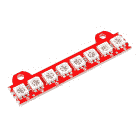](https://www.sparkfun.com/products/14359) 

将**添加到您的[购物车](https://www.sparkfun.com/cart)中！**

### [spark fun Lumenati 8-stick](https://www.sparkfun.com/products/14359)

[In stock](https://learn.sparkfun.com/static/bubbles/ "in stock") COM-14359

SparkFun Lumenati 8-stick 是一个小型电路板，配备了八个连续的 APA102C LEDs 和两个安装位置。

$9.503[Favorited Favorite](# "Add to favorites") 13[Wish List](# "Add to wish list")****[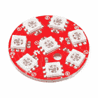](https://www.sparkfun.com/products/retired/14357) 

### [【spar fun luminati 8-pack】](https://www.sparkfun.com/products/retired/14357)

[Retired](https://learn.sparkfun.com/static/bubbles/ "Retired") COM-14357

SparkFun Lumenati 8-pack 是一个硬币大小的电路板，配有七个 APA102C LEDs，围绕电路板的外缘，…

**Retired**[Favorited Favorite](# "Add to favorites") 6[Wish List](# "Add to wish list")[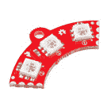](https://www.sparkfun.com/products/14452) 

将**添加到您的[购物车](https://www.sparkfun.com/cart)中！**

### [【火星塞 90L](https://www.sparkfun.com/products/14452)

[In stock](https://learn.sparkfun.com/static/bubbles/ "in stock") COM-14452

SparkFun Lumenati 90L 是一个小的四分之一圆板，配有三个 APA102C LEDs 和一个安装位置。

$5.25[Favorited Favorite](# "Add to favorites") 4[Wish List](# "Add to wish list")****[](https://www.sparkfun.com/products/14358) 

将**添加到您的[购物车](https://www.sparkfun.com/cart)中！**

### [【火星塞 90R](https://www.sparkfun.com/products/14358)

[31 available](https://learn.sparkfun.com/static/bubbles/ "31 available") COM-14358

SparkFun Lumenati 90R 是一个小的四分之一圆板，配有三个 APA102C LEDs 和一个安装位置。

$5.25 $2.36[Favorited Favorite](# "Add to favorites") 6[Wish List](# "Add to wish list")****[](https://www.sparkfun.com/products/retired/14353) 

### [火星塞 4-pack](https://www.sparkfun.com/products/retired/14353)

[Retired](https://learn.sparkfun.com/static/bubbles/ "Retired") COM-14353

SparkFun Lumenati 4-pack 是一个硬币大小的电路板，外部边缘装有四个 APA102C LEDs。

**Retired**[Favorited Favorite](# "Add to favorites") 9[Wish List](# "Add to wish list")[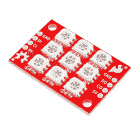](https://www.sparkfun.com/products/retired/14360) 

### [【spar fun luminati 3x 3】](https://www.sparkfun.com/products/retired/14360)

[Retired](https://learn.sparkfun.com/static/bubbles/ "Retired") COM-14360

SparkFun Lumenati 3x3 是一个小型的矩形电路板，配有九个排列成 3x3 阵列的 APA102C LEDs。

1 **Retired**[Favorited Favorite](# "Add to favorites") 5[Wish List](# "Add to wish list")**************Heads up!** If you are looking for a smaller version of the Lumenati? Check out the LuMini's!

[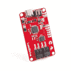](https://www.sparkfun.com/products/14779) 

将**添加到您的[购物车](https://www.sparkfun.com/cart)中！**

### [SparkFun LumiDrive LED 驱动](https://www.sparkfun.com/products/14779)

[In stock](https://learn.sparkfun.com/static/bubbles/ "in stock") DEV-14779

使用 SparkFun LumiDrive，您将能够直接从主板上控制和个性化整个 APA102s 系列

$22.50[Favorited Favorite](# "Add to favorites") 13[Wish List](# "Add to wish list")****[](https://www.sparkfun.com/products/14965) 

将**添加到您的[购物车](https://www.sparkfun.com/cart)中！**

### [SparkFun LuMini LED 戒指- 3 寸(60 x APA 102-2020)](https://www.sparkfun.com/products/14965)

[Out of stock](https://learn.sparkfun.com/static/bubbles/ "out of stock") COM-14965

三英寸版本的闪光发光二极管戒指，装有 60 个可单独寻址的 LEDS，每个能够产生…

$29.505[Favorited Favorite](# "Add to favorites") 11[Wish List](# "Add to wish list")****[](https://www.sparkfun.com/products/14967) 

将**添加到您的[购物车](https://www.sparkfun.com/cart)中！**

### [SparkFun LuMini LED 戒指- 1 寸(20 x APA 102-2020)](https://www.sparkfun.com/products/14967)

[Out of stock](https://learn.sparkfun.com/static/bubbles/ "out of stock") COM-14967

SparkFun LuMini LED 戒指的一英寸版本，装有 20 个可单独寻址的 LEDS，每个都能产生…

$11.50[Favorited Favorite](# "Add to favorites") 14[Wish List](# "Add to wish list")****[](https://www.sparkfun.com/products/15047) 

将**添加到您的[购物车](https://www.sparkfun.com/cart)中！**

### [](https://www.sparkfun.com/products/15047)

[Out of stock](https://learn.sparkfun.com/static/bubbles/ "out of stock") COM-15047

8x8 SparkFun LuMini LED 矩阵，包含 64 个可单独寻址的 LEDS，每个能够产生 1600 万种颜色…

$27.951[Favorited Favorite](# "Add to favorites") 11[Wish List](# "Add to wish list")******** ********[https://www.youtube.com/embed/vB8AXfSww84/?autohide=1&border=0&wmode=opaque&enablejsapi=1](https://www.youtube.com/embed/vB8AXfSww84/?autohide=1&border=0&wmode=opaque&enablejsapi=1)

### 所需材料

首先，你需要一个控制系统。对于我们的例子来说，Raspberry Pi 或 Arduino 就足够了，但实际上任何具有 GPIO 的东西都可以工作。

[](https://www.sparkfun.com/products/11113) 

将**添加到您的[购物车](https://www.sparkfun.com/cart)中！**

### [Arduino Pro Mini 328-5V/16 MHz](https://www.sparkfun.com/products/11113)

[In stock](https://learn.sparkfun.com/static/bubbles/ "in stock") DEV-11113

SparkFun 对 Arduino 的极简设计方法。这是一个 5V Arduino 运行 16MHz 引导加载程序。

$10.95137[Favorited Favorite](# "Add to favorites") 166[Wish List](# "Add to wish list")****[](https://www.sparkfun.com/products/11114) 

将**添加到您的[购物车](https://www.sparkfun.com/cart)中！**

### [Arduino Pro Mini 328-3.3V/8 MHz](https://www.sparkfun.com/products/11114)

[In stock](https://learn.sparkfun.com/static/bubbles/ "in stock") DEV-11114

SparkFun 对 Arduino 的极简设计方法。这是一个 3.3V Arduino 运行 8MHz 引导加载程序。

$10.9552[Favorited Favorite](# "Add to favorites") 91[Wish List](# "Add to wish list")****[](https://www.sparkfun.com/products/13975) 

将**添加到您的[购物车](https://www.sparkfun.com/cart)中！**

### [spark fun red board——用 Arduino 编程 T3](https://www.sparkfun.com/products/13975)

[In stock](https://learn.sparkfun.com/static/bubbles/ "in stock") DEV-13975

SparkFun RedBoard 结合了 UNO 的 Optiboot 引导程序的简单性、FTDI 的稳定性和 shield com…

$21.5049[Favorited Favorite](# "Add to favorites") 89[Wish List](# "Add to wish list")****[](https://www.sparkfun.com/products/13664) 

将**添加到您的[购物车](https://www.sparkfun.com/cart)中！**

### [SparkFun SAMD21 迷你突围](https://www.sparkfun.com/products/13664)

[In stock](https://learn.sparkfun.com/static/bubbles/ "in stock") DEV-13664

如果您准备从旧的 8 位/16MHz 微控制器升级您的 Arduino 游戏，SparkFun SAMD21 Mini Breakout 是…

$22.5018[Favorited Favorite](# "Add to favorites") 36[Wish List](# "Add to wish list")****[](https://www.sparkfun.com/products/retired/13825) 

### [树莓派 3](https://www.sparkfun.com/products/retired/13825)

[Retired](https://learn.sparkfun.com/static/bubbles/ "Retired") DEV-13825

每个人都知道并喜欢 Raspberry Pi，但如果您不需要额外的外设来使其无线化会怎么样呢？覆盆子…

92 **Retired**[Favorited Favorite](# "Add to favorites") 97[Wish List](# "Add to wish list")[](https://www.sparkfun.com/products/14277) 

### [树莓派零 W](https://www.sparkfun.com/products/14277)

[Out of stock](https://learn.sparkfun.com/static/bubbles/ "out of stock") DEV-14277

Raspberry Pi Zero W 仍然是你所知道和喜爱的 Pi，但尺寸大大缩小，只有 65 毫米长，30 毫米宽，而且…

44[Favorited Favorite](# "Add to favorites") 111[Wish List](# "Add to wish list")******** ********Lumenati 板上的 [APA102C 可寻址 led](https://www.sparkfun.com/products/14863)本身以 5V 逻辑运行，因此选择一个可以为您提供 0-5V 电压的控制器将省去您的麻烦，但它可以通过使用电平转换器以 3.3V 逻辑工作。

[](https://www.sparkfun.com/products/12009) 

将**添加到您的[购物车](https://www.sparkfun.com/cart)中！**

### [SparkFun 逻辑电平转换器-双向](https://www.sparkfun.com/products/12009)

[In stock](https://learn.sparkfun.com/static/bubbles/ "in stock") BOB-12009

SparkFun 双向逻辑电平转换器是一个小型设备，可以安全地将 5V 信号降压至 3.3V，并升压 3。…

$3.50116[Favorited Favorite](# "Add to favorites") 146[Wish List](# "Add to wish list")****[](https://www.sparkfun.com/products/retired/11955) 

### [SparkFun 关卡翻译器分会场- PCA9306](https://www.sparkfun.com/products/retired/11955)

[Retired](https://learn.sparkfun.com/static/bubbles/ "Retired") BOB-11955

这是 PCA9306 双路双向电压电平转换器的分线板。因为不同的部分有时使用 d…

3 **Retired**[Favorited Favorite](# "Add to favorites") 12[Wish List](# "Add to wish list")** **你还需要一个 5V 的电源来运行你的控制器和新的灯。当红色、绿色和蓝色都满负荷时，每个 APA102C 可以消耗多达 60mA 的电流，所以你会想要一个稍微结实的东西。我们选择了支持 2.5A 的墙壁适配器，这对于我们的演示来说应该足够了。但是，如果你有一个更大的项目，看看平均井 5V/20A 电源。

[](https://www.sparkfun.com/products/13831) 

将**添加到您的[购物车](https://www.sparkfun.com/cart)中！**

### [壁式适配器电源- 5.1V DC 2.5A (USB Micro-B)](https://www.sparkfun.com/products/13831)

[In stock](https://learn.sparkfun.com/static/bubbles/ "in stock") TOL-13831

这是一个高品质的开关“壁式”交流到 DC 5.1V 2500ma USB 微型 B 壁式电源，专为…

$8.9521[Favorited Favorite](# "Add to favorites") 47[Wish List](# "Add to wish list")****[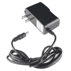](https://www.sparkfun.com/products/retired/12889) 

### [壁式适配器电源- 5V DC 2A(桶形插孔)](https://www.sparkfun.com/products/retired/12889)

[Retired](https://learn.sparkfun.com/static/bubbles/ "Retired") TOL-12889

这是一个高品质的开关“壁式电源”交流到 DC 5V 2000 毫安桶形插座壁式电源，专为…

16 **Retired**[Favorited Favorite](# "Add to favorites") 19[Wish List](# "Add to wish list")[](https://www.sparkfun.com/products/retired/14098) 

### [指井开关电源-5v 直流，20A](https://www.sparkfun.com/products/retired/14098)

[Retired](https://learn.sparkfun.com/static/bubbles/ "Retired") TOL-14098

这是一款来自 Mean Well 的 100W 单输出开关电源。这种电源非常可靠，能够输出很高的电压

**Retired**[Favorited Favorite](# "Add to favorites") 19[Wish List](# "Add to wish list")** **### 工具

最后，你需要一些工具。一个烙铁，一些焊料，电线和一个剥线钳就可以了。如果你不喜欢把手指靠近烙铁的尖端，也许还需要一些镊子。

[](https://www.sparkfun.com/products/11375) 

将**添加到您的[购物车](https://www.sparkfun.com/cart)中！**

### [](https://www.sparkfun.com/products/11375)

[In stock](https://learn.sparkfun.com/static/bubbles/ "in stock") PRT-11375

各种颜色的电线:你知道这是一个美丽的东西。六种不同颜色的绞线装在一个纸板盒里…

$22.5019[Favorited Favorite](# "Add to favorites") 46[Wish List](# "Add to wish list")****[](https://www.sparkfun.com/products/14456) 

将**添加到您的[购物车](https://www.sparkfun.com/cart)中！**

### [【烙铁- 60W(可调温度)](https://www.sparkfun.com/products/14456)

[In stock](https://learn.sparkfun.com/static/bubbles/ "in stock") TOL-14456

当你不想倾家荡产，但又需要一个可靠的烙铁时，这个可调节温度的烙铁是一个很好的工具…

$16.5016[Favorited Favorite](# "Add to favorites") 43[Wish List](# "Add to wish list")****[](https://www.sparkfun.com/products/9163) 

将**添加到您的[购物车](https://www.sparkfun.com/cart)中！**

### [无铅焊料- 15 克管](https://www.sparkfun.com/products/9163)

[In stock](https://learn.sparkfun.com/static/bubbles/ "in stock") TOL-09163

这是你的无铅焊料的基本管，带有不干净的水溶性树脂芯。0.031 英寸规格，15 克

$3.954[Favorited Favorite](# "Add to favorites") 14[Wish List](# "Add to wish list")****[](https://www.sparkfun.com/products/10603) 

将**添加到您的[购物车](https://www.sparkfun.com/cart)中！**

### [【镊子直(ESD 安全)】](https://www.sparkfun.com/products/10603)

[In stock](https://learn.sparkfun.com/static/bubbles/ "in stock") TOL-10603

你可以从我们种类繁多的镊子看出，我们 SparkFun 非常擅长拾取细小的东西。为了确保我们…

$4.504[Favorited Favorite](# "Add to favorites") 36[Wish List](# "Add to wish list")****[](https://www.sparkfun.com/products/retired/14762) 

### [剥线钳- 22-30AWG](https://www.sparkfun.com/products/retired/14762)

[Retired](https://learn.sparkfun.com/static/bubbles/ "Retired") TOL-14762

这些是你的基本的，普通的剥线钳从 Techni-Tool 与舒适的抓地力，使他们成为一个负担得起的选择…

4 **Retired**[Favorited Favorite](# "Add to favorites") 8[Wish List](# "Add to wish list")******** ********### 推荐阅读

我们试图使这个连接指南尽可能简单，但你可能缺乏一些基本信息，可以帮助你理解我们前进。更多信息，请查看这些教程...

[](https://learn.sparkfun.com/tutorials/how-to-solder-through-hole-soldering) [### 如何焊接:通孔焊接](https://learn.sparkfun.com/tutorials/how-to-solder-through-hole-soldering) This tutorial covers everything you need to know about through-hole soldering.[Favorited Favorite](# "Add to favorites") 70[](https://learn.sparkfun.com/tutorials/installing-an-arduino-library) [### 安装 Arduino 库](https://learn.sparkfun.com/tutorials/installing-an-arduino-library) How do I install a custom Arduino library? It's easy! This tutorial will go over how to install an Arduino library using the Arduino Library Manager. For libraries not linked with the Arduino IDE, we will also go over manually installing an Arduino library.[Favorited Favorite](# "Add to favorites") 22[](https://learn.sparkfun.com/tutorials/how-to-power-a-project) [### 如何为项目提供动力](https://learn.sparkfun.com/tutorials/how-to-power-a-project) A tutorial to help figure out the power requirements of your project.[Favorited Favorite](# "Add to favorites") 67[](https://learn.sparkfun.com/tutorials/logic-levels) [### 逻辑电平](https://learn.sparkfun.com/tutorials/logic-levels) Learn the difference between 3.3V and 5V devices and logic levels.[Favorited Favorite](# "Add to favorites") 82[](https://learn.sparkfun.com/tutorials/how-to-solder-castellated-mounting-holes) [### 如何焊接:堞形安装孔](https://learn.sparkfun.com/tutorials/how-to-solder-castellated-mounting-holes) Tutorial showing how to solder castellated holes (or castellations). This might come in handy if you need to solder a module or PCB to another PCB. These castellations are becoming popular with integrated WiFi and Bluetooth modules.[Favorited Favorite](# "Add to favorites") 19[](https://learn.sparkfun.com/tutorials/raspberry-pi-spi-and-i2c-tutorial) [### 树莓派 SPI 和 I2C 教程](https://learn.sparkfun.com/tutorials/raspberry-pi-spi-and-i2c-tutorial) Learn how to use serial I2C and SPI buses on your Raspberry Pi using the wiringPi I/O library for C/C++ and spidev/smbus for Python.[Favorited Favorite](# "Add to favorites") 24

## 硬件概述

Lumenati 板有六种不同的变化。

[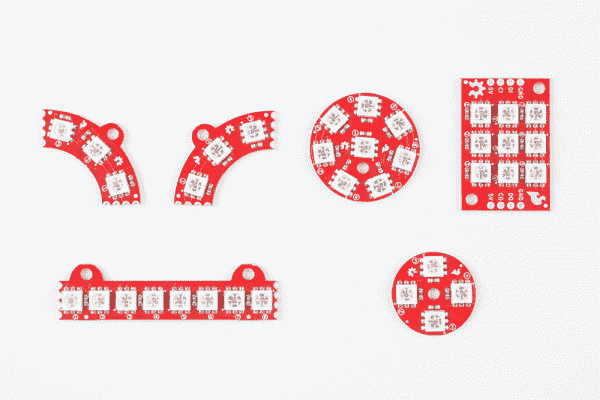](https://cdn.sparkfun.com/assets/learn_tutorials/6/9/6/Lumenati_Hookup_Guide-01.jpg)*The various shapes of Lumenati boards.*

每个 Lumenati 板如下所示:

[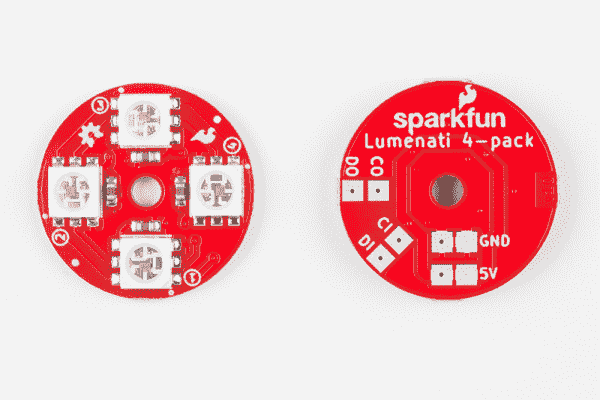](https://cdn.sparkfun.com/assets/learn_tutorials/6/9/6/Lumenati_Hookup_Guide-05.jpg)*The 4-pack.*[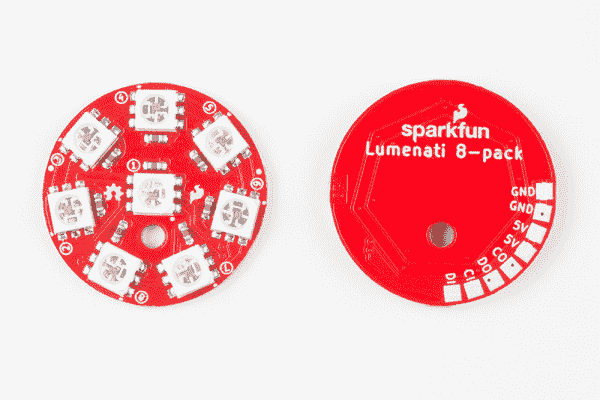](https://cdn.sparkfun.com/assets/learn_tutorials/6/9/6/Lumenati_Hookup_Guide-02.jpg)*The 8-pack.*[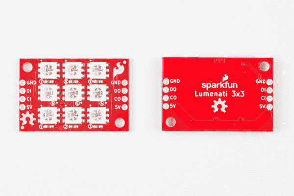](https://cdn.sparkfun.com/assets/learn_tutorials/6/9/6/Lumenati_Hookup_Guide-03.jpg)*The 3x3.*[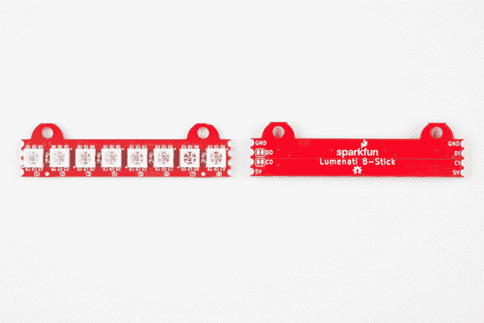](https://cdn.sparkfun.com/assets/learn_tutorials/6/9/6/Lumenati_Hookup_Guide-04.jpg)*The 8-stick*[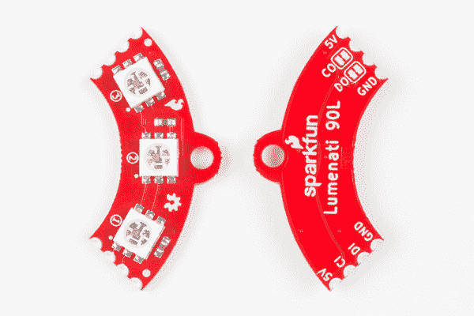](https://cdn.sparkfun.com/assets/learn_tutorials/6/9/6/Lumenati_Hookup_Guide-06.jpg)*The 90L.*[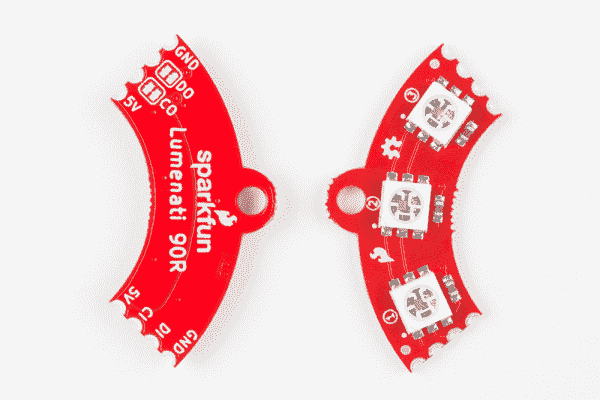](https://cdn.sparkfun.com/assets/learn_tutorials/6/9/6/Lumenati_Hookup_Guide-07.jpg)*The 90R.*

### 菊花链 Lumentai 板

任何板都可以独立使用或以菊花链形式使用。然而，8-stick、90L 和 90R 在设计时特别考虑了简单的菊花链连接。

[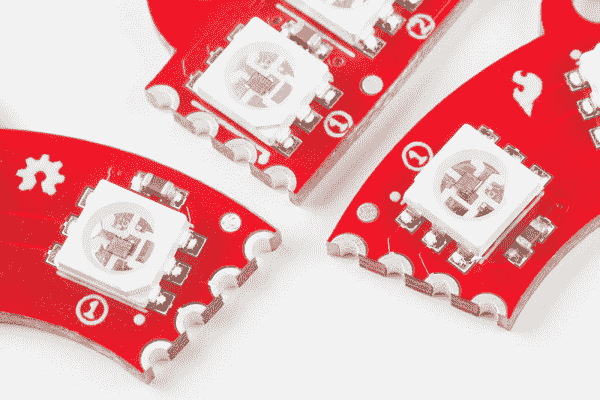](https://cdn.sparkfun.com/assets/learn_tutorials/6/9/6/Lumenati_Hookup_Guide-08.jpg)*Castelated edge connectors. Just butt them up against each other and solder together.*

这 3 块电路板的 CO 和 DO(时钟输出和数据输出)上也有焊接跳线。这些是为了在进行闭环设计时中断这些信号，以免最后一个 LED 的时钟和数据干扰第一个 LED 的时钟和数据。这种情况下，+5V 和接地走线保持连续，以最大化电流吞吐量。CO 和 DO 上的焊接跳线闭合，一条小走线桥接焊盘。如果你想打开它们，只需拿一把小爱好刀(或类似的破坏工具)小心地切断痕迹。

**Note:** It is _critical_ that you cut the traces in the jumpers before you power up your LEDs if you've put together a continuous loop of Lumenati boards. Otherwise, it is likely that you'll burn out a couple of LEDs. We know this from experience.[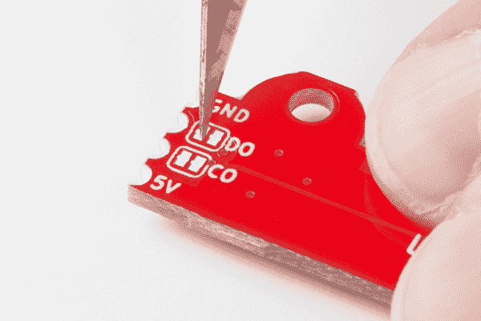](https://cdn.sparkfun.com/assets/learn_tutorials/6/9/6/Lumenati_Hookup_Guide-09.jpg)*Make sure you cut the traces on CO and DO before powering up a continuous-loop design.*

Lumenati 板上使用的 APA102C 可寻址 led 采用+5V 电源输入，时钟和数据逻辑电平为 0-5V。数据接口基本上是一个类似于 [SPI 的](https://learn.sparkfun.com/tutorials/serial-peripheral-interface-spi)，只是没有从 led 返回的数据(没有 MISO 线)。+5V 和接地的走线宽度已最大化，以提高长 led 链的电流吞吐量。

此外，每个板上的 led 都标有数字，指示它们在序列中的位置，以帮助您更轻松地设计代码。

[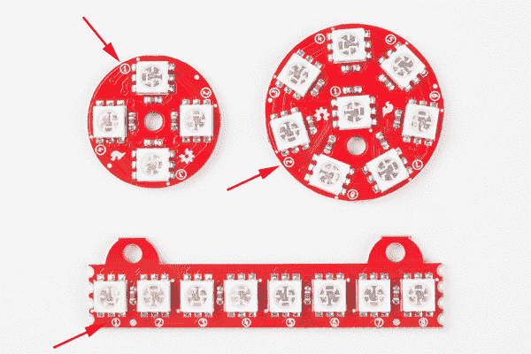](https://cdn.sparkfun.com/assets/learn_tutorials/6/9/6/numbersHighlighted.jpg)*Check those numbers!!*

如前所述，每个 APA102C 在完全开启时能够消耗接近 60mA 的电流。设计长 LED 链时，应注意这一点。弄清楚你最糟糕的电流消耗是多少，并做好相应的计划！

## 多板组件

本节将介绍将多个 Lumenati 板连接在一起的必要步骤。

### 规划布局

在我们的演示中，我们将使用四个 Lumenati 90L 板和一个 Lumenati 8-pack，组成一个由 20 个 led 组成的链。然后，我们将在第一个示例中用 Raspberry Pi 3 驱动它们，在第二个示例中用 SAMD21 突破驱动它们。

首先，收集你想用的木板。

[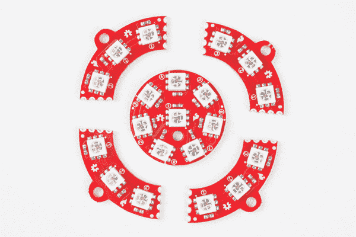](https://cdn.sparkfun.com/assets/learn_tutorials/6/9/6/Lumenati_Hookup_Guide-11.jpg)

您可能希望打磨或锉掉 PCB 镶板留下的一些边缘，以帮助装修，但我们会让您自行判断。

### 焊接！

四个 90L 板将形成一个连续的 led 环。很难从最后一个 90L 电路板上获取时钟和数据信号(不是不可能，而是很难)，因此我们将 8 封装放在电路链的开头。首先，我们将焊接四个 90L 的。要做到这一点，你需要一个平坦的表面，最好是一个不会燃烧太多的表面。一块纸板真的很适合这个！用一些焊料在其中一块板上的一个角连接(电源或接地)上镀锡，如下所示:

[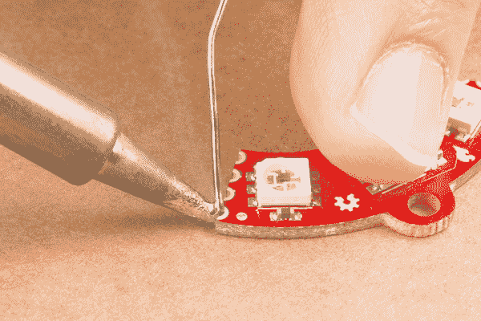](https://cdn.sparkfun.com/assets/learn_tutorials/6/9/6/Lumenati_Hookup_Guide-12.jpg)

然后，将刚刚镀锡的电路板与序列中的下一个电路板对接，并重新加热刚刚放置的焊料，使其桥接两个电路板，并形成足够的机械连接来将它们固定在一起。注意确保两块电路板尽可能平坦，以最大限度地实现电气和机械连接。

[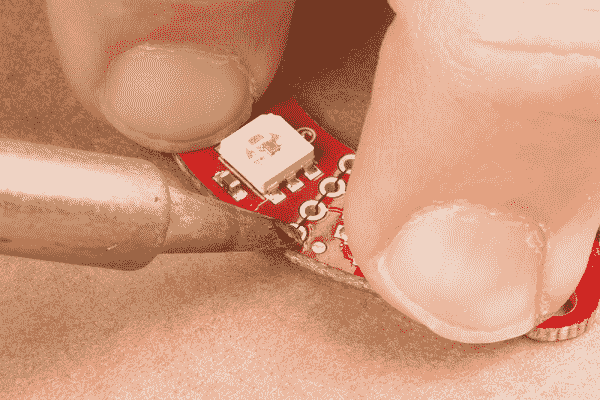](https://cdn.sparkfun.com/assets/learn_tutorials/6/9/6/Lumenati_Hookup_Guide-14.jpg)

在你固定第一个连接后，在顶部和底部焊接其他三个。这将使电路板尽可能坚固。然而，要知道，如果压力太大，这些仍然会破裂。建议将木板安装在坚固的背衬上，但如果你在制作圣诞装饰品之类的东西，它们应该仍然能够很好地结合在一起。在我们的演示中，我们将保留所有未安装的板。

[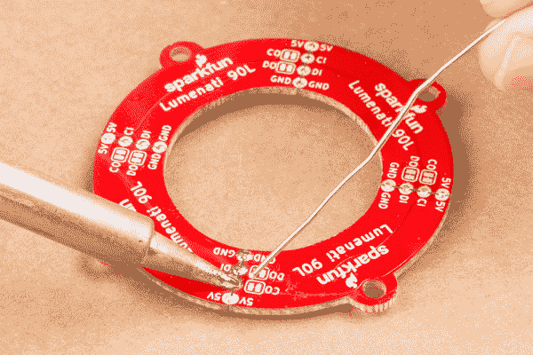](https://cdn.sparkfun.com/assets/learn_tutorials/6/9/6/Lumenati_Hookup_Guide-15.jpg)

接下来，在 8 封装和四个 90L 电路板之间焊接引线。剪下四段约 1 英寸长的金属丝。我们建议对你的电源线(红色)、地线(黑色)、时钟和数据线(你的电话)进行颜色编码。将每根电线的两端剥去约 1/16 英寸至 1/8 英寸，并上锡。

[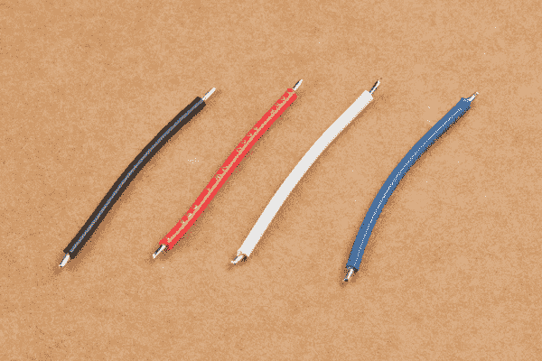](https://cdn.sparkfun.com/assets/learn_tutorials/6/9/6/Lumenati_Hookup_Guide-16.jpg)

给 8 封装的所有焊盘上锡，并将您的四条引线焊接到 5V(两个 5V 焊盘之一)、地(接地焊盘之一)、CO 和 DO(时钟输出和数据输出)。如果你愿意，你可以把它们放在一边，但是我们要把它们直着放，以便更容易定位 PCB。

[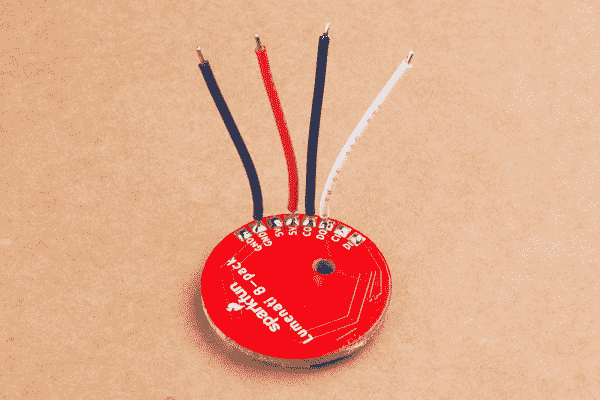](https://cdn.sparkfun.com/assets/learn_tutorials/6/9/6/Lumenati_Hookup_Guide-17.jpg)

将 8 块板放在已经做好的 90 块板的中间。确定您希望电路板的方向，并在四个 90L 电路板之间选择一个接口，将四条引线焊接到该接口上。

**Don't forget:** Before you solder the leads, cut the jumpers marked "CO" and "DO" that are physically closest to your selected solder points. That will ensure that your logic at the end of the circle doesn't interfere with the logic at the start.

完成后，在圆圈上焊接引脚- 5V 至 5V，GND 至 GND，CO 在 8-pack 上至 CI，DO 在 8-pack 上至 DI。

[](https://cdn.sparkfun.com/assets/learn_tutorials/6/9/6/Lumenati_Hookup_Guide-18.jpg)*Do yourself a favor and cut these now. You can burn a couple of LEDs if you forget.*

连接到 90L 回路的另一种方法是焊接四个板接口中的三个，留下第四个作为开孔，您可以将 5V、GND、CO 和 DO 线插入其中。在这样做之前，你必须确定你的定位。

现在，你需要给你建造的东西提供能量和信号。为此，只需在 8 封装板上的其余 5V 和 GND 焊盘以及 8 封装板上的 CI 和 DI 上再焊接四条引线。为一些额外的极客信誉编织电线。现在，它可以连接到你的控制系统了！

[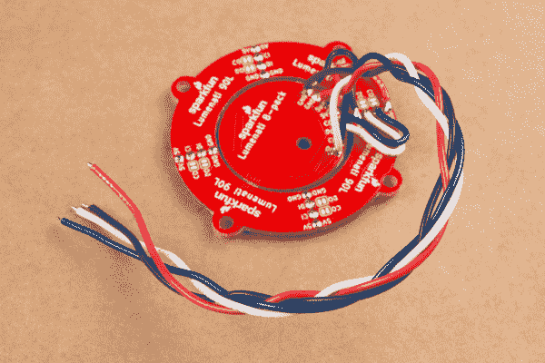](https://cdn.sparkfun.com/assets/learn_tutorials/6/9/6/Lumenati_Hookup_Guide-19.jpg)*Ready for action!*

## 使用 Raspberry Pi 3 的示例

对于本例，我们将使用一个 [Raspberry Pi 3](https://www.sparkfun.com/products/13825) 、一个 PCA9306 电平转换器分线点、一个 5V 电源和我们在上一节中组装的 Lumenati 板。连接将如下所示:

[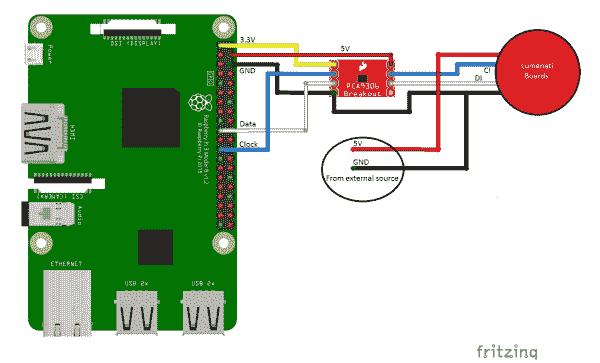](https://cdn.sparkfun.com/assets/learn_tutorials/6/9/6/Lumenati_Pi_bb_2.png)*Click the image for a closer look.*

从图中您会注意到，Lumenati 板直接由外部 5V 电源供电，而不是由 Raspberry Pi 上的接头供电。虽然可以用 Pi 头提供的演示代码来驱动电路，但那里提供的 5V 是带保险丝的。由于很难预测 Pi 本身在任何给定时刻将汲取多少电流，因此随着 LED 数量的增加和亮度的增加，驱动 LED 通过 Pi 也会变得有问题，从而有可能随着电流消耗的增加而出现掉电情况。在电源到达 Pi 之前，通过在电源上分接 5V 和地来完全避开这种情况。

下表列出了感兴趣的连接。

| 刮针# | 描述 | 转到 PCA9306 引脚 |
| one | 3.3V(用于低端电平转换基准) | VREF1 |
| four | 5V(高端电平转换参考) | VREF2 |
| six | GND(电平转换参考地) | GND |
| Nineteen | 数据 | SCL1 |
| Twenty-three | 时钟 | SDA1 |

敏锐的读者会注意到，如果标签可信，我们在 PCA9306 上将一个时钟信号连接到一个看似数据的通道，并将一个数据信号连接到一个看似时钟的通道。但是这里有一个关于这些通道的小秘密:从电学角度讲，它们实际上是相同的。虽然标签可能不一致，但它使布线稍微更加统一。

PCA9306 分线点与 Lumenati 板的连接如下:

| PCA9306 引脚 | 描述 | Lumenati Pin |
| SDA2 | 时钟 | 海峡群岛 |
| SCL2 | 数据 | 国防情报部 |
| GND | GND(电平转换参考地) | GND |

我们整理了一些非常简单的 python 代码，供您开始使用。第一个是一个非常简单的库，用 LED 参数建立一个数组，并将它们写入 Lumenati 板。

```
language:python
#Set up the SPI port on the Pi
import spidev
spi = spidev.SpiDev()
spi.open(0,0)

#Create LED array by sending this function num_LEDs
def set_LED_quantity(num_LEDs):
    global NUM_LEDs
    NUM_LEDs = num_LEDs
    global LED_array
    LED_array = [[0,0,0,0]] * NUM_LEDs

#Puts LED(num) parameters into LED_array
#Red, Green and Blue (r,g,b) values must be between
#0-255\. Brightness must be between 0 and 31.
def set_LED(num, r, g, b, brightness):
    if (brightness > 31) | (brightness < 0):
        brightness = 15
    if (r > 255) | (r < 0):
        r = 100
    if (g > 255) | (g < 0):
        g = 100
    if (b > 255) | (b < 0):
        b = 100

    LED_array[num] = [r, g, b, brightness | 0xE0]

#These 4 bytes have to be written at the start and
#end of each data frame when writing to the LEDs
def _start_end_frame():
    for x in range (4):
            spi.xfer2([0x00])

#Write data to the LEDs
def WriteLEDs():
    _start_end_frame()
    for LED in LED_array:
        r, g, b, brightness = LED
        spi.xfer2([brightness])
        spi.xfer2([b])
        spi.xfer2([g])
        spi.xfer2([r])

    _start_end_frame() 
```

第二个演示了这些函数的用法，并制作了一些漂亮的灯光。

```
language:python
#This is demonstration code for the Lumenati line of APA102c boards,
#specifically using (4) 90L boards surrounding one 8-pack board.

import time

from SFE_Lumenati import set_LED_quantity, WriteLEDs, set_LED

#Set up array, 20 LEDs
set_LED_quantity(20)

#Delay duration
wait = 0.15

#Global brightness
brightness = 15 #range is 0-31

try:
    while True:

        for y in range (5):

            #center, white
            set_LED(0,25,25,25,brightness)

            #inner ring, red
            for x in range (7):
                set_LED(x+1,25,0,0,brightness)

            #outer ring, white
            for x in range (12):
                set_LED(x+8,25,25,25,brightness)

            #Write to the LEDs and wait
            WriteLEDs()
            time.sleep(wait)

            #center, red
            set_LED(0,25,0,0,brightness)

            #inner ring, white
            for x in range (7):
                set_LED(x+1,25,25,25,brightness)

            #outer ring, red
            for x in range (12):
                set_LED(x+8,25,0,0,brightness)

            #Write to the LEDs and wait                               
            WriteLEDs()
            time.sleep(wait)

        for y in range (5):

            #center, yellow
            set_LED(0,25,25,0,brightness)

            #inner ring, blue
            for x in range (7):
                set_LED(x+1,0,0,25,brightness)

            #outer ring, yellow
            for x in range (12):
                set_LED(x+8,25,25,0,brightness)

            #Write to the LEDs and wait
            WriteLEDs()
            time.sleep(wait)

            #center, blue
            set_LED(0,0,0,25,brightness)

            #inner ring, yellow
            for x in range (7):
                set_LED(x+1,25,25,0,brightness)

            #outer ring, blue
            for x in range (12):
                set_LED(x+8,0,0,25,brightness)

            #Write to the LEDs and wait                           
            WriteLEDs()
            time.sleep(wait)

except KeyboardInterrupt:
    pass 
```

点击[这里](https://github.com/sparkfun/SparkFun_Lumenati_Code)获取代码。只需将 spark fun _ lumen ATI _ Code/Firmware/RasPi 中的两个文件放入同一个文件夹，然后运行 Lumenati_Demo.py，如果星星对齐(并且你做的一切都是正确的)，结果应该如下所示。

[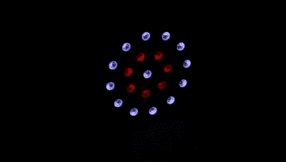](https://cdn.sparkfun.com/assets/learn_tutorials/6/9/6/Pi_demo.gif)*The brightness is turned down to show the colors better.***More Examples:** Looking for more examples with the Raspberry Pi? Try looking at the [Python Library](https://github.com/pimoroni/blinkt) used with the [Pimoroni Blinkt!](https://www.sparkfun.com/products/14038).

[Pimoroni: APA102 Python Tutorials](https://learn.pimoroni.com/blinkt)

## 使用 SAMD21 小型分线点的示例

我们的第二个示例使用了一个基于 Arduino 的 [SparkFun SAMD21 分线板](https://www.sparkfun.com/products/13664)、一个 PCA9306 电平转换器分线板、一个 5V 电源和我们在组装部分放在一起的 Lumenati 板。连接将如下所示:

[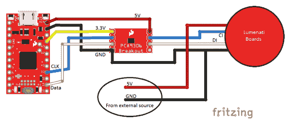](https://cdn.sparkfun.com/assets/learn_tutorials/6/9/6/Lumenati_SAMD21_bb_2.png)*Click the image for a closer look.*

该电路几乎与 Raspberry Pi 示例相同，只是 Pi 所在的位置有一个 SAMD21 分线点。SAMD21 的具体连接如下:

| SAMD21 Pin 标签 | 描述 | 转到 PCA9306 引脚 |
| 车辆识别号码 | 3.3V(用于低端电平转换基准) | VREF1 |
| VCC | 5V(高端电平转换参考) | VREF2 |
| GND | GND(电平转换参考地) | GND |
| Eleven | 数据 | SCL1 |
| Thirteen | 时钟 | SDA1 |

同样，PCA9306 上与 SCL 和 SDA 相关的通道在电气上并不重要；任一通道都可以执行时钟或数据功能。这种交换只是使我们的布线稍微干净。该电路中的其它一切都与 RasPi 示例相同。

对于代码，这次我们将使用 [FastLED](http://fastled.io/) 库。如果您还没有这样做，现在是安装该库的好时机。之前没有在 Arduino 安装过库？点击[此处](https://learn.sparkfun.com/tutorials/installing-an-arduino-library)了解更多信息。

我们的示例代码如下:

```
language:c
#include "FastLED.h"

//Number of LEDs
#define NUM_LEDS 20

//Define our clock and data lines
#define DATA_PIN 11
#define CLOCK_PIN 13

//Create the LED array
CRGB leds[NUM_LEDS];

void setup() { 

      //Tell FastLED what we're using. Note "BGR" where you might normally find "RGB".
      //This is just to rearrange the order to make all the colors work right.
      FastLED.addLeds<APA102, DATA_PIN, CLOCK_PIN, BGR>(leds, NUM_LEDS);

      //Set global brightness
      FastLED.setBrightness(50);
}

void loop() { 

  uint8_t x;
  uint16_t wait = 100;

  //Check out all these wacky colors! Have a look at teh FastLED documentation for more.
  //Turn on each LED in succession
  leds[0] = CRGB::Blue;
  FastLED.show();
  delay(wait);

  leds[1] = CRGB::Green;
  FastLED.show();
  delay(wait);

  leds[2] = CRGB::Purple;
  FastLED.show();
  delay(wait);

  leds[3] = CRGB::AliceBlue;
  FastLED.show();
  delay(wait);

  leds[4] = CRGB::DarkGoldenrod;
  FastLED.show();
  delay(wait);

  leds[5] = CRGB::DarkGreen;
  FastLED.show();
  delay(wait);

  leds[6] = CRGB::DeepSkyBlue;
  FastLED.show();
  delay(wait);

  leds[7] = CRGB::GreenYellow;
  FastLED.show();
  delay(wait);

  leds[8] = CRGB::LawnGreen;
  FastLED.show();
  delay(wait);

  leds[9] = CRGB::Maroon;
  FastLED.show();
  delay(wait);

  leds[10] = CRGB::FairyLight;
  FastLED.show();
  delay(wait);

  leds[11] = CRGB::Tomato;
  FastLED.show();
  delay(wait);

  leds[12] = CRGB::Turquoise;
  FastLED.show();
  delay(wait);

  leds[13] = CRGB::SpringGreen;
  FastLED.show();
  delay(wait);

  leds[14] = CRGB::Salmon;
  FastLED.show();
  delay(wait);

  leds[15] = CRGB::Sienna;
  FastLED.show();
  delay(wait);

  leds[16] = CRGB::SeaGreen;
  FastLED.show();
  delay(wait);

  leds[17] = CRGB::Teal;
  FastLED.show();
  delay(wait);

  leds[18] = CRGB::OrangeRed;
  FastLED.show();
  delay(wait);

  leds[19] = CRGB::RosyBrown;
  FastLED.show();
  delay(wait);

  //Shut them off
  for (x = 0; x < NUM_LEDS; x++)
  {
    leds[x] = CRGB::Black;
  }

  FastLED.show();
  delay(wait);

} 
```

这个例子看起来与 RasPi 例子完全不同，部分原因是我们想展示库中一些疯狂的名字提供的一些颜色。FastLED 库提供了很多功能，可能远远超出了您的需求。查看他们的文档以获得完整的函数列表。

如果您已经完成了 RasPi 示例，那么您也已经拥有了 Arduino 代码。可以在文件夹 spark fun _ lumen ATI _ Code \ Firmware \ samd 21 中找到。如果你还没有得到它，点击[这里](https://github.com/sparkfun/SparkFun_Lumenati_Code)得到它。将 Lumenati_demo.ino 加载到您的 SAMD21 上，然后观看节目！

如果你做的一切都是正确的，你的 led 应该这样做:

[](https://cdn.sparkfun.com/assets/learn_tutorials/6/9/6/SAMD21_demo.gif)*The brightness is turned down to show the colors better.*

## 资源和更进一步

以下是 Lumenati 主板更多资源的链接。

**SparkFun Lumenati 4 件装(圆盘)**

*   [4 件装(圆盘)示意图(PDF)](https://cdn.sparkfun.com/assets/3/b/0/8/3/Lumenati_4-pack.pdf)
*   [4 包(圆盘)KiCad 文件(ZIP)](https://cdn.sparkfun.com/assets/1/f/b/a/4/Lumenati_4-pack_KiCad.zip)
*   [4 件装(圆盘)GitHub Repo](https://github.com/sparkfun/Lumenati_4-pack)

**SparkFun Lumenati 8 片装(圆盘)**

*   [8 包(圆盘)示意图(PDF)](https://cdn.sparkfun.com/assets/0/2/c/2/2/Lumenati_8-pack.pdf)
*   [8 包(圆形光盘)KiCad 文件(ZIP)](https://cdn.sparkfun.com/assets/b/e/1/8/4/Lumenati_8-pack_KiCad.zip)
*   [8 件装(圆盘)GitHub Repo](https://github.com/sparkfun/Lumenati_8-pack)

**SparkFun Lumenati 8-stick**

*   [8 杆示意图(PDF)](https://cdn.sparkfun.com/assets/d/e/9/0/e/Lumenati_8-stick.pdf)
*   [8-stick KiCad 文件(ZIP)](https://cdn.sparkfun.com/assets/e/9/1/5/b/Lumenati_8-stick_KiCad.zip)
*   [8 支 GitHub 回购](https://github.com/sparkfun/Lumenati_8-Stick)

**SparkFun Lumenati 90R**

*   [90R 示意图(PDF)](https://cdn.sparkfun.com/assets/1/a/a/9/9/Lumenati_90R.pdf)
*   [90R KiCad 文件(ZIP)](https://cdn.sparkfun.com/assets/3/c/8/4/4/Lumenati_90R_KiCad.zip)
*   [90R GitHub 回购](https://github.com/sparkfun/Lumenati_90R)

**SparkFun Lumenati 90L**

*   [90L 示意图(PDF)](https://cdn.sparkfun.com/assets/4/b/a/b/e/Lumenati_90L.pdf)
*   [90L KiCad 文件(ZIP)](https://cdn.sparkfun.com/assets/2/7/7/7/1/Lumenati_90L_KiCad.zip)
*   [90L GitHub 回购](https://github.com/sparkfun/Lumenati_90L)

**SparkFun Lumenati 3x3**

*   [3x3 示意图(PDF)](https://cdn.sparkfun.com/assets/1/9/8/a/2/Lumenati_3x3.pdf)
*   [3x3 KiCad 文件(ZIP)](https://cdn.sparkfun.com/assets/1/c/2/c/5/Lumenati_3x3_KiCad.zip)
*   [3x3 GitHub 回购](https://github.com/sparkfun/Lumenati_3x3)

* * *

*   [APA102C 单个发光二极管(每包 10 个)](https://www.sparkfun.com/products/14863)
*   [APA102C 数据表](https://cdn.sparkfun.com/datasheets/Components/LED/APA102C.pdf)
*   [SparkFun 产品展示:Lumenati](https://www.youtube.com/watch?v=vB8AXfSww84)
*   [SparkFun 项目展示:Lumenati 头骨](https://www.youtube.com/watch?v=qp6VJMCoWXQ)
*   [如何焊接齿形安装孔](https://learn.sparkfun.com/tutorials/how-to-solder---castellated-mounting-holes)
*   [PCA9306 电平转换器连接指南](https://learn.sparkfun.com/tutorials/pca9306-level-translator-hookup-guide)
*   [SAMD21 连接指南](https://learn.sparkfun.com/tutorials/samd21-minidev-breakout-hookup-guide)
*   [SparkFun Lumenati 示例代码 GitHub 库](https://github.com/sparkfun/SparkFun_Lumenati_Code)
*   [FastLED Arduino 库 GitHub Repo](https://github.com/FastLED/FastLED)

你的下一个 LED 项目需要一些灵感吗？查看这些其他伟大的 SparkFun 教程。

[](https://learn.sparkfun.com/tutorials/das-blinken-top-hat) [### 闪烁的顶部](https://learn.sparkfun.com/tutorials/das-blinken-top-hat) A top hat decked out with LED strips makes for a heck of a wedding gift.[Favorited Favorite](# "Add to favorites") 1[](https://learn.sparkfun.com/tutorials/interactive-led-music-visualizer) [### 交互式 LED 音乐可视化器](https://learn.sparkfun.com/tutorials/interactive-led-music-visualizer) Use an Arduino and the SparkFun Sound Detector to create visualizations on Addressable RGB LED strips.[Favorited Favorite](# "Add to favorites") 27[](https://learn.sparkfun.com/tutorials/led-cloud-connected-cloud) [### LED 云-连接云](https://learn.sparkfun.com/tutorials/led-cloud-connected-cloud) Make an RGB colored cloud light! You can also control it from your phone, or hook up to the weather 31[](https://learn.sparkfun.com/tutorials/led-crystal-goddess-crown) [### LED 水晶女神皇冠](https://learn.sparkfun.com/tutorials/led-crystal-goddess-crown) Follow this tutorial to make your own Crystal Goddess Crown with LEDs 6[](https://learn.sparkfun.com/tutorials/lumini-ring-hookup-guide) [### LuMini 环连接指南](https://learn.sparkfun.com/tutorials/lumini-ring-hookup-guide) The LuMini Rings (APA102-2020) are the highest resolution LED rings available.[Favorited Favorite](# "Add to favorites") 6[](https://learn.sparkfun.com/tutorials/lumini-8x8-matrix-hookup-guide) [### LuMini 8x8 矩阵连接指南](https://learn.sparkfun.com/tutorials/lumini-8x8-matrix-hookup-guide) The LuMini 8x8 Matrix (APA102-2020) are the highest resolution LED matrix available.[Favorited Favorite](# "Add to favorites") 6[](https://learn.sparkfun.com/tutorials/lumidrive-hookup-guide) [### LumiDrive 连接指南](https://learn.sparkfun.com/tutorials/lumidrive-hookup-guide) The LumiDrive LED Driver is SparkFun’s foray into all things Python on micro-controllers. With the SparkFun LumiDrive you will be able to control and personalize a whole strand of APA102s directly from the board itself.[Favorited Favorite](# "Add to favorites") 5

或者看看下面的一些博客帖子来寻找灵感:

[](https://www.sparkfun.com/news/2497 "October 10, 2017: If the spooky messages you’re getting from beyond the grave seem vague and disjointed to you, maybe some blinky lights can help to accent the important parts. #funkydemonspeak") [### 用一个发光的会说话的头骨刺穿万圣节的面纱

October 10, 2017](https://www.sparkfun.com/news/2497 "October 10, 2017: If the spooky messages you’re getting from beyond the grave seem vague and disjointed to you, maybe some blinky lights can help to accent the important parts. #funkydemonspeak")[Favorited Favorite](# "Add to favorites") 1[](https://www.sparkfun.com/news/2646 "March 26, 2018: Waking up is the worst. Let's try and make it a little easier on ourselves.") [### DIY 日出闹钟

March 26, 2018](https://www.sparkfun.com/news/2646 "March 26, 2018: Waking up is the worst. Let's try and make it a little easier on ourselves.")[Favorited Favorite](# "Add to favorites") 4[](https://www.sparkfun.com/news/2693 "May 23, 2018: Let's figure out just how fast we can push data through APA102 pixels. Then let's look at what we can do with super fast lights.") [### Wedginursday:帧速率和时髦的颜色

May 23, 2018](https://www.sparkfun.com/news/2693 "May 23, 2018: Let's figure out just how fast we can push data through APA102 pixels. Then let's look at what we can do with super fast lights.")[Favorited Favorite](# "Add to favorites") 3[](https://www.sparkfun.com/news/2711 "June 18, 2018: You'd normally run them in series. But can you run them in parallel?") [### APA102C 的扇出能力

June 18, 2018](https://www.sparkfun.com/news/2711 "June 18, 2018: You'd normally run them in series. But can you run them in parallel?")[Favorited Favorite](# "Add to favorites") 1[](https://www.sparkfun.com/news/2723 "July 2, 2018: We tend to over-simplify the act of dropping an LED into a circuit. But do you know what all of those specs in the data sheet mean?") [### ATP:led 电路设计

July 2, 2018](https://www.sparkfun.com/news/2723 "July 2, 2018: We tend to over-simplify the act of dropping an LED into a circuit. But do you know what all of those specs in the data sheet mean?")[Favorited Favorite](# "Add to favorites") 0[](https://www.sparkfun.com/news/2762 "September 6, 2018: Details of a silly problem with a silly solution: How to not overwrite your outgoing SPI data buffer when using the Arduino core libraries") [### 节省你的缓冲

September 6, 2018](https://www.sparkfun.com/news/2762 "September 6, 2018: Details of a silly problem with a silly solution: How to not overwrite your outgoing SPI data buffer when using the Arduino core libraries")[Favorited Favorite](# "Add to favorites") 4[](https://www.sparkfun.com/news/2841 "December 19, 2018: Are you crystal, gem or mineral collector? Display them in style with an underlit display.") [### 背光液晶显示器

December 19, 2018](https://www.sparkfun.com/news/2841 "December 19, 2018: Are you crystal, gem or mineral collector? Display them in style with an underlit display.")[Favorited Favorite](# "Add to favorites") 6[](https://www.sparkfun.com/news/2857 "January 22, 2019: If you're looking to try coding in Python, especially as it translates to the world of physical computing, the SparkFun LumiDrive is a great way to get started. ") [### Python 和 SparkFun LumiDrive

January 22, 2019](https://www.sparkfun.com/news/2857 "January 22, 2019: If you're looking to try coding in Python, especially as it translates to the world of physical computing, the SparkFun LumiDrive is a great way to get started. ")[Favorited Favorite](# "Add to favorites") 1[](https://www.sparkfun.com/news/2868 "February 5, 2019: Taking what I've learned about LED color mixing and Python, along with our LumiDrive LED Driver and LuMini LED Ring, I set out to create a light ring for macro photography that surpasses all others.") [### DIY 相机镜头灯圈

February 5, 2019](https://www.sparkfun.com/news/2868 "February 5, 2019: Taking what I've learned about LED color mixing and Python, along with our LumiDrive LED Driver and LuMini LED Ring, I set out to create a light ring for macro photography that surpasses all others.")[Favorited Favorite](# "Add to favorites") 3[](https://www.sparkfun.com/news/2939 "June 6, 2019: How the night was won!") [### Enginursday: DIY 电容式触摸小夜灯

June 6, 2019](https://www.sparkfun.com/news/2939 "June 6, 2019: How the night was won!")[Favorited Favorite](# "Add to favorites") 5[](https://www.sparkfun.com/news/3101 "October 10, 2019: We collected over two hundred retired testbeds and turned them into art! Join us as we highlight this project and tell some of the stories behind these dusty old circuit boards.") [### 今日英语:十年的试验台

October 10, 2019](https://www.sparkfun.com/news/3101 "October 10, 2019: We collected over two hundred retired testbeds and turned them into art! Join us as we highlight this project and tell some of the stories behind these dusty old circuit boards.")[Favorited Favorite](# "Add to favorites") 1**********************************