# LilyPad ProtoSnap Plus 连接指南

> 原文：<https://learn.sparkfun.com/tutorials/lilypad-protosnap-plus-hookup-guide>

## 介绍

LilyPad ProtoSnap Plus 是一个可缝合的电子原型板，你可以用它来学习电路和编程，然后拆开来制作一个交互式织物或可穿戴项目。在本教程中，我们将介绍组成 ProtoSnap 板的组件，并设置免费的 Arduino 软件，您需要在它的中心重新编程 LilyPad USB Plus。一旦你做到了这一点，你就可以编写自己的程序并上传到板上，让它做任何你想做的事情。

[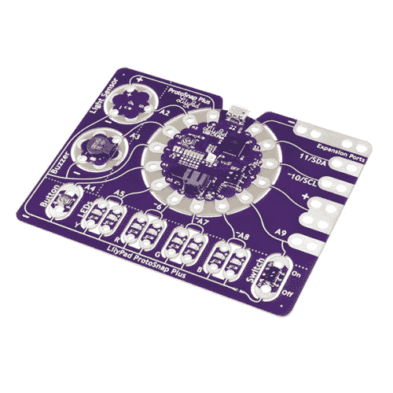](https://www.sparkfun.com/products/14346) 

将**添加到您的[购物车](https://www.sparkfun.com/cart)中！**

### [LilyPad ProtoSnap 加](https://www.sparkfun.com/products/14346)

[In stock](https://learn.sparkfun.com/static/bubbles/ "in stock") DEV-14346

LilyPad ProtoSnap Plus 是一个可缝合的电子原型板，您可以使用它来探索电路和编程，测试

$42.95[Favorited Favorite](# "Add to favorites") 10[Wish List](# "Add to wish list")** **在 ProtoSnap Plus 的中心是一个 **LilyPad USB Plus** 微控制器，预先连接到 LilyPad 部件，包括一个 LilyPad 光传感器、 [LilyPad 蜂鸣器](https://www.sparkfun.com/products/8463)、 [LilyPad 按钮板](https://www.sparkfun.com/products/8776)、四对彩色 LilyPad LEDs 和一个 [LilyPad 滑动开关](https://www.sparkfun.com/products/9350)。因为这些组件在 ProtoSnap 板上连接在一起，所以您可以在缝纫之前测试您的项目想法。ProtoSnap Plus 还包括**扩展端口**；这使您可以使用鳄鱼电缆轻松地将外部传感器和元件连接到电路板。在使用附带的 LilyPad 片段测试完您的编码想法后，您可以拆开板子，将它们缝到您的项目中。

**Warning:** There are known driver issues on older versions of Windows (7 and 8 specifically). We are actively working on the issue and expect to have a resolution soon.

### 所需材料

要对电路板重新编程和充电，你需要一根 micro-B USB 线。这是许多设备使用的常见电缆，因此您可能已经有一根了。仔细检查它是否标有“仅供电”,因为这种类型的电缆不会传输 LilyPad USB Plus 板所需的编程数据。如果您没有，可以从 SparkFun 获得一个:

[](https://www.sparkfun.com/products/10215) 

将**添加到您的[购物车](https://www.sparkfun.com/cart)中！**

### [USB micro-B 线- 6 脚](https://www.sparkfun.com/products/10215)

[In stock](https://learn.sparkfun.com/static/bubbles/ "in stock") CAB-10215

USB 2.0 型到微型 USB 5 针。这是一种新的、更小的 USB 设备连接器。微型 USB 连接器大约是…

$5.5014[Favorited Favorite](# "Add to favorites") 21[Wish List](# "Add to wish list")****[](https://www.sparkfun.com/products/13244) 

将**添加到您的[购物车](https://www.sparkfun.com/cart)中！**

### [【USB Micro-B 线缆-6】](https://www.sparkfun.com/products/13244)

[In stock](https://learn.sparkfun.com/static/bubbles/ "in stock") CAB-13244

这是一根 USB 2.0 型转 Micro-B 型 5 针黑色电缆。你知道，通常配在手机上的迷你 B 连接器，可以…

$2.103[Favorited Favorite](# "Add to favorites") 7[Wish List](# "Add to wish list")**** ****### 推荐阅读

如果您不熟悉以下概念，我们建议您在继续之前查看这些教程。

[](https://learn.sparkfun.com/tutorials/what-is-an-arduino) [### 什么是 Arduino？](https://learn.sparkfun.com/tutorials/what-is-an-arduino) What is this 'Arduino' thing anyway? This tutorials dives into what an Arduino is and along with Arduino projects and widgets.[Favorited Favorite](# "Add to favorites") 50[](https://learn.sparkfun.com/tutorials/installing-arduino-ide) [### 安装 Arduino IDE](https://learn.sparkfun.com/tutorials/installing-arduino-ide) A step-by-step guide to installing and testing the Arduino software on Windows, Mac, and Linux.[Favorited Favorite](# "Add to favorites") 16[](https://learn.sparkfun.com/tutorials/planning-a-wearable-electronics-project) [### 规划可穿戴电子项目](https://learn.sparkfun.com/tutorials/planning-a-wearable-electronics-project) Tips and tricks for brainstorming and creating a wearables project.[Favorited Favorite](# "Add to favorites") 25

## 硬件概述和功能

**Don’t snap apart your LilyPad ProtoSnap Plus** until you're ready to use the pieces in a project. If you leave the pieces attached to the board, you'll be able to prototype and test your project before you start sewing.

LilyPad ProtoSnap Plus 具有 12 个 LilyPad 组件，通过称为走线的导电路径连接到 LilyPad 微控制器。作为参考，ProtoSnap 上的每个组件旁边都有一个标签，上面标有其名称以及所连接的 LilyPad USB Plus sew 标签的编号。

[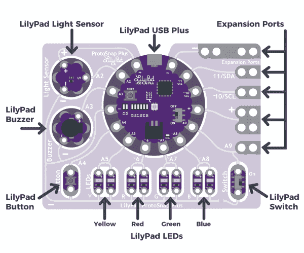](https://cdn.sparkfun.com/assets/learn_tutorials/6/8/0/ProtoSnapPlusPartLabels.png)

### LilyPad USB Plus

LilyPad USB Plus 是一款 Arduino 兼容的微控制器，类似于[lily pad Arduino USB-atmega 32 u 4 板](https://www.sparkfun.com/products/12049)，但具有一些附加功能和三个附加的 sew 标签。目前仅在 LilyPad ProtoSnap Plus 上提供。

[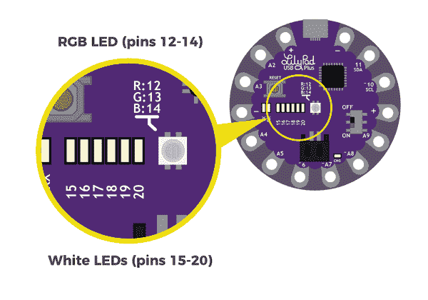](https://cdn.sparkfun.com/assets/learn_tutorials/6/8/0/LilyPadUSBPlusDetails.png)

**特性:**

*   用于连接电脑的 USB 端口。
*   两组电源(+)和接地(-)缝合片。
*   连接到引脚 12 (R)、13 (G)和 14 (B)的内置 RGB LED。
*   一排六个白色发光二极管连接到引脚 15-20。
*   单体(3.7V)锂聚合物电池的充电电路。

**Some of the sew tabs on the LilyPad USB Plus have special functionality:**

*   数字前面的“A”表示可以作为[模拟输入](https://learn.sparkfun.com/tutorials/analog-to-digital-conversion)的选项卡。这些 sew 标签可以读取输出变化电压的传感器，如 ProtoSnap Plus 内置的光传感器。
    
*   数字前的“~”符号表示 tab 支持 [PWM(脉宽调制)输出](https://learn.sparkfun.com/tutorials/pulse-width-modulation)。这些标签可以输出“模拟”信号，用于改变发光二极管的亮度等。

**Note:** The "A" in front of analog sew tab numbers in your code is optional. However, do not include the "~" symbol for PWM outputs. It is only provided to make it easy for you to check which pins can produce PWM (analog) output and is not used in programming.

下表列出了连接到 LilyPad USB Plus sew 标签的组件。

| LilyPad 组件 | 连接到 LilyPad USB Plus 缝纫标签 | 描述 |
| LilyPad 光传感器 | 主动脉第二声 | LilyPad USB Plus 接收来自光线传感器的环境光线水平输入。 |
| LilyPad 蜂鸣器(+) | A3 号 | 由 LilyPad USB Plus 控制的蜂鸣器。 |
| LilyPad 按钮 | A4 号 | LilyPad USB Plus 接收按钮按压输入。 |
| 2x LilyPad Y LEDs) | A5 号 | 由 LilyPad USB Plus 控制的一对黄色 led。 |
| 2 个 LilyPad R LEDs) | ~6 | 由 LilyPad USB Plus 控制的一对红色 led。 |
| 2x LilyPad G LEDs) | ~A7 | 由 LilyPad USB Plus 控制的一对绿色 led。 |
| 2 个 LilyPad B LEDs) | ~A8 | 由 LilyPad USB Plus 控制的一对蓝色 led。 |
| LilyPad 开关 | A9 | LilyPad USB Plus 接收开关状态(开/关)输入以更改模式。 |
| 扩展端口 A9 | A9 | 用于连接另一个 LilyPad 部件的可夹式 Pad。与 LilyPad 开关共享连接。 |
| 扩展端口(+) | (+) | 可夹垫连接到 LilyPad USB Plus 的电源(+)缝纫标签。 |
| 扩展端口～10/SCL | 约 10 英镑/SCL | 可夹垫连接到 LilyPad USB Plus 的缝纫标签 10。这可以用来连接到 I2C 时钟引脚。 |
| 扩展端口 11/SDA | 11/SDA | 可夹垫连接到 LilyPad USB Plus 的缝纫标签 11。这可以用来连接到 I2C 数据引脚。 |
| 扩展端口(-) | (-) | 可夹垫连接到 LilyPad USB Plus 的接地(-) sew 标签。 |
| 所有组件(-) | (-) | 所有组件共用一个公共接地连接回 LilyPad USB Plus。 |

### 为 LilyPad ProtoSnap Plus 供电

LilyPad ProtoSnap Plus 有两种供电方式:

*   如果你有一个可用的 USB 电源(一台电脑，5V USB 墙上适配器，USB 电池组等。)，您可以通过 USB 电缆运行该板。

*   如果你想让你的项目更便携，你可以很容易地将可充电的锂聚合物电池连接到板上。有关电池和充电的更多信息，请参见[技术说明](#battery)部分。

## 探索示例电路

**Don’t snap apart your LilyPad ProtoSnap Plus** until you're ready to use the pieces in a project. If you leave the pieces attached to the board, you'll be able to prototype and test your project before you start sewing.

LilyPad ProtoSnap Plus 附带了预加载的代码，展示了与其连接的所有 LilyPad 组件。要启动 ProtoSnap Plus，请使用 micro-B USB 电缆将其连接到您的计算机，或者连接一个[电子纺织品电池](https://www.sparkfun.com/products/13112)。然后将 LilyPad USB Plus 右侧的开关滑动到打开位置。

[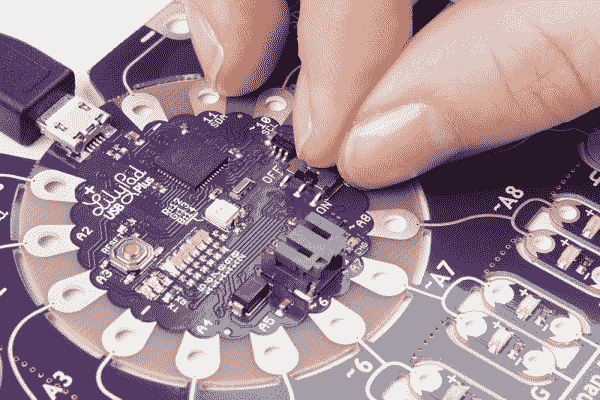](https://cdn.sparkfun.com/assets/learn_tutorials/6/8/0/TurnOnLilyPadSwitch.jpg)

该板有两种模式可供选择:当 LilyPad 滑动开关(板右下角的另一个开关)关闭时，所有 led 将依次打开。当 LilyPad 滑动开关打开时，LilyPad USB Plus 上的白色 led 将形成一个条形图，显示环境光线水平-将手放在光线传感器上，查看水平变化。如果你按下 LilyPad 按钮(在面板的左下方)，你会听到一首简短的歌曲。

[https://www.youtube.com/embed/3TOc4Fhdpes/?autohide=1&border=0&wmode=opaque&enablejsapi=1](https://www.youtube.com/embed/3TOc4Fhdpes/?autohide=1&border=0&wmode=opaque&enablejsapi=1)

请继续阅读[设置 Arduino](https://learn.sparkfun.com/tutorials/lilypad-protosnap-plus-hookup-guide#setting-up-arduino) 部分，了解如何安装 LilyPad USB Plus 支持 Arduino，以便上传您自己的定制代码。

## 使用扩展端口

LilyPad ProtoSnap Plus 具有五个扩展端口，连接到 LilyPad USB Plus 上的 sew 标签。这使您可以轻松地将外部元件连接到电路板上，包括 LilyPad 和非 LilyPad 电路板。扩展端口可以容纳鳄鱼夹、IC 夹和其他用于测试和实验的临时连接电缆。以下是几种将鳄鱼线缆连接到缝纫凸耳的方法。

[](https://cdn.sparkfun.com/assets/learn_tutorials/6/8/0/ClipCable2.jpg)*Alligator clip attached parallel to the expansion port.*[](https://cdn.sparkfun.com/assets/learn_tutorials/6/8/0/ClipCable.jpg)*Alligator clip attached perpenticular to the expansion port.*[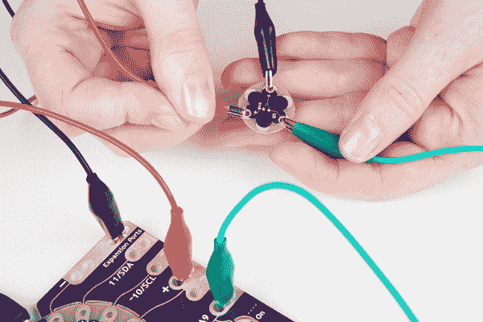](https://cdn.sparkfun.com/assets/learn_tutorials/6/8/0/ClippingSensor.jpg)*A LilyPad temperature sensor attached to the LilyPad ProtoSnap Plus expansion ports for testing.*

### 使用扩展端口 A9

您可能已经注意到，tab A9 连接到 LilyPad 滑动开关和一个扩展端口。对于这些连接中的一个，您只能使用 A9；将交换机作为输入，或者将扩展端口作为输入/输出。

如果您在扩展端口 A9 上使用外部组件或传感器，请将滑动开关移到关闭位置，以防止开关干扰您的输入或输出信号。

[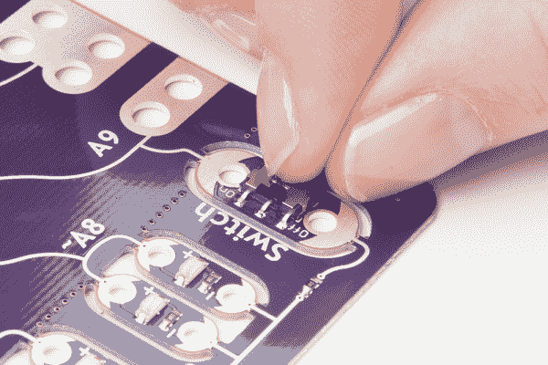](https://cdn.sparkfun.com/assets/learn_tutorials/6/8/0/TurnOffSwitch.jpg)

下图是连接到 LilyPad ProtoSnap Plus 扩展端口用于测试的 LilyPad 温度传感器。

[](https://cdn.sparkfun.com/assets/learn_tutorials/6/8/0/SensorConnected.jpg)

有关扩展端口 A9 的更多信息，请参见[技术说明](#A9)部分。

## 设置 Arduino

**Note:** The LilyPad ProtoSnap Plus and the LilyPad USB Plus requires **Arduino version 1.8 or higher**. If this is your first time using Arduino, you can install it by following our [Installing the Arduino IDE](https://learn.sparkfun.com/tutorials/installing-arduino-ide) tutorial. Otherwise, please make sure to install (or update to) the latest version of Arduino and verify that you are connected to the internet to download the LilyPad USB Plus software add-ons.**WARNING: There are known driver issues on older versions of Windows (7 and 8 specifically).** We are actively working on the issue and expect to have a resolution soon.

既然您已经探索了该板的特性，是时候上传一些代码了！当你第一次安装 Arduino 时，它知道如何对许多“标准的”Arduino 兼容板进行编程。由于 LilyPad USB Plus 是较新的 LilyPad 微控制器，您需要按照以下步骤将其手动添加到此列表中。您只需这样做一次，就可以将电路板添加到 Arduino。

**Note for Linux Users:** If you are installing the LilyPad ProtoSnap Plus in Linux, this document has some specific notes: [https://github.com/sparkfun/LilyPad_ProtoSnap_Plus/blob/master/Documentation/LinuxInstallation.md](https://github.com/sparkfun/LilyPad_ProtoSnap_Plus/blob/master/Documentation/LinuxInstallation.md).

### 1.将 SparkFun 板添加到 Arduino 的偏好设置中

启动 Arduino IDE 软件(版本 1.8 或更高版本)，从菜单中选择**文件** > **首选项**打开首选项窗口。

现在，复制以下文本，并将其粘贴到“附加电路板管理器 URL”文本框中:

```
https://raw.githubusercontent.com/sparkfun/Arduino_Boards/master/IDE_Board_Manager/package_sparkfun_index.json 
```

[](https://cdn.sparkfun.com/assets/learn_tutorials/6/8/0/PasteBoardURL2.png)**No room?** If there is already a URL in the box, click the button to the right of the box. This will open a window allowing you to paste the URL onto a new line.[](https://cdn.sparkfun.com/assets/learn_tutorials/6/8/0/PasteBoardURLWindow.png)

完成后，单击“确定”按钮。

### 2.安装 SparkFun AVR 板

接下来，您将通过 Arduino 的 Boards Manager 菜单添加 LilyPad USB Plus。选择**工具** > **电路板** > **电路板管理器，打开电路板管理器...**(董事会经理选项位于董事会列表的最顶端；您可能需要向上滚动才能看到它。)

[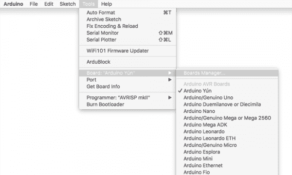](https://cdn.sparkfun.com/assets/learn_tutorials/6/8/0/SelectBoardManager2.png)

“纸板管理器”窗口打开时，会显示一长串选项。在窗口顶部的*“过滤您的搜索”*框中键入“sparkfun”(不带引号)。这将把列表缩小到 SparkFun 的选项。

您应该会看到几个条目。寻找标有 SparkFun Electronics 的 **SparkFun AVR 板。**

[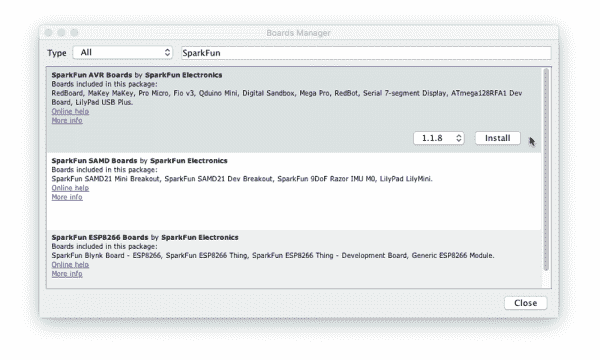](https://cdn.sparkfun.com/assets/learn_tutorials/6/8/0/SearchSparkFun1_8.png)**Troubleshooting:** If you don't see a SparkFun entry, it may mean that the URL you pasted into the Additional Boards Manager section of Arduino's preferences did not load correctly in Step #1, or you're not connected to the internet. Double check that the entire link was copied into the Additional Boards Manager URLs, and that you're connected to the internet. You might also try closing and restarting the Arduino software to refresh the preferences.

点击 **SparkFun AVR 板**框中的任意位置。将出现一个版本号和一个“安装”按钮。单击安装按钮。这将下载并安装扩展。如果您已经安装了 SparkFun AVR 板支持，请更新到最新版本(LilyPad USB Plus 和示例代码包含在 1.1.8 和更高版本中)。

[](https://cdn.sparkfun.com/assets/learn_tutorials/6/8/0/SelectInstallVersion1_8.png)

如果一切正常，SparkFun AVR 板标题旁边应该会出现一个蓝色的“已安装”说明。你已经准备好开始编程了。

[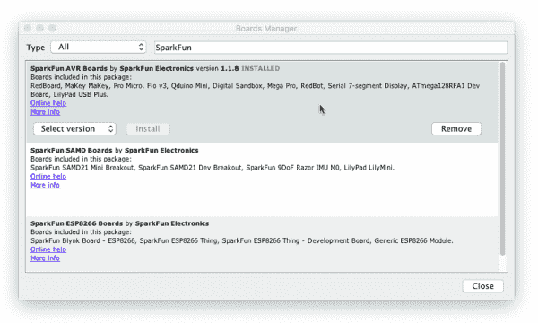](https://cdn.sparkfun.com/assets/learn_tutorials/6/8/0/ConfirmInstall1_8.png)

## 上传代码

一旦你将 LilyPad USB Plus 扩展安装到 Arduino 上，你就可以开始对开发板编程了！

注意，你*不需要*再次安装扩展，但是你*将*需要在每次你想要对电路板编程时执行以下三个步骤。这三个步骤是:

1\. Connect the LilyPad ProtoSnap Plus to your computer using a USB cable
2\. Select **"LilyPad USB Plus"** from Arduino's **"Board"** menu
3\. Select **"LilyPad USB Plus"** from Arduino's **"Port"** menu

让我们详细回顾一下这三个步骤:

### 1.将 LilyPad ProtoSnap Plus 连接到您的电脑

将 LilyPad ProtoSnap Plus 放在干净的非金属工作台面上。使用 micro-B USB 电缆将 LilyPad ProtoSnap Plus 连接到电脑的 USB 端口。电缆只能以一种方式插入，并且应该卡紧。

[](https://cdn.sparkfun.com/assets/learn_tutorials/6/8/0/PlugInProtoSnap.jpg)**Tip:** Both the micro-B USB cable and the connector on the LilyPad have a subtle "D" shape to them. Match this shape to plug it in properly.[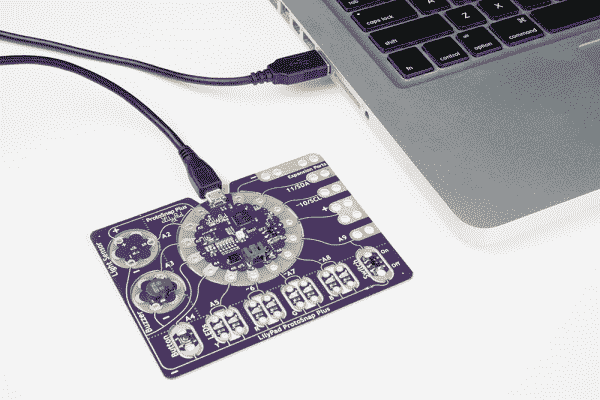](https://cdn.sparkfun.com/assets/learn_tutorials/6/8/0/ProtoSnapConnectedtoLaptop.jpg)

将 LilyPad USB Plus 上的开关滑动到打开位置。如果设置为关闭位置，您将无法将代码上传至电路板。

[](https://cdn.sparkfun.com/assets/learn_tutorials/6/8/0/TurnOnLilyPadSwitch.jpg)

### 2.从主板菜单中选择 LilyPad USB Plus

如果 Arduino 板支持安装正确，“LilyPad USB Plus”选项将在 SparkFun AVR 板组下的**工具** > **板**列表中可用。打开菜单，选择 **LilyPad USB Plus** 。根据列表中已经有多少电路板，您可能需要向下滚动一点才能找到它。选中时，菜单中的电路板旁边会显示一个点(Windows)或复选标记(Mac ),并且它会显示在工具菜单中的电路板旁边。

**IMPORTANT:** You'll see some LilyPad entries higher in the Arduino menu, but the **LilyPad USB Plus** is not one of them. You'll need to scroll down to the SparkFun section at the bottom of the list to find it. We're working on getting the LilyPad USB Plus added to the LilyPad group in the future.[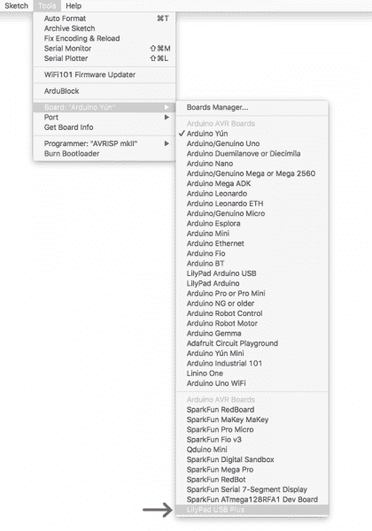](https://cdn.sparkfun.com/assets/learn_tutorials/6/8/0/SelectBoardArrow.png)**Troubleshooting:** If you don't see "LilyPad USB Plus" in the board list, go back to [Setting Up Arduino](https://learn.sparkfun.com/tutorials/lilypad-protosnap-plus-hookup-guide#setting-up-arduino) and double check that you performed all the steps. You might try restarting Arduino as well.

### 3.从端口菜单中选择 LilyPad USB Plus

Arduino 需要知道你的 LilyPad USB Plus 连接到哪个端口，这样它才能对它进行编程。每当您将 USB 设备插入电脑时，电脑都会为其分配一个端口号。这在过去很难确定，但这块板有一个方便的特性可以识别自己。进入**工具** > **端口**菜单，选择旁边有“LilyPad USB Plus”的端口。

在 Windows 上，端口被列为 COM # #在 Mac 或 Linux 机器上，它们将是“/dev/cu.usbmodem####”。您的屏幕可能与下图不同，这取决于您使用的操作系统，但所有屏幕都应该在端口地址旁边显示 LilyPad USB Plus。

[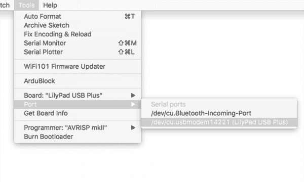](https://cdn.sparkfun.com/assets/learn_tutorials/6/8/0/SelectSerialPort.png)**Troubleshooting:** If you don't see a port with "LilyPad USB Plus" next to it, ensure that the board is powered up (switch in the ON position), and that the USB cable is securely connected to both the board and your computer. Some micro-USB cables are only meant for charging and don't pass data - they'll power the board, but it won't show up in the port menu. If needed, try a different cable.

### 上传代码

回顾一下，一旦你:

1.  已使用 USB 电缆将 LilyPad ProtoSnap Plus 连接至电脑。
2.  选择了板卡类型(**lily pad USB Plus****NOT***lily pad Arduino USB*)。
3.  已选择 COM 端口。

您可以上传代码了！让我们上传一些代码来试用一下:

从菜单**文件** > **加载“眨眼”示例** > **01。基础** > **眨眼**，点击“上传”按钮(里面有右箭头的大圆形按钮)。这是一个非常简单的示例程序；它只是每秒钟闪烁一次 LED。

[](https://cdn.sparkfun.com/assets/learn_tutorials/6/8/0/OpenBlinkExample.png)

Arduino 会编译代码，然后通过 USB 线发送到 LilyPad USB Plus。当代码上传时，内置的 LED 将闪烁，表示代码正在传输。当代码最终运行时，电路板中央的 RGB LED 将缓慢闪烁绿色。成功！

如果这一切工作，祝贺你！您已经设置完毕，可以使用 LilyPad ProtoSnap Plus 进行原型制作了。查看我们的活动指南，了解有关为 ProtoSnap Plus 编写自己的原型代码的更多信息:

[](https://learn.sparkfun.com/tutorials/lilypad-protosnap-plus-activity-guide) [### LilyPad ProtoSnap Plus 活动指南

#### 2017 年 12 月 7 日](https://learn.sparkfun.com/tutorials/lilypad-protosnap-plus-activity-guide) Learn how to program in Arduino with the LilyPad ProtoSnap Plus. This guide includes 10 example activities that use the pre-wired LilyPad boards on the LilyPad ProtoSnap Plus.[Favorited Favorite](# "Add to favorites") 6

### 故障排除:上传时出现错误消息？

如果您正在使用 Mac，并收到如下错误信息:

```
Board LilyPad USB Plus (platform avr, package SparkFun) is unknown 
```

更新后留下的旧 Arduino 版本可能会干扰 LilyPad USB Plus 支持安装。如果您想清除这些旧信息，请遵循以下步骤:

WARNING: The following instructions will delete any extensions you've previously applied to Arduino, returning it to its factory-default state. It should not delete any sketches that you've created.

1.  打开 Arduino 的“偏好设置”窗口。
2.  在窗口的底部将会有一个指向您的首选项文件的链接。点击它，它会打开一个查找窗口。
3.  在 finder 窗口中，查找“Arduino15”文件夹并将其删除。
4.  现在打开一个 finder 窗口，打开您的个人文件夹(旁边有您的登录名和房子图标的文件夹)。查找“Arduino”文件夹(可能在“文档”中)。如果“Arduino”文件夹包含“硬件”文件夹，请将其删除。您的 Arduino 安装现在是干净的。重启 Arduino 并重复上一页的 LilyPad 安装说明。

## 缝合到项目中

一旦您完成了对 ProtoSnap Plus 各部分的探索和代码原型化，您就可以沿着板上的穿孔进行捕捉，以移除单个 LilyPad 片段，并将它们构建到项目中。

[](https://cdn.sparkfun.com/assets/learn_tutorials/6/8/0/BreakApartProtoSnap.jpg)

小心地将原型的各个部分分开，为缝纫做准备。如果你很难将碎片分开，使用一套钳子或斜切器。丢弃不可缝合的碎片和废料。然后，通过缝合项目中的组件，可以用导电线重新创建 ProtoSnap 上的导电路径。

[](https://cdn.sparkfun.com/assets/learn_tutorials/6/8/0/ProtoSnapSew.jpg)

这些教程将为您提供一些关于项目建设和绝缘的提示和技巧:

[](https://learn.sparkfun.com/tutorials/insulation-techniques-for-e-textiles) [### 电子纺织品的绝缘技术](https://learn.sparkfun.com/tutorials/insulation-techniques-for-e-textiles) Learn a few different ways to protect your conductive thread and LilyPad components in your next wearables project.[Favorited Favorite](# "Add to favorites") 16[](https://learn.sparkfun.com/tutorials/lilypad-basics-e-sewing) [### LilyPad 基础:电子缝纫](https://learn.sparkfun.com/tutorials/lilypad-basics-e-sewing) Learn how to use conductive thread with LilyPad components.[Favorited Favorite](# "Add to favorites") 16

## 技术札记

如果你已经编写了一段时间的 Arduino，请继续阅读关于 LilyPad ProtoSnap Plus 的其他说明。它与其他 Arduinos 非常相似，但有一些你想知道的特殊功能和限制。

### 引脚编号

下面是 LilyPad USB Plus I/O 引脚和每个功能的列表。

**图例:**

*   *n* =数字引脚

*   ~ *n* =支持 PWM 的引脚

*   A *n* =模拟引脚

*   ( *n* ) =内部引脚(未连接到缝纫标签)

*   [ *n* ] =内部引脚(在裸露过孔上可用)

| 功能 | 数字的 | 模拟的 |
| RX_LED | (0) |  |
| RX_LED/SS | (1) |  |
| 光敏感元件 | Two | 主动脉第二声 |
| 门铃 | three | A3 号 |
| 纽扣 | four | A4 号 |
| 黄色 LED | five | A5 号 |
| 红色 LED | ~6 |  |
| 绿色 LED | ~7 | A7 |
| 蓝色 LED | ~8 | A8 |
| 交换机/扩展端口 | nine | A9 |
| 扩展端口/ SCL | ~10 |  |
| 扩展端口/ SDA | Eleven |  |
| RGB LED -红色 | (~12) |  |
| RGB LED -绿色 | (~13) |  |
| RGB LED -蓝色 | (~14) |  |
| 条形图 LED 0 | (15) |  |
| 条形图 LED 1 | (16) |  |
| 条形图 LED 2 | (17) |  |
| 条形图 LED 3 | (18) |  |
| 条形图 LED 4 | (19) |  |
| 条形图 LED 5 | (20) |  |
| SCLK | [21] |  |
| MOSI | [22] |  |
| 军事情报部门组织(Military Intelligence Service Organization) | [23] |  |

### [扩展端口 A9 备注](#A9)

如果仔细观察 ProtoSnap 板，您会注意到 sew 选项卡 A9 是在交换机和扩展端口之间共享的。因此，请记住: ***如果您使用 A9 扩展端口，请确保开关关闭*** 以防止输入或输出信号对地短路。

[](https://cdn.sparkfun.com/assets/learn_tutorials/6/8/0/TurnOffSwitch.jpg)

电源和地之间的严重短路可能会损坏电路板。但是，如果你更仔细地观察 ProtoSnap，你会发现在连接到开关的接地走线中有一个很小的 1K 表贴电阻。(在电路板的背面，您会在该位置看到一个之字形电阻符号。)如果开关打开，并且您将电压源连接到扩展端口(或从 A9 输出高电平信号)，该电阻器防止电源与地之间的硬短路。

### [使用电池并给电池充电](#battery)

SparkFun 出售一些与此板兼容的 LiPo 电池。如果你不熟悉 LilyPad 系统，我们推荐使用[电子纺织品电池](https://www.sparkfun.com/products/13112)。如果您自己提供电池，请使用带 JST 连接器的单芯(3.7V)锂电池。

容量较大的电池(以安培小时或 Ah 衡量)在需要充电之前会运行更长时间。多长时间将取决于你的程序打开多少个发光二极管，等等。如果你只是运行几个发光二极管，你可以期待每 100 毫安时的电池容量运行约 5 小时的董事会。

#### 充电率

要给连接的电池充电，请将主板插入 USB 电源。电池充电时,“CHG”LED 会亮起。当电池充满电时，LED 将关闭。默认充电电流设置为 **100mA** ，因此 100mAh 电池将在 1 小时内充电，1000mAh 电池将在 10 小时内充电，以此类推。由于主板被设置为以 100 毫安的速率充电，我们不建议连接低容量的 LiPo 电池(即 40 毫安的 LiPo 电池)进行充电。

[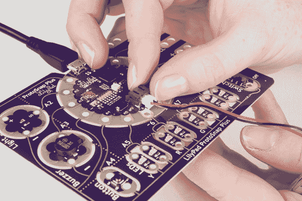](https://cdn.sparkfun.com/assets/learn_tutorials/6/8/0/InsertBattery.jpg)

即使使用 USB 电源，将 LiPo 电池永久连接到主板上也是安全的。电池不会被过度充电。

#### 关于清洗 LilyPad 项目的说明

LilyPad projects are hand-washable, but **always remove the battery before washing your project** and air-dry your project for several days before replacing the battery.

#### 拆卸脂肪电池

电池连接器可以很紧；拆卸电池时，切勿拉扯电线。用一把尖嘴钳或钳子轻轻地将插头从连接器中拔出。

**Tip:** there are two small "nubs" on the top of the plastic battery connector that can be shaved off with a hobby knife to make the battery easier to remove.Always turn the LilyPad off before inserting or removing a battery.[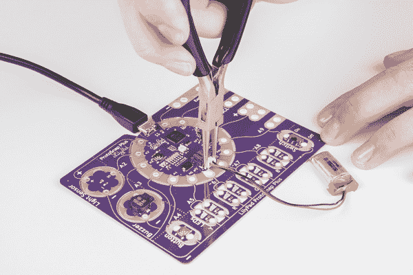](https://cdn.sparkfun.com/assets/learn_tutorials/6/8/0/PliersBattery_1.jpg)

## 资源和更进一步

既然您已经成功地启动并运行了 LilyPad ProtoSnap Plus，那么是时候将它合并到您自己的项目中了！有关为 ProtoSnap Plus 编写自己的代码的更多信息，请查看我们的活动指南:

[](https://learn.sparkfun.com/tutorials/lilypad-protosnap-plus-activity-guide) [### LilyPad ProtoSnap Plus 活动指南

#### 2017 年 12 月 7 日](https://learn.sparkfun.com/tutorials/lilypad-protosnap-plus-activity-guide) Learn how to program in Arduino with the LilyPad ProtoSnap Plus. This guide includes 10 example activities that use the pre-wired LilyPad boards on the LilyPad ProtoSnap Plus.[Favorited Favorite](# "Add to favorites") 6

有关在 ProtoSnap Plus 上使用 LilyPad 板的更多信息，请查看这些教程:

[](https://learn.sparkfun.com/tutorials/lilypad-light-sensor-hookup-guide) [### LilyPad 光线传感器连接指南](https://learn.sparkfun.com/tutorials/lilypad-light-sensor-hookup-guide) How to hook up the LilyPad Light Sensor as well as some project ideas and example code.[Favorited Favorite](# "Add to favorites") 3[](https://learn.sparkfun.com/tutorials/powering-lilypad-led-projects) [### 为 LilyPad LED 项目供电](https://learn.sparkfun.com/tutorials/powering-lilypad-led-projects) Learn how to calculate how many LEDs your LilyPad project can power and how long it will last.[Favorited Favorite](# "Add to favorites") 8[](https://learn.sparkfun.com/tutorials/lilypad-buzzer-hookup-guide) [### LilyPad 蜂鸣器连接指南](https://learn.sparkfun.com/tutorials/lilypad-buzzer-hookup-guide) How to hook up the LilyPad Buzzer and make sound with code.[Favorited Favorite](# "Add to favorites") 6

有关 LilyPad ProtoSnap Plus 的更多信息，请查看下面的参考资料:

*   [示意图(PDF)](https://cdn.sparkfun.com/assets/b/5/1/4/a/LilyPad_ProtoSnap_Plus_v10.pdf)
*   [老鹰文件(ZIP)](https://cdn.sparkfun.com/assets/1/6/c/c/5/LilyPad_ProtoSnap_Plus_v10_1.zip)
*   [LilyPad 门户生态系统](https://www.sparkfun.com/lilypad_sewable_electronics)
*   [SparkFun Arduino 插件 GitHub 库](https://github.com/sparkfun/Arduino_Boards/)
*   [LilyPad ProtoSnap 加 GitHub 库](https://github.com/sparkfun/LilyPad_ProtoSnap_Plus)******