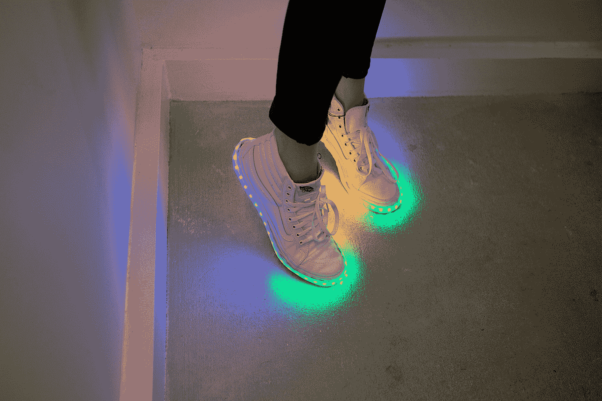

# DIY 发光鞋

> 原文：<https://learn.sparkfun.com/tutorials/diy-light-up-shoes>

## 介绍

这些 DIY 发光鞋是嵌有 [WS2812 可寻址 LED 条](https://www.sparkfun.com/products/12027)和 [Qduino 微型微控制器](https://www.sparkfun.com/products/13614)的高帮运动鞋。 [LED](https://www.sparkfun.com/leds) 易于编程和重新编程，可定制无数的颜色、图案和动画。在本教程中，我们将逐步完成构建这个项目的过程。

### 所需材料

要遵循本指南，您需要以下内容: