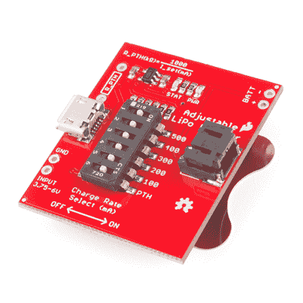
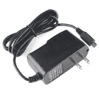
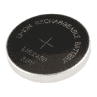
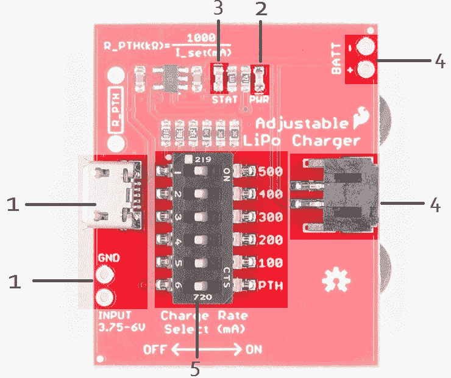
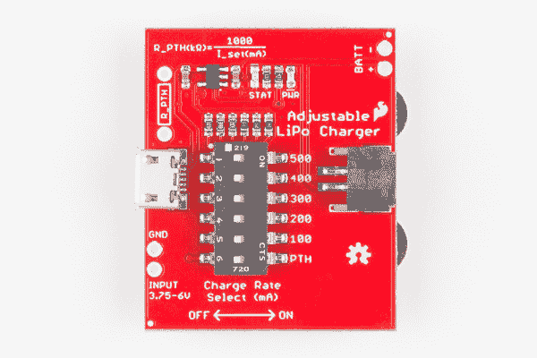
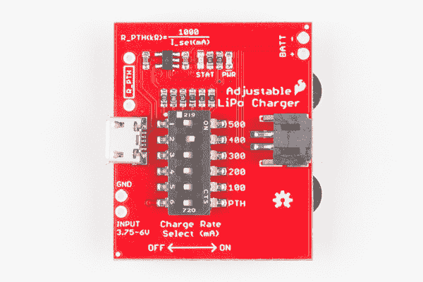
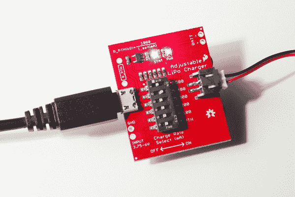
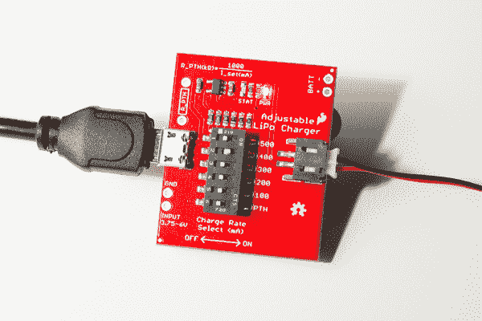

# 可调脂肪充电器连接指南

> 原文：<https://learn.sparkfun.com/tutorials/adjustable-lipo-charger-hookup-guide>

## 介绍

[SparkFun 可调 LiPo 充电器](https://www.sparkfun.com/products/14380)是一款单体锂聚合物(LiPo)和锂离子电池充电器。因为它是可调的，这个充电器将能够安全地为我们所有的单体电池充电。

 

将**添加到您的[购物车](https://www.sparkfun.com/cart)中！**

### [SparkFun 可调脂肪充电器](https://www.sparkfun.com/products/14380)

[In stock](https://learn.sparkfun.com/static/bubbles/ "in stock") PRT-14380

SparkFun 可调 LiPo 充电器是一款单电池锂聚合物(LiPo)和锂离子电池充电器。因为这是…

$13.504[Favorited Favorite](# "Add to favorites") 22[Wish List](# "Add to wish list")** **### 所需材料

所需的可调 LiPo 充电器部件取决于您的充电输入电源和所用的 [LiPo 电池](https://www.sparkfun.com/categories/54)的大小。最起码，给一个 LiPo 电池充分充电所需要的只是一根 [micro-B USB 电缆](https://www.sparkfun.com/products/10215)来连接电脑 USB 端口或[墙壁适配器](https://www.sparkfun.com/products/11456)。我们还有带 USB 电缆的 5V 壁式适配器。

 

将**添加到您的[购物车](https://www.sparkfun.com/cart)中！**

### [USB micro-B 线- 6 脚](https://www.sparkfun.com/products/10215)

[In stock](https://learn.sparkfun.com/static/bubbles/ "in stock") CAB-10215

USB 2.0 型到微型 USB 5 针。这是一种新的、更小的 USB 设备连接器。微型 USB 连接器大约是…

$5.5014[Favorited Favorite](# "Add to favorites") 21[Wish List](# "Add to wish list")**** 

将**添加到您的[购物车](https://www.sparkfun.com/cart)中！**

### [壁式适配器电源- 5.1V DC 2.5A (USB Micro-B)](https://www.sparkfun.com/products/13831)

[In stock](https://learn.sparkfun.com/static/bubbles/ "in stock") TOL-13831

这是一个高品质的开关“壁式”交流到 DC 5.1V 2500ma USB 微型 B 壁式电源，专为…

$8.9521[Favorited Favorite](# "Add to favorites") 47[Wish List](# "Add to wish list")**** 

将**添加到您的[购物车](https://www.sparkfun.com/cart)中！**

### [USB 壁式充电器- 5V，1A(黑色)](https://www.sparkfun.com/products/11456)

[In stock](https://learn.sparkfun.com/static/bubbles/ "in stock") TOL-11456

近来，USB 越来越多地被作为一种电源连接标准来实现，但是你并不总是在 han 上有一台计算机…

$4.502[Favorited Favorite](# "Add to favorites") 10[Wish List](# "Add to wish list")**** 

### [壁式适配器电源- 5V DC 2A (USB Micro-B)](https://www.sparkfun.com/products/retired/12890)

[Retired](https://learn.sparkfun.com/static/bubbles/ "Retired") TOL-12890

这是一个高品质的开关“壁式电源”AC 到 DC 5V 2000mA USB 微型 B 壁式电源，专为 S…

16 **Retired**[Favorited Favorite](# "Add to favorites") 10[Wish List](# "Add to wish list")****** ******以及一款标称电压为 3.7V 的 LiPo 电池:

 

将**添加到您的[购物车](https://www.sparkfun.com/cart)中！**

### [锂离子电池-1Ah](https://www.sparkfun.com/products/13813)

[In stock](https://learn.sparkfun.com/static/bubbles/ "in stock") PRT-13813

基于锂离子化学的超薄超轻电池。每个电池在 1000 毫安时输出 3.7V 的标称电压！

$10.958[Favorited Favorite](# "Add to favorites") 75[Wish List](# "Add to wish list")**** 

将**添加到您的[购物车](https://www.sparkfun.com/cart)中！**

### [锂离子电池- 850mAh](https://www.sparkfun.com/products/13854)

[In stock](https://learn.sparkfun.com/static/bubbles/ "in stock") PRT-13854

这是基于锂离子化学的非常薄、非常轻的电池。每个电池在 850℃时输出 3.7V 的标称电压…

$10.952[Favorited Favorite](# "Add to favorites") 17[Wish List](# "Add to wish list")**** 

将**添加到您的[购物车](https://www.sparkfun.com/cart)中！**

### [锂离子电池- 400mAh](https://www.sparkfun.com/products/13851)

[In stock](https://learn.sparkfun.com/static/bubbles/ "in stock") PRT-13851

这是一种基于锂离子化学的非常小、非常轻的电池，具有目前最高的能量密度…

$5.5010[Favorited Favorite](# "Add to favorites") 41[Wish List](# "Add to wish list")**** 

将**添加到您的[购物车](https://www.sparkfun.com/cart)中！**

### [锂离子电池- 110mAh](https://www.sparkfun.com/products/13853)

[In stock](https://learn.sparkfun.com/static/bubbles/ "in stock") PRT-13853

这是一种基于锂离子化学的非常小、非常轻的电池。这是最高的能量密度电流…

$5.503[Favorited Favorite](# "Add to favorites") 22[Wish List](# "Add to wish list")**** 

### [纽扣电池- 24.5mm(可充电 CR2450)](https://www.sparkfun.com/products/retired/10319)

[Retired](https://learn.sparkfun.com/static/bubbles/ "Retired") PRT-10319

非常酷的可充电锂离子纽扣电池。电池的额定电压为 3.6V @ 110mAh -这是运行小型…

**Retired**[Favorited Favorite](# "Add to favorites") 13[Wish List](# "Add to wish list")******** ********对于小于 100mAh(即 40mAh LiPo)的电池，您可能还需要焊接各种[电阻](https://www.sparkfun.com/products/10969)来设置自定义充电速率。

 

将**添加到您的[购物车](https://www.sparkfun.com/cart)中！**

### [【电阻器套件- 1/4W(共 500)](https://www.sparkfun.com/products/10969)

[Out of stock](https://learn.sparkfun.com/static/bubbles/ "out of stock") COM-10969

电阻是个好东西，事实上，在许多电路设计中，电阻是至关重要的。唯一的问题似乎是…

$8.95180[Favorited Favorite](# "Add to favorites") 185[Wish List](# "Add to wish list")**** 

将**添加到您的[购物车](https://www.sparkfun.com/cart)中！**

### [聚合物锂离子电池- 40mAh](https://www.sparkfun.com/products/13852)

[In stock](https://learn.sparkfun.com/static/bubbles/ "in stock") PRT-13852

这是一种基于新型聚合物锂离子化学的极小且重量轻的电池。这是最高的能量…

$4.95[Favorited Favorite](# "Add to favorites") 13[Wish List](# "Add to wish list")**** ****### 推荐阅读

如果您不熟悉以下概念，我们建议您在继续之前查看这些教程。

 [### 电池技术](https://learn.sparkfun.com/tutorials/battery-technologies) The basics behind the batteries used in portable electronic devices: LiPo, NiMH, coin cells, and alkaline.[Favorited Favorite](# "Add to favorites") 50 [### 电力](https://learn.sparkfun.com/tutorials/electric-power) An overview of electric power, the rate of energy transfer. We'll talk definition of power, watts, equations, and power ratings. 1.21 gigawatts of tutorial fun 54 [### 什么是电池？](https://learn.sparkfun.com/tutorials/what-is-a-battery) An overview of the inner workings of a battery and how it was invented.[Favorited Favorite](# "Add to favorites") 23

## 硬件概述

作为快速参考，以下是可调脂肪充电器所用部件的注释图:

| one | **充电输入**-MCP 73831 充电 IC 的输入电压在 **3.75V 到 6V** 之间。要给 LiPo 电池充满电，建议电压在 **5V** 左右。充电 IC 会将电压调低，以安全地为 LiPo 电池充电。(根据充电率，可能需要高达 500mA 的电流)。 |
| Two | **电源 LED** -当电源接通时，这个红色 LED 应该亮起。 |
| three | **状态 LED** -连接电池时，蓝色状态 LED 应亮起。电池充满电后，LED 将熄灭。 |
| four | **电池输入** -一次只能给**一块**电池充电。共有 3 个电池输入:JST 连接器、PTH 引脚、2450 硬币电池座(背面)。 |
| five | **充电率选择** -选择电池充电的最大电流量。**详细说明请参见本指南的电池充电部分。** |

### 充电状态 LED

板载蓝色 STAT LED 可用于指示电池的**充电状态**。根据充电 IC 的状态，下表列出了其他状态指示器。

| **充电状态** | **LED 状态** |
| 没有电池 | 浮动(应该关闭，但可能闪烁) |
| 关机 | 浮动(应该关闭，但可能闪烁) |
| 充电 | 在…上 |
| 充电完成 | 离开 |

## 硬件装配

在将任何东西连接到可调 LiPo 充电器之前，确保电路板配置正确是很重要的。

可调节 LiPo 充电器上的开关在装运时所有开关都处于打开位置。在配置板之前，所有开关都应移动到关闭位置。

### 设置收费率

不管电池的大小如何，记住电池的充电率是很重要的。每次电池充放电都会造成电池的磨损。随着电池开始磨损，电池的容量会慢慢减少，直到它无法保持电荷。设置充电率伴随着寿命和充电时间的权衡；电池充电越快，电池寿命越短。

可充电锂电池的最大推荐充放电速率以“C”为单位。我们目前销售的所有单节脂/锂离子电池的最大推荐充/放电速率为 1C 。其他电池化学物质允许更快的 10C 速率，甚至 40 摄氏度。1C 充电率的 1000mAh 电池将以 1000mA 的电流充电。同样的 1000 毫安的电池，以 500 毫安的电流充电，会是 0.5C。

要设置充电率，将相应的 DIP 开关从关闭位置滑动到打开位置，如下图所示:

作为在 DIP 开关上选择充电速率的一般经验法则，选择与您的电池容量最匹配的充电速率(例如，440 毫安的电池应该以最大 440 毫安**充电**)。

### 设置自定义费率

如果您想要给小于 100 毫安的电池充电，或者想要给开关上的值之间的电池充电，并且想要 1C 的充电速率，您需要设置一个自定义充电速率。MCP73831 充电速率控制器通过一个电阻设置最大充电电流。要计算所需的电阻，您可以使用[数据表](https://cdn.sparkfun.com/datasheets/Components/General%20IC/33244_SPCN.pdf)中的以下公式:

<math>R_PTH (kΩ) = 1000V / I_set (mA)</math>

例如，如果您想将充电速率设置为 40mA，则需要将一个 25kΩ的电阻[焊接](https://learn.sparkfun.com/tutorials/how-to-solder---through-hole-soldering)到 micro-B USB 连接器旁边的未填充引脚中。要使用充电率，将所有 DIP 开关移动到**关闭**位置，并将标有“PTH”的 DIP 开关移动到**打开**位置。

### 电池充电

一旦为电池配置了板，您就可以从微型 USB 电缆或标有“GND”和“输入”的 USB 连接器下方的引脚连接电源。为了给 LiPo 电池充满电，当连接到这些通孔引脚时，建议使用 5V 左右的电压。充电 IC 会将电压调低，以安全地为 LiPo 电池充电。

连接电源后，您可以将单个 LiPo 电池安装到本指南的硬件概述部分中概述的三个电池连接器之一。如果您使用的是[可充电纽扣电池](https://www.sparkfun.com/products/10319)电池，请确保电池安装方向正确，以免损坏电池。

如果使用硬币电池座，除了[可充电硬币电池](https://www.sparkfun.com/products/10319)之外，不要**不要**安装任何类型的电池。大多数其他硬币电池不可充电，也不适用于此充电器。

安装电池后，蓝色状态 led 应会亮起，如下所示:

当状态指示灯熄灭时，充电完成。

## 资源和更进一步

现在你已经成功地安装并运行了你的可调节脂肪充电器，是时候把它整合到你自己的项目中了！

有关可调节脂肪充电器的更多信息，请查看以下链接:

*   [可调脂肪充电器示意图(PDF)](https://cdn.sparkfun.com/assets/e/b/2/8/f/Sparkfun_Adjustable_LiPo_Charger_v10.pdf)
*   [可调脂肪充电器老鹰文件(ZIP)](https://cdn.sparkfun.com/assets/1/d/c/4/9/Sparkfun_Adjustable_LiPo_Charger_v10_1.zip)
*   [MCP73831 数据手册(PDF)](https://cdn.sparkfun.com/datasheets/Components/General%20IC/33244_SPCN.pdf)
*   SparkFun 可调脂肪充电器 GitHub 资源库 -本教程中使用的 SparkFun 可调脂肪充电器的源文件。

你的下一个项目需要一些灵感吗？查看这些教程:

 [### 无线连接到地下的气象站](https://learn.sparkfun.com/tutorials/weather-station-wirelessly-connected-to-wunderground) Build your own open-source, official Wunderground weather station that connects over WiFi via an Electric Imp.[Favorited Favorite](# "Add to favorites") 32 [### 光子远程温度传感器](https://learn.sparkfun.com/tutorials/photon-remote-temperature-sensor) Learn how to build your own Internet-connect, solar-powered temperature collection station using the Photon from Particle.[Favorited Favorite](# "Add to favorites") 11 [### Blynk 板洗衣机/烘干机警报](https://learn.sparkfun.com/tutorials/blynk-board-washerdryer-alarm) How to configure the Blynk Board and app to notify you when your washer or dryer is done shaking.[Favorited Favorite](# "Add to favorites") 9 [### Sparcade: Edison 作为浏览器游戏的网络服务器](https://learn.sparkfun.com/tutorials/sparcade-edison-as-a-web-server-for-browser-games) Turn the Intel® Edison into an access point that serves a simple browser-based game. High scores from the game are displayed on a character LCD.[Favorited Favorite](# "Add to favorites") 2********************