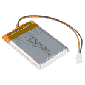
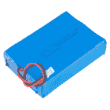
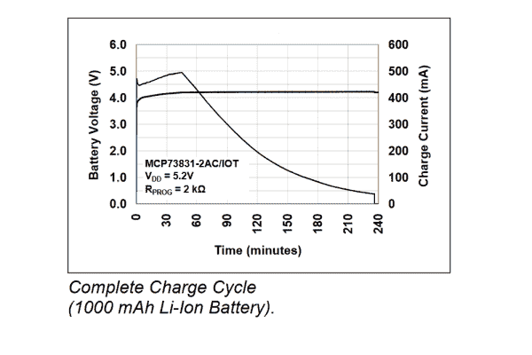

# SparkFun 5V/1A LiPo 充电器/升压器连接指南

> 原文：<https://learn.sparkfun.com/tutorials/sparkfun-5v1a-lipo-chargerbooster-hookup-guide>

## 介绍

[SparkFun 5V/1A 脂肪充电器/升压器](https://www.sparkfun.com/products/14411)是一个从脂肪中产生 5 伏电流的可靠电路。它成本低，具有实现 PAM2401 IC 的简单升压电路，并包括保护二极管，因此您可以串联多个电池以获得额外的冲击。当升压电路工作时，它比较低的输入电压消耗更多的电流，因此有可能违反电池的 C 额定值。这条赛道不在乎，我也不在乎。如果你想呵护你的脂肪，试试优秀的[电池保姆](https://www.sparkfun.com/products/13777)。但是，如果您现在需要将费用送到某个地方*，这就是适合您的产品。*

* 

将**添加到您的[购物车](https://www.sparkfun.com/cart)中！**

### [SparkFun LiPo 充电器/升压器- 5V/1A](https://www.sparkfun.com/products/14411)

[In stock](https://learn.sparkfun.com/static/bubbles/ "in stock") PRT-14411

SparkFun 5V/1A 脂肪充电器/升压器是一个从 5V 的锂聚合物电池产生一安培的可靠电路。…

$17.501[Favorited Favorite](# "Add to favorites") 32[Wish List](# "Add to wish list")** **[https://www.youtube.com/embed/A0MqzOVeMR4/?autohide=1&border=0&wmode=opaque&enablejsapi=1](https://www.youtube.com/embed/A0MqzOVeMR4/?autohide=1&border=0&wmode=opaque&enablejsapi=1)

本指南展示了如何使用 1x 充电器/升压器和 1x lipo 来制作电池组，以及如何将几个电池组连接在一起以获得更大的电流或电压。

### 所需材料

#### 一个电池

你的每个充电器/升压器都需要一块电池。虽然真的任何脂肪都可以工作，但较小的电池容易过载，并且不会提供太多电荷。建议使用 1Ah 及更大的电池，其外形最适合我们的 [1Ah 电池](https://www.sparkfun.com/products/13813)。

 

将**添加到您的[购物车](https://www.sparkfun.com/cart)中！**

### [锂离子电池-1Ah](https://www.sparkfun.com/products/13813)

[In stock](https://learn.sparkfun.com/static/bubbles/ "in stock") PRT-13813

基于锂离子化学的超薄超轻电池。每个电池在 1000 毫安时输出 3.7V 的标称电压！

$10.958[Favorited Favorite](# "Add to favorites") 75[Wish List](# "Add to wish list")**** 

将**添加到您的[购物车](https://www.sparkfun.com/cart)中！**

### [锂离子电池- 850mAh](https://www.sparkfun.com/products/13854)

[In stock](https://learn.sparkfun.com/static/bubbles/ "in stock") PRT-13854

这是基于锂离子化学的非常薄、非常轻的电池。每个电池在 850℃时输出 3.7V 的标称电压…

$10.952[Favorited Favorite](# "Add to favorites") 17[Wish List](# "Add to wish list")**** 

将**添加到您的[购物车](https://www.sparkfun.com/cart)中！**

### [锂离子电池- 2Ah](https://www.sparkfun.com/products/13855)

[In stock](https://learn.sparkfun.com/static/bubbles/ "in stock") PRT-13855

这是基于锂离子化学的非常薄、非常轻的电池。每个电池在 200 伏时输出一个标称的 3.7 伏电压…

$13.959[Favorited Favorite](# "Add to favorites") 43[Wish List](# "Add to wish list")**** 

将**添加到您的[购物车](https://www.sparkfun.com/cart)中！**

### [锂离子电池- 6Ah](https://www.sparkfun.com/products/13856)

[In stock](https://learn.sparkfun.com/static/bubbles/ "in stock") PRT-13856

如果你需要一些果汁，这 6Ah 锂离子电池是给你的。这些是基于锂离子化学电池的非常紧凑的电池…

$32.507[Favorited Favorite](# "Add to favorites") 40[Wish List](# "Add to wish list")*****************Recommended batteries for the 5V/1A charger booster.*

#### 一堆东西

任何采用 USB 供电的开发板都可以通过充电器/升压器供电。它能提供稳定的 5 伏电压，并能为耗电的电路板供电。看看[微控制器产品类别](https://www.sparkfun.com/categories/300)，任何 5V 输入的东西都可能需要移动电源。

**Tip:** Many development boards regulate 5V USB power down to 3.3V for logic supply. This 3.3V rail often has a pin that can be used, giving you 5V and 3.3V to work with.

#### 人工智能充电器

任何旧的微型 B 充电器都可以做到这一点，电路将消耗高达 500 毫安，所以不建议使用计算机的 USB 端口。您甚至可以使用电源引脚从通用台式电源充电。

以下是一些可用于连接板载 micro-B USB 连接器的信号源:

 

将**添加到您的[购物车](https://www.sparkfun.com/cart)中！**

### [【墙上适配器电源- 5VDC，2A (USB Micro-B)](https://www.sparkfun.com/products/15311)

[In stock](https://learn.sparkfun.com/static/bubbles/ "in stock") TOL-15311

这是一个高品质的开关“壁式电源”AC 到 DC 5V 2000mA USB 微型 B 壁式电源，专为 S…

$6.50[Favorited Favorite](# "Add to favorites") 2[Wish List](# "Add to wish list")**** 

将**添加到您的[购物车](https://www.sparkfun.com/cart)中！**

### [壁式适配器电源- 5.1V DC 2.5A (USB Micro-B)](https://www.sparkfun.com/products/13831)

[In stock](https://learn.sparkfun.com/static/bubbles/ "in stock") TOL-13831

这是一个高品质的开关“壁式”交流到 DC 5.1V 2500ma USB 微型 B 壁式电源，专为…

$8.9521[Favorited Favorite](# "Add to favorites") 47[Wish List](# "Add to wish list")**** ****增加一根 [micro-B 电缆](https://www.sparkfun.com/products/10215/)后，以下 USB 电源将工作:

 

将**添加到您的[购物车](https://www.sparkfun.com/cart)中！**

### [USB 壁式充电器- 5V，1A(黑色)](https://www.sparkfun.com/products/11456)

[In stock](https://learn.sparkfun.com/static/bubbles/ "in stock") TOL-11456

近来，USB 越来越多地被作为一种电源连接标准来实现，但是你并不总是在 han 上有一台计算机…

$4.502[Favorited Favorite](# "Add to favorites") 10[Wish List](# "Add to wish list")**** 

### [USB 壁式充电器- 5V，1A(白色)](https://www.sparkfun.com/products/retired/14042)

[Retired](https://learn.sparkfun.com/static/bubbles/ "Retired") TOL-14042

近来，USB 越来越多地被实现为电源连接标准。但是你并不总是在电脑上…

**Retired**[Favorited Favorite](# "Add to favorites") 4[Wish List](# "Add to wish list")** **或者，如果你在市场上寻找更大的仿制药，试试这些:

 

### [电源- 80W DC 开关模式](https://www.sparkfun.com/products/retired/9291)

[Retired](https://learn.sparkfun.com/static/bubbles/ "Retired") TOL-09291

这是一款 80W 三合一(3 个输出范围)开关 DC 电源。在 2.2A 时提供 0-36VDC 的稳定电压，最大输出功率为 80W。需要…

1 **Retired**[Favorited Favorite](# "Add to favorites") 28[Wish List](# "Add to wish list") 

### [指井开关电源-5v 直流，20A](https://www.sparkfun.com/products/retired/14098)

[Retired](https://learn.sparkfun.com/static/bubbles/ "Retired") TOL-14098

这是一款来自 Mean Well 的 100W 单输出开关电源。这种电源非常可靠，能够输出很高的电压

**Retired**[Favorited Favorite](# "Add to favorites") 19[Wish List](# "Add to wish list")

### 所需工具

你得想办法把你的货物装上！确保你手头有一些工具。

*   [剥线器](https://www.sparkfun.com/products/12630)
*   [刀具](https://www.sparkfun.com/products/11952)
*   [连接电线](https://www.sparkfun.com/products/11367)
*   [烙铁](https://www.sparkfun.com/categories/367)
*   [焊接](https://www.sparkfun.com/categories/368)
*   [万用表](https://www.sparkfun.com/categories/372)

### 推荐阅读

如果您不熟悉以下概念，我们建议您在继续之前查看这些教程。

 [### 如何焊接:通孔焊接](https://learn.sparkfun.com/tutorials/how-to-solder-through-hole-soldering) This tutorial covers everything you need to know about through-hole soldering.[Favorited Favorite](# "Add to favorites") 70 [### 电池技术](https://learn.sparkfun.com/tutorials/battery-technologies) The basics behind the batteries used in portable electronic devices: LiPo, NiMH, coin cells, and alkaline.[Favorited Favorite](# "Add to favorites") 50 [### 使用导线](https://learn.sparkfun.com/tutorials/working-with-wire) How to strip, crimp, and work with wire.[Favorited Favorite](# "Add to favorites") 50 [### 电力](https://learn.sparkfun.com/tutorials/electric-power) An overview of electric power, the rate of energy transfer. We'll talk definition of power, watts, equations, and power ratings. 1.21 gigawatts of tutorial fun 54 [### 什么是电池？](https://learn.sparkfun.com/tutorials/what-is-a-battery) An overview of the inner workings of a battery and how it was invented.[Favorited Favorite](# "Add to favorites") 23

## 硬件概述

### 董事会的组成部分

该电路通过将 MCP73831 充电控制器 IC 馈送到 LiPo 电池端口和 PAM2401 升压控制器的输入来构建。功率总是流向升压电路，因此提供一个使能引脚，以便在充电期间根据需要关断升压器。为电池、充电电源和开关提供了多种连接类型，以实现应用的灵活性。

*Charger input, battery port, enable pin, and output pins of the 5V/1A Charger/Booster.*

下图显示了表面贴装电池开关和外部开关引脚的位置，这些引脚提供了控制输出的附加选项。包括两个指示灯，用于提供系统状态的反馈。

*Switch options and status LEDs provided for the 5V/1A Charger/Booster.*

### 功能

| 项目 | 描述 |
| 输出引脚
 | 把 5V，1A T1 弄出来！“输出”引脚标有极性。
 |
| 电池端口 | 通过 JST 连接器在这里插入一个 LiPo 电池，或者直接焊接到连接器下面的 PTH 引脚。这些 ins 都标有极性。 |
| 充电器输入
 | 在这里供给 **5V，500mA** 充电。您可以使用 micro-B USB 电缆或直接焊接到 PTH 引脚。这些“输入”引脚标有极性。
 |
| 电池转换开关 | 车载开关是物理电池断开装置。当处于 ON 位置时，电池连接到升压器/充电器。当翻转到关闭位置时，电池的正极引线与所有电子设备隔离，将产生零电流。
 |
| 外部开关引脚
 | 这些与车载电池开关触点平行。可以通过这些引脚连接更高电流的开关。如果你经常需要大电流，或者想要一个远程电池切断开关，在这里连接它。
 |
| EN 引脚
 | EN 引脚默认使能。此引脚悬空高电平，可以连接到地以关闭输出。如果您的负载电路无法进入低功耗模式进行充电，这将非常有用。
 |
| 充电指示灯
 | 当充电器 IC 试图给电池充电时，充电 LED 显示蓝色。当电池充满电时，它将关闭。*注意:如果电池充电时有电流流出，充电器可能会认为电池从未充满，并继续流出电流。*
 |
| 升压 LED
 | 当输出引脚上存在电压时，该 LED 显示红色。
 |

### 充电状态 LED

板载蓝色充电 LED 可用于指示电池的充电状态。根据充电 IC 的状态，下表列出了其他状态指示器。

| **充电状态** | **LED 状态** |
| 没有电池 | 浮动(应该关闭，但可能闪烁) |
| 关机 | 浮动(应该关闭，但可能闪烁) |
| 充电 | 在…上 |
| 充电完成 | 离开 |

## 硬件装配

从长凳上开始很容易。只需将 LiPo 插入电池 JST 连接器，用 micro-B USB 电源充电，并将负载焊接到输出引脚。本节介绍一些配置端口的技巧和替代方法。

*(top) Without modification, the charger and battery can be plugged straight in. (bottom) Connections can be made to one or both of the battery/charger ports by way of soldering wires into the provided holes.*

### 覆盖的电池引脚

JST 连接器下面有一对通孔。以下是如何安全地移除 JST 并直接使用电池引线。这也降低了电路板的轮廓。

用切割器切几个小口来分开 JST 外壳。如果你试图把整个东西一次拿掉，你就有拔起垫子的危险。

*Splitting the top off the JST connector.*

随着顶部的拆除，引脚不再被捕获在外壳中，它们可以用烙铁一个接一个地拔出。

*Unsoldering the pins*

或者，您可以用热风吹掉 JST 连接器，但是它可能会在这个过程中融化。

**Caution:** When working with a live battery where voltage is always present, don't cut both leads at the same time! This will short out the battery and damage the cutters. Work with each wire individually.

切割并[剥去电线](https://learn.sparkfun.com/tutorials/working-with-wire#stranded-vs-solid)末端的一部分。然后[将](https://learn.sparkfun.com/tutorials/how-to-solder-through-hole-soldering)末端焊接到各自的通孔中。

*Connecting the first wire**Connecting the second wire*

### 电荷源引脚

与 JST 端口一样，您可能希望从 micro-B 以外的电源为 lipos 充电，例如 5v 桶或台式电源。USB 端口很难在不损坏电路板的情况下移除，因此保留它，只使用通过将一些连接线焊接到相应引脚而提供的'+'和'-'引脚。为了容易地连接到筒状千斤顶，你可以使用[母筒状千斤顶适配器](https://www.sparkfun.com/products/10288)。

**Heads up!** Never supply two power sources for charging at the same time](https://cdn.sparkfun.com/assets/learn_tutorials/6/9/5/5V_1Amp_Charger_Booster_Hookup_Guide-06.jpg)*The charger booster with a barrel jack attached.*

### 外部开关引脚

机载开关的额定电流为 600 毫安。使用可用的全电流输出，将会违反该额定值。它不会有任何直接影响，对于标称 500 毫安的峰值负载是正常的，但可能会导致发热和腐蚀，这取决于您的应用。如果发现有问题，将更高电流的开关(如 [SPST 摇臂开关](https://www.sparkfun.com/products/11138))焊接到‘EXT SW’引脚上。

*A high current capable panel switch is used to bypass the on-board switch.*

使用高电流开关，两个开关现在是并联的，因此任何一个都可以用来给电路供电。如果使用外部开关，确保将机载开关置于关闭位置。

或者，您可以将外部开关引脚跨接在一起，并使用使能引脚来切换电源。更多细节将在下一节关于使能引脚的部分解释。

### 启用引脚

另一种消除电池负载的方法是使用 PAM2401 上的使能引脚。它由电路板上的一个电阻上拉，因此保持悬空将默认为使能状态。若要禁用，可以将其连接到相邻的接地引脚。该引脚消耗的电流非常小，因此可以使用轻型开关(如[可安装滑动开关](https://www.sparkfun.com/products/14330))。

*A small switch can be used to disable the booster.*

在这种配置中，可能不需要板载开关，可以通过在外部开关孔中放置跳线来绕过板载开关。不过，电池不会真正被隔离，而且会随着时间的推移而耗尽。在禁用状态下，电池消耗的电流约为 6uA，因此需要数年时间才能放电。

或者，该引脚可以由逻辑源驱动。该引脚可承受 6V 电压，在 1/2 电池电压下具有逻辑高阈值，较低阈值为 0.2V。

## 给电池充电

当向充电器提供电压时，MCP73831 充电 IC 开始工作，并开始决定如何调节。首先，它将电流调节到 500mA，直到达到某个电压，然后调节电压，直到电流变(接近)为零。发生这种情况时，充电器 IC 会关闭。

*As shown in the MCP73831 datasheet, charge current drops as battery voltage rises*

充电器 IC 根据电池电压和输出负载做出决定，可能会被骗至无效模式。遵循以下规则获得可靠的费用:

*   连接充电器前，请打开电池开关。
*   充电期间，输出端子消耗的电流不超过 20mA。

**Using small batteries:** It's not recommended, but if you use sub amp-hour batteries you may find they don't charge correctly. By default, the board is set to charge at 500mA. 500mA is too much for them, so the protection circuits get in the way and creates a situation where the battery is dumping the input current rather than using it to charge. If you decide to go this route, swap RPROG with a 10K resistor to limit the charge circuit to 100mA. To calculate the programming resistor needed with the small batteries, you can use the following formula from the [datasheet](https://cdn.sparkfun.com/datasheets/Components/General%20IC/33244_SPCN.pdf):

**<math>R_PTH (kΩ) = 1000V / I_set (mA)</math>**

## 连接负载

渴望得到你的 5V？只需连接到输出端子！

*Closeup of the output terminals are marked with polarity.*

但是总有更多的东西需要了解。理想的升压电路将所有输入功率转换为输出功率，因此，如果输出提供 5V @ 1A 或 5W，则 5W 也必须进入*升压器*。但如果输入电压下降到电池下限 3V，就需要 1.666A！其效率约为 85%，在输入上几乎需要 2A！

下面是充电器升压器的实测性能图:

*Input current (right scale) and output voltage (left scale), shown as a function of output load. Notice that the output voltage sags slightly, but is pretty well regulated, and that input current is always larger than output current for a booster circuit.**Input and output power is shown (left scale), as well as overall efficiency (right scale).*

## 使用多个充电器升压器

5V 对于微控制器、可寻址 led 和伺服系统来说可能没问题，但对于电机来说，有时需要一些额外的激励。对于电动机，*速度与电压*成正比，*转矩与电流*成正比。因此，如果我们想要机器人加速，我们需要一个高扭矩电机(低电阻)，如果我们想走得快，我们需要提供一个大电压。本节说明如何使用多个升压器，以及这对电压电平意味着什么。

升压器的输出端有旁路二极管。这意味着，如果输出端出现负电压，它将导通，而不是向供电轨施加负电压。

这允许串联放置升压器以产生大于 5 的电压，但有几个注意事项。

**Charging:** If one charger's ground is connected to the next charger's positive rail, the two grounds are at different voltages. If you are charging multiple cells, you can't connect all of them to the same source. **Use a separate isolated USB wall adapter for each charger when connected in series.****Running with one dead battery:** For each booster/charger that is not generating voltage in the stack, 0.5V will be subtracted from the sum of running boosters/chargers.

以下两个图表显示了两个串联的充电器是如何相互作用的。当两个充电器都打开并提供 5V 电源时，输出为 10V，通过升压电路驱动 1 amp(显示为理想电源)。

*Two active booster circuits working together to produce 10V*

当一个升压器停止产生电压时，它仍然在电流回路中，并且必须通过另一个升压器可以提供的 1A。保护二极管允许电流漏过，但代价是二极管压降。对于这些 B340A 肖特基二极管，约为 0.5V。输出电压现在为 4.5V。

*Picture of boosters with one dead battery*

### 增加电流

如果需要更多的电流，生活会变得有点棘手。通过提供自己的二极管并对输出进行“二极管或”运算，您可以以二极管压降为代价获得更大的电流，或约 4.5V。您可能只需连接输出即可，但存在一个输出反馈另一个输出的风险。

**Diodes Required:** Each booster's output must be passed through a diode before connecting in parallel**Output Voltage:** The voltage of the combined boosters will be at a diode drop below the output regulated voltage.*Two supplies in parallel can source more current, but external diodes are required.*

## 资源和更进一步

现在你已经成功地为 LiPos 充电，并将它们提升到 5V，世界就是你的了。去插点东西！

有关更多信息，请查看以下资源:

*   [示意图(PDF)](https://cdn.sparkfun.com/assets/5/b/9/a/3/LiPoChargerBooster5V1A_v10.pdf)
*   [老鹰文件(ZIP)](https://cdn.sparkfun.com/assets/5/1/e/8/9/LiPoChargerBooster5V1A_v10_1.zip)
*   [MCP73831(充电器 IC)数据手册(PDF)](https://cdn.sparkfun.com/assets/learn_tutorials/6/9/5/MCP738312.pdf)
*   [PAM2401(升压 IC)数据手册(PDF)](https://cdn.sparkfun.com/assets/learn_tutorials/6/9/5/PAM2401.pdf)
*   [SparkFun LiPo 充电器/升压器- 5V/1A GitHub 储存库](https://github.com/sparkfun/LiPo_Charger_Booster_5V_1A)
*   [SparkFun 产品展示:LiPo 充电器/升压器](https://youtu.be/A0MqzOVeMR4)

为了获得灵感，我制作了一个机器人，使用两个充电器升压器获得 10 伏电压，以获得一点额外的驱动速度(和乐趣！).

这个机器人是基于

*   [串行控制电机驱动器](https://www.sparkfun.com/products/13911)
*   2x [5V/1A 充电器升压器](https://www.sparkfun.com/products/14411)
*   2x [1Ah 电池](https://www.sparkfun.com/products/13813)
*   1x [双层机器人底盘](https://www.sparkfun.com/products/14332)
*   1x [对业余爱好齿轮马达](https://www.sparkfun.com/products/13302)
*   1x [SAMD21 Mini](https://www.sparkfun.com/products/13664)
*   1x [XBee](https://www.sparkfun.com/pages/xbee_guide)

或者，看 [Enginursday 关于建造 FLiR Pi 相机的帖子](https://www.sparkfun.com/news/2112)来看看两个助推器如何并联使用。

 [### Enginursday:设计 FLiR Pi 相机

June 2, 2016](https://www.sparkfun.com/news/2112 "June 2, 2016: Watch and learn: a video about the design process for a mobile camera")[Favorited Favorite](# "Add to favorites") 4*****************