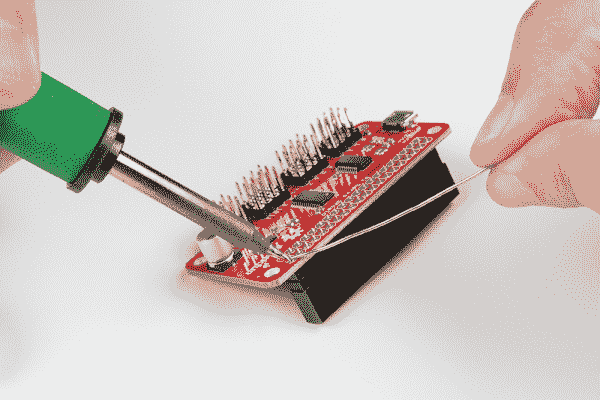
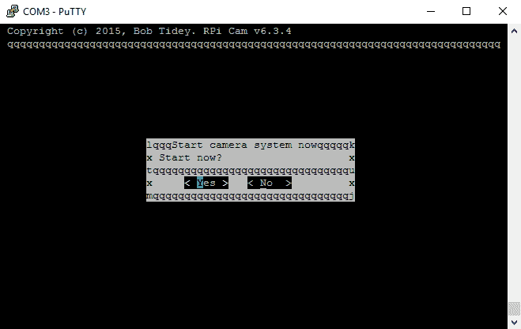

# 设置 Pi Zero 无线云台摄像机

> 原文：<https://learn.sparkfun.com/tutorials/setting-up-the-pi-zero-wireless-pan-tilt-camera>

## 介绍

本教程将向您展示如何组装、编程和访问 [Raspberry Pi Zero 无线云台摄像机](https://www.sparkfun.com/products/14329)。

[](https://www.sparkfun.com/products/retired/14329) 

### [SparkFun 树莓派 Zero W 相机套装](https://www.sparkfun.com/products/retired/14329)

[Retired](https://learn.sparkfun.com/static/bubbles/ "Retired") KIT-14329

SparkFun Raspberry Pi Zero W 相机套件为您提供了一个通过 Raspberry Pi Zero W 控制的云台相机

7 **Retired**[Favorited Favorite](# "Add to favorites") 28[Wish List](# "Add to wish list")

[https://www.youtube.com/embed/bOFVDu5zxvA/?autohide=1&border=0&wmode=opaque&enablejsapi=1](https://www.youtube.com/embed/bOFVDu5zxvA/?autohide=1&border=0&wmode=opaque&enablejsapi=1)

### 所需材料

你需要一个 microSD 卡，一个充足的电源和一根 micro-B USB 线。我们不建议预装 NOOBS 卡，因为它可能不包含支持 Pi Zero W 的最新版本的 Pi 操作系统

[](https://www.sparkfun.com/products/10215) 

将**添加到您的[购物车](https://www.sparkfun.com/cart)中！**

 **### [USB micro-B 线- 6 脚](https://www.sparkfun.com/products/10215)

[In stock](https://learn.sparkfun.com/static/bubbles/ "in stock") CAB-10215

USB 2.0 型到微型 USB 5 针。这是一种新的、更小的 USB 设备连接器。微型 USB 连接器大约是…

$5.5014[Favorited Favorite](# "Add to favorites") 21[Wish List](# "Add to wish list")****[](https://www.sparkfun.com/products/13831) 

将**添加到您的[购物车](https://www.sparkfun.com/cart)中！**

 **### [壁式适配器电源- 5.1V DC 2.5A (USB Micro-B)](https://www.sparkfun.com/products/13831)

[In stock](https://learn.sparkfun.com/static/bubbles/ "in stock") TOL-13831

这是一个高品质的开关“壁式”交流到 DC 5.1V 2500ma USB 微型 B 壁式电源，专为…

$8.9521[Favorited Favorite](# "Add to favorites") 47[Wish List](# "Add to wish list")****[](https://www.sparkfun.com/products/retired/13833) 

### [带适配器的 microSD 卡——16GB(10 类)](https://www.sparkfun.com/products/retired/13833)

[Retired](https://learn.sparkfun.com/static/bubbles/ "Retired") COM-13833

这是一个 10 级 16GB microSD 存储卡，非常适合容纳单板计算机和多种…

6 **Retired**[Favorited Favorite](# "Add to favorites") 8[Wish List](# "Add to wish list")**** ****### 所需工具

你需要一些工具来组装这个工具包:只需要一个标准的烙铁、焊料、一把小螺丝刀和一把偏口钳。

[](https://www.sparkfun.com/products/14782) 

将**添加到您的[购物车](https://www.sparkfun.com/cart)中！**

 **### [平齐刀具- Xcelite](https://www.sparkfun.com/products/14782)

[Out of stock](https://learn.sparkfun.com/static/bubbles/ "out of stock") TOL-14782

这些是来自 Excelite 的简单平切刀具，让您可以非常干净地切割引线并靠近焊点。

$8.952[Favorited Favorite](# "Add to favorites") 18[Wish List](# "Add to wish list")****[](https://www.sparkfun.com/products/9163) 

将**添加到您的[购物车](https://www.sparkfun.com/cart)中！**

 **### [无铅焊料- 15 克管](https://www.sparkfun.com/products/9163)

[In stock](https://learn.sparkfun.com/static/bubbles/ "in stock") TOL-09163

这是你的无铅焊料的基本管，带有不干净的水溶性树脂芯。0.031 英寸规格，15 克

$3.954[Favorited Favorite](# "Add to favorites") 14[Wish List](# "Add to wish list")****[](https://www.sparkfun.com/products/10865) 

将**添加到您的[购物车](https://www.sparkfun.com/cart)中！**

 **### [工具箱-螺丝刀和钻头套装](https://www.sparkfun.com/products/10865)

[Out of stock](https://learn.sparkfun.com/static/bubbles/ "out of stock") TOL-10865

没有什么比准备好一个好的黑客攻击，然后意识到你甚至不能打开盒子，因为你…

$10.957[Favorited Favorite](# "Add to favorites") 27[Wish List](# "Add to wish list")****[](https://www.sparkfun.com/products/9507) 

将**添加到您的[购物车](https://www.sparkfun.com/cart)中！**

 **### [烙铁- 30W(美国，110V)](https://www.sparkfun.com/products/9507)

[33 available](https://learn.sparkfun.com/static/bubbles/ "33 available") TOL-09507

这是一个非常简单的固定温度，快速加热，30W 110/120 VAC 烙铁。我们真的很喜欢使用更贵的 iro…

$10.957[Favorited Favorite](# "Add to favorites") 21[Wish List](# "Add to wish list")******** ********### 推荐阅读

除了遵循我们的一步一步的指导之外，这个工具包几乎不需要任何东西；然而，你可能想看看我们的[通孔焊接](https://learn.sparkfun.com/tutorials/how-to-solder-through-hole-soldering)教程，因为你需要做一些焊接来将引脚放置在 Pi Zero W 和 Pi 伺服帽上。您可能有兴趣阅读的其他教程包括:

[](https://learn.sparkfun.com/tutorials/how-to-solder-through-hole-soldering) [### 如何焊接:通孔焊接](https://learn.sparkfun.com/tutorials/how-to-solder-through-hole-soldering) This tutorial covers everything you need to know about through-hole soldering.[Favorited Favorite](# "Add to favorites") 70[](https://learn.sparkfun.com/tutorials/hobby-servo-tutorial) [### 爱好伺服教程](https://learn.sparkfun.com/tutorials/hobby-servo-tutorial) Servos are motors that allow you to accurately control the rotation of the output shaft, opening up all kinds of possibilities for robotics and other projects.[Favorited Favorite](# "Add to favorites") 24[](https://learn.sparkfun.com/tutorials/pi-servo-hat-hookup-guide) [### Pi 伺服帽连接指南](https://learn.sparkfun.com/tutorials/pi-servo-hat-hookup-guide) This hookup guide will show you how to connect and use the Pi Servo Hat in a project.[Favorited Favorite](# "Add to favorites") 3[](https://learn.sparkfun.com/tutorials/getting-started-with-the-raspberry-pi-zero-wireless) [### Raspberry Pi Zero Wireless 入门](https://learn.sparkfun.com/tutorials/getting-started-with-the-raspberry-pi-zero-wireless) Learn how to setup, configure and use the smallest Raspberry Pi yet, the Raspberry Pi Zero - Wireless.[Favorited Favorite](# "Add to favorites") 17

## 准备 MicroSD 卡

要准备 microSD 卡，我们需要:

*   下载最新的树莓派 Raspbian 杰西图片。
*   创建包含此启动映像的 microSD 卡。
*   编辑 microSD 卡上的“config.txt”文件，以启用串行调试控制台。
*   在 SD 卡上创建一个“wpa_supplicant.conf”文件来启用 WiFi。

让我们更详细地介绍一下这些步骤！

### 下载最新的 Raspbian 杰西图像

你可以在[树莓派基金会网站](https://www.raspberrypi.org/downloads/raspbian/)上找到图片。这是一个相当大的下载，所以去吃点零食或玩游戏什么的。

**Note**: Make sure that you don't download "RASPBIAN XYZ LITE", as the Lite installation is lacking several utilities and programs we'll need to get things moving. Note that XYZ is a placeholder for the release name of the distribution; at the time of this writing, that name is "Stretch".

### 将图像刻录到 MicroSD 卡上

为了将图像写到卡上，有一个用于 Mac/Linux/Windows 的优秀工具叫做 Etcher 。只需下载并安装到您的计算机上。然后选择你之前下载的镜像，你想要安装的驱动器(Etcher 只允许你安装到可移动驱动器，如果只有一个驱动器可用，它会自动选择它！)，并点击“闪！”

[](https://cdn.sparkfun.com/assets/learn_tutorials/6/5/8/etcher.png)

这是另一个漫长的过程，需要几分钟才能完成。一旦完成，窗口将显示“闪存完成！”消息。

[](https://cdn.sparkfun.com/assets/learn_tutorials/6/5/8/etcher_done.png)

默认情况下，Etcher 在创建映像后会“弹出”卡，因此您需要拔出卡并重新插入，以使您的计算机重新加载磁盘。

### 编辑 MicroSD 卡上的“config.txt”文件

若要继续，我们需要编辑 microSD 卡上的一个文件。这个文件在任何操作系统中都是可见的，尽管在 Linux 系统中它的位置略有不同。

在 Windows 或 Macintosh 上，这些文件将被加载到 microSD 卡的根目录中，所以当你打开驱动器的窗口时，你会直接看到它们。在 Linux 中，卡将被挂载，您必须导航到卡上的“Boot”目录才能找到我们要找的文件。

这是感兴趣的目录中所有文件的列表。

[](https://cdn.sparkfun.com/assets/learn_tutorials/6/5/8/drive_ls.png)*Click the image for a closer look.*

在你喜欢的文本编辑器(即 [Notepad++](https://notepad-plus-plus.org/) 、 [TextWrangler](https://www.barebones.com/products/textwrangler/) 、 [ConTEXT Editor](http://www.contexteditor.org/index.php) 等)中打开文件“config.txt”。)并将这一行添加到最后:

```
enable_uart=1 
```

**Note**: Despite the presence of a hash ('#') in front of the other lines in this file, you **must not** put one in front of this line. That would comment it out, causing it to be ignored. Adding this line will enable the UART on the GPIO pins so you can complete the rest of the process without having to hook your Pi Zero W up to a monitor and keyboard. Pretty nifty!

### 在 MicroSD 卡上创建“wpa_supplicant.conf”文件以启用 WiFi

**Troubleshooting Tip:** For users having difficulty enabling WiFi on Pi Zero in this step, you could use the PIXEL desktop GUI if you access to a monitor and mini-HDMI adapter to connect to your network. You can also enable the camera, I2C, and SSH through **Preferences > Raspberry Pi Configuration** from the desktop menu.

[](https://cdn.sparkfun.com/assets/learn_tutorials/6/5/8/RaspberryPi_PIXEL_Desktop_View.jpg)

准备 microSD 卡需要做的最后一件事是在卡上创建一个“wpa_supplicant.conf”文件。此文件包含本地无线网络设置所需的信息。

使用您喜欢的文本编辑器创建一个新文件。在 Windows 上，我们建议使用记事本，因为它提供所见即所得的内容，并允许您以任意文件扩展名保存文件。在 MacOS 上，TextWrangler 似乎是最简单的。对于 Linux，您的默认系统文本编辑器应该没问题。

文件的内容可能非常简单。最有可能的情况是，您可以逃脱类似这样的事情:

```
language:bash
network={
    ssid="YOUR_SSID"
    psk="YOUR_PASSWORD"
    key_mgmt=WPA-PSK
} 
```

添加后，修改您的 WiFi 网络的网络 ID 和密码。然后将文件另存为“wpa_supplicant.conf”保存到 microSD 卡。

**Important Note:** On the on the "Save As..." screen for Windows users, you'll need to change the file extension type under the field "Save as type:" from "*.txt file" to "All files". Then you will need to explicitly name the file **"wpa_supplicant.conf"**, or Notepad will automatically append ".txt" to the file name, breaking this functionality. See the image below.

[](https://cdn.sparkfun.com/r/600-600/assets/learn_tutorials/6/5/8/notepad_saveas.png)
*Click the image for a closer look.*
Some variation of this "Save as..." and removing the appended ".txt" suffix is necessary in Mac OS and Linux as well, but should be equally simple.

### 拔出 MicroSD 卡并将其插入 Pi Zero W

这就是我们在准备第一次开机时需要做的。你现在可以从你的计算机中取出卡，并把它放入 Pi Zero W 中。

## 硬件装配

要组装硬件，我们需要:

*   将接头焊接到树莓 Pi Zero W。
*   将接头焊接到 Pi 伺服帽上。
*   将 Pi 伺服帽安装在 Pi Zero W 上。
*   组装云台硬件并将伺服系统连接到帽子上。

让我们更详细地介绍一下这些步骤！

### 将接头焊接到 Raspberry Pi Zero W 和 Pi 伺服帽

我们建议将公接头焊接到 Pi Zero W，母接头焊接到 Pi 伺服帽。如果你对焊接有任何问题，请查看我们的[学习焊接](https://learn.sparkfun.com/tutorials/how-to-solder-through-hole-soldering)教程。

### 组装平移-倾斜机构

平移-倾斜机构的组装相当简单。最棘手的部分是确保伺服电机在组装过程中居中。

这是工具箱里东西的全家福。你将不需要伺服喇叭来包装与伺服电机，只是那些来单独包装。

[](https://cdn.sparkfun.com/assets/learn_tutorials/6/5/8/Pi_Servo_Cam_Guide-01.jpg)**Heads up!** The servo hardware may vary depending on the supplier. You may need to clip the arm servo horn with 6 holes and use the screws that were packaged separately.

首先识别带有两个长臂和两个短臂的伺服喇叭。你需要剪掉长臂，如下图所示。

[](https://cdn.sparkfun.com/assets/learn_tutorials/6/5/8/Pi_Servo_Cam_Guide-03.jpg)

找出套件附带的螺钉包中最小的螺钉。这些将用于将此喇叭固定在平移-倾斜装置的底座上。

[](https://cdn.sparkfun.com/assets/learn_tutorials/6/5/8/Pi_Servo_Cam_Guide-04.jpg)

如图所示，将喇叭放在底座上，然后从底部插入螺钉并将其拧入喇叭，将其拧紧。注意，会有额外的螺钉，甚至超出了以后要用的螺钉。这通常适用于这一组中的所有螺钉。

[](https://cdn.sparkfun.com/assets/learn_tutorials/6/5/8/Pi_Servo_Cam_Guide-05.jpg)

接下来，确定较大的自攻螺钉。这些将用于装配机械装置的下一部分。

[](https://cdn.sparkfun.com/assets/learn_tutorials/6/5/8/Pi_Servo_Cam_Guide-06.jpg)

找到下图中夹住第一个伺服系统的两个零件。注意这些部件中伺服的方向。

[](https://cdn.sparkfun.com/assets/learn_tutorials/6/5/8/Pi_Servo_Cam_Guide-07.jpg)

这里是夹层伺服。同样，注意正确组装的方向。

[](https://cdn.sparkfun.com/assets/learn_tutorials/6/5/8/Pi_Servo_Cam_Guide-08.jpg)

在这里，你可以看到螺丝确定了几个步骤前适合我们的伺服三明治。拧紧，但不要太紧。

[](https://cdn.sparkfun.com/assets/learn_tutorials/6/5/8/Pi_Servo_Cam_Guide-09.jpg)

现在将伺服轴安装到之前安装在底座上的喇叭上的配件中。这是您需要确保轴大致居中以便整个装配正常工作的点。我这样做是通过把轴一直转到一个极端，然后把它转 90 度回到另一个方向。然后，我删除基地，并排队与伺服电机的身体。

[](https://cdn.sparkfun.com/assets/learn_tutorials/6/5/8/Pi_Servo_Cam_Guide-11.jpg)

找到两个较长的螺丝来与喇叭套件在一套重视基地伺服。可能只有两个，而你两个都需要，所以不要丢失一个！将螺丝插入底部，拧紧螺丝，将两部分连接在一起。

[](https://cdn.sparkfun.com/assets/learn_tutorials/6/5/8/Pi_Servo_Cam_Guide-13.jpg)

你现在需要一个有 5 个孔的单臂伺服喇叭，如下图左侧所示。如果套件中不包括带 5 个孔的单臂伺服，您将需要修改单独包装的带 6 个孔的伺服喇叭。剪短喇叭的一个孔，如下图右侧所示，并检查它是否适合倾斜支架上的模具。修剪时要小心，确保不要剪去太多喇叭。

| [](https://cdn.sparkfun.com/assets/learn_tutorials/6/5/8/Pi_Servo_Cam_Guide-14.jpg) | [](https://cdn.sparkfun.com/assets/learn_tutorials/6/5/8/Pi_Zero_Pan-Tilt_Bracket_Servo_Arm_Modification.jpg) |
| *5 孔单臂伺服喇叭。* | *6 孔夹单臂伺服喇叭。* |

如下图所示安装单臂伺服喇叭。你将需要第一步中的两个小自攻螺钉来把它固定在机械装置上。

| [](https://cdn.sparkfun.com/assets/learn_tutorials/6/5/8/Pi_Servo_Cam_Guide-16.jpg) | [](https://cdn.sparkfun.com/assets/learn_tutorials/6/5/8/Pi_Zero_Pan-Tilt_Bracket_Attach_Servo_Arm_SelfTapping_Screws.jpg) |
| *安装单臂伺服喇叭。* | *安装夹住的单臂伺服喇叭。* |

**Note:** If necessary, you can loosen screws on the brackets placed around the servo in order to attach the clipped single arm servo horn to the bracket. This will keep the screws straight when tightening the screws.

你现在需要第二个伺服电机和最后一个机械装置。下图显示了这两个部分的相对方向。

[](https://cdn.sparkfun.com/assets/learn_tutorials/6/5/8/Pi_Servo_Cam_Guide-17.jpg)

这是两个部件组装在一起的照片。

[](https://cdn.sparkfun.com/assets/learn_tutorials/6/5/8/Pi_Servo_Cam_Guide-18.jpg)

现在，找出袋子里最长的机器螺丝，如下图所示。再一次，你会发现这些比你需要的要多。

[](https://cdn.sparkfun.com/assets/learn_tutorials/6/5/8/Pi_Servo_Cam_Guide-19.jpg)

将这些螺丝穿过伺服电机上的隔离翼，拧入机械装置的最后一部分。如果你喜欢的话，你可以用螺母来做这些，但是我发现这是不必要的，因为它们没有螺母也能很好地拧进机械装置。

[](https://cdn.sparkfun.com/assets/learn_tutorials/6/5/8/Pi_Servo_Cam_Guide-20.jpg)**Note:** For this tutorial, we used the longer screws. The shorter screws found in the baggie can also work. Depending on your personal preference, you can also use the shorter screws. They are long enough to hold the servo in place and reduces the possibility of the wires snagging against the longer screw.

现在将组件的两个主要部分连接在一起。下图显示了这两部分的方向。

[](https://cdn.sparkfun.com/assets/learn_tutorials/6/5/8/Pi_Servo_Cam_Guide-21.jpg)

您可能需要组装和拆卸这两个部件几次，以找到伺服电机的正确旋转位置，使倾斜部分具有其全部运动范围。这是两部分放在一起的图像。

[](https://cdn.sparkfun.com/assets/learn_tutorials/6/5/8/Pi_Servo_Cam_Guide-22.jpg)

将最后一个螺丝作为喇叭固定螺丝，用它将喇叭固定在伺服电机上。

[](https://cdn.sparkfun.com/assets/learn_tutorials/6/5/8/Pi_Servo_Cam_Guide-23.jpg)

恭喜你，你已经完成了云台装置的装配！

[](https://cdn.sparkfun.com/assets/learn_tutorials/6/5/8/Pi_Servo_Cam_Guide-24.jpg)

### 将接头焊接到 Pi Zero W 和 Pi 伺服帽上

我们建议将公接头焊接到 Pi Zero W 上。

[](https://cdn.sparkfun.com/assets/learn_tutorials/6/5/8/Pi_Servo_Cam_Guide-25.jpg)

对于这种情况，我最喜欢的技巧是焊接一个引脚，然后用右手拿着熨斗熔化引脚上的焊料，用左手调整接头，直到它平放，如下图所示。确保焊接时接头的较短侧和较长的引脚在元件侧。在钉住一个引脚后，将所有引脚焊接到 Pi Zero W。

[](https://cdn.sparkfun.com/assets/learn_tutorials/6/5/8/Pi_Servo_Cam_Guide-26.jpg)

对母接头和 Pi 伺服帽重复上述步骤。

[](https://cdn.sparkfun.com/assets/learn_tutorials/6/5/8/Pi_Servo_Cam_Guide-27.jpg)

确保从电路板底部插入短引脚，并将焊料添加到元件侧，以便 Pi 伺服帽堆叠在 Pi Zero W 的插头引脚之上。您还需要确保在焊接所有引脚之前，接头保持水平。

[](https://cdn.sparkfun.com/assets/learn_tutorials/6/5/8/Pi_Servo_Cam_Guide-28.jpg)

### 将摄像机模块固定在平移-倾斜装置上

如下图所示，首先将双面胶带粘贴到平移-倾斜装置上。

[](https://cdn.sparkfun.com/assets/learn_tutorials/6/5/8/Pi_Servo_Cam_Guide-29.jpg)

接下来，将柔性电缆连接到摄像头模块。请注意电缆末端的铜“手指”。手指放在上面的那一面应该是**面向**相机模块电路板。见下图。

[](https://cdn.sparkfun.com/assets/learn_tutorials/6/5/8/Pi_Servo_Cam_Guide-30.jpg)

如下图所示，将柔性电缆穿过云台装置，然后将摄像头电路板的背面压在双面胶带上，使其贴在云台装置上。

[](https://cdn.sparkfun.com/assets/learn_tutorials/6/5/8/Pi_Servo_Cam_Guide-31.jpg)

将柔性电缆从摄像机插入 Pi Zero W。与另一端一样，电缆带有铜指的一侧应面向电路板。不要忘记关闭夹紧机构！

[](https://cdn.sparkfun.com/assets/learn_tutorials/6/5/8/Pi_Servo_Cam_Guide-32.jpg)

现在，您可以将 Pi 伺服帽连接到 Pi Zero W 上的头部。

[](https://cdn.sparkfun.com/assets/learn_tutorials/6/5/8/Pi_Servo_Cam_Guide-34.jpg)

### 将伺服电机连接到 Pi 伺服帽

伺服电机需要连接到 Pi 伺服帽上的通道 0 和 1。将“平移”伺服(底部的那个)连接到通道 0，将“倾斜”伺服连接到通道 1。

| Pi 伺服帽(CH 0)
 | 平移伺服(平移-倾斜机构的底部)
 | Pi 伺服帽(CH 1)
 | 倾斜伺服
 |
| 签名 | 控制信号(橙色) | 签名 | 控制信号(橙色) |
| 啪 | Vcc(红色) | 啪 | Vcc(红色) |
| GND | GND(棕色) | GND | GND(棕色) |

连接后，您的设置应该如下图所示。

[](https://cdn.sparkfun.com/assets/learn_tutorials/6/5/8/Pi_Servo_Cam_Guide-36.jpg)

这就完成了硬件装配的必要步骤！

## 配置树莓 Pi

现在我们已经连接了 Pi 伺服帽并组装了硬件，我们准备好第一次启动 Raspberry Pi Zero W 了！要配置 Raspberry Pi，我们需要:

*   给 Pi 零瓦特供电。
*   连接 Pi 伺服帽的串行到 USB 转换器。
*   连接到 Pi Zero W 上的串行调试控制台。
*   在 Pi Zero W 上启用摄像机接口、I2C 和 SSH
*   更新 Pi Zero W 上的软件。
*   从 GitHub 下载并安装相机接口软件。
*   进行一些更改以启用平移-倾斜控制功能。
*   从 GitHub 下载 Pi 伺服帽接口软件。
*   进行一些更改，以便在引导时启动 Pi 伺服帽接口软件。

让我们更详细地介绍一下这些步骤！

### 给 Pi 零瓦特供电

使用足够的 5V 墙壁适配器，我们可以为 Pi Zero W 供电。将墙壁适配器插入墙壁电源插座。然后将 micro-b 从电源连接到 Pi Zero W 的标有“PWR IN”的 micro-b 连接器。

### 连接 Pi 伺服帽的串行到 USB 转换器

将 Pi 伺服帽堆叠在 Pi Zero W 上，使用 micro-B USB 电缆将其连接到 Pi 伺服帽的 micro-B 连接器。将另一端插入计算机的标准 USB 端口。这将允许您通过串行端口连接来连接 Pi。

### 打开串行终端

**Tip:** This setup uses a [headless setup](https://learn.sparkfun.com/tutorials/headless-raspberry-pi-setup/#serial-terminal) to configure the Raspberry Pi Zero. You could use the PIXEL desktop GUI if you access to a monitor and mini-HDMI adapter to enable the camera, I2C, and SSH through **Preferences > Raspberry Pi Configuration** from the desktop menu.

[](https://cdn.sparkfun.com/assets/learn_tutorials/6/5/8/RaspberryPi_PIXEL_Desktop_View.jpg)

从查看我们的[串行终端基础知识](https://learn.sparkfun.com/tutorials/terminal-basics)教程开始。这将使您开始使用串行终端。打开一个串行终端程序(即 PuTTY)进行连接。

当您连接到 Raspberry Pi 时，您需要将串行终端连接到它所枚举的 COM 端口，并以 115200 的波特率连接。未能使用正确的波特率设置将导致奇怪的字符和您的连接无法工作。

为了确定连接到哪个端口，我建议使用 Arduino IDE。在“工具”菜单下，有一个“端口”子菜单。由于我们已经将 USB 电缆连接到计算机的 COM 端口，请记下列出的 COM 端口上的项目。然后从电脑上拔下一根 micro-B USB 线。给它几秒钟，然后重新打开子菜单，看看有什么项目消失了。通过排除过程，我们可以确定 Raspberry Pi 枚举的 COM 端口。将电缆重新连接到 COM 端口进行验证。COM 端口应该以相同的 COM 号重新出现在子菜单中。

**Installing FTDI Drivers**: It's possible that you'll need to install FTDI drivers to get the COM port to appear. If the following instructions don't result in a port appearing in the list, visit our [FTDI driver installation tutorial](https://learn.sparkfun.com/tutorials/how-to-install-ftdi-drivers).

#### Windows 操作系统

如果您没有安装 Arduino IDE，也不想安装它，您可以使用内建工具找到相同的信息。在 Windows 下，打开您的设备管理器(如果您不知道如何操作，请在线搜索特定于操作系统的信息，因为它在不同版本的 Windows 下略有不同)。记下列表中的设备，然后拔下 Pi，查看列表中的哪个端口消失了。从列表中消失的端口就是您想要的端口。

[](https://cdn.sparkfun.com/assets/learn_tutorials/6/5/8/dev_manager_1.png)

#### 苹果个人计算机

使用 Mac OS，您需要打开一个终端窗口。要确定 Pi 连接到了哪个端口，请键入以下命令:

```
language:bash
ls /dev/cu.usbserial-* 
```

这将返回系统上 USB 串行转换器端口的列表。记下列表中的设备，然后拔下 Pi，查看列表中的哪个端口消失了。从列表中消失的端口就是您想要的端口。然后，您可以通过键入以下命令连接到有问题的端口

```
language:bash
screen /dev/cu.usbserial-XXXXXXXX 115200 
```

其中 XXXXXXXXX 由从第一个命令收集的信息替换。

#### Linux 操作系统

在 Linux 下，这个过程类似于 Mac OS，只使用这个命令来识别串口:

```
language:bash
ls /dev/ttyUSB* 
```

您可以使用“屏幕”连接到 Pi:

```
language:bash
screen /dev/ttyUSBX 115200 
```

同样,“X”应该替换为从上面的`ls`命令中收集的信息。如果您收到一个关于屏幕未安装的错误，您可以通过键入以下命令来安装`screen`:

```
language:bash
sudo apt-get install screen 
```

然后重新输入上述命令，通过`screen`进行连接。

### 登录到 Pi

当 Pi 完成引导(大约 30 秒)时，您应该会在串行终端屏幕上看到如下图所示的提示。如果您不知道，请尝试按 enter(或 return)键。如果登录信息是在您准备好串行终端之前打印的，这将显示登录信息。

[](https://cdn.sparkfun.com/assets/learn_tutorials/6/5/8/raspi_login.png)

使用用户名“pi”和密码“raspberry”登录系统。您现在已经登录到 Raspberry Pi，我们所做的所有其他事情都将在这个命令提示符下完成。

### 使用 raspi-config 实用程序启用相机、I2C 和 SSH

有一个名为“raspi-config”的漂亮的纯文本实用程序，它允许您启用相机界面、I2C 和通过 SSH 的远程访问。要使用它，只需键入以下命令:

```
language:bash
sudo raspi-config 
```

如果你好奇的话，这个命令的“sudo”部分告诉操作系统以超级用户的身份运行这个命令——基本上是一个拥有完全系统权限的用户。这是您将看到的菜单:

[](https://cdn.sparkfun.com/assets/learn_tutorials/6/5/8/raspi-config-menu.png)

从这里，您可以进行一些更改。您应该做的第一个更改是更改默认用户的密码。突出显示选项 1 并按回车键。您将收到一条警告，要求您更改密码，然后屏幕底部会出现提示，要求您输入新密码。您将被要求重复一遍，只是为了确保密码是您想要的，然后您将收到一条消息，说明密码已被更改。

**Please change your user password!** Leaving the default user password with SSH enabled is a security risk that could allow a malicious user to take over your device remotely.

现在，使用箭头键向下移动到选项 5，“接口选项”。您将看到以下菜单:

[](https://cdn.sparkfun.com/assets/learn_tutorials/6/5/8/interfacing_options.png)

突出显示选项“P1 相机”，并按回车键。这将显示以下屏幕:

[](https://cdn.sparkfun.com/assets/learn_tutorials/6/5/8/camera_enable_1.png)

突出显示“是”并按回车键。您将收到一条确认消息:

[](https://cdn.sparkfun.com/assets/learn_tutorials/6/5/8/camera_enabled.png)

按回车键离开这个屏幕。你会回到主菜单。再次返回“接口选项”菜单，重复这个过程两次，一次是“I2C”选项，一次是“SSH”选项。

这就结束了您需要使用 raspi-config 实用程序完成的工作。在主菜单中，按 tab 键两次突出显示“完成”，然后按 enter 键。如果询问您是否现在重启，选择“是”并按回车键。同样，登录提示需要 30 秒才能再次出现。

### 配置/etc/网络/接口文件

现在您需要告诉 Raspberry Pi 使用您之前创建的“wpa_supplicant.conf”文件。在串行终端中键入以下命令:

```
language:bash
sudo nano /etc/network/interfaces 
```

将以下几行添加到文件的末尾:

```
language:bash
auto wlan0
allow-hotplug wlan0
iface wlan0 inet dhcp
wpa-conf /etc/wpa_supplicant/wpa_supplicant.conf 
```

点击`CTRL` + `O`并回车保存文件，然后点击`CTRL` + `X`退出 nano 文本编辑器。

现在，通过键入以下命令重新启动 Raspberry Pi:

```
language:bash
sudo reboot 
```

### 更新 Pi

您现在必须将您的 Pi 软件更新到最新版本。为此，请在命令提示符下输入以下两个命令:

```
language:bash
sudo apt-get update
sudo apt-get dist-upgrade 
```

这将确保您的 Pi 软件是最新的。第一个命令需要一两分钟来运行，但是第二个命令需要更长的时间。耐心点！

### 安装远程摄像机网络界面软件

您现在需要下载并安装相机接口软件。为此，请按顺序执行以下四个命令:

```
language:bash
git clone https://github.com/silvanmelchior/RPi_Cam_Web_Interface.git
cd RPi_Cam_Web_Interface
chmod u+x *.sh
./install.sh 
```

第一个命令从 GitHub 获取软件。你不需要一个 GitHub 帐户来实现这个功能。但是，如果您输入的命令或 URL 错误，`git`可能会要求输入用户名。第二个输入刚从 GitHub 获取的目录。第三个更改该目录中 shell 脚本的用户权限，以便用户可以执行它们。第四个运行软件的安装脚本。

运行第四个命令将启动一个交互式脚本，允许您更改关于如何设置软件的各种设置。我们将带您完成它，以便您的设置可以反映我们的设置，以便于本教程的其余部分。互动部分需要一两分钟才能出现。再说一次，耐心！

这是安装脚本的交互界面。使用箭头键而不是 TAB 键在字段中移动！请注意，我们保持一切不变。唯一的例外是我们添加了用户名和密码(但是没有显示出来)。一旦你输入完用户名和密码，你可以按 TAB 键进入“OK”按钮，然后按“Enter”键选择它。

[](https://cdn.sparkfun.com/assets/learn_tutorials/6/5/8/install_sh.png)

安装脚本将下载并安装项目的所有依赖项。这可能需要一些时间(最多几分钟),所以请耐心等待。当一切完成后，将询问您是否要立即启动该服务。选择“是”。

[](https://cdn.sparkfun.com/assets/learn_tutorials/6/5/8/start_now.png)

## 测试摄像头网络界面

现在，在添加平移-倾斜功能之前，让我们确保摄像机正在工作。为此，我们首先必须确定 Pi Zero W 的 IP 地址，键入以下命令:

```
language:bash
ifconfig 
```

这样做应该会显示以下信息:

[](https://cdn.sparkfun.com/assets/learn_tutorials/6/5/8/ifconfig.png)

这里有很多信息，但我们只关注一小部分:“wlan0”部分中的“inet addr”条目。在上面的示例图像中，该值为 10.8.252.217。这是你的相机的 IP 地址。

打开一个网络浏览器，输入那个数字加上“/html”，作为网址。例如，我会在地址栏中输入“10.8.252.217/html”。如果一切正常，您应该会收到一个登录请求。**这是您在设置摄像头网络界面时输入的用户名和密码，而不是 Pi 本身的登录信息！**你会看到一个类似于下图的界面。

[](https://cdn.sparkfun.com/assets/learn_tutorials/6/5/8/picam_interface.png)

### 添加平移-倾斜支持

RPi Cam 界面软件支持平移-倾斜功能，但需要启用。为此，需要几个步骤。

首先，我们必须告诉软件我们希望启用平移-倾斜功能。这可以通过使用以下命令重命名隐藏在目录结构深处的文件来实现:

```
language:bash
sudo mv /var/www/html/pipan_off /var/www/html/pipan_on 
```

运行此命令后，返回到您的 web 浏览器并刷新相机界面。重新加载后，页面应该在图像正下方有四个方向箭头，如下所示。

[](https://cdn.sparkfun.com/assets/learn_tutorials/6/5/8/directionial_arrows.png)

接下来，我们需要创建一个系统管道，以便向控制平移-倾斜功能的接口软件发送命令。管道就像一个文件，只是它没有静态内容。只有程序在运行时定义的内容才能控制电机。

```
language:bash
sudo mknod /var/www/html/FIFO_pipan p
sudo chmod 666 /var/www/html/FIFO_pipan 
```

### 控制 Pi 帽子上的电机

现在我们已经从接口软件创建了管道，我们需要获取运行伺服电机的控制软件。我们已经创建了一个简单的 python 程序来完成这个任务。同样，我们将使用以下命令从 GitHub 获取该文件:

```
language:bash
cd
git clone https://github.com/sparkfun/RPi_PanTilt_Camera_Kit.git
python RPi_PanTilt_Camera_Kit/Firmware/pantilt.py & 
```

第一个命令确保您在 **/pi** 用户主目录中；以后的指示将视情况而定。第二个命令从 GitHub 获取程序，第三个命令执行程序。当你输入第三个命令时，你应该会看到和听到马达在软件的控制下抽动了一下。

现在回到界面网页，点击各个箭头。当你点击它们的时候，你应该看到平移-倾斜机制的反应。

最后，我们需要设置我们的系统，以便在计算机启动时启动 pan-tilt 软件。为此，我们需要编辑“rc.local”文件，该文件处理各种引导功能。要打开“rc.local”文件，请输入以下命令:

```
language:bash
sudo nano /etc/rc.local 
```

这将启动加载了“rc.local”的 nano 文本编辑器。使用向下箭头键滚动到文件的底部，并在“退出 0”行的正上方添加以下文本**:**

```
language:bash
python /home/pi/RPi_PanTilt_Camera_Kit/Firmware/pantilt.py & 
```

重要的是，你要把那一行放在“exit 0”行之上，否则它将永远不会被执行。现在，点击`CTRL` + `o`保存文件，点击`CTRL` + `x`退出 nano 文本编辑器。

**Troubleshooting Tip:** This tutorial was written to control servo motors with **200Hz** PWM. For users having issues with the “loud” buzzing, try dropping the PWM signal down to **50Hz**. It should be less noticeable. To adjust:

*   前往**RPi _ PanTilt _ Camera _ Kit/Firmware/**文件夹中的 [pantilt_50Hz.py](https://github.com/sparkfun/RPi_PanTilt_Camera_Kit/blob/master/Firmware/pantilt_50Hz.py) 示例。
*   然后使用下面的命令修改 **rc.local** 文件，如前所述:

    ```
    sudo nano /etc/rc.local
    ```

*   最后，要么注释掉，要么把你添加的行改成:

    ```
    python /home/pi/RPi_PanTilt_Camera_Kit/Firmware/pantilt_50Hz.py &
    ```

*For more details on modifying the code, try checking out the [Pi Servo Hat Hookup Guide](https://learn.sparkfun.com/tutorials/pi-servo-hat-hookup-guide) and [PCA9685's datasheet](http://www.nxp.com/docs/en/data-sheet/PCA9685.pdf) for the I2C registers and settings needed to configure the Pi Servo Hat's PWM signals.*

* * *

### 恭喜你！

您已经完成了 Raspberry Pi Zero W 云台摄像机的初始设置！这超出了本教程的范围，但是您可能还想做一些事情:

*   **设置动作激活** -记录界面软件的[页面有关于设置动作激活图像捕捉的有用信息。](http://elinux.org/RPi-Cam-Web-Interface)
*   **设置静态 IP 地址**——默认情况下，Pi Zero W 每次启动时，可能会被您网络上的 DHCP 服务器分配不同的 IP 地址。这使得与摄像机的交互变得困难，因为你需要在每次重启后检查摄像机以找出它的 IP 地址。设置静态 IP 地址是一个复杂的话题，取决于您的网络设置，留给读者作为练习。
*   **通过 SSH** 与相机通信-现在相机已启动并连接到您的 WiFi 网络，您不再需要通过串行电缆连接它。通过 SSH 连接比较简单，这里不赘述。

* * *

## 资源和更进一步

现在，您已经成功安装并运行了您的 Raspberry Pi Zero 无线云台摄像机，是时候将它集成到您自己的项目中了！

有关更多信息，请查看以下资源:

*   [SparkFun Pi 伺服帽连接指南](https://learn.sparkfun.com/tutorials/pi-servo-hat-hookup-guide)
*   [Raspberry Pi 基金会:Raspbian Jesse Image](https://www.raspberrypi.org/downloads/raspbian/)
*   [蚀刻器](https://etcher.io/)
*   官方的 Raspberry Pi 相机网络界面文档 -我们已经帮你完成了安装和设置，但是为了充分利用相机，你需要查看那个页面。
*   GitHub 回购
    *   [Raspberry Pi 摄像机 web 界面](https://github.com/silvanmelchior/RPi_Cam_Web_Interface) -用于控制 Raspberry Pi 摄像机的基于 Web 的界面的官方存储库，包括运动检测、延时、图像和视频记录。
    *   [SparkFun 云台示例代码](https://github.com/sparkfun/RPi_PanTilt_Camera_Kit)—*设置 Pi Zero 无线云台摄像机*教程中使用的演示代码。
*   [SparkFun 产品展示:Pi Zero W 云台摄像机套件演示](https://www.youtube.com/watch?v=bOFVDu5zxvA)
    *   [Shawn 的平移/倾斜延时演示代码](https://gist.github.com/ShawnHymel/1d5ef8b625c958e8d4e3974a01da4695) -用于 SparkFun 产品展示的 Python 演示代码

你的下一个项目需要一些灵感吗？查看一些相关教程:

[](https://learn.sparkfun.com/tutorials/qwiic-mux-hookup-guide) [### Qwiic MUX 连接指南](https://learn.sparkfun.com/tutorials/qwiic-mux-hookup-guide) Have a bunch of sensors with the same I2C address? Put them on the Qwiic MUX (TCA9548A) to get them all talking on the same bus 0[](https://learn.sparkfun.com/tutorials/using-home-assistant-to-expand-your-home-automations) [### 使用家庭助手扩展您的家庭自动化](https://learn.sparkfun.com/tutorials/using-home-assistant-to-expand-your-home-automations) An introduction to Home Assistant, an open source home automation hub.[Favorited Favorite](# "Add to favorites") 7[](https://learn.sparkfun.com/tutorials/sparkfun-pir-breakout-hookup-guide) [### SparkFun PIR 转接指南](https://learn.sparkfun.com/tutorials/sparkfun-pir-breakout-hookup-guide) Get started with these Panasonic EKM-Series PIR breakouts following this Hookup Guide.[Favorited Favorite](# "Add to favorites") 0[](https://learn.sparkfun.com/tutorials/qwiic-shim-kit-for-raspberry-pi-hookup-guide) [### 用于 Raspberry Pi 连接指南的 Qwiic 垫片套件](https://learn.sparkfun.com/tutorials/qwiic-shim-kit-for-raspberry-pi-hookup-guide) Get started with the Serial LCD with RGB backlight and 9DoF IMU (ICM-20948) via I2C using the Qwiic system and Python on a Raspberry Pi! Take sensor readings and display them in the serial terminal or SerLCD.[Favorited Favorite](# "Add to favorites") 0

或者查看物联网 Raspberry Pi 相机冰箱项目，看看你的冰箱里有什么或者另一个房间正在发生什么，以监控实验。

[https://www.youtube.com/embed/Fd-97wNEqOQ/?autohide=1&border=0&wmode=opaque&enablejsapi=1](https://www.youtube.com/embed/Fd-97wNEqOQ/?autohide=1&border=0&wmode=opaque&enablejsapi=1)

*Code for the project can be found on [GitHub: IoT_FridgeCam](https://github.com/sparkfun/IoT_FridgeCam)*************