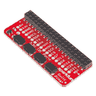
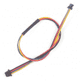

# CCS811/BME280 (Qwiic)环境组合分线连接指南

> 原文：<https://learn.sparkfun.com/tutorials/ccs811bme280-qwiic-environmental-combo-breakout-hookup-guide>

## 介绍

[CCS811/BME280 (Qwiic)环境组合突破](https://www.sparkfun.com/products/14348)协同工作，利用 CCS811 和 BME280 ICs 满足您所有的大气质量检测需求。CCS811 是一个非常受欢迎的传感器，提供以百万分率(PPM)计的等效 CO [2] (或 eCO [2] )和以十亿分率(PPB)计的总挥发性有机化合物的读数。CCS811 还具有一个功能，如果它可以访问当前的湿度和温度，它可以微调其读数。幸运的是，BME280 提供了湿度、温度和气压！这使得传感器能够协同工作，给我们提供比它们单独工作时更准确的读数。我们还通过 I ² C 简化了与它们的接口。

[](https://www.sparkfun.com/products/14348) 

### [【spark fun 环保组合 Breakout-CCS 811/BME 280(Qwiic)](https://www.sparkfun.com/products/14348)

[Out of stock](https://learn.sparkfun.com/static/bubbles/ "out of stock") SEN-14348

SparkFun CCS811/BME280 环境组合突破满足您所有的大气质量感测需求

20[Favorited Favorite](# "Add to favorites") 63[Wish List](# "Add to wish list")

### 所需材料

首先，你需要一个微控制器或单板计算机来控制一切。

[](https://www.sparkfun.com/products/13975) 

将**添加到您的[购物车](https://www.sparkfun.com/cart)中！**

 **### [spark fun red board——用 Arduino 编程 T3](https://www.sparkfun.com/products/13975)

[In stock](https://learn.sparkfun.com/static/bubbles/ "in stock") DEV-13975

SparkFun RedBoard 结合了 UNO 的 Optiboot 引导程序的简单性、FTDI 的稳定性和 shield com…

$21.5049[Favorited Favorite](# "Add to favorites") 89[Wish List](# "Add to wish list")****[](https://www.sparkfun.com/products/13907) 

将**添加到您的[购物车](https://www.sparkfun.com/cart)中！**

 **### [SparkFun ESP32 东西](https://www.sparkfun.com/products/13907)

[In stock](https://learn.sparkfun.com/static/bubbles/ "in stock") DEV-13907

SparkFun ESP32 Thing 是 Espressif 的 ESP32 的综合开发平台，ESP32 是他们的超级充电版本…

$23.5069[Favorited Favorite](# "Add to favorites") 83[Wish List](# "Add to wish list")****[](https://www.sparkfun.com/products/13774) 

将**添加到您的[购物车](https://www.sparkfun.com/cart)中！**

 **### [【粒子光子】](https://www.sparkfun.com/products/13774)

[Out of stock](https://learn.sparkfun.com/static/bubbles/ "out of stock") WRL-13774

Particle 的 IoT(物联网)硬件开发板 Photon 提供了构建互联网络所需的一切…

$19.0032[Favorited Favorite](# "Add to favorites") 51[Wish List](# "Add to wish list")****[](https://www.sparkfun.com/products/retired/13825) 

### [树莓派 3](https://www.sparkfun.com/products/retired/13825)

[Retired](https://learn.sparkfun.com/static/bubbles/ "Retired") DEV-13825

每个人都知道并喜欢 Raspberry Pi，但如果您不需要额外的外设来使其无线化会怎么样呢？覆盆子…

92 **Retired**[Favorited Favorite](# "Add to favorites") 97[Wish List](# "Add to wish list")****** ******现在，要进入 Qwiic 生态系统，关键是以下可堆叠 Qwiic 板之一，以满足您对微控制器或单板计算机的偏好:

[](https://www.sparkfun.com/products/14352) 

将**添加到您的[购物车](https://www.sparkfun.com/cart)中！**

 **### [ArduinoT3 的 SparkFun Qwiic 盾](https://www.sparkfun.com/products/14352)

[In stock](https://learn.sparkfun.com/static/bubbles/ "in stock") DEV-14352

SparkFun Qwiic Shield 是一种易于组装的板，它提供了一种简单的方法来将 Qwiic Connect 系统与

$7.508[Favorited Favorite](# "Add to favorites") 39[Wish List](# "Add to wish list")****[](https://www.sparkfun.com/products/14459) 

将**添加到您的[购物车](https://www.sparkfun.com/cart)中！**

 **### [树莓派的 SparkFun Qwiic 帽子](https://www.sparkfun.com/products/14459)

[In stock](https://learn.sparkfun.com/static/bubbles/ "in stock") DEV-14459

树莓派的 SparkFun Qwiic 帽子是进入 Qwiic 生态系统的最快捷、最简单的方式，并且仍然适用于

$6.505[Favorited Favorite](# "Add to favorites") 33[Wish List](# "Add to wish list")****[](https://www.sparkfun.com/products/14477) 

将**添加到您的[购物车](https://www.sparkfun.com/cart)中！**

 **### [光子盾](https://www.sparkfun.com/products/14477)

[28 available](https://learn.sparkfun.com/static/bubbles/ "28 available") DEV-14477

SparkFun Qwiic Shield for Photon 是一个易于组装的板，提供了一种简单的方法来整合 Qwiic 系统…

$6.50[Favorited Favorite](# "Add to favorites") 7[Wish List](# "Add to wish list")****[](https://www.sparkfun.com/products/retired/14203) 

### [Qwiic 盾为 ESP32](https://www.sparkfun.com/products/retired/14203)

[Retired](https://learn.sparkfun.com/static/bubbles/ "Retired") SPX-14203

* *该产品已经退役。**我们建议您焊接一根[Qwiic 试验板电缆](https://www . spark fun . com/products/14425)…

**Retired**[Favorited Favorite](# "Add to favorites") 2[Wish List](# "Add to wish list")****** ******您还需要一根 Qwiic 电缆将屏蔽层连接到 CCS811/BME280，选择适合您需求的长度。

[](https://www.sparkfun.com/products/14427) 

将**添加到您的[购物车](https://www.sparkfun.com/cart)中！**

 **### [Qwiic 线缆- 100mm](https://www.sparkfun.com/products/14427)

[In stock](https://learn.sparkfun.com/static/bubbles/ "in stock") PRT-14427

这是一条 100 毫米长的 4 芯电缆，带有 1 毫米 JST 端接。它旨在将支持 Qwiic 的组件连接在一起…

$1.50[Favorited Favorite](# "Add to favorites") 32[Wish List](# "Add to wish list")****[](https://www.sparkfun.com/products/14429) 

将**添加到您的[购物车](https://www.sparkfun.com/cart)中！**

 **### [Qwiic 线缆- 500mm](https://www.sparkfun.com/products/14429)

[In stock](https://learn.sparkfun.com/static/bubbles/ "in stock") PRT-14429

这是一根 500mm 长的 4 芯电缆，带有 1mm JST 端接。它旨在将支持 Qwiic 的组件连接在一起…

$1.951[Favorited Favorite](# "Add to favorites") 25[Wish List](# "Add to wish list")****[](https://www.sparkfun.com/products/14426) 

将**添加到您的[购物车](https://www.sparkfun.com/cart)中！**

 **### [Qwiic 线缆- 50mm](https://www.sparkfun.com/products/14426)

[In stock](https://learn.sparkfun.com/static/bubbles/ "in stock") PRT-14426

这是一根 50 毫米长的 4 芯电缆，带有 1 毫米 JST 端接。它旨在将支持 Qwiic 的组件连接在一起…

$0.95[Favorited Favorite](# "Add to favorites") 29[Wish List](# "Add to wish list")****[](https://www.sparkfun.com/products/14428) 

### [Qwiic 线缆- 200mm](https://www.sparkfun.com/products/14428)

[Out of stock](https://learn.sparkfun.com/static/bubbles/ "out of stock") PRT-14428

这是一根 200 毫米长的 4 芯电缆，带有 1 毫米 JST 端接。它旨在将支持 Qwiic 的组件连接在一起…

[Favorited Favorite](# "Add to favorites") 21[Wish List](# "Add to wish list")****** ******### 推荐阅读

如果你不熟悉 Qwiic 系统，我们推荐你在这里阅读[以获得一个概述](https://www.sparkfun.com/qwiic)。

| [](https://www.sparkfun.com/qwiic) |
| *[Qwiic 连接系统](https://www.sparkfun.com/qwiic)* |

如果你不熟悉下面的教程，我们也建议你看一看。

[](https://learn.sparkfun.com/tutorials/i2c) [### I2C](https://learn.sparkfun.com/tutorials/i2c) An introduction to I2C, one of the main embedded communications protocols in use today.[Favorited Favorite](# "Add to favorites") 128[](https://learn.sparkfun.com/tutorials/qwiic-shield-for-arduino--photon-hookup-guide) [### Arduino 和光子连接指南的 Qwiic 屏蔽](https://learn.sparkfun.com/tutorials/qwiic-shield-for-arduino--photon-hookup-guide) Get started with our Qwiic ecosystem with the Qwiic shield for Arduino or Photon.[Favorited Favorite](# "Add to favorites") 5

关于 TVOC 和生态 2 阅读的更多信息，请看下面的博客文章。

[](https://www.sparkfun.com/news/2369 "April 26, 2017: Wherein we seek to answer the age old question: What the heck is a VOC?") [### 硬件驼峰日:用 CCS811 测量空气质量

April 26, 2017](https://www.sparkfun.com/news/2369 "April 26, 2017: Wherein we seek to answer the age old question: What the heck is a VOC?")[Favorited Favorite](# "Add to favorites") 2

如果压力的概念压在你身上，看看这些链接。

*   [(外部)气压高度计算器](http://www.mide.com/products/slamstick/air-pressure-altitude-calculator.php)——玩一玩，感受一下不同高度的气压。
*   维基百科:大气压(Atmospheric _ pressure)——有一个很好的气压和海拔转换公式(参考图书馆代码)。
*   [MPL3115A2 压力传感器连接指南:压力与高度计设置](https://learn.sparkfun.com/tutorials/mpl3115a2-pressure-sensor-hookup-guide#pressure-vs-altimeter-setting) -困惑为什么读数压力与当地气象站报告的压力不匹配？阅读此部分。

## 硬件概述

### 电源和功能

这些传感器总共可以消耗 13 mA 的电流。为 CCS811 供电需要 12 mA，为 BME280 供电需要 1 mA。

| **特性** | **范围** |
| 工作电压 | 3.3V: **调节到 1.8V - 3.6V** |
| tVOC | 0 - 1187 PPB |
| eCO [2] | 400 - 8192 PPM |
| 温度 | -40 摄氏度- 85 摄氏度 |
| 湿度 | 0 - 100%相对湿度，加上 20 - 80%的 3% |
| 压力 | 30 - 110 kPa，相对精度 12 Pa，绝对精度 100 Pa |
| 海拔 | 0 - 30，000 英尺(9.2 公里)，海平面上的相对精度为 3.3 英尺(1 米)，30，000 英尺上的相对精度为 6.6 英尺(2M)。 |

### 通过 I ² C 进行通信

CCS811+BME280 只通过 I ² C 通信，利用我们方便的 Qwiic 系统。Qwiic 系统使用下面突出显示的 4 针极化 Qwiic 连接器。

[](https://cdn.sparkfun.com/assets/learn_tutorials/6/8/7/i2cconn.png)

如果您正在使用具有相同 I ² C 地址的另一个器件，I ² C 地址也可以使用电路板背面的跳线进行更改。通过添加焊料关闭跳线，ADR1 可用于将 CCS811 的 I ² C 地址从 0x5B 更改为 0x5A。ADR2 跳线可用于将 BME280 的 I ² C 地址从 0x77 更改为 0x76。I ² C 总线默认启用上拉电阻。如果不需要，可以通过用业余爱好刀分离底部的“I ² C PU”三重跳线来移除。这些跳线的位置如下图所示。

[](https://cdn.sparkfun.com/assets/learn_tutorials/6/8/7/JumperGimp.png)

### 腿

以下是 CCS811 和 BME280 环境组合分线点可用的引脚列表。

| 别针 | 描述 | 方向 |
| RST | 复位(低电平有效，CCS811) | 在…里 |
| INT | 中断(低电平有效，CCS811) | 在外 |
| WAK | 唤醒(低电平有效，CCS811) | 在…里 |
| SCL | 时钟 | 在…里 |
| 国家药品监督管理局 | 数据 | 在…里 |
| 3.3V | 力量 | 在…里 |
| GND | 地面 | 在…里 |

#### CCS811 的可选控制线路

此外，三条控制线 RST 、 INT 和 WAK 可用于进一步提高对 CCS811 的控制程度。

*   RST -拉低此线以复位 IC。
*   INT -配置传感器发出中断请求后，读取该行以确定中断的状态。
*   WAK -拉高这条线使传感器进入睡眠状态。这可以用来节省电力，但如果电力不是问题，则没有必要。

## 硬件装配

[](https://cdn.sparkfun.com/assets/learn_tutorials/6/8/7/CCS811_BME280_hookup_guide-02.jpg)

## 库概述

**注意:**此示例假设您在桌面上使用的是最新版本的 Arduino IDE。如果这是你第一次使用 Arduino，请回顾我们关于[安装 Arduino IDE 的教程。](https://learn.sparkfun.com/tutorials/installing-arduino-ide)如果您之前没有安装 Arduino 库，请查看我们的[安装指南。](https://learn.sparkfun.com/tutorials/installing-an-arduino-library)

使用 Arduino 库管理器！SparkFun 编写了库来控制 CCS811 和 BME280。您可以通过 Arduino 库管理器获得这些库。搜索 **SparkFun CCS811** 和 **SparkFun BME280** ，应该可以安装最新版本。以前从未安装过库？没关系！查看我们的教程[安装 Arduino 库](https://learn.sparkfun.com/tutorials/installing-an-arduino-library/using-the-library-manager)。如果你喜欢下载这些库，你可以在这里手动安装:

[Download the SparkFun BME280 Library (ZIP)](https://github.com/sparkfun/SparkFun_BME280_Arduino_Library/archive/master.zip)[Download the SparkFun CCS811 Library (ZIP)](https://github.com/sparkfun/SparkFun_CCS811_Arduino_Library/archive/master.zip)

在我们开始画草图之前，让我们看一下使用的库。

### BME280 库

#### 建筑

在全局作用域中，构造不带参数的传感器对象(如`mySensor`或`pressureSensorA`)。

示例:

`BME280 mySensor;`

#### 对象参数和设置()

不是将一堆数据传递给构造函数，而是通过在`setup()`函数中设置 BME280 类型的值来完成配置。它们通过被`public:`公开，所以使用`myName.aVariable = someValue;`语法。

*BME 280 类的可设置变量:*

//Main Interface and mode settings
uint8_t commInterface;
uint8_t I2CAddress;
uint8_t chipSelectPin;

uint8_t runMode;
uint8_t tStandby;
uint8_t filter;
uint8_t tempOverSample;
uint8_t pressOverSample;
uint8_t humidOverSample;

*`setup()`:*中 BME280 型的配置示例

```
language:c
#include <stdint.h>
#include "SparkFunBME280.h"

#include "Wire.h"
#include "SPI.h"

//Global sensor object
BME280 mySensor;

void setup()
{
    //***Driver settings********************************//
    //commInterface can be I2C_MODE
    //specify I2C address.  Can be 0x77(default) or 0x76

    //For I2C, enable the following
    mySensor.settings.commInterface = I2C_MODE;
    mySensor.settings.I2CAddress = 0x77;

    //***Operation settings*****************************//

    //runMode can be:
    //  0, Sleep mode
    //  1 or 2, Forced mode
    //  3, Normal mode
    mySensor.settings.runMode = 3; //Forced mode

    //tStandby can be:
    //  0, 0.5ms
    //  1, 62.5ms
    //  2, 125ms
    //  3, 250ms
    //  4, 500ms
    //  5, 1000ms
    //  6, 10ms
    //  7, 20ms
    mySensor.settings.tStandby = 0;

    //filter can be off or number of FIR coefficients to use:
    //  0, filter off
    //  1, coefficients = 2
    //  2, coefficients = 4
    //  3, coefficients = 8
    //  4, coefficients = 16
    mySensor.settings.filter = 0;

    //tempOverSample can be:
    //  0, skipped
    //  1 through 5, oversampling *1, *2, *4, *8, *16 respectively
    mySensor.settings.tempOverSample = 1;

    //pressOverSample can be:
    //  0, skipped
    //  1 through 5, oversampling *1, *2, *4, *8, *16 respectively
    mySensor.settings.pressOverSample = 1;

    //humidOverSample can be:
    //  0, skipped
    //  1 through 5, oversampling *1, *2, *4, *8, *16 respectively
    mySensor.settings.humidOverSample = 1;
    delay(10);  //Make sure sensor had enough time to turn on. BME280 requires 2ms to start up.         Serial.begin(57600);

    Serial.print("Starting BME280... result of .begin(): 0x");
    //Calling .begin() causes the settings to be loaded
    Serial.println(mySensor.begin(), HEX);

} 
```

*   `uint8_t begin( void )` -在上面的例子中，begin 用于启动传感器。它遵循的基本程序如下:

    *   如有必要，启动布线库，尽管在你的草图中可能需要`#include "Wire.h"`。
    *   按照博世的规定连接校准字。
    *   将用户设置应用于 BME280 中的配置寄存器。
    *   返回 ID 寄存器(读数应为 0x60)。

    要使用它，调用`mySensor.begin();`或将输出分配给类似`uint8_t myReturnedValue = mySensor.begin();`的东西

    **.begin() Needs to be run once during the setup**, or after any settings have been modified. In order to let the sensor's configuration take place, the BME280 requires a minimum time of about 2 ms in the sketch before you take data.
*   `void reset( void )` -向 BME280 发送复位字。之后，您必须再次运行 begin()。

*   `float readTempC( void )` -用于获取以摄氏度为单位的温度，作为浮点数。

*   `float readTempF( void )` -用来获取华氏温度，作为一个浮点数。不需要争论。

*   `float readFloatPressure( void )` -用于以千帕为单位获取压力，作为一个浮点数。

*   `float readFloatAltitudeMeters( void )` -用于以米为单位获取高度，作为一个浮点数。

*   `float readFloatAltitudeFeet( void )` -用于获取以英尺为单位的高度，作为一个浮点数。该功能根据测得的压力进行计算。

*   `float readFloatHumidity( void )` -用于获取相对湿度百分比，作为一个浮点数。

### CCS811 库

与我们的其他传感器相比，该库使用起来相当正常。您必须包含该库，在全局空间中创建一个传感器对象，然后使用该对象的函数来启动和控制传感器。有了这个，你必须在构造的时候把 I ² C 地址传递给对象。

**CCS811 Burn-in Time:** Please be aware that the CCS811 datasheet recommends a burn-in of 48 hours and a run-in of 20 minutes (i.e. you must allow 20 minutes for the sensor to warm up and output valid data).

为了包含这个库并处理好所有棘手的编译器问题，将以下代码放在草图的开头，在`void setup()`函数之前。

```
language:c
#include <SparkFunCCS811.h>

#define CCS811_ADDR 0x5B //Default I2C Address
//#define CCS811_ADDR 0x5A //Alternate I2C Address

CCS811 myCCS811(CCS811_ADDR); 
```

现在可以调用名为`myCCS811`的对象的函数来设置和获取数据，而所有 I ² C 的东西都被隐藏起来。

要在程序启动期间准备好传感器，必须调用`myCCS811.begin()`。这里有一个 begin 的最小用法的例子。

```
language:c
void setup()
{
    myCCS811.begin();
} 
```

**Error Status:** The .begin() function has a special feature: it returns the status of the function call! If there was a problem during begin, it will return a non-zero code indicating what happened. It's optional, and is described in the "Custom Types and Literals" section below.

然后在程序的 main `loop()`中，需要调用传感器函数，如`mySensor.readAlgorithmResults()`来读取传感器。以下代码片段显示了一个简单的数据检查，方法是调用传感器来计算值、输出数据并将数据保存在变量中。然而，它并没有对数据做任何事情！查看完整功能代码的示例，以利用传感器数据。

```
language:c
void loop()
{
  if (myCCS811.dataAvailable())
  {
    myCCS811.readAlgorithmResults();
    int tempCO2 = myCCS811.getCO2();
    int tempVOC = myCCS811.gettVOC();
  }
  else if (myCCS811.checkForStatusError())
  {
    while(1);
  }

  delay(1000); //Wait for next reading
} 
```

### 函数引用

以下函数适用于`CCS811`对象。具有作用域返回类型`CCS811Core::status`的函数报告一个错误状态，如下面的文字部分所定义。它是可选的，可用于确定呼叫的成功或失败。

*   `CCS811Core::status begin( void )` -启动`wire`，检查 ID 寄存器，检查有效应用数据，启动应用，并建立驱动模式。

*   `CCS811Core::status readAlgorithmResults( void )` -调用以使传感器读取其硬件并计算 TVOC 和生态 [2] 水平。

*   `bool checkForStatusError( void )` -如果有未决错误，则返回`true`。这将检查状态寄存器。

*   `bool dataAvailable( void )` -如果新样本已准备好但尚未读取，则返回`true`。

*   `bool appValid( void )` -如果内部 CCS811 存储器中有有效的应用程序，则返回`true`。

*   `uint8_t getErrorRegister( void )` -返回 ERROR_ID 寄存器的状态。

*   `uint16_t getBaseline( void )` -返回基线值。

*   `CCS811Core::status setBaseline( uint16_t )` -将保存的基线应用于 CCS811。

*   `CCS811Core::status enableInterrupts( void )` -使能数据就绪中断引脚。

*   `CCS811Core::status disableInterrupts( void )` -禁用中断引脚。

*   `CCS811Core::status setDriveMode( uint8_t mode )` -设置驱动模式，其中`mode`可以是 0 到 4:

    *   0:测量关闭
    *   1:每 1 秒测量一次
    *   2:每 10 秒测量一次
    *   3:每 60 秒测量一次
    *   4:每 0.25 秒测量一次-用于外部算法

*   `CCS811Core::status setEnvironmentalData( float relativeHumidity, float temperature )` -设定补偿的环境条件。

    *   相对湿度，单位为%，0.00 到 100.0
    *   以摄氏度为单位的温度，-25.0 到 50.0

*   `void setRefResistance( float )` -如果您已经更改了热敏电阻上拉电阻，调用此命令为传感器提供新的电阻值。不然就是 10000。

*   `uint16_t getTVOC( void )` -收集最后计算的 TVOC 值，单位为十亿分之一(ppb)。

*   `uint16_t getCO2( void )` -收集最后计算的 eC0 [2] 值，单位为百万分率(ppm)。

*   `float getResistance( void )` -收集最后计算的 NTC 端子的电阻值。

*   `float getTemperature( void )` -收集最后计算的温度。

### 自定义类型和文字

CCS811 库定义了一种特殊的数据类型来处理函数的错误状态。在大多数情况下，可以使用该库，而无需关注函数返回类型，但如果需要的话，数据类型`status`可以保存这些值:

```
language:c
// Return values 
typedef enum
{
    SENSOR_SUCCESS,
    SENSOR_ID_ERROR,
    SENSOR_I2C_ERROR,
    SENSOR_INTERNAL_ERROR
    //...
} status; 
```

为了避免多个库使用同一个`status`名称的可能性，枚举实际上在 CCS811 对象的范围内，隐藏在 CCS811Core 中，CCS 811 core 是基类。*唷*，别太担心那个；当你想使用它的时候，只需要把`CCSCore::`放在状态名的前面，像一个普通的枚举一样使用它(例如`CCS811Core::status myLocalReturnStatus;`)。这只是告诉编译器变量名在一个特定的位置。您还必须将范围操作符添加到枚举名称中。

下面的示例展示了如何使用状态枚举:

```
language:c
CCS811Core::status returnCode = mySensor.beginCore();
Serial.print("beginCore exited with: ");
switch ( returnCode )
{
case CCS811Core::SENSOR_SUCCESS:
  Serial.print("SUCCESS");
  break;
case CCS811Core::SENSOR_ID_ERROR:
  Serial.print("ID_ERROR");
  break;
case CCS811Core::SENSOR_I2C_ERROR:
  Serial.print("I2C_ERROR");
  break;
case CCS811Core::SENSOR_INTERNAL_ERROR:
  Serial.print("INTERNAL_ERROR");
  break;
case CCS811Core::SENSOR_GENERIC_ERROR:
  Serial.print("GENERIC_ERROR");
  break;
default:
  Serial.print("Unspecified error.");
} 
```

如果您使用直接读写功能，该库还定义了 CCS811 寄存器的名称。这些是全局范围的，可以在任何地方使用。

```
language:c
//Register addresses
#define CSS811_STATUS 0x00
#define CSS811_MEAS_MODE 0x01
#define CSS811_ALG_RESULT_DATA 0x02
#define CSS811_RAW_DATA 0x03
#define CSS811_ENV_DATA 0x05
#define CSS811_NTC 0x06
#define CSS811_THRESHOLDS 0x10
#define CSS811_BASELINE 0x11
#define CSS811_HW_ID 0x20
#define CSS811_HW_VERSION 0x21
#define CSS811_FW_BOOT_VERSION 0x23
#define CSS811_FW_APP_VERSION 0x24
#define CSS811_ERROR_ID 0xE0
#define CSS811_APP_START 0xF4
#define CSS811_SW_RESET 0xFF 
```

## 示例代码

对于下面的例子，可以在[这里](https://github.com/sparkfun/Qwiic_BME280_CCS811_Combo/tree/master/Firmware)找到，我们将使用我们的库和一些函数来查看我们的数据。我们代码的序言、`setup()`和函数定义都是相同的。然而，`void loop()`将在示例之间改变。首先，我们必须用我们的前同步码、`setup()`和`loop()`初始化我们的传感器，如下所示。

```
language:c
#include <SparkFunBME280.h>
#include <SparkFunCCS811.h>

#define CCS811_ADDR 0x5B //Default I2C Address
//#define CCS811_ADDR 0x5A //Alternate I2C Address

//Global sensor objects
CCS811 myCCS811(CCS811_ADDR);
BME280 myBME280;

void setup()
{
  Serial.begin(9600);
  Serial.println();
  Serial.println("Apply BME280 data to CCS811 for compensation.");

  Wire.begin();//initialize I2C bus

  //This begins the CCS811 sensor and prints error status of .begin()
  CCS811Core::status returnCode = myCCS811.begin();
  if (returnCode != CCS811Core::SENSOR_SUCCESS)
  {
    Serial.println("Problem with CCS811");
    printDriverError(returnCode);
  }
  else
  {
    Serial.println("CCS811 online");
  }

  //Initialize BME280
  //For I2C, enable the following and disable the SPI section
  myBME280.settings.commInterface = I2C_MODE;
  myBME280.settings.I2CAddress = 0x77;
  myBME280.settings.runMode = 3; //Normal mode
  myBME280.settings.tStandby = 0;
  myBME280.settings.filter = 4;
  myBME280.settings.tempOverSample = 5;
  myBME280.settings.pressOverSample = 5;
  myBME280.settings.humidOverSample = 5;

  //Calling .begin() causes the settings to be loaded
  delay(10);  //Make sure sensor had enough time to turn on. BME280 requires 2ms to start up.
  byte id = myBME280.begin(); //Returns ID of 0x60 if successful
  if (id != 0x60)
  {
    Serial.println("Problem with BME280");
  }
  else
  {
    Serial.println("BME280 online");
  }
} 
```

我们的`void loop`将调用一些不包含在我们的库中的函数，所以我们必须在我们的`void loop`之后定义它们。不要担心定义原型，Arduino IDE 会为我们做这些。将下面的代码粘贴到您的`void loop`下面，以定义打印数据和错误所需的函数。

```
language:c
void printData()
{
  Serial.print(" CO2[");
  Serial.print(myCCS811.getCO2());
  Serial.print("]ppm");

  Serial.print(" TVOC[");
  Serial.print(myCCS811.getTVOC());
  Serial.print("]ppb");

  Serial.print(" temp[");
  Serial.print(myBME280.readTempC(), 1);
  Serial.print("]C");

  //Serial.print(" temp[");
  //Serial.print(myBME280.readTempF(), 1);
  //Serial.print("]F");

  Serial.print(" pressure[");
  Serial.print(myBME280.readFloatPressure(), 2);
  Serial.print("]Pa");

  //Serial.print(" pressure[");
  //Serial.print((myBME280.readFloatPressure() * 0.0002953), 2);
  //Serial.print("]InHg");

  //Serial.print("altitude[");
  //Serial.print(myBME280.readFloatAltitudeMeters(), 2);
  //Serial.print("]m");

  //Serial.print("altitude[");
  //Serial.print(myBME280.readFloatAltitudeFeet(), 2);
  //Serial.print("]ft");

  Serial.print(" humidity[");
  Serial.print(myBME280.readFloatHumidity(), 0);
  Serial.print("]%");

  Serial.println();
}

void printDriverError( CCS811Core::status errorCode )
{
  switch ( errorCode )
  {
    case CCS811Core::SENSOR_SUCCESS:
      Serial.print("SUCCESS");
      break;
    case CCS811Core::SENSOR_ID_ERROR:
      Serial.print("ID_ERROR");
      break;
    case CCS811Core::SENSOR_I2C_ERROR:
      Serial.print("I2C_ERROR");
      break;
    case CCS811Core::SENSOR_INTERNAL_ERROR:
      Serial.print("INTERNAL_ERROR");
      break;
    case CCS811Core::SENSOR_GENERIC_ERROR:
      Serial.print("GENERIC_ERROR");
      break;
    default:
      Serial.print("Unspecified error.");
  }
} 
```

### 例 1 -基本阅读

下面显示的`void loop`将启动并运行，读取 CO [2] 、tVOC(总挥发性有机化合物)、温度、压力和湿度。一旦该草图上传，打开波特率为 **9600** 的[串行监视器](https://learn.sparkfun.com/tutorials/terminal-basics)，显示来自传感器的空气质量数据。

```
language:c
void loop()
{
  if (myCCS811.dataAvailable()) //Check to see if CCS811 has new data (it's the slowest sensor)
  {
    myCCS811.readAlgorithmResults(); //Read latest from CCS811 and update tVOC and CO2 variables
    //getWeather(); //Get latest humidity/pressure/temp data from BME280
    printData(); //Pretty print all the data
  }
  else if (myCCS811.checkForStatusError()) //Check to see if CCS811 has thrown an error
  {
    Serial.println(myCCS811.getErrorRegister()); //Prints whatever CSS811 error flags are detected
  }

  delay(2000); //Wait for next reading
} 
```

这个例子的输出应该看起来像下面的照片。

[](https://cdn.sparkfun.com/assets/learn_tutorials/6/8/7/e11screencap.PNG)

### 示例 2 -校准读数

下面显示的`void loop`将使您开始从 CCS811 获取校准读数。当 CCS811 知道湿度和温度时，它能够精确其 tVOC 和 CO [2] 读数。该草图将温度和湿度从 BME280 输入到 CCS811，以获得更高的精度。

**The BME280 is unable to compensate for the heat produced by the CCS811** This can cause the displayed temperature to be up to 15&deg higher than the actual ambient temperature. To compensate for this take the difference between an initial temperature reading (with a cold sensor) and a final temperature reading (after letting the sensor warm up). Then subtract this value from `BMEtempC` to ensure the proper calibration is taking place.

```
language:c
void loop()
{
  //Check to see if data is available
  if (myCCS811.dataAvailable())
  {
    //Calling this function updates the global tVOC and eCO2 variables
    myCCS811.readAlgorithmResults();
    //printData fetches the values of tVOC and eCO2
    printData();

    float BMEtempC = myBME280.readTempC();
    float BMEhumid = myBME280.readFloatHumidity();

    Serial.print("Applying new values (deg C, %): ");
    Serial.print(BMEtempC);
    Serial.print(",");
    Serial.println(BMEhumid);
    Serial.println();

    //This sends the temperature data to the CCS811
    myCCS811.setEnvironmentalData(BMEhumid, BMEtempC);
  }
  else if (myCCS811.checkForStatusError())
  {
    Serial.println(myCCS811.getErrorRegister()); //Prints whatever CSS811 error flags are detected
  }

  delay(2000); //Wait for next reading
} 
```

该示例的输出如下所示。

[](https://cdn.sparkfun.com/assets/learn_tutorials/6/8/7/e_2.PNG)

## 资源和更进一步

现在，您已经成功地让 CCS811+BME280 组合板工作并获取空气质量读数，是时候将它整合到您自己的项目中了！

有关 CCS811 或 BME280 的更多信息，请查看以下资源:

*   CCS811 数据表-DS000459 (PDF)
*   [博世 BME280 数据表](https://cdn.sparkfun.com/assets/learn_tutorials/4/1/9/BST-BME280_DS001-10.pdf) (PDF)
*   [ASHRAE 允许的二氧化碳水平](https://github.com/sparkfun/CCS811_Air_Quality_Breakout/raw/master/Documentation/ASHRAE%20Allowable%20CO2%20Levels.pdf) (PDF)
*   CC-000774-AN-3-CCS 811 的装配指南(PDF)
*   [CC-000783-AN-1-CCS 811 _ 0](https://github.com/sparkfun/CCS811_Air_Quality_Breakout/raw/master/Documentation/CC-000783-AN-1-Mechanical%20Considerations%20for%20CCS811_0.pdf)的机械考虑事项(PDF)
*   [CCS811 固件下载 AN000371](https://github.com/sparkfun/CCS811_Air_Quality_Breakout/raw/master/Documentation/CCS811%20Firmware%20Download%20AN000371.pdf) (PDF)
*   [CCS811 编程指南-AN000369](https://github.com/sparkfun/CCS811_Air_Quality_Breakout/raw/master/Documentation/CCS811%20Programming%20Guide-AN000369.pdf) (PDF)
*   [室内空气质量调查 TVOCs EU](https://github.com/sparkfun/CCS811_Air_Quality_Breakout/raw/master/Documentation/Indoor%20Air%20Quality%20Investigations%20TVOCs%20EU.pdf) (PDF)
*   [spark fun CCS 811/BME 280 Arduino 库 GitHub 库](https://github.com/sparkfun/Qwiic_BME280_CCS811_Combo)
*   [SparkFun CCS811 GitHub 资源库](https://github.com/sparkfun/CCS811_Air_Quality_Breakout)
*   [SparkFun BME280 GitHub 资源库](https://github.com/sparkfun/SparkFun_BME280_Arduino_Library)
*   [SparkFun Qwiic 连接系统](https://www.sparkfun.com/qwiic)

你的下一个项目需要一些灵感吗？查看一些相关教程:

[](https://learn.sparkfun.com/tutorials/sparkfun-inventors-kit-for-photon-experiment-guide) [### 光子实验指南](https://learn.sparkfun.com/tutorials/sparkfun-inventors-kit-for-photon-experiment-guide) Dive into the world of the Internet of Things with the SparkFun Inventor's Kit for Photon.[Favorited Favorite](# "Add to favorites") 14[](https://learn.sparkfun.com/tutorials/max30105-particle-and-pulse-ox-sensor-hookup-guide) [### MAX30105 粒子和脉冲氧传感器连接指南](https://learn.sparkfun.com/tutorials/max30105-particle-and-pulse-ox-sensor-hookup-guide) The SparkFun MAX30105 Particle Sensor is a flexible and powerful sensor enabling sensing of distance, heart rate, particle detection, even the blinking of an eye. Get ready. Set. Shine 9[](https://learn.sparkfun.com/tutorials/ccs811-air-quality-breakout-hookup-guide) [### CCS811 空气质量突破连接指南](https://learn.sparkfun.com/tutorials/ccs811-air-quality-breakout-hookup-guide) This tutorial shows you how to get data from a CCS811 breakout board with the I2C interface.[Favorited Favorite](# "Add to favorites") 4[](https://learn.sparkfun.com/tutorials/sparkfun-gatorsoil-hookup-guide) [### SparkFun 鳄鱼:土壤连接指南](https://learn.sparkfun.com/tutorials/sparkfun-gatorsoil-hookup-guide) The gator:soil is analog soil moisture sensor. This tutorial will get you started using the gator:soil with the micro:bit platform.[Favorited Favorite](# "Add to favorites") 2

让我们知道你如何使用你的空气质量传感器！******************