# Pyboard 连接指南

> 原文：<https://learn.sparkfun.com/tutorials/pyboard-hookup-guide>

## 介绍

pyboard 是一个功能强大的微控制器板，设计用于运行 MicroPython 代码，而且非常紧凑。有一种 pyboard 可以卖[不带表头](https://www.sparkfun.com/products/14412)和[带表头](https://www.sparkfun.com/products/14413)。

[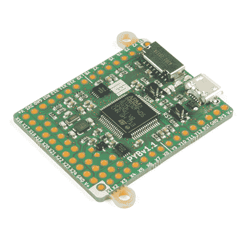](https://www.sparkfun.com/products/retired/14412) 

### [MicroPython py board v 1.1](https://www.sparkfun.com/products/retired/14412)

[Retired](https://learn.sparkfun.com/static/bubbles/ "Retired") DEV-14412

pyboard 是一个运行 MicroPython 的紧凑而强大的电子开发板。它通过 USB 连接到你的电脑，g…

4 **Retired**[Favorited Favorite](# "Add to favorites") 8[Wish List](# "Add to wish list")[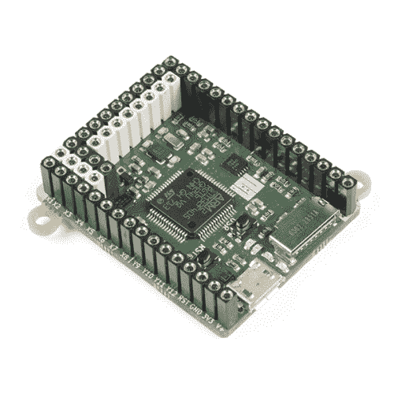](https://www.sparkfun.com/products/retired/14413) 

### [](https://www.sparkfun.com/products/retired/14413)

[Retired](https://learn.sparkfun.com/static/bubbles/ "Retired") DEV-14413

pyboard 是一个运行 MicroPython 的紧凑而强大的电子开发板。它通过 USB 连接到你的电脑，g…

8 **Retired**[Favorited Favorite](# "Add to favorites") 15[Wish List](# "Add to wish list")

### 所需材料

*   一台电脑
    *   Windows(XP，Vista，7，8，8.1) **不是 Windows 10**
    *   麦克·OS X
    *   Linux 操作系统
*   A [Micro-B USB 线](https://www.sparkfun.com/products/10215)
*   您最喜欢的文本编辑器
    *   [记事本++](https://notepad-plus-plus.org/)
    *   [空闲](https://www.python.org/downloads/)
    *   [括号](http://brackets.io/)
    *   [Vim](https://vim.sourceforge.io/)

sudo apt-get update

```
<div class="well well-sm"> sudo apt-get install vim</div>
* [Gedit](https://help.gnome.org/users/gedit/stable/)
<div class="well well-sm"> sudo apt-get install gedit</div> 
```

*   你最喜欢的串行终端
    *   [腻子](https://www.chiark.greenend.org.uk/~sgtatham/putty/latest.html)

### 建议阅读和查看

*   [串行终端基础知识](https://learn.sparkfun.com/tutorials/terminal-basics/all)
*   [MicroPython](https://micropython.org/)
*   [Pyboard 文档](http://docs.micropython.org/en/latest/pyboard/)

下面是 MicroPython 提供的关于 pyboard 入门的视频教程:

[https://www.youtube.com/embed/5LbgyDmRu9s/?autohide=1&border=0&wmode=opaque&enablejsapi=1](https://www.youtube.com/embed/5LbgyDmRu9s/?autohide=1&border=0&wmode=opaque&enablejsapi=1)

## 硬件概述

[Pyboard](https://store.micropython.org/static/store/img/products/PYBv1_1-E.jpg) 满载硬件功能:

*   [STM32F405RG](http://www.st.com/en/microcontrollers/stm32f405rg.html) 微控制器
*   带硬件浮点的 168 MHz Cortex M4 CPU
*   1024 千字节闪存 ROM 和 192 千字节 RAM
*   用于电源和串行通信的微型 USB 连接器
*   微型 SD 卡插槽，支持标准和高容量 SD 卡
*   三轴加速度计( [MMA7660](http://www.freescale.com.cn/files/sensors/doc/data_sheet/mma7660fc.pdf?fpsp=1) )
*   带可选备用电池的实时时钟
*   31 GPIO
*   3 个 12 位模数转换器，16 个引脚，4 个带模拟接地屏蔽
*   2x 12 位数模(DAC)转换器，通过引脚 X5 和 X6 提供
*   4 个发光二极管
*   1 个复位和 1 个用户开关
*   板载 **3.3V** LDO 稳压器，能够提供高达 250mA 的电压，输入电压范围 **3.6V 至 16V**
*   ROM 中的 DFU 引导程序便于固件升级

使用`pyb`模块的内置类轻松控制以下外设:

*   物理输出核心
*   精力
*   I ² C
*   数（字）－模（拟）转换器
*   SD 卡存储
*   通用非同步收发传输器(Universal Asynchronous Receiver/Transmitter)

[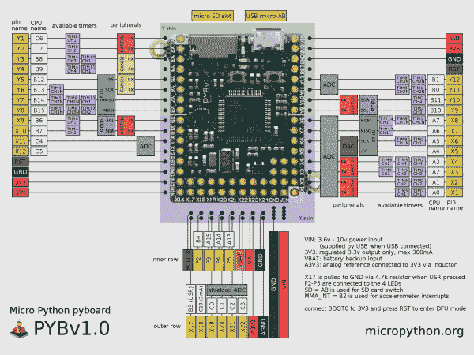](https://cdn.sparkfun.com/assets/learn_tutorials/6/9/7/pybv10-pinout.jpg)*Click the image for a closer look. Image courtesy of [micropython.org](https://micropython.org/)*

### 发光二极管

pyboard 有四个 led。我们将使用 REPL 来交互式地确定这些发光二极管是如何编号的以及它们是什么颜色。led 也是板当前状态的指示器。以下是您可能会看到的一些示例:

*   红色和绿色 led 交替闪烁: *main.py* 有错误使用 REPL 调试
*   所有四个 led 循环开关:您必须执行电路板的[硬复位](http://docs.micropython.org/en/latest/pyboard/pyboard/tutorial/reset.html)。
*   只有红色 LED 亮起:您可能只是试图将 *main.py* 保存到驱动器。在红色指示灯熄灭之前，不要弹出闪存驱动器！

[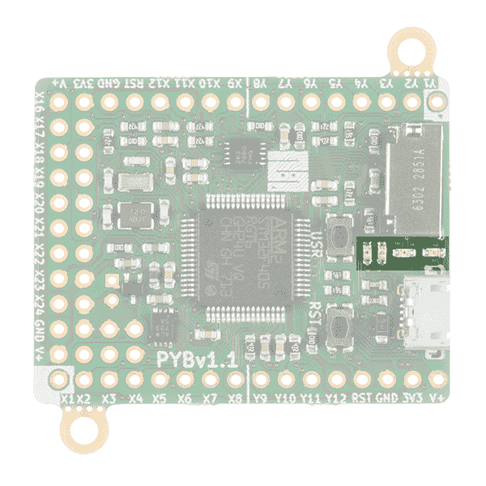](https://cdn.sparkfun.com/assets/learn_tutorials/6/9/7/LEDs.jpg)

### 开关

有两个开关，一个标有“USR”用于用户，另一个标有“RST”用于重置。Micropython 在该板上非常容易处理开关输入，我们将使用 USR 开关来证明这一点。[开关类](http://docs.micropython.org/en/latest/pyboard/library/pyb.Switch.html)有三种方法，允许您获取开关状态或在开关状态发生变化时进行注册。

[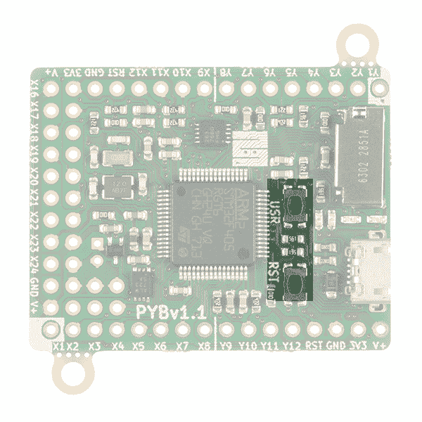](https://cdn.sparkfun.com/assets/learn_tutorials/6/9/7/switches.jpg)

### 微型插座

pyboard 上有一个驱动叫做 */flash* 。当插入 microSD 卡时，该驱动器成为可用的 */sd* 。

[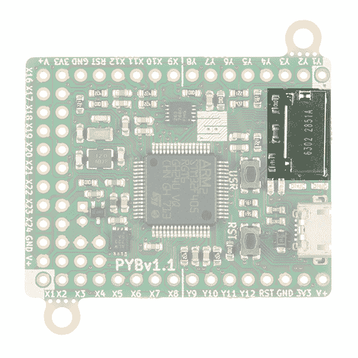](https://cdn.sparkfun.com/assets/learn_tutorials/6/9/7/SDCard.jpg)

### 加速计

pyboard 有一个[加速度计-MMA766FC](http://www.freescale.com.cn/files/sensors/doc/data_sheet/mma7660fc.pdf?fpsp=1) ，可以用来检测板的角度和运动。`pyb`模块的[加速类](http://docs.micropython.org/en/latest/pyboard/library/pyb.Accel.html)有五个方法，允许你获取 x，y，z 轴信息，访问倾斜寄存器，以及一个 x，y，z 值的三元组。

[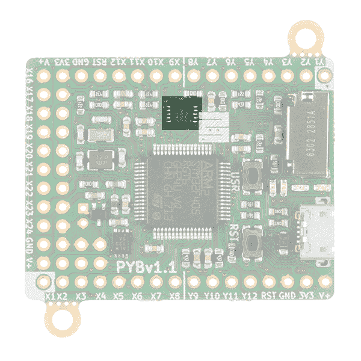](https://cdn.sparkfun.com/assets/learn_tutorials/6/9/7/accel.jpg)

## py board MicroPython 入门

您可以通过两种方式控制您的 pyboard:

*   一个是在您喜欢的文本编辑器中加载 Python 脚本，编辑 *main.py* ，并通过 pyboard 驱动器保存它。
*   或者通过串行终端使用 REPL(注:要使用 REPL，您需要安装驱动程序。根据您的系统，安装会有所不同。)

有关这些方法的更多信息，请查看以下部分！

## MicroPython 编程示例

pyboard 的一个很酷的特性是，您可以在任何文本编辑器中编写 Python 脚本，并将文件直接保存到 pyboard 驱动器中。不需要 IDE！让我们探索 pyboard，控制一些外设，做一些实验。

### 继续带领前进

让我们从一些代码开始。我们将一个接一个地打开所有的机载 LEDS，找出哪个是哪个。

使用 USB 电缆将 pyboard 连接到计算机的 COM 端口。导航到名为“PYBFLASH”的驱动器。在您选择的文本编辑器中打开 *main.py* 。打开后，您应该会看到:

```
language:python
# main.py -- put your code here! 
```

让我们打开 LED 1，记下它的颜色和位置。

```
language:python
# main.py -- put your code here!

import pyb
pyb.LED(1).on() 
```

将文件保存到驱动器-不要更改名称。要运行脚本，您必须首先重置电路板。建议您*首先通过从计算机中弹出驱动器来安全移除硬件*，然后按下 **RST** 按钮。哪个 LED 亮起，是什么颜色？

**Note:** If you do not follow these steps to safely remove the hardware from your computer, it will become corrupt and a [hard reset](http://docs.micropython.org/en/latest/pyboard/pyboard/tutorial/reset.html) will be mandatory.

现在，将相同的代码再运行三次，但要更改 LED 后面括号内的数字。

### 切换 led

在本例中，我们将切换每个板载 led！转到 PYBFLASH 并在文本编辑器中打开 *main.py* 。复制下面的代码。

```
language:python
# main.py -- put your code here!
# This code has been adapted from http://docs.micropython.org/en/latest/pyboard/pyboard/tutorial/leds.html

import pyb

#create an leds array with 4 LED objects
leds = [pyb.LED(i) for i in range(1,5)]

#turn off all 4 LEDs
for l in leds:
    l.off()

n = 3

#try and finally - https://docs.python.org/2.5/whatsnew/pep-341.html
try:
    while True:
        #get the remainders 1-4 by using modulus function
        #Use 0-3 to toggle each LED on and off - note that
        #leds[0] is the same as pyb.LED(1)
        n = (n + 1) % 4
        leds[n].toggle()
        pyb.delay(500)
finally:
    for l in leds:
        l.off() 
```

将 *main.py* 保存在 PYBFLASH 驱动器中。程序加载时，红色 LED 将亮起。LED 熄灭后，弹出闪光灯，然后按下 **RST** 按钮。您的程序现在将执行。这是加载新脚本的过程。

**Note on Indentation:** In Python, indentation matters for the code blocks. Make sure that the indentation is formatted correctly for each code blocks or the script will not function as expected. The number of spaces used for each indentation can vary for each code block but you must make sure that each block of code has the same amount.

### PWM 和 LED 4:蓝色的是特殊的

LED 4 是靠近白板边缘的蓝色 LED。该 LED 可以通过 PWM 控制。在`pyb`模块 LED 类中，有一种方法叫做*强度*。当被调用时，它看起来像是`pyb.LED.intensity([value])`，其中`value`是一个介于 0-255 之间的数字。

在本例中，我们将更改 LED 的亮度。转到 PYBFLASH 并在文本编辑器中打开 main.py。复制下面的代码。

```
language:python
# main.py -- put your code here!
# This script has been adapted from 
# http://docs.micropython.org/en/latest/pyboard/pyboard/tutorial/leds.html

import pyb

led = pyb.LED(4)
#start the LED  intensity value with 0.
intensity = 254
try:
    while True:
        intensity = (intensity + 1) % 255
        led.intensity(intensity)
        #show the effect quickly with a shorter delay
        pyb.delay(15)
finally:
    # once 255 is reached turn off the LED
    pyb.LED(4).off() 
```

### 连接伺服系统

有四个专用的 3 针接头，标记为 X1、X2、X3 和 X4。你可以驱动多达四个业余伺服电机。该行顶部是 GND，中间是 VCC，底部是 4 条 PWM 信号线。一旦你连接了一个伺服系统，我们可以看看在[伺服类](http://docs.micropython.org/en/latest/pyboard/library/pyb.Servo.html)中我们能做什么。

[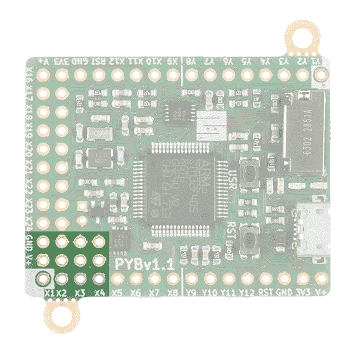](https://cdn.sparkfun.com/assets/learn_tutorials/6/9/7/servopos.jpg)

对于这个例子，我们将使用一个[通用亚微型业余爱好伺服](https://www.sparkfun.com/products/9065)和一些[跳线与引脚](https://www.sparkfun.com/search/results?term=jumper+wire)。假设接头[焊接](https://learn.sparkfun.com/tutorials/how-to-solder-through-hole-soldering)在电路板上，将伺服连接到各自的引脚。

| pyboard
 | 通用亚微伺服
 |
| GND | GND(黑色) |
| V+ | Vcc(红色) |
| X1 | 控制信号(白色) |

使用下面的代码按照步骤再次加载 python 脚本。

```
language:python
# main.py -- put your code here!
# This script has been adapted from 
# http://docs.micropython.org/en/latest/pyboard/library/pyb.Servo.html

import pyb
#Create a Servo object at position X1
#if you connected the servo to X2, X3 or X4
#use the corresponding number in your servo object
myServo = pyb.Servo(1) 
myServo.angle(0)
#Sweep the angle of the servo to 90 degrees taking 1250ms
myServo.angle(90, 1250) 
```

一旦脚本被加载，连接到引脚 X1 的伺服将在两个位置之间扫描并停止。

## 使用 REPL

控制 pyboard 的另一种方法是使用 REPL。REPL 代表阅读评估打印循环。这是一个来自串行终端的交互式命令提示符，允许访问您的 pyboard。这是一种迭代编写和测试代码的简单方法。一旦你敲定了你的代码，你可以把它复制到 *main.py* 中，不用电脑也能运行。在我们能够使用 REPL 之前，我们必须为您的操作系统安装驱动程序。

### windows installer

这个过程在装有 Windows 7 的电脑上效果最好。不幸的是，似乎还没有对 Windows 10 的支持。

要安装这个驱动程序，你需要进入你的计算机的设备管理器，在端口列表中找到 pyboard USB(它旁边应该有一个警告标志，因为它还没有工作)，右键单击设备，选择属性，然后安装驱动程序。然后，您需要选择手动查找驱动程序的选项(不要使用 Windows 自动更新)，导航到 pyboard 的 USB 驱动器，并选择它。然后它应该会安装。

安装后，回到设备管理器找到安装的 pyboard，并查看它是哪个 COM 端口(如 COM3)。更全面的说明可以在 Windows 上 pyboard 的[指南中找到。如果您在安装驱动程序时遇到问题，请参考本指南。](http://micropython.org/resources/Micro-Python-Windows-setup.pdf)

### 麦克·OS X

只需打开一个终端并运行:

```
minicom /dev/tty.usbmodem* 
```

完成后，键入“CTRL -A CTRL-”退出。

### Linux 操作系统

打开一个终端并运行:screen /dev/ttyACM0

结尾处的 0 可能需要更新为 1 或更高版本，并且您可能需要正确的权限才能访问此设备。所以试试`Sudo`。

### 通过串行终端的 REPL

现在您已经安装了驱动程序，我们可以开始在交互式[串行终端](https://learn.sparkfun.com/tutorials/terminal-basics/all)中使用 pyboard 了。在本例中，我们将在 Windows 操作系统上使用 Putty。要将 pyboard 连接到正确的端口，请打开设备管理器并在“端口”下查找。

[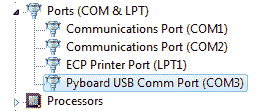](https://cdn.sparkfun.com/assets/learn_tutorials/6/9/7/port.PNG)

打开您喜欢的串行终端并配置连接设置。确保在“串行线”上指定了正确的端口。

[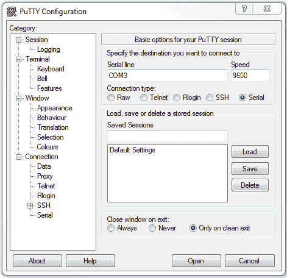](https://cdn.sparkfun.com/assets/learn_tutorials/6/9/7/term.PNG)

配置完 Putty 后，单击 Open 按钮。

[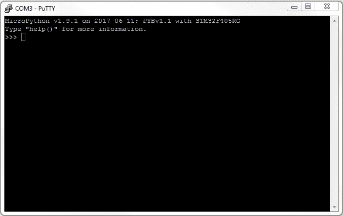](https://cdn.sparkfun.com/assets/learn_tutorials/6/9/7/serialTerm.PNG)

作为良好的第一步，让我们探索帮助()菜单。在串行终端中键入命令，然后按 enter 键。

[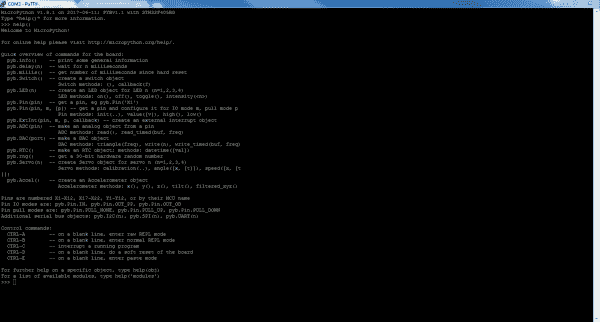](https://cdn.sparkfun.com/assets/learn_tutorials/6/9/7/help.PNG)*Click the image for a closer look.*

让我们从这里探索一些事情。

### 摆弄板载 led。

在您的终端中键入:

> > > pyb 发光二极管(1)。上()

> > > pyb 发光二极管(2)。上()

> > > pyb 发光二极管(3)。上()

> > > pyb 发光二极管(4)。上()

当您在终端中输入新的一行时，您会看到每个 LED 都打开。

### USR 开关

switch 类使得获取开关状态变得容易。从终端:

>>>my switch = pyb。开关()

>>>my switch

>>>my switch()

如果您没有按下 USR 开关，您应该 *false* ，如果您在调用该功能时按下了该开关，您应该 *true* 。

### 加速计

加速度计 y，y，z 方法返回一个介于-30 和 30 之间的有符号数。这里我们可以调用一些方法来获取加速度计的值。

> > > accel = pyb。加速()

>>>Accel . x()

将返回相应的 x 值。

>>>【Accel . y】

将返回相应的 y 值。

>>>Accel . z()

将返回相应的 z 值。

>>>【Accel . filtered _ XYZ()

这将返回逗号分隔的 x、y 和 z 值的列表。

## 资源和更进一步

现在您已经成功地建立并运行了 pyboard，是时候将它合并到您自己的项目中了！

有关更多信息，请查看以下资源:

*   [Pyboard 数据表](http://docs.micropython.org/en/latest/pyboard/pyboard/general.html#datasheets-for-the-components-on-the-pyboard) -关于 Pyboard 上的组件。
*   [MicroPython 文档](http://docs.micropython.org/en/latest/pyboard/)
*   [MicroPython 库](http://docs.micropython.org/en/latest/pyboard/library/index.html)
*   [Pyboard 快速参考指南](http://docs.micropython.org/en/latest/pyboard/pyboard/quickref.html#pins-and-gpio) - *超级有用*
*   皮肤 -类似 Arduino 盾牌，但用于 pyboard。
*   [Pyboard 和 MicroPython 示例](http://www.rkblog.rk.edu.pl/w/p/pyboard-and-micropython-examples-scripting-electronics-python/)
*   [MicroPython 论坛](https://forum.micropython.org/)