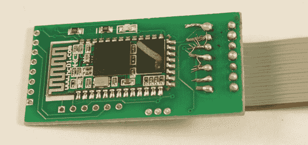

# 气泵撇油器

> 原文：<https://learn.sparkfun.com/tutorials/gas-pump-skimmers>

## 介绍

你首先应该害怕的是什么？有三个。下一个呢？标签“46”。他们在战场上有如此多的人，罪犯需要对他们进行编号以便跟踪。

[](https://cdn.sparkfun.com/assets/learn_tutorials/6/9/4/Skimmers-Main.jpg)

这不是第一次或第二次[spark fun 与信用卡套现者打交道。不同的是，这一次当地政府机构礼貌地寻求帮助，我们总是试图阻止坏演员。](https://www.sparkfun.com/news/836)

[](https://cdn.sparkfun.com/assets/learn_tutorials/6/9/4/Skimmer-IC_labels.jpg)

我们得到了三个安装在油泵内的撇油器，要求我们尝试从板上获取数据，以便代理可以让那些信用卡受损的人知道，这样他们就可以获得新卡。不是很好，但这是个开始。第二个任务:我们能否建立一个夹具或系统，以便他们在未来可以更容易地戳这些系统？我们能够完成这两项任务，并开发一个应用程序来检测该地区已知的撇油器。

现在，对于那些不想通读细节的人来说，这里是 SparkX“Skimmer Scanner”应用程序如何工作的概述^([【1】](https://learn.sparkfun.com/tutorials/gas-pump-skimmers/introduction#support)):

1.  这些撇油器很便宜，在北美变得越来越普遍，越来越令人讨厌。

2.  该 skimmer 通过蓝牙作为 **HC-05** 进行广播，密码为 1234。如果你碰巧在一个加油站，碰巧扫描蓝牙设备，碰巧看到一个 **HC-05** 被列为可用连接，那么你可能不想使用那个泵。

3.  这些撇油器上使用的蓝牙模块非常普遍，用于各种合法产品和教育工具包。如果您在现场检测到一个，您可以通过终端向模块发送字符“P”来确认它是一个撇除器(而不是其他设备)。如果你得到一个 M，那么你很可能找到了一个 skimmer，你应该联系你的当地政府。

### 浏览扫描仪应用程序如何工作

[](https://cdn.sparkfun.com/assets/learn_tutorials/6/9/4/Skimmer-Scanner_1.jpg)*The Skimmer Scanner App*

Skimmer Scanner 是一个免费的开源应用程序，可以检测常见的基于蓝牙的信用卡套现工具，主要出现在加油站。该应用扫描可用的蓝牙连接，寻找标题为 **HC-05** 的设备。如果找到，应用程序将尝试使用默认密码 1234 进行连接。一旦连接，字母“P”将被发送。如果响应为“M ”,那么很有可能在您手机的蓝牙范围内(5 到 15 英尺)有一个 skimmer。

Skimmer 扫描仪是免费的，开源的，适用于 Android^([【1】](https://learn.sparkfun.com/tutorials/gas-pump-skimmers/introduction#support))。应用程序*不会从给定的清污机获取或下载数据，也不会向地方当局报告任何信息。*

[GitHub Skimmer Scanner Source](https://github.com/sparkfunX/Skimmer_Scanner)

如果你在野外发现一个，请告诉我们！我们很想听听。

### 做点什么吧

这些撇油器是最可怕的，因为没有人被追究责任或承担预防任务。如果您的信用卡号码被盗，您只需联系提供商，他们将(通常)退还任何欺诈性费用，并向您发送一张新卡。反过来，信用卡公司只需向发生欺诈性收费的商家收取费用(从商家处取钱，并退还给卡被盗的客户)。加油站很少在油泵上安装警报器或指示器，所以不清楚他们是否知道油泵已经被打开。并且燃料泵制造商没有动力在泵上安装数字或声音警报器。(那要花钱。)

读者安东尼·大卫·亚当斯告诉我们在这种情况下谁会真正受到指控。你可以在这里阅读他的回应[。](https://medium.com/@anthonydavidadams/credit-card-skimmers-sparkfun-8ea3b7340a17)

你的卡又被偷了，你生气吗？联系你当地的国会议员或参议员，要求他们通过立法，对加油站罚款 100 美元，每发现一张卡就罚一张。最终要靠加油站和油泵制造商来保护他们的油泵。

**[[1]](#support) Note:** Unfortunately, Google delisted us from the Google Play store because the app no longer supports the latest and greatest cell phones. The source code is open source so we encourage anyone to pick it up and dust it off!

## 气泵撇油器如何工作

[](https://cdn.sparkfun.com/assets/learn_tutorials/6/9/4/Gas_Pump_External.jpg)*Front of a US Fuel Pump complete with extremely difficult to source [security seal](https://www.ebay.com/sch/i.html?_odkw=security+seal+tape&_osacat=0&_from=R40&_nkw=security+seals&_sacat=0)*

基本上，犯罪者使用几把万能钥匙中的一把打开泵，从主泵控制器上拔下信用卡读卡器，将读卡器插入套卡机，并将套卡机插回泵控制器。据报道，这需要不到 30 秒。

撇油器基本上是一个中间攻击的人。分离器监听来自信用卡读卡器的所有串行流量(9600bps 的明文)，将其记录到外部存储器(本例中为闪存)，然后将相同的串行流量传递到泵控制器。当你使用其中一个改良过的泵时，泵控制器会向你的卡收费，你并不知道，但是你的信用卡信息会存储在内存中。

[](https://cdn.sparkfun.com/assets/learn_tutorials/6/9/4/gas-station.jpg)

几小时或几天后，犯罪者回到加油站，通过蓝牙连接到受损的泵。一旦连接上，skimmer 会将 EEPROM 中的内容(所有最近的信用卡号码)通过无线方式发送到犯罪者的手机或笔记本电脑上，并记录下来。

## 撇渣器设计

让我们深入了解这些撇油器是如何设计的...

[](https://cdn.sparkfun.com/assets/learn_tutorials/6/9/4/Skimmer-Top_Comparison.jpg)

这种撇油器似乎很常见。快速[图片搜索](https://www.google.com/search?q=bluetooth+pump+skimmer&tbm=isch)显示这款车型遍布北美。

设置非常简单，但有一些奇怪的设计选择。PIC18F4550 微控制器通过串行与蓝牙模块通信，并与 SPI 闪存对话。PIC 将来自信用卡读卡器的信号(串行字符)记录到 SPI EEPROM 中。当手机或平板电脑连接到蓝牙模块时，会创建一个串行连接(称为串行端口配置文件或 SPP)。手机发送的任何序列字符都被发送到 PIC。例如，当字符“？”从我们支持蓝牙的平板电脑发送到撇除器，撇除器会回复字符“1”。

### 撇油器前面

[](https://cdn.sparkfun.com/assets/learn_tutorials/6/9/4/Components_v1.png)*Front of the Skimmer*

板的前端由一个 [PIC18F4550 微控制器](http://ww1.microchip.com/downloads/en/devicedoc/39632c.pdf)、一个 [M2P16 SPI EEPROM](https://cdn.sparkfun.com/assets/learn_tutorials/6/9/4/M25P16.pdf) 和一个标准的 LM1117 3.3V 调节器组成。

[](https://cdn.sparkfun.com/assets/learn_tutorials/6/9/4/Skimmer-Diagram.v1.jpg)*Various pins toned out with assumed use. (If any of these pictures are too small to see, click on them to enlarge.)*

进入一些具体的细节:

*   R1 和 R2 在需要时(R2 无人居住)会充当分压器，降低来自信用卡读卡器的信号电压。我假设读取器输出 12V 信号，R1 (1.5K)在那里限制进入接收引脚的电流，从而保护 PIC 免受损坏。

[](https://cdn.sparkfun.com/assets/learn_tutorials/6/9/4/Skimmer-Diagram.R1R2.png)

*   图片顶部显示了三个串行引脚。从左至右:GND，RX，TX。这些似乎是到 PIC 的简单串行连接。可能用于引导加载新固件。这些引脚连接到蓝牙模块的 RX 和 TX 引脚(分别),非常容易连接逻辑分析仪来嗅探串行流量。(感谢 skimmer 设计师！)

[](https://cdn.sparkfun.com/assets/learn_tutorials/6/9/4/Skimmer-Diagram.D5.png)

*   电压调节器在大封装中非常常见，在给定各种输入电压的情况下(可能)能够承受变热(将 12V 下调至 3.3V 可能会产生一点热量)

*   D5 是一个有地位的领导者。

*   J4 是超级常见的 PIC ICSP(电路串行编程)头。它用于将固件安装到 PIC18F4550 上。

[](https://cdn.sparkfun.com/assets/learn_tutorials/6/9/4/Skimmer-Diagram.J4.png)

*   C1 和 C7 正在加载 8MHz 晶体的电容。这是有意义的，因为大多数 PIC18F 系列不能在 3.3V 下运行超过 10MHz。

[](https://cdn.sparkfun.com/assets/learn_tutorials/6/9/4/Skimmer-Diagram.C1C7.png)

*   C2 看起来像一个 0.1uF 的去耦电容。

[](https://cdn.sparkfun.com/assets/learn_tutorials/6/9/4/Skimmer-Diagram.C2.png)

*   R15 是复位(MCLR)线上的 10k 上拉电阻

[](https://cdn.sparkfun.com/assets/learn_tutorials/6/9/4/Skimmer-Diagram.R15.png)

*   C13 是 RA4/T0CKI/C1OUT/RCV 的大盘股。这可以是数字 I/O、定时器 0 外部时钟输入、比较器 1 输出或外部 USB 收发器 RCV 输入。这些都没有明确的理由与一个大的去耦电容相联系。此引脚不连接到电路的任何其它部分。

[](https://cdn.sparkfun.com/assets/learn_tutorials/6/9/4/Skimmer-Diagram.C13.png)

与信用卡读卡器的主要连接是通过标有“1”到“7”的连接，如右侧所示，安装了灰色电缆。

[](https://cdn.sparkfun.com/assets/learn_tutorials/6/9/4/Skimmer-Diagram.mainreader.png)

不清楚第二个连接器(上图左侧所示)的用途。这种连接可用于各种不同的用途，因为 PIC 上断开的引脚可用作输入或输出。我的猜测是，这是到键盘的连接，以便当泵具有正确的型号或兼容的键盘时，套卡机可以记录 pin 码(用于借记卡)。

[](https://cdn.sparkfun.com/assets/learn_tutorials/6/9/4/Skimmer-Diagram.left.png)

### 撇油器后部

**Note:** The HC-05 and the HC-06 have the exact same hardware, and only differ in their firmware. The HC-05 can be programmed as master or slave, whereas the HC-06 is slave only. Both are mentioned in this article.[](https://cdn.sparkfun.com/assets/learn_tutorials/6/9/4/Skimmer-RearPinOut.v1.png)*Various pins toned out with assumed use*

这些模块使用一种非常常见的蓝牙模块，称为 HC-06。这些大约每台 3 美元，数量上可能更便宜。蓝牙已经变得惊人的便宜！

[](https://cdn.sparkfun.com/assets/learn_tutorials/6/9/4/HC-06-Module.jpg)*The HC-06 module from [www.hc01.com](http://www.hc01.com/)*

更多关于蓝牙模块的信息请见下文。

### 构建质量

有趣的是，在给我们的三个单元中，我们发现了三个组装等级:优秀、良好和垃圾。

[](https://cdn.sparkfun.com/assets/learn_tutorials/6/9/4/Skimmer-Top_Comparison.jpg)*These units look well built*

三个单元的主 PCB 组件看起来质量相当高。撇渣器的前侧(包含 PIC 微控制器)已经使用焊膏、模板和回流按照标准 SMD 实践进行了组装。从鱼片的质量来看，它看起来像是大规模生产的。

[](https://cdn.sparkfun.com/assets/learn_tutorials/6/9/4/Skimmer-RearPinOut.v1.png)*Decently soldered Bluetooth module*

背面的蓝牙模块和各种组件看起来是手工焊接的，但由知道如何使用焊剂和如何焊接的人完成。蓝牙模块最有可能是手工焊接的，以降低整体制造成本(基本上是模板和第二面回流的两倍成本)。

[](https://cdn.sparkfun.com/assets/learn_tutorials/6/9/4/Gas_Pump_Skimmer_Bad_Soldering.jpg)*That is some bad assembly right there. The stranded wires are shorting adjacent pins.*

电缆和连接器是由其他人添加的，很可能是犯罪人。真的很糟糕。在两个单元上，导线和焊料的剥离很差，单元可能会由于引脚之间的短路而在现场失效。

[](https://cdn.sparkfun.com/assets/learn_tutorials/6/9/4/Skimmers-Main.jpg)

两个单元有一个 7 针极化连接器，接头被切掉，可能是因为它们不知道泵控制器将插入哪个方向。这要么是非常业余的(他们猜测当他们插入他们的单元时，这是非常漫不经心的，因为它可能会烧坏他们的单元、信用卡读卡器或两者),要么他们发现不同泵内的连接器具有不同(相反)的方向，他们希望建立一个可以快速工作于任一极化的单元。泵控制器市场不太可能倾向于使用相同类型的连接器但使用两种不同方向的相同数量的引脚。所以我猜想，这些单元的制造者没有足够的知识来弄清楚引脚 1 在极化连接器上的位置，而只是求助于猜测和检查:插入它，它能工作吗？没有吗？换个方向。

## 成分

让我们更仔细地看看每个主要组件。

### 微控制器

[](https://cdn.sparkfun.com/assets/learn_tutorials/6/9/4/Skimmers-18F4550_Pinout.jpg)*Pinout of the 18F4550*

大脑是一个运行在 8MHz 和 3.3V 的 pic 18 f 4550。3.3V 调节器有一个去耦电容。一个非常基本的配置，可能可以处理更大的电压，如 12V，而不会太热。

### 电可擦可编程只读存储器

[](https://cdn.sparkfun.com/assets/learn_tutorials/6/9/4/Flash_EEPROM_Connections.jpg)*Pinout and PIC connections to the 25P16VP. The labels to the edges indicate how the IC is found wired in circuit. For example Q is wired to MISO/A5 on the PIC.*

标有 25P16VP 的 IC 好像是 ST/Micron 的 NOR 闪存，完整的 part# M25P16。奇怪的是，这款器件即将停产(EOL)。此处的停产通知[为](https://media.digikey.com/pdf/PCNs/Micron/PCN_32163.pdf)日期为 2016 年 12 月，最后一次发货日期为 2021 年。也许他们使用这种部件是因为它非常普遍和/或非常便宜。EEPROM VCC 为 3.3V，这也是电路板(以及 3.3V 蓝牙模块)以 3.3V 运行的原因。

### 蓝牙

[](https://cdn.sparkfun.com/assets/learn_tutorials/6/9/4/Bluetooth_Pinout.jpg)*Recommended pinout for the HC-06*

以上是推荐的模块接线，显示了各种引脚连接。调整到模块的连接，一切都是相当标准和预期的。撇油器上的 PIO11 奇怪地与 GND 和 10K 联系在一起。PIO8 上有一个 LED。这里有一个 HC-01 公司所有各种蓝牙模块版本的[详细分类](http://wiki.pinguino.cc/index.php/SPP_Bluetooth_Modules#HC-06.2FLinvor_v1.4.2Fv1.5_firmware_versions)。

通过无线方式查询模块，我们发现蓝牙模块具有所有的默认设置。撇渣器的设计者从不花时间修改设置:

*   波特率= 9600
*   连接密码= 1234
*   不需要 nl/cr 行尾
*   AT 命令必须是大写的
*   固件版本= hc01.comV2.0
*   名称= HC-06
*   无奇偶校验
*   从属模式

你明白了吗？我们发现的三种设备都有默认设置。这意味着几件事:

1.  该模块将其 ID 广播为 HC-06，因此我们可以轻松地检测到它们
2.  密码是 1234，所以我们可以很容易地连接到他们

敏锐的读者看到了我们前进的方向...

最初这让我大吃一惊。如果我要设计一个蓝牙 skimmer，我会将模块编程为不广播其 ID，我会将 ID 更改为只有我知道的值，并将密码从 1234(标头)更改为其他值。然后，我会创建一个应用程序，它知道我的各种蓝牙 id 的 id，并私下连接到它们(不公开广播它们的 id)。但是有几件事让我震惊:

*   这些设备很便宜。BOM(物料清单)少于 4 美元。这使得这款设备的估计零售价为 10 美元。
*   虽然 SMD 的制造质量是专业的，但色带(连接到信用卡读卡器的灰色电缆)的焊接非常糟糕，表明犯罪者对焊接没有什么经验，可能对电子产品毫无经验。

几年前，需要有知识和技能的人来创建一个信用卡提款机。现在，犯罪分子在缺乏知识的情况下从货架上购买这些产品，然后将它们拼凑在一起。这是基本的用户设计理论:当你的客户不太聪明时，让它看起来很白痴，这样他们就不会联系你寻求支持。这个 skimmer 的设计者很聪明，最好是让这些设备易于连接，而不是增加一层安全性。最坏的情况会是什么？检测到设备并将其从泵中移除。同时，又部署了 10 个，总费用为 100 美元。

## 设备的特性

我们用 USB 的 5V 电源给撇油器供电。通电时，主状态 LED 闪烁 3 次。通电但未连接时，蓝牙指示灯以 4Hz 的频率快速闪烁。

在电脑上用蓝牙连接到撇油器很简单。我们使用默认密码 1234，并注意到蓝牙 LED 以 2Hz 的频率闪烁，然后在连接时关闭 2 秒钟。

在我们的设置中，COM-6 是蓝牙 SPP，一旦我们连接上它就可用了。发送**？使其以 9600bps 的速率响应 **1** 。**

### 已知命令

以下是我们通过用各种串锤敲打撇油器收集到的信息。

*   用灰色电缆上的 5V 至 12V 电源(或 VCC 上的 3.3V 电源)给撇渣器供电
*   使用笔记本电脑连接到密码为 1234 的 **HC-06**
*   以 9600bps 的速度打开终端程序
*   '?'是查看模块是否响应的好方法。(数字本身不会做任何事情。)
*   小写字母不起任何作用

**已识别命令:**

*   **？** -返回 1
*   **P** -返回 M
*   **D** -等待 6 个字符，然后存储它们。最初是“123456”，我们认为这是设备 ID 或密码。但是，更改此设置似乎没有效果。
*   **C** -显示基于 D 存储的 6 个字符
*   **@** -查找内存位置。在@后面加上两个二进制字符，返回存储在内存中的信用卡详细信息。例如，@[00][01] (shift+2，Ctrl+shift+2，Ctrl+a)返回存储在 EEPROM 中的第 2 个字节。关于如何从键盘组合发送二进制字符的信息，参见 [ascii 表](http://www.physics.udel.edu/~watson/scen103/ascii.html)。
*   等待一个角色，然后什么都不做
*   **E** -使串口停止响应串口命令。BT 仍然打开/连接。重启设备使其恢复响应。这可能被用来在现场解除一个装置。
*   **~** -擦除所有 SPI 闪存。这就是如何删除所有信用卡号码的方法。装置闪烁状态 LED 约 20 秒(EEPROM 需要时间擦除)。在擦除 EEPROM(使用串行中断和缓冲器)期间，该单元将缓冲任何输入的串行字符。

一条浏览过的信用卡记录如下所示(我们已经修改了卡号):

```
T1 %B374328830305879^YOU/A GIFT FOR            ^20042221330999242?
T2 ;374328830305879=200912211090924100000? 
```

这看起来像是我们期望从[串行读卡器](https://www.sparkfun.com/products/11096)中得到的串行数据的直接拷贝。 **T1** 表示轨道 1 数据， **T2** 表示轨道 2 数据，以此类推。这些记录以明文形式存储在 EEPROM 中(记住，要让用户看起来很傻)。好像有人用礼品卡买了汽油。请注意，该记录有 113 个字符。假设一个记录是 256 字节。有了 16 兆位的闪存，也就是 2MB 或大约 7，800 条信用卡记录可以存储在一个设备上。(哎呀。)

在给我们的设备上，我们发现每台设备平均有 24 条记录。这似乎很低。我不确定这些设备在哪里，但预计每天至少有 24 个信用卡用户。这可能表明犯罪者每天定期访问水泵并收集记录。

### 从 Skimmer 获取数据

我们不会提供一个从设备中提取数据的示例应用程序。如果你足够聪明，能够根据本教程中提供的信息开发一个应用程序，你很可能会利用你的疯狂技能为善而非为恶赚更多的钱。

如果你是执法人员，你应该能接触到这个设备。有几种方法可以从 EEPROM 中获取数据。

首先，你需要一个 EEPROM 阅读器。我们喜欢使用亚马逊便宜的 SPI 编程器。用于 Windows 的软件有点难找到。我们运气最好，从 [Tosiek Zanakow 的](https://tosiek.pl/ch341-eeprom-and-spi-flash-programmer/)网站上获得了 1.29 版本。我们也在这里托管了软件[的副本。使用风险自担。](https://cdn.sparkfun.com/assets/learn_tutorials/6/9/4/CH341A-programmer-software-1.29.zip)

接下来，您需要将编程器连接到 EEPROM。有两种方法:使用 SOIC 夹或热风移除 EEPROM。SOIC 夹是破坏性最小的方法，但需要技巧和耐心。热风返工更可靠，但需要从电路板上移除 IC，并且可能产生证据来源问题。

#### SOIC 剪辑法

[](https://cdn.sparkfun.com/assets/learn_tutorials/6/9/4/SOIC_Clip_Memory_Dumping.jpg)*Downward pressure is applied to hold yellow wire against MCLR/GND. At the same time the SOIC clip is held carefully in place. It's tricky.*

我们使用 [SOIC 测试夹](https://www.sparkfun.com/products/13153)与 SPI EEPROM 进行临时电气连接。 [12 "母到母跳线](https://www.sparkfun.com/products/9389)将 SOIC 夹连接到 EEPROM 读取器。母跳线与 CH341A EEPROM 编程器上的 6 个 SPI 引脚连接良好。只需要 6 根线；写保护和保持引脚可以悬空。我们从软件中选择 ES25P16 通过 SPI 读取 IC。

你需要做的最后一件事是将 PIC18F4550 复位。这是因为 CH341A 将向撇油器供电。一旦通电，PIC 将启动并尝试与 EEPROM 连接。如果您试图同时通过该片段读取 EEPROM，就会发生总线争用。这是不好的，会妨碍程序员正确读取 EEPROM。

[](https://cdn.sparkfun.com/assets/learn_tutorials/6/9/4/Reset_Pins_on_Skimmer_labeld.jpg)*The reset pin MCLR (master clear) on the PIC is exposed on the programming header*

要使 PIC 复位，你需要握住或焊接一根从 MCLR 到 GND 的线。这将使 PIC 保持复位状态，并允许您从 CH341A 软件中读取 EEPROM 中的二进制文件。将这个二进制文件重命名为*。txt* 扩展名将使信息在普通文本编辑器中可见。

这种方法的问题是 SOIC 夹难以保持在适当的位置。移动之类的东西会导致夹子从 EEPROM 上滑落。连接不是很好，但稍加练习就能实现。

#### 热空气去除

[](https://cdn.sparkfun.com/assets/parts/1/1/0/6/6/13655-04.jpg)*A SOIC IC on a breakout board*

替代方法是使用[热空气](https://www.sparkfun.com/products/10706)从撇渣器上移除 EEPROM，然后将其焊接到 [SOIC 分线板](https://www.sparkfun.com/products/13655)上。将公接头焊接到这个分线板，您将能够从 EEPROM 到 EEPROM 编程器建立牢固的连接，并读取内容。这种方法不需要将 PIC 保持在复位状态(因为 PIC 不再连接到 EEPROM)。

## 固件

我们能够使用一个 [PICKit 3](https://www.sparkfun.com/products/9973) 从 PIC 中取出固件。你可以在这里获得十六进制文件[的副本。所有三块板上的固件都是相同的。固件出奇的小，占了 0x0000 到 0x07F0(约 2000 字节)。我打喷嚏 Arduino 草图比这大。](https://cdn.sparkfun.com/assets/learn_tutorials/6/9/4/Skimmer-Firmware.hex)

**更新:**一些读者指出，设置熔丝位是为了保护和防止固件被读取。解封装和融合清除将是下一步，但目前超出了我们的能力。

一个未知:为什么要用 PIC18F4550？它的功能更强大，使用的闪存比需要的多。你可以用像 ATtiny 这样的小设备或者像 ARM-M0 这样的便宜设备来实现(SAMD11s 太棒了)。也许键盘解码需要额外的引脚。也许 PIC18F4550 在这些设备制造的任何地方成本都非常低。也许这个设备是由某人设计的，但为了降低成本，这个设计再也没有被重新设计过(谁在乎这个 skimmer 上的 BOM 已经不到 5 美元了？).

我不是黑客，我只是在电视上玩一个(很差)。如果你能把十六进制代码反编译成汇编，并且能理解固件的功能，请这样做。我们已经知道了足够多的可以擦除和禁用设备的命令。如果您能够破译额外的功能或有趣的特征，请让我们知道！

## 连续注射

[](https://cdn.sparkfun.com/assets/learn_tutorials/6/9/4/Skimmer-Diagram.v1.jpg)*The pinout of the gray cable have been located but not identified*

连接到信用卡读卡器的灰色电缆的 7 个引脚已被调整为 PIC。我们知道它们去了哪里，但是我们不知道这些大头针做了什么。例如，D3 连接到泵内的信用卡读卡器上的什么？我们希望引脚 D0 成为读卡器的主要数据输入，因为它内置了一个限流电阻(R1)。但是没有真正的气泵，我们只能猜测。

为了识别 7 个 pin 中每一个的用途，我们尝试将 serial 发送到撇油器中，就好像我们是加油站的信用卡读卡器一样。

我们尝试以不同的波特率，用不同的字符串，在不同的引脚上发送 TTL 级串行，希望 skimmer 会盲目地存储这些数据。没有存储任何信用卡记录。也许设备足够智能，可以寻找格式良好的跟踪数据，而我们的测试格式不正确。然而，我们从 EEPROMs 中获得的一些记录看起来像胡言乱语，所以我们倾向于相信 skimmer 只是盲目地记录。

也许该设备期待 RS232 电平信号，而不是 TTL。我们尝试使用一个[磁卡读卡器](https://www.sparkfun.com/products/11096)向设备发送 RS232 信号，但无法让它存储卡数据。磁卡阅读器以 9600bps 输出 RS232，而气泵可能以不同的波特率工作。

最后，我们无法让 skimmer 记录我们的假数据，因此无法确定每个 pin 到泵卡读卡器的用途。这些针的功能并不重要，我们只是好奇。

## 资源和更进一步

我们希望你喜欢阅读这篇深入剖析这些可怕设备的文章。如果您愿意帮助我们，我们很乐意回答以下问题:

1.  这些设备的实际成本是多少？我们还没有搜索到足够远的黑暗网络来找到一个。

2.  撇油器使用什么类型的燃油泵？目前还不清楚这种撇油器是适用于整个油田，还是只适用于某些类型的泵。

3.  检测和预防的其他方法有哪些？我们集思广益，想出了各种各样的事情。最后，令人震惊的是，打开一个加油泵是多么容易。我们能想到的最快的预防方法是把一个 klaxon 连接到一个叶片开关上，当泵打开时，开关就会自动关闭。为所有泵维修人员提供耳朵保护，撇油器的问题就解决了。

下面是整篇文章中提到的一些重要链接。(如果你已经做到这一步，你已经滚动够了...)

*   [Skimmer 扫描仪 App GitHub Repo](https://github.com/sparkfunX/Skimmer_Scanner)^([【1】](https://learn.sparkfun.com/tutorials/gas-pump-skimmers/introduction#support))
*   [中型信用卡套现机& SparkFun](https://medium.com/@anthonydavidadams/credit-card-skimmers-sparkfun-8ea3b7340a17)
*   [HC-05、HC-06 故障](http://wiki.pinguino.cc/index.php/SPP_Bluetooth_Modules#HC-06.2FLinvor_v1.4.2Fv1.5_firmware_versions)
*   [十六进制文件](https://cdn.sparkfun.com/assets/learn_tutorials/6/9/4/Skimmer-Firmware.hex)

如果你喜欢这篇文章，可以考虑看看我们的其他教程:

[](https://learn.sparkfun.com/tutorials/serial-peripheral-interface-spi) [### 串行外设接口(SPI)](https://learn.sparkfun.com/tutorials/serial-peripheral-interface-spi) SPI is commonly used to connect microcontrollers to peripherals such as sensors, shift registers, and SD cards.[Favorited Favorite](# "Add to favorites") 91[](https://learn.sparkfun.com/tutorials/terminal-basics) [### 串行终端基础知识](https://learn.sparkfun.com/tutorials/terminal-basics) This tutorial will show you how to communicate with your serial devices using a variety of terminal emulator applications.[Favorited Favorite](# "Add to favorites") 46[](https://learn.sparkfun.com/tutorials/building-a-safe-cracking-robot) [### 建造一个安全的破解机器人](https://learn.sparkfun.com/tutorials/building-a-safe-cracking-robot) How to crack an unknown safe in under an hour.[Favorited Favorite](# "Add to favorites") 21

想要更多关于撇油器扫描仪的文章吗？看看这些相关的博客帖子。

[](https://www.sparkfun.com/news/308 "November 22, 2009: We've posted a gift guide! And BlueSMiRF makes an appearance with the Canadian authorities.") [### BlueSMiRF 骗局

November 22, 2009](https://www.sparkfun.com/news/308 "November 22, 2009: We've posted a gift guide! And BlueSMiRF makes an appearance with the Canadian authorities.")[Favorited Favorite](# "Add to favorites") 1[](https://www.sparkfun.com/news/836 "May 9, 2012: We've never seen a subpoena before, have you? Check this out...") [### SparkFun 收到传票

May 9, 2012](https://www.sparkfun.com/news/836 "May 9, 2012: We've never seen a subpoena before, have you? Check this out...")[Favorited Favorite](# "Add to favorites") 0[](https://www.sparkfun.com/news/2673 "April 30, 2018: Detectives came knocking again, and this time they brought a new toy!") [### 信用卡套现演变:填补

April 30, 2018](https://www.sparkfun.com/news/2673 "April 30, 2018: Detectives came knocking again, and this time they brought a new toy!")[Favorited Favorite](# "Add to favorites") 8

最后，这里是我们用来分析器件的一些产品:

[](https://www.sparkfun.com/products/13655) 

将**添加到您的[购物车](https://www.sparkfun.com/cart)中！**

 **### [SparkFun SOIC 转 DIP 适配器- 8 针](https://www.sparkfun.com/products/13655)

[In stock](https://learn.sparkfun.com/static/bubbles/ "in stock") BOB-13655

SparkFun 8 引脚 SOIC 转 DIP 适配器是一款小型 PCB，可让您将 SOIC 封装转换为 DIP 封装。这些小野猪…

$3.5013[Favorited Favorite](# "Add to favorites") 18[Wish List](# "Add to wish list")****[](https://www.sparkfun.com/products/13153) 

将**添加到您的[购物车](https://www.sparkfun.com/cart)中！**

 **### [IC 测试夹- SOIC 8 针](https://www.sparkfun.com/products/13153)

[Out of stock](https://learn.sparkfun.com/static/bubbles/ "out of stock") COM-13153

这是用于 8 针小型集成电路(SOIC)的 IC 测试夹。此测试夹确保安全连接到所有…

$19.504[Favorited Favorite](# "Add to favorites") 24[Wish List](# "Add to wish list")****[](https://www.sparkfun.com/products/retired/9973) 

### [MPLAB 挑取 3T3](https://www.sparkfun.com/products/retired/9973)

[Retired](https://learn.sparkfun.com/static/bubbles/ "Retired") PGM-09973

编程速度快，功能更强，价格与前代产品 pick it 3 相同。MPLAB PICkit 4 现在已经…

4 **Retired**[Favorited Favorite](# "Add to favorites") 4[Wish List](# "Add to wish list")[](https://www.sparkfun.com/products/retired/11096) 

### [磁卡读卡器](https://www.sparkfun.com/products/retired/11096)

[Retired](https://learn.sparkfun.com/static/bubbles/ "Retired") SEN-11096

这是一个简单的带串行输出的三磁道磁卡阅读器。这个阅读器用一个 DB9 连接到你的电脑上…

2 **Retired**[Favorited Favorite](# "Add to favorites") 21[Wish List](# "Add to wish list")[](https://www.sparkfun.com/products/retired/14557) 

### [热风返工站- 303D](https://www.sparkfun.com/products/retired/14557)

[Retired](https://learn.sparkfun.com/static/bubbles/ "Retired") TOL-14557

这个热空气返工站是伟大的专业人士和爱好者需要严格的温度公差和大气流…

26 **Retired**[Favorited Favorite](# "Add to favorites") 23[Wish List](# "Add to wish list")****