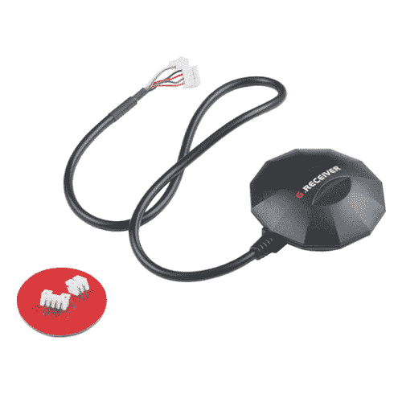
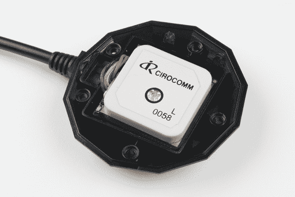
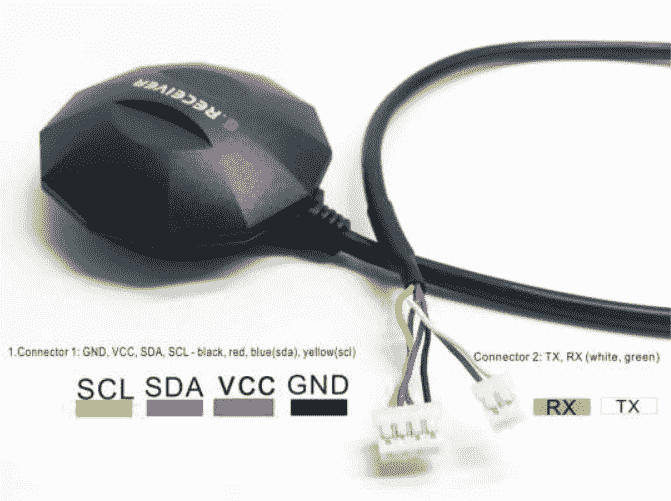
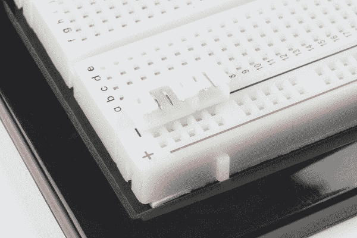
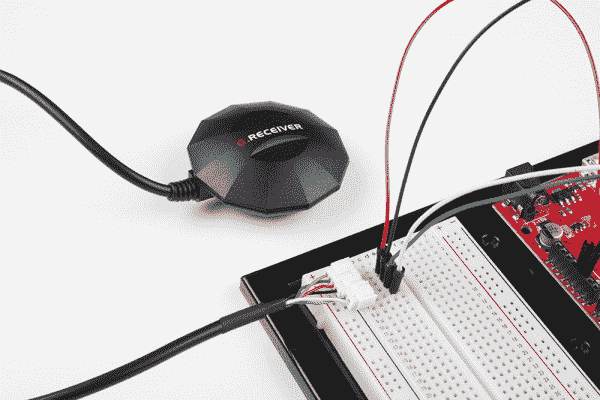
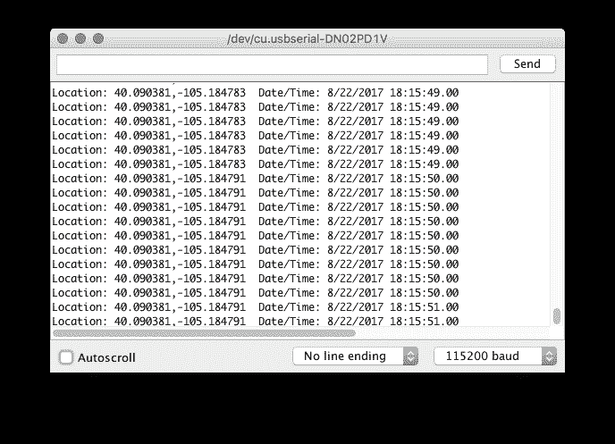

# GPS 鼠标- GP-808G 连接指南

> 原文：<https://learn.sparkfun.com/tutorials/gps-mouse---gp-808g-hookup-guide>

## 介绍

[GPS 鼠标](https://www.sparkfun.com/products/14198)将 GPS 和指南针结合在一个独立的模块中，非常适合无人机和自动驾驶汽车爱好者。内置的 GP-808G 是一个高灵敏度的 GPS 模块，可以精确地提供位置、速度和时间读数。这个模块非常精确，易于使用，几乎不需要设置时间，并且非常容易嵌入到您的项目中！

[](https://www.sparkfun.com/products/retired/14198) 

### [【GPS 鼠标- GP-808G (72 通道)](https://www.sparkfun.com/products/retired/14198)

[Retired](https://learn.sparkfun.com/static/bubbles/ "Retired") GPS-14198

GPS 鼠标是一个独立的模块，非常适合无人机和自动驾驶汽车爱好者。

**Retired**[Favorited Favorite](# "Add to favorites") 11[Wish List](# "Add to wish list")

这款 72 通道 GPS 接收机支持标准的 NMEA-0183 和 uBlox 8 协议，功耗低 **40mA @ 3.3V-5.0V** ，支持 GPS/QZSS/GLONASS，跟踪灵敏度-167dBm。GP-808G 端接了两个 JST 连接器(一个 4 针和一个 2 针),包括它们的配对连接器。GPS 鼠标已经成为我们一年一度的[自动驾驶汽车竞赛](https://avc.sparkfun.com/) (AVC)中许多参赛者的热门 GPS 选项，并取得了巨大的成绩！

### 所需材料

按照本指南，您只需要一个 Arduino 兼容的微控制器，如 Arduino Uno 或 SparkFun Redboard、试验板和一些跳线。这个例子使用了一个 SparkFun 红板。

[](https://www.sparkfun.com/products/11021) 

将**添加到您的[购物车](https://www.sparkfun.com/cart)中！**

### [Arduino Uno - R3](https://www.sparkfun.com/products/11021)

[In stock](https://learn.sparkfun.com/static/bubbles/ "in stock") DEV-11021

这是新的 Arduino Uno R3。除了以前主板的所有功能外，Uno 现在使用 ATmega16U2 代替…

$27.95138[Favorited Favorite](# "Add to favorites") 162[Wish List](# "Add to wish list")****[](https://www.sparkfun.com/products/13975) 

将**添加到您的[购物车](https://www.sparkfun.com/cart)中！**

### [spark fun red board——用 Arduino 编程 T3](https://www.sparkfun.com/products/13975)

[In stock](https://learn.sparkfun.com/static/bubbles/ "in stock") DEV-13975

SparkFun RedBoard 结合了 UNO 的 Optiboot 引导程序的简单性、FTDI 的稳定性和 shield com…

$21.5049[Favorited Favorite](# "Add to favorites") 89[Wish List](# "Add to wish list")****[](https://www.sparkfun.com/products/12002) 

将**添加到您的[购物车](https://www.sparkfun.com/cart)中！**

### [【试验板-不干胶(白色)](https://www.sparkfun.com/products/12002)

[In stock](https://learn.sparkfun.com/static/bubbles/ "in stock") PRT-12002

这是你的尝试和真正的白色无焊试验板。它有 2 条电源总线，10 列，30 行，总共 400 个连接…

$5.5048[Favorited Favorite](# "Add to favorites") 93[Wish List](# "Add to wish list")****[](https://www.sparkfun.com/products/11026) 

将**添加到您的[购物车](https://www.sparkfun.com/cart)中！**

### [跳线标准 7" M/M - 30 AWG (30 个装)](https://www.sparkfun.com/products/11026)

[In stock](https://learn.sparkfun.com/static/bubbles/ "in stock") PRT-11026

如果你需要快速完成一个原型，没有什么比一堆跳线更能加快速度的了，让我们来看看

$2.4520[Favorited Favorite](# "Add to favorites") 43[Wish List](# "Add to wish list")******** ********### 推荐阅读

如果你以前从未使用过 GPS，看看我们的 [GPS 基础知识](https://learn.sparkfun.com/tutorials/gps-basics)教程。

[](https://learn.sparkfun.com/tutorials/gps-basics) [### GPS 基础知识

#### 2012 年 12 月 14 日](https://learn.sparkfun.com/tutorials/gps-basics) The Global Positioning System (GPS) is an engineering marvel that we all have access to for a relatively low cost and no subscription fee. With the correct hardware and minimal effort, you can determine your position and time almost anywhere on the globe.[Favorited Favorite](# "Add to favorites") 31

## 硬件概述

让我们详细检查一下 GPS 鼠标。

在外壳内，你会发现一个普通的 GPS 模块，有一些额外的位。在底部，你会发现一个温暖和热启动的备用电池以及机载 QMC-5883 磁力计。

[](https://cdn.sparkfun.com/assets/learn_tutorials/5/7/1/GPS_Mouse3.jpg)

GPS 连接器的引脚排列如下:

[](https://cdn.sparkfun.com/assets/learn_tutorials/5/7/1/GPS_Mouse_Pinout.png)*GPS pin diagram via the [GP-808G datasheet](https://cdn.sparkfun.com/assets/learn_tutorials/5/7/1/GPM-808G--UAV_GNSS_receiver_ublox8030_QMC5883.pdf).*

I ² C 线用于模块的工厂编程。器件的数据手册中没有寄存器数据。本指南中与设备的所有通信都通过串行进行。

## 硬件连接

这款 GPS 模块专为希望在定制 PCB 或手工制作的原型上安装 GPS 模块的专业制造商而设计。然而，您可以使用附带的连接器轻松地将 GPS 单元连接到试验板，并将其连接到您选择的微控制器。为了实现安全连接，您还可以将电线焊接到定制的 PCB 上。

要将模块连接到试验板，请插入 4 针和 2 针 JST 母连接器。

[](https://cdn.sparkfun.com/assets/learn_tutorials/5/7/1/GPS_Mouse1.jpg)

将 GPS JST 公接头连接到母接头中。现在，您可以使用跳线将 GPS 鼠标连接到微控制器。

[](https://cdn.sparkfun.com/assets/learn_tutorials/5/7/1/GPS_Mouse2.jpg)

为了实现更稳固的连接，您还可以剪断 JST 连接器，并将裸线端焊接到[直插头](https://www.sparkfun.com/products/116)或您选择的任何其他连接器上。

本例中使用的从 GPS 鼠标到 SparkFun RedBoard 的连接如下:

| GPS 鼠标 Pin | SparkFun RedBoard Pin |
| TX(白色) | 数字引脚 4 |
| RX(绿色) | 数字引脚 3 |
| GND(黑色) | 地面(GND) |
| VCC(红色) | 电源(5V) |

## Arduino 示例

现在我们已经连接了所有的东西，让我们从一些代码开始。在我们开始编写代码之前，我们确实需要安装一个库来解析 GPS 消息。如果你以前没有下载过 Arduino 库，或者你只是需要快速刷新，看看我们的教程[安装 Arduino 库](https://learn.sparkfun.com/tutorials/installing-an-arduino-library)。我们需要的库叫做 [TinyGPSPlus](http://arduiniana.org/libraries/tinygpsplus/) 来自米卡勒·哈特。您可以从下面的链接下载并安装该库。

[TinyGPS++ Library](https://github.com/mikalhart/TinyGPSPlus)

现在我们已经安装了库，让我们看看代码。在 Arduino 中，通过点击**文件- >示例->TinyGPSPlus-版本- >设备示例**打开示例草图。

在这个例子中，您需要修改一行代码。用下面一行将变量`GPSBaud`更改为 9600:

```
language:c
static const uint32_t GPSBaud = 9600; 
```

示例草图的其余部分应该可以正常工作。将草图上传到 Arduino 板上。一旦上传，打开设置为 115200 波特的[串行监视器](https://learn.sparkfun.com/tutorials/terminal-basics)。你应该看到 GPS 串行数据流。如果位置显示无效，请等待几分钟，让 GPS 单元锁定。如果几分钟后没有看到 GPS 数据，请参见下面的故障排除部分。

[](https://cdn.sparkfun.com/assets/learn_tutorials/5/7/1/GPS-data.png)

**注意:**当 GPS 在软件串行引脚上使用 9600 波特时，串行监视器的串行 UART 设置为 115200 波特。

### 故障排除提示

*   如果你在室内测试你的 GPS，确保你靠近窗户。GPS 的一个问题是无线电波很难穿过屋顶和天花板。所以 GPS 离外面越近越好。如果您仍然没有从足够多的卫星上获得定位，请尝试将 GPS 天线指向不同的方向。

*   如果你看到这个消息打印到串行监视器:`No GPS detected: check wiring.`照做。检查您的线路，确保您将正确的针脚连接到 GPS 连接器。

*   如果您将 GPS 鼠标放在黑暗的房间中，您将能够看到机箱内的板载 GPS LEDs 闪烁。如果你看到一个绿色的 LED，这意味着 GPS 单元正在获得电力。如果您看到一个闪烁的蓝色 LED，GPS 单元已锁定。如果您看到闪烁的蓝色 LED，并且没有将任何串行数据打印到串行终端，请检查您的布线，并检查您是否在代码顶部定义了正确的引脚。

## 资源和更进一步

有关 GPS 鼠标的更多信息，请查看以下链接:

*   [GPS 鼠标数据表](https://cdn.sparkfun.com/assets/learn_tutorials/5/7/1/GPM-808G--UAV_GNSS_receiver_ublox8030_QMC5883.pdf)

现在你已经有了 GPS 鼠标，你打算用它做什么项目？需要一点灵感吗？看看这些教程吧！

[](https://learn.sparkfun.com/tutorials/alphanumeric-gps-wall-clock) [### 字母数字 GPS 挂钟](https://learn.sparkfun.com/tutorials/alphanumeric-gps-wall-clock) This is a GPS controlled clock - a clock you truly never have to set! Using GPS and some formulas, we figure out what day of the week and if we are in or out of daylight savings time.[Favorited Favorite](# "Add to favorites") 13[](https://learn.sparkfun.com/tutorials/mini-gps-shield-hookup-guide) [### 迷你 GPS 屏蔽连接指南](https://learn.sparkfun.com/tutorials/mini-gps-shield-hookup-guide) A hookup guide for the SparkFun Mini GPS Shield.[Favorited Favorite](# "Add to favorites") 5[](https://learn.sparkfun.com/tutorials/building-an-autonomous-vehicle-the-batmobile) [### 建造自主车辆:蝙蝠战车](https://learn.sparkfun.com/tutorials/building-an-autonomous-vehicle-the-batmobile) Documenting a six-month project to race autonomous Power Wheels at the SparkFun Autonomous Vehicle Competition (AVC) in 2016\.[Favorited Favorite](# "Add to favorites") 8[](https://learn.sparkfun.com/tutorials/getting-started-with-the-geofence) [### 地理围栏入门](https://learn.sparkfun.com/tutorials/getting-started-with-the-geofence) How to get started using the GeoFence GPS Boundary Widget and GeoFence Software.[Favorited Favorite](# "Add to favorites") 5********