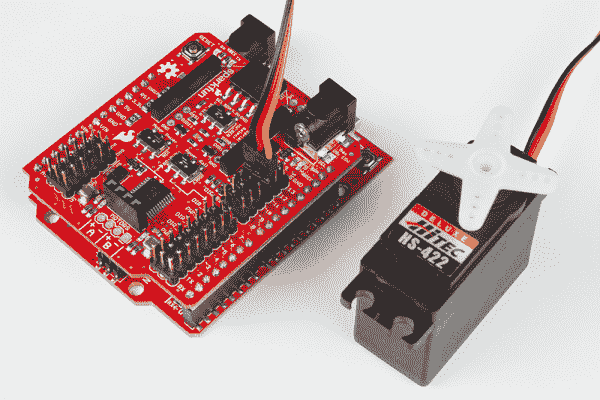

# 无线电机驱动器屏蔽连接指南

> 原文：<https://learn.sparkfun.com/tutorials/wireless-motor-driver-shield-hookup-guide>

## 介绍

**Note:** The Wireless Motor Driver Shield was built off Ludus Protoshield Wireless. For more information on the older version, check out the [Ludus Protoshield Hookup guide](https://learn.sparkfun.com/tutorials/ludus-protoshield-hookup-guide).**Heads up!** Originally, this tutorial was written to configure an XBee Series 1 to communicate in transparency mode. However, this can apply to the XBee Series 3 module as long as you configure the firmware to the legacy 802.15.4 protocol. For more information, check out the [Exploring XBees and XCTU](https://learn.sparkfun.com/tutorials/exploring-xbees-and-xctu) tutorial.

无线电机驱动器屏蔽是一种 Arduino 屏蔽，旨在使电机和传感器更容易、更快速地连接到 Arduino 兼容开发板。这对于组装遥控漫游车和小型自主机器人来说非常方便。本指南将帮助您使用自己的[无线电机驱动屏蔽](https://www.sparkfun.com/products/14285)！

[](https://www.sparkfun.com/products/14285) 

将**添加到您的[购物车](https://www.sparkfun.com/cart)中！**

 **### [SparkFun 无线电机驱动盾](https://www.sparkfun.com/products/14285)

[In stock](https://learn.sparkfun.com/static/bubbles/ "in stock") DEV-14285

SparkFun 无线电机驱动盾旨在将电机、传感器和其他组件连接到您的 Arduino…

$24.952[Favorited Favorite](# "Add to favorites") 18[Wish List](# "Add to wish list")** **### 所需材料

除了无线电机驱动器屏蔽，您还需要将屏蔽堆叠到微控制器。我们推荐 [SparkFun RedBoard](https://www.sparkfun.com/products/13975) 或任何其他 Arduino 外形规格板，如 [Arduino Uno](https://www.sparkfun.com/products/11021) 或 [Arduino Leonardo](https://www.sparkfun.com/products/11286) 。

Driver Shield 的一个主要特点是让刚刚学习的人更容易使用电机。为了充分利用这个防护罩，你还需要一些马达来驱动。查看我们的[电机类别](https://www.sparkfun.com/categories/178)获取一些想法。

### 推荐阅读

在使用 Driver Shield 之前，您可能会发现以下一些概念很有用。

[](https://learn.sparkfun.com/tutorials/serial-communication) [### 串行通信](https://learn.sparkfun.com/tutorials/serial-communication) Asynchronous serial communication concepts: packets, signal levels, baud rates, UARTs and more 100[](https://learn.sparkfun.com/tutorials/what-is-an-arduino) [### 什么是 Arduino？](https://learn.sparkfun.com/tutorials/what-is-an-arduino) What is this 'Arduino' thing anyway? This tutorials dives into what an Arduino is and along with Arduino projects and widgets.[Favorited Favorite](# "Add to favorites") 50[](https://learn.sparkfun.com/tutorials/installing-arduino-ide) [### 安装 Arduino IDE](https://learn.sparkfun.com/tutorials/installing-arduino-ide) A step-by-step guide to installing and testing the Arduino software on Windows, Mac, and Linux.[Favorited Favorite](# "Add to favorites") 16[](https://learn.sparkfun.com/tutorials/terminal-basics) [### 串行终端基础知识](https://learn.sparkfun.com/tutorials/terminal-basics) This tutorial will show you how to communicate with your serial devices using a variety of terminal emulator applications.[Favorited Favorite](# "Add to favorites") 46[](https://learn.sparkfun.com/tutorials/motors-and-selecting-the-right-one) [### 电机并选择正确的电机](https://learn.sparkfun.com/tutorials/motors-and-selecting-the-right-one) Learn all about different kinds of motors and how they operate.[Favorited Favorite](# "Add to favorites") 45[](https://learn.sparkfun.com/tutorials/arduino-shields-v2) [### Arduino Shields v2](https://learn.sparkfun.com/tutorials/arduino-shields-v2) An update to our classic Arduino Shields Tutorial! All things Arduino shields. What they are and how to assemble them.[Favorited Favorite](# "Add to favorites") 5

## 硬件概述

无线电机驱动器屏蔽有许多连接器、开关和端口供您使用。让我们来看看每一个。

### XBee 端口

在电路板的顶部，您会发现两排接头用于接受一个 [XBee 模块](https://www.sparkfun.com/categories/223)。XBee UART 连接到数字引脚 0 和 1 或模拟引脚 A0 和 A1，具体取决于 XBee 选择器开关的位置。

[](https://cdn.sparkfun.com/assets/learn_tutorials/6/8/8/XBee_port.jpg)

### XBee 引脚选择开关

XBee 端口下方的选择器开关允许您选择使用哪些引脚与 XBee 模块通信。下表显示了 XBee *RXI* 和 *TXO* 引脚连接到 Arduino 上的哪些引脚，具体取决于开关的位置。如果您使用 SW_SER(引脚 A0 和 A1)，您需要使用[软件串行库](https://www.arduino.cc/en/Reference/SoftwareSerial)。

**Note for Using Hardware Serial Pins (HW_SER) and Uploading to Arduino:** For the Arduino Uno and similar derivative boards, pins 0 and 1 are used to upload programs to the Arduino through serial. There is a possibility of bricking the XBee or issues uploading code to your Arduino with the XBee attached. You will also have issues uploading even if the XBee is removed and the switch left in the *HW_SER* position.

So, if you plan to use *HW_SER* to communicate to the XBee, you'll need to switch it to *SW_SER* when uploading new code. When code has finished uploading to the Arduino, the switch will need to be flipped back to the *HW_SER* side to communicate to the XBee.

| 位置 | XBee RXI | XBee TXO |
| 硬件 _ 用户 | Zero | one |
| 软件 _ 用户 | A0 | 一流的 |

[](https://cdn.sparkfun.com/assets/learn_tutorials/6/8/8/XBee_switch.jpg)

### I ² C 端口

在 XBee 的足迹下，你还会发现一个 4 针母接头，它中断了 Arduino 的 I ² C 线。您可以使用它将各种传感器连接到您的项目。

[](https://cdn.sparkfun.com/assets/learn_tutorials/6/8/8/I2C_port.jpg)

### 模拟输入引脚

在屏蔽层的左侧，您会发现引脚 A0 至 A5 与每个模拟引脚的电源和接地引脚相连。请注意，如果您选择 XBee 开关上的 *SW_SER* ，A0 和 A1 引脚将分别用于连接 XBee 的 *RXI* 和 *TXO* 。

**Note:** The pins labeled "PWR" in this analog section are connected to the Arduino's IOREF pin, so if your Arduino uses 5V logic, these pins will be 5V. Similarly, if your Arduino runs on 3.3V logic, they will be 3.3V.[](https://cdn.sparkfun.com/assets/learn_tutorials/6/8/8/analog_in.jpg)

### 数字引脚

在右侧，您会看到数字引脚 0 至 13 连接到接头，每个引脚都有一个电源和接地引脚。这些都是这样配置的，以允许您轻松连接[伺服](https://www.sparkfun.com/categories/245)。请注意，根据两个电源开关的位置，电源引脚可以连接到 IOREF、VIN 或屏蔽的电源插孔。

[](https://cdn.sparkfun.com/assets/learn_tutorials/6/8/8/digital_pins.jpg)

### 电机驱动器和输出

在防护罩的底部，你会发现一个 [TB6612FNG 电机驱动器](https://www.sparkfun.com/products/9457)和一个用于连接任意数量 [DC 电机](https://www.sparkfun.com/categories/247)的 4 针接头。未填充的孔间隔 0.100 英寸，可用于[焊接来自电机的](https://learn.sparkfun.com/tutorials/how-to-solder-through-hole-soldering)电线。

**Watch out!** Although the TB6612FNG is rated for 1.2A per channel, we found through testing that **the practical limit is about 0.8A on both channels before the driver goes into thermal shutdown.** You may be able to remedy this with heatsinks and/or active cooling, but we recommend a continued load below 0.8A for most users.[](https://cdn.sparkfun.com/assets/learn_tutorials/6/8/8/motor_driver.jpg)

### 电源插座

通常，用 Arduino 的电源(甚至是 VIN)驱动电机会导致电压下降，并可能重置您的 Arduino。为了帮助解决这个问题，防护罩右上角的电源插孔将接受各种[墙壁适配器](https://www.sparkfun.com/categories/308)和[电池组](https://www.sparkfun.com/products/9835)的 5.5 x 2.1mm 毫米电源插头。

请注意，您需要将*电机电源*开关设置为 *VS* 以从电源插孔给电机供电。如果您还将*电源轨*开关设置为*v 电机、*，那么电源插孔将连接到数字引脚上的电源轨(例如，连接到电源伺服系统)。

此外，这个电源插孔将**而不是**为 Arduino 供电。它旨在为您的电机提供独立于 Arduino 的电源。

**Caution!** Power supplies attached to the power jack can be up to **15V**. Note that the voltage supplied will be used to directly power motors and servos, so make sure you don't damage your motors with this raw voltage! Additionally, the circuitry can only support up to 3.0A of current (total) delivered to the motors and digital power rail.[](https://cdn.sparkfun.com/assets/learn_tutorials/6/8/8/Power_port.jpg)

除了电源插孔之外， **VS** 引脚在桶形插孔连接器旁边断开，分别为“ **+** ”和“ **-** ”。

[](https://cdn.sparkfun.com/assets/learn_tutorials/6/8/8/14285-04_ExternalPowerWirelessMotorDriverTopView.jpg)⚡ **Warning!** For those using the Arduino Uno, the USB female type B connector can short power where the **VS** pins are located. Make sure to add some electrical tape on top of the Arduino Uno's USB connector or bottom of the shield where the **VS** pins are exposed.

| [](https://cdn.sparkfun.com/assets/learn_tutorials/6/8/8/11021-04ArduinoUnoR3_USB_Type_B_Connector_Can_Create_Short.jpg) | [](https://cdn.sparkfun.com/assets/learn_tutorials/6/8/8/14285-03_ExternalPowerWirelessMotorDriverBottomView.jpg) |
| *在顶部露出 Arduino Uno USB 接口的地方贴上绝缘胶带* | *在底部*暴露的外部 **VS** 电源引脚处添加绝缘胶带 |

### 电源开关

电路板中间有两个开关，可用于设置如何将功率分配给数字 PWR 供电轨和电机驱动器。*电机电源*开关允许您在 *VS* (电源插孔)和 *VIN* (来自 Arduino)之间进行选择，为电机(标有*v 电机*)供电。*电源导轨*开关允许您在 *IOREF* (来自 Arduino)和*v Motor*(*电机电源*开关的输出)之间进行选择，为数字割台的 *PWR* 引脚供电。

| 电机电源开关位置 | 电动轨道开关位置 | 电机驱动器连接到... | 数字 PWR 引脚连接到... |
| VS(电源插座) | VMOTOR | VS(电源插座) | VS(电源插座) |
| VS(电源插座) | 尤瑟夫 | VS(电源插座) | 尤瑟夫 |
| 车辆识别号码 | VMOTOR | 车辆识别号码 | 车辆识别号码 |
| 车辆识别号码 | 尤瑟夫 | 车辆识别号码 | 尤瑟夫 |

[](https://cdn.sparkfun.com/assets/learn_tutorials/6/8/8/power_switches.jpg)

## 简单电机控制

在本节中，我们将讨论如何将一对电机连接到无线电机驱动器屏蔽上，并让它们旋转。不过，在此之前，我们先来谈谈如何与 H 桥驱动器对话。如果我们查看 TB6612FNG 的[数据表](https://www.sparkfun.com/datasheets/Robotics/TB6612FNG.pdf),我们会发现一个这样的表格:

[](https://cdn.sparkfun.com/assets/learn_tutorials/4/0/2/Screenshot_from_2015-07-14_15_12_45.png)

下表显示了 H 桥上输入和输出引脚之间的关系。两个通道中的每一个都需要 3 个引脚来操作: **IN1，IN2** 和 **PWM** 。通过将 IN 引脚驱动为高或低，您可以控制该通道上电机的**方向**以及将其完全分离，甚至将其端到端短路(如踩下刹车)。您提供给 PWM 引脚的信号决定了该通道上电机的**速度**。通过参考上表，我们发现为了使电机以 50%的速度顺时针转动，我们需要将 IN1 设置为高，IN2 设置为低，并发送一个 50%的 PWM 信号(在 Arduino 中是`analogWrite(pin, 128)`)

我们可以查看屏蔽层上的丝网印刷，找出哪个 Arduino 引脚连接到 H 桥上的哪个输入。一旦我们知道了这一点，我们就可以开始编写一些基本的示例代码来控制驱动程序。

在任何东西移动之前，我们需要连接一对马达。如果你刚开始接触机器人，我们建议你使用[大谷爱好齿轮马达](https://www.sparkfun.com/products/13302)。这些马达与我们的[阿达穆托护盾套件](https://www.sparkfun.com/products/13201)是同一个。因为它们有电线连接到电机，将它们插入 A+、A-、B+和 B-接头。示例代码还允许您控制一个伺服系统，所以如果您想添加一个伺服系统，请将它插入到引脚 11。

现在，将盾牌连接到 SparkFun RedBoard(或任何具有 Arduino Uno 足迹的 Arduino)。连接电源，如 [9V 电池座](https://www.sparkfun.com/products/10512)和 [9V 电池](https://www.sparkfun.com/products/10218)。一旦完成，我们就可以将示例代码加载到 Arduino 上了。

**注意:**此示例假设您在桌面上使用的是最新版本的 Arduino IDE。如果这是你第一次使用 Arduino，请回顾我们关于[安装 Arduino IDE 的教程。](https://learn.sparkfun.com/tutorials/installing-arduino-ide)

复制下面的示例代码，并将其粘贴到 Arduino IDE 中。(或者，您也可以从 [GitHub 库](https://github.com/sparkfun/Ludus_ProtoShield_Wireless/blob/master/firmware/Ludus_Example/Ludus_Example.ino)下载示例代码)。通过 USB 连接您的 RedBoard 或 Arduino，并确保您选择了正确的板类型和 COM 端口。现在按“上传”将示例代码发送到开发板！

```
language:c
/*
 * SparkFun Ludus ProtoShield Example Code
 * SparkFun Electronics
 * Nick Poole 2015
 * 
 * This is an Arduino shield that integrates an H-Bridge Driver and 
 * breaks out all I/O ports to three-pin headers on a GND/PWR/SIG 
 * standard. This enables quick prototyping and integration of 
 * Arduino projects w/o the need of a breadboard.
 * 
 * Ludus is the mascot of the SparkFun Education team. 
 * It is a highly intelligent octopus.
 * 
 * Please see the License.md file for license information.
*/

#include <Servo.h> 

Servo swivel;

int pwm_a = 3;   // Channel A speed
int pwm_b = 6;   // Channel B speed
int dir_a0 = 4;  // Channel A direction 0
int dir_a1 = 5;  // Channel A direction 1
int dir_b0 = 7;  // Channel B direction 0
int dir_b1 = 8;  // Channel B direction 1

char inbit; // A place to store serial input

int swivelpos = 90; // Servo position

void setup()
{

  Serial.begin(9600); // Pour a bowl of serial

  swivel.attach(11); // Attach servo to pin 11
  swivel.write(swivelpos); 

  pinMode(pwm_a, OUTPUT);  // Set control pins to be outputs
  pinMode(pwm_b, OUTPUT);
  pinMode(dir_a0, OUTPUT);
  pinMode(dir_a1, OUTPUT);
  pinMode(dir_b0, OUTPUT);
  pinMode(dir_b1, OUTPUT);

  draw(); // Draw the driving instructions to the serial terminal

}

void loop()
{ 

if(Serial.available()){ // Wait for serial input

  inbit = Serial.read();

  switch(inbit){ // Switch based on serial in

    case 'w': // Move Forward

      forward(200);
      delay(30);
      shutoff();
      break;

    case 's': // Move Backward

      reverse(200);
      delay(30);
      shutoff();
      break;

    case 'q': // Turn Left while moving forward

      turnL(200);
      delay(30);
      shutoff();
      break;

    case 'e': // Turn Right while moving forward

      turnR(200);
      delay(30);
      shutoff();
      break;

    case 'a': // Spin Left in place

      spinL(200);
      delay(30);
      shutoff();
      break;

    case 'd': // Spin Right in place

      spinR(200);
      delay(30);
      shutoff();
      break;

    case 'x': // Short brake

      brake();
      break;

    case 'z': // Spin servo (on pin 11) left

      servoL();
      break;

    case 'c': // Spin servo (on pin 11) right

      servoR();
      break;

    }
  }  
}

void forward(int speed) // Move Forward
{ 

digitalWrite(dir_a0, 0);
digitalWrite(dir_a1, 1);
digitalWrite(dir_b0, 0);
digitalWrite(dir_b1, 1);

analogWrite(pwm_a, speed); 
analogWrite(pwm_b, speed); 

}

void reverse(int speed) // Move Backward 
{

digitalWrite(dir_a0, 1);
digitalWrite(dir_a1, 0);
digitalWrite(dir_b0, 1);
digitalWrite(dir_b1, 0);

analogWrite(pwm_a, speed); 
analogWrite(pwm_b, speed); 

}

void turnL(int speed) // Turn Left while moving forward
{ 

digitalWrite(dir_a0, 0);
digitalWrite(dir_a1, 1);
digitalWrite(dir_b0, 0);
digitalWrite(dir_b1, 1);

analogWrite(pwm_a, speed); 
analogWrite(pwm_b, speed/4); 

}

void turnR(int speed) // Turn Right while moving forward
{ 

digitalWrite(dir_a0, 0);
digitalWrite(dir_a1, 1);
digitalWrite(dir_b0, 0);
digitalWrite(dir_b1, 1);

analogWrite(pwm_a, speed/4); 
analogWrite(pwm_b, speed); 

}

void spinL(int speed) // Spin Left in place
{ 

digitalWrite(dir_a0, 0);
digitalWrite(dir_a1, 1);
digitalWrite(dir_b0, 1);
digitalWrite(dir_b1, 0);

analogWrite(pwm_a, speed/2); 
analogWrite(pwm_b, speed/2); 

}

void spinR(int speed) // Spin Right in place
{ 

digitalWrite(dir_a0, 1);
digitalWrite(dir_a1, 0);
digitalWrite(dir_b0, 0);
digitalWrite(dir_b1, 1);

analogWrite(pwm_a, speed/2); 
analogWrite(pwm_b, speed/2); 

}

void brake() // Short brake
{ 

digitalWrite(dir_a0, 1);
digitalWrite(dir_a1, 1);
digitalWrite(dir_b0, 1);
digitalWrite(dir_b1, 1);

analogWrite(pwm_a, 0); 
analogWrite(pwm_b, 0);

}

void shutoff() // Stop Motors w/o braking
{ 

digitalWrite(dir_a0, 0);
digitalWrite(dir_a1, 0);
digitalWrite(dir_b0, 0);
digitalWrite(dir_b1, 0);

analogWrite(pwm_a, 0); 
analogWrite(pwm_b, 0);

}

void draw() // Serial Instructions
{
  Serial.println("          DuckBot 2015          ");
  Serial.println("                                ");
  Serial.println("   -------------------------    ");
  Serial.println("   |       |       |       |    ");
  Serial.println("   |   Q   |   W   |   E   |    ");
  Serial.println("   | turnL |forward| turnR |    ");
  Serial.println("   -------------------------    ");
  Serial.println("   |       |       |       |    ");
  Serial.println("   |   A   |   S   |   D   |    ");
  Serial.println("   | spinL |reverse| spinR |    ");
  Serial.println("   -------------------------    ");
  Serial.println("   |       |       |       |    ");
  Serial.println("   |   Z   |   X   |   C   |    ");
  Serial.println("   |servo L| brake |servo R|    ");
  Serial.println("   -------------------------    ");
  Serial.println("                                ");
}

void servoL() // Spin servo (on pin 11) left 
{

  if(swivelpos>10){
    swivelpos = swivelpos-10;
    swivel.write(swivelpos);
  }

}

void servoR() // Spin servo (on pin 11) right
{

  if(swivelpos<170){
    swivelpos = swivelpos+10;
    swivel.write(swivelpos);
  }

} 
```

确保*电机电源*和*电源导轨*开关分别设置到 *VIN* 和*v 电机*。

[](https://cdn.sparkfun.com/assets/learn_tutorials/6/8/8/Wireless_Motor_Driver_Shied_Hookup_Guide-01.jpg)

如果一切顺利，你现在应该能够打开一个[串行终端](https://learn.sparkfun.com/tutorials/terminal-basics)(比如内置在 Arduino IDE 中的那个)，并键入一串“w”来使马达转动。这个例子实际上是为了与终端程序一起使用而编写的，它允许您直接键入端口，而不必按回车键。这样，你就可以通过按住键盘上适当的键来驱动机器人。我最喜欢的终端程序是 [RealTerm](https://learn.sparkfun.com/tutorials/terminal-basics/real-term-windows) 。你可以在这里得到真实的 T4。

您也可以将伺服系统连接到 11 号针，并通过串行终端发送字符“z”和“c”来移动伺服系统。

[](https://cdn.sparkfun.com/assets/learn_tutorials/6/8/8/Wireless_Motor_Driver_Shied_Hookup_Guide-03.jpg)

既然我们已经看到了这一点，让我们深入研究一下示例代码。理解示例代码是如何工作的是编写自己的代码的第一步！

## 理解示例代码

示例代码旨在让您使用[串行通信](https://learn.sparkfun.com/tutorials/serial-communication)控制 H 桥以及连接到引脚 11 的伺服系统。让我们浏览代码的一些摘录，看看我们是否能更好地理解它的工作原理。与大多数草图一样，它从一些基本的设置开始:

```
language:c
#include <Servo.h>

Servo swivel;

int pwm_a = 3; // Channel A speed
int pwm_b = 6; // Channel B speed
int dir_a0 = 4; // Channel A direction 0
int dir_a1 = 5; // Channel A direction 1
int dir_b0 = 7; // Channel B direction 0
int dir_b1 = 8; // Channel B direction 1

char inbit; // A place to store serial input
int swivelpos = 90; // Servo position

void setup()
{
Serial.begin(9600); // Pour a bowl of serial

swivel.attach(11); // Attach servo to pin 11
swivel.write(swivelpos);

pinMode(pwm_a, OUTPUT); // Set control pins to be outputs
pinMode(pwm_b, OUTPUT);
pinMode(dir_a0, OUTPUT);
pinMode(dir_a1, OUTPUT);
pinMode(dir_b0, OUTPUT);
pinMode(dir_b1, OUTPUT);

draw(); // Draw the driving instructions to the serial terminal

} 
```

正如你所看到的，我们从包含伺服库和创建一个名为“swivel”的伺服对象开始。接下来，我们声明一些变量来跟踪哪个引脚负责哪个功能，以及伺服位置和输入串行字符的变量。`setup()`功能是串行通信被初始化、伺服对象被附加以及控制引脚全部被设置为输出设备的地方。最后，我们调用函数`draw()`，我们一会儿就会看到它。

```
language:c
void loop()
{
if(Serial.available()){ // Wait for serial input
    inbit = Serial.read();
    switch(inbit){ // Switch based on serial in
        case 'w': // Move Forward
    forward(200);
    delay(30);
    shutoff();
    break;
        case 's': // Move Backward
    reverse(200);
    delay(30);
    shutoff();
    break;
        case 'q': // Turn Left while moving forward
    turnL(200);
    delay(30);
    shutoff();
    break;
        case 'e': // Turn Right while moving forward
    turnR(200);
    delay(30);
    shutoff();
    break;
        case 'a': // Spin Left in place
    spinL(200);
    delay(30);
    shutoff();
    break;
        case 'd': // Spin Right in place
    spinR(200);
    delay(30);
    shutoff();
    break;
        case 'x': // Short brake
    brake();
    break;
        case 'z': // Spin servo (on pin 11) left
    servoL();
    break;
        case 'c': // Spin servo (on pin 11) right
    servoR();
    break;
    }
}
} 
```

示例代码的主循环只是等待看到串行线上的输入，然后存储传入的值，并将其与一系列事例进行比较。通过滚动 switch/case 语句，您可以看到与每个串行字符相关的行为。代码的其余部分由主循环中调用的各种过程组成。让我们来看看其中的一些:

```
language:c
void draw() // Serial Instructions
{
Serial.println("                           ");
Serial.println(" ------------------------- ");
Serial.println(" |       |       |       | ");
Serial.println(" |   Q   |   W   |   E   | ");
Serial.println(" | turnL |forward| turnR | ");
Serial.println(" ------------------------- ");
Serial.println(" |       |       |       | ");
Serial.println(" |   A   |   S   |   D   | ");
Serial.println(" | spinL |reverse| spinR | ");
Serial.println(" ------------------------- ");
Serial.println(" |       |       |       | ");
Serial.println(" |   Z   |   X   |   C   | ");
Serial.println(" |servo L| brake |servo R| ");
Serial.println(" ------------------------- ");
Serial.println("                           ");
} 
```

这个很简单！`draw()`过程只是一堆打印语句，告诉你哪个键与哪个函数相关联。

最后，有一堆程序实际上设置电机的速度和方向。这些是您希望在自己的代码中借用的函数，因为它们将我们在上一节中讨论的所有控制销内容包装成直观的命令，如“前进”、“转弯”和“刹车”。所有运动命令的结构基本相同。例如:

```
language:c
void forward(int speed) // Move Forward
{
digitalWrite(dir_a0, 0);
digitalWrite(dir_a1, 1);
digitalWrite(dir_b0, 0);
digitalWrite(dir_b1, 1);

analogWrite(pwm_a, speed);
analogWrite(pwm_b, speed);
} 
```

`brake()`和`shutoff()`功能的结构与运动程序相同，只是在`brake()`的情况下，所有引脚都被写入高电平，而在`shutoff()`的情况下，所有引脚都被写入低电平。`brake()`程序实际上是短路电机，使其无法转动。`shutoff()`功能简单地切断电机电源，使电机停止转动。尝试参考从 *[简单电机控制](https://learn.sparkfun.com/tutorials/wireless-motor-driver-shield-hookup-guide#simple-motor-control)* 中复制的示例代码，了解如何定义这些功能的更多详细信息。

最后，还有伺服控制功能，它在将伺服位置变量写入伺服系统之前增加或减少伺服位置变量:

```
language:c
void servoL() // Spin servo (on pin 11) left
{
if(swivelpos>10){
swivelpos = swivelpos-10;
swivel.write(swivelpos);
}
} 
```

这里唯一聪明的事情是，我们提前检查我们是否已经达到了伺服系统的极限，这样我们就不会增加超过它的运动范围。

## 走向无线

通过使用 [ZigBee](https://en.wikipedia.org/wiki/Zigbee) 的力量，你可以将你的项目从它的 USB 系绳中解放出来！为此，你需要一对 [XBee 无线电模块](https://www.sparkfun.com/products/8665)和一个 [XBee Explorer USB](https://www.sparkfun.com/products/11812) 。即使您不熟悉 XBee，您也应该能够无线运行示例代码，因为默认情况下无线电模块应该配置正确。关于 XBee 的介绍，请查看这个 [SparkFun 教程，开始使用 XBee](https://learn.sparkfun.com/tutorials/exploring-xbees-and-xctu)。使用 XBee 可以做的事情比我们在这里讨论的要多得多。

第一步是将 XBee 无线电插入无线电机驱动器屏蔽。板上的丝印显示了它应该朝哪个方向走。确保标有 *XBee 串行选择*的滑动开关设置为 *HW_SER* 。

[](https://cdn.sparkfun.com/assets/learn_tutorials/6/8/8/Wireless_Motor_Driver_Shied_Hookup_Guide-04.jpg)

这将把 XBee 无线电连接到 Arduino 的硬件串行线路。接下来，将 XBee Explorer 插入计算机的 USB 端口，并打开您在*简单电机控制*部分使用的串行终端程序。

[](https://cdn.sparkfun.com/assets/learn_tutorials/6/8/8/Wireless_Motor_Driver_Shied_Hookup_Guide-02.jpg)

打开 XBee 浏览器的 COM 端口，并打开 Arduino。

示例代码现在应该完全像以前一样工作，只是这一次，您的串行命令是通过无线方式发送的！正在发生的是 XBee 无线电就像一个无线串行隧道。据 Arduino 所知，有一根 USB 电缆连接到串行线上。

## 资源和更进一步

希望到现在为止，你已经给自己造了一个可以玩的机器人！然而，行动只是开始。有关更多信息，请查看以下资源:

*   [TB6612FNG 电机驱动器数据表](https://www.sparkfun.com/datasheets/Robotics/TB6612FNG.pdf)
*   [无线电机驱动屏蔽 GitHub 库](https://github.com/sparkfun/Ludus_ProtoShield_Wireless)
*   [示例代码](https://github.com/sparkfun/Ludus_ProtoShield_Wireless/blob/master/firmware/Ludus_Example/Ludus_Example.ino)
*   [Arduino 软件串行库](https://www.arduino.cc/en/Reference/SoftwareSerial)

查看我们的其他机器人教程，将您的无线电机驱动器屏蔽提升到一个新的水平。

[](https://learn.sparkfun.com/tutorials/serial-communication) [### 串行通信](https://learn.sparkfun.com/tutorials/serial-communication) Asynchronous serial communication concepts: packets, signal levels, baud rates, UARTs and more 100[](https://learn.sparkfun.com/tutorials/actobotics-basic-differential-platform) [### 机器人基础差分平台](https://learn.sparkfun.com/tutorials/actobotics-basic-differential-platform) Get started with Actobotics with this simple vehicle. Then expand and customize it for your own evil robot empire.[Favorited Favorite](# "Add to favorites") 7[](https://learn.sparkfun.com/tutorials/hmc6343-3-axis-compass-hookup-guide) [### HMC6343 三轴罗盘连接指南](https://learn.sparkfun.com/tutorials/hmc6343-3-axis-compass-hookup-guide) How to hook the HMC6343 -- a high-end, tilt-compensated compass module -- up to an Arduino. Never get lost again 3[](https://learn.sparkfun.com/tutorials/exploring-xbees-and-xctu) [### 探索 XBees 和 XCTU](https://learn.sparkfun.com/tutorials/exploring-xbees-and-xctu) How to set up an XBee using your computer, the X-CTU software, and an XBee Explorer interface board.[Favorited Favorite](# "Add to favorites") 18**