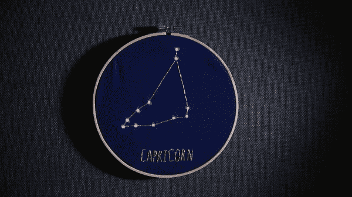

# 闪烁星座

> 原文：<https://learn.sparkfun.com/tutorials/twinkle-zodiac-constellation>

## 介绍

在这个项目中，我们将创建一个装饰性的刺绣环，使用导电线将[lily pad led](https://www.sparkfun.com/products/13902)连接到 [LilyTiny](https://www.sparkfun.com/products/10899) ，由 [LilyPad 电池座](https://www.sparkfun.com/products/13883)供电。跟着在一块布料上画出你自己的设计，或者下载并打印一张 SparkFun 的设计。

设计和建造时间:1-2 小时

### 推荐阅读

如果这是你的第一个可缝合电子项目，我们建议你阅读我们的 LilyPad 基础教程。

 [### LilyPad 基础:电子缝纫

#### 2016 . 12 . 17](https://learn.sparkfun.com/tutorials/lilypad-basics-e-sewing) Learn how to use conductive thread with LilyPad components.[Favorited Favorite](# "Add to favorites") 16

## 材料和工具

让我们来看一下将你的项目组合在一起所需要的所有东西。

### 闪烁星座必备物品: