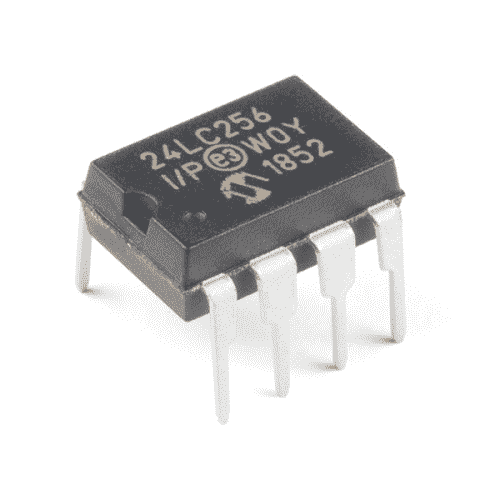
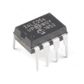
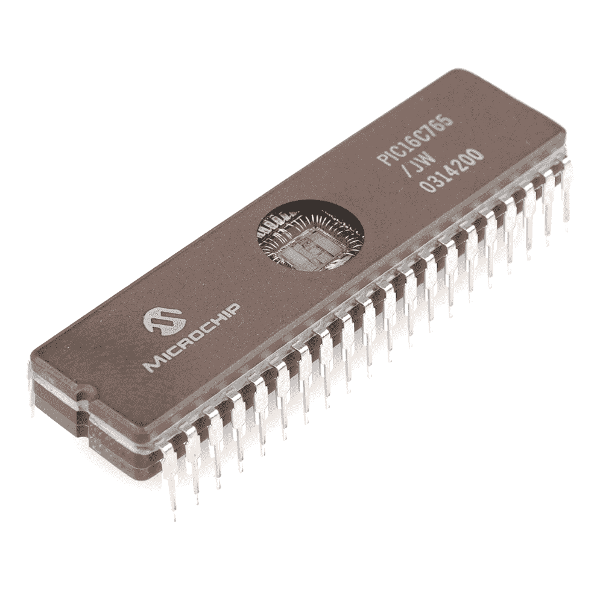
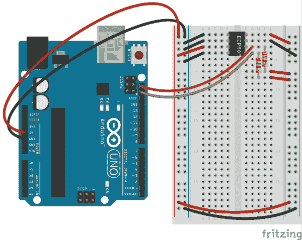
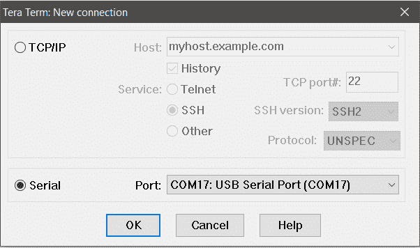
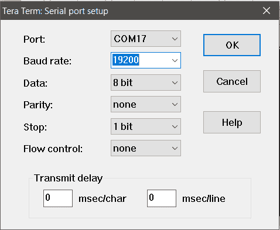
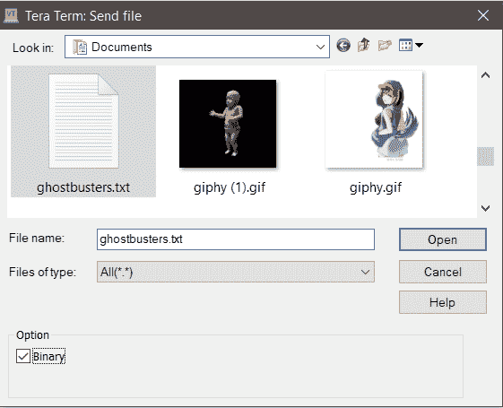
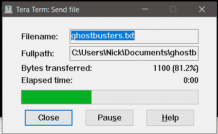
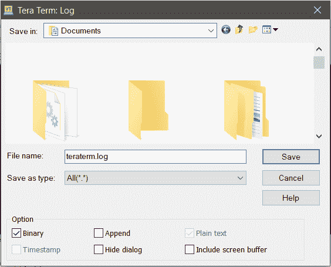
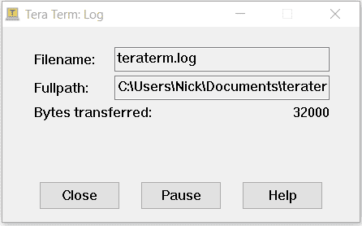

# 读写串行 EEPROMs

> 原文：<https://learn.sparkfun.com/tutorials/reading-and-writing-serial-eeproms>

## 介绍

**NOTE:** Users with the [Qwiic EEPROM](https://www.sparkfun.com/products/18355), will want to check out the [Qwiic EEPROM Hookup Guide](https://learn.sparkfun.com/tutorials/1661).

* * *

EEPROM 或 **E** 电 **E** 可擦除 **P** 可编程**R**EAD-**O**only**M**emory 是一种允许您存储小块数据并在以后检索它的设备，即使该设备已重新通电。许多现代微控制器——如 atmega 328——包含一些内置 EEPROM，但这并不意味着您不能添加更多！像 [Microchip 24 系列 EEPROM](https://www.sparkfun.com/products/525) 这样的串行 EEPROM 设备允许您向任何能讲 I C 的设备添加更多内存。今天我们将学习如何使用 Arduino 读写串行 EEPROM 设备。

**Library Now Available:** We've created an [External EEPROM Library](https://github.com/sparkfun/SparkFun_External_EEPROM_Arduino_Library) for Arduino that makes reading and writing an EEPROM easy. This tutorial is still very good knowledge and background to have. Please read then consider using the library.[](https://www.sparkfun.com/products/retired/525) 

### [【I2C EEPROM-256k 位(24LC256)](https://www.sparkfun.com/products/retired/525)

[Retired](https://learn.sparkfun.com/static/bubbles/ "Retired") COM-00525

这是一款 I2C 256 kbit 串行电可擦除可编程只读存储器(EEPROM)，能够在 2.5V 至 5.5V 范围内工作。

1 **Retired**[Favorited Favorite](# "Add to favorites") 26[Wish List](# "Add to wish list")

### 所需材料

要跟随本教程，您将需要以下材料。你可能不需要所有的东西，这取决于你拥有什么。将它添加到您的购物车，通读指南，并根据需要调整购物车。

[](https://www.sparkfun.com/products/10969) 

将**添加到您的[购物车](https://www.sparkfun.com/cart)中！**

### [【电阻器套件- 1/4W(共 500)](https://www.sparkfun.com/products/10969)

[Out of stock](https://learn.sparkfun.com/static/bubbles/ "out of stock") COM-10969

电阻是个好东西，事实上，在许多电路设计中，电阻是至关重要的。唯一的问题似乎是…

$8.95180[Favorited Favorite](# "Add to favorites") 185[Wish List](# "Add to wish list")****[](https://www.sparkfun.com/products/13975) 

将**添加到您的[购物车](https://www.sparkfun.com/cart)中！**

### [spark fun red board——用 Arduino 编程 T3](https://www.sparkfun.com/products/13975)

[In stock](https://learn.sparkfun.com/static/bubbles/ "in stock") DEV-13975

SparkFun RedBoard 结合了 UNO 的 Optiboot 引导程序的简单性、FTDI 的稳定性和 shield com…

$21.5049[Favorited Favorite](# "Add to favorites") 89[Wish List](# "Add to wish list")****[](https://www.sparkfun.com/products/12002) 

将**添加到您的[购物车](https://www.sparkfun.com/cart)中！**

### [【试验板-不干胶(白色)](https://www.sparkfun.com/products/12002)

[In stock](https://learn.sparkfun.com/static/bubbles/ "in stock") PRT-12002

这是你的尝试和真正的白色无焊试验板。它有 2 条电源总线，10 列，30 行，总共 400 个连接…

$5.5048[Favorited Favorite](# "Add to favorites") 93[Wish List](# "Add to wish list")****[](https://www.sparkfun.com/products/12795) 

将**添加到您的[购物车](https://www.sparkfun.com/cart)中！**

### [【跳线-连接 6”(米/米，20 个装)](https://www.sparkfun.com/products/12795)

[In stock](https://learn.sparkfun.com/static/bubbles/ "in stock") PRT-12795

这些是 6 英寸长的跳线，两端都有公接头。使用这些从任何板上的任何母接头跳线到…

$2.102[Favorited Favorite](# "Add to favorites") 28[Wish List](# "Add to wish list")****[](https://www.sparkfun.com/products/11301) 

将**添加到您的[购物车](https://www.sparkfun.com/cart)中！**

### [SparkFun USB 迷你-B 线- 6 脚](https://www.sparkfun.com/products/11301)

[In stock](https://learn.sparkfun.com/static/bubbles/ "in stock") CAB-11301

这是一条 USB 2.0 型到 Mini-B 型 5 针电缆。你知道，通常带有 USB 集线器、相机、MP3 的迷你 B 连接器…

$4.503[Favorited Favorite](# "Add to favorites") 20[Wish List](# "Add to wish list")****[](https://www.sparkfun.com/products/retired/525) 

### [【I2C EEPROM-256k 位(24LC256)](https://www.sparkfun.com/products/retired/525)

[Retired](https://learn.sparkfun.com/static/bubbles/ "Retired") COM-00525

这是一款 I2C 256 kbit 串行电可擦除可编程只读存储器(EEPROM)，能够在 2.5V 至 5.5V 范围内工作。

1 **Retired**[Favorited Favorite](# "Add to favorites") 26[Wish List](# "Add to wish list")********** **********### 推荐阅读

在继续阅读本指南之前，我们建议您先熟悉以下教程中的概念:

[](https://learn.sparkfun.com/tutorials/how-to-use-a-breadboard) [### 如何使用试验板](https://learn.sparkfun.com/tutorials/how-to-use-a-breadboard) Welcome to the wonderful world of breadboards. Here we will learn what a breadboard is and how to use one to build your very first circuit.[Favorited Favorite](# "Add to favorites") 79[](https://learn.sparkfun.com/tutorials/what-is-an-arduino) [### 什么是 Arduino？](https://learn.sparkfun.com/tutorials/what-is-an-arduino) What is this 'Arduino' thing anyway? This tutorials dives into what an Arduino is and along with Arduino projects and widgets.[Favorited Favorite](# "Add to favorites") 50[](https://learn.sparkfun.com/tutorials/integrated-circuits) [### 集成电路](https://learn.sparkfun.com/tutorials/integrated-circuits) An introduction to integrated circuits (ICs). Electronics' ubiquitous black chips. Includes a focus on the variety of IC packages.[Favorited Favorite](# "Add to favorites") 46[](https://learn.sparkfun.com/tutorials/i2c) [### I2C](https://learn.sparkfun.com/tutorials/i2c) An introduction to I2C, one of the main embedded communications protocols in use today.[Favorited Favorite](# "Add to favorites") 128

## EEPROM 基础知识

在我们开始连接之前，最好先熟悉一下 EEPROM 和 ROM 的历史。也就是说，如果你不讨厌计算机历史，跳过这一部分可能是安全的。

### ROM 是什么？

只读存储器( **ROM** )是一种计算机存储器，一般来说，它只被编程一次(或偶尔)，然后在其余时间被读取。这是因为将新数据写入 ROM 非常慢，或者说不可能。传统上，非常慢的写入时间的代价是它也是非易失性的，这意味着当设备断电时，数据不会消失。这使得它非常适合像固件这样需要被计算机“记住”的东西，但实际上永远不会改变。你的电脑中的 BIOS 存储在一种只读存储器中。

### 只读存储器简史

早期的“存储程序”型计算机——如台式计算器和键盘解释器——开始使用二极管矩阵 ROM 形式的 ROM。这是一种由分立的半导体二极管组成的存储器，放置在一个特殊组织的印刷电路板上。随着集成电路的出现，这让位于掩模 ROM。掩模只读存储器很像二极管矩阵只读存储器，只是规模小得多。然而，这意味着你不能仅仅用烙铁移动几个二极管并重新编程。掩模 ROM 必须由制造商编程，并且此后不可改变。

不幸的是，Mask ROM 很贵，而且生产时间很长，因为每个新程序都需要由铸造厂制造一个全新的设备。然而在 1956 年，随着 PROM ( *可编程* ROM)的发明，这个问题得到了解决，它允许开发者自己给芯片编程。这意味着制造商可以生产数百万个同样的*未编程的*设备，使其更便宜、更实用。然而，PROM 只能使用高压编程设备写入*一次*。PROM 设备被编程后，就无法将设备恢复到未编程状态。



*A UV Erasable Microcontroller. The window gives it away.*

1971 年，随着 EPROM ( *可擦除可编程* ROM)的发明，这种情况发生了变化，除了在首字母缩写词中添加另一个字母之外，它还带来了使用强紫外光源擦除设备并将其恢复到“空白”状态的能力。没错，你必须用*的强光*照射 IC 来重新编程，多酷啊？事实证明，这非常酷，除非你是一名固件开发人员，在这种情况下，你真的希望能够使用电信号对设备进行重新编程。随着 EEPROM ( *电可擦除可编程* ROM)的发展，这终于在 1983 年成为现实，随之而来的是今天这个笨拙的缩写词。

### EEPROM 的特性

EEPROM 作为数据存储方法有两个主要缺点。在大多数应用中，利大于弊，但在将 EEPROM 纳入下一个设计之前，您应该了解这一点。

首先，使 EEPROM 工作的技术也限制了它可以被重写的次数。这与组成 ROM 的晶体管中捕获的电子有关，电子不断增加，直到“1”和“0”之间的电荷差无法识别。但不用担心，大多数 EEPROMs 的最大重写次数为 100 万次或更多。只要您没有持续地向 EERPROM 写入，就不太可能达到这个最大值。

其次，如果你切断电源，EEPROM 不会被擦除，但它不会无限期地保存你的数据。电子可以漂移出晶体管并穿过绝缘体，随着时间的推移，有效地擦除 EEPROM。也就是说，这通常会持续数年(尽管它会因受热而加速)。大多数制造商表示，在室温下，您的数据在 EEPROM 上可以安全保存 10 年或更长时间。

为项目选择 EEPROM 器件时，还有一点需要记住。EEPROM 容量以*位*而非*字节*来衡量。一个 256K 的 EEPROM 可以存储 256k 比特的数据，换句话说，只有 32KB。

## Arduino 硬件连接

好了，现在我们知道 EEPROM 是什么了，让我们连接一个看看它能做什么！为了让我们的设备说话，我们需要连接电源以及 I C 串行线。这个设备特别是在 5 **VDC** 下运行，所以我们将它连接到我们的 Arduino UNO 的 5V 输出。此外，I C 线路需要上拉电阻才能正确通信。这些电阻的值取决于线路电容和通信频率，但对于非关键应用，一个好的经验法则是将其保持在 kω范围内。本例中，我们将使用 4.7kΩ上拉电阻。

该器件上有三个引脚用于选择 I C 地址，这样，总线上就可以有多个 EEPROM，并对它们进行不同的寻址。您可以将它们全部接地，但我们将对它们进行布线，以便在本教程的稍后部分插入更高容量的器件。

我们将使用试验板将所有东西连接在一起。下图显示了大多数 I C EEPROM 设备的正确连接，包括我们销售的 [Microchip 24 系列 EEPROM](https://www.sparkfun.com/products/525) 。

[](https://cdn.sparkfun.com/assets/learn_tutorials/6/9/3/eeprom_wiring.png)

就是这样！像大多数 I C 设备一样，硬件连接非常容易。现在我们可以继续看代码了。

## 阅读和写作

大多数情况下，当你将 EEPROM 与微控制器结合使用时，你实际上不需要一次看到*所有*的存储器内容。你只需要在需要的地方读写字节。然而，在本例中，我们将把整个文件写入 EEPROM，然后全部读回，这样我们就可以在计算机上查看它。这应该让我们对使用 EEPROM 的想法感到舒服，也让我们感受一下一个小器件到底能容纳多少数据。

要使用下面的 Arduino 草图示例发送和接收文件，您需要一个终端程序，如 [TeraTerm](https://learn.sparkfun.com/tutorials/terminal-basics/tera-term-windows) 。一旦你下载并安装了，我们就可以开始工作了。

**Heads up!** If your EEPROM is larger than 512k (For Example: If it's marked '**24LC1025**') you may want to skip straight to the section on [higher capacity EEPROMs](https://learn.sparkfun.com/tutorials/reading-and-writing-serial-eeproms#higher-capacity-eeproms).

### 写点什么

我们的示例草图将简单地获取通过串行端口进入的任何字节，并将其写入 EEPROM，同时跟踪我们已经写入内存的字节数。

向 EEPROM 写入一个字节的存储器通常分三步进行:

1.  发送要写入的内存地址的最高有效字节。
2.  发送要写入的内存地址的最低有效字节。
3.  发送您希望存储在此位置的数据字节。

可能有几个关键词可以解释:

#### 内存地址

如果你想象一个 256 Kbit EEPROM 中的所有字节排成一行，从 0 到 32000——因为一个字节有 8 个位，因此你可以在一个 256 Kbit EEPROM 中容纳 32000 个字节——那么一个存储器地址就是行中的*位置，在那里你可以找到一个特定的字节。我们需要将该地址发送到 EEPROM，以便它知道要发送的字节放在哪里。*

#### 最高有效字节和最低有效字节

因为在 256 Kbit EEPROM 中有 32000 个可能的位置，而且 255 是一个字节中可以编码的最大数字，所以我们需要用两个字节发送这个地址。首先，我们发送最高有效字节(MSB)，即本例中的前 8 位。然后我们发送最低有效字节(LSB)，即第二个 8 位。为什么？因为这是设备期望接收它们的方式，仅此而已。

### 页面书写

一次写入一个字节是没问题的，但大多数 EEPROM 器件都有一种称为“页面写入缓冲区”的东西，它允许您像写入单个字节一样一次写入多个字节。我们将在示例草图中利用这一点。

EEPROM 使用内部计数器，它会随着接收到的每个后续数据字节自动增加存储位置。一旦一个内存地址被发送出去，我们就可以用多达 64 字节的数据跟随它。EEPROM(正确地)假设地址 312 后跟 10 个字节，将在地址 312 记录字节 0，在地址 313 记录字节 1，在地址 314 记录字节 2，依此类推。

### Arduino 素描示例写点东西

**注意:**此示例假设您在桌面上使用的是最新版本的 Arduino IDE。如果这是你第一次使用 Arduino，请回顾我们关于[安装 Arduino IDE 的教程。](https://learn.sparkfun.com/tutorials/installing-arduino-ide)

这是一个向 EEPROM 写入一些数据的示例草图。浏览代码中的注释，获得关于正在发生的事情的解释。

```
language:c
//Include the Wire I2C Library
#include <Wire.h>

/*This address is determined by the way your address pins are wired.
In the diagram from earlier, we connected A0 and A1 to Ground and 
A2 to 5V. To get the address, we start with the control code from 
the datasheet (1010) and add the logic state for each address pin
in the order A2, A1, A0 (100) which gives us 0b1010100, or in 
Hexadecimal, 0x54*/

#define EEPROM_ADR 0x54

/*Theoretically, the 24LC256 has a 64-byte page write buffer but 
we'll write 16 at a time to be safe*/ 

#define MAX_I2C_WRITE 16 

byte tempStore[MAX_I2C_WRITE];

void setup()
{

//Start the I2C Library
  Wire.begin();
  Wire.setClock(400000);

//Start the serial port
  Serial.begin(19200);

//Here is where we'll keep track of where in the memory we're writing
  long currentSpot = 0;
  long timerReset = 0;
  byte counter = 0;

  //Here we listen for bytes on the serial port and increment
  //the counter as we store them in our tempStore variable
  while (1)
  {
    while (Serial.available())
    {
      tempStore[counter++] = Serial.read(); //Read this byte into the array

      if (counter == MAX_I2C_WRITE)
      {
      //Once we've collected a page worth, go ahead and do 
      //a page write operation
        writeEEPROMPage(currentSpot);
        counter = 0; //Reset
        currentSpot += MAX_I2C_WRITE;
      }

      timerReset = millis();
    }

    if (millis() - timerReset > 2000)
    {
      Serial.println(currentSpot);
      timerReset = millis();
    }
  }

}

void loop()
{
    // Don't do anything here
}

/* This is the 3 step memory writing procedure that
we talked about. First we send the MSB of the address. 
Then we send the LSB of the address. Then we send the 
data that we want to store. */

void writeEEPROMPage(long eeAddress)
{

  Wire.beginTransmission(EEPROM_ADR);

  Wire.write((int)(eeAddress >> 8)); // MSB
  Wire.write((int)(eeAddress & 0xFF)); // LSB

  //Write bytes to EEPROM
  for (byte x = 0 ; x < MAX_I2C_WRITE ; x++)
    Wire.write(tempStore[x]); //Write the data

  Wire.endTransmission(); //Send stop condition
} 
```

将此代码上传到您的 Arduino 板上，并打开您之前安装的终端程序。出于本教程的目的，我假设您正在使用 TeraTerm。

当您打开 TeraTerm 时，它会要求您设置一个新的连接:

[](https://cdn.sparkfun.com/assets/learn_tutorials/6/9/3/tt1.PNG)

您需要选择 Arduino 所连接的串行端口。一旦你按下 OK 键，进入**设置>串口**并将你的波特率设置为我们在上面的代码中选择的那个( **19200** )，然后按下 OK 键。

[](https://cdn.sparkfun.com/assets/learn_tutorials/6/9/3/tt2.PNG)

现在你应该看到一串零出现在你的终端窗口。这是我们的草图，告诉我们已经写了多少字节。到目前为止，我们什么也没写；让我们改变这一切！转到**文件>发送文件...**并选择要通过终端发送的文件。出于测试目的，我建议使用由小雷·帕克编写和表演的《捉鬼敢死队》主题的完整文本。

[Ghostbusters (TXT)](https://cdn.sparkfun.com/assets/learn_tutorials/6/9/3/ghostbusters.txt)

选择该文件，并确保点击“二进制”按钮，以便该文件通过串行端口逐字节写入。

[](https://cdn.sparkfun.com/assets/learn_tutorials/6/9/3/tt4.PNG)

当你按下“打开”时，你会看到一个文件传输窗口，当文件被转储到终端时。

[](https://cdn.sparkfun.com/assets/learn_tutorials/6/9/3/tt3.PNG)

现在，您的终端窗口中的数字应该是 **1344** ，代表我们在编写了由小雷·帕克编写和执行的《捉鬼敢死队》主题的完整文本后所坐的内存位置。您可以继续并关闭 TeraTerm，它成功了！良好的...我们实际上不知道它是否有效，直到我们读回它，所以让我们读回它！

* * *

### 读点东西

从 EEPROM 读取数据基本上遵循与写入 EEPROM 相同的三步流程:

1.  发送要写入的内存地址的最高有效字节。
2.  发送要写入的内存地址的最低有效字节。
3.  请求该位置的数据字节。

### Arduino 草图示例读点东西

这是一个向 EEPROM 写入一些数据的示例草图。浏览代码中的注释，获得关于正在发生的事情的解释。

```
language:c
//Include the Wire I2C Library
#include <Wire.h>

/*This address is determined by the way your address pins are wired.
In the diagram from earlier, we connected A0 and A1 to Ground and 
A2 to 5V. To get the address, we start with the control code from 
the datasheet (1010) and add the logic state for each address pin
in the order A2, A1, A0 (100) which gives us 0b1010100, or in 
Hexadecimal, 0x54*/

#define EEPROM_ADR 0x54

void setup()
{

//Start the I2C Library
  Wire.begin();
  Wire.setClock(400000); 

//Start the serial port
  Serial.begin(115200);

  //Output raw bytes to terminal
  //In this case we're going to read all of the bytes
  //which is 32000, or in hex, 0x7D00
  for (long x = 0 ; x < 0x7D00 ; x++) //Read all 131,071 bytes from EERPOM
  {
    byte val = readEEPROM(x);
    Serial.write(val);
  }
}

void loop()
{
  //Nothing to do, just hang out.
}

/* This is the 3 step memory reading procedure that
we talked about. First we send the MSB of the address. 
Then we send the LSB of the address. Then we ask for the 
number of bytes that we want to receive. Here, we're 
going 1 byte at a time*/

byte readEEPROM(long eeaddress)
{
  Wire.beginTransmission(EEPROM_ADR);

  Wire.write((int)(eeaddress >> 8)); // MSB
  Wire.write((int)(eeaddress & 0xFF)); // LSB
  Wire.endTransmission();

  Wire.requestFrom(EEPROM_ADR, 1);

  byte rdata = 0xFF;
  if (Wire.available()) rdata = Wire.read();
  return rdata;
} 
```

现在将*这个*草图加载到你的 Arduino 上，再次打开 TeraTerm。同样，您需要打开正确的串行端口，但是在我们设置正确的波特率并开始工作之前，让我们创建一个文件来存储我们将要读取的所有内存。转到**文件>日志...**并创建一个日志文件。确保取消选中“附加”选项，并选中“二进制”选项。这确保了终端将启动一个新的日志文件，并将终端上的内容逐字节写入其中。

[](https://cdn.sparkfun.com/assets/learn_tutorials/6/9/3/tt5.PNG)

当你按“保存”时，另一个对话框将会出现，但它可能会在当前窗口下弹出。去找到它，它会很快派上用场。现在转到**设置>串口**并将你的波特率设置为我们在上面的代码中选择的那个( **115200** )，然后按 OK。检查日志文件窗口，查看已经传输了多少字节。

[](https://cdn.sparkfun.com/assets/learn_tutorials/6/9/3/tt6.PNG)

一旦我们传输了 32000 字节，芯片上的所有东西都有了。现在关闭所有东西，在文本编辑器中打开日志文件。你现在应该面对面，你猜对了，由小雷·帕克编写和表演的《捉鬼敢死队》主题的完整文本。哦，是的，加上一堆代表记忆中未写空间的垃圾。

## 更高容量的 EEPROMs

那么，如果我们想要存储的东西比由小雷·帕克编写和表演的《捉鬼敢死队》主题的完整文本还要大呢？碰巧的是，你可以得到存储容量更大的 EEPROM 器件。例如，微芯片 24LC1025 可以存储高达 1025 千比特！这是 128KB，足够的空间有一些真正的乐趣！

使用微芯片 24LC1025 几乎与使用更小的 EEPROM 设备完全一样，只是有一点小小的改动。因为内存空间太大了，两个字节已经不足以表示我们想要修改的内存地址。为了解决这个问题，24LC1025 将内存地址分成两个独立的块。当你寻址芯片时，你发送你想要操作的块的块选择器来代替你通常发送芯片地址第一位的位置。因此，EEPROM 上的 A2 引脚不用，需要连接到 5V 才能工作。您会注意到，在上一个示例中，我们已经将 A2 连接到 5V，因此您可以使用相同的示例电路来连接它！

### Arduino 草图示例在更高容量的 EEPROM 中写东西

随着 Arduino 连接的改变，我们还需要添加代码，以便在到达某个内存地址时切换块选择。下面是我们编写时该操作的样子:

```
language:c
void writeEEPROM(long eeAddress, byte data)
{
  if (eeAddress < 65536)
  {
    Wire.beginTransmission(EEPROM_ADR_LOW_BLOCK);
    eeAddress &= 0xFFFF; //Erase the first 16 bits of the long variable
  }
  else
  {
    Wire.beginTransmission(EEPROM_ADR_HIGH_BLOCK);
  }

  Wire.write((int)(eeAddress >> 8)); // MSB
  Wire.write((int)(eeAddress & 0xFF)); // LSB
  Wire.write(data);
  Wire.endTransmission();
} 
```

### Arduino 草图示例读取高容量 EEPROM 中的内容

...当我们阅读时:

```
language:c
byte readEEPROM(long eeaddress)
{
  if (eeaddress < 65536)
    Wire.beginTransmission(EEPROM_ADR_LOW_BLOCK);
  else
    Wire.beginTransmission(EEPROM_ADR_HIGH_BLOCK);

  Wire.write((int)(eeaddress >> 8)); // MSB
  Wire.write((int)(eeaddress & 0xFF)); // LSB
  Wire.endTransmission();

  if (eeaddress < 65536)
    Wire.requestFrom(EEPROM_ADR_LOW_BLOCK, 1);
  else
    Wire.requestFrom(EEPROM_ADR_HIGH_BLOCK, 1);

  byte rdata = 0xFF;
  if (Wire.available()) rdata = Wire.read();
  return rdata;
} 
```

就是这么简单！如果您想亲自体验一下，可以在这里获得完整的 Arduino 示例草图:

**Heads up!** If you have an EEPROM device that already has data on it, running the "Write an EEPROM" code will write over the existing data and make it irretrievable. If you think there's interesting information on your device, try reading from it first!

*   [写一个 EEPROM](https://cdn.sparkfun.com/assets/learn_tutorials/6/9/3/howToWriteAnEEPROM_1.ino)
*   [读取 EEPROM](https://cdn.sparkfun.com/assets/learn_tutorials/6/9/3/howToReadAnEEPROM.ino)

## 资源和更进一步

既然你知道如何读写串行 EEPROMs，你就可以用你的 Arduino 享受各种乐趣了！为什么止步于歌词？为什么不存储日志或位图...或者甚至是传感器读数？实际上，仔细想想，传感器读数可能是最实用的用途...

有关 Microchip 24 系列 EEPROM 的更多信息，请查看以下资源:

*   [数据表(PDF)](http://cdn.sparkfun.com/datasheets/Components/General%20IC/34979_SPCN.pdf)
*   [捉鬼敢死队(TXT)](https://cdn.sparkfun.com/assets/learn_tutorials/6/9/3/ghostbusters.txt)
*   Arduino 草图示例
    *   [写一个 EEPROM](https://cdn.sparkfun.com/assets/learn_tutorials/6/9/3/howToWriteAnEEPROM_1.ino)
    *   [读取 EEPROM](https://cdn.sparkfun.com/assets/learn_tutorials/6/9/3/howToReadAnEEPROM.ino)

但是等等，如果你对功率着迷，想要为你的 Arduino 提供更多的存储空间，那么你应该看看这个关于 MicroSD 卡突破的精彩教程！

[](https://learn.sparkfun.com/tutorials/microsd-breakout-with-level-shifter-hookup-guide) [### 带电平转换器连接指南的 MicroSD 分线点

#### 2016 年 2 月 25 日](https://learn.sparkfun.com/tutorials/microsd-breakout-with-level-shifter-hookup-guide) How to use the level translating µSD device.[Favorited Favorite](# "Add to favorites") 9**********