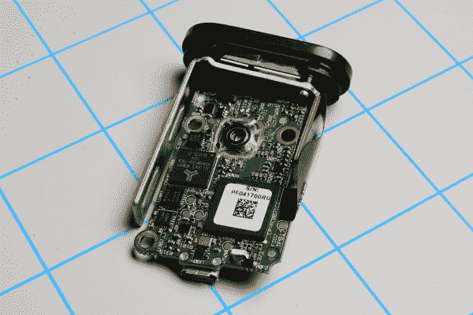
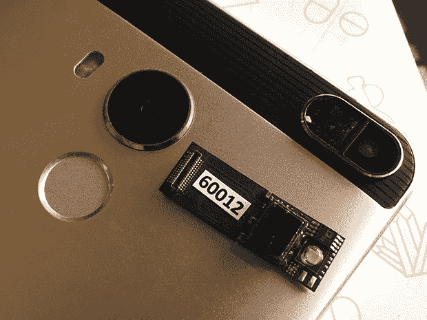

# SCiO 袖珍分子扫描仪拆卸

> 原文：<https://learn.sparkfun.com/tutorials/scio-pocket-molecular-scanner-teardown->

## 介绍

SCiO (发音为 ski-s)被宣传为“世界上第一个袖珍连接微型光谱仪。”SCiO 由总部位于旧金山和以色列的[消费物理](https://www.consumerphysics.com/business/about-consumer-physics/)公司开发，多年来一直是互联网上争论的话题。一些人称赞它试图将光谱测定法带给大众，而另一些人则声称它不可能做它所宣传的所有事情。

*The SCiO sitting on its calibration and scanning stand*

SparkFun 最近获得了一些非常实惠的光谱成像 IC，来自 [ams](http://ams.com/eng) 的 [AS7262](https://cdn.sparkfun.com/assets/parts/1/2/2/4/9/AS7262_Datasheet.pdf) 和 [AS7263](https://cdn.sparkfun.com/assets/learn_tutorials/1/4/3/AS7263_Datasheet.pdf) 。

 

将**添加到您的[购物车](https://www.sparkfun.com/cart)中！**

 **### [【spark fun 光谱传感器分线点- AS7262 可见光(Qwiic)](https://www.sparkfun.com/products/14347)

[26 available](https://learn.sparkfun.com/static/bubbles/ "26 available") SEN-14347

SparkFun AS7262 可见光谱传感器突破将光谱学带到您的手掌上，比以往任何时候都更容易…

$27.952[Favorited Favorite](# "Add to favorites") 27[Wish List](# "Add to wish list")**** 

将**添加到您的[购物车](https://www.sparkfun.com/cart)中！**

 **### 

[In stock](https://learn.sparkfun.com/static/bubbles/ "in stock") SEN-14351

SparkFun AS7263 近红外(NIR)光谱传感器突破将光谱学带到您的手掌上，使它更容易…

$27.953[Favorited Favorite](# "Add to favorites") 23[Wish List](# "Add to wish list")**** ****在摆弄了 AS7262/3 之后，我们很想知道 SCiO 等手持扫描仪中使用了什么技术，以及它是否能够真正将公民科学光谱分析带入主流。我们得到了一个 SCiO，玩了一会儿后，我们决定把它拆开，看看里面有什么。

## SCiO 背景故事

SCiO 背后的公司 Consumer Physics 在 2014 年 4 月发起了一项 Kickstarter 活动，筹集了大约 270 万美元。考虑到许多利用众筹制造类似设备的尝试都被[贴上了骗局](https://pando.com/2014/04/04/revealed-healbe-isnt-indiegogos-first-giant-medical-scam/)的标签，这是一个惊人的壮举。与之前的尝试相比，他们的活动甚至被[称赞为成功的](https://pando.com/2014/04/30/consumer-physics-kickstarter-campaign-shows-that-not-all-crowd-funding-has-to-be-a-dishonest-mystery/)。然而，这种赞扬是短暂的。

起初对该产品的厚望很快变成了愤怒。许多人[怀疑](https://www.cnet.com/news/kickstarter-science-beware-the-marketing-hype/)该设备是否能做[它所宣称的](http://spectrum.ieee.org/tech-talk/consumer-electronics/gadgets/handheld-spectroscopy-tool-lets-you-examine-the-molecular-composition-of-your-food)，在等待了两年多仍然没有收到他们承诺的 SCiO 之后，该产品的许多支持者带着他们在[的沮丧](https://techcrunch.com/2016/09/16/scio-the-pocket-sized-molecular-analyzer-is-making-everyone-angry/)来到[互联网](http://spectrum.ieee.org/the-human-os/biomedical/devices/angry-kickstarter-backers-ask-scio-wheres-my-pocketsized-molecular-sensor)。

Kickstarter 活动奖励的原始发货日期为 2014 年 10 月至 2015 年 2 月。到 2016 年底，仍有许多支持者没有收到他们的 SCiO。更糟糕的是，Kickstarter 的活动页面被关闭了，并且一直持续到今天，这切断了该公司与其支持者之间的主要沟通渠道。这最初被认为是知识产权纠纷，但后来发现原因是 SCiO 名称的商标纠纷，而不是 SCiO 使用的技术纠纷。SCiO 的首席执行官 Dror Sharon[声称](https://www.crowdfundinsider.com/2016/09/90225-consumer-physics-rep-confirms-no-intellectual-property-dispute-around-scio/)“这仅仅是关于在产品名称中使用术语‘SCiO’。传感器技术不会受到任何影响。”

该公司对他们产品的延迟交付做出了回应，声称现有技术不允许他们寻找的尺寸和价位，这导致了意外的重新设计。Sharon [表示](http://spectrum.ieee.org/the-human-os/biomedical/devices/angry-kickstarter-backers-ask-scio-wheres-my-pocketsized-molecular-sensor)“我们在 2015 年 4 月开始发货，但随着产量的增加，我们发现了一些问题——有时是我们的零件，有时是我们的设计。”

尽管遇到了各种挫折和愤怒的支持者，该公司履行了他们在 Kickstarter 上的所有承诺，SCiO 于 2016 年底/2017 年初向公众出售。还有待观察的是，是否会围绕该产品形成一个足够大的社区，将它和它的应用程序推到杂货店和家里日常使用的最前沿，或者它提供的信息是否足够有用，以至于没有理由再随身携带另一个手持设备。

## 拆箱和初步想法

SCiO 收到后立即开箱。里面是这个设备，一个兼作扫描药片等小物品外壳的支架，一个用于控制光源纯度的小遮光板，一根 microUSB 电缆和几本小册子，包括一本快速入门指南。

在拆卸之前，对 SCiO 的功能进行了测试。从一开始就对物品进行光谱扫描确实很容易，时尚的设计和小巧的外形给人留下了持久的第一印象。

然而，很快就发现交付的是一个硬件平台，只有很少的软件或应用程序支持。SCiO 应用程序虽然时尚且易于使用，但在功能性方面似乎相当贫乏。SCiO 宣传材料中承诺的许多功能非常粗糙或不存在，例如水果扫描小程序只有大约半打水果可供选择。编写用于扫描各种项目的小程序主要由用户和开发人员来完成。虽然创建自己的小程序的工具已经存在，但如果有更多的项目可供选择，那就更好了。

特别明显的是没有任何种类的植物扫描小程序。作为 SparkFun 的水生植物爱好者，这是 SCiO 最初吸引我的主要功能之一:能够扫描植物叶片并从光谱图像中获取植物健康数据。

*The SCiO app for iOS, pictured as of this writing (Courtesy [iTunes App Store](https://itunes.apple.com/us/app/scio-pocket-molecular-sensor/id1037962554?mt=8)*)

也就是说，应用程序中仍然有很多小程序可以玩。水果和蔬菜扫描仪很有趣，尽管数据库中列出的水果和蔬菜数量比预期的要少。其他含有苹果的食物包括肉、奶酪和巧克力。

身体脂肪指数小程序是另一个有趣的玩法。扫描你的皮肤并输入关于你自己的基本数据，你就可以从计算你身体脂肪百分比的设备中得到一个粗略的估计。虽然从设备传回的数据看起来可能是准确的，但很难证实。

目前看来，使用这种硬件来创建有用的应用程序是社区的事情。

## 设备拆卸

说够了...让我们进入正题，拆卸！

首先，塑料外壳被切开。这个外壳并不意味着被拆开和重新组装-至少不容易。

里面的设备没有什么特别的。三个螺钉将 LiPo 电池外壳固定在外壳上，PCB 夹在中间。唯一真正的用户界面是用于供电和扫描的大型单一按钮，用于充电的 microUSB 插槽和充电指示灯 LED。

该组件最引人注目的部分是非常大的散热器，它包裹着 PCB，并用传热粘合剂固定在图像传感器上。PCB 与传感器之间的唯一连接是一个末端带有插座连接器的扁平柔性电缆组件。

我们只剩下光秃秃的印刷电路板。它在一块小小的板上集成了大量的技术。一侧安装了大部分 IC 和用户界面按钮，以及反向安装的 LED。

另一边是传感器的插座连接器、microUSB 连接器、电池连接、蓝牙天线和其他各种零件。

## 光学传感器拆卸

是时候打开真正有趣的部分了:光学传感器。这就是 SCiO 背后的魔力，一个集成电路大小的近红外光谱仪。这种传感器完全是定制的，正如消费者物理公司的首席执行官在采访中提到的那样。传感器上最突出的标志表明，它至少部分是由台湾制造商 [Ichia](http://www.ichia.com/index.php?option=com_content&view=article&id=597&Itemid=1275&lang=en) 制造的，该公司专门生产“高端细间距柔性电路板”

注意传感器插座连接器上的连接数量，很明显他们没有低估其商业模式的“精细间距”部分。

传感器/散热器组合用另外两个螺钉连接到外壳的前面，使整个组件中使用的螺钉总数达到五个。外壳的一个很好的特点是内嵌了磁铁，这使得设备和支架之间有了磁性结合，如下图所示。

传感器被从散热器上撬开，只剩下最后一点可以拆了。使用 Dremel 和切割轮，传感器周围的环氧树脂被小心地切掉，露出其内部。

里面是一个非常复杂的多层光电二极管阵列。旁边是非常明亮的 LED 光源和一个额外的集成电路，大概是用来控制光源。

用镊子拔出光电二极管阵列的剩余层。有一个似乎是扩散层的东西:一张白纸样的材料。假设这是为了将光扩散到所有的光电二极管上。接下来，有一个过滤层，上面覆盖着 12 个感受器中的每一个，有明显不同的过滤器。下面是一个孔径层:一个非常薄的不透明层，每个接收器的孔径大小不同。

在传感器堆栈的最底部是一个透镜层:一个塑料片，有 12 个看起来相同的球形透镜指向光电二极管。

移除所有这些层后，只剩下裸露的引线键合传感器阵列，这证明了该设备的定制化。

## 集成电路

如果不看设备内部使用的电子设备，什么样的拆卸是完整的？让我们看看从 SCiO 内部的 IC 中能得到什么信息。

最大、最容易识别的 IC 是 ADI 公司的 [Blackfin ADSP-BF512 嵌入式处理器](http://www.analog.com/media/en/technical-documentation/data-sheets/ADSP-BF512_514_514F16_516_518_518F16.pdf)。

位于处理器旁边的是来自 Alliance Memory 的 AS4C8M16SA ，128 Mbits 的 SDRAM。无法识别内存旁边的其他三个 IC。

对面最大的 IC 是德州仪器的[cc 2540 f 256](http://www.ti.com/lit/ds/symlink/cc2540.pdf)2.4 GHz 蓝牙低能耗片上系统。该 IC 的走线延伸至板载天线。

### 数据矩阵

随着电子产品及其相关产品的尺寸不断缩小，这些设备上的标记也必须缩小。因此，许多产品，无论是集成电路还是塑料模制品，现在都有压印、粘贴甚至激光蚀刻的数据矩阵。这些矩阵允许大量信息存在于少量空间中。SCiO 包含在数据矩阵中，从容纳 SCiO 的外壳到扁平柔性电缆，再到其中的 IC。虽然查找这些信息没有产生任何有意义的数据(矩阵中包含的大多数信息与制造商有关，可以涉及从上传到 IC 的固件到一组模制件的批次数据的任何内容)，但查找仍然很有趣。对于那些好奇的人，这里是从每个矩阵中找到的数据:

*   ADI 公司 Blackfin IC 上的数据矩阵代码:pf 041700 ru/CP-PCA 0031-C-7/641240/6a 1
*   ichia 扁平柔性电缆上的数据矩阵代码:SF 421601 jn/CP-ma 00005-2-16/641103/921
*   SCiO 塑料盖上的数据矩阵代码:AC50160263

## 最后的想法

毫无疑问，SCiO 投入了大量的工程技术。令人印象深刻的是，这么小的一个封装中包含了这么多的技术。传感器的复杂性让我确信，这款器件比分线板上提供的光谱传感器 IC 更复杂。

也就是说，SCiO 似乎已经将重点从制造独立的扫描设备转移到创造一个足够小的组件来将其技术嵌入智能手机中。[本文](http://spectrum.ieee.org/view-from-the-valley/at-work/start-ups/israeli-startup-consumer-physics-says-its-scio-food-analyzer-is-finally-ready-for-prime-timeso-we-took-it-grocery-shopping)甚至展示了这项由消费物理学和 ADI 公司联合开发的新技术。

*Photo courtesy of Tekla Perry via [ieee.org](http://spectrum.ieee.org/view-from-the-valley/at-work/start-ups/israeli-startup-consumer-physics-says-its-scio-food-analyzer-is-finally-ready-for-prime-timeso-we-took-it-grocery-shopping)*

随着这一技术和其他技术继续默认出现在智能手机中，我们越来越接近一个真实存在的世界，其中[三录器](http://www.tricorderproject.org/)也可以打电话！

## 资源和更进一步

想看到更多的消费电子产品被拆开吗？查看这些其他伟大的 SparkFun 拆卸教程。

 [### Leap Motion 拆卸](https://learn.sparkfun.com/tutorials/leap-motion-teardown) Let's see what's inside the amazing new Leap Motion input device 6 [### MetaWatch 拆卸和 Arduino 连接](https://learn.sparkfun.com/tutorials/metawatch-teardown-and-arduino-hookup) Tearing down the nifty Bluetooth-enabled MetaWatch. Then building an Arduino sketch to control it.[Favorited Favorite](# "Add to favorites") 4 [### Nest Protect 拆除](https://learn.sparkfun.com/tutorials/nest-protect-teardown) See the inner-workings of the new Nest Protect in this SparkFun Teardown.[Favorited Favorite](# "Add to favorites") 8 [### 气泵撇油器](https://learn.sparkfun.com/tutorials/gas-pump-skimmers) Teardown of gas pump skimmers along with how to detect and block them.[Favorited Favorite](# "Add to favorites") 17****