# ESP32 环境传感器屏蔽连接指南

> 原文：<https://learn.sparkfun.com/tutorials/esp32-environment-sensor-shield-hookup-guide>

## 介绍

[ESP32 环境传感器护罩](https://www.sparkfun.com/products/14153)提供传感器和连接，用于监控环境条件。本教程将向您展示如何将您的传感器套件连接到互联网，并在线发布天气数据。

[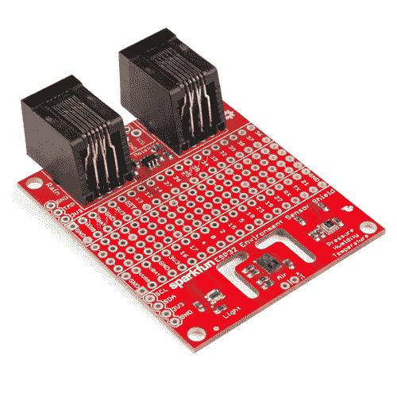](https://www.sparkfun.com/products/retired/14153) 

### [SparkFun ESP32 东西环境感应盾](https://www.sparkfun.com/products/retired/14153)

[Retired](https://learn.sparkfun.com/static/bubbles/ "Retired") DEV-14153

spark fun ESP32 Thing environmental Sensor Shield 提供用于监控环境条件的传感器和连接。

1 **Retired**[Favorited Favorite](# "Add to favorites") 8[Wish List](# "Add to wish list")

### 所需材料

你需要使用 [ESP32 东西板](https://www.sparkfun.com/products/13907)和这个护盾连接。其他微控制器板也能工作，但由于屏蔽层设计成叠在 ESP32 东西上，和它们接口会很困难。

你还需要一些方法把两块板连接在一起。虽然可以使用[可咬合的公接头引脚](https://www.sparkfun.com/products/116)将它们焊接在一起，但在其中一个电路板上使用[母接头](https://www.sparkfun.com/products/115)是很有意义的，这样如果需要，电路板可以在以后再次分离。

[](https://www.sparkfun.com/products/13907) 

将**添加到您的[购物车](https://www.sparkfun.com/cart)中！**

### [SparkFun ESP32 东西](https://www.sparkfun.com/products/13907)

[In stock](https://learn.sparkfun.com/static/bubbles/ "in stock") DEV-13907

SparkFun ESP32 Thing 是 Espressif 的 ESP32 的综合开发平台，ESP32 是他们的超级充电版本…

$23.5069[Favorited Favorite](# "Add to favorites") 83[Wish List](# "Add to wish list")****[](https://www.sparkfun.com/products/116) 

将**添加到您的[购物车](https://www.sparkfun.com/cart)中！**

### [破开头球——直击](https://www.sparkfun.com/products/116)

[In stock](https://learn.sparkfun.com/static/bubbles/ "in stock") PRT-00116

一排标题-打破适应。40 个引脚，可切割成任何尺寸。用于定制 PCB 或通用定制接头。

$1.7520[Favorited Favorite](# "Add to favorites") 133[Wish List](# "Add to wish list")****[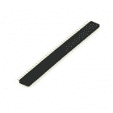](https://www.sparkfun.com/products/115) 

将**添加到您的[购物车](https://www.sparkfun.com/cart)中！**

### [女标题](https://www.sparkfun.com/products/115)

[In stock](https://learn.sparkfun.com/static/bubbles/ "in stock") PRT-00115

单排 40 孔，内螺纹接头。可以用一把钢丝钳切割成合适的尺寸。标准 0.1 英寸间距。我们广泛使用它们…

$1.758[Favorited Favorite](# "Add to favorites") 71[Wish List](# "Add to wish list")****** ******ESP32 环境传感器护罩带有与我们的[气象站](https://www.sparkfun.com/products/8942)的连接。您可能还希望添加一个[土壤湿度传感器](https://www.sparkfun.com/products/13322)，您需要两个[三位 3.5 毫米螺丝端子](https://www.sparkfun.com/products/8235)和足够的[导线](https://www.sparkfun.com/products/11375)将传感器连接到电路板。

[](https://www.sparkfun.com/products/13322) 

将**添加到您的[购物车](https://www.sparkfun.com/cart)中！**

### [SparkFun 土壤水分传感器](https://www.sparkfun.com/products/13322)

[In stock](https://learn.sparkfun.com/static/bubbles/ "in stock") SEN-13322

用于测量土壤和类似材料中水分的简单装置。裸露焊盘共同充当一个阀门…

$6.5016[Favorited Favorite](# "Add to favorites") 74[Wish List](# "Add to wish list")****[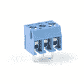](https://www.sparkfun.com/products/8235) 

将**添加到您的[购物车](https://www.sparkfun.com/cart)中！**

### [](https://www.sparkfun.com/products/8235)螺距 3.5mm 的螺丝端子(3 针)

[In stock](https://learn.sparkfun.com/static/bubbles/ "in stock") PRT-08235

将端子 3.5 毫米节距销与滑动锁紧装置拧在一起，形成您需要的任何尺寸。额定高达 125V @ 6A，并可接受…

$1.05[Favorited Favorite](# "Add to favorites") 20[Wish List](# "Add to wish list")****[](https://www.sparkfun.com/products/retired/8942) 

### [气象仪](https://www.sparkfun.com/products/retired/8942)

[Retired](https://learn.sparkfun.com/static/bubbles/ "Retired") SEN-08942

无论你是农学家、专业气象学家还是气象爱好者，建立自己的气象站都可以…

26 **Retired**[Favorited Favorite](# "Add to favorites") 84[Wish List](# "Add to wish list")**** ****### 工具

至少，你需要一个[烙铁](https://www.sparkfun.com/products/9507)和一些[焊料](https://www.sparkfun.com/products/9163)。您可能需要一把小螺丝刀将电线连接到土壤湿度传感器和传感器护罩之间的螺丝端子上。我们的[袖珍螺丝刀](https://www.sparkfun.com/products/12891)和[螺丝刀套件](https://www.sparkfun.com/products/10865)都有适合这种用途的钻头。它们也便于随身携带！

[](https://www.sparkfun.com/products/12891) 

将**添加到您的[购物车](https://www.sparkfun.com/cart)中！**

### [袖珍螺丝刀套装](https://www.sparkfun.com/products/12891)

[In stock](https://learn.sparkfun.com/static/bubbles/ "in stock") TOL-12891

每个黑客都应该拥有什么？没错，一把螺丝刀(你必须以某种方式进入那些箱子)。什么…

$4.505[Favorited Favorite](# "Add to favorites") 24[Wish List](# "Add to wish list")****[](https://www.sparkfun.com/products/9163) 

将**添加到您的[购物车](https://www.sparkfun.com/cart)中！**

### [无铅焊料- 15 克管](https://www.sparkfun.com/products/9163)

[In stock](https://learn.sparkfun.com/static/bubbles/ "in stock") TOL-09163

这是你的无铅焊料的基本管，带有不干净的水溶性树脂芯。0.031 英寸规格，15 克

$3.954[Favorited Favorite](# "Add to favorites") 14[Wish List](# "Add to wish list")****[](https://www.sparkfun.com/products/10865) 

将**添加到您的[购物车](https://www.sparkfun.com/cart)中！**

### [工具箱-螺丝刀和钻头套装](https://www.sparkfun.com/products/10865)

[Out of stock](https://learn.sparkfun.com/static/bubbles/ "out of stock") TOL-10865

没有什么比准备好一个好的黑客攻击，然后意识到你甚至不能打开盒子，因为你…

$10.957[Favorited Favorite](# "Add to favorites") 27[Wish List](# "Add to wish list")****[](https://www.sparkfun.com/products/9507) 

将**添加到您的[购物车](https://www.sparkfun.com/cart)中！**

### [烙铁- 30W(美国，110V)](https://www.sparkfun.com/products/9507)

[33 available](https://learn.sparkfun.com/static/bubbles/ "33 available") TOL-09507

这是一个非常简单的固定温度，快速加热，30W 110/120 VAC 烙铁。我们真的很喜欢使用更贵的 iro…

$10.957[Favorited Favorite](# "Add to favorites") 21[Wish List](# "Add to wish list")******** ********### 推荐阅读

如果您尚未使用 ESP32 Thing 开发板，请先查看本指南。

[](https://learn.sparkfun.com/tutorials/esp32-thing-hookup-guide) [### ESP32 事物连接指南

#### 2016 年 10 月 27 日](https://learn.sparkfun.com/tutorials/esp32-thing-hookup-guide) An introduction to the ESP32 Thing's hardware features, and a primer on using the WiFi system-on-chip in Arduino.[Favorited Favorite](# "Add to favorites") 22

如果您打算将风雨[气象计](https://www.sparkfun.com/products/8942)与您的 ESP32 环境传感器屏蔽一起使用，请查看我们的气象计组装指南。

[](https://learn.sparkfun.com/tutorials/weather-meter-hookup-guide) [### 气象计连接指南

#### 2017 年 7 月 20 日](https://learn.sparkfun.com/tutorials/weather-meter-hookup-guide) How to assemble your very own weather meter 10

如果您不熟悉以下概念，我们建议您在继续之前查看这些教程。

[](https://learn.sparkfun.com/tutorials/how-to-solder-through-hole-soldering) [### 如何焊接:通孔焊接](https://learn.sparkfun.com/tutorials/how-to-solder-through-hole-soldering) This tutorial covers everything you need to know about through-hole soldering.[Favorited Favorite](# "Add to favorites") 70[](https://learn.sparkfun.com/tutorials/analog-to-digital-conversion) [### 模数转换](https://learn.sparkfun.com/tutorials/analog-to-digital-conversion) The world is analog. Use analog to digital conversion to help digital devices interpret the world.[Favorited Favorite](# "Add to favorites") 58[](https://learn.sparkfun.com/tutorials/i2c) [### I2C](https://learn.sparkfun.com/tutorials/i2c) An introduction to I2C, one of the main embedded communications protocols in use today.[Favorited Favorite](# "Add to favorites") 128

## 硬件概述

ESP32 环境传感器屏蔽包括三个传感器，能够测量五种不同的环境变量。如果需要，它还可以连接其他几个传感器。

### 车载传感器

所有车载传感器都通过 I ² C 连接与 ESP32 相连。

#### 压力、湿度和温度

第一个车载传感器是博世 BME280。该传感器测量相对湿度、温度和大气压力。电路板背面有一个焊接跳线(标为 JP1 ),关闭该跳线可以更改芯片的 I ² C 地址。默认情况下，地址是 0x77 关闭跳线会强制地址为 0x76。

[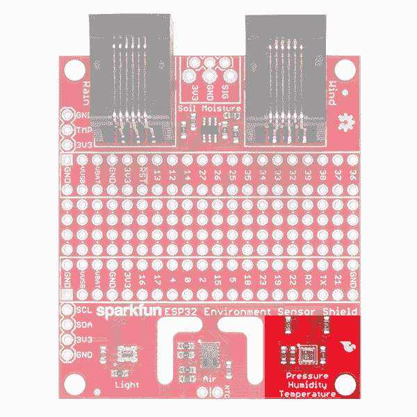](https://cdn.sparkfun.com/assets/learn_tutorials/6/4/9/14153-04_PressureHumidityTemp.png)

#### 空气质量和温度

接下来是 ams CCS811 空气质量和温度传感器。请注意该传感器周围的布线区域。这为 PCB 其余部分的电路所激发的热变化提供了缓冲。与 BME280 一样，可以更改该传感器的 I ² C 地址。关闭电路板背面的跳线 JP2 会导致传感器采用地址 0x5A，默认情况下为 0x5B。

[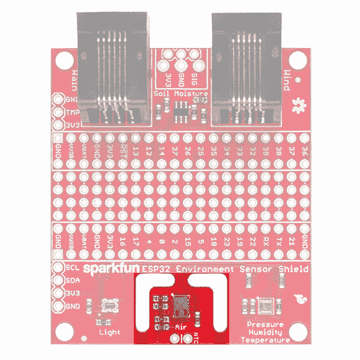](https://cdn.sparkfun.com/assets/learn_tutorials/6/4/9/14153-04_AirQualityTemp.png)

#### 光度

最后一个板载传感器是博通 APDS-9301。它能够检测和读取从夜间到白天的光线水平。请记住，如果直接暴露在阳光下，传感器将会饱和。默认情况下，传感器的 I ² C 地址为 0x39。通过在电路板背面标有 JP3 的跳线焊盘上增加一条朝向 0 的跳线，可以将地址更改为 0x29。通过向 1 添加一个跳线，可以将地址设置为 0x49。

[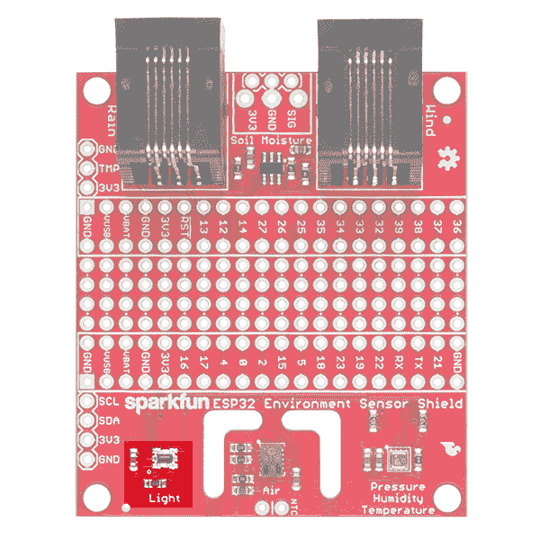](https://cdn.sparkfun.com/assets/learn_tutorials/6/4/9/14153-04_Luminosity.png)

### 电路板背面的跳线

板子的背面有五根跳线。

[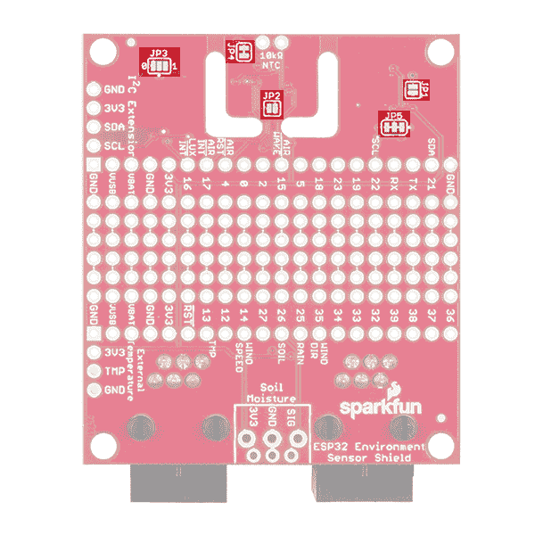](https://cdn.sparkfun.com/assets/learn_tutorials/6/4/9/14153-BottomJumpers.png)

他们是这样做的:

**JP1** -用焊料滴封闭该跳线，将 BME280 传感器的 I2C 地址从 0x77 更改为 0x76。
**【JP2】**——用一个焊点封闭这个跳线，将 CCS811 传感器的 I2C 地址从 0x5B 改为 0x5A。
**JP3** -用焊料滴封闭该跳线的 0 半部分，以将 APDS-9301 传感器的地址设置为 0x29。关闭此跳线的一半，将地址设置为 0x49。如果您不小心桥接了整个跳线，地址将是 0x29，但不会发生任何不好的事情。
**JP4** -切断该轨迹，禁用 CCS811 用于温度补偿的板载 NTC 热敏电阻。**如果这样做，您必须为 CCS811 添加一个外部 NTC 热敏电阻才能正常工作。**
**JP5** -切断该跳线上的走线，禁用 I2C 总线的上拉电阻。

### 可选的非车载传感器

还有五个非车载传感器的连接:风速和风向、降雨量、温度和土壤湿度。

#### 风速和风向

与 SparkFun 的气象站相结合，可以通过计算每秒的脉冲数和测量离散阶跃电位计的电阻来测量风速和风向。这两个功能的引脚连接到 ESP32 的 14 号(速度)和 35 号(方向)引脚。

[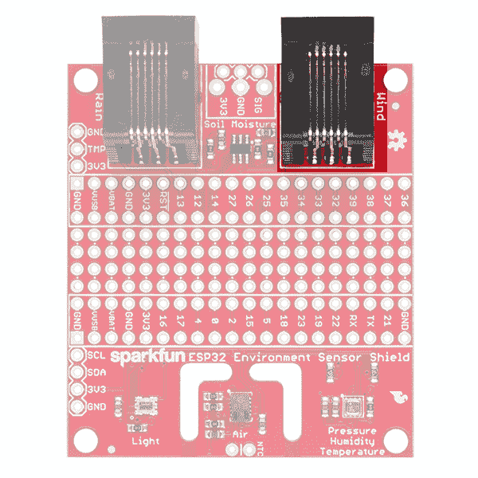](https://cdn.sparkfun.com/assets/learn_tutorials/6/4/9/14153-04_Wind.png)

每秒一个滴答对应于 1.492 英里/小时(2.40 千米/小时)的风速。显然，气压计的方位决定了给定位置的阻力。有 16 个位置可用，每个位置对应的电压可以在[气象计数据表](https://www.sparkfun.com/datasheets/Sensors/Weather/Weather%20Sensor%20Assembly..pdf)的第 2 页找到。我们的示例代码也为您提供了一个使用方向传感器的可靠示例。

#### 土壤湿度

SparkFun 的土壤湿度传感器可以连接到防护罩上，并通过模拟电压转换进行监控。传感器连接到 ESP32 的 26 号插脚。

[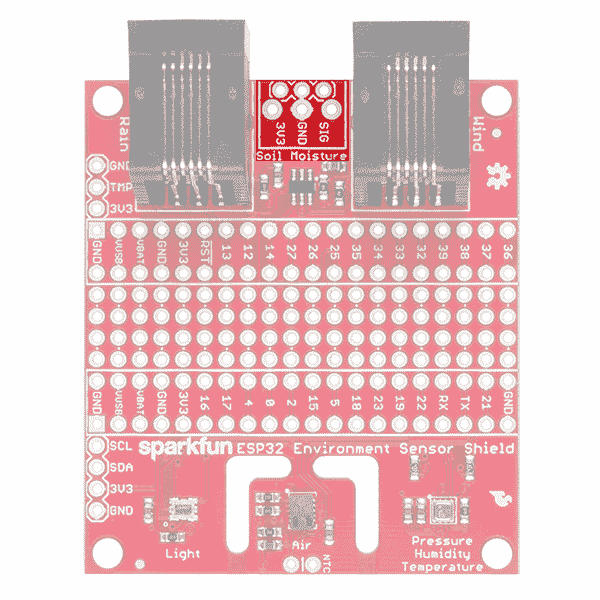](https://cdn.sparkfun.com/assets/learn_tutorials/6/4/9/14153-04_SoilMoisture.png)

#### 降雨

气象站也会给你提供雨量计。与风速表非常相似，雨量计产生滴答声来记录降雨量。计数滴答声以确定最近的降雨量。每个刻度代表 0.011 英寸(0.28 毫米)的降雨量。该传感器连接到 ESP32 的针脚 25。

[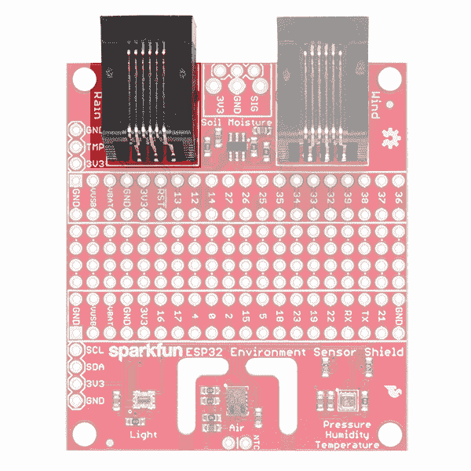](https://cdn.sparkfun.com/assets/learn_tutorials/6/4/9/14153-04_Rain.png)

#### 外界温度

如果您愿意，可以将我们的一个 TMP36 外部温度传感器连接到电路板的这个位置。通过一根短线连接它，您就可以测量系统其余部分所在外壳的温度。它采用 10mV/℃它连接到 ESP32 的引脚 13。

[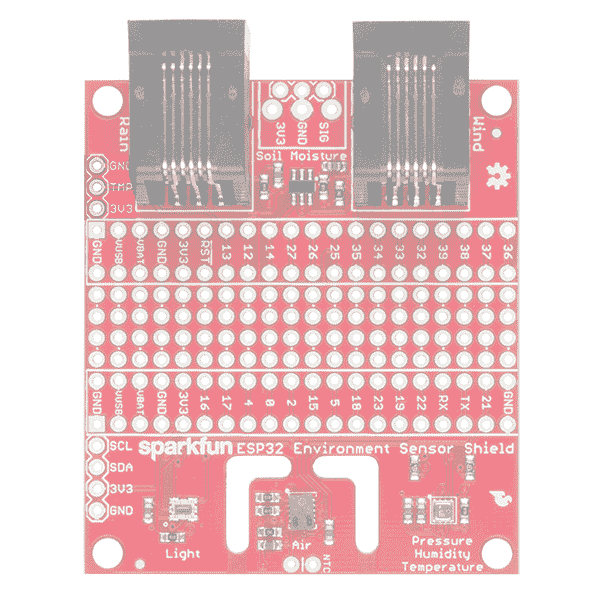](https://cdn.sparkfun.com/assets/learn_tutorials/6/4/9/14153-04_ExtTemp.png)

#### 任何 I2C 传感器

我们提供了一个接头，允许您连接您认为对主板有用的任何其他 I2C 传感器或设备。事实上，这种接头的引出线是这样的，许多 SparkFun I2C 板可以直接连接，而无需任何电线顺序的变化！

[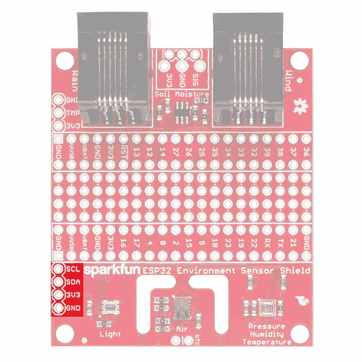](https://cdn.sparkfun.com/assets/learn_tutorials/6/4/9/14153-04_AnyI2C.png)

## 硬件装配

如前所述，使用接头(公接头和母接头)连接两块电路板是个好主意。在这里，我们将向您展示一种防爆方法来焊接接头，并确保它们是正确的和方形的，以便更容易连接(和断开)两块电路板。

### 修剪页眉

当你购买[公头](https://www.sparkfun.com/products/116)和[母头](https://www.sparkfun.com/products/115)时，它们对于 ESP32 东西和环境传感器屏蔽来说太长了。你需要把它们修剪到合适的长度。这意味着每个有 20 个引脚。

对于公接头来说，这相对容易——它们被设计成被修剪或按长度咬合。它们有 40 个位置，所以你只需要订购一个，然后对折。

[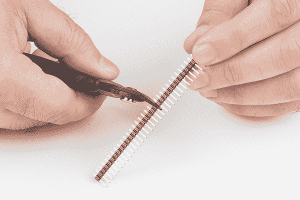](https://cdn.sparkfun.com/assets/learn_tutorials/6/4/9/ESP32_shield_hookup_guide-01.jpg)

然而，对于女性来说，事情就有点棘手了。为了修剪到合适的长度，你会失去一个引脚，因为这些来在 40 个位置的作品。这意味着你需要订购**两个**这样才能得到两个 20 位的棋子，你还剩下两个 19 位的棋子。很遗憾，我知道。

修剪母接头件的最佳方法是数出 20 个销，拔出第 21 个销，然后使用侧切割器切割第 20 个和第 22 个销之间的间隙。

[](https://cdn.sparkfun.com/assets/learn_tutorials/6/4/9/ESP32_shield_hookup_guide-02.jpg)

切割割台以使剪口居中时，你必须小心。偏离中心的切口可能导致收割台的机械部分脱离或失去一些保持力。

[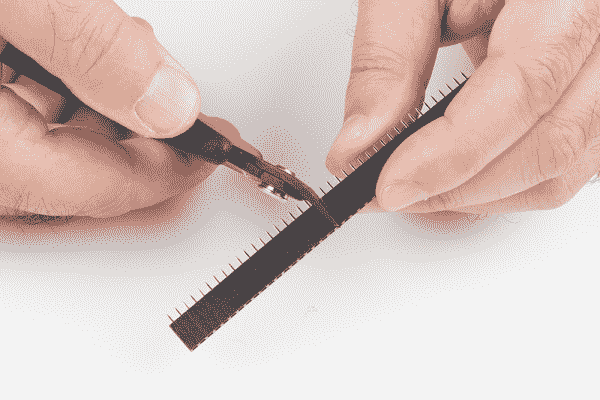](https://cdn.sparkfun.com/assets/learn_tutorials/6/4/9/ESP32_shield_hookup_guide-03.jpg)

或者，你可以用一把锉刀、一张砂纸或其他打磨/研磨工具打磨头部末端，使其更加光滑。你可以同时做两件作品，把它们放在一起，在抛光面上摩擦末端。

### 安装外螺纹接头

我们将首先在 ESP32 主板上安装公接头。我们将“正面朝上”安装，接头从电路板上没有元件的一侧向下延伸。这比另一种方法更容易，因为当从电路板的元件侧尝试这种方法时，该侧的连接器会产生一个困难的间隙。

首先，将您的插头长面朝下插入试验板，如下所示。您可以看到，我们将标题插入到边缘的第二列，即我们在这里使用的试验板上标记为 B 和 I 的列。

[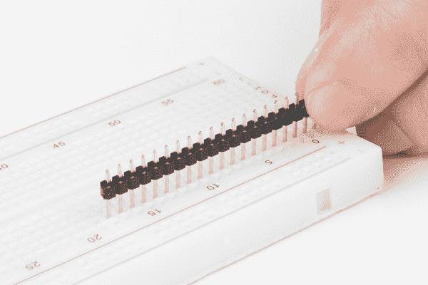](https://cdn.sparkfun.com/assets/learn_tutorials/6/4/9/ESP32_shield_hookup_guide-04.jpg)

现在，安装了接头，您可以轻松地将 ESP32 东西板放在它们上面。

[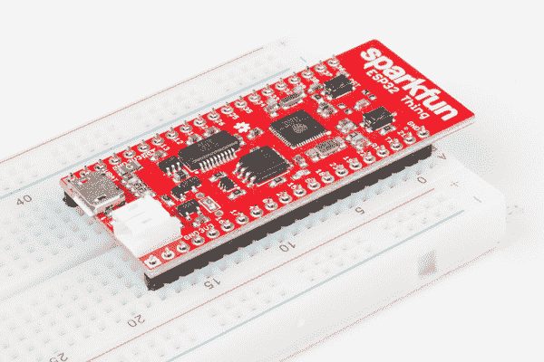](https://cdn.sparkfun.com/assets/learn_tutorials/6/4/9/ESP32_shield_hookup_guide-05.jpg)

继续把所有的引脚焊接到 ESP32 上。

[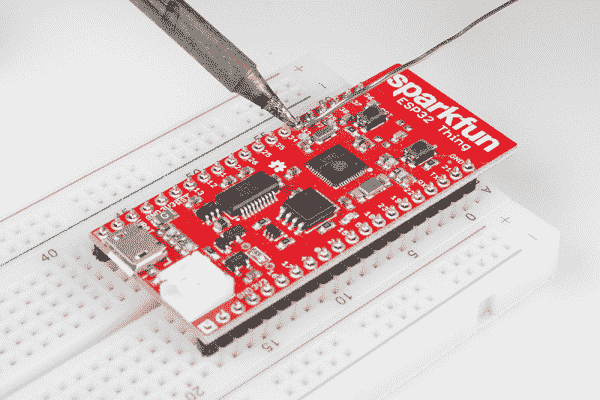](https://cdn.sparkfun.com/assets/learn_tutorials/6/4/9/ESP32_shield_hookup_guide-06.jpg)If you're new to soldering, check out our [through-hole soldering tutorial.](https://learn.sparkfun.com/tutorials/how-to-solder-through-hole-soldering) We'll wait here.

如果您是焊接新手，您可能希望只焊接每侧的第一个和最后一个位置，然后将电路板从试验板上拔出，以避免热损坏您的试验板。您可能会发现，在 ESP32 的末端下方插入一把平头螺丝刀，然后转动螺丝刀的手柄，轻轻**将电路板从试验板上撬起，会更容易将电路板从试验板上拆下。**

[](https://cdn.sparkfun.com/assets/learn_tutorials/6/4/9/ESP32_shield_hookup_guide-07.jpg)

### 安装内螺纹接头

现在我们需要将母接头安装到 ESP32 环境传感器护罩上。我们将使用刚刚焊接到 ESP32 上的引脚来实现这一点。

把你的母接头放在 ESP32 的公接头上，如图所示。

[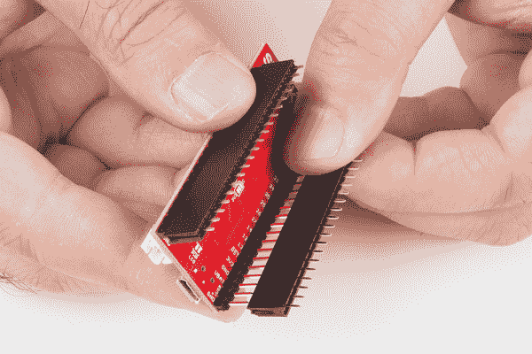](https://cdn.sparkfun.com/assets/learn_tutorials/6/4/9/ESP32_shield_hookup_guide-08.jpg)

因为我们使用试验板来保持我们的引脚完全垂直于 ESP32 东西板，所以母接头的引脚应该与 ESP32 环境传感器屏蔽上的孔完全对齐。

[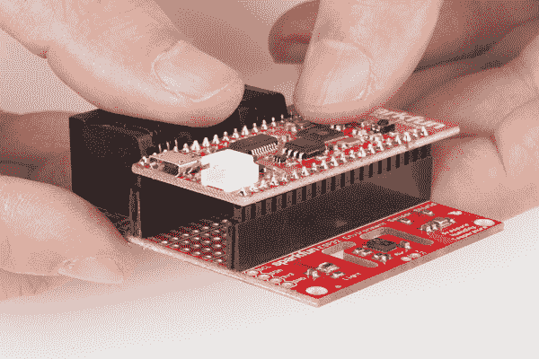](https://cdn.sparkfun.com/assets/learn_tutorials/6/4/9/ESP32_shield_hookup_guide-10.jpg)**Be certain you've placed the shield in the proper orientation! The component side of the shield should be facing the non-component side of the ESP32 Thing! Double check that the pin labels on the shield match those on the ESP32 Thing! Failure to observe these facing rules will make everything horrible and nothing will work!**

焊接母头引脚之前，翻转电路板。

[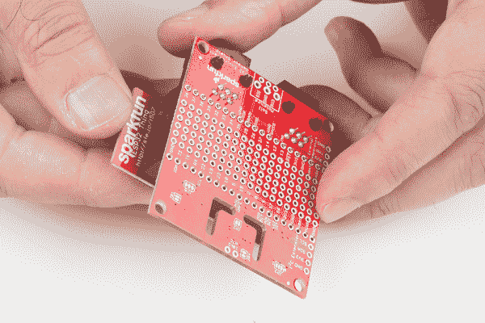](https://cdn.sparkfun.com/assets/learn_tutorials/6/4/9/ESP32_shield_hookup_guide-09.jpg)

现在，您可以将母头引脚焊接到 ESP32 环境传感器屏蔽上，就像 ESP32 的公头引脚一样。

## 软件

除了 [ESP32 Arduino 核心](https://learn.sparkfun.com/tutorials/esp32-thing-hookup-guide?_ga=2.108672706.1377919567.1499096011-84620802.1496420289#installing-the-esp32-arduino-core)，ESP32 环境传感器屏蔽还需要 [CCS811](https://github.com/sparkfun/SparkFun_CCS811_Arduino_Library) 、 [BME280](https://github.com/sparkfun/SparkFun_BME280_Arduino_Library) 和 [APDS-9301](https://github.com/sparkfun/SparkFun_APDS9301_Library) Arduino 库。请确保从各个 GitHub 库获取库，或者您可以直接从下面的按钮下载文件:

[SparkFun CCS811 Arduino Library](https://github.com/sparkfun/SparkFun_CCS811_Arduino_Library/archive/master.zip)[SparkFun BME280 Arduino Library](https://github.com/sparkfun/SparkFun_BME280_Arduino_Library/archive/master.zip)[SparkFun APDS-9301 Arduino Library](https://github.com/sparkfun/SparkFun_APDS9301_Library/archive/master.zip)

**注意:**此示例假设您在桌面上使用的是最新版本的 Arduino IDE。如果这是你第一次使用 Arduino，请回顾我们关于[安装 Arduino IDE 的教程。](https://learn.sparkfun.com/tutorials/installing-arduino-ide)如果您之前没有安装 Arduino 库，请查看我们的[安装指南。](https://learn.sparkfun.com/tutorials/installing-an-arduino-library)

如果你还没有，确保[用 Wunderground 设置你自己的气象站](https://www.wunderground.com/weatherstation/hardwareandsoftware.asp)。您需要填写一张表格，并选择一个用户名&密码，以便获得一个电台 ID。来自 ESP32 Thing 和 ESP32 Environment Sensor Shield 的传感器数据可以被推送到 Wunderground 的服务器上。

在这里，我们展示了一些 ESP32 环境传感器屏蔽的示例代码。这段代码读取所有传感器，每秒钟将结果数据打印到串行端口一次，然后每分钟将一些更相关的数据发送到 Weather Underground。

```
language:c
#include <SparkFunCCS811.h>
#include "SparkFunBME280.h"
#include "Wire.h"
#include <Sparkfun_APDS9301_Library.h>
#include <WiFi.h>

BME280 bme;
CCS811 ccs(0x5B);
APDS9301 apds;

// Variables for wifi server setup 
const char* ssid     = "your_ssid_here";
const char* password = "password"; 
String ID = "wunderground_station_id";
String key = "wunderground_station_key";  
WiFiClient client;
const int httpPort = 80;
const char* host = "weatherstation.wunderground.com";

// Variables and constants used in calculating the windspeed.
volatile unsigned long timeSinceLastTick = 0;
volatile unsigned long lastTick = 0;

// Variables and constants used in tracking rainfall
#define S_IN_DAY   86400
#define S_IN_HR     3600
#define NO_RAIN_SAMPLES 2000
volatile long rainTickList[NO_RAIN_SAMPLES];
volatile int rainTickIndex = 0;
volatile int rainTicks = 0;
int rainLastDay = 0;
int rainLastHour = 0;
int rainLastHourStart = 0;
int rainLastDayStart = 0;
long secsClock = 0;

String windDir = "";
float windSpeed = 0.0;

// Pin assignment definitions
#define WIND_SPD_PIN 14
#define RAIN_PIN     25
#define WIND_DIR_PIN 35
#define AIR_RST      4
#define AIR_WAKE     15
#define DONE_LED     5

void setup() 
{
  delay(5);    // The CCS811 wants a brief delay after startup.
  Serial.begin(115200);
  Wire.begin();

  pinMode(DONE_LED, OUTPUT);
  digitalWrite(DONE_LED, LOW);

  // Wind speed sensor setup. The windspeed is calculated according to the number
  //  of ticks per second. Timestamps are captured in the interrupt, and then converted
  //  into mph. 
  pinMode(WIND_SPD_PIN, INPUT);     // Wind speed sensor
  attachInterrupt(digitalPinToInterrupt(WIND_SPD_PIN), windTick, RISING);

  // Rain sesnor setup. Rainfall is tracked by ticks per second, and timestamps of
  //  ticks are tracked so rainfall can be "aged" (i.e., rain per hour, per day, etc)
  pinMode(RAIN_PIN, INPUT);     // Rain sensor
  attachInterrupt(digitalPinToInterrupt(RAIN_PIN), rainTick, RISING);
  // Zero out the timestamp array.
  for (int i = 0; i < NO_RAIN_SAMPLES; i++) rainTickList[i] = 0;

  // BME280 sensor setup - these are fairly conservative settings, suitable for
  //  most applications. For more information regarding the settings available
  //  for the BME280, see the example sketches in the BME280 library.
  bme.settings.commInterface = I2C_MODE;
  bme.settings.I2CAddress = 0x77;
  bme.settings.runMode = 3;
  bme.settings.tStandby = 0;
  bme.settings.filter = 0;
  bme.settings.tempOverSample = 1;
  bme.settings.pressOverSample = 1;
  bme.settings.humidOverSample = 1;
  bme.begin();

  // CCS811 sensor setup.
  pinMode(AIR_WAKE, OUTPUT);
  digitalWrite(AIR_WAKE, LOW);
  pinMode(AIR_RST, OUTPUT);
  digitalWrite(AIR_RST, LOW);
  delay(10);
  digitalWrite(AIR_RST, HIGH);
  delay(100);
  ccs.begin();

  // APDS9301 sensor setup. Leave the default settings in place.
  apds.begin(0x39);

  // Connect to WiFi network
  Serial.print("Connecting to ");
  Serial.println(ssid);

  WiFi.begin(ssid, password);

  while (WiFi.status() != WL_CONNECTED) {
      delay(500);
      Serial.print(".");
  }
  Serial.println("");
  Serial.println("WiFi connected");
  Serial.println("IP address: ");
  Serial.println(WiFi.localIP());

  // Visible WiFi connected signal for when serial isn't connected
  digitalWrite(DONE_LED, HIGH);
}

void loop() 
{
  static unsigned long outLoopTimer = 0;
  static unsigned long wundergroundUpdateTimer = 0;
  static unsigned long clockTimer = 0;
  static unsigned long tempMSClock = 0;

  // Create a seconds clock based on the millis() count. We use this
  //  to track rainfall by the second. We've done this because the millis()
  //  count overflows eventually, in a way that makes tracking time stamps
  //  very difficult.
  tempMSClock += millis() - clockTimer;
  clockTimer = millis();
  while (tempMSClock >= 1000)
  {
    secsClock++;
    tempMSClock -= 1000;
  }

  // This is a once-per-second timer that calculates and prints off various
  //  values from the sensors attached to the system.
  if (millis() - outLoopTimer >= 2000)
  {
    outLoopTimer = millis();

    Serial.print("\nTimestamp: ");
    Serial.println(secsClock);

    // Windspeed calculation, in mph. timeSinceLastTick gets updated by an
    //  interrupt when ticks come in from the wind speed sensor.
    if (timeSinceLastTick != 0) windSpeed = 1000.0/timeSinceLastTick;
    Serial.print("Windspeed: ");
    Serial.print(windSpeed*1.492);
    Serial.println(" mph");

    // Update temperature. This also updates compensation values used to
    //  calculate other parameters.
    Serial.print("Temperature: ");
    Serial.print(bme.readTempF(), 2);
    Serial.println(" degrees F");

    // Display relative humidity.
    Serial.print("%RH: ");
    Serial.print(bme.readFloatHumidity(), 2);
    Serial.println(" %");

    // Display pressure.
    Serial.print("Pres: ");
    Serial.print(bme.readFloatPressure() * 0.0002953);
    Serial.println(" in");

    // Calculate the wind direction and display it as a string.
    Serial.print("Wind dir: ");
    windDirCalc(analogRead(WIND_DIR_PIN));
    Serial.print("  ");
    Serial.println(windDir);

    // Calculate and display rainfall totals.
    Serial.print("Rainfall last hour: ");
    Serial.println(float(rainLastHour)*0.011, 3);
    Serial.print("Rainfall last day: ");
    Serial.println(float(rainLastDay)*0.011, 3);
    Serial.print("Rainfall to date: ");
    Serial.println(float(rainTicks)*0.011, 3);

    // Trigger the CCS811's internal update procedure, then
    //  dump the values to the serial port.
    ccs.readAlgorithmResults();

    Serial.print("CO2: ");
    Serial.println(ccs.getCO2());

    Serial.print("tVOC: ");
    Serial.println(ccs.getTVOC());

    Serial.print("Luminous flux: ");
    Serial.println(apds.readLuxLevel(),6);

    // Calculate the amount of rain in the last day and hour.
    rainLastHour = 0;
    rainLastDay = 0;
    // If there are any captured rain sensor ticks...
    if (rainTicks > 0)
    {
      // Start at the end of the list. rainTickIndex will always be one greater
      //  than the number of captured samples.
      int i = rainTickIndex-1;

      // Iterate over the list and count up the number of samples that have been
      //  captured with time stamps in the last hour.
      while ((rainTickList[i] >= secsClock - S_IN_HR) && rainTickList[i] != 0)
      {
        i--;
        if (i < 0) i = NO_RAIN_SAMPLES-1;
        rainLastHour++;
      }

      // Repeat the process, this time over days.
      i = rainTickIndex-1;
      while ((rainTickList[i] >= secsClock - S_IN_DAY) && rainTickList[i] != 0)
      {
        i--;
        if (i < 0) i = NO_RAIN_SAMPLES-1;
        rainLastDay++;
      }
      rainLastDayStart = i;
    }
  }

  // Update wunderground once every sixty seconds.
  if (millis() - wundergroundUpdateTimer >= 60000)
  {

  wundergroundUpdateTimer = millis();
    // Set up the generic use-every-time part of the URL
    String url = "/weatherstation/updateweatherstation.php";
    url += "?ID=";
    url += ID;
    url += "&PASSWORD=";
    url += key;
    url += "&dateutc=now&action=updateraw";

    // Now let's add in the data that we've collected from our sensors
    // Start with rain in last hour/day
    url += "&rainin=";
    url += rainLastHour;
    url += "&dailyrainin=";
    url += rainLastDay;

    // Next let's do wind
    url += "&winddir=";
    url += windDir;
    url += "&windspeedmph=";
    url += windSpeed;

    // Now for temperature, pressure and humidity.
    url += "&tempf=";
    url += bme.readTempF();
    url += "&humidity=";
    url += bme.readFloatHumidity();
    url += "&baromin=";
    float baromin = 0.0002953 * bme.readFloatPressure();
    url += baromin;

    // Connnect to Weather Underground. If the connection fails, return from
    //  loop and start over again.
    if (!client.connect(host, httpPort))
    {
      Serial.println("Connection failed");
      return;
    }
    else
    {
      Serial.println("Connection succeeded");
    }

    // Issue the GET command to Weather Underground to post the data we've 
    //  collected.
    client.print(String("GET ") + url + " HTTP/1.1\r\n" +
                 "Host: " + host + "\r\n" +
                 "Connection: close\r\n\r\n");

    // Give Weather Underground five seconds to reply.
    unsigned long timeout = millis();
    while (client.available() == 0) 
    {
      if (millis() - timeout > 5000) 
      {
          Serial.println(">>> Client Timeout !");
          client.stop();
          return;
      }
    }

    // Read the response from Weather Underground and print it to the console.
    while(client.available()) 
    {
      String line = client.readStringUntil('\r');
      Serial.print(line);
    }
  }
}

// Keep track of when the last tick came in on the wind sensor.
void windTick(void)
{
  timeSinceLastTick = millis() - lastTick;
  lastTick = millis();
}

// Capture timestamp of when the rain sensor got tripped.
void rainTick(void)
{
  rainTickList[rainTickIndex++] = secsClock;
  if (rainTickIndex == NO_RAIN_SAMPLES) rainTickIndex = 0;
  rainTicks++;
}

// For the purposes of this calculation, 0deg is when the wind vane
//  is pointed at the anemometer. The angle increases in a clockwise
//  manner from there.
void windDirCalc(int vin)
{
  if      (vin < 150) windDir="202.5";
  else if (vin < 300) windDir = "180";
  else if (vin < 400) windDir = "247.5";
  else if (vin < 600) windDir = "225";
  else if (vin < 900) windDir = "292.5";
  else if (vin < 1100) windDir = "270";
  else if (vin < 1500) windDir = "112.5";
  else if (vin < 1700) windDir = "135";
  else if (vin < 2250) windDir = "337.5";
  else if (vin < 2350) windDir = "315";
  else if (vin < 2700) windDir = "67.5";
  else if (vin < 3000) windDir = "90";
  else if (vin < 3200) windDir = "22.5";
  else if (vin < 3400) windDir = "45";
  else if (vin < 4000) windDir = "0";
  else windDir = "0";
} 
```

**注意:**当连接到 WiFi 网络和地下服务器时，请务必修改变量`ssid`、`password`、`ID`和`key`。

#### 预期产出

下面是您启动 ESP32 并让它连接到 WiFi 时应该会看到的画面:

[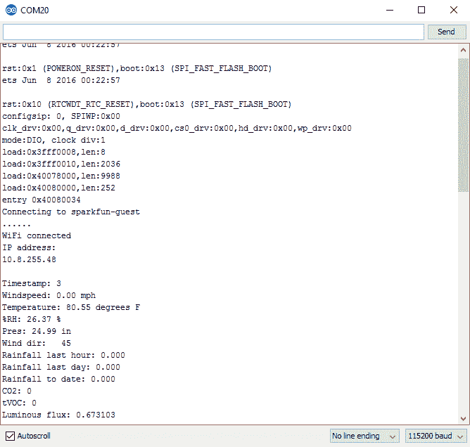](https://cdn.sparkfun.com/assets/learn_tutorials/6/4/9/output.png)

前几行只是来自 ESP32 的诊断信息，无论应用程序正在运行，它们都会在启动时出现。在“连接到 sparkfun-guest”行的正下方，您会看到一系列的点。当连接挂起时，每半秒钟就会出现一个点，因此您可以从这个示例中看到，WiFi 上线大约需要 3 秒钟。之后，我们看到的各种环境参数被打印出来，还有一个自平台启动以来的时间戳。

来自传感器的数据流每分钟都会被与 weatherunderground.com 服务器的连接中断一次。下面是输出的样子:

[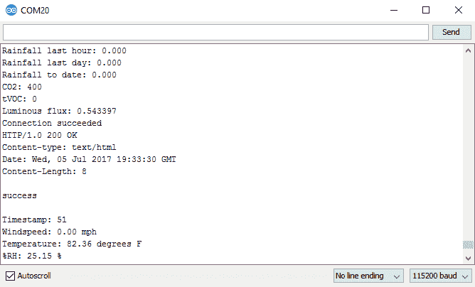](https://cdn.sparkfun.com/assets/learn_tutorials/6/4/9/output_connect.png)

这里有两条有用的数据。第一个显示“连接成功”，表明已经成功连接到 Weather Underground 服务器。如果您的互联网连接中断，此操作将会失败。

第二行只有一行写着“成功”。这是您尝试向服务器发送数据后服务器的响应。如果失败，这意味着您连接到了服务器，但是您格式化发送到服务器的字符串格式不正确。这应该不是问题，除非您更改示例代码。

## 资源和更进一步

有关更多信息，请查看以下资源:

*   [GitHub 库:ESP32 环境传感器屏蔽](https://github.com/sparkfun/ESP32_Environment_Sensor_Shield) -设计文件和实例。
*   [CCS811 库](https://github.com/sparkfun/SparkFun_CCS811_Arduino_Library) -板上空气质量传感器的 Arduino 库。
*   [BME280 库](https://github.com/sparkfun/SparkFun_BME280_Arduino_Library) - Arduino 库，用于板上的温度和压力传感器。
*   [APDS-9301 库](https://github.com/sparkfun/SparkFun_APDS9301_Library) - Arduino 库用于板上的光传感器。
*   [CCS811 分线连接指南](https://learn.sparkfun.com/tutorials/ccs811-air-quality-breakout-hookup-guide) -有关 CCS811 的更多信息，请查看本教程。
*   [BME280 分线连接指南](https://learn.sparkfun.com/tutorials/sparkfun-bme280-breakout-hookup-guide) -欲了解更多关于 BME280 的信息，请查看本教程。
*   [气象表数据表](https://www.sparkfun.com/datasheets/Sensors/Weather/Weather%20Sensor%20Assembly..pdf) -气象表规格

要获得更多与互联网相关的天气乐趣，请查看我们的其他天气数据教程。

[](https://learn.sparkfun.com/tutorials/weather-station-wirelessly-connected-to-wunderground) [### 无线连接到地下的气象站](https://learn.sparkfun.com/tutorials/weather-station-wirelessly-connected-to-wunderground) Build your own open-source, official Wunderground weather station that connects over WiFi via an Electric Imp.[Favorited Favorite](# "Add to favorites") 32[](https://learn.sparkfun.com/tutorials/photon-weather-shield-hookup-guide-v11) [### 光子天气防护罩连接指南 V11](https://learn.sparkfun.com/tutorials/photon-weather-shield-hookup-guide-v11) Create Internet-connected weather projects with the SparkFun Weather Shield for the Photon.[Favorited Favorite](# "Add to favorites") 3[](https://learn.sparkfun.com/tutorials/arduino-weather-shield-hookup-guide-v12) [### Arduino 天气防护罩连接指南 V12](https://learn.sparkfun.com/tutorials/arduino-weather-shield-hookup-guide-v12) Read humidity, pressure and luminosity quickly and easily. Add wind speed, direction and rain gauge for full weather station capabilities.[Favorited Favorite](# "Add to favorites") 13[](https://learn.sparkfun.com/tutorials/microclimate-kit-experiment-guide) [### micro:气候工具包实验指南](https://learn.sparkfun.com/tutorials/microclimate-kit-experiment-guide) A weather station kit that is built on top of the inexpensive, easy-to-use micro:bit and Microsoft MakeCode.[Favorited Favorite](# "Add to favorites") 11******************