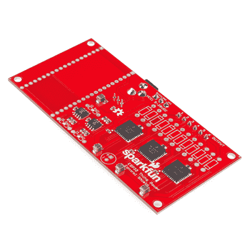

# ESP32 东西电源控制屏蔽连接指南

> 原文：<https://learn.sparkfun.com/tutorials/esp32-thing-power-control-shield-hookup-guide>

## 介绍

ESP32 电源控制护罩提供了多种选项来控制您的下一个项目。这个屏蔽使 [ESP32 东西](https://www.sparkfun.com/products/13907)能够在 5 到 28 伏之间切换高达 5A 的 DC 负载。

 

### [SparkFun ESP32 东西力量控制盾](https://www.sparkfun.com/products/retired/14155)

[Retired](https://learn.sparkfun.com/static/bubbles/ "Retired") DEV-14155

SparkFun ESP32 东西电源控制屏蔽使 ESP32 东西开关高达 5A 的 DC 负载，提供广泛的变化…

**Retired**[Favorited Favorite](# "Add to favorites") 8[Wish List](# "Add to wish list")

### 所需材料

下面的愿望清单包括了本教程中用到的所有材料: