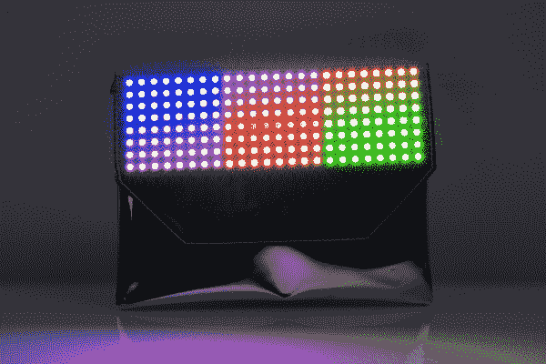
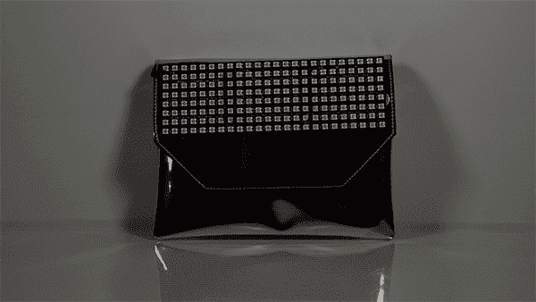

# 跑马灯派对包

> 原文：<https://learn.sparkfun.com/tutorials/marquee-party-bag>

## 介绍

Marquee Party Bag 是一个钱包，里面嵌入了几个 [LED 矩阵](https://www.sparkfun.com/products/12662)和一个 [Lilypad 微控制器](https://www.sparkfun.com/products/12049)。用户可以轻松地对 led 进行编程，以传达字幕信息或简单地制作美丽的图案。在本教程中，我们将通过一步一步的过程，使这个项目。

## 所需材料

要遵循本指南，您需要以下内容: