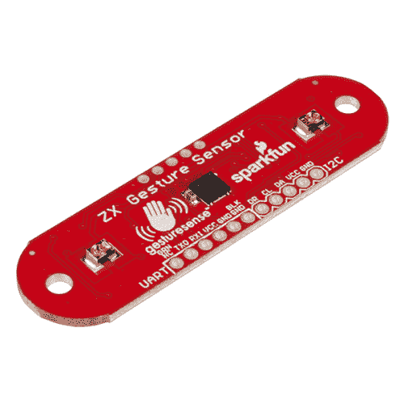

# ZX 距离和姿态传感器 SMD 连接指南

> 原文：<https://learn.sparkfun.com/tutorials/zx-distance-and-gesture-sensor-smd-hookup-guide>

## 介绍

[ZX 距离和手势传感器](https://www.sparkfun.com/products/13162)是与 [XYZ 互动](http://www.gesturesense.com/xyz/)合作的产品。XYZ 互动公司的创新人员创造了一种独特的技术，允许使用简单的红外(IR)光束来检测物体的二维位置。

ZX 传感器是一种无触摸传感器，能够在传感器上方的空中寻找简单的手势(例如，向左滑动或向右滑动)。此外，该传感器还可以识别在高达约 12 英寸(30 厘米)的距离上远离传感器的物体的距离，称为“Z”轴，以及该物体在约 6 英寸(15 厘米)跨度内横跨传感器从一侧到另一侧的位置，称为“X”轴。

 

将**添加到您的[购物车](https://www.sparkfun.com/cart)中！**

 **### [ZX 距离和姿态传感器](https://www.sparkfun.com/products/13162)

[In stock](https://learn.sparkfun.com/static/bubbles/ "in stock") SEN-13162

ZX 距离和手势传感器是一种无接触传感器，能够寻找简单的手势。联合开发…

$28.503[Favorited Favorite](# "Add to favorites") 33[Wish List](# "Add to wish list")** **[https://www.youtube.com/embed/CxOAmn9VHO0/?autohide=1&border=0&wmode=opaque&enablejsapi=1](https://www.youtube.com/embed/CxOAmn9VHO0/?autohide=1&border=0&wmode=opaque&enablejsapi=1)

### 本教程涵盖的内容

我们可以使用 I ² C 或 UART 与 ZX 传感器通信。在本教程中，我们将向您展示如何将传感器连接到 Arduino 或 Arduino 兼容板以及计算机，这样您就可以开始创建手势来处理所有日常任务或为您的项目添加一些互动功能。

### 使用的材料

除了传感器本身，您还需要一些额外的组件来了解 Arduino 示例:**