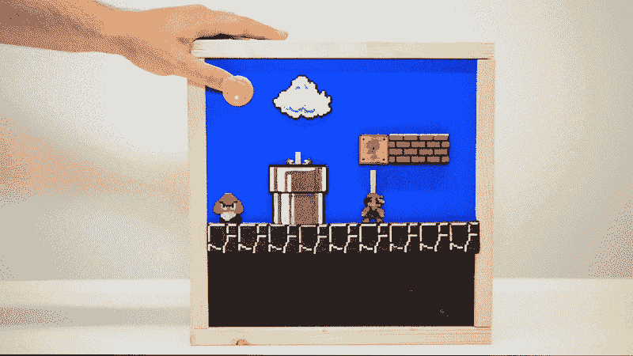
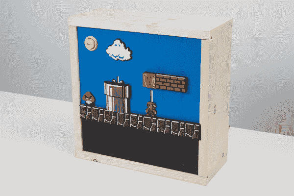
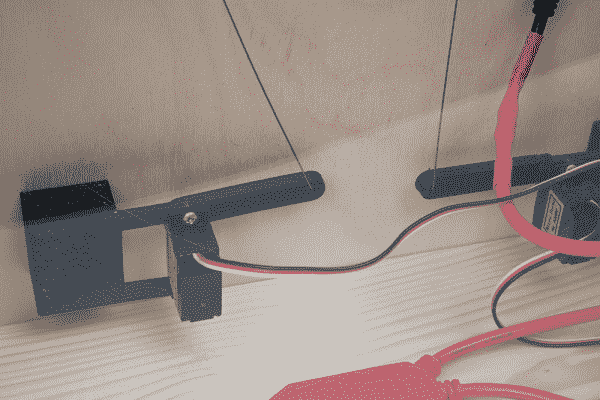
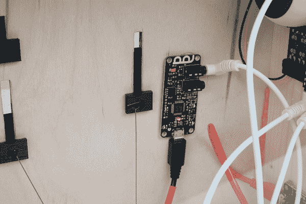
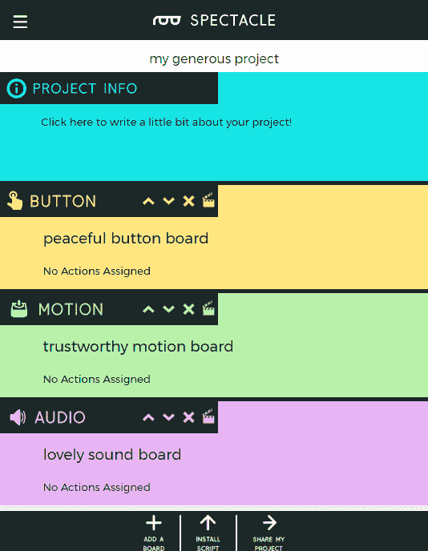
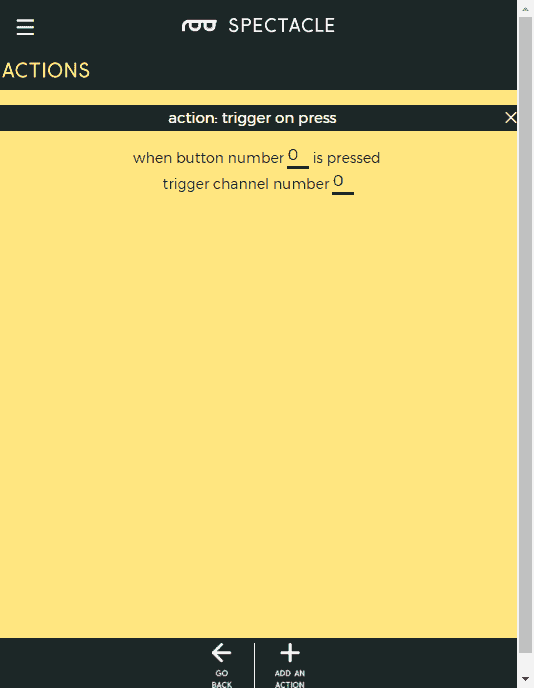
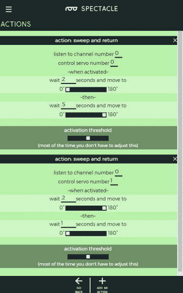
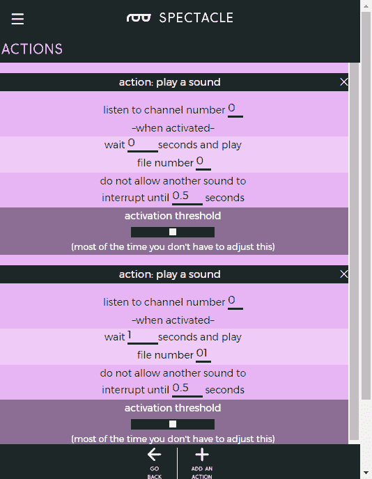

# 奇观例子:超级马里奥兄弟西洋镜

> 原文：<https://learn.sparkfun.com/tutorials/spectacle-example-super-mario-bros-diorama>

## 介绍

Spectacle 旨在使复杂的电子项目变得简单，因此您可以专注于您最擅长的事情:制作很酷的东西！

在本教程中，我们将向您展示如何制作一个动画立体模型(带声音效果！)使用眼镜。

#### 笔记技巧

我们使用 Thingiverse 的项目[创建了立体模型的瓷砖。我们 3D 打印了瓷砖，然后相应地给它们上色。](http://www.thingiverse.com/thing:1183157)

布局是在 Inkscape 中设计的，然后用激光切割机蚀刻在木头上。激光切割机也被用来切割出移动部件上下移动的槽。当然，这一步是可选的。瓷砖可以很容易地用手放置，切割可以用业余爱好刀或类似的木工工具进行。

#### 先前阅读

本教程假设对眼镜系统有基本的了解。如果您还没有，请阅读下面的教程，了解开始这个项目所需的所有基本信息:

 [### 眼镜用户指南](https://learn.sparkfun.com/tutorials/spectacle-users-guide) The Spectacle system is designed to help those without electronics or programming experience integrate electronics into projects.[Favorited Favorite](# "Add to favorites") 4 [### 眼镜音频板连接指南](https://learn.sparkfun.com/tutorials/spectacle-audio-board-hookup-guide) All the information you need to use the Spectacle Audio Board in one place.[Favorited Favorite](# "Add to favorites") 2 [### 眼镜按钮板连接导轨](https://learn.sparkfun.com/tutorials/spectacle-button-board-hookup-guide) All the information you need to use the Spectacle Button Board in one place.[Favorited Favorite](# "Add to favorites") 2 [### 眼镜运动板连接指南](https://learn.sparkfun.com/tutorials/spectacle-motion-board-hookup-guide) All the information you need to use the Spectacle Motion Kit in one place.[Favorited Favorite](# "Add to favorites") 2

## 制作立体模型动画

为了制作立体模型的动画，我们 3D 打印了一个更长的伺服电机臂。臂的长度必须大约等于移动部件预期覆盖的直线距离。

然后，我们将一根 0.020 英寸(0.5 毫米)的音乐线连接到手臂的末端。电线必须以这样一种方式固定，即它可以随着臂的移动而自由旋转。我们将它穿过手臂上的一个洞，并将其弯曲成一个将被洞保留的形状。

线的另一端固定在滑动装置上，瓷砖粘在滑动装置上。在这种情况下，在滑动机构的背面印上一个小环，金属丝再次弯曲成由该环保持的形状。钢丝足够坚硬，可以将瓷砖推到一个新的位置，但也足够柔韧，当碰到挡块时可以弯曲。

### 添加声音

我们选择在这个项目中保持简单的声音，使用音频板的延迟机制在适当的时间触发声音，而不是试图通过让 Mario 点击另一个开关来触发声音。

寻找音效是留给读者的练习，以防止可能的版权或商标问题。然而，在网上快速搜索会找到大多数项目的音效。

## 奇观项目

这个设置的眼镜项目非常简单。它由按钮板、动作板和音频板组成。我们将在这里给你这个项目的页面，而不是一步一步地引导你完成一个壮观的项目。下面，找到应用程序的主页面，所有的板都在适当的位置。请记住，板的连接顺序必须与它们在中的应用程序列表中的显示顺序相匹配。

这是按钮板的设置。请注意，尽管我们触发了四个独立的动作，但我们只需要一个通道上有一个信号。

这里我们看到了运动板的设置。你会注意到在收到触发信号和激活第一个动作之间有一点延迟。这就是触发声卡和声音实际播放之间短暂延迟的原因。滑块是相反的，因为电机的位置在项目内部是镜像的。

最后，这里是声卡上两个声音事件的设置。通过像这样将它们分层，我们创造了当马里奥击中砖块时触发第二个声音的幻觉，而不必在砖块上放置开关。

请注意，这些是我的系统的计时值，如果您自己做的话，您可能需要更改它们。我花了一点时间研究出了这些。

## 资源和更进一步

有关一般眼镜信息，请查看用户指南:

 [### 眼镜用户指南

#### 2017 年 5 月 4 日](https://learn.sparkfun.com/tutorials/spectacle-users-guide) The Spectacle system is designed to help those without electronics or programming experience integrate electronics into projects.[Favorited Favorite](# "Add to favorites") 4

要获得更多奇观乐趣，请查看下面的附加教程:

 [### 眼镜灯光和声音套件连接指南](https://learn.sparkfun.com/tutorials/spectacle-light-and-sound-kit-hookup-guide) All the information you need to use the Spectacle Light and Sound Kit in one place.[Favorited Favorite](# "Add to favorites") 2 [### 眼镜音频板连接指南](https://learn.sparkfun.com/tutorials/spectacle-audio-board-hookup-guide) All the information you need to use the Spectacle Audio Board in one place.[Favorited Favorite](# "Add to favorites") 2 [### 眼镜灯套件连接指南](https://learn.sparkfun.com/tutorials/spectacle-light-kit-hookup-guide) All the information you need to use the Spectacle Light Kit in one place.[Favorited Favorite](# "Add to favorites") 2 [### 眼镜按钮板连接导轨](https://learn.sparkfun.com/tutorials/spectacle-button-board-hookup-guide) All the information you need to use the Spectacle Button Board in one place.[Favorited Favorite](# "Add to favorites") 2 [### 眼镜灯板连接导轨](https://learn.sparkfun.com/tutorials/spectacle-light-board-hookup-guide) All the information you need to use the Spectacle Light Board in one place.[Favorited Favorite](# "Add to favorites") 2 [### 眼镜运动套件连接指南](https://learn.sparkfun.com/tutorials/spectacle-motion-kit-hookup-guide) All the information you need to use the Spectacle Motion Kit in one place.[Favorited Favorite](# "Add to favorites") 2 [### 眼镜运动板连接指南](https://learn.sparkfun.com/tutorials/spectacle-motion-board-hookup-guide) All the information you need to use the Spectacle Motion Kit in one place.[Favorited Favorite](# "Add to favorites") 2 [### 眼镜惯性板连接导轨](https://learn.sparkfun.com/tutorials/spectacle-inertia-board-hookup-guide) Everything you need to know about using the Spectacle Inertia Board in one place.[Favorited Favorite](# "Add to favorites") 2