# 眼镜运动板连接指南

> 原文：<https://learn.sparkfun.com/tutorials/spectacle-motion-board-hookup-guide>

## 眼镜运动板

[眼镜运动板](https://www.sparkfun.com/products/13993)可以轻松地为您的眼镜项目添加运动。它可以控制多达 5 个伺服电机，无论是标准或连续旋转类型。

[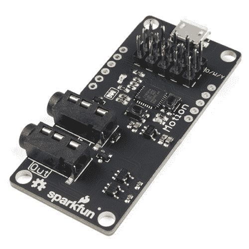](https://www.sparkfun.com/products/retired/13993) 

### [眼镜运动板](https://www.sparkfun.com/products/retired/13993)

[Retired](https://learn.sparkfun.com/static/bubbles/ "Retired") DEV-13993

眼镜运动板可以很容易地添加运动到您的眼镜项目。每个运动板最多可以控制五个…

**Retired**[Favorited Favorite](# "Add to favorites") 4[Wish List](# "Add to wish list")

### TL；灾难恢复(基本要素)

1.  伺服板上的 USB 微型 B 端口仅用于为连接的电机供电。
2.  单个伺服系统或几个小型伺服系统可以通过眼镜控制电缆供电。
3.  伺服电机可以是标准或连续旋转类型。

### 见见眼镜运动委员会

“眼镜运动板”旨在方便您将简单的运动添加到眼镜项目中，它与眼镜生态系统的其他部分集成在一起，让您可以相对轻松地控制运动效果。

[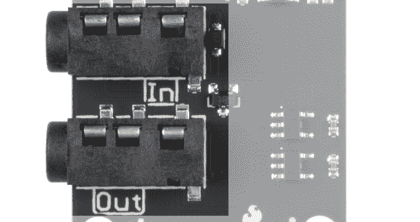](https://cdn.sparkfun.com/assets/learn_tutorials/6/3/2/motor_driver_jacks.png)

它有两个用于眼镜控制信号的 1/8 英寸(3.5 毫米)插孔。**注意千斤顶的方向性！**标有“In”的那一个应插入比运动板更靠近控制器板的板，或插入控制器板本身。

[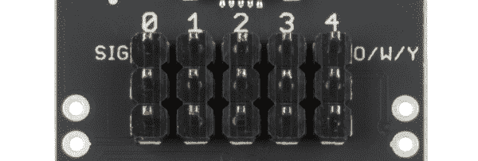](https://cdn.sparkfun.com/assets/learn_tutorials/6/3/2/motion_servo_headers.png)

运动板支持多达 5 个伺服电机。伺服电机可以是标准运动或连续旋转伺服电机。在黑板上有一个颜色的注释(“O/W/Y”)，它应该在页眉的第一行:橙色、白色或黄色。大多数伺服电机会有一根电线是这些颜色中的一种，那根电线应该和这个音符对齐。

[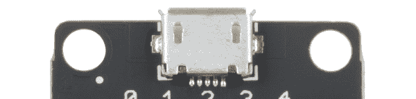](https://cdn.sparkfun.com/assets/learn_tutorials/6/3/2/motion_micro_usb.png)

Motion Board 有一个 Micro B USB 连接器，允许它直接由外部电源供电。眼镜数据传输所用的相对较细的音频电缆不足以承受较大伺服电机或多个电机产生的大量电流。

### 推荐阅读

在继续之前，您应该通读[眼镜用户指南](https://learn.sparkfun.com/tutorials/spectacle-users-guide)。它会给你一些你需要了解的关于奇观如何工作的基础知识，以便你能理解本教程的其余部分。

## 配置实用程序

### 眼镜运动板

实用程序中的“运动板”页面提供了以下选项。

[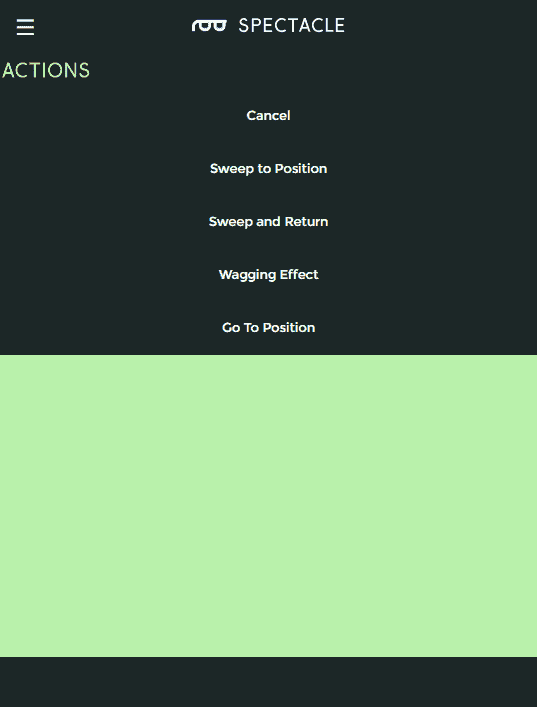](https://cdn.sparkfun.com/assets/learn_tutorials/6/3/1/motion_board_actions.png)

有四种动作与运动板相关，所有这些动作都应与单个触发脉冲类型的输入信号一起使用。

##### 扫至位置

[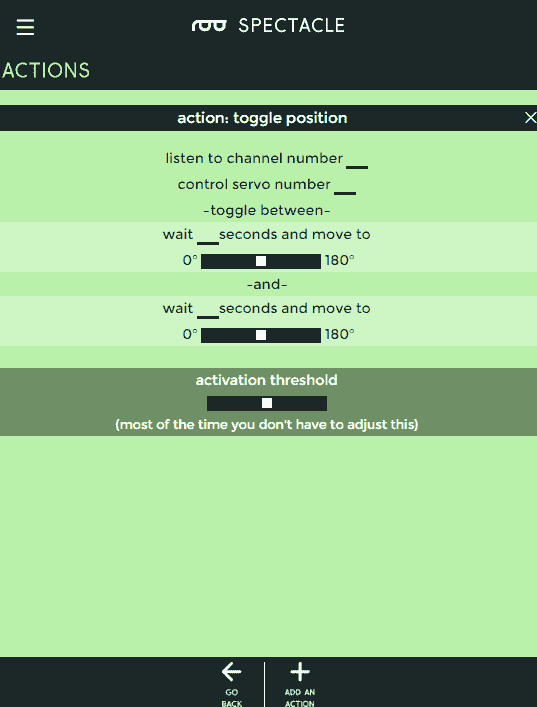](https://cdn.sparkfun.com/assets/learn_tutorials/6/3/1/toggle_position_action.png)

这个动作在两个位置之间移动电机，每个触发事件一个动作。

*   **“收听频道号……”** -这是触发动作的通道。
*   **"控制伺服号..."** -要控制的伺服，编号从 0-4。
*   **“等等...秒，并移动到"** -第一个位置运动前的延迟。
    *   **滑块控制** -选择第一次运动的位置。伺服系统在通电时从 90°开始，可以在一个方向旋转到 0°或在另一个方向旋转到 180°。这相当于从 12 点开始，转到 9 点或者 3 点。
*   **“等等...秒，并移动到"** -第二位置运动前的延迟。
    *   **滑块控制** -选择第二次运动的位置。伺服系统从 90°开始，可以向一个方向旋转到 0°，也可以向另一个方向旋转到 180°。这相当于从 12 点开始，转到 9 点或者 3 点。

##### 清扫并返回

[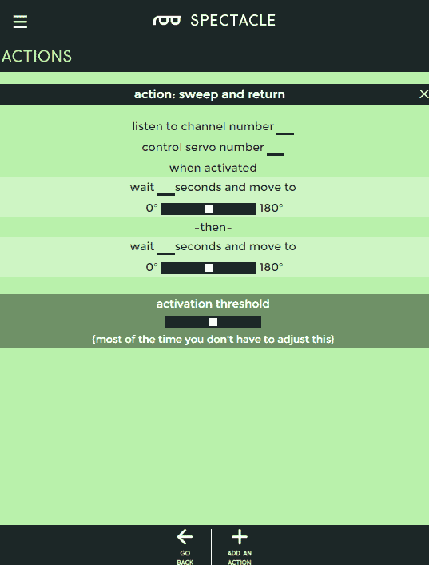](https://cdn.sparkfun.com/assets/learn_tutorials/6/3/1/action_sweep_and_return.png)

该动作等待一会儿，将伺服移动到一个位置，然后在新位置等待一会儿，然后移回第一个位置。

*   **“收听频道号……”** -哪个通道控制这个动作。
*   **"控制伺服号..."** -要控制的伺服，编号从 0-4。
*   **“等等...秒，并移动到"** -第一个位置运动前的延迟。
    *   **滑块控制** -选择第一次运动的位置。伺服系统从 90°开始，可以向一个方向旋转到 0°，也可以向另一个方向旋转到 180°。这相当于从 12 点开始，转到 9 点或者 3 点。
*   **“等等...秒，并移动到"** -第二位置运动前的延迟。
    *   **滑块控制** -选择第二次运动的位置。伺服系统从 90°开始，可以向一个方向旋转到 0°，也可以向另一个方向旋转到 180°。这相当于从 12 点开始，转到 9 点或者 3 点。

##### 摇摆效应

[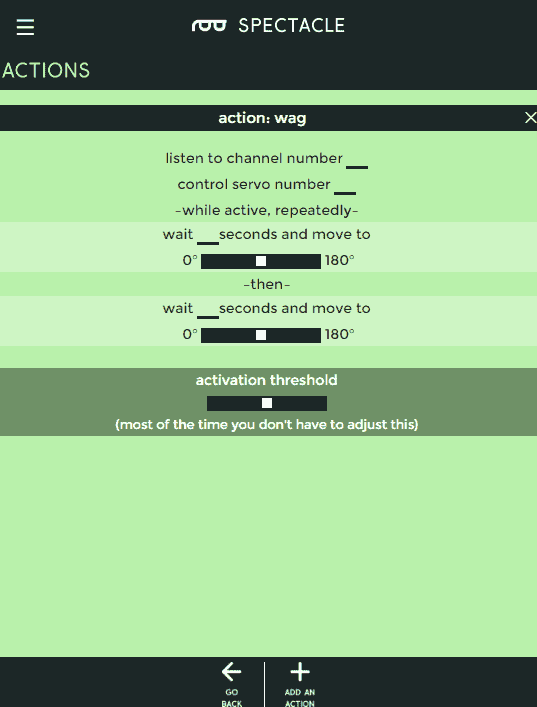](https://cdn.sparkfun.com/assets/learn_tutorials/6/3/1/wag_action.png)

该动作的行为非常类似于扫描和返回，但会持续运行，直到在指定通道上收到另一个信号脉冲而关闭。

*   **“收听频道号……”** -哪个通道控制这个动作。
*   **"控制伺服号..."** -要控制的伺服，编号从 0-4。
*   **“等等...秒，并移动到"** -第一个位置运动前的延迟。
    *   **滑块控制** -选择第一次运动的位置。伺服系统从 90°开始，可以向一个方向旋转到 0°，也可以向另一个方向旋转到 180°。这相当于从 12 点开始，转到 9 点或者 3 点。
*   **“等等...秒，并移动到"** -第二位置运动前的延迟。
    *   **滑块控制** -选择第二次运动的位置。伺服系统从 90°开始，可以向一个方向旋转到 0°，也可以向另一个方向旋转到 180°。这相当于从 12 点开始，转到 9 点或者 3 点。

##### 转到位置

[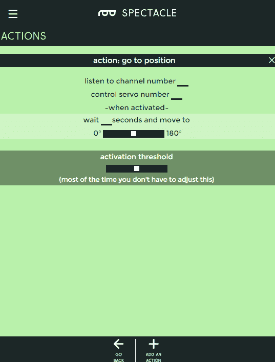](https://cdn.sparkfun.com/assets/learn_tutorials/6/3/1/go_to_position.png)

延迟一段时间后，将伺服电机从当前位置移动到这个新位置。

*   **“收听频道号……”** -哪个通道控制这个动作。
*   **"控制伺服号..."** -要控制的伺服，编号从 0-4。
*   **“等等...秒，并移动到"** -第一个位置运动前的延迟。
    *   **滑块控制** -选择第一次运动的位置。伺服系统从 90°开始，可以向一个方向旋转到 0°，也可以向另一个方向旋转到 180°。这相当于从 12 点开始，转到 9 点或者 3 点。

## 示例项目

让我们用眼镜运动板做一个项目吧！我们将对该项目进行编程，以定期将伺服系统从一个位置移动到另一个位置并返回。

#### 连接电路板

从连接电路板开始。您需要以下硬件:

[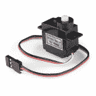](https://www.sparkfun.com/products/9065) 

将**添加到您的[购物车](https://www.sparkfun.com/cart)中！**

 **### [【伺服-通用(亚微米尺寸)](https://www.sparkfun.com/products/9065)

[In stock](https://learn.sparkfun.com/static/bubbles/ "in stock") ROB-09065

这是一款简单、低成本、高质量的伺服系统，可以满足您所有的机电需求。这个伺服是非常相似的大小和规格…

$9.9512[Favorited Favorite](# "Add to favorites") 41[Wish List](# "Add to wish list")**** 

将**添加到您的[购物车](https://www.sparkfun.com/cart)中！**

 **### [壁式适配器电源- 5.1V DC 2.5A (USB Micro-B)](https://www.sparkfun.com/products/13831)

[In stock](https://learn.sparkfun.com/static/bubbles/ "in stock") TOL-13831

这是一个高品质的开关“壁式”交流到 DC 5.1V 2500ma USB 微型 B 壁式电源，专为…

$8.9521[Favorited Favorite](# "Add to favorites") 47[Wish List](# "Add to wish list")**** 

将**添加到您的[购物车](https://www.sparkfun.com/cart)中！**

 **### [眼镜导演板](https://www.sparkfun.com/products/13912)

[In stock](https://learn.sparkfun.com/static/bubbles/ "in stock") DEV-13912

眼镜董事会控制着一个眼镜项目的所有行动。虽然董事会没有做太多的工作…

$24.95 $9.95[Favorited Favorite](# "Add to favorites") 4[Wish List](# "Add to wish list")****[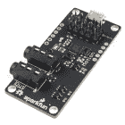](https://www.sparkfun.com/products/retired/13993) 

### [眼镜运动板](https://www.sparkfun.com/products/retired/13993)

[Retired](https://learn.sparkfun.com/static/bubbles/ "Retired") DEV-13993

眼镜运动板可以很容易地添加运动到您的眼镜项目。每个运动板最多可以控制五个…

**Retired**[Favorited Favorite](# "Add to favorites") 4[Wish List](# "Add to wish list") 

### [音频线 TRRS - 3ft](https://www.sparkfun.com/products/retired/14164)

[Retired](https://learn.sparkfun.com/static/bubbles/ "Retired") CAB-14164

这是一条 3 英尺长的白色音频电缆，两端各有两个 TRRS 连接器。TRRS 连接器是…

**Retired**[Favorited Favorite](# "Add to favorites") 5[Wish List](# "Add to wish list")****** ******注意，你需要两根 TRRS 电缆。

首先，将 TRRS 电缆的一端插入控制器板上的“直接”插孔。

[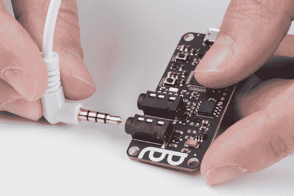](https://cdn.sparkfun.com/assets/learn_tutorials/6/3/2/director_direct_jack.jpg)

接下来，将电缆插入控制器板上的“程序”插孔。

[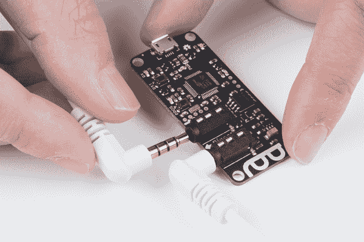](https://cdn.sparkfun.com/assets/learn_tutorials/6/3/2/director_program_jack.jpg)

将这根电缆的一端插入你的手机、平板电脑或任何你用来编程系统的设备上的音频输出插孔。

将第一根电缆的另一端(插入“直接”插孔的一端)插入运动板上的“输入”插孔。

[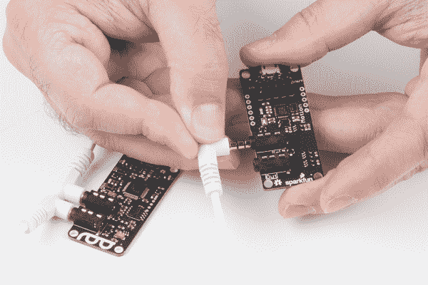](https://cdn.sparkfun.com/assets/learn_tutorials/6/3/2/motion_board_input.jpg)

现在，将伺服连接器插在运动板上

[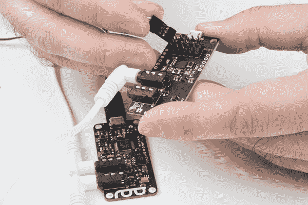](https://cdn.sparkfun.com/assets/learn_tutorials/6/3/2/Spectacle-09.jpg)

最后，将 USB 电缆的微型 B 端插入控制器板，另一端插入墙上适配器。将适配器插入墙壁。你应该在运动板上看到一个稳定的灯和一个闪烁的灯。在指示板上，您会看到一个稳定的指示灯和一个闪烁一次，然后暂停，然后重复的指示灯。这表明电源已接通，板已启动并正在运行。

#### 设置板配置

当你第一次打开眼镜应用程序网页，这是你会看到的。

你的项目名称将不同于我的，因为奇观分配一个随机的名称给每个项目。

要继续，我们必须告诉项目我们希望使用哪些板。首先点击页面底部的“添加电路板”按钮。

这将显示可用电路板的列表。我们将从运动板开始，稍后再添加虚拟板。单击“运动”框中的任意位置，将其添加到项目中。

在这里，您可以看到运动板已被添加到主窗口的板列表中。

[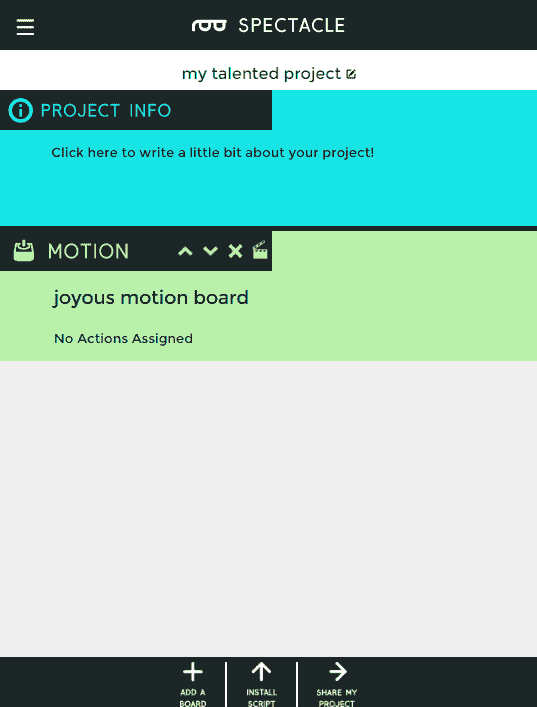](https://cdn.sparkfun.com/assets/learn_tutorials/6/3/2/motion_board_added.png)

要向公告板添加操作，请单击下面突出显示的隔板图标。

[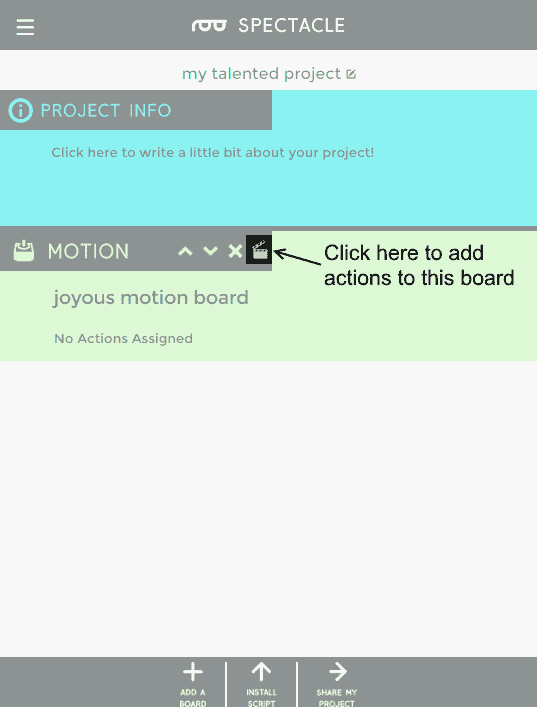](https://cdn.sparkfun.com/assets/learn_tutorials/6/3/2/add_actions_button.png)

这是动作列表，空的。要添加操作，请单击页面底部突出显示的“添加操作”按钮。

[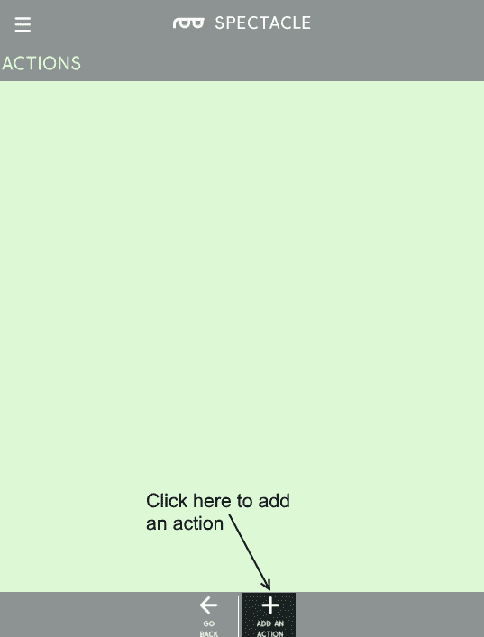](https://cdn.sparkfun.com/assets/learn_tutorials/6/3/2/empty_action_list.png)

您将看到可用操作的列表。选择“清扫并返回”操作。

扫掠和返回动作需要许多设置。在下图中，你会发现我已经输入了驱动我们系统所需的伺服动作的数据。

[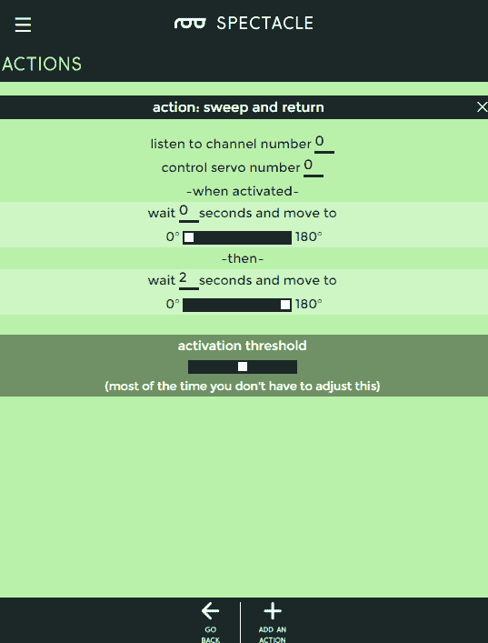](https://cdn.sparkfun.com/assets/learn_tutorials/6/3/2/sweep_return_settings.png)

单击屏幕底部的“返回”按钮返回主板列表。这将自动保存您的工作。

现在，再次单击“添加电路板”按钮，调出电路板列表，这一次，选择“虚拟”。

Virtual Boards provide a number of functions outside of the normal operation of Spectacle boards. In this case, we want "Periodic Input", which generates a signal at a fixed timing rate.

这是添加了虚拟板的板列表。再次单击隔板图标，然后单击“Add an Action ”,调出 actions 菜单。

[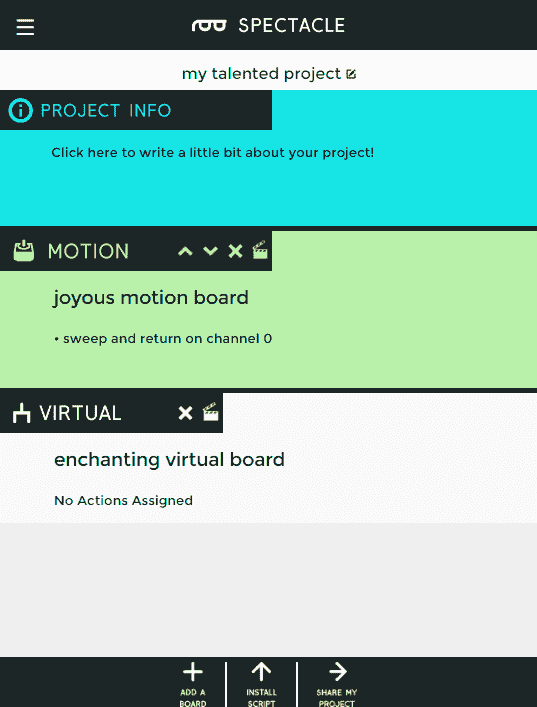](https://cdn.sparkfun.com/assets/learn_tutorials/6/3/2/add_virtual_board.png)[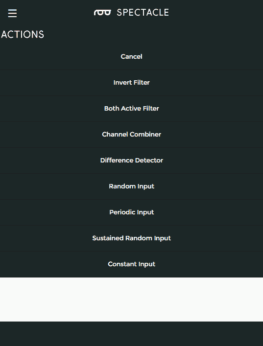](https://cdn.sparkfun.com/assets/learn_tutorials/6/3/2/virtual_board_actions.png)

以下是“定期输入”的选项。我们将运动板上的动作绑定到通道 0，因此我们将在这里做同样的事情。我们只需要一个短信号来触发运动板，所以我们将它设置为 0.1 秒。最后，我们希望电机每 10 秒启动一次。

再次单击“返回”按钮返回主页并保存您的操作。

[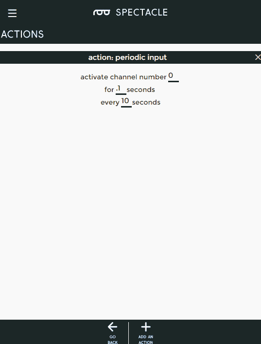](https://cdn.sparkfun.com/assets/learn_tutorials/6/3/2/periodic_input.png)

恭喜你！您已经完成了流程的配置步骤。现在是时候把这个项目放到你的董事会上了。

[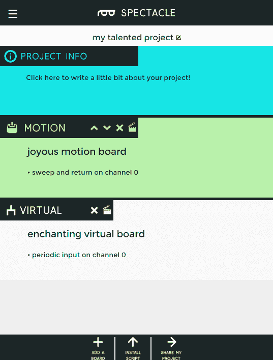](https://cdn.sparkfun.com/assets/learn_tutorials/6/3/2/final_project.png)

#### 上传

现在你已经创建了你的眼镜程序，是时候把它上传到董事会了。如果你按照上面的说明，你的上传设备已经连接到板上，可以开始了，所以你需要做的就是点击页面底部的“安装脚本”按钮。这将打开如下所示的页面。

确保设备上的音量已调至最大，并且没有其他音频源(音乐、视频等)在背景中播放。然后按住控制器板上的“RST”按钮，按住“程序”按钮，然后松开“RST”按钮。

这将使主板进入程序模式。你会看到板上的灯闪烁三次，暂停，然后重复。这是电路板处于程序模式的视觉指示器。一旦您确定电路板处于编程模式，您可以通过触摸眼镜应用程序屏幕上的“安装”按钮开始编程。该按钮将在编程过程中变灰，这应该只持续几秒钟。编程完成后，您会看到指示板上的灯闪烁 10 次，暂停，然后重复。这是你的提示，程序上传成功。

再次按下“RST”按钮，重置系统并开始程序！

如果您有任何问题，请访问[故障排除页面](https://learn.sparkfun.com/tutorials/spectacle-users-guide#troubleshooting)以获得解决问题的帮助。

## 资源和更进一步

有关一般眼镜信息，请查看用户指南:

 [### 眼镜用户指南

#### 2017 年 5 月 4 日](https://learn.sparkfun.com/tutorials/spectacle-users-guide) The Spectacle system is designed to help those without electronics or programming experience integrate electronics into projects.[Favorited Favorite](# "Add to favorites") 4

要获得更多奇观乐趣，请查看下面的附加教程:

 [### 眼镜音响套装连接指南](https://learn.sparkfun.com/tutorials/spectacle-sound-kit-hookup-guide) All the information you need to use the Spectacle Sound Kit in one place.[Favorited Favorite](# "Add to favorites") 1 [### 眼镜用户指南](https://learn.sparkfun.com/tutorials/spectacle-users-guide) The Spectacle system is designed to help those without electronics or programming experience integrate electronics into projects.[Favorited Favorite](# "Add to favorites") 4 [### 眼镜音频板连接指南](https://learn.sparkfun.com/tutorials/spectacle-audio-board-hookup-guide) All the information you need to use the Spectacle Audio Board in one place.[Favorited Favorite](# "Add to favorites") 2 [### 眼镜灯套件连接指南](https://learn.sparkfun.com/tutorials/spectacle-light-kit-hookup-guide) All the information you need to use the Spectacle Light Kit in one place.[Favorited Favorite](# "Add to favorites") 2 [### 眼镜按钮板连接导轨](https://learn.sparkfun.com/tutorials/spectacle-button-board-hookup-guide) All the information you need to use the Spectacle Button Board in one place.[Favorited Favorite](# "Add to favorites") 2 [### 眼镜灯板连接导轨](https://learn.sparkfun.com/tutorials/spectacle-light-board-hookup-guide) All the information you need to use the Spectacle Light Board in one place.[Favorited Favorite](# "Add to favorites") 2 [### 眼镜运动套件连接指南](https://learn.sparkfun.com/tutorials/spectacle-motion-kit-hookup-guide) All the information you need to use the Spectacle Motion Kit in one place.[Favorited Favorite](# "Add to favorites") 2 [### 眼镜惯性板连接导轨](https://learn.sparkfun.com/tutorials/spectacle-inertia-board-hookup-guide) Everything you need to know about using the Spectacle Inertia Board in one place.[Favorited Favorite](# "Add to favorites") 2

或者查看使用眼镜运动板的博客项目帖子:

 [### 硬件驼峰日:成为毕业典礼上的奇观！

May 10, 2017](https://www.sparkfun.com/news/2380 "May 10, 2017: Stand out at graduation using the Spectacle ecosystem to decorate your cap!")[Favorited Favorite](# "Add to favorites") 0 [### 从 Juicero 到 Juicezero

May 16, 2017](https://www.sparkfun.com/news/2386 "May 16, 2017: The good, the bad and the $700 IoT cold-press juice machine.")[Favorited Favorite](# "Add to favorites") 1******