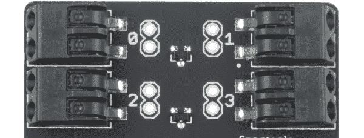
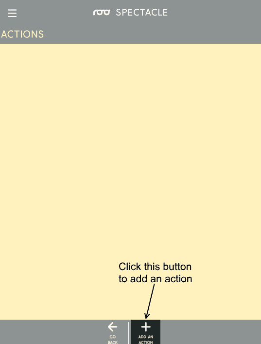

# 眼镜按钮板连接导轨

> 原文：<https://learn.sparkfun.com/tutorials/spectacle-button-board-hookup-guide>

## 眼镜按钮板

眼镜按钮板允许您将按钮或开关输入添加到您的眼镜项目中。它共有 9 个信号输入，其中 8 个可以来自外部按钮，1 个直接在板上。

 

### [眼镜按钮板](https://www.sparkfun.com/products/retired/14044)

[Retired](https://learn.sparkfun.com/static/bubbles/ "Retired") DEV-14044

眼镜按钮板允许您将来自按钮、开关或其他接触式传感设备的输入添加到您的眼镜上

1 **Retired**[Favorited Favorite](# "Add to favorites") 5[Wish List](# "Add to wish list")

### TL；灾难恢复(基本要素)

1.  按钮或开关可以通过将电线插入电路板上的“戳 home”型连接器来连接到电路板上。
2.  多达九个信号可用。
3.  按钮信号可以是瞬时的，也可以是连续的。

### 遇见眼镜按钮板

眼镜按钮板旨在将简单的信号从世界带入您的眼镜项目，为您的任何眼镜项目提供输入。

它有两个 1/8 英寸(3.5 毫米)插孔，用于连接眼镜系统中的其他电路板。请注意，眼镜数据插孔是定向的:标有“In”的插孔应插入“上游”板(即比这个更靠近控制器板)，标有“Out”的插孔连接到下一个下游板。

按钮板上有 8 个“戳 home”连接器。每个都可以连接到一个(或多个)按钮。要添加连接，只需将电线的剥皮端推入连接器上的孔中。连接器会自动抓住电线并将其固定到位。如果您需要稍后移除电线，请使用小物件(发夹、圆珠笔等)。)可用于按下释放按钮，使电线无损坏地抽出。

按钮板上有一个输入按钮，如果没有其他按钮可用，它可以用来提供输入信号。它的功能就像任何其他可能附加的普通按钮一样。确保你按的是标有“8”的按钮，而不是标有“重置”的按钮！按下重置按钮将重置您的按钮板，可能会导致您的整个系统停止正常工作，直到您重置您的控制器板！

### 推荐阅读

在继续之前，您应该通读[眼镜用户指南](https://learn.sparkfun.com/tutorials/spectacle-users-guide)。它会给你一些你需要了解的关于奇观如何工作的基础知识，以便你能理解本教程的其余部分。

## 配置实用程序

### 眼镜按钮板

对于按钮板，有五个选项:三个产生瞬时脉冲型输出，两个产生连续开关型输出。

##### 对印刷机的操作

当按钮第一次被按下时触发一个动作，不管它随后被按住多长时间。

*   **"当按钮数...按下了“**”-这是我们希望分配给此操作的按钮编号。按钮号码印在板上，从 0 到 8。
*   **“触发通道号……”** -单个瞬时脉冲将在该通道上发出。它适用于启动声音、启动动作或设置光带的颜色。例如，它不适合连续播放声音或打开光带效果。

##### 释放时的操作

当按钮被释放时触发一个动作，不管它在被释放之前被按住了多长时间。

*   **"当按钮数...已释放"** -这是我们希望分配给此操作的按钮编号。按钮号码印在板上，从 0 到 8。
*   **“触发通道号……”** -单个瞬时脉冲将在该通道上发出。例如，它适用于启动声音、启动动作或设置光带的颜色，但不适用于连续声音播放或打开光带效果。

##### 按下或释放时的动作

当按钮被按下时触发一个动作，然后当按钮被释放时再次触发相同的动作。

*   **"当按钮数...按下或释放"** -这是我们希望分配给此操作的按钮编号。按钮号码印在板上，从 0 到 8。
*   **“触发通道号……”** -按下按钮和松开按钮时，将在该通道上发出一个单一的瞬时脉冲。例如，它适用于启动声音、启动动作或设置光带的颜色，但不适用于连续声音播放或打开光带效果。

##### 保持动作

一按下按钮就触发一个事件，然后只要按钮被按住就继续触发该事件。

*   **"While 按钮编号...按下了“**”-这是我们希望分配给此操作的按钮编号。按钮号码印在板上，从 0 到 8。
*   **“激活频道号……”** -该通道将发出连续信号。它适用于触发和重复声音，或打开和保持(至少在按住按钮时)灯光效果。

##### 闩锁开启/闩锁关闭

这个动作就像一个锁定的电源开关。一次按下打开信号，另一次按下关闭信号。

*   **"While 按钮编号...按下了“**”-这是我们希望分配给此操作的按钮编号。按钮号码印在板上，从 0 到 8。
*   **"激活通道号...直到再次按下按钮“**”-该频道将发出连续信号。它适用于触发和重复声音，或打开和保持灯光效果。

## 示例项目

让我们用眼镜按钮板做一个项目吧！显然，我们还需要某种输出板，所以我们将使用一个轻型板。该项目将使用按钮板来打开和关闭灯板的扫描效果。

#### 连接电路板

对于本教程，您需要以下产品:

 

将**添加到您的[购物车](https://www.sparkfun.com/cart)中！**

 **### [壁式适配器电源- 5.1V DC 2.5A (USB Micro-B)](https://www.sparkfun.com/products/13831)

[In stock](https://learn.sparkfun.com/static/bubbles/ "in stock") TOL-13831

这是一个高品质的开关“壁式”交流到 DC 5.1V 2500ma USB 微型 B 壁式电源，专为…

$8.9521[Favorited Favorite](# "Add to favorites") 47[Wish List](# "Add to wish list")**** 

将**添加到您的[购物车](https://www.sparkfun.com/cart)中！**

 **### [眼镜导演板](https://www.sparkfun.com/products/13912)

[In stock](https://learn.sparkfun.com/static/bubbles/ "in stock") DEV-13912

眼镜董事会控制着一个眼镜项目的所有行动。虽然董事会没有做太多的工作…

$24.95 $9.95[Favorited Favorite](# "Add to favorites") 4[Wish List](# "Add to wish list")**** 

### [【LED RGB 条形可寻址，裸露(1m)](https://www.sparkfun.com/products/retired/12025)

[Retired](https://learn.sparkfun.com/static/bubbles/ "Retired") COM-12025

这些是裸露的可寻址 1 米长的 5V RGB LED 灯条，每米装有 60 个 WS2812s。因为这些都是裸露的 LED

7 **Retired**[Favorited Favorite](# "Add to favorites") 13[Wish List](# "Add to wish list") 

### [眼镜灯板](https://www.sparkfun.com/products/retired/14052)

[Retired](https://learn.sparkfun.com/static/bubbles/ "Retired") DEV-14052

眼镜灯板允许您添加一些相当复杂的照明效果到您的眼镜项目中，以一种简化的…

**Retired**[Favorited Favorite](# "Add to favorites") 4[Wish List](# "Add to wish list") 

### [音频线 TRRS - 3ft](https://www.sparkfun.com/products/retired/14164)

[Retired](https://learn.sparkfun.com/static/bubbles/ "Retired") CAB-14164

这是一条 3 英尺长的白色音频电缆，两端各有两个 TRRS 连接器。TRRS 连接器是…

**Retired**[Favorited Favorite](# "Add to favorites") 5[Wish List](# "Add to wish list") 

### [JST 到 JST-SM 线-1ft](https://www.sparkfun.com/products/retired/14165)

[Retired](https://learn.sparkfun.com/static/bubbles/ "Retired") CAB-14165

这种简单的 24AWG 导线的一端与一个 JST 公接头端接，另一端与一个 JST-SM 公接头端接。每根电线…

**Retired**[Favorited Favorite](# "Add to favorites") 2[Wish List](# "Add to wish list")**** ****你需要三根 TRRS 电缆！

首先，将 TRRS 电缆的一端插入控制器板上的“直接”插孔。

接下来，将另一根 TRRS 电缆插入主板上的“程序”插孔。

将线缆的另一端插入手机、平板电脑或电脑的音频插孔，以便对系统进行编程。

然后将第一根 TRRS 电缆的另一端插入按钮板上的“In”插孔。

抓住另一根 TRRS 电缆，将其插入按钮板上的“Out”插孔。

将电缆的另一端插入灯板上的“In”插孔。

现在将您的 lightstrip 适配器电缆插入灯板...

...并将 lightstrip 插入适配器的另一端。

最后，将电源适配器的微型 B 端插入控制器板，另一端插入墙壁。您应该在灯板和按钮板上看到一个稳定灯和一个闪烁灯。在指示板上，您会看到一个稳定指示灯和一个闪烁八次，然后暂停，然后重复的指示灯。这表明电源已接通，板已启动并正在运行。

#### 设置板配置

当你第一次打开眼镜应用程序网页，这是你会看到的。你的项目名称将不同于我的，因为奇观分配一个随机的名称给每个项目。

要继续，我们必须告诉项目我们希望使用哪些板。首先点击页面底部的“添加电路板”按钮。

这将显示可用电路板的列表。我们将首先添加我们的按钮板，所以单击“按钮”框中的任意位置来添加它。

现在，再重复一次这个过程来添加一个灯光板。

您现在应该有一个如下所示的列表。**顺序很重要，**所以要确保你的板子的顺序和上面显示的一样。名字*并不重要，但是，你的董事会将会有不同的名字，因为奇观随机分配名字。*

每个板都有一个与之关联的隔板图标。要添加或编辑操作，请单击此图标。我们将从向按钮板添加一个动作开始。

弹出的窗口将如下图所示。单击下图中突出显示的按钮，将操作添加到按钮板上。

这个列表会出现。它代表了按钮板可以执行的所有不同的动作。

点击列表条目“闩上/闩下”。

然后，您将看到这个屏幕，其中显示了闩锁打开/闩锁关闭操作的各种选项。每个动作都会有不同的设置。

以下是我们在这个项目中需要使用的设置。我们希望按钮 8(按钮板上的按钮)在按下时激活通道 0。稍后，我们将告诉我们的灯光板观看频道 0，并在它激活时做一些事情。

现在点击“返回”按钮返回主页。您的操作更改将自动保存。

现在，我们回到了主页，您可以看到我们添加的操作出现在 boards 列表中的 Button Board 下。现在单击灯板的隔板图标，为按钮添加一个要触发的动作。

当你点击“添加一个动作”按钮时，你会看到这个灯板可以执行的动作列表。我们将选择“扫描效果”动作。

这个屏幕将会弹出，尽管字段中没有任何条目。继续设置字段，如下所示，然后单击“返回”按钮。

恭喜你！您已经完成了流程的配置步骤。现在是时候把这个项目放到你的董事会上了。

#### 上传

现在你已经创建了你的眼镜程序，是时候把它上传到董事会了。如果你按照上面的说明，你的上传设备已经连接到板上，可以开始了，所以你需要做的就是点击页面底部的“安装脚本”按钮。这将打开如下所示的页面。

确保设备上的音量已调至最大，并且没有其他音频源(音乐、视频等)在背景中播放。然后按住控制器板上的“RST”按钮，按住“程序”按钮，然后松开“RST”按钮。

这将使主板进入程序模式。你会看到板上的灯闪烁三次，暂停，然后重复。这是电路板处于程序模式的视觉指示器。一旦您确定电路板处于编程模式，您可以通过触摸眼镜应用程序屏幕上的“安装”按钮开始编程。该按钮将在编程过程中变灰，这应该只持续几秒钟。编程完成后，您会看到指示板上的灯闪烁 10 次，暂停，然后重复。这是你的提示，程序上传成功。

再次按下“RST”按钮，重置系统并开始程序！

如果您有任何问题，请访问[故障排除页面](https://learn.sparkfun.com/tutorials/spectacle-users-guide#troubleshooting)以获得解决问题的帮助。

## 资源和更进一步

有关一般眼镜信息，请查看用户指南:

 [### 眼镜用户指南

#### 2017 年 5 月 4 日](https://learn.sparkfun.com/tutorials/spectacle-users-guide) The Spectacle system is designed to help those without electronics or programming experience integrate electronics into projects.[Favorited Favorite](# "Add to favorites") 4

要获得更多奇观乐趣，请查看下面的附加教程:

 [### 眼镜音响套装连接指南](https://learn.sparkfun.com/tutorials/spectacle-sound-kit-hookup-guide) All the information you need to use the Spectacle Sound Kit in one place.[Favorited Favorite](# "Add to favorites") 1 [### 眼镜用户指南](https://learn.sparkfun.com/tutorials/spectacle-users-guide) The Spectacle system is designed to help those without electronics or programming experience integrate electronics into projects.[Favorited Favorite](# "Add to favorites") 4 [### 眼镜音频板连接指南](https://learn.sparkfun.com/tutorials/spectacle-audio-board-hookup-guide) All the information you need to use the Spectacle Audio Board in one place.[Favorited Favorite](# "Add to favorites") 2 [### 眼镜灯套件连接指南](https://learn.sparkfun.com/tutorials/spectacle-light-kit-hookup-guide) All the information you need to use the Spectacle Light Kit in one place.[Favorited Favorite](# "Add to favorites") 2 [### 眼镜运动套件连接指南](https://learn.sparkfun.com/tutorials/spectacle-motion-kit-hookup-guide) All the information you need to use the Spectacle Motion Kit in one place.[Favorited Favorite](# "Add to favorites") 2 [### 眼镜运动板连接指南](https://learn.sparkfun.com/tutorials/spectacle-motion-board-hookup-guide) All the information you need to use the Spectacle Motion Kit in one place.[Favorited Favorite](# "Add to favorites") 2 [### 眼镜惯性板连接导轨](https://learn.sparkfun.com/tutorials/spectacle-inertia-board-hookup-guide) Everything you need to know about using the Spectacle Inertia Board in one place.[Favorited Favorite](# "Add to favorites") 2 [### 奇观例子:超级马里奥兄弟西洋镜](https://learn.sparkfun.com/tutorials/spectacle-example-super-mario-bros-diorama) A study in building an animated diorama (with sound!) using Spectacle electronics.[Favorited Favorite](# "Add to favorites") 1

或者查看使用眼镜按钮板的博客项目帖子:

 [### 硬件驼峰日:成为毕业典礼上的奇观！

May 10, 2017](https://www.sparkfun.com/news/2380 "May 10, 2017: Stand out at graduation using the Spectacle ecosystem to decorate your cap!")[Favorited Favorite](# "Add to favorites") 0 [### 从 Juicero 到 Juicezero

May 16, 2017](https://www.sparkfun.com/news/2386 "May 16, 2017: The good, the bad and the $700 IoT cold-press juice machine.")[Favorited Favorite](# "Add to favorites") 1 [### 硬件驼峰日:玩眼镜

May 17, 2017](https://www.sparkfun.com/news/2388 "May 17, 2017: Here are some tips and tricks for building with the Spectacle platform!")[Favorited Favorite](# "Add to favorites") 3****