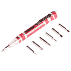
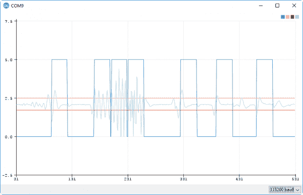

# OpenPIR 连接指南

> 原文：<https://learn.sparkfun.com/tutorials/openpir-hookup-guide>

## 介绍

被动红外(PIR)传感器检测局部区域的运动，是安全系统、家庭自动化和近程传感应用中的首选传感器。

[](https://www.sparkfun.com/products/13968) 

将**添加到您的[购物车](https://www.sparkfun.com/cart)中！**

**[20 available](https://learn.sparkfun.com/static/bubbles/ "20 available") SEN-13968

SparkFun OpenPIR 是基于 NCS36000 PIR 控制器的高度可定制的被动红外(PIR)传感器。被动…

$17.506[Favorited Favorite](# "Add to favorites") 30[Wish List](# "Add to wish list")** **SparkFun OpenPIR 是一款基于 NCS36000 PIR 控制器的高度可定制的 PIR 传感器。OpenPIR 允许您设置运动传感器的灵敏度、触发时间和脉冲模式，因此您可以根据您的应用量身定制。

### 所需材料

除了 OpenPIR 之外，我们还建议您使用一些组件来遵循本连接指南。建议使用微控制器开发板，如 [Arduino](https://www.sparkfun.com/products/11021) 、 [RedBoard](https://www.sparkfun.com/products/13975) 、 [Photon](https://www.sparkfun.com/products/13774) 或 [Teensy](https://www.sparkfun.com/products/13736) 。开发板既可用于为 OpenPIR 供电，也可用于触发其运动。

[](https://www.sparkfun.com/products/11021) 

将**添加到您的[购物车](https://www.sparkfun.com/cart)中！**

 **### [Arduino Uno - R3](https://www.sparkfun.com/products/11021)

[In stock](https://learn.sparkfun.com/static/bubbles/ "in stock") DEV-11021

这是新的 Arduino Uno R3。除了以前主板的所有功能外，Uno 现在使用 ATmega16U2 代替…

$27.95138[Favorited Favorite](# "Add to favorites") 162[Wish List](# "Add to wish list")****[](https://www.sparkfun.com/products/13975) 

将**添加到您的[购物车](https://www.sparkfun.com/cart)中！**

 **### [spark fun red board——用 Arduino 编程 T3](https://www.sparkfun.com/products/13975)

[In stock](https://learn.sparkfun.com/static/bubbles/ "in stock") DEV-13975

SparkFun RedBoard 结合了 UNO 的 Optiboot 引导程序的简单性、FTDI 的稳定性和 shield com…

$21.5049[Favorited Favorite](# "Add to favorites") 89[Wish List](# "Add to wish list")****[](https://www.sparkfun.com/products/13736) 

### [Teensy 3.2](https://www.sparkfun.com/products/13736)

[Out of stock](https://learn.sparkfun.com/static/bubbles/ "out of stock") DEV-13736

Teensy 3.2 是一款试验板友好型开发板，在一个小小的封装中提供了大量功能。

68[Favorited Favorite](# "Add to favorites") 83[Wish List](# "Add to wish list")[](https://www.sparkfun.com/products/13774) 

将**添加到您的[购物车](https://www.sparkfun.com/cart)中！**

 **### [【粒子光子】](https://www.sparkfun.com/products/13774)

[Out of stock](https://learn.sparkfun.com/static/bubbles/ "out of stock") WRL-13774

Particle 的 IoT(物联网)硬件开发板 Photon 提供了构建互联网络所需的一切…

$19.0032[Favorited Favorite](# "Add to favorites") 51[Wish List](# "Add to wish list")****** ******你还需要一些东西将 OpenPIR 的电源和信号引脚连接到那个微控制器上。OpenPIR 包括 0.1 英寸接头和 4 针 JST 连接器，因此您可以使用[公接头](https://www.sparkfun.com/products/116)或 [4 针 JST 电缆组件](https://www.sparkfun.com/products/9916)与传感器连接。

[](https://www.sparkfun.com/products/116) 

将**添加到您的[购物车](https://www.sparkfun.com/cart)中！**

 **### [破开头球——直击](https://www.sparkfun.com/products/116)

[In stock](https://learn.sparkfun.com/static/bubbles/ "in stock") PRT-00116

一排标题-打破适应。40 个引脚，可切割成任何尺寸。用于定制 PCB 或通用定制接头。

$1.7520[Favorited Favorite](# "Add to favorites") 133[Wish List](# "Add to wish list")****[](https://www.sparkfun.com/products/10897) 

将**添加到您的[购物车](https://www.sparkfun.com/cart)中！**

 **### [跳线高级 6”米/米装 100 根](https://www.sparkfun.com/products/10897)

[In stock](https://learn.sparkfun.com/static/bubbles/ "in stock") PRT-10897

这些是 26 AWG 跳线，端接为公对公。使用这些跳线从任何板上的任何母接头，到任何其他…

$26.956[Favorited Favorite](# "Add to favorites") 34[Wish List](# "Add to wish list")****[](https://www.sparkfun.com/products/9139) 

将**添加到您的[购物车](https://www.sparkfun.com/cart)中！**

 **### [跳线高级 6 "米/英尺装 100 根](https://www.sparkfun.com/products/9139)

[In stock](https://learn.sparkfun.com/static/bubbles/ "in stock") PRT-09139

这是一个 SparkFun 独家！这些是 26 AWG 跳线，端接为公母。用这些从任何一个男性身上跳下来…

$26.959[Favorited Favorite](# "Add to favorites") 17[Wish List](# "Add to wish list")****[](https://www.sparkfun.com/products/9916) 

将**添加到您的[购物车](https://www.sparkfun.com/cart)中！**

 **### [JST 跳线 4 线组装](https://www.sparkfun.com/products/9916)

[In stock](https://learn.sparkfun.com/static/bubbles/ "in stock") PRT-09916

这是一根简单的四线电缆。非常适合从一个板跳到另一个板或者做其他事情。有一个 4 针 JST 连接器…

$1.602[Favorited Favorite](# "Add to favorites") 11[Wish List](# "Add to wish list")******** ********#### 工具

最后，你需要[焊接工具](https://www.sparkfun.com/categories/49)将你选择的连接器电连接到 OpenPIR。一个[简易烙铁](https://www.sparkfun.com/products/9507)和[焊锡](https://www.sparkfun.com/products/9163)应该就够了。

您可能还需要一把小十字螺丝刀来调整 OpenPIR 背面的一对装饰孔。我们的[袖珍螺丝刀](https://www.sparkfun.com/products/12891)包括一个足够小的钻头，更大的[螺丝刀和钻头套件](https://www.sparkfun.com/products/10865)也是如此。

[](https://www.sparkfun.com/products/12891) 

将**添加到您的[购物车](https://www.sparkfun.com/cart)中！**

 **### [袖珍螺丝刀套装](https://www.sparkfun.com/products/12891)

[In stock](https://learn.sparkfun.com/static/bubbles/ "in stock") TOL-12891

每个黑客都应该拥有什么？没错，一把螺丝刀(你必须以某种方式进入那些箱子)。什么…

$4.505[Favorited Favorite](# "Add to favorites") 24[Wish List](# "Add to wish list")****[](https://www.sparkfun.com/products/9163) 

将**添加到您的[购物车](https://www.sparkfun.com/cart)中！**

 **### [无铅焊料- 15 克管](https://www.sparkfun.com/products/9163)

[In stock](https://learn.sparkfun.com/static/bubbles/ "in stock") TOL-09163

这是你的无铅焊料的基本管，带有不干净的水溶性树脂芯。0.031 英寸规格，15 克

$3.954[Favorited Favorite](# "Add to favorites") 14[Wish List](# "Add to wish list")****[](https://www.sparkfun.com/products/10865) 

将**添加到您的[购物车](https://www.sparkfun.com/cart)中！**

 **### [工具箱-螺丝刀和钻头套装](https://www.sparkfun.com/products/10865)

[Out of stock](https://learn.sparkfun.com/static/bubbles/ "out of stock") TOL-10865

没有什么比准备好一个好的黑客攻击，然后意识到你甚至不能打开盒子，因为你…

$10.957[Favorited Favorite](# "Add to favorites") 27[Wish List](# "Add to wish list")****[](https://www.sparkfun.com/products/9507) 

将**添加到您的[购物车](https://www.sparkfun.com/cart)中！**

 **### [烙铁- 30W(美国，110V)](https://www.sparkfun.com/products/9507)

[33 available](https://learn.sparkfun.com/static/bubbles/ "33 available") TOL-09507

这是一个非常简单的固定温度，快速加热，30W 110/120 VAC 烙铁。我们真的很喜欢使用更贵的 iro…

$10.957[Favorited Favorite](# "Add to favorites") 21[Wish List](# "Add to wish list")******** ********### 推荐阅读

如果您不熟悉以下概念，我们建议您在继续之前查看这些教程。

[](https://learn.sparkfun.com/tutorials/analog-to-digital-conversion) [### 模数转换](https://learn.sparkfun.com/tutorials/analog-to-digital-conversion) The world is analog. Use analog to digital conversion to help digital devices interpret the world.[Favorited Favorite](# "Add to favorites") 58[](https://learn.sparkfun.com/tutorials/logic-levels) [### 逻辑电平](https://learn.sparkfun.com/tutorials/logic-levels) Learn the difference between 3.3V and 5V devices and logic levels.[Favorited Favorite](# "Add to favorites") 82[](https://learn.sparkfun.com/tutorials/analog-vs-digital) [### 模拟与数字](https://learn.sparkfun.com/tutorials/analog-vs-digital) This tutorial covers the concept of analog and digital signals, as they relate to electronics.[Favorited Favorite](# "Add to favorites") 66[](https://learn.sparkfun.com/tutorials/pir-motion-sensor-hookup-guide) [### PIR 运动传感器连接指南](https://learn.sparkfun.com/tutorials/pir-motion-sensor-hookup-guide) An overview of passive infrared (PIR) motion detecting sensors, and how to hook them up to an Arduino.[Favorited Favorite](# "Add to favorites") 7

## 硬件概述

[](https://cdn.sparkfun.com/assets/learn_tutorials/6/2/8/openpir_header.png)

OpenPIR 的供电和接口是通过电路板底部的四个引脚实现的。这些引脚是:

| Pin Label | 描述 |
| A | NCS36000 差分放大器的模拟输出。 |
| VCC | 电源输入 |
| GND | 接地电源输入 |
| 在外 | 数字输出信号–高电平有效。 |

更多关于这些引脚的信息，请见下文。

#### 供电

OpenPIR 的电源应提供给 VCC 和 GND 引脚。OpenPIR 的工作电压供应范围为 **3V 至 5.75V** -由主板的 NCS36000 PIR 控制器指定。这意味着它可以在任何 3.3V 或 5V 系统中工作。

电气特性:

*   **电压供应范围:** 3VDC 至 5.75VDC
*   **待机平均电流:** 80 安
*   **运动检测平均电流:** 3mA (LED 启用)

OpenPIR 的功耗相对较低。当传感器未被触发且活动 LED 未亮起时，OpenPIR 将消耗约 80 A 的电流。当处于活动状态时，板载 LED 的电流消耗使 PIR 的工作电流相形见绌，消耗约 3mA。可以使用 xLED 跳线禁用该 LED(参见下面的适用部分)。

#### 数字运动触发输出

**OUT** 引脚是高电平有效数字信号，表示 OpenPIR 的运动检测。当检测到运动时，引脚被拉高；否则会低。

此引脚可以驱动高达 10mA 的电流，因此您可以将 LED 或其他小负载连接到它上面。否则，它可以直接连接到微控制器输入引脚(不需要上拉或下拉电阻)。

此引脚的操作由绿色反向输入“DET”标记的 led 反映，如果 LED 亮起，OUT 引脚应为高电平。

OUT 引脚上高电平信号的持续时间由“OSC”trimpot 设置，本节稍后将对此进行更深入的讨论。

#### 模拟输出

标有“A”的输出中断放大的 PIR 信号，然后将其发送到窗口比较器，再发送到 out 引脚。

[](https://cdn.sparkfun.com/assets/learn_tutorials/6/2/8/NCS36000-block-diagram-a-highlighted.png)

如果没有任何运动，此引脚的电压将在 2.1V 左右徘徊(在 5V Arduino 的 10 位 ADC 输入上约为 430)。然而，当检测到运动时，电压可能会剧烈波动。

[](https://cdn.sparkfun.com/assets/learn_tutorials/6/2/8/serial-plotter-aout-example-2.png)

此引脚可用于更好地了解哪种运动触发了 PIR。PIR 的单次通过可能只会在“A”引脚上产生一个小的“信号”,而剧烈的运动可能会产生一个大的尖峰波输出。

### LED 输出

板上有一个反向进入的绿色 LED，它复制了 OUT 引脚的状态。当检测到运动时，LED 将点亮；否则它将保持关闭。

[](https://cdn.sparkfun.com/assets/learn_tutorials/6/2/8/Open_Pir-03.jpg)

初次通电时， **LED 将闪烁**，表示 NCS36000 处于启动模式。启动模式可以持续几秒或几分钟——启动时间的长短取决于“OSC”微调按钮的位置。装运时的启动模式时间约为两分钟。

打开“xLED”跳线可以禁用 LED**。请注意，在启动模式下，无论跳线的状态如何，LED 仍会闪烁。**

### Trimpots -灵敏度和振荡器窗口

OpenPIR 背面的一对微调电位计(微调端口)可用于定制运动传感器的行为。

[](https://cdn.sparkfun.com/assets/learn_tutorials/6/2/8/openpir_pots.png)

标记为“SEN”的**灵敏度微调按钮**可用于调整 OpenPIR 的**视角距离**。顺时针转动这个微调按钮越多，你的传感器应该能看得越远。当您收到主板时，trimpot 将居中，传感器将对在 6 到 8 英尺(2 到 2.5 米)范围内走动的人做出反应。在最大灵敏度下，传感器将检测到一个人在大约 16 英尺(5 米)处走过。

避免将“SEN”微调按钮转到底(逆时针)。这将禁用 OpenPIR 的输出——即使是最移动的环境也不会触发活动输出。

“OSC”trimpot 最终控制输出保持高电平的时间长度。该 trimpot 用于调整 NCS36000 的振荡器频率。顺时针转动此微调按钮**增加保持高电平的时间长度**。

当 OSC trimpot 一直逆时针转动时，OUT 引脚将保持高电平约 400 毫秒。相反，当 trimpot 转到远顺时针方向时，OSC 引脚将保持高电平约 7.5 秒。触发时间应该在这两个值之间相对线性地调整。当你收到板子的时候，它会居中，触发脉冲会持续不到四秒。

### 触发模式——双路与单路

NCS36000 支持两种运动检测模式:单脉冲和双脉冲。这两种模式都可以使用电路板背面微调端口附近的开关来选择。

[](https://cdn.sparkfun.com/assets/learn_tutorials/6/2/8/openpir_switch_1.png)

NCS36000 使用一个窗口比较器(一对具有电压上限和下限的[比较器](https://en.wikipedia.org/wiki/Comparator))来触发 OUT 引脚上的脉冲。在**单脉冲**模式下，高于*或低于上下比较器*的电压将触发一个输出脉冲。但是在**双脉冲**模式下，电压必须在设定的时间限制内摆动到高于高比较器电压和低于低比较器电压，才能触发输出。

NCS36000 数据手册中的这些时序图有助于区分单脉冲和双脉冲:

[](https://cdn.sparkfun.com/assets/learn_tutorials/6/2/8/single-vs-dual-pulse-modes.png)

单脉冲模式可用于检测进入*或*PIR 视场的物体，而双脉冲检测可用于检测进入*和*视场的物体。

## 硬件装配

在给 OpenPIR 供电并将其连接到项目之前，您需要将*某物*焊接到电路板底部的四个引脚上。

New to soldering? Check out our [Through-Hole Soldering Tutorial](https://learn.sparkfun.com/tutorials/how-to-solder---through-hole-soldering) for a quick introduction!

OpenPIR 的电源和输出引脚分为一个标准 0.1 英寸接头和一个 4 引脚 JST PH 连接器，为您提供了多种选择，您可以选择将什么焊接到传感器上。对于 0.1 "接头，可以焊接[公接头](https://www.sparkfun.com/products/116)(或[直角版](https://www.sparkfun.com/products/553))、[母接头](https://www.sparkfun.com/products/115)或[导线](https://www.sparkfun.com/products/11375)。

[](https://cdn.sparkfun.com/assets/learn_tutorials/6/2/8/Open_Pir-01.jpg)

或者你可以将一个 [4 针 JST 连接器](https://www.sparkfun.com/products/9916)焊接到更小间距的封装上。

[](https://cdn.sparkfun.com/assets/learn_tutorials/6/2/8/Open_Pir-02.jpg)

作为奖励，将我们的 [4 线 JST 电缆组件](https://www.sparkfun.com/products/9916)插入 OpenPIR 将逻辑地对电源引脚进行颜色编码 black 为红色，GND 为黑色，OUT 为黄色，模拟输出连接到蓝色。

## 软件

下面的固件示例使用 [Arduino](https://www.arduino.cc/) 来演示如何使用数字输出和模拟输出。以下是示例代码中使用的示例电路:

[](https://cdn.sparkfun.com/assets/learn_tutorials/6/2/8/openpir_bb.png)*Having a hard time seeing the circuit? Click on the wiring diagram for a closer look.*

然后上传下面的示例代码，这样您就可以开始感受 OpenPIR 的输出引脚了:

```
language:c
//////////////////////////
// Hardware Definitions //
//////////////////////////
#define PIR_AOUT A0  // PIR analog output on A0
#define PIR_DOUT 2   // PIR digital output on D2
#define LED_PIN  13  // LED to illuminate on motion

#define PRINT_TIME 100 // Rate of serial printouts
unsigned long lastPrint = 0; // Keep track of last serial out

void setup() 
{
  Serial.begin(115200);  // Serial is used to view Analog out
  // Analog and digital pins should both be set as inputs:
  pinMode(PIR_AOUT, INPUT);
  pinMode(PIR_DOUT, INPUT);

  // Configure the motion indicator LED pin as an output
  pinMode(LED_PIN, OUTPUT);
  digitalWrite(LED_PIN, LOW); // Turn the LED off
}

void loop() 
{
  // Read OUT pin, and set onboard LED to mirror output
  readDigitalValue(); 

  // Read A pin, print that value to serial port:
  printAnalogValue();
}

void readDigitalValue()
{
  // The OpenPIR's digital output is active high
  int motionStatus = digitalRead(PIR_DOUT);

  // If motion is detected, turn the onboard LED on:
  if (motionStatus == HIGH)
    digitalWrite(LED_PIN, HIGH);
  else // Otherwise turn the LED off:
    digitalWrite(LED_PIN, LOW);
}

void printAnalogValue()
{
  if ( (lastPrint + PRINT_TIME) < millis() )
  {
    lastPrint = millis();
    // Read in analog value:
    unsigned int analogPIR = analogRead(PIR_AOUT);
    // Convert 10-bit analog value to a voltage
    // (Assume high voltage is 5.0V.)
    float voltage = (float) analogPIR / 1024.0 * 5.0;
    // Print the reading from the digital pin.
    // Mutliply by 5 to maintain scale with AOUT. 
    Serial.print(5 * digitalRead(PIR_DOUT));
    Serial.print(',');    // Print a comma
    Serial.print(2.5);    // Print the upper limit
    Serial.print(',');    // Print a comma
    Serial.print(1.7);    // Print the lower limit
    Serial.print(',');    // Print a comma
    Serial.print(voltage); // Print voltage
    Serial.println();
  }
} 
```

该代码使用 Arduino 的板载 LED - on 引脚 13 -来反映 OpenPIR 的数字运动输出。当检测到运动时，Arduino 的 LED 应该会亮起。

四个值被打印到串行终端-来自数字引脚的读数(乘以 5...出于某种原因)，比较器电压阈值的上限和下限以及来自模拟引脚的读数。打开你的串行监视器——设置波特率为 115200——查看它们的数据流:

[](https://cdn.sparkfun.com/assets/learn_tutorials/6/2/8/serial-terminal-example-3.png)

由于使用串行终端可能难以可视化传感器的模拟输出，尝试打开**串行绘图仪**(位于【工具】>“串行绘图仪”菜单下)。

[](https://cdn.sparkfun.com/assets/learn_tutorials/6/2/8/serial-plotter-voltage-thresholds.png)

您应该会看到两个独立的线图:浅蓝色表示模拟值，深蓝色表示数字输出。橙色和红色直线代表上限和下限，模拟值必须超过该值才能触发动作。

挥动传感器，更好地感受模拟输出的行为。请务必尝试单模和双模，看看开关如何改变传感器的功能。

## 资源&更进一步

既然您已经成功地启动并运行了 OpenPIR，那么是时候将它整合到您自己的项目中了！

有关更多信息，请查看以下资源:

*   [OpenPIR 原理图](https://cdn.sparkfun.com/assets/learn_tutorials/6/2/8/SparkFun-OpenPIR-NCS36000-schematic.pdf)
*   [NCS36000 数据表](https://cdn.sparkfun.com/assets/learn_tutorials/6/2/8/NCS36000-D.pdf)
*   [OpenPIR Eagle 文件](https://cdn.sparkfun.com/assets/learn_tutorials/6/2/8/SparkFun-OpenPIR-NCS36000_1.zip)
*   [OpenPIR GitHub 库](https://github.com/sparkfun/OpenPIR)

你的下一个项目需要一些灵感吗？查看一些相关教程:

[](https://learn.sparkfun.com/tutorials/vernier-photogate) [### 游标光电门](https://learn.sparkfun.com/tutorials/vernier-photogate) Vernier Photogate Timer -- using the Serial Enabled LCD Kit.[Favorited Favorite](# "Add to favorites") 2[](https://learn.sparkfun.com/tutorials/photon-remote-water-level-sensor) [### 光子远程水位传感器](https://learn.sparkfun.com/tutorials/photon-remote-water-level-sensor) Learn how to build a remote water level sensor for a water storage tank and how to automate a pump based off the readings 15[](https://learn.sparkfun.com/tutorials/are-you-okay-widget) [### 你还好吗？小部件](https://learn.sparkfun.com/tutorials/are-you-okay-widget) Use an Electric Imp and accelerometer to create an "Are You OK" widget. A cozy piece of technology your friend or loved one can nudge to let you know they're OK from half-a-world away.[Favorited Favorite](# "Add to favorites") 6[](https://learn.sparkfun.com/tutorials/boss-alarm) [### Boss 警报](https://learn.sparkfun.com/tutorials/boss-alarm) Build a Boss Alarm that alerts you of anyone walking into your office and automatically changes your computer screen.[Favorited Favorite](# "Add to favorites") 19************************