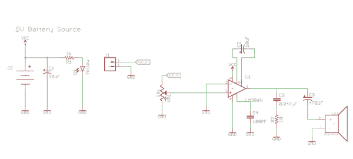

# 采用 LTSpice 的运算放大器简介

> 原文：<https://learn.sparkfun.com/tutorials/introduction-to-operational-amplifiers-with-ltspice>

## 介绍

如果你还没有阅读《LTSpice 入门指南》,你绝对应该等待，因为音频质量的更新是迫切需要的。对于那些看过并看完它的人，祝福你们。我想在这里一石二鸟，继续学习 LTSpice 教程，介绍运算放大器(简称 op amp)。我们将在这里讨论一些基础知识——什么是运算放大器、一些常见配置和几个例子——最后，我们将以一个简单的项目结束，希望能激发您更多地使用模拟电路。

要开始，请点击下面的按钮下载原理图、符号和模拟。

[LTSpice SIMs DOWNLOAD](https://cdn.sparkfun.com/assets/learn_tutorials/6/5/2/sims2.zip)

### 运算放大器简介

运算放大器是一种电压放大器件。运放是一个**有源**电路元件，在一些外部元件的帮助下，可以进行加、减、乘、除、微分、积分等数学运算。如果我们看看通用运算放大器封装(内部器件将在后面的教程中介绍)，比如无处不在的 [741](http://www.ti.com/lit/ds/symlink/lm741.pdf) ，我们会注意到一个标准的 8 引脚 DIP(双列直插式封装):

*Photo courtesy of Learning About Electronics*

我们主要关心其中的五个图钉。运算放大器的电路符号是一个有五个引脚的三角形，如下所示。

*Photo courtesy of Virtual Labs*

运算放大器用途广泛，根据各引脚的连接方式，最终电路可能是以下几种(这绝不是一个完整的列表):

*   **比较器**
*   一个**反相放大器**，例如一个求和放大器
*   一个**非反相放大器**，例如一个电压跟随器
*   **差动放大器**
*   **微分器**或**积分器**
*   **过滤器**
*   **峰值检测器**
*   **模数转换器**
*   **振荡器**

在本教程中，我将向您展示如何测量运算放大器的典型特性，如增益、带宽、误差、压摆率、功耗、输出摆幅以及器件数据手册中的其它特性。

## 理想的运算放大器

运算放大器设计用于检测输入端(正(v2)和负(v1)端，或运算放大器封装的引脚 2 和 3)施加的电压差。该差值也称为*差分输入电压*。因此，输出是输入端检测到的差值乘以某个值 A，即**开环增益**。运算放大器相当于一个压控电压源，我们现在将对其进行建模。我们将模拟开环和**闭环**放大器配置。

理想的运算放大器具有以下特性:

*   无限**开环增益**
*   无穷大的**输入电阻**
*   零**输出电阻**
*   零**共模增益** =无穷大**共模抑制**
*   无限**带宽**
*   零**噪声**
*   零输入**偏移**

*Op amp model courtesy of wikipedia*

因为输入电阻(Rin)是无穷大，所以我们可以利用基尔霍夫定律推导出(+)(v2)和(-)(v1)端的电流为零。由于输出电阻(Rout)为零，因此输出端没有电压损失。上图中的菱形电压源称为电压相关电压源，在这种情况下，电压等于增益(G)乘以输入端之间的差值(Vin)。文本中通常将增益称为(A ),因此输出公式如下:

让我们建立一个压控电压源模型，看看能否让它的行为模拟理想的运算放大器。

[https://www.youtube.com/embed/t8vR499dEg8/?autohide=1&border=0&wmode=opaque&enablejsapi=1](https://www.youtube.com/embed/t8vR499dEg8/?autohide=1&border=0&wmode=opaque&enablejsapi=1)

## 放大器反馈

运算放大器不应作为独立器件使用。我们只是在理想运算放大器视频中验证了 Vout 公式，以说明为什么它通常被称为压控电压源。我们要讲的是**反馈**和**闭环**增益和应用。什么是反馈？当系统的输出作为输入被反馈时，就产生了反馈。反馈有两种类型:积极的(再生的)和消极的(退化的)。反馈被应用到系统以影响一个或多个以下属性:

*   降低增益灵敏度-增益值对于电路元件值的变化变得不太敏感，例如温度对晶体管的影响。
*   减少非线性失真-输出与输入成正比。
*   减少噪音影响-减少输出端不必要的电气干扰。这种干扰可能来自外部，也可能来自电路元件本身。
*   控制输入和输出电阻-通过适当的反馈配置，可以控制输入和输出电阻。
*   扩展放大器的**带宽**。我们需要注意这里的[增益带宽积](https://en.wikipedia.org/wiki/Gain%E2%80%93bandwidth_product)。你可以(在一定程度上)扩展带宽，但要以增益为代价。增益带宽积是常数，描述运算放大器相对于频率的增益行为。

### 关于单位的快速说明

当我们谈论增益时，我们是指输出与输入的比值。如果输出和输入都用电压表示，那么单位就是伏特/伏特。在。交流分析增益以分贝为单位。这是转换公式。

*Photo Courtesy of Planet Analog*

所有的反馈都是有代价的，而代价就是收益。负反馈用增益换取更理想的性能；增加输入电阻也会增加带宽。

### 闭环增益

与开环增益不同，闭环增益取决于外部电路，因为存在反馈。但是，可以一概而论。

*Photo Courtesy of https://paginas.fe.up.pt/~fff/eBook/MDA/Teo_realim.html*

## 反相放大器

反相配置的一个例子由一个运算放大器和两个电阻 R1 和 R2 组成。R2 从运算放大器的输出端连接到运算放大器的反相端或负端。R2 闭合了运算放大器的环路。

[https://www.youtube.com/embed/yQur5HqCo_4/?autohide=1&border=0&wmode=opaque&enablejsapi=1](https://www.youtube.com/embed/yQur5HqCo_4/?autohide=1&border=0&wmode=opaque&enablejsapi=1)

下面的视频中没有提到一件事，但被认为是*隐含的*，因为我们仍然使用理想的运算放大器，那就是没有电流流过运算放大器。所有流经 R1 的电流(I1)也流经 R2。另一点需要注意的是，如果 R1 和 R2 的值相等，则该电路通常用于将-vout 转换为+vout(改变相位)。这就是所谓的单位增益反相器。

### 项目:求和放大器

反相放大器的典型应用是求和放大器，也称为虚地混频器，用于音频混合。我手头正好有几个 LM741 运算放大器，所以我构建了一个求和放大器。首先我在 LTSpice 中建模。

[https://www.youtube.com/embed/ixMhM6GqHwo/?autohide=1&border=0&wmode=opaque&enablejsapi=1](https://www.youtube.com/embed/ixMhM6GqHwo/?autohide=1&border=0&wmode=opaque&enablejsapi=1)

[https://www.youtube.com/embed/m7FYMo3e_3c/?autohide=1&border=0&wmode=opaque&enablejsapi=1](https://www.youtube.com/embed/m7FYMo3e_3c/?autohide=1&border=0&wmode=opaque&enablejsapi=1)

## 非反相放大器

[https://www.youtube.com/embed/W8dQGPCW5cM/?autohide=1&border=0&wmode=opaque&enablejsapi=1](https://www.youtube.com/embed/W8dQGPCW5cM/?autohide=1&border=0&wmode=opaque&enablejsapi=1)

### 电压跟随器

电压跟随器是非反相放大器的一个很好的例子。非常高的输入阻抗是同相配置的一个理想特性。电压跟随器可以用作从高阻抗源连接到低阻抗源的单位增益缓冲放大器，这有助于避免驱动电路上的负载效应。

## 差动放大器

差动放大器响应施加在其输入端的两个信号之间的差异，并抑制两个输入端共有的信号。

### 单运算放大器差动放大器

请记住，同相放大器的增益为正，由下式给出:

反相放大器的增益为负，由下式给出:

通过结合这两种拓扑结构，我们更有可能设计出能够获得两个输入信号之差的电路。为了实现这一点，我们必须首先确保每个的增益幅度(认为绝对值总是正的)相等。通过衰减从(1+ R2/R1)到(R2/R1)的正路径的增益，我们已经做到了。我们现在有四个电阻；我们需要确保增益相等，因此电阻比很重要:

这种电路的问题在于，为了获得高增益，R1 必须相对较低。这导致输入电阻下降。另一个问题是，改变这个放大器的增益并不容易。仪表放大器的应用解决了这两个问题。使用三个运算放大器，我们可以得到一个微调差分放大器。由于使用一个运算放大器存在低输入电阻的问题，我们可以在每个输入端增加一个额外的电压跟随器或缓冲器。更棒的是，缓冲器可以增加增益，减轻第二级差动放大器的负担。

仪表放大器完美地结合了所有以前的材料:级联的反相和同相放大器。

在本教程中，我们不会讨论积分器、微分器、振荡器或 AD 转换器。一旦我们开始增加电容和电感，数学就变得更加专业和一般化，就阻抗而不是电阻而言。这些将是一个单独的教程。

## 运行特性

如果我们看一下 [LM386 音频放大器](http://www.jameco.com/Jameco/Products/ProdDS/839826.pdf)的数据手册，我们会看到大量有助于描述运算放大器特性的参数。其中大部分可以通过 LTSpice 中的仿真来验证。在我们到达那里之前，让我们定义一些特征。

### 共模抑制比

[共模抑制比(CMRR)](http://www.analog.com/media/en/training-seminars/tutorials/MT-042.pdf) 测量两个输入端共有但未放大的信号数量。期望共模增益非常低，这对应于非常高的 CMRR。

共模抑制比是差分增益的绝对值与共模增益的绝对值之比。差分增益通常是制造商设定的 MOS 晶体管固有增益的一半。具有高输出电阻的运算放大器将具有最佳的 CMRR。

### 电源抑制比

[电源抑制比或 PSRR](http://pallen.ece.gatech.edu/Academic/ECE_6412/Spring_2003/L180-PSRR-2UP.pdf) 衡量电源纹波对运算放大器输出电压的影响。PSSR 对 MOSFET 器件非常重要，因为它们通常位于混合信号 IC 上，电路中的数字开关会导致电源纹波增加。在设计中，您最不希望的就是通过运算放大器放大纹波。

这里的要点是，为了最大限度地降低电源纹波的影响，运算放大器需要具有较大的 PSRR。因此，在查看任何即将开展的项目的数据表时，请记住这一点。

### 转换速度

压摆率指运算放大器输出端的最大可能变化率。大多数运算放大器都有压摆率限制，计算方法是取运算放大器输出电压相对于时间的导数的最大值。

### 总谐波失真

音频放大器的任务是接收一个小信号并放大，除了放大之外不做任何改变。这是一项艰巨的任务，因为无用信号(即纹波)可能会随着有用信号一起被放大。任何偏离线性的情况都被认为是失真。[谐波失真](http://hyperphysics.phy-astr.gsu.edu/hbase/Audio/amp.html#c3)是音频应用中常见的失真形式，输出信号的峰值被“削波”列出的 [THD](http://www.analog.com/en/analog-dialogue/articles/confused-about-amplifier-distortion-specs.html) 的百分比越低越好，但是在某个点之后，人耳几乎察觉不到。

[https://www.youtube.com/embed/A2W6qUtOFsQ/?autohide=1&border=0&wmode=opaque&enablejsapi=1](https://www.youtube.com/embed/A2W6qUtOFsQ/?autohide=1&border=0&wmode=opaque&enablejsapi=1)

[https://www.youtube.com/embed/VyCKsGFKbnc/?autohide=1&border=0&wmode=opaque&enablejsapi=1](https://www.youtube.com/embed/VyCKsGFKbnc/?autohide=1&border=0&wmode=opaque&enablejsapi=1)

## LM386 音频放大器

模拟、验证、建造——这是我的座右铭。在这种情况下，迷你便携式吉他放大器项目的情况下，我走得太远了。我找不到可以导入到 LTSpice 中的模型，我从零开始。下面是一个按钮，您可以在这里下载我将要向您展示的项目文件。我基于 [LM386](http://www.jameco.com/Jameco/Products/ProdDS/839826.pdf) 设计了一个运算放大器，但用 MOSFETs 代替了 BJT。实际上，我的设计比我的设计所基于的器件略胜一筹，但它只能在 2 至 6 伏范围内工作。尽管我的 LM386 模型与项目中使用的器件并不完全相同，但它仍然有助于了解运算放大器的电气特性，并进一步熟悉 LTSpice。

### 项目:迷你便携式吉他放大器

我使用 LM386 和最少的额外部件，在我的吉他外壳中内置了一个小型电池供电放大器。整个建筑大约花费 5.00 美元，不到一个小时就完成了。电路直接取自数据手册应用部分(增益 200):

我只对输出电容做了改动。我手边没有一个 250 微法的电容器，我把它换成了一个 470 微法的。我还添加了 1/4”单声道音频插座，用于吉他电缆，并添加了一个状态 LED，这样我就知道我什么时候准备好摇滚了。我的吉他盒有一个小隔间，可以放电缆和拨片，所以我用那个空间来放扩音器。

示意图:

注:J1 是 1/4 英寸母单声道音频插孔。

观看它的实际应用:

[https://www.youtube.com/embed/CD7LFcF5WD8/?autohide=1&border=0&wmode=opaque&enablejsapi=1](https://www.youtube.com/embed/CD7LFcF5WD8/?autohide=1&border=0&wmode=opaque&enablejsapi=1)

## 资源和更进一步

### 虚拟运算放大器实验室:

《来自外太空的音乐》的创作者雷·威尔逊制作了这个 [MFOS 虚拟运算放大器应用](http://musicfromouterspace.com/index.php?MAINTAB=SYNTHDIY&PROJARG=ELECTRONICS/TECHBENCH/TECHBENCH.php?a=a&VPW=1910&VPH=759)，它允许我们在模拟示波器上查看输出的同时对运算放大器进行实验。

**Note:** If the link tells you the Operational Amp Application isn't found, click on the "Synth-DIY" tab at the top and it should refresh appropriately. Alternatively, you can search for "MFOS In The Classroom" in the left hand menu and choose "Virtual Op Amp Lab".

### 来自外太空的音乐

曾经想进入 DIY 合成器，但不知道从哪里开始？来自外太空的音乐是一个很好的资源，提供了数百张雷·威尔逊设计的原理图。

### 业余爱好者

如果你刚刚进入模拟电子项目，我怎么推荐 Forrest Mims 的工程师迷你笔记本都不为过。

### 测量 CMRR

EE Times 有一篇[很棒的文章](http://www.eetimes.com/document.asp?doc_id=1230785)关于共模抑制比和差分放大器。