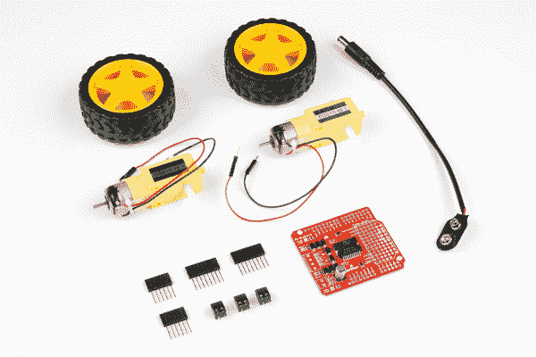
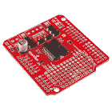
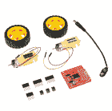

# Ardumoto 套件连接指南

> 原文：<https://learn.sparkfun.com/tutorials/ardumoto-kit-hookup-guide>

## 介绍

[Ardumoto Shield](https://www.sparkfun.com/products/14129) 是 Arduino 的双电机控制器。结合 Arduino，Ardumoto 为遥控车辆甚至小型自主机器人提供了一个奇妙的控制器平台。它现在更容易使用，具有控制信号 led，同时对高级用户来说也更加灵活。

*Ardumoto Shield assembled and situated on a [RedBoard](https://www.sparkfun.com/products/12757).*

我们出售的 Ardumoto Shield 既可以单独出售，也可以与我们的 [Ardumoto Shield 套件](https://www.sparkfun.com/products/14180)中的一组电机和轮子一起出售。该套件包括防护罩以及成对的[轮胎](https://www.sparkfun.com/products/13259)、[电机](https://www.sparkfun.com/products/13302)和连接器。当然，它都被塞在一个经典的 SparkFun 红色盒子里(作为机器人底盘可能会派上用场)。

*Contents of the [Ardumoto Shield Kit](https://www.sparkfun.com/products/14180).*

### 本教程涵盖的内容

本教程涵盖了 Ardumoto Shield 和 Ardumoto Shield 套件的组装和使用。深入挖掘，我们将得到一些组装技巧和一个示例 Arduino 草图。我们还将展示一些额外资源，帮助您充分利用您的主板。

本指南假设您熟悉 Arduino 平台，并且能够成功编译程序并将其加载到基于 ATmega328P 的主板上，例如 blink.ino。

### 所需工具和材料

为了跟随本教程，你需要一个 [Ardumoto Shield](https://www.sparkfun.com/products/14129) 或 [Ardumoto Shield Kit](https://www.sparkfun.com/products/14180) ，以及一个 [Arduino](https://www.sparkfun.com/products/13975) 或 [Arduino 兼容开发板](https://learn.sparkfun.com/tutorials/arduino-comparison-guide)。

 

将**添加到您的[购物车](https://www.sparkfun.com/cart)中！**

### [Arduino Uno - R3](https://www.sparkfun.com/products/11021)

[In stock](https://learn.sparkfun.com/static/bubbles/ "in stock") DEV-11021

这是新的 Arduino Uno R3。除了以前主板的所有功能外，Uno 现在使用 ATmega16U2 代替…

$27.95138[Favorited Favorite](# "Add to favorites") 162[Wish List](# "Add to wish list")**** 

将**添加到您的[购物车](https://www.sparkfun.com/cart)中！**

### [spark fun red board——用 Arduino 编程 T3](https://www.sparkfun.com/products/13975)

[In stock](https://learn.sparkfun.com/static/bubbles/ "in stock") DEV-13975

SparkFun RedBoard 结合了 UNO 的 Optiboot 引导程序的简单性、FTDI 的稳定性和 shield com…

$21.5049[Favorited Favorite](# "Add to favorites") 89[Wish List](# "Add to wish list")**** 

将**添加到您的[购物车](https://www.sparkfun.com/cart)中！**

### [SparkFun Ardumoto -马达驱动盾](https://www.sparkfun.com/products/14129)

[In stock](https://learn.sparkfun.com/static/bubbles/ "in stock") DEV-14129

Ardumoto Shield 是 Arduino 的双电机控制器。基于 L298 H 桥，SparkFun Ardumoto 可以驱动两个 D…

$22.50[Favorited Favorite](# "Add to favorites") 9[Wish List](# "Add to wish list")**** 

将**添加到您的[购物车](https://www.sparkfun.com/cart)中！**

### [火花乐趣 Ardumoto 盾牌套件](https://www.sparkfun.com/products/14180)

[27 available](https://learn.sparkfun.com/static/bubbles/ "27 available") KIT-14180

机器人很好玩，Arduinos 很容易。所以，如果有一个工具包，包括你需要的一切，那不是很好吗？

$32.504[Favorited Favorite](# "Add to favorites") 17[Wish List](# "Add to wish list")******** ********#### 装备 Ardumoto 防护罩(非套件版本)

如果你只有盾牌，你可能还会想要几辆 DC 汽车来驾驶。Ardumoto 可以控制大多数小型 DC 电机，就像我们的 [DC 电机类别](https://www.sparkfun.com/categories/247)中的任何一种。

你还需要一些连接器将所有东西连接在一起。我们建议使用[可堆叠插头](https://www.sparkfun.com/products/10007)将 Ardumoto 连接到 Arduino，并使用两到三个[3.5 毫米螺丝端子](http://www.sparkfun.com/products/8084)帮助将电机连接到 Ardumoto。

要将 Ardumoto Shield 升级为套件，请添加以下组件:********