# 建造一个安全的破解机器人

> 原文：<https://learn.sparkfun.com/tutorials/building-a-safe-cracking-robot>

## 介绍

我老婆很厉害；今年圣诞节，她给了我一个从 Craigslist 上买的防火保险箱。它非常便宜，因为卖家没有密码。史上最好的礼物。

1)找一个没有打开过的保险箱。

第二步)部署机器人军队。

[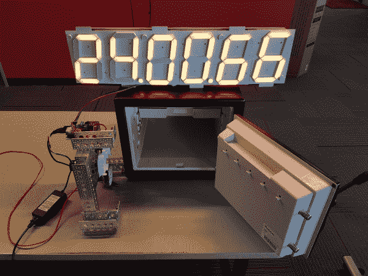](https://cdn.sparkfun.com/assets/learn_tutorials/6/5/1/Cracked_Safe.jpg)*Combination 24/0/66*

我们在 40 分 42 秒内破解了 Craigslist 的保险箱！如果你愿意，你可以再看一遍现场破解。神奇的时刻发生在 [45:20](https://www.youtube.com/watch?v=AsVSEHv2N4M&t=45m10s) ，但在 [44:30](https://www.youtube.com/watch?v=AsVSEHv2N4M&t=44m30s) 左右开始，以获得正在发生的事情的完整范围。

[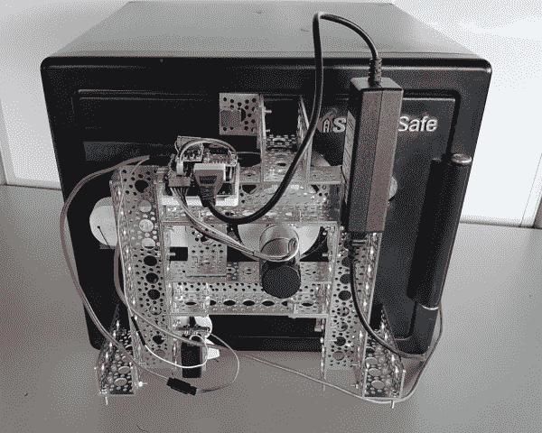](https://cdn.sparkfun.com/assets/learn_tutorials/6/5/1/Safe-Cracking-Robot-1.jpg)

用于组合保险箱的暴力机器人并不新鲜。他们有时被称为“自动拨号器”。而且，使用音频反馈的机器人有时被称为“软钻”。SparkFun 保险箱破解程序是自动拨号器的变体。我们没有尝试解决方案域中的每一种组合(称为暴力强制)，而是使用一些技巧来缩小域和快捷方式来加快测试过程。此外，SparkFun 保险箱破解器价格便宜(～200 美元)，磁性附着在保险箱上，并且是非破坏性的；当我们结束时，你永远不会知道我们在那里。

## 这不是个坏主意吗？

我们相信知识和教育是对抗恐惧和暴政的最佳保护。SparkFun 保险箱破解工具旨在打开安全性非常低的组合防火保险箱。有高端，安全，昂贵的组合保险箱可用，有能力检测和挫败这种类型的拨号器攻击。或者，你可以用键盘保险箱。

## 打造自己的！

我们记录并分享了我们学到的所有经验，希望你也能建立自己的经验。你需要一台 3D 打印机、烙铁，以及编写代码和修改 3D 文件的能力，以适应你试图打开的保险箱类型。

这是一个复杂的构建，因此这里有一个文档列表:

*   [PCB 的 Eagle 文件](https://github.com/sparkfunX/Safe_Cracker/tree/master/Hardware)
*   [示意图](https://cdn.sparkfun.com/assets/learn_tutorials/6/5/1/Safe_Cracker_Shield.pdf)
*   [基于 Arduino 的固件](https://github.com/sparkfunX/Safe_Cracker/tree/master/Firmware)
*   刻度盘连接器和手柄拔出器的 3D 文件
*   [保险箱的 3D 模型](https://github.com/sparkfunX/Safe_Cracker/tree/master/3D)
*   SparkFun [零件清单](https://www.sparkfun.com/wish_lists/154331)
*   附加零件:
    *   40 美元 [DC 减速电机](https://www.pololu.com/product/2827)
    *   三个 [BCA6 磁铁](https://www.kjmagnetics.com/proddetail.asp?prod=BCA6)工作得非常好
    *   [定制 PCB](https://github.com/sparkfunX/Safe_Cracker/tree/master/Hardware) (从您最喜欢的工厂订购)

总的来说，我们花了大约 200 美元在我们的安全破解上，这只是专业设备成本的一小部分。

最新的文件，请点击查看[报告。](https://github.com/sparkfunX/Safe_Cracker)

[GitHub Repo: Safe Cracker](https://github.com/sparkfunX/Safe_Cracker)

## 刻度盘和耦合器

[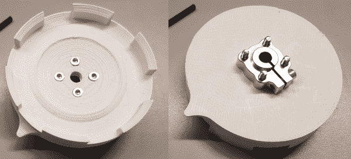](https://cdn.sparkfun.com/assets/learn_tutorials/6/5/1/Safe-DialCoupler.jpg)

我们保险箱的表盘是模拟的，一个耦合器是 3D 打印的。它通过一个 [6mm 的夹紧轮毂](https://www.sparkfun.com/products/12264)连接到我们的电机上。我们发现有固定螺丝的轮毂会很快松动，严重破坏我们的控制算法。使用夹紧轮毂！

我们用了一台价格为 40 美元的 Pololu 电机，其规格如下

*   12V 电机
*   350 毫安自由运行
*   5A 隔间
*   80 转/分
*   每转 8400 次计数

每转的次数是最重要的。我们想要一个成本更低的电机，它具有很高的分辨率来测量 C 盘的内部凹痕(在后面的部分中讨论)。12V 很好，因为我们在我们的[速度陷阱](https://www.youtube.com/watch?v=uC9CkhJiIaQ)项目中使用了类似的电源和显示器。

编码器使用两个中断引脚连接到 Arduino 上的中断引脚。一旦我们将刻度盘归零，步数就被用来确定刻度盘在哪个数字上。

快速示例:

100 / 8400 =每个数字 84 个刻度 3226 步=拨号号码 34

值得注意的是，耦合器的公差拨号和刚性的枢纽和电机安装是很重要的。系统中的任何松懈都会在以后造成问题。

**原位校准**

我们尝试了几种不同的方法来校准刻度盘。最初，我们尝试了一种带有内置于 3D 打印耦合器中的磁铁的簧片开关。这是一个可怕的想法:簧片开关检测相对接近度，但不善于检测精确位置。我有几个例子，当磁铁在开关正下方时，簧片开关会打开，当磁铁移动几毫米远时，簧片开关又会关闭。不要使用簧片开关。

[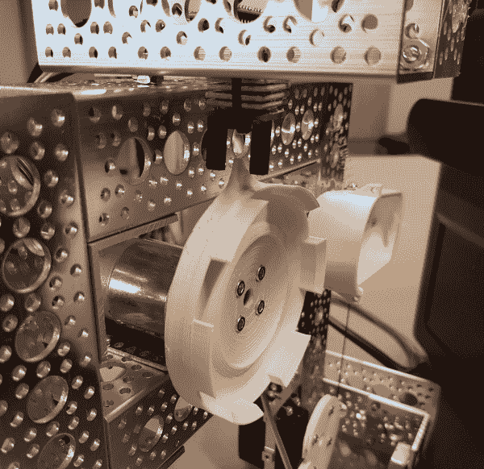](https://cdn.sparkfun.com/assets/learn_tutorials/6/5/1/Safe-CouplerPhotoGate.jpg)

我们最终使用了一个光电门，在耦合器中设计了一个小旗子。当门被旗子打破时，很容易检测到。当机器人磁性附着在保险箱上时，刻度盘处于未知位置。有一个偏移变量可以设置，这样当你说，“回家”时，机器人会计算出旗子在刻度盘位置 43，它需要再移动 57 才能到家。

一旦校准(并经过大量的代码修改)，我们发现控制拨号是非常可靠的。在破解过程中，为了安全起见，我们每次调整 A 盘时都会重新校准。

## 手柄拔出器

[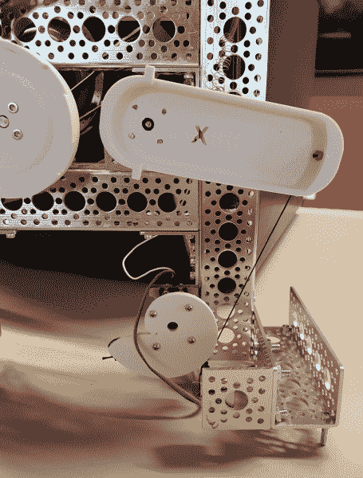](https://cdn.sparkfun.com/assets/learn_tutorials/6/5/1/Safe-HandleServo.jpg)

我们尝试了几种不同的方法来非永久性地连接到手柄上。首先，我们必须制作保险箱手柄的模型，然后设计并打印一个连接器。它基本上是一个护罩，带有一个惰轮销，通过连接在护罩末端的 40 磅绳索旋转。当伺服机构返回到静止位置时，小弹簧用于将护罩和手柄带回到返回位置。你不想让把手承受它自身的重量，否则它可能会掉到转盘上，卡在 c 盘的凹槽里。

我们真的想使用现成的伺服成本和易用性。一个基本的 [83 盎司-英寸伺服](https://www.sparkfun.com/products/11965)工作正常，但它没有足够的投掷来保证它可以拉手柄足够远到打开位置。Rob 有了突破:使用 nautilus 的设计，当伺服头拉动绳子时，我们可以向手柄施加越来越大的扭矩。它非常好用。

此外，我们修改了我们的伺服给我们模拟反馈(有很好的教程 [1](https://medium.com/@aleclombardo/modifying-a-servo-motor-for-analog-feedback-b1cca818181f) 和 [2](http://www.instructables.com/id/Servo-Feedback-Hack-free/) 关于如何做到这一点)。模拟反馈很重要；当你告诉伺服磁头去 175 位置时，它真的到了吗？做一个`analogRead()`让我们知道我们是否已经到达。

为了检测保险箱是否被打开，我们通过将 PWM 值设置为 80 来告诉伺服机构拉动把手。如果我们拨入了正确的组合，伺服系统可以自由地完全下拉并移动到这个 PWM 值。手柄拉下时的模拟值约为 273。如果伺服受到阻碍(错误的组合)，伺服的模拟反馈将小于 250。`tryHandle()`函数为我们完成所有这些工作，如果模拟反馈超过 260，则返回 true。对于每个机器人设置，PWM 和模拟值都是不同的，所以我们编写了一些函数来手动调整伺服以获得打开条件。

## 智力

[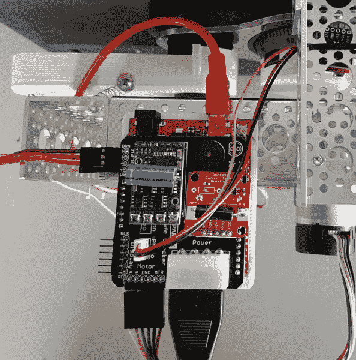](https://cdn.sparkfun.com/assets/learn_tutorials/6/5/1/Safe-Shield.jpg)

我们使用可靠的红板来控制一切。安全破解屏蔽是一个简单的两层印刷电路板。

盾上的钻头:

*   12V/5V 电源为电流传感器和电机控制器供电。
*   电流传感器:我们最初计划使用电流传感器来检测当磁盘 C 中的凹痕边缘被撞击时的电机失速。事实证明，用编码器检测缩进边缘要快得多，也更准确；如果编码器没有在 5 毫秒内改变，那么电机停止，我们已经达到了缩进的边缘。
*   电机控制器:15A 足以处理电机 5A 的失速电流
*   带反馈的伺服连接器
*   光电门连接器
*   [大型 6.5 英寸 7 段显示屏](https://www.sparkfun.com/products/8530)的显示接口(仅在我们的直播活动中需要)
*   当我们破解它时，蜂鸣器会发出通知
*   “GO”按钮连接器，如果我们想使设备无头

[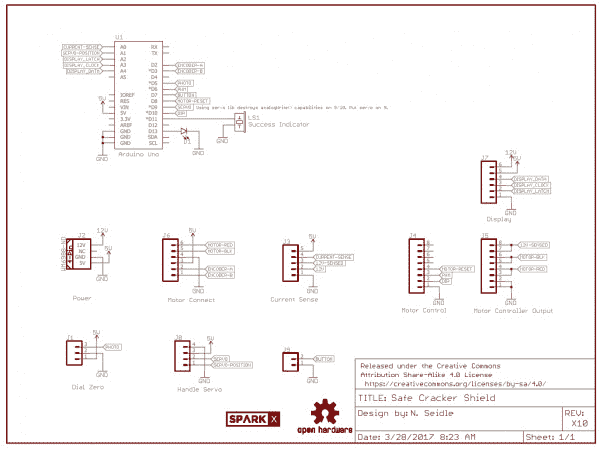](https://cdn.sparkfun.com/assets/learn_tutorials/6/5/1/Safe_Cracker_Shield.pdf)

**代码**

你可以在这里找到固件[。虽然控制 SparkFun 安全破解程序的代码变得有点大，但它相当简单。本质上，我们去一个给定的拨号位置，拉手柄，看看手柄是否移动到足够远，我们打开，重复。此外，我们创建了一些函数来尽可能精确地测量 c 盘上的缩进宽度。](https://github.com/sparkfunX/Safe_Cracker)

## 基本框架

[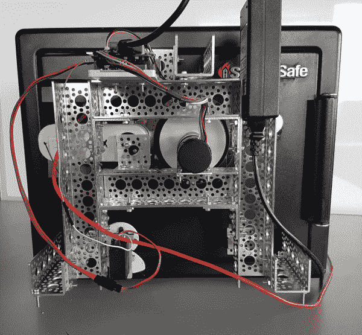](https://cdn.sparkfun.com/assets/learn_tutorials/6/5/1/Safe-Cracking-Robot-2.jpg)

为了建造一个可以方便快捷地安装在保险箱上的装置，我们首先对保险箱进行了 3D 建模。

[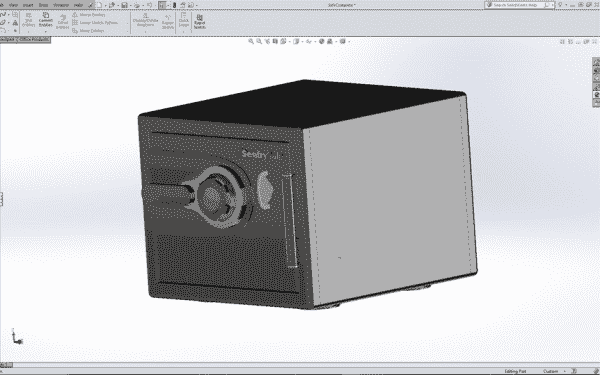](https://cdn.sparkfun.com/assets/learn_tutorials/6/5/1/SafeRightISO.jpg)

框架由 [Actobotics 部件](https://www.sparkfun.com/search/results?term=actobotics)制成，磁铁热粘在三个脚上。磁体提供了极好的粘合强度，同时仍然能够连接和拆卸机器人。

[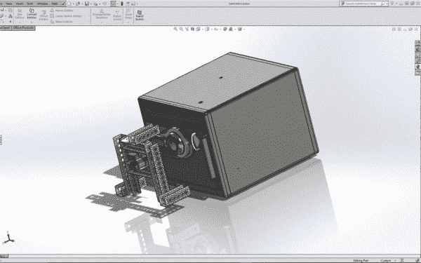](https://cdn.sparkfun.com/assets/learn_tutorials/6/5/1/SafeCrackerRightISO.jpg)

手柄盖、耦合器、固定电子设备的基板和鹦鹉螺齿轮都是在我们值得信赖的 [Taz 6](https://www.sparkfun.com/products/13880) 打印机上打印出来的。

[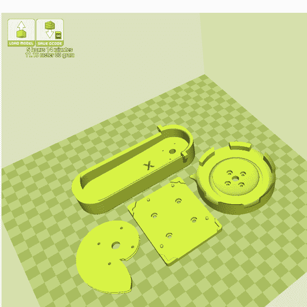](https://cdn.sparkfun.com/assets/learn_tutorials/6/5/1/Safe3Dpieces.jpg)

这个框架是专门为我们的模型保险箱设计的，但各种各样的 [Actobotics 部件](https://www.sparkfun.com/search/results?term=actobotics)和打印定制部件的能力意味着 SparkFun 保险箱破解程序可以进行修改，以适应任何特定的保险箱模型。

## 组合保险箱的工作原理

为了理解我们采取的一些捷径，你需要知道密码锁里面的圆盘是如何操作的。这里有一个快速入门！

[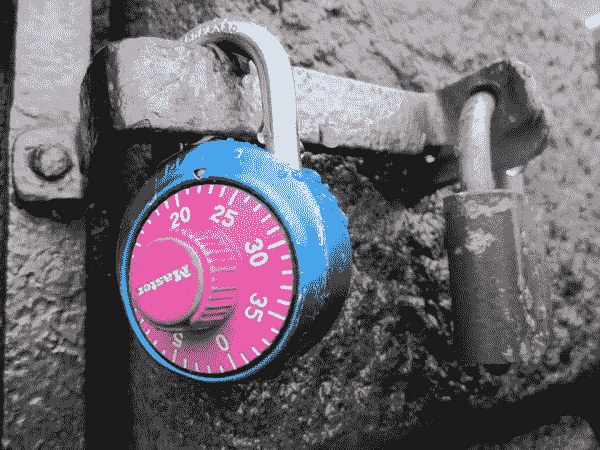](https://cdn.sparkfun.com/assets/learn_tutorials/6/5/1/Safe-CombinationLock.jpg)

如果你曾经使用过密码锁，你应该知道它的基本原理:

*   旋转刻度盘几次来重置一切
*   朝某个方向转动拨号盘，直到找到第一个组合数字。我们称之为戒酒协会吧。
*   向相反的方向转动刻度盘一整圈，然后继续直到你到达第二个数字- BB
*   向相反的方向转动刻度盘，直到你到达第三个数字——CC
*   拉动把手打开锁

最常见的挂锁有一个从 0 到 39 的刻度盘，带有 AA/BB/CC 的组合。组合保险箱的工作原理完全相同，但表盘更大，通常是 0 到 99。一些保险箱有额外的组合号码(例如:AA/BB/CC/DD/EE)，但一般的家庭商店防火保险箱是 3 个数字。

但是，组合保险箱的内部是如何工作的呢？

这里有一段视频向你展示基本知识:

[https://www.youtube.com/embed/5HtdLiOqetc/?autohide=1&border=0&wmode=opaque&enablejsapi=1](https://www.youtube.com/embed/5HtdLiOqetc/?autohide=1&border=0&wmode=opaque&enablejsapi=1)

有三个圆盘，让我们称它们为圆盘 A、B 和 c。每个圆盘上都有一个缺口，称为门。当你拉下手柄时，一根杆(有时称为栅栏)会碰到三个转盘。如果三个浇口正确对齐，杆就会滑入槽口。这允许把手移动足够远，以松开门上的锁，并且保险箱可以被打开。

转动锁外面的转盘直接控制 C 盘(有时称为驱动轮)。顺时针(CW)或逆时针(CCW)转动它，你就直接操纵了 c 盘。但是，如何移动另外两个光盘呢？

[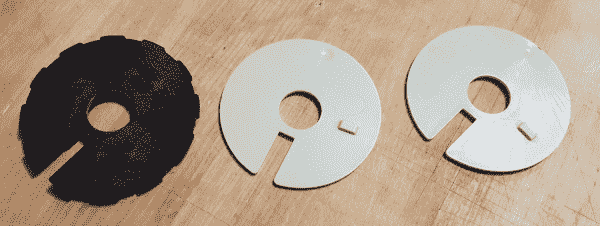](https://cdn.sparkfun.com/assets/learn_tutorials/6/5/1/Safe-Internal_Dials.jpg)*Discs from the inside of a fire safe*

每个光盘都有一个凸起的塑料标签。当光盘彼此相邻时，光盘可以自由移动大约 350 度，直到其凸起的凸片碰到下一个光盘上的凸片并开始移动。

如果你转动圆盘 C 一整圈，凸片碰到圆盘 B 上的凸片并开始转动它。类似地，光盘 B 的反面有一个凸耳，它会碰到光盘 A 的凸耳。把拨盘转到足够远，C 会拿起并开始转 B，然后 B 会拿起并开始转 a。

清澈如泥？检查一下[齿轮](https://woodgears.ca/combolock/index.html)。他们有一个很好的片段分解和一个视频展示了光盘是如何被操纵的。

[https://www.youtube.com/embed/CZ8WRDVgKrk/?autohide=1&border=0&wmode=opaque&enablejsapi=1](https://www.youtube.com/embed/CZ8WRDVgKrk/?autohide=1&border=0&wmode=opaque&enablejsapi=1)

## 问题域

我们保险箱的拨号盘是 100 位数。如果有三张碟片，我们的定义域就是 100 * 100 * 100 或者 100 万种可能的组合。在商店的保险箱上进行测试时，我们发现重置拨号盘并输入三个解决方案号码平均需要 10 秒钟。所以，最坏的情况下，尝试每种组合需要 115.74 天。10 秒钟相当快。随着时间的推移，人类会变得疲劳和不精确。幸运的是，我们可以玩一些小把戏。

在一些高端的保险箱上，如果你把拨号盘调到 81.5，密码是 81，它就打不开。对于这些成本较低的国产品牌保险箱，制造公差要大得多。我们在商店的保险箱上试了试，如果组合中有一个数字是 53，那么 52 和 54 也可以。

[https://www.youtube.com/embed/5HtdLiOqetc/?autohide=1&border=0&wmode=opaque&enablejsapi=1](https://www.youtube.com/embed/5HtdLiOqetc/?autohide=1&border=0&wmode=opaque&enablejsapi=1)

本视频的第一部分将向您展示组合拨号盘的公差为+/-1 位数。

这很快将域缩小到 33 * 33 * 33 = 35，937 个组合。这仍然是超过 4 天的尝试。

挑选保险箱的方法之一是凭感觉。制造商知道这一点，所以，为了防止它，最后一张光盘(我们将它称为光盘 C)有一系列的缩进。如果你按下手柄并旋转刻度盘，试图向下推入刻度盘上的凹口的东西，称为*栅栏*，将落入这些假凹口并锁定刻度盘。真扫兴。但是，您很快发现有 12 个缩进。而且，当您拨入密码时，这些“凹痕”中的一个必须是正确的插槽。

问题域现在是 33 * 33 * 12 = 13068 个组合或 1.51 天。关于油漆干燥的速度。

用手很容易找到这些凹痕的位置。100 / 24 (12 个缩进，12 个凸起位)=每个缩进 4.17 个表盘位置。它不是非常干净，但是，如果缩进范围为 21 到 25.2，那么可以安全地转到 24 来“测试”该缩进，以查看它是否实际上是一个解决方案槽。

在我们的保险箱上，我们找到了如下的凹痕:

```
case 0: return (99); //98 to 1 on the wheel
case 1: return (8); //6-9
case 2: return (16); //14-17
case 3: return (24); //23-26
case 4: return (33); //31-34
case 5: return (41); //39-42
case 6: return (50); //48-51
case 7: return (58); //56-59
case 8: return (66); //64-67
case 9: return (74); //73-76
case 10: return (83); //81-84
case 11: return (91); //90-93 
```

下面是 c 盘的样子:

[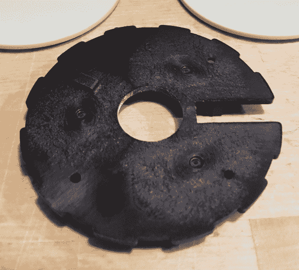](https://cdn.sparkfun.com/assets/learn_tutorials/6/5/1/Safe-DiscC.jpg)*11 false gates, 1 solution gate*

圆盘 C 的尺寸如下:

*   外径:2.815 英寸(55.5 毫米)
*   溶液槽宽度:0.239 英寸
*   11 个缩进的宽度:0.249”+/-0.002”

C = 2πr，所以我们的周长是 17.69”。我们的电机有一个 8400 滴答编码器。因此，每个编码器刻度约为 0.0021 英寸。所以，我们在寻找大约 5 个基点的差异。Eeek！这不算多。

如果我们能从外部测量各种槽的宽度，我们也许能辨别出哪个槽是最薄的，因此也是解决方案槽。这将使我们的组合域减少到 33 * 33 * 1 = 1，089，最坏的情况是破解时间为 3 小时。

功能`measureDiscC()`用于获取一系列读数并将它们相加。该电机是一个齿轮头电机，具有巨大的扭矩，因此，如果您的设备有任何弯曲或屈服，这将在读数中显示为噪声。然而，如果我们同时读取许多读数，任何弯曲都应该被复制到所有的凹痕测量中，从而允许细槽泡到顶部。

固定螺丝不起作用。使用固定螺钉连接电机 D 轴的轮毂无法承受压痕测量的持续折磨。一旦我们改用 6 毫米的夹紧轮毂，我们有少得多的噪音读数。

以下是我们在 Craigslist safe 上进行的五次`measureDiscC()`测试的结果，没有组合:

```
Measuring complete
Smallest to largest width [Width]/[Depth]
Indent 8: [1911] / [1130]
Indent 1: [1925] / [1122]
Indent 3: [1953] / [1091]
Indent 0: [1955] / [1099]
Indent 11: [1966] / [1105]
Indent 2: [1992] / [1100]
Indent 9: [1994] / [1126]
Indent 7: [2011] / [1098]
Indent 10: [2036] / [1096]
Indent 4: [2077] / [1109]
Indent 5: [2083] / [1100]
Indent 6: [2114] / [1096] 
```

在我们对保险箱进行的几乎所有测试中，在顶部缩进 8 个气泡。我们也输出深度测量值(手柄向下移动多远)，但是我对这些读数更加怀疑。

我们不能确定最小的缩进量是解决方案标识，或者我们是否已经正确测量了缩进量，因此安全破解程序固件允许用户控制要测试的缩进量。全部打开，打开 5 个，或者只打开一个，由你决定。我们建议尝试用最小的四个凹痕来打开你的保险箱。如果你无法打开保险箱，那么关闭这 4 个，把其他 8 个缩进设为真，然后再次运行。

我们减少到 33 * 33 * 4 = 4，356 或 12 小时多一点。还是不太好。我们还能做什么花样？

**快速提示:**当我们直播保险箱破解时，我们很保守，选择了四个凹痕来尝试。获胜的订单是 8 号订单，最薄的订单。所以有了两个数据点，我认为这个漏洞是有潜力的。如果你愿意，你可以[再看一遍这个视频](https://www.youtube.com/watch?v=AsVSEHv2N4M)。神奇的时刻发生在 [45:20](https://www.youtube.com/watch?v=AsVSEHv2N4M&t=45m10s) ，但在 [44:30](https://www.youtube.com/watch?v=AsVSEHv2N4M&t=44m30s) 左右开始，以获得完整的范围。

## 设置测试

如果每三次组合尝试需要 10 秒钟，我们可以通过什么来减少每次尝试的时间？我们当然可以拨得更快。但是，我们也可以偷偷摸摸地调整刻度盘。它花了我 10 秒钟，因为我不能备份一个数字而不弄脏磁盘所在的位置。机器人可以精确得多。

为了打开我们的保险箱，我们放置光盘 A 和 B，测试光盘 C 上的凹痕，向后移动以调整光盘 B，然后再次测试凹痕。我们称之为**置位测试**，与复位测试(在两次测试之间进行完全复位)相对。

机器人尝试以这种方式组合:

1.  逆时针旋转重置刻度盘，经过零点，继续直到我们到达零点。
2.  继续逆时针转到 3。这会将光盘 A 设置为 3。
3.  顺时针旋转至 3。继续顺时针转到 0。光盘 B 现在设置为 0。
4.  逆时针旋转到第一个允许的缩进位置；我们的是 8。光盘 C 现在设置为 8。
5.  试试把手。失败？继续…
6.  逆时针旋转到下一个允许的缩进位置；我们的是 24。
7.  试试把手。失败？继续…
8.  逆时针旋转到下一个允许的缩进位置；我们的是 66。
9.  试试把手。失败？继续…
10.  逆时针旋转到下一个允许的缩进位置；我们的是 74。
11.  试试把手。失败？继续…
12.  顺时针旋转至 6。光盘 B 现在设置为 6。
13.  循环到步骤 4。
14.  顺时针旋转至 9°。光盘 B 现在设置为 9。
15.  等等...

[https://www.youtube.com/embed/5HtdLiOqetc/?autohide=1&border=0&wmode=opaque&enablejsapi=1](https://www.youtube.com/embed/5HtdLiOqetc/?autohide=1&border=0&wmode=opaque&enablejsapi=1)

这里有一个手工做的 set 测试的视频，来演示我们正在谈论的内容。跳到 0:41 看 Set 测试的运行。

使用这种方法，我们可以在大约 8 秒对 40 秒的时间内测试 AA/BB/xx 组合(将光盘 B 设置为 8，然后测试 4 个压痕)(每次测试 4 次，每次 10 秒)。快多了！

原来:33 * 33 * 40s = 12.1 小时

使用 Set 测试:33 * 33 * 8.3s = 2.5 小时最坏情况！

而且，如果我们对我们的单次缩进有信心，那么每次测试的测试时间大约为 4 秒钟(由于移动光盘 B 的时间，它不是线性的)。

一次缩进设置测试:33 * 33 * 4s = 1.2 小时。

## 额外资源

我们希望你喜欢阅读我们的安全破解机器人。如果您有任何问题或发现任何其他技巧，请[告诉我们](https://learn.sparkfun.com/tutorials/building-a-safe-cracking-robot/discuss)！

有一些关于如何打开保险箱的很棒的视频，随便看看吧。Eric Schmiedl 在 DEFCON 14 上的演讲[不留痕迹地破解保险箱](https://www.youtube.com/watch?v=4_lkYQ88kv0)尤其精彩。