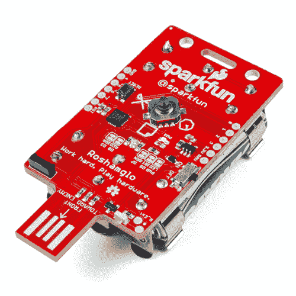
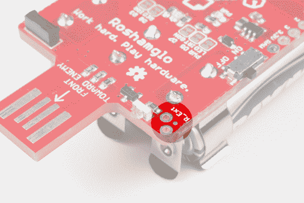
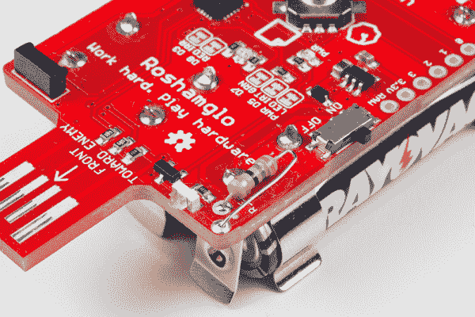
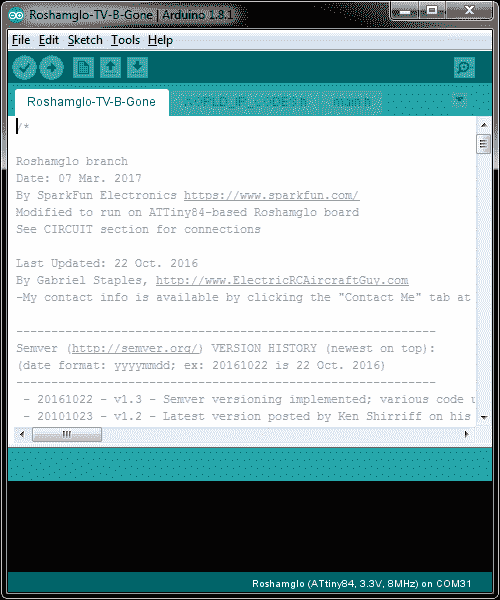
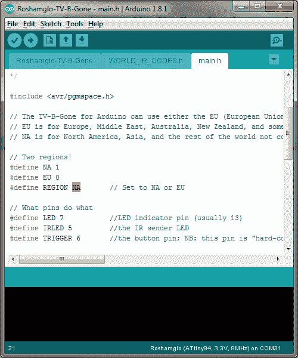
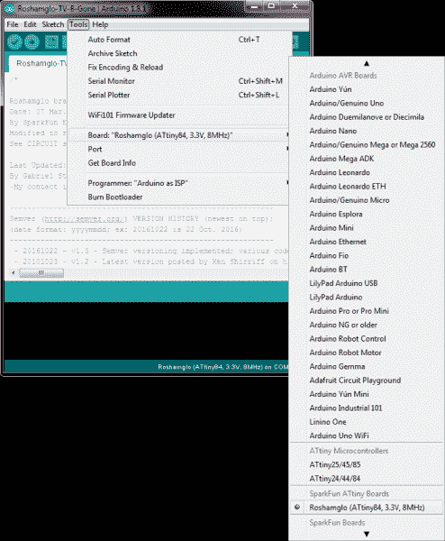
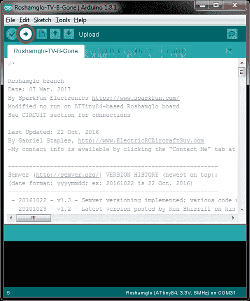
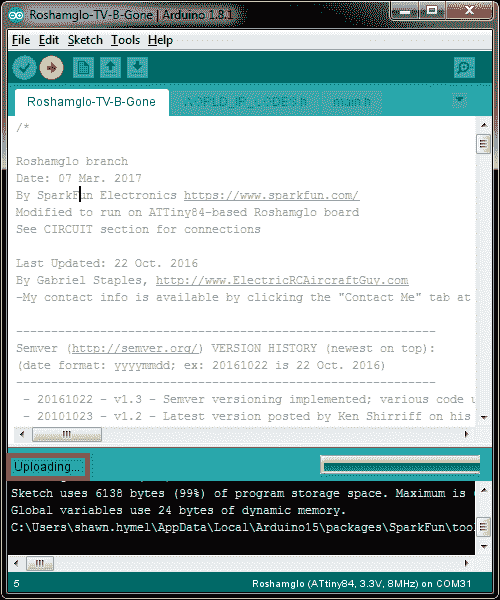
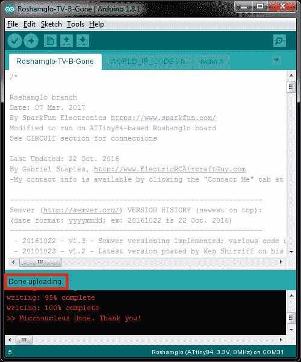
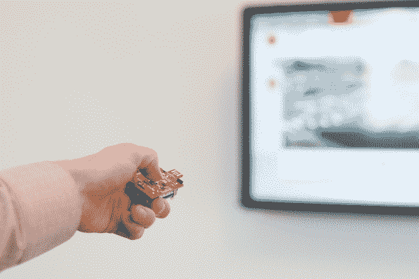

# 罗沙姆格洛项目:电视-B-没了

> 原文：<https://learn.sparkfun.com/tutorials/roshamglo-project-tv-b-gone>

## 介绍

除了玩一些红外(IR)石头剪刀布，你还可以使用你的 [Roshamglo 徽章](https://www.sparkfun.com/products/14130)进行一些有趣的活动，包括向你的电视发送红外命令(嗯，几乎任何电视，真的)。

[](https://www.sparkfun.com/products/retired/14130) 

### [SparkFun Roshamglo 徽章套装](https://www.sparkfun.com/products/retired/14130)

[Retired](https://learn.sparkfun.com/static/bubbles/ "Retired") KIT-14130

SparkFun Roshamglo 是一种新的和有趣的方式来和你的朋友玩石头剪刀布！主板使用 ATtiny84，并且…

**Retired**[Favorited Favorite](# "Add to favorites") 4[Wish List](# "Add to wish list")

几年前，[米奇·奥特曼](https://en.wikipedia.org/wiki/Mitch_Altman)设计了一个基于 ATtiny85 的红外遥控器，被称为 [TV-B-Gone](http://www.tvbgone.com/) ，它可以在大约一分钟的时间内传输流行电视的电源代码。从那以后，有几个人对 TV-B-Gone 的开源代码做出了贡献，包括 [Limor Fried](https://en.wikipedia.org/wiki/Limor_Fried) 和 [Ken Shirriff](https://github.com/shirriff) ，他们创建了程序的一个 [Arduino 端口。](https://github.com/shirriff/Arduino-TV-B-Gone)

**Note:** TV-B-Gone works by transmitting the "Power On/Off" signal in over 100 TV encoding schemes. It works for about 80% of the most popular manufacturers (e.g., Panasonic, Sony, RCA, Toshiba), but there is no support for some newer TV manufacturers (e.g., Insignia, Affinity).

### 所需材料

您将需要一个 [Roshamglo 徽章](https://www.sparkfun.com/products/14130)和一个 47ω到 1kω之间的可选电阻。我们推荐[电阻器套件](https://www.sparkfun.com/products/10969)，因为它有几种不同的电阻器可供选择。

#### 工具

如果你打算给你的 Roshamglo 徽章增加一个电阻来增加红外范围，你将需要一个[烙铁](https://www.sparkfun.com/products/9507)和[焊料](https://www.sparkfun.com/search/results?term=solder)。

### 推荐阅读

如果您不熟悉以下概念，我们建议您在继续之前查看这些教程。

[](https://learn.sparkfun.com/tutorials/how-to-solder-through-hole-soldering) [### 如何焊接:通孔焊接](https://learn.sparkfun.com/tutorials/how-to-solder-through-hole-soldering) This tutorial covers everything you need to know about through-hole soldering.[Favorited Favorite](# "Add to favorites") 70[](https://learn.sparkfun.com/tutorials/ir-communication) [### 红外通信](https://learn.sparkfun.com/tutorials/ir-communication) This tutorial explains how common infrared (IR) communication works, as well as shows you how to set up a simple IR transmitter and receiver with an Arduino.[Favorited Favorite](# "Add to favorites") 42[](https://learn.sparkfun.com/tutorials/hack-your-roshamglo-badge) [### 黑掉你的 Roshamglo 徽章](https://learn.sparkfun.com/tutorials/hack-your-roshamglo-badge) Learn how to customize and program your Roshamglo badge.[Favorited Favorite](# "Add to favorites") 1[](https://learn.sparkfun.com/tutorials/roshamglo-hookup-guide) [### Roshamglo 连接指南](https://learn.sparkfun.com/tutorials/roshamglo-hookup-guide) This tutorial provides everything you need to know to get started with the Roshamglo badge.[Favorited Favorite](# "Add to favorites") 1

## 硬件组件(可选)

在默认状态下，Roshamglo 徽章的红外传输范围约为 5 英尺。这样做是为了防止人们从其他人那里反弹信号，打断石头剪刀布游戏。

然而，从房间的另一边控制电视，5 英尺有点短。你不需要升级硬件，但如果你这样做，你可以很容易地从 40+英尺外拍摄电视光束。

首先，选择一个电阻值，你想用它来升级你的徽章的范围。介于 47ω(40+英尺范围)和 1kω(大约 10 英尺)之间的电阻效果最佳。请注意，该电阻将与电路板上已有的 1.5kΩ电阻并联。为了帮助您决定选择什么，这里有一些常用的电阻值:

| 电阻器 | 流经 LED 的电流 | 预测范围 |
| 47Ω | 37mA | 40 英尺 |
| 100Ω | 18mA | 20 英尺 |
| 220Ω | 9mA | 12 英尺 |
| 330Ω | 6mA | 10 英尺 |
| 470Ω | 5mA | 8 英尺 |
| 1 号机 | 3mA | 6 英尺 |
| 打开 | 1mA | 5 英尺 |

**Note:** If you want the maximum range, just use a **47Ω resistor**. You could get away with a smaller resistor, and therefore more current, but keep in mind the IR LED is rated for a maximum of 70mA. Things could get hot.

在 Roshamglo 板的角落，在 USB 连接器旁边，您会看到两个位于板中心对角线上的孔，标签为`R_Ext`。

[](https://cdn.sparkfun.com/assets/learn_tutorials/6/4/7/Roshamglo_TV_be_gone_Tutorial-01_highlight.jpg)

将你选择的电阻焊接到这些孔中。我们建议弯曲电阻的引线，使电阻很好地折叠到电路板上，并且不接触其它元件。

[](https://cdn.sparkfun.com/assets/learn_tutorials/6/4/7/Roshamglo_TV_be_gone_Tutorial-02.jpg)*Resistor bent between components*

## 编程；编排

在我们将 TV-B-Gone 代码加载到 Roshamglo 徽章之前，我们需要安装 Arduino 和 Roshamglo 板定义。遵循下面教程中的说明，以确保您可以向您的 Roshamglo 板发送新程序。

[](https://learn.sparkfun.com/tutorials/hack-your-roshamglo-badge) [### 黑掉你的 Roshamglo 徽章

#### 2017 年 3 月 12 日](https://learn.sparkfun.com/tutorials/hack-your-roshamglo-badge) Learn how to customize and program your Roshamglo badge.[Favorited Favorite](# "Add to favorites") 1**Note:** We are using a version of the TV-B-Gone software that has been modified to work on Roshamglo. A few of the TV codes have been removed in order to make it fit into the 6k of program memory available on the badge's microcontroller.

以. zip 文件的形式下载 [Roshamglo 项目存储库](https://github.com/sparkfun/Roshamglo):

[Download the Roshamglo Project](https://github.com/sparkfun/Roshamglo/archive/master.zip)

拉开拉链。打开 Arduino IDE，选择**文件>打开**。导航到`<roshamglo project="" directory="">/Firmware/Examples/Roshamglo-TV-B-Gone`。打开 **Roshamglo-TV-B-Gone.ino** 文件。

[](https://cdn.sparkfun.com/assets/learn_tutorials/6/4/7/Roshamglo-TV-B-Gone_01.png)

默认情况下，Roshamglo-TV-B-Gone 代码支持北美 IR 代码。要更改它们以支持欧盟代码，点击 **main.h** 选项卡并更改

```
language:c
#define REGION NA 
```

到

```
language:c
#define REGION EU 
```

[](https://cdn.sparkfun.com/assets/learn_tutorials/6/4/7/Roshamglo-TV-B-Gone_06.png)

选择**工具>板> Roshamglo** 。

[](https://cdn.sparkfun.com/assets/learn_tutorials/6/4/7/Roshamglo-TV-B-Gone_02.png)

点击**上传**按钮。

[](https://cdn.sparkfun.com/assets/learn_tutorials/6/4/7/Roshamglo-TV-B-Gone_03.png)

等待**上传**出现在 Arduino 窗口的底部。

[](https://cdn.sparkfun.com/assets/learn_tutorials/6/4/7/Roshamglo-TV-B-Gone_04.png)

此时，确保您的 Roshamglo 徽章为 **OFF** ，按住 Roshamglo 徽章上的 **Down** 按钮(按住五向开关朝向 *SparkFun* 标志)。按住**按钮的同时，将徽章插入电脑上的可用 USB 插槽。**

[](https://cdn.sparkfun.com/assets/learn_tutorials/6/4/7/Hacking_the_Roshamglo_Tutorial-01.jpg)

该程序应该从 Arduino 上传。您应该会看到一条*完成上传*的消息出现。

[](https://cdn.sparkfun.com/assets/learn_tutorials/6/4/7/Roshamglo-TV-B-Gone_05.png)**Note:** If you get an error message while uploading, it could be caused by a variety of reasons. The way we're uploading programs to Roshamglo is actually hacked together, as we're [emulating USB](https://www.obdev.at/products/vusb/index.html) on the badge, which many computers do not like. Here are some things to try if you do get an error:

*   尝试不同的 USB 端口
*   拔下其他 USB 设备
*   关闭可能正在运行的其他程序
*   重新安装 [Roshamglo USB 驱动程序](https://learn.sparkfun.com/tutorials/hack-your-roshamglo-badge#install-usb-driver)
*   尝试不同的计算机

## 尝试一下

打开你的 Roshamglo 徽章。如果选择了北美 IR 代码(默认)，绿色 LED 将闪烁三次。如果选择了欧盟代码，绿色 LED 将闪烁六次。

找到附近的电视，将 USB 连接器对准它，然后按下五向开关的中央按钮。绿色 LED 应开始间歇闪烁，这表示正在发送红外代码。此时可以放开按钮；代码将继续发送。请注意，传输所有代码可能需要 72 秒；继续把徽章对准你的目标。

[](https://cdn.sparkfun.com/assets/learn_tutorials/6/4/7/Roshamglo_TV_be_gone_Tutorial-04.jpg)

幸运的话，电视应该会关闭(或者可能会打开，因为许多电视的开和关的红外代码是相同的)。

**Note:** The beam width on Roshamglo's IR LED is fairly narrow. You may have to point it directly at the TV's IR receiver.

如果您想取消 72 秒的代码传输，您可以按下*重置*按钮或使用侧面开关关闭徽章。

## 资源和更进一步

这只是你可以用 Roshamglo 做的有趣事情的一个例子。有关更多信息，请查看以下资源:

*   [罗沙姆格洛示意图 PDF](https://github.com/sparkfun/Roshamglo/raw/master/Hardware/SparkFun_Roshamglo.pdf)
*   [Eagle 设计文件](https://github.com/sparkfun/Roshamglo/archive/master.zip)
*   [Roshamglo 源代码](https://github.com/sparkfun/Roshamglo/blob/master/Firmware/Examples/Roshamglo/Roshamglo.ino)
*   [Roshamglo GitHub 知识库](https://github.com/sparkfun/Roshamglo)

你的下一个项目需要一些灵感吗？查看一些相关教程:

[](https://learn.sparkfun.com/tutorials/ir-control-kit-hookup-guide) [### 红外控制套件连接指南](https://learn.sparkfun.com/tutorials/ir-control-kit-hookup-guide) How to get the most out of the infrared receivers and transmitters included in the IR Control Kit.[Favorited Favorite](# "Add to favorites") 15[](https://learn.sparkfun.com/tutorials/boss-alarm) [### Boss 警报](https://learn.sparkfun.com/tutorials/boss-alarm) Build a Boss Alarm that alerts you of anyone walking into your office and automatically changes your computer screen.[Favorited Favorite](# "Add to favorites") 19[](https://learn.sparkfun.com/tutorials/hack-your-roshamglo-badge) [### 黑掉你的 Roshamglo 徽章](https://learn.sparkfun.com/tutorials/hack-your-roshamglo-badge) Learn how to customize and program your Roshamglo badge.[Favorited Favorite](# "Add to favorites") 1