# 黑掉你的 Roshamglo 徽章

> 原文：<https://learn.sparkfun.com/tutorials/hack-your-roshamglo-badge>

## 介绍

所以你已经[把你的 Roshamglo 徽章](https://learn.sparkfun.com/tutorials/roshamglo-hookup-guide)拼在一起了，现在你还想要更多？我们可以帮你。除了玩红外(IR)石头剪刀布，Roshamglo 棋盘还可以用用户创建的代码重新编程。

[](https://www.sparkfun.com/products/retired/14130) 

### [SparkFun Roshamglo 徽章套装](https://www.sparkfun.com/products/retired/14130)

[Retired](https://learn.sparkfun.com/static/bubbles/ "Retired") KIT-14130

SparkFun Roshamglo 是一种新的和有趣的方式来和你的朋友玩石头剪刀布！主板使用 ATtiny84，并且…

**Retired**[Favorited Favorite](# "Add to favorites") 4[Wish List](# "Add to wish list")

这将允许您为徽章创建自己的应用程序。用一些闪烁的灯、一个五向开关和红外通信，你能做什么？嗯，先来个电视遥控器或者激光游戏怎么样。

### 所需材料

唯一的事情，你需要重新编程你的罗沙姆格洛徽章是一个完全构建的徽章和一台电脑。

### 推荐阅读

如果您不熟悉以下概念，我们建议您在继续之前查看这些教程。

[](https://learn.sparkfun.com/tutorials/ir-communication) [### 红外通信](https://learn.sparkfun.com/tutorials/ir-communication) This tutorial explains how common infrared (IR) communication works, as well as shows you how to set up a simple IR transmitter and receiver with an Arduino.[Favorited Favorite](# "Add to favorites") 42[](https://learn.sparkfun.com/tutorials/what-is-an-arduino) [### 什么是 Arduino？](https://learn.sparkfun.com/tutorials/what-is-an-arduino) What is this 'Arduino' thing anyway? This tutorials dives into what an Arduino is and along with Arduino projects and widgets.[Favorited Favorite](# "Add to favorites") 50[](https://learn.sparkfun.com/tutorials/how-to-install-an-attiny-bootloader-with-virtual-usb) [### 如何用虚拟 USB 安装 ATtiny 引导程序](https://learn.sparkfun.com/tutorials/how-to-install-an-attiny-bootloader-with-virtual-usb) With this, you will be able to upload Arduino sketches directly to the ATtiny84 over USB without needing to use a programming device (such as another Arduino or FTDI chip).[Favorited Favorite](# "Add to favorites") 13[](https://learn.sparkfun.com/tutorials/roshamglo-hookup-guide) [### Roshamglo 连接指南](https://learn.sparkfun.com/tutorials/roshamglo-hookup-guide) This tutorial provides everything you need to know to get started with the Roshamglo badge.[Favorited Favorite](# "Add to favorites") 1

## 硬件概述

**Note:** This is a repeat section from the [Roshamglo Hookup Guide](https://learn.sparkfun.com/tutorials/roshamglo-hookup-guide), but it could be useful if this is the first place you've visited.[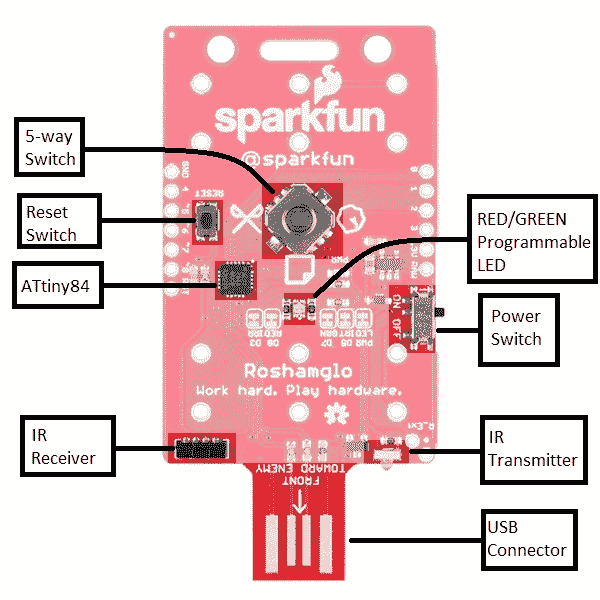](https://cdn.sparkfun.com/assets/learn_tutorials/6/2/0/Roshamglo_top_highlighted_labled.jpg)

Roshamglo 使用以下内容:

*   阿迪那 84 号
*   红外发光二极管
*   内置 38kHz 解调器的红外接收器
*   USB 编程
*   可编程红色和绿色 LED
*   电源开关
*   用于输入的 5 路开关
*   复位开关
*   6 个 AAA PTH 电池夹
*   3 节 AAA 电池供电

Roshamglo 背后的大脑是一个 [ATtiny84](https://www.sparkfun.com/products/11232) ，一个轻量级的 Arduino 兼容微控制器。ATtiny84 配有以下部件:

*   我们的程序需要 8kB 的闪存(安装引导程序后大约需要 6kB)
*   512B 的 SRAM，它存储我们的程序中使用的变量
*   EEPROM 的 512B
*   最多 12 个 I/O 引脚(Roshamglo 从这些引脚中分出 9 个)
*   10 位模数转换器，可用于 8 个引脚

有关每个引脚功能的详细信息，请参考下表。

| 别针 | 模拟或数字 | 其他用途 | Roshamglo 使用 |
| Zero | 两者 | 模拟参考 | 5 向向下开关 |
| one | 两者 | - | 向右 5 向开关 |
| Two | 两者 | - | 5 向开关向上 |
| three | 两者 | - | 红外接收器 |
| four | 两者 | SCL SCK | 左侧 5 向开关 |
| five | 两者 | 脉宽调制 MISO | 红外发光二极管 |
| six | 两者 | MOSI、SDA、PWM | 5 路开关中心 |
| seven | 两者 | 脉宽调制（pulse-width modulating 的缩写） | 绿色 LED |
| eight | 数字的 | 脉宽调制（pulse-width modulating 的缩写） | 红色 LED |

**Missing from the list are digital pins 9 and 10\. The bootloader uses these two pins for USB programming.**[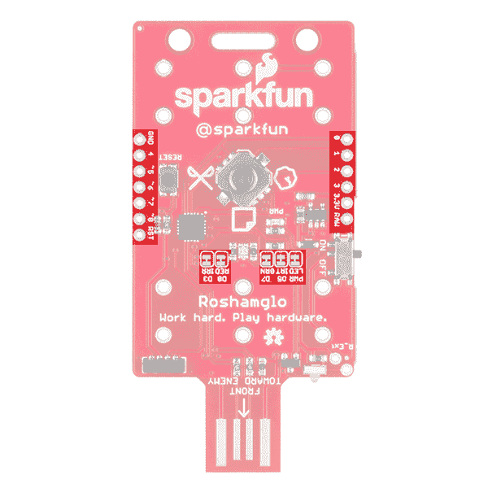](https://cdn.sparkfun.com/assets/learn_tutorials/6/2/0/Roshamglo_top_jumpers_pins_highlighted.jpg)

这些引脚中的每一个都被断开到电路板的边缘，以便于定制！如果您想将这些引脚用于其他用途，而不是当前连接的用途，我们提供了可以用[业余爱好刀](https://www.sparkfun.com/products/9200)轻松切割的跳线。唯一没有跳线的引脚是用于五路开关的引脚。开关的引脚使用 ATtiny 的内部上拉电阻，因此只要开关未闭合，引脚就可以按您喜欢的任何方式配置，而不必切断走线。

### 缺少一个重要特征

如果您没有注意到引脚描述中没有提到 RX 或 TX 引脚。这是因为，不幸的是，ATtiny84 没有硬件 UART。UART 用于串行通信，无论是编程还是将消息打印到串行窗口。你可能会想，“但是 USB 连接器不提供 ATtiny 和计算机之间的通信吗？”你说得对；确实如此。为了使引导程序尽可能小，引导程序只允许 USB 编程。对于串行调试，你需要一根 USB 线和一个 [USB 转串行适配器](https://www.sparkfun.com/products/14050)，以及[软件串行库](https://www.arduino.cc/en/Reference/softwareSerial)来发送信息到计算机。你可以在这里了解更多关于串行通信[。](https://learn.sparkfun.com/tutorials/serial-communication)

## 安装 USB 驱动程序

Roshamglo 正在使用它的两个引脚模拟 USB 1.1。但是，没有通用的操作系统驱动程序可以使用这个自定义的 USB 类。因此，我们将需要安装自定义驱动程序，以便与 Roshamglo 板通信(并将我们的 Arduino 程序发送到该板)。在下面选择您的操作系统，并按照说明安装驱动程序。

**Note:** We did not write the USB firmware nor the driver. We simply modified them to work with Roshamglo. The true geniuses are the fine folks who wrote [micronucleus](https://github.com/micronucleus/micronucleus) and [libusb](http://libusb.info/).

### Windows 操作系统

确保 Roshamglo 板**关闭**，按住**按下**按钮(将五向开关拉向 *SparkFun* 标志)并将其插入可用的 USB 插槽。

[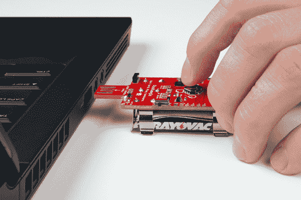](https://cdn.sparkfun.com/assets/learn_tutorials/6/0/5/Hacking_the_Roshamglo_Tutorial-01.jpg)

插上电源后，状态 LED 应开始短时间快速闪烁红光。这意味着徽章处于“引导模式”

[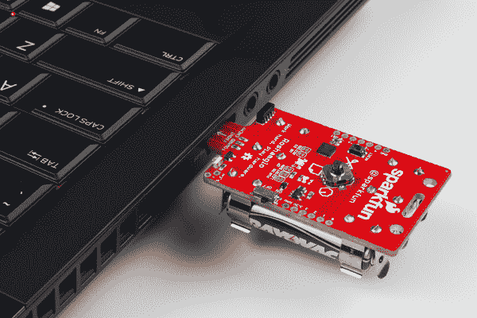](https://cdn.sparkfun.com/assets/learn_tutorials/6/0/5/Hacking_the_Roshamglo_Tutorial-02.jpg)

点击下面的链接下载 SparkFun ATtiny USB 驱动程序。

[Windows USB drivers](https://cdn.sparkfun.com/assets/learn_tutorials/6/0/5/sparkfun_attiny_usb_driver.zip)

解压文件。打开 Windows [设备管理器](http://www.mcci.com/mcci-v5/support/howtos1.html)，应该会看到一个*未知设备*。右键点击*未知设备*，选择**更新驱动软件**。

[](https://cdn.sparkfun.com/assets/learn_tutorials/6/0/5/roshamglo_04.png)

在弹出窗口中，点击**浏览我的电脑中的驱动软件**。

[](https://cdn.sparkfun.com/assets/learn_tutorials/6/0/5/roshamglo_05.png)

点击**浏览...**打开包含您刚刚解压缩的驱动程序的文件夹。它可能是*spark fun _ attiny _ USB _ driver*文件夹。

[](https://cdn.sparkfun.com/assets/learn_tutorials/6/0/5/roshamglo_06.png)

点击**下一个**。您可能会看到一个警告弹出窗口，提示“Windows 无法验证该驱动程序软件的发行者”没关系。点击**安装驱动软件**。

[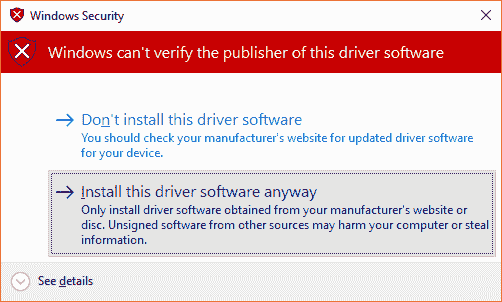](https://cdn.sparkfun.com/assets/learn_tutorials/6/0/5/roshamglo_07.png)

您应该会看到一个通知，说明 *SparkFun ATtiny* 驱动程序安装成功。关闭窗口，确认你的*未知设备*现在在设备管理器中显示为*spark fun attini*。

[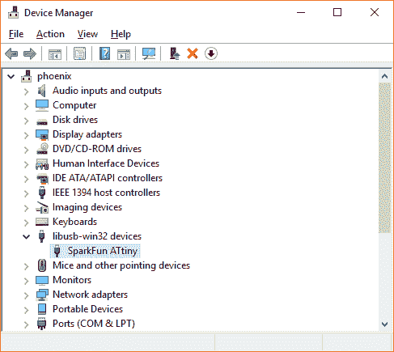](https://cdn.sparkfun.com/assets/learn_tutorials/6/0/5/roshamglo_08.png)

### 马科斯

你需要安装 [Homebrew](https://brew.sh/) 并用它来安装 [libusb](http://www.libusb.org/) 。在*终端*输入以下命令:

```
/usr/bin/ruby -e "$(curl -fsSL https://raw.githubusercontent.com/Homebrew/install/master/install)"
brew doctor
brew install libusb-compat 
```

### Linux 操作系统

好消息！Linux 不需要特殊的驱动程序。但是，您需要执行以下操作之一，才能从 Arduino 对 Roshamglo 进行编程:

1)当你下载 Arduino IDE(下一节)时，确保你作为*根* : `sudo ./arduino`运行它

[](https://cdn.sparkfun.com/assets/learn_tutorials/6/0/5/arduino_as_root.png)

2)或者，您可以添加一些 udev 规则，以便 Linux 枚举您的具有写权限的设备。在 rules.d 中创建一个文件:

```
sudo edit /etc/udev/rules.d/49-micronucleus.rules 
```

将以下内容复制到该文件中:

```
# UDEV Rules for Micronucleus boards including the Digispark.
# This file must be placed at:
#
# /etc/udev/rules.d/49-micronucleus.rules    (preferred location)
#   or
# /lib/udev/rules.d/49-micronucleus.rules    (req'd on some broken systems)
#
# After this file is copied, physically unplug and reconnect the board.
#
SUBSYSTEMS=="usb", ATTRS{idVendor}=="16d0", ATTRS{idProduct}=="0753", MODE:="0666"
KERNEL=="ttyACM*", ATTRS{idVendor}=="16d0", ATTRS{idProduct}=="0753", MODE:="0666", ENV{ID_MM_DEVICE_IGNORE}="1"
#
# If you share your linux system with other users, or just don't like the
# idea of write permission for everybody, you can replace MODE:="0666" with
# OWNER:="yourusername" to create the device owned by you, or with
# GROUP:="somegroupname" and mange access using standard unix groups. 
```

保存并退出。

## 添加 Arduino 兼容性

Arduino 不是一个全功能的开发环境，但它确实允许我们快速、轻松地构建嵌入式程序的原型。首先，导航到 [Arduino 的软件页面](https://www.arduino.cc/en/Main/Software)并下载适用于您的操作系统的 Arduino IDE。

[Download Arduino IDE](https://www.arduino.cc/en/Main/Software)

如果你需要为你的操作系统安装 Arduino 的帮助，你可以遵循[这个指南](https://learn.sparkfun.com/tutorials/installing-arduino-ide)。

**Important!** Your Roshamglo board will only work with Arduino versions 1.6.10 and above.

### 下载并安装板包

因为默认情况下，Arduino IDE 不支持 Roshamglo 板，所以我们需要手动添加它。打开 Arduino 程序，进入**文件>首选项**。然后将下面的 URL 复制并粘贴到*附加董事会经理 URL*文本框中。

```
https://raw.githubusercontent.com/sparkfun/Arduino_Boards/tiny/IDE_Board_Manager/package_sparkfun_index.json 
```

[](https://cdn.sparkfun.com/assets/learn_tutorials/6/0/5/roshamglo_01.png)

然后点击 OK，导航到**工具>电路板>电路板管理器…** 工具。搜索“tiny”应该会出现一个 *SparkFun ATtiny Boards* 的结果。选择后点击**安装**。

[](https://cdn.sparkfun.com/assets/learn_tutorials/6/0/5/roshamglo_02.png)

一旦安装完成，进入**工具>板**，在 *SparkFun ATtiny 板*部分选择 **Roshamglo (ATtiny84，3.3V，8MHz)** 。

[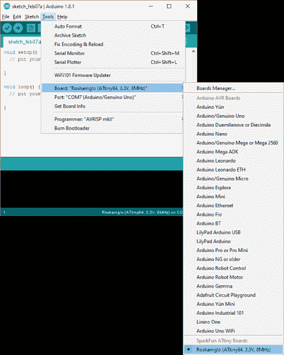](https://cdn.sparkfun.com/assets/learn_tutorials/6/0/5/roshamglo_03.png)

## 使某物闪烁

Roshamglo 板带有两个 LED(一个红色 LED 和一个绿色 LED 内置在一个封装中)，以及一个五向开关(左、右、上、下和中间)。我们可以通过编写和上传一个简单的程序来测试我们的 Roshamglo 板是否可以重新编程。

打开 Arduino IDE 并输入以下代码:

```
language:c
void setup() {
  pinMode(7, OUTPUT);
}

void loop() {
  digitalWrite(7, HIGH);
  delay(500);
  digitalWrite(7, LOW);
  delay(500);
} 
```

点击**上传**按钮。

[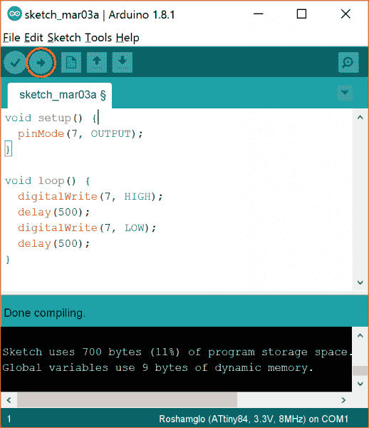](https://cdn.sparkfun.com/assets/learn_tutorials/6/0/5/Roshamglo_Hack_01a.png)

如果你被要求保存你的工作，点击**取消**(如果你想保存，但是你不需要保存来编译和上传你的代码)。

等到看到*上传*出现在 Arduino IDE 中。

[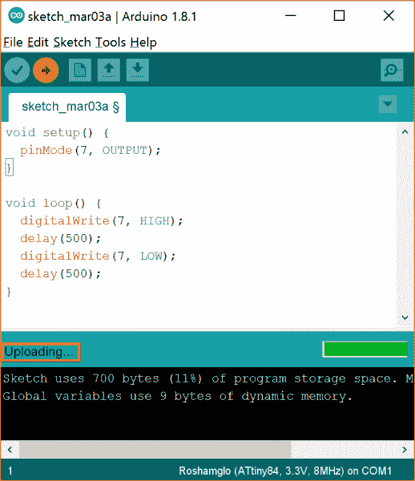](https://cdn.sparkfun.com/assets/learn_tutorials/6/0/5/Roshamglo_Hack_02.png)

确保 Roshamglo 板**关闭**，按住*按下*按钮(将五向开关拉向 *SparkFun* 标志)并将其插入可用的 USB 端口，同时继续按住*按下*按钮。

[](https://cdn.sparkfun.com/assets/learn_tutorials/6/0/5/Hacking_the_Roshamglo_Tutorial-01.jpg)

放开*向下*按钮，状态 LED 应开始短时快速闪烁红光。这意味着徽章处于“引导模式”每次你上传一个新的程序到它的时候，你都需要这样做。

[](https://cdn.sparkfun.com/assets/learn_tutorials/6/0/5/Hacking_the_Roshamglo_Tutorial-02.jpg)

过一会儿，你应该会看到*上传完毕*出现在 Arduino 中。

[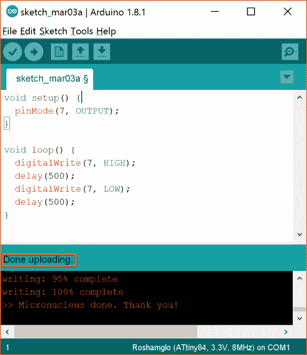](https://cdn.sparkfun.com/assets/learn_tutorials/6/0/5/Roshamglo_Hack_03.png)

从您的电脑中移除 Roshamglo 板。将电源开关滑动到上的**。**

[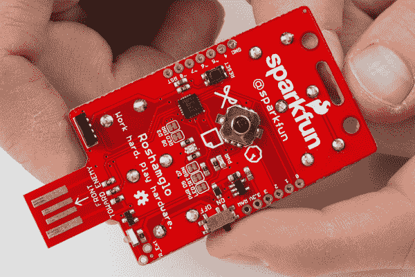](https://cdn.sparkfun.com/assets/learn_tutorials/6/0/5/Hacking_the_Roshamglo_Tutorial-04.jpg)

就是这样！你的 Arduino 应该开始每秒闪烁绿色 LED。

[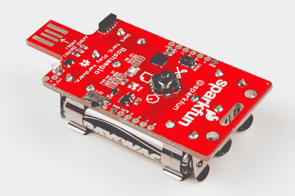](https://cdn.sparkfun.com/assets/learn_tutorials/6/0/5/Hacking_the_Roshamglo_Tutorial-03.jpg)**Note:** If you get an error message while uploading, it could be caused by a variety of reasons. The way we're uploading programs to Roshamglo is actually hacked together, as we're [emulating USB](https://www.obdev.at/products/vusb/index.html) on the badge, which many computers do not like. Here are some things to try if you do get an error:

*   尝试不同的 USB 端口
*   拔下其他 USB 设备
*   关闭可能正在运行的其他程序
*   重新安装 [Roshamglo USB 驱动程序](https://learn.sparkfun.com/tutorials/hack-your-roshamglo-badge#install-usb-driver)
*   尝试不同的计算机

## 资源和更进一步

能够让东西闪烁是重要的第一步。你现在可以重新编程你的 Roshamglo 来执行各种各样的任务，比如以不同的模式眨眼，用控制杆控制眨眼，等等。

但是等等，还有呢！该板配有红外(IR)发射器和红外接收器。这意味着你可以控制电视(通过正确的红外代码)或设置一个简单的“激光标签”游戏与你的朋友一起玩。

要了解更多信息，如 Roshamglo 源代码，请查看以下资源:

*   [罗沙姆格洛示意图 PDF](https://github.com/sparkfun/Roshamglo/raw/master/Hardware/SparkFun_Roshamglo.pdf)
*   [Eagle 设计文件](https://github.com/sparkfun/Roshamglo/archive/master.zip)
*   [Roshamglo 源代码](https://github.com/sparkfun/Roshamglo/blob/master/Firmware/Examples/Roshamglo/Roshamglo.ino)
*   [Roshamglo GitHub 知识库](https://github.com/sparkfun/Roshamglo)

这些教程可能有助于启发你的下一个项目:

[](https://learn.sparkfun.com/tutorials/ir-control-kit-hookup-guide) [### 红外控制套件连接指南](https://learn.sparkfun.com/tutorials/ir-control-kit-hookup-guide) How to get the most out of the infrared receivers and transmitters included in the IR Control Kit.[Favorited Favorite](# "Add to favorites") 15[](https://learn.sparkfun.com/tutorials/boss-alarm) [### Boss 警报](https://learn.sparkfun.com/tutorials/boss-alarm) Build a Boss Alarm that alerts you of anyone walking into your office and automatically changes your computer screen.[Favorited Favorite](# "Add to favorites") 19[](https://learn.sparkfun.com/tutorials/roshamglo-project-tv-b-gone) [### 罗沙姆格洛项目:电视-B-没了](https://learn.sparkfun.com/tutorials/roshamglo-project-tv-b-gone) Turn your Roshamglo board into a (nearly) universal TV power button.[Favorited Favorite](# "Add to favorites") 4