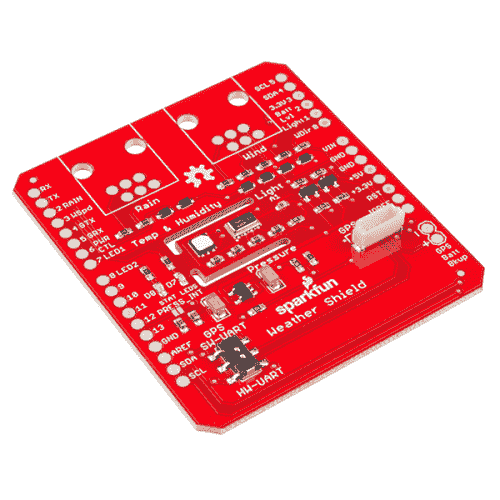
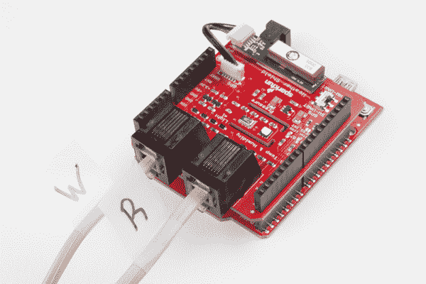
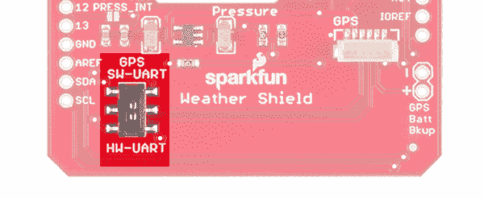
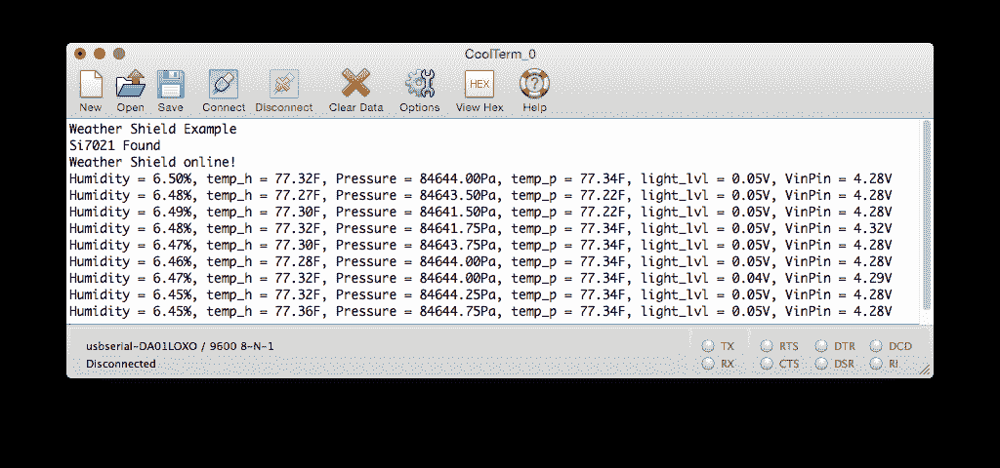
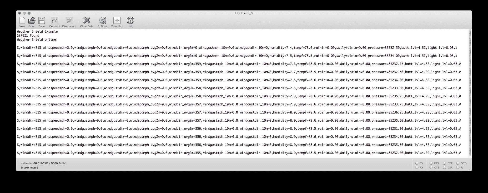
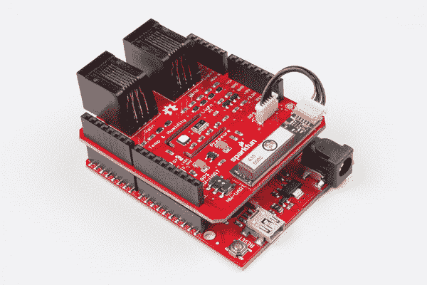
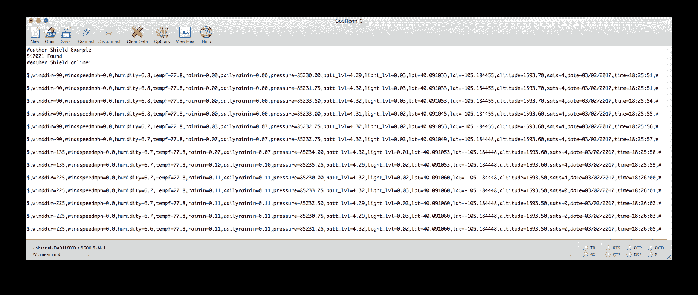
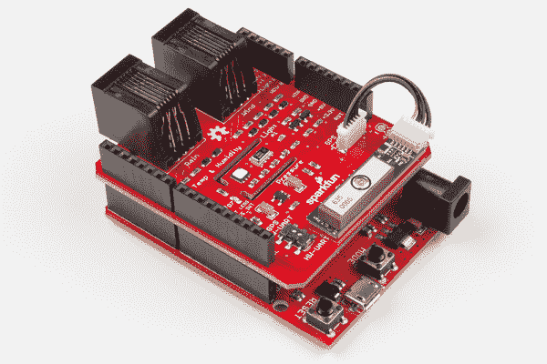

# Arduino 天气防护罩连接指南 V12

> 原文：<https://learn.sparkfun.com/tutorials/arduino-weather-shield-hookup-guide-v12>

## 天气防护罩概述

**Heads up!** This is for the Arduino Weather Shield v12 [DEV-13956] that uses the Si7021\. If you are looking at the older version of the weather shield, you should check out the [older tutorial for DEV-12081](https://learn.sparkfun.com/tutorials/weather-shield-hookup-guide) that uses the HTU21D.

SparkFun 的 [Arduino Weather Shield](https://www.sparkfun.com/products/13956) 是一款易于使用的 Arduino shield，允许您访问气压、相对湿度、亮度和温度。还可以连接到可选的传感器，如风速/风向、雨量计和 GPS，用于定位和超精确计时。

[](https://www.sparkfun.com/products/13956) 

将**添加到您的[购物车](https://www.sparkfun.com/cart)中！**

 **### [SparkFun 天气防护罩](https://www.sparkfun.com/products/13956)

[Out of stock](https://learn.sparkfun.com/static/bubbles/ "out of stock") DEV-13956

SparkFun Weather Shield 是一个易于使用的 Arduino shield，它允许您访问气压、相对湿度…

$42.956[Favorited Favorite](# "Add to favorites") 39[Wish List](# "Add to wish list")** **[https://www.youtube.com/embed/G_dIHJWV-Yc/?autohide=1&border=0&wmode=opaque&enablejsapi=1](https://www.youtube.com/embed/G_dIHJWV-Yc/?autohide=1&border=0&wmode=opaque&enablejsapi=1)

关于这个盾牌你应该知道的事情:

*   使用 [Si7021](https://www.sparkfun.com/products/12064) 传感器、 [MPL3115A2 气压传感器](https://www.sparkfun.com/products/11084)和 [ALS-PT19 光传感器](https://www.sparkfun.com/products/12566)。
*   具有用于 [GP-735 紧凑型 GPS 模块](https://www.sparkfun.com/products/13670)的连接器
*   有可选的 [RJ11 连接器](https://www.sparkfun.com/products/132)足迹连接 [SparkFun 气压计](https://www.sparkfun.com/products/8942)
*   Weather shield 可以在 3V 到 10V 之间工作，并且内置了电压调节器和信号转换器
*   典型湿度精度为 2%
*   典型压力精度为 50Pa
*   典型温度精度为 0.3C

### 推荐阅读

查看位于护罩上的每个传感器的连接指南，了解该传感器的详细信息。

[](https://learn.sparkfun.com/tutorials/si7021-humidity-and-temperature-sensor-hookup-guide) [### Si7021 湿度和温度传感器连接指南

#### 2016 年 5 月 5 日](https://learn.sparkfun.com/tutorials/si7021-humidity-and-temperature-sensor-hookup-guide) The Si7021 humidity and temperature sensor is an easy to use, digital, low-cost sensor to aid you in all your environment sensing needs.[Favorited Favorite](# "Add to favorites") 4[](https://learn.sparkfun.com/tutorials/mpl3115a2-pressure-sensor-hookup-guide) [### MPL3115A2 压力传感器连接指南

#### 2013 年 12 月 5 日](https://learn.sparkfun.com/tutorials/mpl3115a2-pressure-sensor-hookup-guide) Getting started with the MPL3115A2 Pressure Sensor.[Favorited Favorite](# "Add to favorites") 5

如果您打算将风雨[气象计](https://www.sparkfun.com/products/8942)与您的 ESP32 环境传感器屏蔽一起使用，请查看我们的气象计组装指南。

[](https://learn.sparkfun.com/tutorials/weather-meter-hookup-guide) [### 气象计连接指南

#### 2017 年 7 月 20 日](https://learn.sparkfun.com/tutorials/weather-meter-hookup-guide) How to assemble your very own weather meter 10

如果你对下面的概念不熟悉，我们建议你也去看看那些教程。

*   [I ² C 协议](https://learn.sparkfun.com/tutorials/i2c)
*   [安装 Arduino 库](https://learn.sparkfun.com/tutorials/installing-an-arduino-library)
*   [什么是 Arduino 盾](https://learn.sparkfun.com/tutorials/arduino-shields-v2)
*   [什么是上拉电阻？](https://learn.sparkfun.com/tutorials/pull-up-resistors)

## 连接起来

要启动并运行 Weather Shield，您需要以下部件:

*   [Arduino](https://www.sparkfun.com/products/11021) 、 [RedBoard](https://www.sparkfun.com/products/11575) 或其他兼容板
*   [Arduino 可堆叠接头](https://www.sparkfun.com/products/11417)
*   可选: [GP-735 GPS 模块](https://www.sparkfun.com/products/13670)和 [1.75”配套电缆](https://www.sparkfun.com/products/574)
*   可选:两个 [RJ11 6 针连接器](https://www.sparkfun.com/products/132)
*   可选:[气象计](https://www.sparkfun.com/products/8942)

[](https://cdn.sparkfun.com/assets/learn_tutorials/6/2/6/Arduino_Weather_Shield3.jpg)*Shield on a [RedBoard](https://www.sparkfun.com/products/11575) with optional weather meter ('W'ind and 'R'ain cables) and GPS attached*

### 装配

[将可堆叠接头](https://learn.sparkfun.com/tutorials/arduino-shields-v2/installing-headers-assembly)焊接到防护罩上，并将防护罩插入 Arduino。您也可以将 RJ11 连接器焊接到电路板的顶部。如果你有 GP-735 全球定位系统模块，不要担心在这个时候连接它，我们稍后将得到全球定位系统。

## 固件示例-基本

在将代码上传到带有天气防护罩的 Arduino 之前，请确保 GPS UART 开关处于 SW-UART 位置。将开关置于相反位置会将 GPS 线路连接到 USB 线路，可能会导致上传时出错。

[](https://cdn.sparkfun.com/assets/learn_tutorials/6/2/6/gpsSwitch.jpg)

在 Arduino IDE 中使用 Weather Shield 示例依赖于 [Si7021](https://github.com/sparkfun/Si7021_Breakout) 和 [MPL3115A2](https://github.com/sparkfun/MPL3115A2_Breakout) 库。从 Arduino v1.6.x 开始，您可以通过 Arduino 库管理器下载库。搜索并安装“SparkFun MPL3115”和“SparkFun Si7021”。

更多信息，请参见我们关于使用 Arduino 库管理器的教程[。关于所有最新的 Arduino Weather Shield 代码，请查看 Github 资源库:](https://learn.sparkfun.com/tutorials/installing-an-arduino-library#using-the-library-manager)

[Weather Shield GitHub Repo](https://github.com/sparkfun/Weather_Shield)

打开 **Weather_Shield_Basic.ino** 草图。

或者将以下代码复制并粘贴到 Arduino IDE 中:

```
language:c
/*
 Weather Shield Example
 By: Nathan Seidle
 SparkFun Electronics
 Date: June 10th, 2016
 License: This code is public domain but you buy me a beer if you use this and we meet someday (Beerware license).

 This example prints the current humidity, air pressure, temperature and light levels.

 The weather shield is capable of a lot. Be sure to checkout the other more advanced examples for creating
 your own weather station.

 Updated by Joel Bartlett
 03/02/2017
 Removed HTU21D code and replaced with Si7021
 */

#include <Wire.h> //I2C needed for sensors
#include "SparkFunMPL3115A2.h" //Pressure sensor - Search "SparkFun MPL3115" and install from Library Manager
#include "SparkFun_Si7021_Breakout_Library.h" //Humidity sensor - Search "SparkFun Si7021" and install from Library Manager

MPL3115A2 myPressure; //Create an instance of the pressure sensor
Weather myHumidity;//Create an instance of the humidity sensor

//Hardware pin definitions
//-=-=-=-=-=-=-=-=-=-=-=-=-=-=-=-=-=-=-=-=-=-=-=-=-=-=-=-=
const byte STAT_BLUE = 7;
const byte STAT_GREEN = 8;

const byte REFERENCE_3V3 = A3;
const byte LIGHT = A1;
const byte BATT = A2;

//Global Variables
//-=-=-=-=-=-=-=-=-=-=-=-=-=-=-=-=-=-=-=-=-=-=-=-=-=-=-=-=
long lastSecond; //The millis counter to see when a second rolls by

void setup()
{
  Serial.begin(9600);
  Serial.println("Weather Shield Example");

  pinMode(STAT_BLUE, OUTPUT); //Status LED Blue
  pinMode(STAT_GREEN, OUTPUT); //Status LED Green

  pinMode(REFERENCE_3V3, INPUT);
  pinMode(LIGHT, INPUT);

  //Configure the pressure sensor
  myPressure.begin(); // Get sensor online
  myPressure.setModeBarometer(); // Measure pressure in Pascals from 20 to 110 kPa
  myPressure.setOversampleRate(7); // Set Oversample to the recommended 128
  myPressure.enableEventFlags(); // Enable all three pressure and temp event flags

  //Configure the humidity sensor
  myHumidity.begin();

  lastSecond = millis();

  Serial.println("Weather Shield online!");
}

void loop()
{
  //Print readings every second
  if (millis() - lastSecond >= 1000)
  {
    digitalWrite(STAT_BLUE, HIGH); //Blink stat LED

    lastSecond += 1000;

    //Check Humidity Sensor
    float humidity = myHumidity.getRH();

    if (humidity == 998) //Humidty sensor failed to respond
    {
      Serial.println("I2C communication to sensors is not working. Check solder connections.");

      //Try re-initializing the I2C comm and the sensors
      myPressure.begin(); 
      myPressure.setModeBarometer();
      myPressure.setOversampleRate(7);
      myPressure.enableEventFlags();
      myHumidity.begin();
    }
    else
    {
      Serial.print("Humidity = ");
      Serial.print(humidity);
      Serial.print("%,");
      float temp_h = myHumidity.getTempF();
      Serial.print(" temp_h = ");
      Serial.print(temp_h, 2);
      Serial.print("F,");

      //Check Pressure Sensor
      float pressure = myPressure.readPressure();
      Serial.print(" Pressure = ");
      Serial.print(pressure);
      Serial.print("Pa,");

      //Check tempf from pressure sensor
      float tempf = myPressure.readTempF();
      Serial.print(" temp_p = ");
      Serial.print(tempf, 2);
      Serial.print("F,");

      //Check light sensor
      float light_lvl = get_light_level();
      Serial.print(" light_lvl = ");
      Serial.print(light_lvl);
      Serial.print("V,");

      //Check batt level
      float batt_lvl = get_battery_level();
      Serial.print(" VinPin = ");
      Serial.print(batt_lvl);
      Serial.print("V");

      Serial.println();
    }

    digitalWrite(STAT_BLUE, LOW); //Turn off stat LED
  }

  delay(100);
}

//Returns the voltage of the light sensor based on the 3.3V rail
//This allows us to ignore what VCC might be (an Arduino plugged into USB has VCC of 4.5 to 5.2V)
float get_light_level()
{
  float operatingVoltage = analogRead(REFERENCE_3V3);

  float lightSensor = analogRead(LIGHT);

  operatingVoltage = 3.3 / operatingVoltage; //The reference voltage is 3.3V

  lightSensor = operatingVoltage * lightSensor;

  return (lightSensor);
}

//Returns the voltage of the raw pin based on the 3.3V rail
//This allows us to ignore what VCC might be (an Arduino plugged into USB has VCC of 4.5 to 5.2V)
//Battery level is connected to the RAW pin on Arduino and is fed through two 5% resistors:
//3.9K on the high side (R1), and 1K on the low side (R2)
float get_battery_level()
{
  float operatingVoltage = analogRead(REFERENCE_3V3);

  float rawVoltage = analogRead(BATT);

  operatingVoltage = 3.30 / operatingVoltage; //The reference voltage is 3.3V

  rawVoltage = operatingVoltage * rawVoltage; //Convert the 0 to 1023 int to actual voltage on BATT pin

  rawVoltage *= 4.90; //(3.9k+1k)/1k - multiple BATT voltage by the voltage divider to get actual system voltage

  return (rawVoltage);
} 
```

打开[串行监视器](https://learn.sparkfun.com/tutorials/terminal-basics)。您应该会看到以下输出:

[](https://cdn.sparkfun.com/assets/learn_tutorials/6/2/6/terminal.png)

把你的手放在标有“光”的小透明装置上，观察光的水平变化到 0。轻吹湿度传感器，观察湿度变化。

### 解决纷争

如果出现错误，您将看到:

```
I2C communication to sensors is not working. Check solder connections. 
```

当主板无法从 I2C 传感器获得响应时，出现此消息。这可能是因为焊接连接错误，或者 A5/A4 线上有其他设备(也称为 SDA/SCL)。

## 固件示例-气象站

对于更冒险的，我们有**气象站**的例子。这段代码演示了*盾的所有*功能。你需要连接一个[气象站](https://www.sparkfun.com/products/8942)来观察风速、风向和降雨量的变化。

```
language:c
/*
 Weather Shield Example
 By: Nathan Seidle
 SparkFun Electronics
 Date: November 16th, 2013
 License: This code is public domain but you buy me a beer if you use this and we meet someday (Beerware license).

 Much of this is based on Mike Grusin's USB Weather Board code: https://www.sparkfun.com/products/10586

 This is a more advanced example of how to utilize every aspect of the weather shield. See the basic
 example if you're just getting started.

 This code reads all the various sensors (wind speed, direction, rain gauge, humidity, pressure, light, batt_lvl)
 and reports it over the serial comm port. This can be easily routed to a datalogger (such as OpenLog) or
 a wireless transmitter (such as Electric Imp).

 Measurements are reported once a second but windspeed and rain gauge are tied to interrupts that are
 calculated at each report.

 This example code assumes the GPS module is not used.

  Updated by Joel Bartlett
  03/02/2017
  Removed HTU21D code and replaced with Si7021

 */

#include <Wire.h> //I2C needed for sensors
#include "SparkFunMPL3115A2.h" //Pressure sensor - Search "SparkFun MPL3115" and install from Library Manager
#include "SparkFun_Si7021_Breakout_Library.h" //Humidity sensor - Search "SparkFun Si7021" and install from Library Manager

MPL3115A2 myPressure; //Create an instance of the pressure sensor
Weather myHumidity;//Create an instance of the humidity sensor

//Hardware pin definitions
//-=-=-=-=-=-=-=-=-=-=-=-=-=-=-=-=-=-=-=-=-=-=-=-=-=-=-=-=
// digital I/O pins
const byte WSPEED = 3;
const byte RAIN = 2;
const byte STAT1 = 7;
const byte STAT2 = 8;

// analog I/O pins
const byte REFERENCE_3V3 = A3;
const byte LIGHT = A1;
const byte BATT = A2;
const byte WDIR = A0;
//-=-=-=-=-=-=-=-=-=-=-=-=-=-=-=-=-=-=-=-=-=-=-=-=-=-=-=-=

//Global Variables
//-=-=-=-=-=-=-=-=-=-=-=-=-=-=-=-=-=-=-=-=-=-=-=-=-=-=-=-=
long lastSecond; //The millis counter to see when a second rolls by
byte seconds; //When it hits 60, increase the current minute
byte seconds_2m; //Keeps track of the "wind speed/dir avg" over last 2 minutes array of data
byte minutes; //Keeps track of where we are in various arrays of data
byte minutes_10m; //Keeps track of where we are in wind gust/dir over last 10 minutes array of data

long lastWindCheck = 0;
volatile long lastWindIRQ = 0;
volatile byte windClicks = 0;

//We need to keep track of the following variables:
//Wind speed/dir each update (no storage)
//Wind gust/dir over the day (no storage)
//Wind speed/dir, avg over 2 minutes (store 1 per second)
//Wind gust/dir over last 10 minutes (store 1 per minute)
//Rain over the past hour (store 1 per minute)
//Total rain over date (store one per day)

byte windspdavg[120]; //120 bytes to keep track of 2 minute average

#define WIND_DIR_AVG_SIZE 120
int winddiravg[WIND_DIR_AVG_SIZE]; //120 ints to keep track of 2 minute average
float windgust_10m[10]; //10 floats to keep track of 10 minute max
int windgustdirection_10m[10]; //10 ints to keep track of 10 minute max
volatile float rainHour[60]; //60 floating numbers to keep track of 60 minutes of rain

//These are all the weather values that wunderground expects:
int winddir = 0; // [0-360 instantaneous wind direction]
float windspeedmph = 0; // [mph instantaneous wind speed]
float windgustmph = 0; // [mph current wind gust, using software specific time period]
int windgustdir = 0; // [0-360 using software specific time period]
float windspdmph_avg2m = 0; // [mph 2 minute average wind speed mph]
int winddir_avg2m = 0; // [0-360 2 minute average wind direction]
float windgustmph_10m = 0; // [mph past 10 minutes wind gust mph ]
int windgustdir_10m = 0; // [0-360 past 10 minutes wind gust direction]
float humidity = 0; // [%]
float tempf = 0; // [temperature F]
float rainin = 0; // [rain inches over the past hour)] -- the accumulated rainfall in the past 60 min
volatile float dailyrainin = 0; // [rain inches so far today in local time]
//float baromin = 30.03;// [barom in] - It's hard to calculate baromin locally, do this in the agent
float pressure = 0;
//float dewptf; // [dewpoint F] - It's hard to calculate dewpoint locally, do this in the agent

float batt_lvl = 11.8; //[analog value from 0 to 1023]
float light_lvl = 455; //[analog value from 0 to 1023]

// volatiles are subject to modification by IRQs
volatile unsigned long raintime, rainlast, raininterval, rain;

//-=-=-=-=-=-=-=-=-=-=-=-=-=-=-=-=-=-=-=-=-=-=-=-=-=-=-=-=

//Interrupt routines (these are called by the hardware interrupts, not by the main code)
//-=-=-=-=-=-=-=-=-=-=-=-=-=-=-=-=-=-=-=-=-=-=-=-=-=-=-=-=
void rainIRQ()
// Count rain gauge bucket tips as they occur
// Activated by the magnet and reed switch in the rain gauge, attached to input D2
{
    raintime = millis(); // grab current time
    raininterval = raintime - rainlast; // calculate interval between this and last event

    if (raininterval > 10) // ignore switch-bounce glitches less than 10mS after initial edge
    {
        dailyrainin += 0.011; //Each dump is 0.011" of water
        rainHour[minutes] += 0.011; //Increase this minute's amount of rain

        rainlast = raintime; // set up for next event
    }
}

void wspeedIRQ()
// Activated by the magnet in the anemometer (2 ticks per rotation), attached to input D3
{
    if (millis() - lastWindIRQ > 10) // Ignore switch-bounce glitches less than 10ms (142MPH max reading) after the reed switch closes
    {
        lastWindIRQ = millis(); //Grab the current time
        windClicks++; //There is 1.492MPH for each click per second.
    }
}

void setup()
{
    Serial.begin(9600);
    Serial.println("Weather Shield Example");

    pinMode(STAT1, OUTPUT); //Status LED Blue
    pinMode(STAT2, OUTPUT); //Status LED Green

    pinMode(WSPEED, INPUT_PULLUP); // input from wind meters windspeed sensor
    pinMode(RAIN, INPUT_PULLUP); // input from wind meters rain gauge sensor

    pinMode(REFERENCE_3V3, INPUT);
    pinMode(LIGHT, INPUT);

    //Configure the pressure sensor
    myPressure.begin(); // Get sensor online
    myPressure.setModeBarometer(); // Measure pressure in Pascals from 20 to 110 kPa
    myPressure.setOversampleRate(7); // Set Oversample to the recommended 128
    myPressure.enableEventFlags(); // Enable all three pressure and temp event flags

    //Configure the humidity sensor
    myHumidity.begin();

    seconds = 0;
    lastSecond = millis();

    // attach external interrupt pins to IRQ functions
    attachInterrupt(0, rainIRQ, FALLING);
    attachInterrupt(1, wspeedIRQ, FALLING);

    // turn on interrupts
    interrupts();

    Serial.println("Weather Shield online!");

}

void loop()
{
    //Keep track of which minute it is
  if(millis() - lastSecond >= 1000)
    {
        digitalWrite(STAT1, HIGH); //Blink stat LED

    lastSecond += 1000;

        //Take a speed and direction reading every second for 2 minute average
        if(++seconds_2m > 119) seconds_2m = 0;

        //Calc the wind speed and direction every second for 120 second to get 2 minute average
        float currentSpeed = get_wind_speed();
        windspeedmph = currentSpeed;//update global variable for windspeed when using the printWeather() function
        //float currentSpeed = random(5); //For testing
        int currentDirection = get_wind_direction();
        windspdavg[seconds_2m] = (int)currentSpeed;
        winddiravg[seconds_2m] = currentDirection;
        //if(seconds_2m % 10 == 0) displayArrays(); //For testing

        //Check to see if this is a gust for the minute
        if(currentSpeed > windgust_10m[minutes_10m])
        {
            windgust_10m[minutes_10m] = currentSpeed;
            windgustdirection_10m[minutes_10m] = currentDirection;
        }

        //Check to see if this is a gust for the day
        if(currentSpeed > windgustmph)
        {
            windgustmph = currentSpeed;
            windgustdir = currentDirection;
        }

        if(++seconds > 59)
        {
            seconds = 0;

            if(++minutes > 59) minutes = 0;
            if(++minutes_10m > 9) minutes_10m = 0;

            rainHour[minutes] = 0; //Zero out this minute's rainfall amount
            windgust_10m[minutes_10m] = 0; //Zero out this minute's gust
        }

        //Report all readings every second
        printWeather();

        digitalWrite(STAT1, LOW); //Turn off stat LED
    }

  delay(100);
}

//Calculates each of the variables that wunderground is expecting
void calcWeather()
{
    //Calc winddir
    winddir = get_wind_direction();

    //Calc windspeed
    //windspeedmph = get_wind_speed(); //This is calculated in the main loop on line 185

    //Calc windgustmph
    //Calc windgustdir
    //These are calculated in the main loop

    //Calc windspdmph_avg2m
    float temp = 0;
    for(int i = 0 ; i < 120 ; i++)
        temp += windspdavg[i];
    temp /= 120.0;
    windspdmph_avg2m = temp;

    //Calc winddir_avg2m, Wind Direction
    //You can't just take the average. Google "mean of circular quantities" for more info
    //We will use the Mitsuta method because it doesn't require trig functions
    //And because it sounds cool.
    //Based on: http://abelian.org/vlf/bearings.html
    //Based on: http://stackoverflow.com/questions/1813483/averaging-angles-again
    long sum = winddiravg[0];
    int D = winddiravg[0];
    for(int i = 1 ; i < WIND_DIR_AVG_SIZE ; i++)
    {
        int delta = winddiravg[i] - D;

        if(delta < -180)
            D += delta + 360;
        else if(delta > 180)
            D += delta - 360;
        else
            D += delta;

        sum += D;
    }
    winddir_avg2m = sum / WIND_DIR_AVG_SIZE;
    if(winddir_avg2m >= 360) winddir_avg2m -= 360;
    if(winddir_avg2m < 0) winddir_avg2m += 360;

    //Calc windgustmph_10m
    //Calc windgustdir_10m
    //Find the largest windgust in the last 10 minutes
    windgustmph_10m = 0;
    windgustdir_10m = 0;
    //Step through the 10 minutes
    for(int i = 0; i < 10 ; i++)
    {
        if(windgust_10m[i] > windgustmph_10m)
        {
            windgustmph_10m = windgust_10m[i];
            windgustdir_10m = windgustdirection_10m[i];
        }
    }

    //Calc humidity
    humidity = myHumidity.getRH();
    //float temp_h = myHumidity.readTemperature();
    //Serial.print(" TempH:");
    //Serial.print(temp_h, 2);

    //Calc tempf from pressure sensor
    tempf = myPressure.readTempF();
    //Serial.print(" TempP:");
    //Serial.print(tempf, 2);

    //Total rainfall for the day is calculated within the interrupt
    //Calculate amount of rainfall for the last 60 minutes
    rainin = 0;
    for(int i = 0 ; i < 60 ; i++)
        rainin += rainHour[i];

    //Calc pressure
    pressure = myPressure.readPressure();

    //Calc dewptf

    //Calc light level
    light_lvl = get_light_level();

    //Calc battery level
    batt_lvl = get_battery_level();
}

//Returns the voltage of the light sensor based on the 3.3V rail
//This allows us to ignore what VCC might be (an Arduino plugged into USB has VCC of 4.5 to 5.2V)
float get_light_level()
{
    float operatingVoltage = analogRead(REFERENCE_3V3);

    float lightSensor = analogRead(LIGHT);

    operatingVoltage = 3.3 / operatingVoltage; //The reference voltage is 3.3V

    lightSensor = operatingVoltage * lightSensor;

    return(lightSensor);
}

//Returns the voltage of the raw pin based on the 3.3V rail
//This allows us to ignore what VCC might be (an Arduino plugged into USB has VCC of 4.5 to 5.2V)
//Battery level is connected to the RAW pin on Arduino and is fed through two 5% resistors:
//3.9K on the high side (R1), and 1K on the low side (R2)
float get_battery_level()
{
    float operatingVoltage = analogRead(REFERENCE_3V3);

    float rawVoltage = analogRead(BATT);

    operatingVoltage = 3.30 / operatingVoltage; //The reference voltage is 3.3V

    rawVoltage = operatingVoltage * rawVoltage; //Convert the 0 to 1023 int to actual voltage on BATT pin

    rawVoltage *= 4.90; //(3.9k+1k)/1k - multiple BATT voltage by the voltage divider to get actual system voltage

    return(rawVoltage);
}

//Returns the instataneous wind speed
float get_wind_speed()
{
    float deltaTime = millis() - lastWindCheck; //750ms

    deltaTime /= 1000.0; //Covert to seconds

    float windSpeed = (float)windClicks / deltaTime; //3 / 0.750s = 4

    windClicks = 0; //Reset and start watching for new wind
    lastWindCheck = millis();

    windSpeed *= 1.492; //4 * 1.492 = 5.968MPH

    /* Serial.println();
     Serial.print("Windspeed:");
     Serial.println(windSpeed);*/

    return(windSpeed);
}

//Read the wind direction sensor, return heading in degrees
int get_wind_direction()
{
    unsigned int adc;

    adc = analogRead(WDIR); // get the current reading from the sensor

    // The following table is ADC readings for the wind direction sensor output, sorted from low to high.
    // Each threshold is the midpoint between adjacent headings. The output is degrees for that ADC reading.
    // Note that these are not in compass degree order! See Weather Meters datasheet for more information.

    if (adc < 380) return (113);
    if (adc < 393) return (68);
    if (adc < 414) return (90);
    if (adc < 456) return (158);
    if (adc < 508) return (135);
    if (adc < 551) return (203);
    if (adc < 615) return (180);
    if (adc < 680) return (23);
    if (adc < 746) return (45);
    if (adc < 801) return (248);
    if (adc < 833) return (225);
    if (adc < 878) return (338);
    if (adc < 913) return (0);
    if (adc < 940) return (293);
    if (adc < 967) return (315);
    if (adc < 990) return (270);
    return (-1); // error, disconnected?
}

//Prints the various variables directly to the port
//I don't like the way this function is written but Arduino doesn't support floats under sprintf
void printWeather()
{
    calcWeather(); //Go calc all the various sensors

    Serial.println();
    Serial.print("$,winddir=");
    Serial.print(winddir);
    Serial.print(",windspeedmph=");
    Serial.print(windspeedmph, 1);
    Serial.print(",windgustmph=");
    Serial.print(windgustmph, 1);
    Serial.print(",windgustdir=");
    Serial.print(windgustdir);
    Serial.print(",windspdmph_avg2m=");
    Serial.print(windspdmph_avg2m, 1);
    Serial.print(",winddir_avg2m=");
    Serial.print(winddir_avg2m);
    Serial.print(",windgustmph_10m=");
    Serial.print(windgustmph_10m, 1);
    Serial.print(",windgustdir_10m=");
    Serial.print(windgustdir_10m);
    Serial.print(",humidity=");
    Serial.print(humidity, 1);
    Serial.print(",tempf=");
    Serial.print(tempf, 1);
    Serial.print(",rainin=");
    Serial.print(rainin, 2);
    Serial.print(",dailyrainin=");
    Serial.print(dailyrainin, 2);
    Serial.print(",pressure=");
    Serial.print(pressure, 2);
    Serial.print(",batt_lvl=");
    Serial.print(batt_lvl, 2);
    Serial.print(",light_lvl=");
    Serial.print(light_lvl, 2);
    Serial.print(",");
    Serial.println("#");

} 
```

加载到你的 Arduino 上，打开 9600 的串口显示器。您应该会看到类似如下的输出:

[](https://cdn.sparkfun.com/assets/learn_tutorials/6/2/6/terminal2.png)*Click the image for a closer look.*

## GPS 示例

[](https://cdn.sparkfun.com/assets/learn_tutorials/6/2/6/Arduino_Weather_Shield_2.jpg)*Shield on a [RedBoard](https://www.sparkfun.com/products/11575) with optional weather meter connectors and GPS attached*

使用短电缆连接 [GP-735 GPS 模块](https://www.sparkfun.com/products/13670)。为了固定模块，屏蔽罩上留有空间，以便使用双面胶带粘贴模块。

[](https://cdn.sparkfun.com/assets/learn_tutorials/6/2/6/gpsSwitch.jpg)*Serial pins are connected to digital pins 4 and 5 when Serial is set to soft and are attached to the internal [UART](https://learn.sparkfun.com/tutorials/serial-communication/uarts) when set to hard.*

防护罩上有一个标有**序列号**的开关。这是为了选择将 GPS 连接到 Arduino 上的哪些引脚。几乎在所有情况下，开关都应设置为“软”。这将把 GPS 串行引脚连接到数字引脚 5(从 GPS 发送)和 4(从 GPS 接收)。

从 GitHub repo 获取 GPS 示例草图，演示如何将 GP-735 与所有其他传感器配合使用。加载到你的 Arduino 上，打开 9600 的串口显示器。

您也可以复制下面的代码:

```
language:c
/* 
 Weather Shield Example
 By: Nathan Seidle
 SparkFun Electronics
 Date: November 16th, 2013
 License: This code is public domain but you buy me a beer if you use this and we meet someday (Beerware license).

 Much of this is based on Mike Grusin's USB Weather Board code: https://www.sparkfun.com/products/10586

 This code reads all the various sensors (wind speed, direction, rain gauge, humidty, pressure, light, batt_lvl)
 and reports it over the serial comm port. This can be easily routed to an datalogger (such as OpenLog) or
 a wireless transmitter (such as Electric Imp).

 Measurements are reported once a second but windspeed and rain gauge are tied to interrupts that are
 calcualted at each report.

 This example code assumes the GP-735 GPS module is attached.

 Updated by Joel Bartlett
 03/02/2017
 Removed HTU21D code and replaced with Si7021
 */

#include <Wire.h> //I2C needed for sensors
#include "SparkFunMPL3115A2.h" //Pressure sensor - Search "SparkFun MPL3115" and install from Library Manager
#include "SparkFun_Si7021_Breakout_Library.h" //Humidity sensor - Search "SparkFun Si7021" and install from Library Manager
#include <SoftwareSerial.h> //Needed for GPS
#include <TinyGPS++.h> //GPS parsing - Available through the Library Manager.

TinyGPSPlus gps;

static const int RXPin = 5, TXPin = 4; //GPS is attached to pin 4(TX from GPS) and pin 5(RX into GPS)
SoftwareSerial ss(RXPin, TXPin); 

MPL3115A2 myPressure; //Create an instance of the pressure sensor
Weather myHumidity;//Create an instance of the humidity sensor

//Hardware pin definitions
//-=-=-=-=-=-=-=-=-=-=-=-=-=-=-=-=-=-=-=-=-=-=-=-=-=-=-=-=
// digital I/O pins
const byte WSPEED = 3;
const byte RAIN = 2;
const byte STAT1 = 7;
const byte STAT2 = 8;
const byte GPS_PWRCTL = 6; //Pulling this pin low puts GPS to sleep but maintains RTC and RAM

// analog I/O pins
const byte REFERENCE_3V3 = A3;
const byte LIGHT = A1;
const byte BATT = A2;
const byte WDIR = A0;
//-=-=-=-=-=-=-=-=-=-=-=-=-=-=-=-=-=-=-=-=-=-=-=-=-=-=-=-=

//Global Variables
//-=-=-=-=-=-=-=-=-=-=-=-=-=-=-=-=-=-=-=-=-=-=-=-=-=-=-=-=
long lastSecond; //The millis counter to see when a second rolls by
byte seconds; //When it hits 60, increase the current minute
byte seconds_2m; //Keeps track of the "wind speed/dir avg" over last 2 minutes array of data
byte minutes; //Keeps track of where we are in various arrays of data
byte minutes_10m; //Keeps track of where we are in wind gust/dir over last 10 minutes array of data

long lastWindCheck = 0;
volatile long lastWindIRQ = 0;
volatile byte windClicks = 0;

//We need to keep track of the following variables:
//Wind speed/dir each update (no storage)
//Wind gust/dir over the day (no storage)
//Wind speed/dir, avg over 2 minutes (store 1 per second)
//Wind gust/dir over last 10 minutes (store 1 per minute)
//Rain over the past hour (store 1 per minute)
//Total rain over date (store one per day)

byte windspdavg[120]; //120 bytes to keep track of 2 minute average
int winddiravg[120]; //120 ints to keep track of 2 minute average
float windgust_10m[10]; //10 floats to keep track of 10 minute max
int windgustdirection_10m[10]; //10 ints to keep track of 10 minute max
volatile float rainHour[60]; //60 floating numbers to keep track of 60 minutes of rain

//These are all the weather values that wunderground expects:
int winddir = 0; // [0-360 instantaneous wind direction]
float windspeedmph = 0; // [mph instantaneous wind speed]
float windgustmph = 0; // [mph current wind gust, using software specific time period]
int windgustdir = 0; // [0-360 using software specific time period]
float windspdmph_avg2m = 0; // [mph 2 minute average wind speed mph]
int winddir_avg2m = 0; // [0-360 2 minute average wind direction]
float windgustmph_10m = 0; // [mph past 10 minutes wind gust mph ]
int windgustdir_10m = 0; // [0-360 past 10 minutes wind gust direction]
float humidity = 0; // [%]
float tempf = 0; // [temperature F]
float rainin = 0; // [rain inches over the past hour)] -- the accumulated rainfall in the past 60 min
volatile float dailyrainin = 0; // [rain inches so far today in local time]
//float baromin = 30.03;// [barom in] - It's hard to calculate baromin locally, do this in the agent
float pressure = 0;
//float dewptf; // [dewpoint F] - It's hard to calculate dewpoint locally, do this in the agent

float batt_lvl = 11.8; //[analog value from 0 to 1023]
float light_lvl = 455; //[analog value from 0 to 1023]

//Variables used for GPS
//float flat, flon; // 39.015024 -102.283608686
//unsigned long age;
//int year;
//byte month, day, hour, minute, second, hundredths;

// volatiles are subject to modification by IRQs
volatile unsigned long raintime, rainlast, raininterval, rain;

//-=-=-=-=-=-=-=-=-=-=-=-=-=-=-=-=-=-=-=-=-=-=-=-=-=-=-=-=

//Interrupt routines (these are called by the hardware interrupts, not by the main code)
//-=-=-=-=-=-=-=-=-=-=-=-=-=-=-=-=-=-=-=-=-=-=-=-=-=-=-=-=
void rainIRQ()
// Count rain gauge bucket tips as they occur
// Activated by the magnet and reed switch in the rain gauge, attached to input D2
{
  raintime = millis(); // grab current time
  raininterval = raintime - rainlast; // calculate interval between this and last event

    if (raininterval > 10) // ignore switch-bounce glitches less than 10mS after initial edge
  {
    dailyrainin += 0.011; //Each dump is 0.011" of water
    rainHour[minutes] += 0.011; //Increase this minute's amount of rain

    rainlast = raintime; // set up for next event
  }
}

void wspeedIRQ()
// Activated by the magnet in the anemometer (2 ticks per rotation), attached to input D3
{
  if (millis() - lastWindIRQ > 10) // Ignore switch-bounce glitches less than 10ms (142MPH max reading) after the reed switch closes
  {
    lastWindIRQ = millis(); //Grab the current time
    windClicks++; //There is 1.492MPH for each click per second.
  }
}

void setup()
{
  Serial.begin(9600);
  Serial.println("Weather Shield Example");

  ss.begin(9600); //Begin listening to GPS over software serial at 9600\. This should be the default baud of the module.

  pinMode(STAT1, OUTPUT); //Status LED Blue
  pinMode(STAT2, OUTPUT); //Status LED Green

  pinMode(GPS_PWRCTL, OUTPUT);
  digitalWrite(GPS_PWRCTL, HIGH); //Pulling this pin low puts GPS to sleep but maintains RTC and RAM

  pinMode(WSPEED, INPUT_PULLUP); // input from wind meters windspeed sensor
  pinMode(RAIN, INPUT_PULLUP); // input from wind meters rain gauge sensor

  pinMode(REFERENCE_3V3, INPUT);
  pinMode(LIGHT, INPUT);

  //Configure the pressure sensor
  myPressure.begin(); // Get sensor online
  myPressure.setModeBarometer(); // Measure pressure in Pascals from 20 to 110 kPa
  myPressure.setOversampleRate(7); // Set Oversample to the recommended 128
  myPressure.enableEventFlags(); // Enable all three pressure and temp event flags 

  //Configure the humidity sensor
  myHumidity.begin();

  seconds = 0;
  lastSecond = millis();

  // attach external interrupt pins to IRQ functions
  attachInterrupt(0, rainIRQ, FALLING);
  attachInterrupt(1, wspeedIRQ, FALLING);

  // turn on interrupts
  interrupts();

  Serial.println("Weather Shield online!");

}

void loop()
{
  //Keep track of which minute it is
  if(millis() - lastSecond >= 1000)
  {
    digitalWrite(STAT1, HIGH); //Blink stat LED

    lastSecond += 1000;

    //Take a speed and direction reading every second for 2 minute average
    if(++seconds_2m > 119) seconds_2m = 0;

    //Calc the wind speed and direction every second for 120 second to get 2 minute average
    float currentSpeed = get_wind_speed();
    windspeedmph = currentSpeed; //update global variable for windspeed when using the printWeather() function
    //float currentSpeed = random(5); //For testing
    int currentDirection = get_wind_direction();
    windspdavg[seconds_2m] = (int)currentSpeed;
    winddiravg[seconds_2m] = currentDirection;
    //if(seconds_2m % 10 == 0) displayArrays(); //For testing

    //Check to see if this is a gust for the minute
    if(currentSpeed > windgust_10m[minutes_10m])
    {
      windgust_10m[minutes_10m] = currentSpeed;
      windgustdirection_10m[minutes_10m] = currentDirection;
    }

    //Check to see if this is a gust for the day
    if(currentSpeed > windgustmph)
    {
      windgustmph = currentSpeed;
      windgustdir = currentDirection;
    }

    if(++seconds > 59)
    {
      seconds = 0;

      if(++minutes > 59) minutes = 0;
      if(++minutes_10m > 9) minutes_10m = 0;

      rainHour[minutes] = 0; //Zero out this minute's rainfall amount
      windgust_10m[minutes_10m] = 0; //Zero out this minute's gust
    }

    //Report all readings every second
    printWeather();

    digitalWrite(STAT1, LOW); //Turn off stat LED
  }

  //smartdelay(800); //Wait 1 second, and gather GPS data
}

//While we delay for a given amount of time, gather GPS data
static void smartdelay(unsigned long ms)
{
  unsigned long start = millis();
  do 
  {
    while (ss.available())
      gps.encode(ss.read());
  } while (millis() - start < ms);
}

//Calculates each of the variables that wunderground is expecting
void calcWeather()
{
  //Calc winddir
  winddir = get_wind_direction();

  //Calc windspeed
  //windspeedmph = get_wind_speed(); //This is calculated in the main loop on line 196

  //Calc windgustmph
  //Calc windgustdir
  //Report the largest windgust today
  //windgustmph = 0;
  //windgustdir = 0;

  //Calc windspdmph_avg2m
  float temp = 0;
  for(int i = 0 ; i < 120 ; i++)
    temp += windspdavg[i];
  temp /= 120.0;
  windspdmph_avg2m = temp;

  //Calc winddir_avg2m
  temp = 0; //Can't use winddir_avg2m because it's an int
  for(int i = 0 ; i < 120 ; i++)
    temp += winddiravg[i];
  temp /= 120;
  winddir_avg2m = temp;

  //Calc windgustmph_10m
  //Calc windgustdir_10m
  //Find the largest windgust in the last 10 minutes
  windgustmph_10m = 0;
  windgustdir_10m = 0;
  //Step through the 10 minutes  
  for(int i = 0; i < 10 ; i++)
  {
    if(windgust_10m[i] > windgustmph_10m)
    {
      windgustmph_10m = windgust_10m[i];
      windgustdir_10m = windgustdirection_10m[i];
    }
  }

  //Calc humidity
  humidity = myHumidity.getRH();
  //float temp_h = myHumidity.readTemperature();
  //Serial.print(" TempH:");
  //Serial.print(temp_h, 2);

  //Calc tempf from pressure sensor
  tempf = myPressure.readTempF();
  //Serial.print(" TempP:");
  //Serial.print(tempf, 2);

  //Total rainfall for the day is calculated within the interrupt
  //Calculate amount of rainfall for the last 60 minutes
  rainin = 0;  
  for(int i = 0 ; i < 60 ; i++)
    rainin += rainHour[i];

  //Calc pressure
  pressure = myPressure.readPressure();

  //Calc dewptf

  //Calc light level
  light_lvl = get_light_level();

  //Calc battery level
  batt_lvl = get_battery_level();

}

//Returns the voltage of the light sensor based on the 3.3V rail
//This allows us to ignore what VCC might be (an Arduino plugged into USB has VCC of 4.5 to 5.2V)
float get_light_level()
{
  float operatingVoltage = analogRead(REFERENCE_3V3);

  float lightSensor = analogRead(LIGHT);

  operatingVoltage = 3.3 / operatingVoltage; //The reference voltage is 3.3V

  lightSensor = operatingVoltage * lightSensor;

  return(lightSensor);
}

//Returns the voltage of the raw pin based on the 3.3V rail
//This allows us to ignore what VCC might be (an Arduino plugged into USB has VCC of 4.5 to 5.2V)
//Battery level is connected to the RAW pin on Arduino and is fed through two 5% resistors:
//3.9K on the high side (R1), and 1K on the low side (R2)
float get_battery_level()
{
  float operatingVoltage = analogRead(REFERENCE_3V3);

  float rawVoltage = analogRead(BATT);

  operatingVoltage = 3.30 / operatingVoltage; //The reference voltage is 3.3V

  rawVoltage = operatingVoltage * rawVoltage; //Convert the 0 to 1023 int to actual voltage on BATT pin

  rawVoltage *= 4.90; //(3.9k+1k)/1k - multiple BATT voltage by the voltage divider to get actual system voltage

  return(rawVoltage);
}

//Returns the instataneous wind speed
float get_wind_speed()
{
  float deltaTime = millis() - lastWindCheck; //750ms

  deltaTime /= 1000.0; //Covert to seconds

  float windSpeed = (float)windClicks / deltaTime; //3 / 0.750s = 4

  windClicks = 0; //Reset and start watching for new wind
  lastWindCheck = millis();

  windSpeed *= 1.492; //4 * 1.492 = 5.968MPH

  /* Serial.println();
   Serial.print("Windspeed:");
   Serial.println(windSpeed);*/

  return(windSpeed);
}

//Read the wind direction sensor, return heading in degrees
int get_wind_direction() 
{
  unsigned int adc;

  adc = analogRead(WDIR); // get the current reading from the sensor

  // The following table is ADC readings for the wind direction sensor output, sorted from low to high.
  // Each threshold is the midpoint between adjacent headings. The output is degrees for that ADC reading.
  // Note that these are not in compass degree order! See Weather Meters datasheet for more information.

  if (adc < 380) return (113);
  if (adc < 393) return (68);
  if (adc < 414) return (90);
  if (adc < 456) return (158);
  if (adc < 508) return (135);
  if (adc < 551) return (203);
  if (adc < 615) return (180);
  if (adc < 680) return (23);
  if (adc < 746) return (45);
  if (adc < 801) return (248);
  if (adc < 833) return (225);
  if (adc < 878) return (338);
  if (adc < 913) return (0);
  if (adc < 940) return (293);
  if (adc < 967) return (315);
  if (adc < 990) return (270);
  return (-1); // error, disconnected?
}

//Prints the various variables directly to the port
//I don't like the way this function is written but Arduino doesn't support floats under sprintf
void printWeather()
{
  calcWeather(); //Go calc all the various sensors

  Serial.println();
  Serial.print("$,winddir=");
  Serial.print(winddir);
  Serial.print(",windspeedmph=");
  Serial.print(windspeedmph, 1);
  /*Serial.print(",windgustmph=");
  Serial.print(windgustmph, 1);
  Serial.print(",windgustdir=");
  Serial.print(windgustdir);
  Serial.print(",windspdmph_avg2m=");
  Serial.print(windspdmph_avg2m, 1);
  Serial.print(",winddir_avg2m=");
  Serial.print(winddir_avg2m);
  Serial.print(",windgustmph_10m=");
  Serial.print(windgustmph_10m, 1);
  Serial.print(",windgustdir_10m=");
  Serial.print(windgustdir_10m);*/
  Serial.print(",humidity=");
  Serial.print(humidity, 1);
  Serial.print(",tempf=");
  Serial.print(tempf, 1);
  Serial.print(",rainin=");
  Serial.print(rainin, 2);
  Serial.print(",dailyrainin=");
  Serial.print(dailyrainin, 2);
  Serial.print(",pressure=");
  Serial.print(pressure, 2);
  Serial.print(",batt_lvl=");
  Serial.print(batt_lvl, 2);
  Serial.print(",light_lvl=");
  Serial.print(light_lvl, 2);

  Serial.print(",lat=");
  Serial.print(gps.location.lat(), 6);
  Serial.print(",lng=");
  Serial.print(gps.location.lng(), 6);
  Serial.print(",altitude=");
  Serial.print(gps.altitude.meters());
  Serial.print(",sats=");
  Serial.print(gps.satellites.value());

  char sz[32];
  Serial.print(",date=");
  sprintf(sz, "%02d/%02d/%02d", gps.date.month(), gps.date.day(), gps.date.year());
  Serial.print(sz);

  Serial.print(",time=");
  sprintf(sz, "%02d:%02d:%02d", gps.time.hour(), gps.time.minute(), gps.time.second());
  Serial.print(sz);

  Serial.print(",");
  Serial.println("#");

} 
```

您应该会看到类似如下的输出:

[](https://cdn.sparkfun.com/assets/learn_tutorials/6/2/6/terminal3.png)*Click the image for a closer look.*

**注意:**`batt_lvl`显示的是 4.08V。这是正确的，是从通过 USB 供电的 Arduino 读取的实际电压。GPS 模块将增加 50-80mA 的总功耗。如果您使用长的或细的 USB 电缆，您可能会看到与此示例类似的显著电压降。这绝对没有坏处！Weather Shield 在 3.3V 下运行，Arduino 将继续在 3V 左右运行。该读数对监控您的电源(USB、电池、太阳能等)非常有帮助。

这个例子演示了如何从 GPS 模块获取位置、高度和时间。这将有助于移动的气象站，如气球卫星、 [AVL、](http://en.wikipedia.org/wiki/Automatic_vehicle_location)、包裹跟踪，甚至是需要知道精确高度或时间戳的静态站。

## 资源和更进一步

Weather Shield 示例固件输出常规大气压力。这与气象站报告的压力大相径庭。更多信息，参见“[高度表设定压力](http://www.crh.noaa.gov/bou/awebphp/definitions_pressure.php)的定义。关于如何计算高度计设置类型气压的示例，参见 [MPL3115A2 连接指南](https://learn.sparkfun.com/tutorials/mpl3115a2-pressure-sensor-hookup-guide/pressure-vs-altimeter-setting)。还要查看 [MPL3115A2 库](https://github.com/sparkfun/MPL3115A2_Breakout)，特别是`BarometricHgInch`示例。

### 数据表

这个盾上有很多技术。如果您需要参考，以下是数据表:

*   [Si7021 温度和湿度](https://cdn.sparkfun.com/datasheets/Sensors/Weather/Si7021.pdf)
*   [MPL3115A2 压力](http://cdn.sparkfun.com/datasheets/Sensors/Pressure/MPL3115A2.pdf)
*   [as-pt 19 light](http://cdn.sparkfun.com/datasheets/Components/General%20IC/ALS-PT19-315C-L177-TR_datasheet.pdf)
*   [GP-735 GPS](https://cdn.sparkfun.com/datasheets/GPS/GP-735T-150203.pdf)
*   [气象计](http://www.sparkfun.com/datasheets/Sensors/Weather/Weather%20Sensor%20Assembly..pdf)

要查看的其他资源和项目:

*   [Si7021 回购和库](https://github.com/sparkfun/Si7021_Breakout)
*   [MPL3115A2 压力报告和库](https://github.com/sparkfun/MPL3115A2_Breakout)
*   如果你对通过 Arduino 使用 GPS 感兴趣，一定要看看米卡勒·哈特的 [TinyGPS++库](http://arduiniana.org/libraries/tinygpsplus/)
*   考虑添加一个 [OpenLog](https://www.sparkfun.com/products/9530) 来记录一段时间内的天气数据。
*   来自粒子的[光子](https://www.sparkfun.com/products/13774)是一个添加 WiFi 的好方法，可以得到一个真正的无线气象站。我们还出售 Arduino 形状的光子版本，即 [SparkFun 光子红板](https://www.sparkfun.com/products/13321)。这个挡风雨板也和那块板兼容。

[](https://cdn.sparkfun.com/assets/learn_tutorials/6/2/6/Arduino_Weather_Shield2.jpg)*The Arduino Weather Shield attached to a Photon RedBoard.*

要获得更多与互联网相关的天气乐趣，请查看我们的其他天气数据教程。

[](https://learn.sparkfun.com/tutorials/weather-station-wirelessly-connected-to-wunderground) [### 无线连接到地下的气象站](https://learn.sparkfun.com/tutorials/weather-station-wirelessly-connected-to-wunderground) Build your own open-source, official Wunderground weather station that connects over WiFi via an Electric Imp.[Favorited Favorite](# "Add to favorites") 32[](https://learn.sparkfun.com/tutorials/photon-weather-shield-hookup-guide-v11) [### 光子天气防护罩连接指南 V11](https://learn.sparkfun.com/tutorials/photon-weather-shield-hookup-guide-v11) Create Internet-connected weather projects with the SparkFun Weather Shield for the Photon.[Favorited Favorite](# "Add to favorites") 3[](https://learn.sparkfun.com/tutorials/microclimate-kit-experiment-guide) [### micro:气候工具包实验指南](https://learn.sparkfun.com/tutorials/microclimate-kit-experiment-guide) A weather station kit that is built on top of the inexpensive, easy-to-use micro:bit and Microsoft MakeCode.[Favorited Favorite](# "Add to favorites") 11[](https://learn.sparkfun.com/tutorials/esp32-environment-sensor-shield-hookup-guide) [### ESP32 环境传感器屏蔽连接指南](https://learn.sparkfun.com/tutorials/esp32-environment-sensor-shield-hookup-guide) SparkFun's ESP32 Environment Sensor Shield provides sensors and hookups for monitoring environmental conditions. This tutorial will show you how to connect your sensor suite to the Internet and post weather data online.[Favorited Favorite](# "Add to favorites") 1**