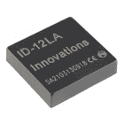
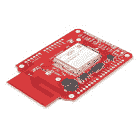

# RFID 基础知识

> 原文：<https://learn.sparkfun.com/tutorials/rfid-basics>

## 介绍

几个月前，我把书放在一个书报亭上，借出了我们当地图书馆的一摞书。所有 5 本书神奇地出现在电脑屏幕上。大约在同一时间，我父亲参加了超过 50，000 人参加的博尔德赛跑。一个电子系统记录了他的时间和成千上万的其他时间，只需要让跑步者戴上纸质的比赛围兜。被发现流浪的宠物可以通过颈部的基本扫描被识别出来并归还给它们的主人。这一切怎么可能？

*Source: [icons8](https://icons8.com/web-app/2354/rfid-tag)*

答案是 [RFID](https://www.sparkfun.com/rfid) 或 **R** adio **F** 频率 **ID** 识别。本教程将涵盖 RFID 如何工作的基础知识，并帮助指导您开始使用 RFID。

### 推荐阅读

如果您不熟悉以下概念，请在继续之前查看这些教程。它们将有助于对 RFID 的基本理解。

*   [二进制的基础知识](https://sparkle.internal.sparkfun.com/sparkle/learn_tutorials/30#tab-attributes)
*   [什么是电池？](https://sparkle.internal.sparkfun.com/sparkle/learn_tutorials/508#tab-attributes)
*   [电力](https://sparkle.internal.sparkfun.com/sparkle/learn_tutorials/72#tab-attributes)

## 基础

### 基本功能

人们可能会很容易相信，RFID 的功能归功于读取器模块，其中包含一只长着 x 光眼睛的小仓鼠，但实际上，该系统要比这简单一些。

*How RFID doesn't work*

RFID 使用由阅读器产生的无线电波来检测 RFID 标签的存在(然后读取存储在标签上的数据)。标签被嵌入小物件中，如卡片、[按钮](https://www.sparkfun.com/products/9417)或[小胶囊](https://www.sparkfun.com/products/9416)。

*Image courtesy of [EPC RFID](http://www.epc-rfid.info/rfid)*

在一些系统中，这些阅读器还使用无线电波向标签写入新信息。

## RFID 系统的类型

有两种类型的 RFID 系统:无源或有源。标签电源系统定义了系统的类型。

### 消极的

在无源 RFID 系统中，标签不使用电池；相反，它们从读者那里获得能量来运行。阅读器发射几英尺的能量场，为附近的任何标签提供能量。标签从读卡器收集电磁能量，通电，并以“hello world”及其识别信息作出响应。

无源标签的优点是能够快速读取(每秒 10 次或更多次)。它们非常薄(可以放在纸层之间)，而且非常便宜(10，000 多片装不到 0.05 美元)。

*In general, the smaller the tag the much shorter the read range*

### 活跃的

有源 RFID 系统包括具有自己的内部电源以增加范围的标签。有源标签拥有电池，并且通常具有较大的 SMD 组件。在预设的时间量之后，标签发出 RF ' *啁啾声*。附近的读者可以听到这种啁啾声。因为有源标签比无源标签能在更远的距离上被读取(几十英尺)。

有源标签的缺点包括更大的体积(由于电池的原因)、有限的寿命(当电池耗尽时标签失效)、增加每个标签的成本以及变化的报告率。

*m130 Active RFID asset tag from [RF Code](http://www.rfcode.com/)*

## RFID 频率

除了有源和无源系统，RFID 系统还可以分解成不同的频率。

一些频率和系统被设计成一次只能读取一个标签，而其他的可以读取多个标签。基于模块的频率等级，阅读器的成本也可能变化很大。在前几年，能够读取多个标签的读取器要花费数千美元，有时甚至上万美元。这些系统对于大多数爱好者和原型设计者来说是不可企及的。然而，这种情况终于开始改变，支持多读的阅读器越来越便宜。

请查看下面的图表，了解频率的基本分类及其相关属性。

| 几种常见的 RFID 阅读器类型 |
| 频率 | 又叫做 | 范围 | 读/写 | 同时读取多个标签 | 平均标签成本 |
| 低频(120-150 千赫) | [“芯片/微芯片”(在兽医应用中)](http://en.wikipedia.org/wiki/Microchip_implant_(animal))、prox 卡、HID 卡(两者都是商品名) | 高达 20 厘米/不到 1 英尺 | 只读 | 不 | $0.50 |
| 高频(13.56 兆赫) | MiFare，NFC | 高达 1 米 | 读/写 | 不 | $1 |
| 超高频(433 兆赫，860-920 兆赫) | 远程 RFID、有源 RFID | 最远 100 米 | 读/写 | 是 | $0.05 |
| 来自[维基百科的信息:射频识别](http://en.wikipedia.org/wiki/Radio-frequency_identification) |

## 标签存储器

RFID 标签在内存中存储了大量数据——这就是它们如此有用的原因。虽然标签中存储了许多不同类型的识别信息(可能因行业而异)，但大多数都超出了本教程的范围。您可以从[标签数据标准](http://www.gs1.org/epc/tag-data-standard)和[标签数据翻译标准](http://www.gs1.org/epc/tag-data-translation-standard)中找到关于标签存储要求的更多详细信息。

Some RFID tags (like the ubiquitous "HID ProxCard II" brand ID card and some brands of pet tag) use a **proprietary format**. School IDs and other cards from commercial access control systems may not work with all RFID readers.

### 第二代超高频 RFID 存储器标准

EPCglobal 编写的 [v2.0.1 标准](https://cdn.sparkfun.com/assets/learn_tutorials/6/1/3/Gen2_Protocol_Standard.pdf)涵盖了第二代 RFID 标签的所有 RFID 要求。一般来说，标签的内存分为三部分:TID、EPC 和用户内存。

#### 标签标识符存储器

TID 或标签标识符是 20 字节或 160 位。这意味着有 1460，000，000，000，000，000，000，000，000，000，000，000 个不同的可能标签 id(1.46 * 10^(48))。比人体内的原子还多！不完全是宇宙中[原子的数量](https://en.wikipedia.org/wiki/Observable_universe#Matter_content)。每个 RFID 标签都有一个唯一的 TID。TID 不可编辑。

#### 电子产品代码存储器

虽然 tid 有利于绝对识别，但第二代 RFID 标准实际上是为了在许多零售环境中取代条形码而创建的。当你去买杂货时，收银机不会关心你是否有 TID 0xE242F3，它只关心你是否有一加仑牛奶或一罐花生酱。这就是电子产品代码(EPC)的用武之地:它通常是 12 个字节，用户可编辑的，并且意味着作为 UPC 类型的替换来写入。在一加仑牛奶上贴上一个 RFID 标签，将标签的 EPC 编程为`0 7874203641 0`，收银机就会识别出这是一瓶由超值([随机来源](http://www.health.state.mn.us/wic/vendor/fpchng/upc/download/milkpdf.cfm))生产的半加仑无乳糖 1%低脂牛奶。标签不关心你在这 12 个字节中写了什么，所以写 ASCII 码`RufusTheDog`是完全可以接受的，但是要保持在 12 个字节以下。

#### 用户存储器

用户内存的大小可以从 0 字节到 64 字节不等。标签越便宜，它可能拥有的用户内存字节就越少。你用 64 字节做什么？继续一加仑牛奶的类比，用户记忆最初是用来记录诸如保质期之类的东西的。EPC 是全局标识符(“这是牛奶”)，用户记忆是特定于那加仑的(“在 8 月 15 日之前售出”)。同样，标签并不关心，所以考虑记录用户设置数据(该用户在飞行员座位上享受 10 度的下降)或使用内存作为世界上最小的[死点](https://en.wikipedia.org/wiki/Dead_drop)。

#### 密码

还有另外的可写存储位置，称为访问密码和删除密码。访问密码可以用来防止人们重新配置标签(“它可能看起来像沙朗牛排，但收银员说它是一包口香糖……”).删除密码用于永久且不可撤销地禁用标签。

## 解决纷争

根据运行 RFID 系统的机柜和环境，您可能会遇到读取器无法准确读取或写入标签数据的功能问题。请记住以下几点，它们可能有助于改进您系统的功能。

*   **避免射频干扰** -系统区域内的任何其他射频发射设备都可能对 RFID 系统的性能产生负面影响，尤其是当它们工作在同一频段时。多个 RFID 读取器彼此靠近会导致系统干扰
*   **使用干净的电源** -像大多数电子系统一样，嘈杂和/或肮脏的电源会导致 RFID 系统出现奇怪的行为。建议使用清洁的稳压电源。
*   **检查现场线** -在没有其他物体阻挡读取器和标签之间的现场线的情况下，露天读取可以提高输出。
*   **使用外部天线** -这可以提高所有系统的读取范围。机载天线的功率和范围有限。
*   **停止持有标签(超高频系统)** -人类基本上就是一袋袋的水。如果你把标签拿在手里，你会大大降低阅读范围。取而代之的是，将标签贴在一个非金属的、不含水的装置上。
*   **改变标签类型** -通常，标签越小，读取范围越短。如果你用的是玻璃胶囊，试试按钮。如果您使用按钮，请尝试使用卡片。

## 购买 RFID 系统

RFID 套件、阅读器和标签都可以帮助定义或扩展您的项目。如果你正在寻找一个开始，这些是一些可用的选项。

 

将**添加到您的[购物车](https://www.sparkfun.com/cart)中！**

 **### [【RFID 标签-洗衣 MIFARE Classic 1K(13.56 MHz)](https://www.sparkfun.com/products/10131)

[In stock](https://learn.sparkfun.com/static/bubbles/ "in stock") SEN-10131

这是一个基本的 RFID 标签，其功能符合 MIFARE Classic 1K 指南。你可以用这些来识别各种身份…

$4.50 $3.83[Favorited Favorite](# "Add to favorites") 9[Wish List](# "Add to wish list")**** 

将**添加到您的[购物车](https://www.sparkfun.com/cart)中！**

 **### [RFID 阅读器 ID-12LA(125 kHz)](https://www.sparkfun.com/products/11827)

[Only 5 left!](https://learn.sparkfun.com/static/bubbles/ "only 5 left!") SEN-11827

RFID(射频识别)是无线非接触使用射频电磁场，为目的…

$32.5012[Favorited Favorite](# "Add to favorites") 21[Wish List](# "Add to wish list")**** 

### [SparkFun 同步 RFID 阅读器- M6E Nano](https://www.sparkfun.com/products/14066)

[Out of stock](https://learn.sparkfun.com/static/bubbles/ "out of stock") SEN-14066

SparkFun 同步 RFID 阅读器是一款 Arduino 兼容板，可帮助您开始使用 M6E Nano UHF RFID 阅读器。

26[Favorited Favorite](# "Add to favorites") 45[Wish List](# "Add to wish list") 

将**添加到您的[购物车](https://www.sparkfun.com/cart)中！**

 **### [超小型超高频 RFID 标签 Rain - 10 个装](https://www.sparkfun.com/products/16464)

[In stock](https://learn.sparkfun.com/static/bubbles/ "in stock") KIT-16464

这些标签工作在 UHF (865MHz 至 928MHz)频段，包含一个用户可编程的 96 位 EPC 字段。

$21.50[Favorited Favorite](# "Add to favorites") 7[Wish List](# "Add to wish list")**** 

将**添加到您的[购物车](https://www.sparkfun.com/cart)中！**

 **### [米克罗 NFC 点击](https://www.sparkfun.com/products/20308)

[Out of stock](https://learn.sparkfun.com/static/bubbles/ "out of stock") WRL-20308

NFC Click 是一款 mikroBUS 附加板，配有恩智浦多功能近场通信控制器 PN7120 IC。

$34.95[Favorited Favorite](# "Add to favorites") 0[Wish List](# "Add to wish list")**** 

将**添加到您的[购物车](https://www.sparkfun.com/cart)中！**

 **### [米克尔圆形超高频 RFID 天线](https://www.sparkfun.com/products/20507)

[Out of stock](https://learn.sparkfun.com/static/bubbles/ "out of stock") WRL-20507

圆形 UHF RFID 天线是 UHF/RFID 阅读器实现的重要部分。

$9.95[Favorited Favorite](# "Add to favorites") 0[Wish List](# "Add to wish list")**** 

将**添加到您的[购物车](https://www.sparkfun.com/cart)中！**

 **### [米罗 NTAG 5 链接点击](https://www.sparkfun.com/products/20568)

[Out of stock](https://learn.sparkfun.com/static/bubbles/ "out of stock") SEN-20568

该板采用 NTP5332，这是一款高度集成的 NFC IC，可在器件与之间建立安全的标准链路。

$11.95[Favorited Favorite](# "Add to favorites") 0[Wish List](# "Add to wish list")**** 

将**添加到您的[购物车](https://www.sparkfun.com/cart)中！**

 **### [Qwiic 微动态 NFC/RFID 标签](https://www.sparkfun.com/products/20691)

[In stock](https://learn.sparkfun.com/static/bubbles/ "in stock") SPX-20691

意法半导体 ST25DV _**dynamic**_ 近频通信/射频识别标签 ic 太棒了…

$9.95[Favorited Favorite](# "Add to favorites") 0[Wish List](# "Add to wish list")************** ************## 资源和更进一步

既然您已经熟悉了 RFID 的概念，那么是时候将它整合到您自己的项目中了！

有关 RFID 的更多信息，请查看以下链接:

*   [GS1 的电子产品代码/RFID 标准](http://www.gs1.org/epc-rfid)
*   [ThingMagic RFID](http://www.thingmagic.com/rfid-basics)
*   [识别卡识别指南](http://www.identisource.net/format_and_facility_codes_expl.cfm)
*   [python RFID 库和示例](https://github.com/AdamLaurie/RFIDIOt)

你的下一个项目需要一些灵感吗？查看一些相关的教程和博客帖子:

 [### SparkFun RFID 入门套件连接指南](https://learn.sparkfun.com/tutorials/sparkfun-rfid-starter-kit-hookup-guide) Learn the basics of how to get started with the SparkFun RFID Starter Kit.[Favorited Favorite](# "Add to favorites") 12 [### SparkFun Qwiic RFID-IDXXLA 连接指南](https://learn.sparkfun.com/tutorials/sparkfun-qwiic-rfid-idxxla-hookup-guide) The Qwiic RFID ID-XXLA is an I2C solution that pairs with the ID-LA modules: ID-3LA, the ID-12LA, or the ID-20LA, and utilizes 125kHz RFID chips. Let's take a look at the hardware used for this tutorial.[Favorited Favorite](# "Add to favorites") 4 [### 建立一个 Qwiic 点唱机是幼儿批准！](https://learn.sparkfun.com/tutorials/build-a-qwiic-jukebox-that-is-toddler-approved) Follow this tutorial to build your own custom jukebox. Note, this is designed simple and tough for use primarily with toddlers. It's also a great introduction to SparkFun's Qwiic products 1 [### RFID 初学者教程](https://learn.sparkfun.com/tutorials/rfid-beginners-tutorial) In this tutorial we'll revisit some RFID basics and practice by making a remote work logger using an RFID reader and a GPS module. You'll scan a card and get ID, location, and time. All the perfect data to punch in and punch out from the middle of Nowhere 12 [### 英语日:Qwiic 密室逃脱

March 7, 2019](https://www.sparkfun.com/news/2887 "March 7, 2019: Hop on the I2C  BUS and let's build Escape Room puzzles Qwiic!")[Favorited Favorite](# "Add to favorites") 4 [### 周五产品发布:三月下旬

March 15, 2019](https://www.sparkfun.com/news/2893 "March 15, 2019: On this fine Friday we add RFID capabilities to our Qwiic Connect System with a new board and kit, the newest pi-top is available, and a few other knick-knacks to help you out with your next project!")[Favorited Favorite](# "Add to favorites") 0 [### 使用 RFID 防止财产盗窃

September 23, 2020](https://www.sparkfun.com/news/3355 "September 23, 2020: Vacation rentals are on the rise - how can property owners protect valuables?")[Favorited Favorite](# "Add to favorites") 0 [### 使用 RFID 和 Artemis 的工作空间黑客、SparkX 亮点和项目

April 20, 2021](https://www.sparkfun.com/news/3816 "April 20, 2021: Check out the complete digital bonus edition of Elektor Magazine filled with five extra articles")[Favorited Favorite](# "Add to favorites") 0

&nbsp

&nbsp************