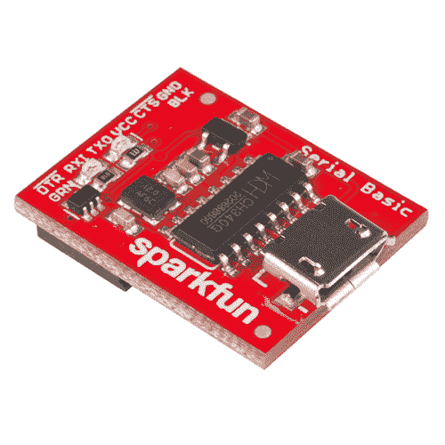
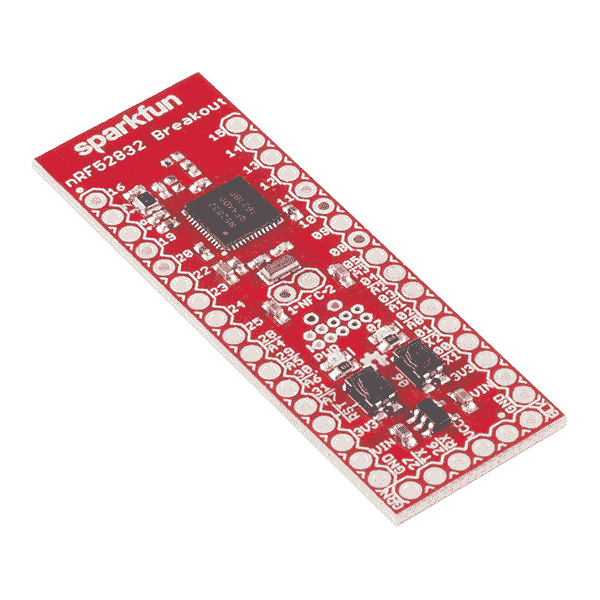
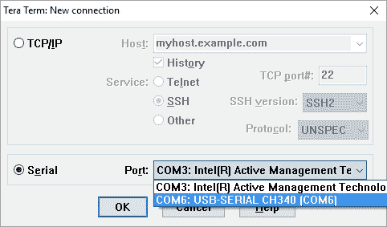
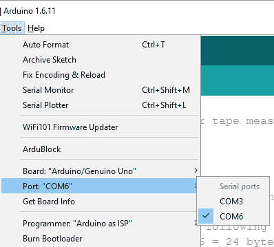
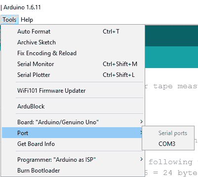
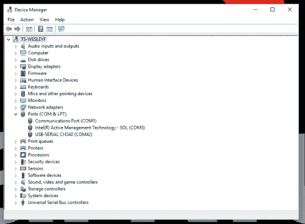
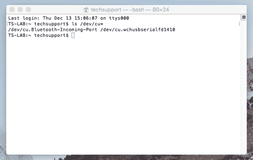

# 串行基本连接指南

> 原文：<https://learn.sparkfun.com/tutorials/serial-basic-hookup-guide>

## 介绍

[Serial Basic](https://www.sparkfun.com/products/14050) 是一款易于使用的 USB 转串行适配器，基于来自 [WCH](http://www.wch.cn) 的 CH340G IC。它适用于 5V 和 3.3V 系统，应该可以自动安装在大多数操作系统上，而不需要额外的驱动程序。这是非常受欢迎的 [FTDI Basic](https://www.sparkfun.com/products/9716) 的一个非常低成本的选择。

[](https://www.sparkfun.com/products/14050) 

将**添加到您的[购物车](https://www.sparkfun.com/cart)中！**

 **### [SparkFun 连载基础突围- CH340G](https://www.sparkfun.com/products/14050)

[In stock](https://learn.sparkfun.com/static/bubbles/ "in stock") DEV-14050

SparkFun Serial Basic Breakout 是一款易于使用的 USB 转串行适配器，基于 WCH 的 CH340G IC。

$8.957[Favorited Favorite](# "Add to favorites") 23[Wish List](# "Add to wish list")** **Serial Basic 使用 CH340G IC 快速轻松地将串行信号转换为 USB。它与我们所有的产品配合得非常好，包括 [Arduino Pro Mini](https://www.sparkfun.com/products/11113) ，我们的 [GPS 模块](https://www.sparkfun.com/categories/17)，[蜂窝模块](https://www.sparkfun.com/products/13120)，以及许多其他使用串行通信的设备。

### 所需材料

至少，您需要以下材料来跟随教程。你可能不需要所有的东西，但这取决于你有什么和你的设置。将它添加到您的购物车，通读指南，并根据需要调整购物车。

[](https://www.sparkfun.com/products/10215) 

将**添加到您的[购物车](https://www.sparkfun.com/cart)中！**

 **### [USB micro-B 线- 6 脚](https://www.sparkfun.com/products/10215)

[In stock](https://learn.sparkfun.com/static/bubbles/ "in stock") CAB-10215

USB 2.0 型到微型 USB 5 针。这是一种新的、更小的 USB 设备连接器。微型 USB 连接器大约是…

$5.5014[Favorited Favorite](# "Add to favorites") 21[Wish List](# "Add to wish list")****[](https://www.sparkfun.com/products/11026) 

将**添加到您的[购物车](https://www.sparkfun.com/cart)中！**

 **### [跳线标准 7" M/M - 30 AWG (30 个装)](https://www.sparkfun.com/products/11026)

[In stock](https://learn.sparkfun.com/static/bubbles/ "in stock") PRT-11026

如果你需要快速完成一个原型，没有什么比一堆跳线更能加快速度的了，让我们来看看

$2.4520[Favorited Favorite](# "Add to favorites") 43[Wish List](# "Add to wish list")**** ****### 推荐阅读

这是一个很容易上手的板，但是，如果你不确定串行是如何工作的，或者你以前没有使用过终端程序，你可能想看看下面的教程。

[](https://learn.sparkfun.com/tutorials/serial-communication) [### 串行通信](https://learn.sparkfun.com/tutorials/serial-communication) Asynchronous serial communication concepts: packets, signal levels, baud rates, UARTs and more 100[](https://learn.sparkfun.com/tutorials/terminal-basics) [### 串行终端基础知识](https://learn.sparkfun.com/tutorials/terminal-basics) This tutorial will show you how to communicate with your serial devices using a variety of terminal emulator applications.[Favorited Favorite](# "Add to favorites") 46[](https://learn.sparkfun.com/tutorials/how-to-work-with-jumper-pads-and-pcb-traces) [### 如何使用跳线焊盘和 PCB 走线](https://learn.sparkfun.com/tutorials/how-to-work-with-jumper-pads-and-pcb-traces) Handling PCB jumper pads and traces is an essential skill. Learn how to cut a PCB trace, add a solder jumper between pads to reroute connections, and repair a trace with the green wire method if a trace is damaged.[Favorited Favorite](# "Add to favorites") 11

## 串行基本概述

串行基本引脚排列模仿数百种 FTDI 至 USB 衍生产品上常见的DTR/RX/TX/VCC/CTS/GND 引脚排列。

[](https://cdn.sparkfun.com/assets/learn_tutorials/5/9/7/Top_of_Serial_Basic_CH340G.jpg)

| Pin Label | 输入/输出 | 描述 |
| DTR | 输出 | 数据终端就绪，低电平有效 |
| RXI | 投入 | 串行接收 |
| TXO | 输出 | 串行传输 |
| VCC | 供应输出 | 电源 **3.3V(默认)**或 5V |
| CTS | 投入 | 清除发送，低电平有效 |
| GND | 供应输出 | 接地(0V)电源 |

### 对齐标记

这些`GRN`和`BLK`指示灯帮助您将电路板与使用相同引脚排列的产品正确对齐。

[](https://cdn.sparkfun.com/assets/learn_tutorials/5/9/7/Alignment_Markers.jpg)

串行基本接口可与使用标准串行连接的产品无缝对接。如果您看到带有`BLK`和`GRN`标签的主板，那么您知道它将与**串行基本**兼容。



*See the GRN and BLK labels on this [nRF52832 Breakout](https://www.sparkfun.com/products/13990)?***Where did GRN and BLK come from?** Way back in 2008, when we created the [Arduino Pro Mini](https://www.sparkfun.com/products/11113), we needed to have a pinout to allow serial bootloading. At the time, the best USB to TTL Serial device was the FT232 Cable. Its unpolarized connector could be flipped either way so we added the words **GRN** and **BLK** to the PCB to let folks know how to line up the colored wires. The practice stuck! Now, many boards use this standard.

[](https://cdn.sparkfun.com/assets/learn_tutorials/5/9/7/FTDI_Cable.jpg)
*The cable with colored wires*

### 电压选择跳线

电路板背面有一个跳线，用于控制 VCC 引脚上的输出电压。默认情况下，板卡输出 **3.3V** ，有 **3.3V 信号**。将此跳线更改为 5V 将导致电路板在 VCC 引脚上输出 5V 的 5V 信号。

[](https://cdn.sparkfun.com/assets/learn_tutorials/5/9/7/Voltage_Jumper_CH340G.jpg)*Jumper is default to 3.3V VCC and I/O*

当跳线设置为 3.3V 时，板使用能够提供 600mA 电流的板载 3.3V 调节器。如果你试图拉动超过 600 毫安，稳压器将进入短路关闭，它将只输出 150 毫安。

当跳线设置为 5V 时，主板将提供与 USB 端口所能提供的一样多的电源。

### 发光二极管

板上有两个连接到 TX(绿色)和 RX(黄色)的 led。这是查看串行流量的快捷方式。

[](https://cdn.sparkfun.com/assets/learn_tutorials/5/9/7/Serial_Basic_CH340G_LEDs.jpg)

## 硬件测试

要将该板连接到计算机，您需要一根标准的 [A 转 micro-B USB 电缆](https://www.sparkfun.com/products/10215)。将 micro-B USB 电缆插入电脑的 USB 端口，另一端插入串行基本接口。您的计算机应该自动安装必要的驱动程序，并在您的计算机上创建一个 COM 端口。如果提示您输入驱动程序，请参见[驱动程序](https://learn.sparkfun.com/tutorials/serial-basic-hookup-guide/all#drivers-if-you-need-them)部分。

确保一切正常的最快、最简单的方法是进行 TX/RX 环回。为此，在 TX 和 RX 之间插入一根[跳线](https://www.sparkfun.com/products/12795)。从 TX 引脚发送的任何信号都将被*反射*回 RX 引脚。

[](https://cdn.sparkfun.com/assets/learn_tutorials/5/9/7/Serial_Basic_Post-02.jpg)

打开你喜欢的[终端程序](https://learn.sparkfun.com/tutorials/terminal-basics)。选择串行基本接口分配到的 COM 端口，并连接。当您键入一个字符时，您应该看到您键入的每个字符都在终端中回显。

[](https://cdn.sparkfun.com/assets/learn_tutorials/5/9/7/Terminal_Window_with_Echoed_Characters.jpg)*Success!*

## 我需要哪个 COM 端口？

大多数程序会显示创建该端口的 USB 设备的描述。要验证您的驱动程序是否正常工作，您可以使用串行终端、Arduino IDE、设备管理器或命令行。

### 串行终端

寻找与 **CH340** 关联的端口。

[](https://cdn.sparkfun.com/assets/learn_tutorials/5/9/7/SerialPort_Name-3.jpg)

### Arduino IDE 连接埠

如果你使用的是 Arduino IDE，确定哪个 COM 端口是你想要的就更困难了。这里有一个快速的方法来解决这个问题:将串行 Basic 连接到你的计算机上，并检查列出了哪些 COM 端口。在下图中，我们有两个端口。现在点击 Arduino IDE 主窗口，关闭**工具**菜单。

[](https://cdn.sparkfun.com/assets/learn_tutorials/5/9/7/SerialPort_Name-1.jpg)*Which COM port should I select?*

拔下串口 Basic，重新打开**工具**->-**端口**子菜单。您将看到其中一个串行端口丢失。那才是你想要的！重新插上串行 Basic，并使用 COM 端口。

[](https://cdn.sparkfun.com/assets/learn_tutorials/5/9/7/SerialPort_Name-2.jpg)**Note:** You need to close and re-open the tools menu before Arduino will refresh the port list. If you have the tool menu open simply click on the main window, then click back on **Tools** -> **Port**.

#### Windows:设备管理器

如果该板出现在您的设备管理器中，您也可以验证它是否已安装。你可以点击**开始**或者`⊞` ( **Windows** )按钮，输入“设备”快速搜索应用。(*在 Windows 10 上，快速搜索功能对您正在搜索的应用程序的拼写很挑剔。例如，使用“_devi_”可能会得到结果，而使用“_device_”可能得不到结果。)

[](https://cdn.sparkfun.com/assets/learn_tutorials/8/4/4/Win7_10_Device_Check.PNG)
*Screenshot of Window 10 Device Manager with Serial Basic on COM42\. **Click** to enlarge.*

#### 麦克·OSX:命令行

通过命令行在 Mac 上验证。要打开命令行窗口，请转到您的**应用程序**文件夹、**实用程序**文件夹，然后双击**终端**。否则，按`⌘` ( **命令** ) + `space bar` ( **空格键**)启动 Spotlight，输入“终端”，然后双击搜索结果。

在终端中运行以下命令“`ls /dev/cu*`”，并检查以下更改(您的板可能显示在不同的设备名称下)。

```
language:bash
ls /dev/cu* 
```

您应该会得到类似下图所示的内容。

[](https://cdn.sparkfun.com/assets/learn_tutorials/8/4/4/MacOSX_Device_Check.png)
*Screenshot of Mac OSX terminal with Serial Basic on cu.wchusbserialfd1410\. **Click** to enlarge.***Note:** If you are still unsure of how to access the Terminal, [watch this video](https://www.youtube.com/watch?v=zw7Nd67_aFw) or read this [Apple support article](https://support.apple.com/guide/terminal/open-or-quit-terminal-apd5265185d-f365-44cb-8b09-71a064a42125/mac).

#### Raspbian:命令行

在 CLI/终端中运行以下命令“`ls /dev/ttyUSB*`”，并检查以下更改(您的板可能会显示在不同的设备名称下)。

```
language:bash
ls /dev/ttyUSB* 
```

您应该会得到类似下图所示的内容。

[](https://cdn.sparkfun.com/r/500-500/assets/learn_tutorials/8/4/4/Raspbian_Stretch_Device_Check.png)
*Screenshot of Raspberry Pi CLI with Serial Basic on ttyUSB0\. **Click** to enlarge*

## 司机，如果你需要的话

该驱动程序应该会自动安装在大多数操作系统上。然而，有各种各样的操作系统。第一次将芯片连接到计算机的 USB 端口时，或者有操作系统更新时，您可能需要安装驱动程序。更多信息，请查看我们的[如何安装 CH340 驱动教程](https://www.sparkfun.com/ch340)。

[](https://learn.sparkfun.com/tutorials/how-to-install-ch340-drivers) [### 如何安装 CH340 驱动程序

#### 2019 年 8 月 6 日](https://learn.sparkfun.com/tutorials/how-to-install-ch340-drivers) How to install CH340 drivers (if you need them) on Windows, Mac OS X, and Linux.[Favorited Favorite](# "Add to favorites") 9

## 资源和更进一步

一旦串行通信开始工作，就可以开始玩串行项目了。考虑连接到 GPS 模块，如 [LS20031](https://www.sparkfun.com/products/8975) (我的最爱之一)，并观看串行字符串滚动。或者，你可以使用*串行 Basic* 来编程和调试像 [Arduino Pro Mini](https://www.sparkfun.com/products/11114) 这样的设备。有大量的设备使用串行通信，所以去探索吧！

[](https://cdn.sparkfun.com/assets/learn_tutorials/5/9/7/Serial_Basic_Post-01.jpg)*The Serial Basic programming an [Arduino Pro Mini](https://www.sparkfun.com/products/11114)***Heads up!** The image shows the Serial Basic connected to an Arduino Pro Mini 3.3V/8MHz. If you are using an Arduino Pro Mini 5V/16MHz, make sure to adjust the jumper pad for the voltage selection on the back of the Serial Basic.

查看串行基础的其他资源。

*   [示意图](https://cdn.sparkfun.com/datasheets/Dev/Arduino/Other/SparkFun-Serial-Basic-CH340-v10.pdf)
*   [老鹰档案](https://cdn.sparkfun.com/datasheets/Dev/Arduino/Other/SparkFun-Serial-Basic-CH340-v10.zip)
*   [数据表](https://cdn.sparkfun.com/datasheets/Dev/Arduino/Other/CH340DS1.PDF) (CH340G)
*   [WCH: CH340 驱动程序](http://www.wch-ic.com/downloads/CH341SER_ZIP.html) -可以从制造商处找到最新的驱动程序
    *   [Windows (EXE)](https://cdn.sparkfun.com/assets/learn_tutorials/8/4/4/CH341SER.EXE) -驱动程序可执行文件
    *   [Windows (ZIP)](https://cdn.sparkfun.com/assets/learn_tutorials/5/9/7/Windows-CH340-Driver.zip) -驱动程序版本 3.4 (2016-09-27)
    *   [Linux (ZIP)](https://cdn.sparkfun.com/assets/learn_tutorials/8/4/4/CH341SER_LINUX.ZIP) -驱动 1.5 版(2018-03-18)
    *   [Mac (ZIP)](https://cdn.sparkfun.com/assets/learn_tutorials/8/4/4/CH341SER_MAC.ZIP) -驱动程序 v1.5 (2018-07-04)
*   [GitHub](https://github.com/sparkfun/Serial_Basic_Breakout-CH340G/tree/V_1.0)

* * *

查看这些其他伟大的 SparkFun 教程。

[](https://learn.sparkfun.com/tutorials/bc118-ble-mate-2-hookup-guide) [### BC118 BLE Mate 2 连接指南](https://learn.sparkfun.com/tutorials/bc118-ble-mate-2-hookup-guide) Hooking up and using the BLE Mate 2, which uses the BC118 BLE module from BlueCreations.[Favorited Favorite](# "Add to favorites") 2[](https://learn.sparkfun.com/tutorials/sparkfun-qwiicbus-hookup-guide) [### SparkFun QwiicBus 连接指南](https://learn.sparkfun.com/tutorials/sparkfun-qwiicbus-hookup-guide) Build a long-range, noise-isolated I2C bus with the SparkFun QwiicBus Kit featuring the QwiicBus EndPoint and MidPoint following this Hookup Guide.[Favorited Favorite](# "Add to favorites") 0[](https://learn.sparkfun.com/tutorials/industrial-fiber-optics-hookup-guide) [### 工业光纤连接指南](https://learn.sparkfun.com/tutorials/industrial-fiber-optics-hookup-guide) Learn how to get started with our fiber optics breakout boards[Favorited Favorite](# "Add to favorites") 3[](https://learn.sparkfun.com/tutorials/monitor-sensor-data-from-anywhere) [### 从任何地方监控传感器数据](https://learn.sparkfun.com/tutorials/monitor-sensor-data-from-anywhere) Using WiFi to send sensor data from an ESP32 to a WiFi network and be able to read it from an IoT Dashboard from anywhere in the world.[Favorited Favorite](# "Add to favorites") 4******