# SparkFun USB UART 分线点(CY7C65213)连接指南

> 原文：<https://learn.sparkfun.com/tutorials/sparkfun-usb-uart-breakout-cy7c65213-hookup-guide>

## 介绍

[CY7C65213 USB 至 UART 串行分线点](https://www.sparkfun.com/products/13830)旨在为用户提供一种访问 CY7C65213 器件上所有可用 I/O 引脚的方式，并提供一个与其他 SparkFun 分线板兼容的 6 引脚 UART 接头。本教程将更详细地解释该板的使用。

[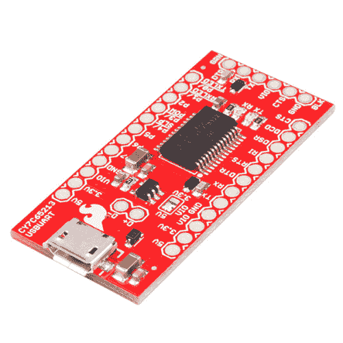](https://www.sparkfun.com/products/13830) 

将**添加到您的[购物车](https://www.sparkfun.com/cart)中！**

 **### [SparkFun USB UART 串行分线点- CY7C65213](https://www.sparkfun.com/products/13830)

[In stock](https://learn.sparkfun.com/static/bubbles/ "in stock") BOB-13830

CY7C65213 USB 转 UART 串行分线接口旨在为用户提供一种访问 I…

$16.503[Favorited Favorite](# "Add to favorites") 7[Wish List](# "Add to wish list")** **我们将解释电路板的布局，电路板上跳线的正确使用以改变 I/O 电压，以及使用 Cypress 配置应用程序改变电路板上的默认设置以满足您自己的需求。

在我们学习连接指南时，您可能会发现手头有 CY7C65213 USB 转 UART 数据手册很有用。

[CY7C65213 USB to UART Datasheet](http://www.cypress.com/file/139881/download)

## 推荐阅读

至少，您应该熟悉[异步串行通信](https://learn.sparkfun.com/tutorials/serial-communication)，因为这是该芯片的核心功能。当我们谈论不同的[逻辑电平或电压](https://learn.sparkfun.com/tutorials/logic-levels)时，你也应该知道我们指的是什么，所以你知道什么时候改变你的主板的逻辑电平。

## 硬件概述

在这里，我们将检查电路板的各个部分，为每个部分提供解释和详细的使用说明。

*   **Micro-B USB 端口** -这是主机设备的电缆连接到这台电脑的地方。电源可以通过这个连接器提供给这个电路板以及它所连接的电路。

[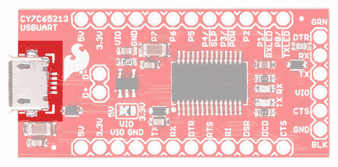](https://cdn.sparkfun.com/assets/learn_tutorials/4/8/1/CypressUSBUARTFront_microBUSB.jpg)

*   **USB 信号线** -这两个焊盘分出 D+和 D-信号线，供用户使用。如果需要，可以将这些信号输出到不同的连接器。

[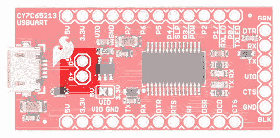](https://cdn.sparkfun.com/assets/learn_tutorials/4/8/1/CypressUSBUARTFront_USBSignalLines.jpg)

*   **VIO 选择跳线** -该跳线用于选择出现在 6 针串行接头的 VIO 针上的电压。左侧两个焊盘可以闭合，直接从 USB 电源线提供 5V 电源，或者右侧两个焊盘可以闭合，通过板载 500mA 调节器提供 3.3V 电源。如果所连接的电路板将为替代电压(比如 2.5V 或 1.8V)提供电压基准，请移除该跳线的所有焊料。

[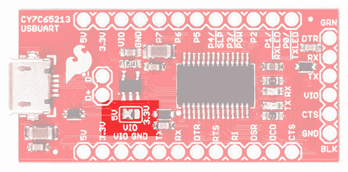](https://cdn.sparkfun.com/assets/learn_tutorials/4/8/1/CypressUSBUARTFront_VIOJumper.jpg)

*   ** 5V 引脚** -直接从 USB 电源提供 5V 电压。

[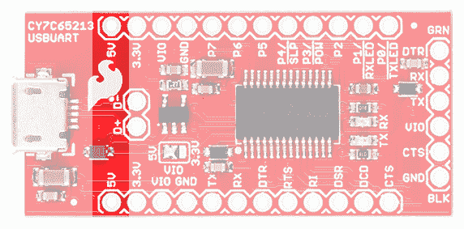](https://cdn.sparkfun.com/assets/learn_tutorials/4/8/1/CypressUSBUARTFront_5V.jpg)

*   **3.3V 引脚** -从连接到 USB 电源线的 500mA 3.3V 稳压器提供 3.3V 电压。

[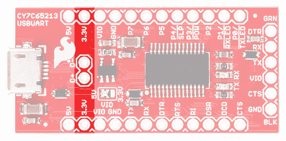](https://cdn.sparkfun.com/assets/learn_tutorials/4/8/1/CypressUSBUARTFront_33V.jpg)

*   **VIO 引脚** -连接到 6 引脚串行接头上的 VIO 引脚，根据 VIO 选择跳线，它将连接到 5V 或 3.3V，或者如果下游板为该板提供参考电压，它将反映 VIO 上的电压。

[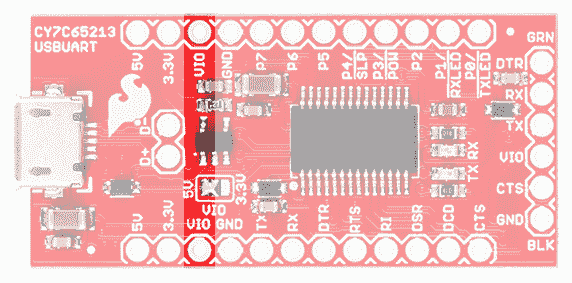](https://cdn.sparkfun.com/assets/learn_tutorials/4/8/1/CypressUSBUARTFront_VIO.jpg)

*   **可变用途 I/O 引脚** -这些引脚的用途将在后面讨论，但在正常操作中很少使用。

[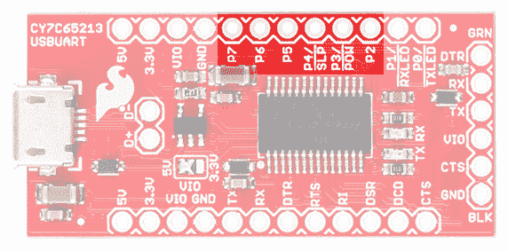](https://cdn.sparkfun.com/assets/learn_tutorials/4/8/1/CypressUSBUARTFront_VariableIOPins.jpg)

*   **DTE 端口引脚** -这些引脚提供与 RS-232 端口上同名引脚相同的功能，尽管是在 VIO 电压下，而不是真正的 RS-232 的双极性电压下。DTR 和 CTS 是最常用的。我们稍后将讨论这些引脚的作用。

[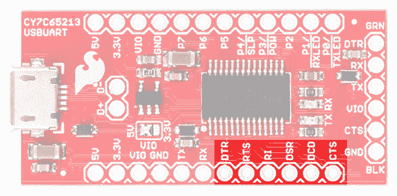](https://cdn.sparkfun.com/assets/learn_tutorials/4/8/1/CypressUSBUARTFront_DTEPortPins.jpg)

*   **TX 和 RX led**-当数据通过串行通道传输时，这些 led 亮起。当数据从主机发送到连接的板时，TX LED 亮起，当数据从连接的板发送回主机时，RX LED 亮起。

[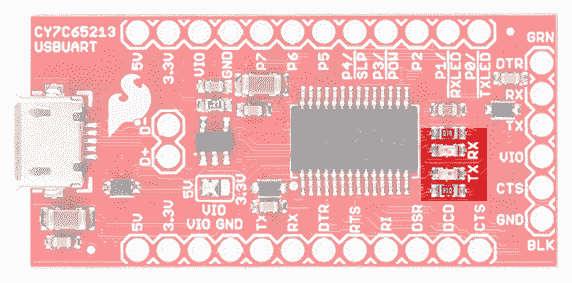](https://cdn.sparkfun.com/assets/learn_tutorials/4/8/1/CypressUSBUARTFront_LEDs.jpg)

*   **6 针串行接头**-spark fun(和其他)电路板上的长期标准，该接头包含与下游电路板通信所需的最少信号。它可用于编程 [Arduino Pro](https://www.sparkfun.com/products/10915) 和 [Pro Mini](https://www.sparkfun.com/products/11113) 电路板等。

[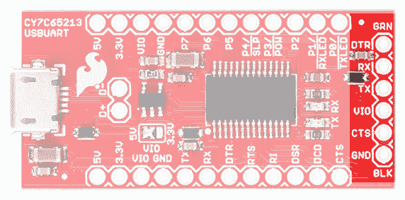](https://cdn.sparkfun.com/assets/learn_tutorials/4/8/1/CypressUSBUARTFront_SerialHeader.jpg)

*   **低压选择跳线** -在电路板的下面，你会发现一个跳线，只应在 VIO 为 2V 或更低的情况下设置。由于该电压没有片上基准电压源，因此这种情况会发生在下游电路板提供基准电压的情况下。

[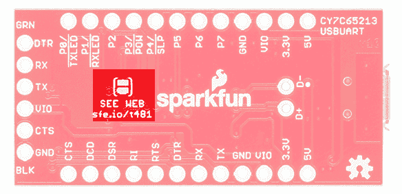](https://cdn.sparkfun.com/assets/learn_tutorials/4/8/1/CypressUSBUARTBack_Jumper.jpg)

## 安装驱动程序

### Windows 操作系统

对于 Windows 操作系统，如果这是第一次将 CY7C65213 连接到您的计算机，您将需要安装芯片的驱动程序。前往 Cypress 获取驱动程序文件:

[Cypress: Windows Drivers for CY7C65213](https://www.cypress.com/documentation/software-and-drivers/usb-serial-software-development-kit)

### 马克斯·OS X 和 Linux

对于那些使用 Mac OS X 或 Linux 的用户来说，没有必要进行安装。

## 对 Arduino Pro 或 Pro Mini 进行编程

CY7C65213 芯片可以用来编程一个 [Arduino Pro](https://www.sparkfun.com/products/10915) 或 [Pro Mini](https://www.sparkfun.com/products/11113) ，就像 SparkFun 的其他基于 FTDI 的 USB 转 UART 芯片一样。作为开始使用该板的基本示例，我们将演示这种硬件连接。

[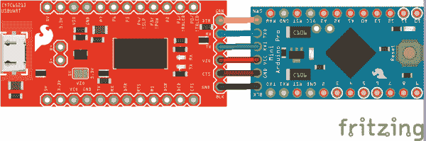](https://cdn.sparkfun.com/assets/learn_tutorials/4/8/1/cypressUSBUART.png)*Having a hard time seeing the circuit? Click on the wiring diagram for a closer look.*

请注意，与其他板不同，您需要购买某种接头来连接 Arduino 板，因为没有接头预先焊接到 CY7C65213 分线点。这为您提供了选择最适合您用途的连接器或直接在两块电路板之间焊接导线的选项。

**Don't Forget!** Double check that the VIO Selection Jumper is set to the appropriate voltage level for the board you are connecting to (5V/3.3V). If you are connecting to a board with a different reference voltage, remove all solder from this jumper before powering up your circuit.

一旦连接了板并安装了驱动程序(这在所有主要操作系统上都应该自动发生)，就不需要对板进行其他更改就可以将板用作编程连接。只需在 Arduino 软件中选择 COM 或 TTY 端口，然后继续正常操作。

## 在低于 2V 的电压下使用主板

### PCB 上的硬件变化

要支持 2V 以下的电压，您必须首先断开电路板与 PC 的连接，并调整 PCB 上的跳线。

下面显示的是 VIO 选择跳线。继续操作前，您必须清除跳线上的所有焊料。我们建议使用一些[焊芯](https://www.sparkfun.com/products/9327)来实现这一点。

[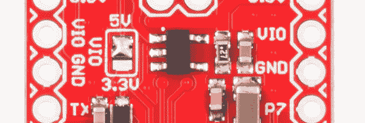](https://cdn.sparkfun.com/assets/learn_tutorials/4/8/1/13830-Jumper.jpg)

现在，您必须用焊料闭合 PCB 底部的低压跳线。

[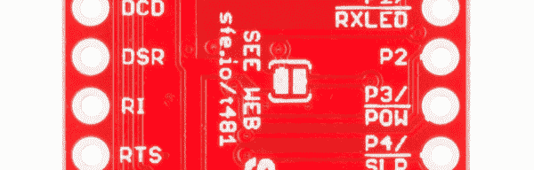](https://cdn.sparkfun.com/assets/learn_tutorials/4/8/1/13830-Bottom.jpg)

我们专门为焊接跳线创建了一个特殊的封装，以尽可能方便地闭合跳线。简单地加热两个焊盘，然后将焊料涂在焊盘上；桥梁应该自然形成。不要涂太多的焊料。

### 电脑上的软件设置

Cypress 为该芯片提供了一个可下载的[配置工具](http://www.cypress.com/?docID=47673)。遗憾的是，它目前仅适用于 Microsoft Windows 平台。您需要下载并安装该实用程序，然后才能将该芯片用于 2V 以下的电压。

[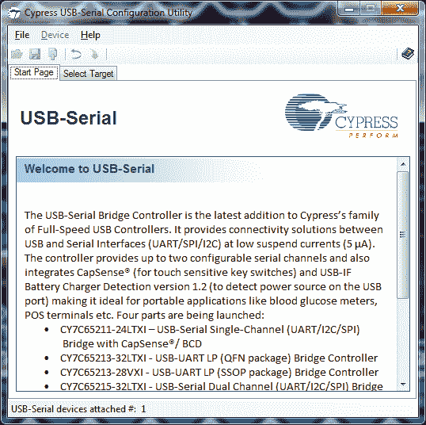](https://cdn.sparkfun.com/assets/learn_tutorials/4/8/1/config_utility_01.png)

当您第一次打开该实用程序时，您将看到以下内容。在左下方，您应该看到该实用程序只显示 Cypress USB UART 板的数量(其他制造商的芯片，如 FTDI、Arduino 或多产不会反映在这个数字中)。假设您的筹码已经出现在这里，继续点击顶部的**选择目标**选项卡。

[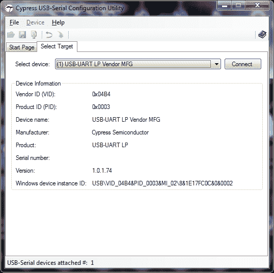](https://cdn.sparkfun.com/assets/learn_tutorials/4/8/1/config_utility_02.png)

这是**选择目标**选项卡。下拉列表将列出可用的 Cypress USB UART 板，信息(可能比您想要或需要的更多)将出现在它下面的窗口中。点击**连接**按钮继续，首先确保此时没有打开的终端窗口(如 Arduino IDE 串口监视器)使用该板。

[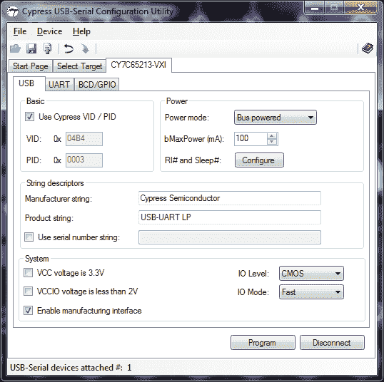](https://cdn.sparkfun.com/assets/learn_tutorials/4/8/1/config_utility_03.png)

将出现一个新的选项卡，并自动选中。在这个新选项卡的左下角，您可以看到一个标记为 **VCCIO 电压小于 2V** 的复选框。点击此复选框，然后点击页面底部的**程序**按钮。该芯片现在被配置为在低于 2V 的电压下使用。

## 资源和更进一步

有关 Cypress CY7C65213 USB UART 芯片的更多信息，请查看以下链接:

*   Cypress 的 USB UART SDK-如果你是一名经验丰富的系统级软件开发人员，可以使用 Cypress 驱动程序来实现 7C65213 芯片的其他目标。例如，它具有板载 I/O，可用于与目标 PCB 进行带外通信。
*   [CY7C65213 USB UART 分线示意图](https://cdn.sparkfun.com/datasheets/BreakoutBoards/SparkFun_Cypress_USBUART_BOB.pdf) (PDF)
*   [cy7c 65213 USB UART Breakout Eagle 文件](https://cdn.sparkfun.com/datasheets/BreakoutBoards/SparkFun_Cypress_USBUART_BOB.zip) (ZIP)
*   [CY7C65213 USB UART 数据表](https://cdn.sparkfun.com/datasheets/BreakoutBoards/CY7C65213_USB-UART_LP_Bridge_Controller_Datasheet.pdf) (PDF)
*   [spark fun cy7c 65213 USB UART Breakout GitHub 库](https://github.com/sparkfun/Cypress_CY7C65213_USBUART_BOB)(硬件源文件)

查看这些相关教程，为您的下一个项目寻找一些灵感:

 [### 闪烁的顶部](https://learn.sparkfun.com/tutorials/das-blinken-top-hat) A top hat decked out with LED strips makes for a heck of a wedding gift.[Favorited Favorite](# "Add to favorites") 1 [### RFM69HCW 连接指南](https://learn.sparkfun.com/tutorials/rfm69hcw-hookup-guide) The RFM69HCW is an inexpensive transceiver that you can use to create all kinds of wireless projects. This tutorial will help you get started.[Favorited Favorite](# "Add to favorites") 14 [### nRF52832 分线板连接指南](https://learn.sparkfun.com/tutorials/nrf52832-breakout-board-hookup-guide) How to hookup and program (in Arduino!) the nRF52832 Breakout -- a development board for Nordic's BLE/ANT/2.4GHz system on chip.[Favorited Favorite](# "Add to favorites") 6 [### 迷你 GPS 屏蔽连接指南](https://learn.sparkfun.com/tutorials/mini-gps-shield-hookup-guide) A hookup guide for the SparkFun Mini GPS Shield.[Favorited Favorite](# "Add to favorites") 5**