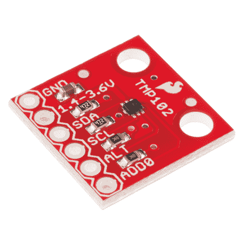

# TMP102 数字温度传感器连接指南

> 原文：<https://learn.sparkfun.com/tutorials/tmp102-digital-temperature-sensor-hookup-guide>

## 介绍

[TMP102](https://www.sparkfun.com/products/13314) 是德州仪器公司的一款易于使用的数字温度传感器。虽然一些温度传感器使用模拟电压来表示温度，但 TMP102 使用 Arduino 的 I ² C 总线来传递温度。

 

将**添加到您的[购物车](https://www.sparkfun.com/cart)中！**

 **### [SparkFun 数字温度传感器分线点- TMP102](https://www.sparkfun.com/products/13314)

[In stock](https://learn.sparkfun.com/static/bubbles/ "in stock") SEN-13314

TMP102 是一款易于使用的德州仪器(ti)数字温度传感器。TMP102 分线点可以让你很容易地融入…

$5.506[Favorited Favorite](# "Add to favorites") 28[Wish List](# "Add to wish list")** **### 所需材料

要遵循本连接指南，您需要以下内容:**