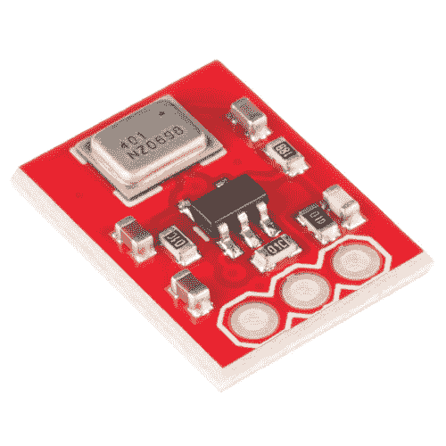
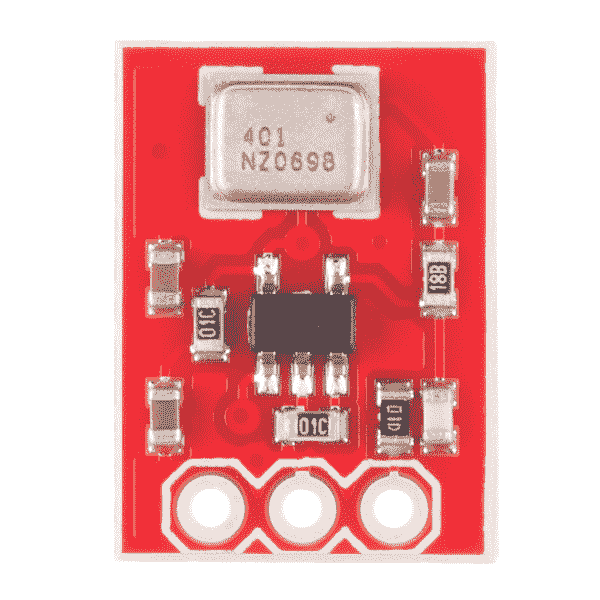
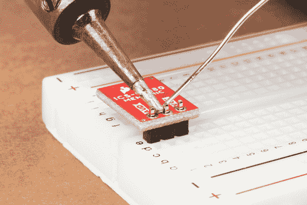
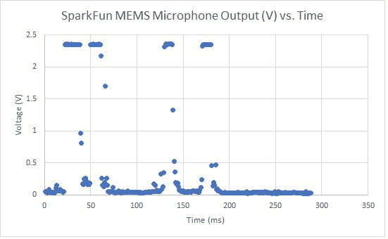

# MEMS 麦克风连接指南

> 原文：<https://learn.sparkfun.com/tutorials/mems-microphone-hookup-guide>

## 介绍

**Note:** This tutorial was originally written for the MEMS microphone breakout with ADMP401\. However, the IC is EOL. The replacement is ICS-40180 from InvenSense. The overall functionality is the same with some slight differences in the specifications, which will be outlined in the Hardware Overview.

### 介绍

[SparkFun MEMS 麦克风分线板](https://www.sparkfun.com/products/18011)是一款简单易用的麦克风，适用于各种声音检测项目。板载麦克风是一款低功耗、全向麦克风，具有模拟输出。它既适用于近距离使用，也适用于远距离使用，并且由于其低功耗，特别适合便携式应用。可能的应用包括:智能手机、数码摄像机，以及在你不在的时候帮你的宠物“留意”。下面是 ADMP401 和 ICS-40180 麦克风的分线板。

[](https://www.sparkfun.com/products/retired/9868) 

### [【spark fun MEMS 麦克风突破- INMP401 (ADMP401)](https://www.sparkfun.com/products/retired/9868)

[Retired](https://learn.sparkfun.com/static/bubbles/ "Retired") BOB-09868

这款小型分线板采用 ADMP401 MEMS 麦克风。这种突破和麦克风的一个关键优势是…

11 **Retired**[Favorited Favorite](# "Add to favorites") 35[Wish List](# "Add to wish list")[](https://www.sparkfun.com/products/18011) 

将**添加到您的[购物车](https://www.sparkfun.com/cart)中！**

 **### [SparkFun 模拟 MEMS 麦克风分线点- ICS-40180](https://www.sparkfun.com/products/18011)

[In stock](https://learn.sparkfun.com/static/bubbles/ "in stock") BOB-18011

SparkFun 模拟 MEMS 麦克风突破使 InvenSense ICS-40180 模拟麦克风的使用变得更加容易。

$6.95[Favorited Favorite](# "Add to favorites") 5[Wish List](# "Add to wish list")** **阅读该连接指南，了解每个分线板及其使用方法，包括其技术规格、如何将其连接到微控制器，以及入门示例代码！

有问题吗？反馈？想分享你用这个传感器做的一个牛逼项目吗？在本教程最后写一个[评论](https://learn.sparkfun.com/tutorials/mems-microphone-hookup-guide/discuss)！

### 推荐阅读

要成功使用 SparkFun MEMS 麦克风分线板，您需要熟悉 Arduino 微控制器、模拟(即 ADC)输入和声波。对于不熟悉这些主题的人来说，可以查看下面的参考资料，感受一下本教程中使用的概念和措辞。

[](https://learn.sparkfun.com/tutorials/what-is-an-arduino) [### 什么是 Arduino？](https://learn.sparkfun.com/tutorials/what-is-an-arduino) What is this 'Arduino' thing anyway? This tutorials dives into what an Arduino is and along with Arduino projects and widgets.[Favorited Favorite](# "Add to favorites") 50[](https://learn.sparkfun.com/tutorials/installing-arduino-ide) [### 安装 Arduino IDE](https://learn.sparkfun.com/tutorials/installing-arduino-ide) A step-by-step guide to installing and testing the Arduino software on Windows, Mac, and Linux.[Favorited Favorite](# "Add to favorites") 16[](https://learn.sparkfun.com/tutorials/analog-vs-digital) [### 模拟与数字](https://learn.sparkfun.com/tutorials/analog-vs-digital) This tutorial covers the concept of analog and digital signals, as they relate to electronics.[Favorited Favorite](# "Add to favorites") 66[](https://learn.sparkfun.com/tutorials/redboard-qwiic-hookup-guide) [### RedBoard Qwiic 连接指南](https://learn.sparkfun.com/tutorials/redboard-qwiic-hookup-guide) This tutorial covers the basic functionality of the RedBoard Qwiic. This tutorial also covers how to get started blinking an LED and using the Qwiic system.[Favorited Favorite](# "Add to favorites") 5

我们还建议您阅读以下内容，了解您的 MEMs 麦克风分线点上安装的 IC 的声音和规格的更多信息。

*   声音科学的维基百科页面！
*   最后，也是最重要的，您的 IC 的数据手册！
    *   [ADMP401](http://www.analog.com/media/en/technical-documentation/obsolete-data-sheets/ADMP401.pdf)
    *   [ICS-40180](https://cdn.sparkfun.com/assets/8/e/7/e/b/DS-000021-v1.22.pdf)

## 硬件概述

**Note:** While the characteristics for each MEMS microphone are similar, the footprint for the ADMP401 is different for the ICS-40180\. Make sure to check the design files for more information if you are designing your own board with the IC.

SparkFun MEMS 麦克风分线板将麦克风分线，用于声音检测。每个版本都将 ADMP401 和 ICS-40180 放在电路板的顶部。信号通过 OPA344 运算放大器放大。

| [](https://cdn.sparkfun.com/assets/learn_tutorials/2/9/7/09868-02a.jpg) | [](https://cdn.sparkfun.com/assets/learn_tutorials/2/9/7/18011-SparkFun_Analog_MEMS_Microphone_Breakout_-_ICS-40180-03.jpg) |
| *admp 401 分线点俯视图* | *ICS-40180 分接头的俯视图* |

该板从板的底部接收音频输入。有三个端口，分别标在每个引脚旁边。

| [](https://cdn.sparkfun.com/assets/learn_tutorials/2/9/7/09868-03a.jpg) | [](https://cdn.sparkfun.com/assets/learn_tutorials/2/9/7/18011-SparkFun_Analog_MEMS_Microphone_Breakout_-_ICS-40180-02.jpg) |
| *admp 401 分线点的仰视图* | *ICS-40180 分接头的仰视图* |

*   **AUD** -音频信号输出。
*   **VCC** -电压输入( **1.5V 到 3.3V** )。要为该 lil' mic 供电，ADMP401 应使用 DC 电压，电源电流约为 250μA，ICS-40180 则为 260μA。我们将使用 Arduino 的 **3.3V** 。
*   **GND**——地面。

对于注重技术的人来说，下面是 ADMP401 和 ICS-40180 的一些特性。请务必查看 [ADMP401](http://www.analog.com/media/en/technical-documentation/obsolete-data-sheets/ADMP401.pdf) 或 [ICS-40180](https://cdn.sparkfun.com/assets/8/e/7/e/b/DS-000021-v1.22.pdf) 的数据手册，了解麦克风的完整概述。

| 电特性 | ADMP401 | ICS-10480 |
| 高信噪比(“SNR”) | 62 dbA | 65 数据库管理员 |
| 灵敏度 | 大约-42 dBV | 大约-38 dBV |
| 平坦频率响应 | 100 赫兹至 15 千赫兹 | 60 赫兹至 20 千赫兹 |
| 低电流消耗 | 3.3V 时小于 250 μA | 3.3V 时小于 260 μA |
| 最大声音输入 | 120 分贝 | 124 分贝 |

SparkFun 分线板包括一个放大器，ADMP401 的增益为 67，ICS-10480 的增益为 65，对于麦克风来说绰绰有余。没有声音时，放大器的 AUD 输出将浮动在二分之一 Vcc。当手持并对着话筒讲话时，放大器将产生约 200 mV 的峰峰值输出。

### 电路板尺寸

分线板的尺寸为 0.50 英寸 x 0.40 英寸。即使 IC 的尺寸和组件的位置不同，每个麦克风的音频输入和插头引脚的位置也是相同的。

| [](https://cdn.sparkfun.com/assets/learn_tutorials/2/9/7/SparkFun_MEMS_Mic_Breakout-ADMP401_Board_Dimension.png) | [](https://cdn.sparkfun.com/assets/learn_tutorials/2/9/7/SparkFun_Analog_MEMS_Microphone_Breakout_ICS40180_Board_Dimensions.png) |
| *admp 401 的电路板尺寸* | *ICS-40180 的电路板尺寸* |

*Click on image for a closer view.*

## 硬件连接(快速入门)

如果所有这些都非常熟悉，下面是你需要开始的所有内容:

1.  对于临时连接，可以使用 IC 挂钩。对于永久连接，我们建议将[三根](https://learn.sparkfun.com/tutorials/how-to-solder-through-hole-soldering)[电线](https://learn.sparkfun.com/tutorials/working-with-wire)(或接头)焊接到每个 MEMS 麦克风分线板端口。

2.  将 Vcc 端口连接到 3.3V(或 1.5 到 3.3V 之间的任何电压)，并将 GND 端口接地。

3.  将 AUD 端口连接到微控制器上的模拟(ADC)输入。

4.  读入 ADMP401 模拟信号，测量/记录所有声音！(还要记住这是一个声音信号，所以你可能会想要使用声波的*振幅*而不是原始电压输出。)

| [](https://cdn.sparkfun.com/assets/learn_tutorials/2/9/7/MEMS_Microphone_ADMP401_wires-back1A.jpg) | [](https://cdn.sparkfun.com/assets/learn_tutorials/2/9/7/Analog_MEMS_Microphone_ICS-40180_IC_Hooks.jpg) |
| *导线焊接到 ADMP401* | *连接到 ICS-40180 的 IC 钩* |

**Note:** You can use any connection as explained above to connect. If you decide to solder straight header pins, we recommend inserting the straight header pin's tail from the top of the board so that the audio input for the microphone is facing away from a surface. However, depending on your application, you can also insert the pins on the side as well. For a low profile application, you will want to use right angle header pins.

| [](https://cdn.sparkfun.com/assets/learn_tutorials/2/9/7/Analog_MEMS_Microphone_ICS-40180_Straight_Headers.jpg) | [](https://cdn.sparkfun.com/assets/learn_tutorials/2/9/7/Analog_MEMS_Microphone_ICS-40180_Right_Angle_Headers.jpg) |
| *直头引脚焊接到 MEMS 麦克风。* | *直角接头引脚焊接到 MEMS 麦克风。* |

## 硬件连接

对于更深入的示例，请遵循以下步骤:

1.  对于临时连接，可以使用 IC 挂钩。对于永久连接，[将](https://learn.sparkfun.com/tutorials/how-to-solder-through-hole-soldering)三根[电线](https://learn.sparkfun.com/tutorials/working-with-wire)(或插头插脚)焊接到分线板端口。我们建议使用以下颜色来轻松区分主板端口。如果没有可用的彩色电线，您也可以选择不同的颜色。

    *   红色代表 Vcc
    *   黑色代表 GND
    *   黄色(或其他颜色)代表 AUD

2.  将 Vcc 端口连接到[微控制器](https://www.sparkfun.com/categories/242)的 3.3 V 输出(或 1.5 至 3.3 V 之间的任何电源)。

3.  将 GND 端口连接到微控制器上的 GND。

4.  将 AUD 端口连接到微控制器的模拟或 ADC 输入端。在这种情况下，我们使用 A0。

| [](https://cdn.sparkfun.com/assets/learn_tutorials/2/9/7/Arduino_Nano_Analog_MEMS_Microphone_Sensor_Bradboard_Wire_Closeup1.jpg) | [](https://cdn.sparkfun.com/assets/learn_tutorials/2/9/7/Analog_MEMS_Microphone_ICS-40180_IC_Hooks_Arduino_RedBoard.jpg) |
| *连接到 Arduino 的电线* | *连接到 Arduino 的 IC 挂钩* |

您也可以使用下面的连接表作为快速参考。

| 阿尔杜伊诺 | MEMS 麦克风 |
| A0 | 澳元 |
| GND | GND |
| 3.3V | VCC |

下一节将讨论如何将音频信号从麦克风读取到微控制器。

## Arduino 软件示例

**Note:** If this is your first time using Arduino IDE or board add-on, please review the following tutorials.

*   [安装 Arduino IDE](https://learn.sparkfun.com/tutorials/installing-arduino-ide)
*   [在 Arduino IDE 中安装板卡定义](https://learn.sparkfun.com/tutorials/installing-board-definitions-in-the-arduino-ide)

ADMP401 信号输出为可变电压。当一切安静时(shhhh)，AUD 输出将浮动在电源电压的一半。例如，对于 3.3V 电源，AUD 输出将约为 1.65V。在下图中，示波器屏幕左侧的黄色标记标记了电压的零轴(又名 V = 0)。该脉冲是手指靠近麦克风时的 AUD 输出。

[](https://cdn.sparkfun.com/assets/learn_tutorials/2/9/7/TestingSensor_Oscilloscope1.jpg)

### 将 ADC 转换为电压

微控制器模拟(ADC)输入将我们的音频信号转换为整数。可能的 ADC 值范围取决于您使用的微控制器。对于采用 ATmega328P 的 Arduino 微控制器，模拟分辨率为 10 位。该范围介于 0 和 1023 之间，因此我们的 ADC 测量分辨率为 1024。为了将模拟测量值转换为电压，我们使用以下公式:

[](https://cdn.sparkfun.com/assets/3/9/0/b/6/51140300ce395f777e000002.png)

在我们的例子中， *ADC 分辨率*为 1024，*系统电压*为 3.3 V。我们需要在代码中添加该等式，将 *ADC 读数*转换为电压。

### 但是等等，我们实际测量的是什么？？

对于许多处理声音(即波)的应用，我们最感兴趣的是信号的 [**、振幅**](https://en.wikipedia.org/wiki/Amplitude) 。一般来说，并且为了简单起见，较大的振幅意味着声音较大，较小的振幅意味着声音较轻(而声波频率大致对应[音高](https://en.wikipedia.org/wiki/Sound#Pitch))。了解我们的音频信号的幅度，可以让我们构建一个[声音可视化器](https://www.youtube.com/watch?v=0jW1Kuw79hA)，一个音量单位(“VU”)计量器，设置一个音量阈值触发器，以及其他很酷很有用的项目！

为了找到音频信号幅度，在小时间范围内(例如，50 毫秒，人类可以听到的最低频率)进行一系列测量。找出该时间范围内的最小和最大读数，并将两者相减，得到[峰间振幅](https://en.wikipedia.org/wiki/Amplitude#Peak-to-peak_amplitude)。我们可以保持不变，或者将峰峰值振幅除以 2，得到波振幅。我们可以使用 ADC 整数值，或者如上所述将其转换为电压。

[](https://cdn.sparkfun.com/assets/learn_tutorials/2/9/7/MEMS_OutputTable_012017.jpg)

### 示例代码

**Note:** For a simple test to see if your microphone is working, try using the example below! Select your Arduino board, COM port, and hit the upload button.

```
/***************************
  Simple Example Sketch for the SparkFun MEMS Microphone Breakout Board

**************************/

// Connect the MEMS AUD output to the Arduino A0 pin
int mic = A0;

// Variable to hold analog values from mic
int micOut;

void setup() {
  Serial.begin(9600);

}

void loop() {
  // read the input on analog pin 0:
  micOut = analogRead(mic);

  // print out the value you read:
  Serial.println(micOut);

}
```

Open the [Serial Monitor](https://learn.sparkfun.com/tutorials/terminal-basics/arduino-serial-monitor-windows-mac-linux) or Serial Plotter to view the output. Snap, clap, or speak into the microphone and observe the readings. The raw value will be higher as the microphone picks up louder sounds. For a more refined example, check out the example code below! You can also view the raw output in the example code below but it requires a little bit more effort.

下面是一个简单的草图示例，帮助您开始使用 MEMS 麦克风分线板。您也可以在 [GitHub repo](https://github.com/jenfoxbot/MEMSMicHookUpGuide) 中找到代码。为 Arduino 微控制器编写的代码包括一个从 ADC 读数到电压的转换方程，一个查找音频信号峰峰值幅度的函数，以及一个输出到 Arduino [串行监视器](https://learn.sparkfun.com/tutorials/terminal-basics/arduino-serial-monitor-windows-mac-linux)的简单 VU 计。为了获得更直观的输出，还可以使用串行绘图仪。

请务必阅读代码中的注释，以了解它是如何工作的，并根据您的需要进行调整。选择你的 Arduino 板，COM 端口，点击上传按钮。

```
language:c
/***************************
 * Example Sketch for the SparkFun MEMS Microphone Breakout Board
 * Written by jenfoxbot <jenfoxbot@gmail.com>
 * Code is open-source, beer/coffee-ware license.
 */

// Connect the MEMS AUD output to the Arduino A0 pin
int mic = A0;

// Variables to find the peak-to-peak amplitude of AUD output
const int sampleTime = 50; 
int micOut;

//previous VU value
int preValue = 0; 

void setup() {
  Serial.begin(9600);
}

void loop() {
   int micOutput = findPTPAmp();
   VUMeter(micOutput);   
}   

// Find the Peak-to-Peak Amplitude Function
int findPTPAmp(){
// Time variables to find the peak-to-peak amplitude
   unsigned long startTime= millis();  // Start of sample window
   unsigned int PTPAmp = 0; 

// Signal variables to find the peak-to-peak amplitude
   unsigned int maxAmp = 0;
   unsigned int minAmp = 1023;

// Find the max and min of the mic output within the 50 ms timeframe
   while(millis() - startTime < sampleTime) 
   {
      micOut = analogRead(mic);
      if( micOut < 1023) //prevent erroneous readings
      {
        if (micOut > maxAmp)
        {
          maxAmp = micOut; //save only the max reading
        }
        else if (micOut < minAmp)
        {
          minAmp = micOut; //save only the min reading
        }
      }
   }

  PTPAmp = maxAmp - minAmp; // (max amp) - (min amp) = peak-to-peak amplitude
  double micOut_Volts = (PTPAmp * 3.3) / 1024; // Convert ADC into voltage

  //Uncomment this line for help debugging (be sure to also comment out the VUMeter function)
  //Serial.println(PTPAmp); 

  //Return the PTP amplitude to use in the soundLevel function. 
  // You can also return the micOut_Volts if you prefer to use the voltage level.
  return PTPAmp;   
}

// Volume Unit Meter function: map the PTP amplitude to a volume unit between 0 and 10.
int VUMeter(int micAmp){

  // Map the mic peak-to-peak amplitude to a volume unit between 0 and 10.
   // Amplitude is used instead of voltage to give a larger (and more accurate) range for the map function.
   // This is just one way to do this -- test out different approaches!
  int fill = map(micAmp, 23, 750, 0, 10); 

  // Only print the volume unit value if it changes from previous value
  while(fill != preValue)
  {
    Serial.println(fill);
    preValue = fill;
  }
} 
```

## 资源和更进一步

现在，您已经连接了 MEMS 麦克风分线点，是时候将它整合到您自己的项目中了！有关更多信息，请查看以下资源:

*   ADMP401
    *   [示意图](http://www.sparkfun.com/datasheets/BreakoutBoards/ADMP401-Breakout-v13.pdf)
    *   [老鹰档案](http://cdn.sparkfun.com/datasheets/BreakoutBoards/ADMP401-Breakout-v13.zip)
    *   [电路板尺寸](https://cdn.sparkfun.com/assets/learn_tutorials/2/9/7/SparkFun_MEMS_Mic_Breakout-ADMP401_Board_Dimension.png)
    *   数据表
        *   [INMP401](https://cdn.sparkfun.com/assets/2/3/5/d/f/DS-9868.pdf)
        *   [ADMP401](https://cdn.sparkfun.com/assets/learn_tutorials/2/9/7/ADMP401.pdf)
    *   [GitHub 硬件回购](https://github.com/sparkfun/MEMS_Mic_Breakout-ADMP401)
*   ICS-40180
    *   [示意图](https://cdn.sparkfun.com/assets/c/3/7/5/e/SparkFun_Analog_MEMS_Microphone_Breakout_ICS40180_Schematic.pdf)
    *   [老鹰档案](https://cdn.sparkfun.com/assets/e/7/6/c/f/SparkFun_Analog_MEMS_Microphone_Breakout_ICS40180.zip)
    *   [电路板尺寸](https://cdn.sparkfun.com/assets/learn_tutorials/2/9/7/SparkFun_Analog_MEMS_Microphone_Breakout_ICS40180_Board_Dimensions.png)
    *   [数据表](https://cdn.sparkfun.com/assets/8/e/7/e/b/DS-000021-v1.22.pdf) (ICS-40180)
    *   [GitHub 硬件回购](https://github.com/sparkfun/SparkFun_Analog_MEMS_Microphone_Breakout_ICS-40180)

如果您在获取或理解来自 MEMS 麦克风分线板的音频信号输出时遇到困难，请尝试使用[万用表](https://learn.sparkfun.com/tutorials/how-to-use-a-multimeter/all)和/或[示波器](https://learn.sparkfun.com/tutorials/how-to-use-an-oscilloscope)在安静和嘈杂的设置下测量信号的电压输出。如果您仍然遇到问题，请查看我们的论坛，我们将帮助您解决问题。

了解 MEMS 麦克风并很好地处理信号输出后，您就可以开始将其用于实际麦克风应用了！以下是一些让你开始的想法:

1.  建立一个音乐可视化！[这里有一个音乐可视化工具的草图](https://github.com/sparkfun/MEMS_Mic_Breakout-ADMP401/blob/V_1.3/Firmware/SparkFun_ADMP401_Simple_Sketch/SparkFun_INMP401.ino)，显示在 [SparkFun 简单草图示例](https://www.youtube.com/watch?v=0jW1Kuw79hA)中。

    [https://www.youtube.com/embed/0jW1Kuw79hA/?autohide=1&border=0&wmode=opaque&enablejsapi=1](https://www.youtube.com/embed/0jW1Kuw79hA/?autohide=1&border=0&wmode=opaque&enablejsapi=1)

2.  录制声音并回放！你还需要一个[扬声器](https://www.sparkfun.com/products/9151)，一个[放大晶体管](https://www.sparkfun.com/products/521)，和一些[按钮](https://www.sparkfun.com/search/results?term=pushbutton)(还有一些代码。[这里有一个开源的 mbed 例子](https://developer.mbed.org/users/rayxke/notebook/sparkfun-mems-microphone-breakout---inmp401-admp40/)。
3.  做一个[声音反应 EL 线服装](https://learn.sparkfun.com/tutorials/sound-reactive-el-wire-costume?_ga=1.74922449.279642071.1481099413)用 MEMS 麦克风代替声音检测器！
4.  用树莓皮做一个[吠叫宠物监视器](https://learn.sparkfun.com/tutorials/bark-back-interactive-pet-monitor)来记录你家里的声音水平，上传数据 MQTT，并在音量达到阈值时触发音频播放器。

或者看看下面这些音频相关的教程。

[](https://learn.sparkfun.com/tutorials/mp3-player-shield-music-box) [### MP3 播放器屏蔽音乐盒](https://learn.sparkfun.com/tutorials/mp3-player-shield-music-box) Music Box Project based on the Dr. Who TARDIS.[Favorited Favorite](# "Add to favorites") 8[](https://learn.sparkfun.com/tutorials/bare-conductive-musical-painting-) [### 裸露导电音乐画](https://learn.sparkfun.com/tutorials/bare-conductive-musical-painting-) Learn how to make a musical painting using the Bare Conductive Touch Board and Conductive Paint.[Favorited Favorite](# "Add to favorites") 6[](https://learn.sparkfun.com/tutorials/sparkfun-inventors-kit-for-microbit-experiment-guide) [### SparkFun Inventor 的微型工具包:bit 实验指南](https://learn.sparkfun.com/tutorials/sparkfun-inventors-kit-for-microbit-experiment-guide) This guide contains all the information you will need to explore the twelve circuits of the SparkFun Inventors Kit for micro:bit.[Favorited Favorite](# "Add to favorites") 12[](https://learn.sparkfun.com/tutorials/spectacle-example-super-mario-bros-diorama) [### 奇观例子:超级马里奥兄弟西洋镜](https://learn.sparkfun.com/tutorials/spectacle-example-super-mario-bros-diorama) A study in building an animated diorama (with sound!) using Spectacle electronics.[Favorited Favorite](# "Add to favorites") 1

快乐大厦！**