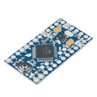
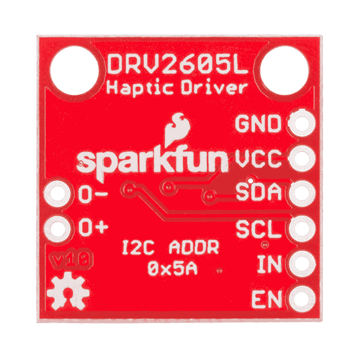

# 触觉电机驱动器连接指南

> 原文：<https://learn.sparkfun.com/tutorials/haptic-motor-driver-hook-up-guide>

## 介绍触觉电机驱动器

准备好给你的项目添加一些好的氛围了吗？只需看看[触觉电机驱动器](https://www.sparkfun.com/products/14538)即可。该板打破了德州仪器的 DRV2605L 触觉电机驱动器，其中有一些非常酷的功能。使用触觉电机驱动器和 Arduino 兼容设备，从您的设备添加有意义的反馈。本教程将让你很快开始使用 Arduino 的 I ² C 库和示例项目，为你提供硬件设置和各种操作模式的代码。

[](https://www.sparkfun.com/products/14538) 

将**添加到您的[购物车](https://www.sparkfun.com/cart)中！**

 **### [SparkFun 触觉电机驱动器- DRV2605L](https://www.sparkfun.com/products/14538)

[In stock](https://learn.sparkfun.com/static/bubbles/ "in stock") ROB-14538

准备好给你的项目添加一些好的氛围了吗？只需看看 SparkFun 触觉电机驱动器。这个板爆发出特…

$9.50[Favorited Favorite](# "Add to favorites") 5[Wish List](# "Add to wish list")** **[https://www.youtube.com/embed/lUJ4afO0jTc/?autohide=1&border=0&wmode=opaque&enablejsapi=1](https://www.youtube.com/embed/lUJ4afO0jTc/?autohide=1&border=0&wmode=opaque&enablejsapi=1)

### 特征

*   适用于 ERM 和 LRA 型电机的灵活触觉和振动驱动器
*   I ² C 控制的数字回放引擎
*   音频到共鸣
*   占空比控制范围为 0%至 100%的 PWM 输入
*   硬件触发输入
*   内置波形序列发生器和触发器

这只是举几个例子。完整列表见 [DRV2605L 数据表](https://cdn.sparkfun.com/datasheets/Robotics/drv2605l.pdf)。

### 所需材料

你需要一些额外的部件来启动和运行触觉电机驱动器。下面是本教程中使用的基本组件，如果您想继续学习的话。

[](https://www.sparkfun.com/products/13975) 

将**添加到您的[购物车](https://www.sparkfun.com/cart)中！**

 **### [spark fun red board——用 Arduino 编程 T3](https://www.sparkfun.com/products/13975)

[In stock](https://learn.sparkfun.com/static/bubbles/ "in stock") DEV-13975

SparkFun RedBoard 结合了 UNO 的 Optiboot 引导程序的简单性、FTDI 的稳定性和 shield com…

$21.5049[Favorited Favorite](# "Add to favorites") 89[Wish List](# "Add to wish list")****[](https://www.sparkfun.com/products/8431) 

将**添加到您的[购物车](https://www.sparkfun.com/cart)中！**

 **### [跳线高级 6 "米/米装 10 根](https://www.sparkfun.com/products/8431)

[In stock](https://learn.sparkfun.com/static/bubbles/ "in stock") PRT-08431

这是一个 SparkFun 独家！这些是 155 毫米长、26 AWG 跳线，两端都有公接头。用这些来跳离…

$4.502[Favorited Favorite](# "Add to favorites") 11[Wish List](# "Add to wish list")****[](https://www.sparkfun.com/products/8449) 

将**添加到您的[购物车](https://www.sparkfun.com/cart)中！**

 **### [振动马达](https://www.sparkfun.com/products/8449)

[In stock](https://learn.sparkfun.com/static/bubbles/ "in stock") ROB-08449

一个振动马达！这款小巧的无轴振动马达非常适合无声指示器。在任意数量的应用程序中使用…

$2.2512[Favorited Favorite](# "Add to favorites") 60[Wish List](# "Add to wish list")****[](https://www.sparkfun.com/products/retired/12016) 

### [SparkFun Cerberus USB 线- 6ft](https://www.sparkfun.com/products/retired/12016)

[Retired](https://learn.sparkfun.com/static/bubbles/ "Retired") CAB-12016

你拿错了 USB 线。你有哪一个不重要，都是错的。但是如果你有正确的…

16 **Retired**[Favorited Favorite](# "Add to favorites") 37[Wish List](# "Add to wish list")****** ******需要一个支持 [I ² C](https://learn.sparkfun.com/tutorials/i2c) 的微控制器与 DRV2605L 进行通信，并通过振动的方式将数据中继给用户。 [SparkFun RedBoard](https://www.sparkfun.com/products/12757) 或 [Arduino Uno](https://www.sparkfun.com/products/11021) 是这个角色的热门选择，但几乎任何微控制器开发板都应该工作。(固件示例使用 Arduino 库，如果这是使用 Arduino 的额外动机的话。)

[](https://www.sparkfun.com/products/11113) 

将**添加到您的[购物车](https://www.sparkfun.com/cart)中！**

 **### [Arduino Pro Mini 328-5V/16 MHz](https://www.sparkfun.com/products/11113)

[In stock](https://learn.sparkfun.com/static/bubbles/ "in stock") DEV-11113

SparkFun 对 Arduino 的极简设计方法。这是一个 5V Arduino 运行 16MHz 引导加载程序。

$10.95137[Favorited Favorite](# "Add to favorites") 166[Wish List](# "Add to wish list")****[](https://www.sparkfun.com/products/11021) 

将**添加到您的[购物车](https://www.sparkfun.com/cart)中！**

 **### [Arduino Uno - R3](https://www.sparkfun.com/products/11021)

[In stock](https://learn.sparkfun.com/static/bubbles/ "in stock") DEV-11021

这是新的 Arduino Uno R3。除了以前主板的所有功能外，Uno 现在使用 ATmega16U2 代替…

$27.95138[Favorited Favorite](# "Add to favorites") 162[Wish List](# "Add to wish list")****[](https://www.sparkfun.com/products/13975) 

将**添加到您的[购物车](https://www.sparkfun.com/cart)中！**

 **### [spark fun red board——用 Arduino 编程 T3](https://www.sparkfun.com/products/13975)

[In stock](https://learn.sparkfun.com/static/bubbles/ "in stock") DEV-13975

SparkFun RedBoard 结合了 UNO 的 Optiboot 引导程序的简单性、FTDI 的稳定性和 shield com…

$21.5049[Favorited Favorite](# "Add to favorites") 89[Wish List](# "Add to wish list")****[](https://www.sparkfun.com/products/13664) 

将**添加到您的[购物车](https://www.sparkfun.com/cart)中！**

 **### [SparkFun SAMD21 迷你突围](https://www.sparkfun.com/products/13664)

[In stock](https://learn.sparkfun.com/static/bubbles/ "in stock") DEV-13664

如果您准备从旧的 8 位/16MHz 微控制器升级您的 Arduino 游戏，SparkFun SAMD21 Mini Breakout 是…

$22.5018[Favorited Favorite](# "Add to favorites") 36[Wish List](# "Add to wish list")******** ********### 推荐阅读

DRV2605L 是为少数用途设计的。德州仪器提供的[技术文档](http://www.ti.com/product/DRV2605L/technicaldocuments)包括应用笔记、用户指南、文献和博客。DRV2605L 通过 I ² C 通信。我们有一个很棒的库，使它易于使用。我们将使用试验板将分线板连接到红板。如果这些主题对您来说听起来很陌生，请考虑在继续之前浏览这些教程。

[](https://learn.sparkfun.com/tutorials/how-to-solder-through-hole-soldering) [### 如何焊接:通孔焊接](https://learn.sparkfun.com/tutorials/how-to-solder-through-hole-soldering) This tutorial covers everything you need to know about through-hole soldering.[Favorited Favorite](# "Add to favorites") 70[](https://learn.sparkfun.com/tutorials/installing-an-arduino-library) [### 安装 Arduino 库](https://learn.sparkfun.com/tutorials/installing-an-arduino-library) How do I install a custom Arduino library? It's easy! This tutorial will go over how to install an Arduino library using the Arduino Library Manager. For libraries not linked with the Arduino IDE, we will also go over manually installing an Arduino library.[Favorited Favorite](# "Add to favorites") 22[](https://learn.sparkfun.com/tutorials/how-to-use-a-breadboard) [### 如何使用试验板](https://learn.sparkfun.com/tutorials/how-to-use-a-breadboard) Welcome to the wonderful world of breadboards. Here we will learn what a breadboard is and how to use one to build your very first circuit.[Favorited Favorite](# "Add to favorites") 79[](https://learn.sparkfun.com/tutorials/i2c) [### I2C](https://learn.sparkfun.com/tutorials/i2c) An introduction to I2C, one of the main embedded communications protocols in use today.[Favorited Favorite](# "Add to favorites") 128

## 硬件概述

[](https://cdn.sparkfun.com/assets/parts/1/1/8/4/7/14031-03.jpg)

### 泛度量学

| 参数 | 描述 |
| 最小-最大电源电压 | **2V-5.2v** |
| 特殊特点 | 集成触觉效果和智能环路架构。 |
| 输入信号 | PWM，模拟，I ² C。 |
| 最大输出电压 | 10.4 伏。 |
| 触觉致动器类型 | 仅适用于 ERM 和 LRA 型电机。 |
| 关闭电流 | 4uA。 |
| 静态电流 | 0.5 毫安-对于电池供电项目非常重要。 |

### 引脚描述

SparkFun 触觉电机驱动器- DRV2605L 分线板提供 6 个引脚为传感器和 I ² C 总线供电。

[](https://cdn.sparkfun.com/assets/parts/1/1/8/4/7/14031-04.jpg)

| Pin Label | 描述 |
| GND | 连接到地。 |
| VCC | 用于为 DRV2605L 触觉电机驱动器供电。必须在 2.0-5.2 伏之间 |
| 国家药品监督管理局 | I ² C 数据 |
| SCL | I ² C 时钟 |
| 在…里 | 模拟和 PWM 信号输入 |
| 在中 | 启用引脚。大多数应用程序连接到 VCC。 |
| 哦- | 负极电机端子。 |
| O+ | 正极电机端子。 |

### 设置跳线

分线板的正面是一个跳线:

*   **I2C PU** -这是一个 3 路焊接跳线，用于连接和断开 I ² C 上拉电阻。默认情况下，该跳线为**闭合**，这意味着 SDA 和 SCL 线都连接了分线板上的上拉电阻。如果不需要上拉电阻，使用一些[焊芯](https://www.sparkfun.com/products/9327)打开跳线(例如，上拉电阻位于 I ² C 总线的其他地方)。

## ERM 和 LRA 汽车公司

DRV2605L 能够驱动两种不同类型的电机。那么它们是什么呢？它们是如何工作的？它们有什么不同？

[Precision Microdrives](https://www.precisionmicrodrives.com/) 公布了关于使用[偏心旋转质量、ERM](https://www.precisionmicrodrives.com/application-notes/ab-004-understanding-erm-vibration-motor-characteristics) 和[线性谐振驱动器、LRA](https://www.precisionmicrodrives.com/application-notes/ab-020-understanding-linear-resonant-actuator-characteristics) 型电机的应用说明。DRV2605L 的默认固件设置为用于 ERM 型电机。ERM 类型有六个效果库，而 LRA 只有一个。

[](https://cdn.sparkfun.com/assets/learn_tutorials/5/9/5/Capture2.PNG)*Photo courtesy of https://www.precisionmicrodrives.com/*[](https://cdn.sparkfun.com/assets/learn_tutorials/5/9/5/Capture3.PNG)*Photo courtesy of https://www.precisionmicrodrives.com/*

这两种马达的区别在于质量的运动是如何转移的。LRA 振动马达需要一个交流信号，驱动一个经过调制的正弦波形，以获得多种效果。ERM 振动马达使用 DC 马达，并配有配重。DC 电压控制电机的速度。

> ERM 有一个偏心负载，当它旋转时，向心力使电机移动。旋转是通过向附在电机轴上的电枢绕组施加电流而产生的。由于它们位于电机内部永磁体产生的磁场中，因此会产生一个力使轴旋转。为了确保旋转方向一致，绕组中的电流反向。这是通过在电机端子处使用静态金属刷来实现的，该金属刷连接到与轴和绕组一起旋转的换向器。换向器的不同部分在旋转过程中连接到电刷，电流反向，保持旋转方向。
> 
> 类似地，LRA 利用磁场和电流产生力。一个主要的区别是音圈(相当于电枢绕组)保持静止，而磁性物质移动。质量还连接到一个弹簧，帮助它回到中心。上下驱动磁性体导致 LRA 的位移，从而导致振动力的位移。 ^([1](#footnote))

### **更多建议阅读**

*   [ERM 振动电机](https://www.precisionmicrodrives.com/application-notes/ab-004-understanding-erm-vibration-motor-characteristics)
*   [LRA 振动电机](https://www.precisionmicrodrives.com/vibration-motors/linear-resonant-actuators-lras)
*   [触觉学](http://www.ti.com/lit/ml/sszb151/sszb151.pdf)
*   [触觉解决方案](http://www.nfpmotor.com/The%20Differences%20Between%20ERM%20and%20LRA%20Actuators.pdf)
*   [设备如何提供触觉反馈](https://blog.somaticlabs.io/how-devices-provide-haptic-feedback/)

:“a b-020:了解线性共振致动器特性。”应用笔记。Https://www.precisionmicrodrives.com。n . p . n . d .网络。2016 年 11 月 29 日。

## 使用 SparFun DRV2605L 库

要使用 SparkFun 触觉电机驱动程序，您需要一些支持软件。如果你使用 Arduino，那么你很幸运！我们创建了一个 Arduino 库，使 DRV2605L 易于使用。要从 Arduino IDE 自动安装库，只需导航到**草图** > **包含库** > **管理库...**并搜索 **SparkFun 触觉电机驱动**。或者您可以从 GitHub 资源库中抓取 zip 文件来手动安装:

[SparkFun Haptic Motor Driver Arduino Library (ZIP)](https://github.com/sparkfun/SparkFun_Haptic_Motor_Driver_Arduino_Library/archive/refs/heads/master.zip)

SparkFun DRV2605L 库定义了每个寄存器，可以调用简单的函数来创建自定义的触觉体验。必须设置每个寄存器(或者使用缺省值，如果这对您有用的话)。使用[数据表](https://cdn.sparkfun.com/datasheets/Robotics/drv2605l.pdf)帮助您获得需要写入寄存器的值。

浏览库头文件，您会发现几乎每个寄存器都有一条注释，说明其功能以及数据手册中相应的页码。该板能够在七种模式下工作，可以使用 LRA 或 ERM 型电机。我们将探讨其中两种模式——内部触发模式和 PWM 模式。从现在开始，让设备在其他模式下工作应该不会太难。

让我们详细研究一下每个例子。

## 内部触发模式

内部触发模式允许您播放 rom 波形存储器中的波形或自定义波形序列。在本例中，我们将播放所有 123 种波形效果，方法是将它们加载到所有 8 个波形序列寄存器中。这个简单的草图也将帮助您熟悉效果库，这样您就可以开始构建自己的自定义效果序列。波形效果的完整列表见[数据表](http://www.ti.com/lit/ds/symlink/drv2605l.pdf)第 60 页。每个库(列在数据手册的第 14 页)都有自己的额定电压、上升时间和制动时间。

### 所需零件

[](https://www.sparkfun.com/products/13975) 

将**添加到您的[购物车](https://www.sparkfun.com/cart)中！**

 **### [spark fun red board——用 Arduino 编程 T3](https://www.sparkfun.com/products/13975)

[In stock](https://learn.sparkfun.com/static/bubbles/ "in stock") DEV-13975

SparkFun RedBoard 结合了 UNO 的 Optiboot 引导程序的简单性、FTDI 的稳定性和 shield com…

$21.5049[Favorited Favorite](# "Add to favorites") 89[Wish List](# "Add to wish list")****[](https://www.sparkfun.com/products/8431) 

将**添加到您的[购物车](https://www.sparkfun.com/cart)中！**

 **### [跳线高级 6 "米/米装 10 根](https://www.sparkfun.com/products/8431)

[In stock](https://learn.sparkfun.com/static/bubbles/ "in stock") PRT-08431

这是一个 SparkFun 独家！这些是 155 毫米长、26 AWG 跳线，两端都有公接头。用这些来跳离…

$4.502[Favorited Favorite](# "Add to favorites") 11[Wish List](# "Add to wish list")****[](https://www.sparkfun.com/products/14538) 

将**添加到您的[购物车](https://www.sparkfun.com/cart)中！**

 **### [SparkFun 触觉电机驱动器- DRV2605L](https://www.sparkfun.com/products/14538)

[In stock](https://learn.sparkfun.com/static/bubbles/ "in stock") ROB-14538

准备好给你的项目添加一些好的氛围了吗？只需看看 SparkFun 触觉电机驱动器。这个板爆发出特…

$9.50[Favorited Favorite](# "Add to favorites") 5[Wish List](# "Add to wish list")****[](https://www.sparkfun.com/products/8449) 

将**添加到您的[购物车](https://www.sparkfun.com/cart)中！**

 **### [振动马达](https://www.sparkfun.com/products/8449)

[In stock](https://learn.sparkfun.com/static/bubbles/ "in stock") ROB-08449

一个振动马达！这款小巧的无轴振动马达非常适合无声指示器。在任意数量的应用程序中使用…

$2.2512[Favorited Favorite](# "Add to favorites") 60[Wish List](# "Add to wish list")******** ********### 硬件连接

[](https://cdn.sparkfun.com/assets/learn_tutorials/5/9/5/simpleSketch.png)

硬件由标准 I ² C 连接组成，使能(EN)引脚必须拉高。

### Arduino 程序

```
language:c
#include <Sparkfun_DRV2605L.h> //SparkFun Haptic Motor Driver Library 
#include <Wire.h> //I2C library 

SFE_HMD_DRV2605L HMD; //Create haptic motor driver object 

void setup() 
{
  HMD.begin();
  Serial.begin(9600);
  HMD.Mode(0); // Internal trigger input mode -- Must use the GO() function to trigger playback.
  HMD.MotorSelect(0x36); // ERM motor, 4x Braking, Medium loop gain, 1.365x back EMF gain
  HMD.Library(2); //1-5 & 7 for ERM motors, 6 for LRA motors 

}
void loop() 
{
  int seq = 0; //There are 8 sequence registers that can queue up to 8 waveforms
  for(int wave = 1; wave <=123; wave++) //There are 123 waveform effects 
  {
     HMD.Waveform(seq, wave);
     HMD.go();
     delay(600); //give enough time to play effect 
     Serial.print("Waveform Sequence:      ");
     Serial.println(seq);
     Serial.print("Effect No.:      ");
     Serial.println(wave);

    if (wave%8==0) //Each Waveform register can queue 8 effects
    {
        seq=seq+1;
    }
    if (wave%64==0) // After the last register is used start over 
    {
        seq=0;
    }
  }
 } 
```

## PWM 和模拟输入模式示例:光振动

在本示例项目中，我们将根据来自光电池的模拟输入来控制 ERM 电机，该模拟输入映射到 0-255 的范围，并使用该结果来设置连接到触觉电机驱动器的 IN/TRIG 引脚的输出引脚的脉冲宽度调制。该项目将根据一个区域的环境光强度给出触觉效果。

[](https://cdn.sparkfun.com/assets/learn_tutorials/5/9/5/Untitled-2.gif)

在光敏电阻上挥动你的手会关闭电机，当你移开你的手时，你可以感觉到斜坡效应，因为 PWM 信号随着检测到的光量而增加。

### 所需零件

除了像连接电线这样的基本部件，你还需要以下部件:

[](https://www.sparkfun.com/products/13975) 

将**添加到您的[购物车](https://www.sparkfun.com/cart)中！**

 **### [spark fun red board——用 Arduino 编程 T3](https://www.sparkfun.com/products/13975)

[In stock](https://learn.sparkfun.com/static/bubbles/ "in stock") DEV-13975

SparkFun RedBoard 结合了 UNO 的 Optiboot 引导程序的简单性、FTDI 的稳定性和 shield com…

$21.5049[Favorited Favorite](# "Add to favorites") 89[Wish List](# "Add to wish list")****[](https://www.sparkfun.com/products/9088) 

将**添加到您的[购物车](https://www.sparkfun.com/cart)中！**

 **### [微型光电池](https://www.sparkfun.com/products/9088)

[In stock](https://learn.sparkfun.com/static/bubbles/ "in stock") SEN-09088

这是一个非常小的光传感器。光电池会改变(也称为光电探测器)

$1.607[Favorited Favorite](# "Add to favorites") 67[Wish List](# "Add to wish list")****[](https://www.sparkfun.com/products/14538) 

将**添加到您的[购物车](https://www.sparkfun.com/cart)中！**

 **### [SparkFun 触觉电机驱动器- DRV2605L](https://www.sparkfun.com/products/14538)

[In stock](https://learn.sparkfun.com/static/bubbles/ "in stock") ROB-14538

准备好给你的项目添加一些好的氛围了吗？只需看看 SparkFun 触觉电机驱动器。这个板爆发出特…

$9.50[Favorited Favorite](# "Add to favorites") 5[Wish List](# "Add to wish list")****[](https://www.sparkfun.com/products/8449) 

将**添加到您的[购物车](https://www.sparkfun.com/cart)中！**

 **### [振动马达](https://www.sparkfun.com/products/8449)

[In stock](https://learn.sparkfun.com/static/bubbles/ "in stock") ROB-08449

一个振动马达！这款小巧的无轴振动马达非常适合无声指示器。在任意数量的应用程序中使用…

$2.2512[Favorited Favorite](# "Add to favorites") 60[Wish List](# "Add to wish list")****[](https://www.sparkfun.com/products/14491) 

将**添加到您的[购物车](https://www.sparkfun.com/cart)中！**

 **### [电阻器 10K 欧姆 1/4 瓦 PTH - 20 包(粗引线)](https://www.sparkfun.com/products/14491)

[In stock](https://learn.sparkfun.com/static/bubbles/ "in stock") PRT-14491

这些是普通的 1/4 瓦、+/- 5%容差 PTH 电阻。通常用于试验板和其他原型制作…

$1.25[Favorited Favorite](# "Add to favorites") 12[Wish List](# "Add to wish list")********** **********### 该电路

[](https://cdn.sparkfun.com/assets/learn_tutorials/5/9/5/PWMTEST_bb.png)

### Arduino 草图

```
language:c
// Control the vibration of an ERM motor
// using PWM and a photoresistor. 

#include <Sparkfun_DRV2605L.h>
#include <Wire.h>

SFE_HMD_DRV2605L HMD;
const int analogInPin = A0;  // Analog input pin that the sensor is attached to
const int analogOutPin = 9; // Analog output pin that the Haptic Motor Driver is attached to

int sensorValue = 0;        // value read from the sensor
int outputValue = 0;        // value output to the PWM (analog out)

void setup() 
{
  HMD.begin();
  Serial.begin(9600);
  HMD.Mode(0x03); //PWM INPUT 
  HMD.MotorSelect(0x0A);
  HMD.Library(7); //change to 6 for LRA motors 

}
void loop() 
{

 // read the analog in value:
  sensorValue = analogRead(analogInPin);
  // map it to the range of the analog out:
  outputValue = map(sensorValue, 0, 1023, 0, 255);
  // change the analog out value:
  analogWrite(analogOutPin, outputValue);

  // print the results to the serial monitor:
  Serial.print("sensor = ");
  Serial.print(sensorValue);
  Serial.print("\t output = ");
  Serial.println(outputValue);

  // wait 2 milliseconds before the next loop
  // for the analog-to-digital converter to settle
  // after the last reading:
  delay(2);
 } 
```

## 资源和更进一步

现在你已经经历了三种操作模式，尝试其他四种并使用 LRA 马达！你将如何在你的下一个项目中加入触觉？

这里是贯穿本教程的大量参考资料和文档。

*   [示意图(PDF)](https://cdn.sparkfun.com/assets/b/5/d/0/1/Haptic_Motor_Driver_DRV2605L_v20.pdf)
*   [触觉电机驱动器(ZIP)](https://cdn.sparkfun.com/assets/2/9/d/9/3/Haptic_Motor_Driver_DRV2605L_v20_1.zip)
*   [DRV2605L 数据表](https://cdn.sparkfun.com/datasheets/Robotics/drv2605l.pdf)
*   GitHub 回购
    *   [产品回购](https://github.com/sparkfun/Haptic_Motor_Driver)
    *   [Arduino 库](https://github.com/sparkfun/SparkFun_Haptic_Motor_Driver_Arduino_Library)

要获得更多与电机相关的乐趣，请查看其他精彩的 SparkFun 教程:

[](https://learn.sparkfun.com/tutorials/shapeoko-coaster-project) [### Shapeoko Coaster 项目](https://learn.sparkfun.com/tutorials/shapeoko-coaster-project) A step-by-step guide to cutting and engraving a coaster with the Shapeoko.[Favorited Favorite](# "Add to favorites") 3[](https://learn.sparkfun.com/tutorials/spectacle-example-super-mario-bros-diorama) [### 奇观例子:超级马里奥兄弟西洋镜](https://learn.sparkfun.com/tutorials/spectacle-example-super-mario-bros-diorama) A study in building an animated diorama (with sound!) using Spectacle electronics.[Favorited Favorite](# "Add to favorites") 1[](https://learn.sparkfun.com/tutorials/wireless-motor-driver-shield-hookup-guide) [### 无线电机驱动器屏蔽连接指南](https://learn.sparkfun.com/tutorials/wireless-motor-driver-shield-hookup-guide) Get started with the SparkFun Wireless Motor Driver Shield 2[](https://learn.sparkfun.com/tutorials/basic-servo-control-for-beginners) [### 初学者的基本伺服控制](https://learn.sparkfun.com/tutorials/basic-servo-control-for-beginners) An introductory tutorial demonstrating several ways to use and interact with servo motors 19**********************************