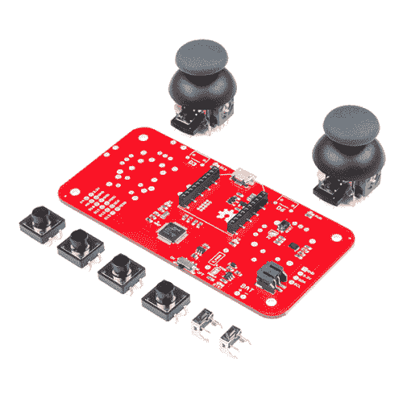

# 无线操纵杆连接指南

> 原文：<https://learn.sparkfun.com/tutorials/wireless-joystick-hookup-guide>

## 介绍

**Heads up!** Originally, this tutorial was written to configure an XBee Series 1 to communicate in transparency mode. However, this can apply to the XBee Series 3 module as long as you configure the firmware to the legacy 802.15.4 protocol. For more information, check out the [Exploring XBees and XCTU](https://learn.sparkfun.com/tutorials/exploring-xbees-and-xctu) tutorial.

[无线操纵杆套件](https://www.sparkfun.com/products/14051)提供了一种简单的方法来控制你的下一个 XBee 项目。在无线操纵杆之前，无线电控制项目使用业余爱好遥控发射器，与用于遥控汽车、船只和飞机的发射器相同。这些发射机的问题是，许多是不可定制的，那些是，往往是太贵了，我们许多人。无线操纵杆旨在为那些希望以自己喜欢的方式而不是被迫的方式控制项目的人带来定制的无线解决方案。

 

将**添加到您的[购物车](https://www.sparkfun.com/cart)中！**

### [SparkFun 无线操纵杆套件](https://www.sparkfun.com/products/14051)

[Only 10 left!](https://learn.sparkfun.com/static/bubbles/ "only 10 left!") KIT-14051

SparkFun 无线操纵杆套件提供了一种简单的方法来控制您的下一个 XBee 项目。在无线操纵杆之前，radi…

$43.952[Favorited Favorite](# "Add to favorites") 30[Wish List](# "Add to wish list")** **[https://www.youtube.com/embed/5mP0DeZ_4fQ/?autohide=1&border=0&wmode=opaque&enablejsapi=1](https://www.youtube.com/embed/5mP0DeZ_4fQ/?autohide=1&border=0&wmode=opaque&enablejsapi=1)

### 推荐阅读

在开始之前，您可能会发现以下链接很有用:

*   [安装 Arduino 库](https://learn.sparkfun.com/tutorials/installing-an-arduino-library)
*   [SAMD21 迷你/开发分线连接指南](https://learn.sparkfun.com/tutorials/samd21-minidev-breakout-hookup-guide)
*   [XBee 购买指南](https://www.sparkfun.com/pages/xbee_guide)
*   [探索 XBees 和 XCTU](https://learn.sparkfun.com/tutorials/exploring-xbees-and-xctu)
*   [串行通信](https://learn.sparkfun.com/tutorials/serial-communication)
*   [I ² C 协议](https://learn.sparkfun.com/tutorials/i2c)
*   [充脂指南](https://learn.sparkfun.com/tutorials/lipo-usb-charger-hookup-guide)

 [### 串行通信](https://learn.sparkfun.com/tutorials/serial-communication) Asynchronous serial communication concepts: packets, signal levels, baud rates, UARTs and more 100 [### 安装 Arduino 库](https://learn.sparkfun.com/tutorials/installing-an-arduino-library) How do I install a custom Arduino library? It's easy! This tutorial will go over how to install an Arduino library using the Arduino Library Manager. For libraries not linked with the Arduino IDE, we will also go over manually installing an Arduino library.[Favorited Favorite](# "Add to favorites") 22 [### I2C](https://learn.sparkfun.com/tutorials/i2c) An introduction to I2C, one of the main embedded communications protocols in use today.[Favorited Favorite](# "Add to favorites") 128 [### LiPo USB 充电器连接指南](https://learn.sparkfun.com/tutorials/lipo-usb-charger-hookup-guide) How to charge your LiPo batteries with the USB LiPo charger. Plus how to modify your charger to set the charge current.[Favorited Favorite](# "Add to favorites") 9 [### 探索 XBees 和 XCTU](https://learn.sparkfun.com/tutorials/exploring-xbees-and-xctu) How to set up an XBee using your computer, the X-CTU software, and an XBee Explorer interface board.[Favorited Favorite](# "Add to favorites") 18 [### SAMD21 迷你/开发分线连接指南](https://learn.sparkfun.com/tutorials/samd21-minidev-breakout-hookup-guide) An introduction to the Atmel ATSAMD21G18 microprocessor and our Mini and Pro R3 breakout boards. Level up your Arduino-skills with the powerful ARM Cortex M0+ processor.[Favorited Favorite](# "Add to favorites") 7

## 套件概述

让我们详细了解一下无线操纵杆套件。该套件包括以下内容:

*   1 -无线操纵杆板
*   2 - [直角触觉按钮](https://www.sparkfun.com/products/10791)
*   2 - [拇指操纵杆](https://www.sparkfun.com/products/9032)
*   4 - [瞬时按钮开关](https://www.sparkfun.com/products/9190)

套件中未提供以下内容，需要单独购买。**