# 算法课程

> 原文：<https://learn.sparkfun.com/tutorials/lessons-in-algorithms>

## 介绍

今年早些时候，SparkFun 的创始人 Nathan Seidle 创建了[众包算法挑战赛](https://www.sparkfun.com/news/2115)(又名速度袋挑战赛)。在众多精彩的参赛作品中，有一个被选中了。获胜者巴里·汉尼根被要求写下他解决这个问题的过程。这篇文章是 Barry Hannigan 解决现实世界问题的成功方法，即使问题并不在你面前。

### 固件资源

您可以通过单击下面的链接查看 Barry 的代码。

[Barry's Speed Bag Challenge GitHub Repo](https://github.com/barryhannigan/SpeedBagChallenge)

* * *

作为 Nate 的速度袋挑战的获胜者，我有一个极好的机会在 SparkFun 位于科罗拉多州博尔德的总部与 Nate 会面。在我们的讨论中，我们认为创建一个教程来描述如何在极短的时间内解决一个复杂的问题是一个好主意。虽然我将讨论这个项目的细节，但我希望你能够将这个思考过程应用到你未来的项目中——无论是大项目还是小项目。

## 从哪里开始

从工程师的角度来看，在成熟的软件项目中，有四个主要阶段:

*   **要求**
*   **设计**
*   **实施**
*   **测试**

让我们面对它；设计和编码是每个人都觉得有趣的事情，他们的创造力可以在这里流淌，大部分乐趣也可以在这里获得。自然地，人们倾向于专注于正在解决的问题的某个方面，并直接跳到设计和编码中。然而，我认为第一个和最后一个阶段可能是任何成功项目中最重要的，无论是大项目还是小项目。如果你怀疑这一点，考虑一下这个:我对速度袋问题的解决方案被设计得非常快，我没有一个袋子来测试它。但是，由于最终应用了正确的修复，功能经过了测试，以验证它产生了正确的结果。相反，一个漂亮的设计和优雅的实现如果不能产生所需的功能，肯定会被认为是失败的。

我没有提到原型是一个阶段，因为根据项目的不同，它可能发生在不同的阶段或多个阶段。例如，如果问题没有被完全理解，原型可以帮助找出需求，或者它可以提供概念证明，或者它可以验证新技术的使用。虽然很重要，但原型设计实际上是一个或多个阶段的活动。

回到速度袋挑战，在这种特殊的情况下，即使它是一个非常小的项目，我建议你在四个领域中的每一个领域花一点时间，否则你很可能会错过一些重要的东西。为了全面了解需要什么，让我们调查一下我们可以作为输入的所有内容。挑战的网络帖子列出了五个明确的要求，你可以在这里找到。接下来，有一个到 [Nate 的 Github 知识库](https://github.com/nseidle/BeatBag)的链接，里面有关于记录数据格式的信息和关于速度袋设备如何工作的简单解释。

在这种情况下，我会将 Nate 在第一个速度包计数器实现中所做的工作归类为原型，以帮助揭示其他需求。从 Nate 关于他如何构建该系统的文章中，我们知道它使用了连接到速度袋底部的加速度计，并且大约每 2 毫秒的振动数据样本将用于计算出拳数。我们现在还知道，应用多项式平滑函数并寻找阈值以上的峰值并不能准确地检测出拳。

虽然对于一个小项目来说，我尽量不要太正式，但在解决问题时，我将这些目标(要求)牢记在心:

*   该算法应能从记录的数据集中产生正确的命中数
*   该解决方案应能在 8 位和 32 位微处理器上运行
*   制作文档并帮助他人从提出的解决方案中学习
*   将代码和文档放在公共存储库或网站中
*   披露针对神秘数据集的打孔计数和解决方案
*   加速度计附在速度袋底座的顶部，除了+Z 向上-Z 向下之外，方向未知
*   复杂的数据模式不仅仅需要多项式滤波；您需要适应输入数据的振幅变化——正如 Nate 所怀疑的，共振很可能是罪魁祸首
*   您有 **15 天**的时间来完成(哎呀！)

## 创建解决方案

所有项目都是如此，现在你知道应该做什么，意识到时间不够了。由于我没有真正的硬件，并且需要能够直观地看到我的算法的输出，我开始在我的 PC 上用 Java 快速地解决它。我内置了一种在屏幕上绘制波形结果的方法。多年来，我一直在使用 NetBeans 进行 Java 开发，所以我开始了一个新的 speed bag 项目。我总是使用 [JFreeChart](http://www.jfree.org/jfreechart/) 库来绘制数据，所以我将它添加到我的项目中。Netbeans 有一个非常好的 IDE 和内置的 GUI 设计器。我所要做的就是创建一个带有空白面板的 GUI 布局，我希望 JFreeChart 显示在其中，然后在运行时创建 JFreeChart 对象并将其添加到面板中。本文中的所有示波器图都是由 JFreeChart 显示器创建的。这是我的快速和肮脏的示波器图形用户界面设计页面的图像。

[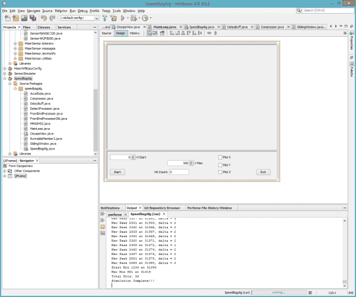](https://cdn.sparkfun.com/assets/learn_tutorials/6/0/4/NetBeansGUIdesigner.png)

这个算法是在紧急情况下需要的，所以我的第一步是非常面向对象，并使用 Java 提供给我的所有快捷方式。然后，当我确定算法序列时，我会让它更像 C 语言。我直接跳了进去，绘制了 X、Y 和 Z 波形，因为它们来自记录的结果。一旦我看到了原始数据，我决定先消除任何偏差(即重力)，然后对每个波形的平方求和并求平方根。我通过对少量值求平均值的方式添加了一些平滑处理，并使用阈值交叉之间的最小时间来帮助过滤尖峰。总而言之，这似乎使图上的数据更加糟糕。我决定扔掉 X 和 Y，因为我不知道它是以什么方向安装的，也不知道它是否会在不同的速度袋平台上安装。让我感到恐怖的是，即使只有 Z 轴，它看起来还是像一团乱麻！我看到数据中的峰值离得太近了。只有我的阈值之间的最短时间门有助于了解打孔计数，但数据中真的没有任何具体的东西。有些事不对劲。我错过了什么？

下面是 runF1 波形的图像。蓝色信号是过滤后的 z 轴，红线是计数出拳的阈值。正如我提到的，如果不是我的 250 毫秒的最低打孔检测间隔，我的计数器将会发疯。请注意，我在我的`runF1()`处理中引入了两个 5 毫秒的延迟，所以如果红线向右移动 10 毫秒，阈值处理会好一点。我将在本文后面更多地讨论信号对齐，但您可以从这幅图中看到信号的时间对齐对于获得准确结果是多么重要。

[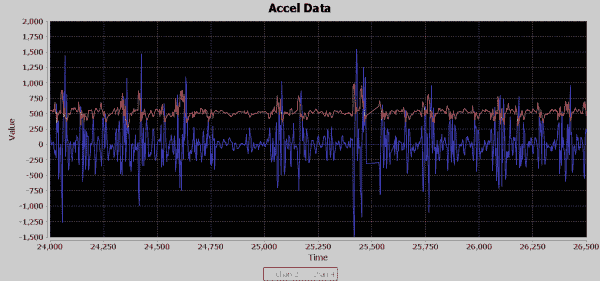](https://cdn.sparkfun.com/assets/learn_tutorials/6/0/4/runF1manyPeaks.png)*The blue signal is the filtered z axis, and the red line is a threshold for counting punches.*

如果观察虚拟示波器输出，可以看到在 25，000 毫秒和 26，000 毫秒之间，即 1 秒钟的时间内，大约有 9 个不同的加速事件。内特不可能一秒钟打九拳。我应该每秒钟看到多少拳？回到绘图板。我需要另一种方法。记住谦逊是你的朋友；如果你趾高气扬地冲进去，你通常会很快被打下来。

## 了解领域

通常，需求是在正在解决的问题领域的上下文中起草的，或者一些设计方面是从应用了领域知识的需求发展而来的。我对拳击速度袋一无所知，所以是时候去谷歌一下了。

我挖掘出的真正的金块是，一个拳击手击中了一个速度袋，它与底部进行了三次接触:一次向前(沿出拳方向)，然后它一路向后(与出拳方向相反)撞击底部，然后它一路向前再次撞击底部(沿出拳方向)。然后拳击手在它返回的路上打了它一拳。这实际上给了四次机会来产生对底部的移动，一次来自拳击手接触袋子的冲击，然后三次与底部的冲击。

现在，我在波形上看到的更有意义。每一拳都不会有一次袋子击中底部的冲击。我的第二个想法是一个拳击手一秒钟能打多少拳。尽管我尽了最大努力，我还是找不到这个问题的直接答案。我发现很多网站都有最大的太极拳出拳数和实际出拳数，但没有速度袋的最大出拳数。是时候得出我自己的结论了:我想了想速度袋每一拳必须移动多远，得出的结论是，必须有一个最小的力才能使速度袋移动三次冲击底部所需的距离。因为我不是拳击手，我所能做的就是想象尽可能慢地击打袋子，让它接触三次。我从脑海中的视频得出结论，每秒钟打不到两次包是很难的。好吧，这是最低限度；最大值怎么样？再次，我召唤我的心灵之眼视频，这一次移动我的拳头打击想象中的袋子。根据袋子移动的距离和拳头进出袋子的时间，我得出的结论是，即使对于一个熟练的拳击手来说，每秒 4 次也是可能的。好，就这么定了。我需要在数据中找到发生在 2 到 4 赫兹之间的事件。是时候回去编码和开发了！

## 构建一点，测试一点，学习很多

虽然每个人的大脑工作方式略有不同，但我建议你尝试一种迭代策略，尤其是当你在解决一个没有明确定义的方法论的问题时。我还建议**当你觉得已经准备好对一个算法进行重大调整时，在开始修改副本**之前制作一个算法的副本，或者从一个空函数开始，开始引入前一次迭代的片段。您可以使用源代码控制来保存您以前的迭代，但是我喜欢在代码中包含以前的迭代，这样我就可以在处理下一个迭代时轻松地引用它。我通常不喜欢写超过 10 或 20 行的代码而不验证它是否符合，但是我真的想运行它并打印出一些东西来证明我的逻辑和假设是正确的。我的整个职业生涯都是这样，如果我没有目标硬件来实际运行我编写的代码，我通常会抱怨。2006 年左右，我从一位前少将那里听到一句话:

### 构建一点，测试一点，学习很多。

*-Wayne Meyers, Rear Admiral, U.S. Navy*

我真的认同这句话，因为它简洁地说明了为什么我总是想继续运行并测试我所写的东西。它要么让你确认你的假设，要么揭示你正走在错误的道路上，让你迅速走上正确的道路，而不会丢掉很多工作。这是我选择 Java 作为我的原型平台的另一个原因，因为我可以快速地开始运行和测试代码，并可视化地绘制出它，尽管没有实际的速度包硬件。

此外，您将看到在所有六个`runFx()`函数的中间有一段代码，它以毫秒为单位跟踪当前时间，并验证以毫秒为单位的时间戳增量是否已经过去，或者它是否休眠了 1 毫秒。这允许我在 Java 绘图窗口中观察数据滚动，并查看过滤输出的效果。我传入了 X，Y 和 Z 的加速度数据以及 X，Y 和 Z 的平均值。由于我在大多数算法中只使用了 Z 数据，所以我开始作弊并发送其他值来绘制，所以当查看 1 到 5 的图表时会有点混乱，因为它们与图例不匹配。然而，实时绘图使我能够看到数据并观察计数器的增量。我实际上可以看到并感受到出拳的节奏，以及加速度数据如何受到持续恒定节奏的共振的影响。除了使用 Java `System.out.println()`函数进行可视化输出之外，我还可以将数据输出到 NetBeans IDE 的一个窗口中。

如果你在我的 GitHub 库的 Java 子目录中查找，有一个名为 MainLoop.java[的文件。在那个文件中，我有几个名为`run1()`到`run6()`的函数。这些是我的速度袋算法代码的六次主要迭代。](https://github.com/barryhannigan/SpeedBagChallenge/blob/master/Java/SpeedBagAlg/src/speedbagalg/MainLoop.java)

以下是六个迭代中每个迭代的一些亮点。

### 运行 F1

[runF1()](https://github.com/barryhannigan/SpeedBagChallenge/blob/master/Java/SpeedBagAlg/src/speedbagalg/MainLoop.java#L808) 仅使用 Z 轴，并使用滑动窗口和过滤后的 Z 数据的固定放大来进行弱偏差消除。我创建了一个名为 delay 的元素，这是一种延迟输入数据的方法，以便它可以在以后与平均结果的输出保持一致。这允许基于周围的值从 Z 轴数据中减去滑动窗口平均值，而不是先前的值。穿孔检测使用大于五个样本平均值的放大的过滤器数据的直接比较，检测之间的最小间隔为 250 毫秒。

### runF2

[runF2()](https://github.com/barryhannigan/SpeedBagChallenge/blob/master/Java/SpeedBagAlg/src/speedbagalg/MainLoop.java#L667) 仅使用 Z 轴，并通过滑动窗口采用弱偏置消除，但基于检测到最后一次击打时消除的偏置之上的平均振幅，添加了经滤波的 Z 数据的动态β放大。此外，基于自检测到最后一次打孔以来的时间增量，计算 225 毫秒至 270 毫秒的打孔之间的动态最小时间。我称之为去除噪底的偏差量。我添加了一个按钮来停止和恢复模拟，这样我就可以检查调试输出和波形。这让我看到了模拟过程中使用的β放大。

### 运行 F3

[runF3()](https://github.com/barryhannigan/SpeedBagChallenge/blob/master/Java/SpeedBagAlg/src/speedbagalg/MainLoop.java#L483) 使用了 X 轴和 Z 轴数据。我的理论是，击打动作可能会产生晃动，这可以添加到 Z 轴数据中，以帮助精确定位实际的击打。它与 RunF2 基本上是相同的算法，但是在 X 轴上增加了。它实际上工作得很好，我想我可能会通过关联 X 运动和 z 运动找到一些东西，我尝试了各种调整和旋转，正如你在代码中看到的许多注释掉的实验。我开始摆弄我称之为压缩器的东西，它取了五个样本的总和，看看它是否能检测出拳时周围的能量束。我没有在算法中使用它，而是打印出它越过阈值的次数，以查看它是否有可能作为过滤元素。最后，这个算法开始自我崩溃，是时候吸取我学到的知识，开始一个新的算法了。

### 运行 F4

在 [runF4()](https://github.com/barryhannigan/SpeedBagChallenge/blob/master/Java/SpeedBagAlg/src/speedbagalg/MainLoop.java#L483) 中，我将偏差移除平均值增加到 50 个样本。它开始与定点 LSB 一起工作于衰减和样本压缩，以保持整数衰减数据的小数精度。因为要求之一是它应该能够在 8 位微控制器上运行，所以我希望在最终的 C/C++代码中避免使用浮点和耗时的数学函数。我将在组件部分对此进行更多的讨论，但是现在，请注意我已经开始在。我已经说服自己去寻找加速度的爆发。在这一点上，我消除了 Z 轴和 X 轴的偏差，然后求平方。然后我衰减每一个，把结果加在一起，但是把 X 轴值放大 10 倍。我添加了第二阶段的平均 11 个过滤值，开始平滑加速度的爆发。接下来，当平滑值超过固定阈值 100 时，Z 和 X 平方的非平滑组合开始载入压缩器，直到添加了 100 个样本。如果 100 个样本的压缩器输出大于 5000，则记录为命中。采用了可变的打孔间隔时间门，但是它要小得多，因为压缩器使用 100 个样本来封装打孔检测。这将门控时间降低到 125 到 275 毫秒之间。虽然显示出一些希望，但还是太敏感了。而一个数据集将被定位在另一个数据集上将偏离 10 次或更多次。经过多次调整和实验后，这个算法开始内爆，又一次是时候带着我学到的东西重新开始了。我应该提到，现在我开始认为这个问题可能没有令人满意的解决方案。当拳击手进入良好的节奏时，似乎与袋子接触不同相的共振似乎会对加速度造成严重破坏。这一切可能只是浪费时间吗？

### 运行 F5

[run F5()](https://github.com/barryhannigan/SpeedBagChallenge/blob/master/Java/SpeedBagAlg/src/speedbagalg/MainLoop.java#L141)算法的出发点是，需要引入一个更正规的高通滤波器，而不是从信号中减去平均值。高通滤波器的基本前提是使用 99%的新样本值加上 1%的平均值。在 runF5 发展的末期，增加了一个重要的概念，试图通过将处理的第一阶段移至其自己的文件中，以将其与后面的阶段隔离开来，从而简化算法。分而治之；它已经存在很久了，而且一次又一次地被证明是正确的。我尝试了很多实验，你可以从算法和 FrontEndProcessorOld.java 文件中的很多注释行中看到。最后，是时候推进新的前端处理器概念，重新开始分而治之，需要更正式的高通滤波器。

### 运行 F6

随着时间的流逝，是时候将到目前为止所学的知识整合在一起，准备好 Java 代码以移植到 C/C++并实现真正的过滤器，而不是使用移动平均值。在 [runF6()](https://github.com/barryhannigan/SpeedBagChallenge/blob/master/Java/SpeedBagAlg/src/speedbagalg/MainLoop.java#L72) 中，我总结出一个理论，即我需要用一个高通滤波器滤除前端的偏置，然后尝试对剩余信号使用一个低通滤波器，以找到频率为 2 至 4 赫兹的加速度突发。在截止日期前剩下的少量时间里，我不可能学会如何计算自己的滤波器抽头值来实现高通和低通滤波器。幸运的是，我发现了 [t-filter 网站](http://t-filter.engineerjs.com/)。谈谈三网融合。我不仅能够输入我的参数并获得过滤器抽头值，还能够利用它在我的 Java 代码中稍加调整后生成的 C 代码。此外，它还为我将抽头值转换为固定点！该算法的最终版本完全采用分治概念，为前端处理器和检测处理引入了独立的子算法。这使我能够将两个功能相互隔离，除了一个的输出信号成为另一个的输入，这使我能够轻松地专注于手头的任务，而不是筛选一大组变量，其中一些变量可能在两个阶段之间共享。

有了这种分工，现在就可以轻松地专注于前端处理器的明确任务，即消除偏置值，并以易于接受的水平输出，以便输入到检测处理器中。现在，检测处理器可以明确地专注于过滤和实现状态机，该状态机可以挑选出每秒应该发生 2 到 4 次的打孔事件。

需要注意的一点是，这个最终算法比之前的一些算法要小得多，也简单得多。即使是软件，在这个过程的某个点上，你仍然应该做一个叫做 [Muntzing](https://en.wikipedia.org/wiki/Muntzing) 的技术。Muntzing 是一种回过头来看看在不破坏功能的情况下可以删除哪些内容的技术。每删除一行代码，就少了一行可能有 bug 的代码。你可以谷歌一下[伯爵“疯子”蒙茨](https://en.wikipedia.org/wiki/Madman_Muntz)来更好的了解和感受蒙茨的精神。

*Final output of DET*

上面是 runF6 的可视化输出。绿线是低通滤波器输出的 45 个延迟样本，黄线是低通滤波器输出的 99 个值的平均值。检测处理器包括检测算法，该检测算法通过使用黄色信号作为动态阈值的模板跟踪绿色信号的最小和最大交叉来检测出拳。每个最小值是一个红色尖峰，每个最大值是一个蓝色尖峰，这也是一个打孔检测。时间刻度以毫秒为单位。请注意，在预测的 2 至 4Hz 范围内，每秒大约有三个蓝色尖峰。剩下的就是历史了！

## 算法组件

下面是我在各种算法中使用的每种组件的简要介绍。

### 耽搁

这是用来缓冲一个信号，这样你就可以将它与其他操作时间对齐。例如，如果您对九个样本求平均值，并且想要从原始信号中减去平均值，您可以使用原始信号的五个样本的延迟，这样您就可以使用本身加上之前的四个样本和之后的四个样本的值。

### 减少的

衰减是一种简单但有用的操作，它可以在以某种方式放大信号之前，通过滤波或其他增加信号增益的操作来缩小信号。衰减通常以分贝(dB)为单位。根据您的应用，您可以衰减功率或振幅。如果将幅度减半，则降低幅度为-6 dB。如果您想通过其他 dB 值进行衰减，您可以在此处检查 dB 标度[。由于它与 Speedbag 算法有关，我基本上是在信号中创建清晰的间隙，例如抑制或挤压更接近零的较小值，以便平方值后可以真正将峰值推高，但不会对向下推至零的值产生太大影响。我用这种技术来帮助突出加速的爆发和速度袋平台的背景振动。](https://en.wikipedia.org/wiki/Decibel)

### 滑动窗口平均值

滑动窗口平均是一种在给定样本窗口内计算输入信号连续平均值的技术。要平均的样本数称为窗口大小。我喜欢实现滑动窗口的方式是保存样本的运行总数和一个环形缓冲区来跟踪值。一旦环形缓冲区已满，最旧的值将被移除并用下一个传入的值替换，并且从新值中减去从环形缓冲区移除的值。该结果被添加到运行记录中。然后，只要将运行总数除以窗口大小，就可以在需要时得到当前的平均值。

### 整流

这是一个非常简单的概念，即将数值的符号改为全正或全负，因此它们是相加的。在这种情况下，我使用了整流将所有值更改为正值。与整流一样，可以使用全波或半波方法。通过使用返回正值的`abs()`数学函数，您可以轻松地进行全波运算。您可以对值求平方以使其变为正值，但您改变的是振幅。一个简单整流器可以将它们变成正的，而没有任何其他影响。要执行半波整流，您可以将任何小于零的值设置为零。

### 压缩

在 DSP 领域，压缩通常被定义为压缩幅度，使其保持在一个接近的范围内。我这里的压缩技术是对样本窗口中的值求和。这是一种向下采样的形式，因为每次窗口被填满时，你只能得到一个样本，但是没有任何值被丢弃。它是窗口的纯总和，或者可选地是窗口的平均值。这在一些算法中被采用，以试图识别来自安静时间的加速爆发。我实际上并没有在最终的算法中使用它。

### 红外滤光器

有限脉冲响应(FIR)是一种数字滤波器，通过多个抽头实现，每个抽头都有指定的多项式系数。抽头的数量称为滤波器的阶数。FIR 的一个优点是它不使用任何反馈，因此任何舍入误差都不会累积，也不会随着时间的推移而变大。有限脉冲响应简单地说就是，如果输入一个由 1 和全 0 组成的样本流，滤波器的输出将在最多+1 阶 0 值样本内变为零。所以，对一个人的单个样本的反应在有限数量的样本中存在，然后消失。这基本上是通过不使用任何反馈来实现的。我看过 DSP 文章，声称计算滤波器抽头大小和系数很简单，但对我来说并非如此。我最终找到了一款名为 [tFilter](http://t-filter.engineerjs.com/) 的在线应用，它为我节省了很多时间，也减轻了我的负担。选择滤波器类型(低、高、带通、带阻等)，然后设置输入数据的频率范围和采样频率。你甚至可以选择你的系数在定点产生，以避免使用浮点数学。如果您不确定如何使用定点或者从未听说过它，我将在嵌入式优化技术一节中讨论它。

## 嵌入式优化技术

### 数量平方

Mag Square 是一种可以节省计算平方根的计算能力的技术。例如，如果你想计算 X 和 Z 轴的向量，通常你可以这样做:val = sqr((X * X) + (Y * Y))。但是，您可以简单地将值留在(X * X) + (Y * Y)中，除非您确实需要精确的向量值，Mag Square 会为您提供一个与后续样本上计算的其他向量相比的可用比率。这些数字会大得多，您可能希望使用衰减来使它们变小，以避免下游额外计算的溢出。

我在最终的算法中使用了这种技术来帮助强调背景振动中的加速度爆发。我在计算中只使用了 Z * Z，但随后我将所有值衰减了一半或-6dB，使它们回到合理的水平，以便进一步处理。例如，去除偏差后，如果我有大约 2 个样本，然后有大约 10 个样本，当我平方这些值时，我现在有 4 和 100，比率为 25:1。现在，如果我衰减 0.5，我得到 2 和 50，仍然是 25 比 1，但现在要处理的数字更小了。

### 不动点

使用定点数是扩展性能的另一种方式，尤其是在微控制器上。定点基本上是整数数学，但它可以通过所有整数中特定位位置的隐含固定小数点来保持精度。对于我的 FIR 滤波器，我指示 tFilter 以 16 位定点值生成多项式值。我这样做的动机是确保我不使用超过 32 位的整数，这将特别损害 8 位微控制器的性能。

与其深入 FIR 滤波器代码来解释定点是如何工作的，不如让我先用一个简单的例子。虽然 FIR 滤波器算法使用许多多项式进行复杂滤波，但我们可以实现一个简单的滤波器，输出相同的输入信号，但幅度下降-6dB 或减半。用浮点术语来说，这是一个简单的单抽头滤波器，将每个输入样本乘以 0.5。要以 16 位精度在定点中实现这一点，我们需要将 0.5 转换为其 16 位定点表示。值 1.0 由 1 * (2^16)或 65，536 表示。任何小于 65536 的值都小于 1。要创建 0.5 的定点整数，我们只需使用相同的公式 0.5 * (2^16)，它等于 32，768。现在，我们可以使用该值将每个样本输入的幅度降低 0.5 倍。例如，假设我们在简单的滤波器中输入一个值为 10 的样本。过滤器将计算 10 * 32768 = 327，680，这是定点表示。如果我们在计算完成后不再关心保持精度，只需通过右移所用精度的位数，就可以很容易地将其转换回非定点整数。于是，327680 >> 16 = 5。可以看到，我们的滤波器将 10 变为 5，这当然是我们想要的一半或-6dB。我知道 0.5 非常简单，但如果你想要 1/8 的幅度，同样的过程将被使用，65536 * .125 = 8192。如果我们输入样本 16，那么 16 * 8192 = 131072，现在把它改回整数 131072 >> 16 = 2。为了演示当返回到整数时精度会如何损失(与从浮点到整数相同)，如果我们将 10 输入到 1/8 滤波器中，它会产生以下结果，10 * 8192 = 81920，然后返回到整数将是 81920 >> 16 = 1，注意在定点表示中它是 1.25。

回到 FIR 滤波器，我选择了 16 位精度，因此我可以获得相当高的精度，但要与合理数量的整数相平衡。通常，带符号的 32 位整数的范围可以是- 2，147，483，648 到+2，147，483，647，但是现在只允许 16 位整数，范围是-32，768 到+32，767。因为你现在被限制在你能使用的数字范围内，你需要认识到被输入的值。如果您查看 FEPFilter_get 函数，您会看到有一个累加器变量 accZ，它对每个抽头的值求和。通常，如果您的抽头历史值是 32 位，您可以将累加器设为 64 位，以确保您可以保存所有抽头值的总和。但是，如果确保输入值都小于某个最大值，则可以使用 32 位值。计算最大输入值的一种方法是将系数的绝对值相加，然后除以定点方案的最大整数部分。就 FEP FIR 滤波器而言，系数之和为 131646，因此，如果数字可以是 15 位正整数+ 16 位小数，我可以使用公式(2^31)/131646 给出的 FEP 最大输入值为+或-16312。在这种情况下，可以实现另一种优化，即不让微控制器进行 64 位计算。

## 走信号处理链

### 滤波引起的延迟

在讨论处理链之前，我们应该讨论一下滤波引起的延迟。许多类型的滤波会给正在处理的信号增加延迟。如果你做了很多滤波工作，你可能很清楚这个事实，但是，如果你对滤波信号不是很有经验，这是你应该知道的。我说的延迟是什么意思？这简单地意味着，如果我输入一个值 X，得到一个值 Y，X 的最大影响在 Y 中出现的时间就是延迟。对于 FIR 滤波器，可以通过滤波器的脉冲响应图轻松看出，如果您还记得我对 FIR 滤波器的描述，它是一个插入单个 1 的 0 流。T-Filter 显示脉冲响应，因此您可以看到 X 如何影响 Y 的输出。下面是取自 [T-Filter](http://t-filter.engineerjs.com/) 网站的 FEP 高通滤波器脉冲响应图像。请注意，在图像中，对 X 的最大影响正好在中间，滤波器中的每个抽头都有一个点。

[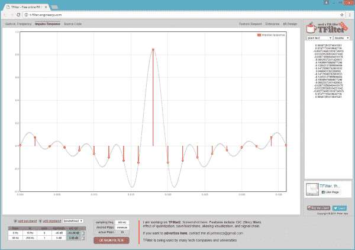](https://cdn.sparkfun.com/assets/learn_tutorials/6/0/4/TFilter-ImpluseResponse.png)

下面是几个 FEP 高通滤波器信号的示意图。红色信号是加速度计的输入或进入滤波器的最新样本，蓝色信号是滤波器环形缓冲区中最早的样本。FIR 滤波器中有 19 个抽头，因此它们代表滤波器窗口中第一个和最后一个样本的图形。绿色信号是高通滤波器输出的值。与上面的 X 和 Y 类比相关，红色信号为 X，绿色信号为 Y，蓝色信号相对于红色输入信号延迟 36 毫秒，红色输入信号在 2 毫秒时有 18 个样本，这是滤波器工作的数据窗口，也是 X 影响 Y 的有限时间。

[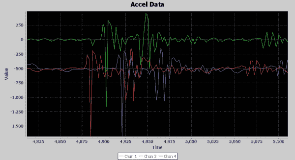](https://cdn.sparkfun.com/assets/learn_tutorials/6/0/4/DelayedSignalExample.png)

请注意，高通滤波器的输出(绿色信号)似乎以 18 毫秒的延迟跟踪输入的变化，即 9 个样本，每个样本 2 毫秒。因此，输入信号的最大影响出现在滤波器窗口的中间，这也与脉冲响应图相吻合，其中 1 值输入的最强影响出现在滤波器窗口的中心。

增加延迟的不仅仅是 FIR。通常，对样本窗口进行的任何滤波都会导致延迟，通常延迟时间是窗口长度的一半。根据您的应用，在您的设计中可能需要考虑这种延迟，也可能不需要。然而，如果要将此信号与另一个未经滤波或滤波程度较低的信号对齐，就必须考虑这一点，并使用延迟元件来对齐。

### 前端处理器

我已经详细讨论了如何获得最终解决方案以及组成该解决方案的所有组件，现在让我们来看看处理链，看看信号是如何转换成显示出拳的信号的。FEP 的主要目标是消除偏差，并产生一个输出信号，该信号在加速脉冲串上产生一个波，该波在加速期间振幅较高，在加速较慢时振幅较低。FEP 有四个串联组件:高通 FIR、衰减器、整流器和通过滑动窗口平均的平滑。

第一幅图像是高通 FIR 的输入和输出。因为它们被偏置量抵消，所以不会重叠太多。红色信号是加速度计的输入，蓝色信号是 FIR 的输出。请注意，重力引起的 1g 加速度被移除，信号中较慢的变化被滤除。如果在 24，750 到 25，000 毫秒之间，可以看到蓝色信号更像一条直线，上面有尖峰和轻微的振铃，而原始输入有这些尖峰，但在一些缓慢的纹波上蜿蜒。

[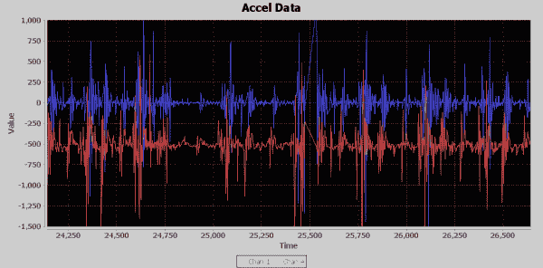](https://cdn.sparkfun.com/assets/learn_tutorials/6/0/4/FEP-HighPass-InOut.png)

接下来是衰减器的输出。虽然该组件对整个信号起作用，但它会降低信号的峰值，但其最重要的作用是将信号中较安静的部分压缩至接近零值。下图显示了衰减器的输出，输入是高通 FIR 的输出。正如预期的那样，峰值要低得多，但安静时间也是如此。这让我们更容易看到加速度的爆发。

[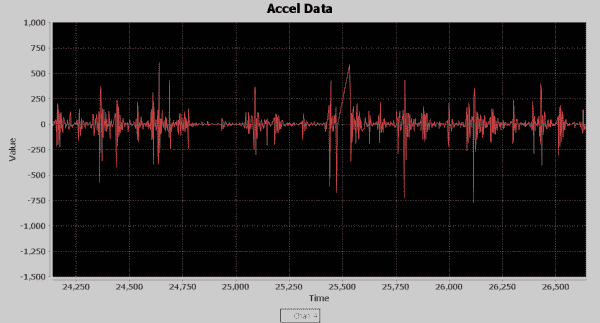](https://cdn.sparkfun.com/assets/learn_tutorials/6/0/4/FEP-Atten-Out.png)

接下来是整流器元件。它的作用是把所有的加速能量都转向正的方向，这样它就可以用于求平均值了。例如，加速度导致 1000 的正尖峰，然后是 990 的负尖峰，这将产生 5 的平均值，而 1000 之后是 990 的正尖峰，这将产生 995 的平均值，这是一个巨大的差异。下面是整流器输出的图像。加速度的爆发在视觉上更加明显，但不容易辨别。事实上，这张图片准确地显示了为什么这个问题如此难以解决；您可以清楚地看到，在增加冲击能量的过程中，底座的共振振动是如何导致图案发生变化的。左侧是较低且较频繁的峰值，右侧是较高但不太频繁的峰值。

[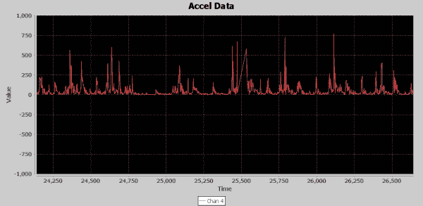](https://cdn.sparkfun.com/assets/learn_tutorials/6/0/4/FEP-RectifierOut.png)

49 值滑动窗口是 FEP 的最后一步。虽然我们对信号做了细微的改变，但并没有完全使打孔在图像中突出，这一最后阶段使信号在视觉上明显地产生了隐藏的打孔信息。之前信号处理的成果在这个阶段神奇地显现出来。下面是滑动窗口平均值的图像。蓝色信号是其输入或整流器的输出，红色信号是滑动窗口的输出。红色信号也是 FEP 处理阶段的最终输出。因为它是一个窗口，所以有一个相关的延迟。平均大约 22 个样本或 44 毫秒。情况并非总是如此，因为有时输入信号尖峰突然变高，随后振铃变小。其他时候，一些小尖峰会导致高尖峰，这使得滑动窗口平均输出基于输出峰值出现的位置而在其延迟中显得不一致。虽然这些凸起很小，但它们现在代表了由于撞击而引入的新的加速能量。

[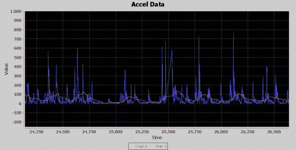](https://cdn.sparkfun.com/assets/learn_tutorials/6/0/4/FEP-FinalOut.png)

### 检测处理器

现在是时候转移到检测处理器(DET)了。FEP 输出一个信号，开始显示加速脉冲发生的位置。DET 的工作将是增强这种信号，并采用一种算法来检测出拳的位置。

DET 的第一级是衰减器。最后，我想给信号增加指数增益，以便真正拉高峰值，但在此之前，必须再次将较低值压缩至零，并降低峰值，以免产生过大的值，无法在 DET 链的其余部分进行处理。下面是衰减器级的输出图像，它看起来就像 FEP 的信号输出，但是请注意，FEP 的信号电平峰值超过 100，现在峰值勉强超过 50。垂直刻度放大，最大振幅设定为 500，因此您可以看到有一个带有打孔信息的可行信号。

[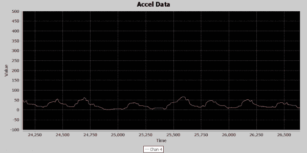](https://cdn.sparkfun.com/assets/learn_tutorials/6/0/4/DET-Atten-Out.png)

随着信号的充分衰减，是时候创造奇迹了。幅度平方函数是所有这些集合在一起的地方。减弱的信号携带着微小的种子，我将从这些种子中长出参天红杉。下图是 mag square 输出，红色信号是衰减输入，蓝色信号是 Mag Square 输出。我不得不缩小到 3000 倍最大垂直距离，正如你所看到的，输入信号看起来几乎是平的，但 mag square 能够拉出明确无误的峰值，这将有助于检测算法挑选出拳。你可能会问为什么不直接用这些巨大的峰值来检测出拳。我选择信号的这一区域进行分析的原因之一是向您展示加速度的变化是如何巨大的，因为您可以看到 25，000 和 25，250 之间的峰值比周围的峰值小得多，这使得纯粹的阈值处理变得非常困难。

[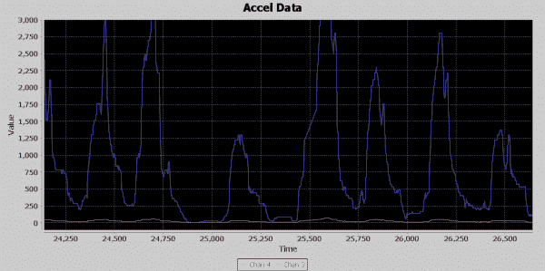](https://cdn.sparkfun.com/assets/learn_tutorials/6/0/4/DET-MagSqr-InOut.png)

接下来，我决定放置一个低通滤波器，试图消除信号中任何快速变化的部分，因为我要寻找的是发生在 2 至 4 Hz 范围内的事件。T-Filter 很难创建一个 0 至 5 Hz 带通的紧密低通滤波器，因为它产生的滤波器具有超过 100 个抽头，我不想让处理受到影响，更不用说我还需要一个 64 位累加器来保存总和。我放宽了 0 到 19 赫兹范围的带通，以及 100 到 250 赫兹的带阻。下图是低通滤波器的输出。蓝色信号是输入，红色信号是延迟输出。我使用这个图像，因为它允许输入和输出信号可以看到，而不会相互干扰。延迟是由低通 FIR 的 6 个样本延迟引起的，但我也为此信号引入了 49 个样本延迟，以便它对准处理链中后续的 99 个样本滑动窗口平均值的中心。因此它总共延迟了 55 个样本或 110 毫秒。在此图像中，您可以看到慢速峰值因其高度而略微放大，以及随着快速变化元素的衰减而变得平滑。这里发生的不多，但信号更干净，Earl Muntz 可能会建议我将低通滤波器从电路中去掉，没有它也可以很好地工作。

[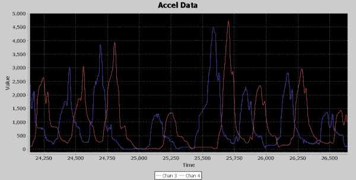](https://cdn.sparkfun.com/assets/learn_tutorials/6/0/4/DET-LowPass-InOutDelayed.png)

信号处理的最后一级是 99 个样本的滑动窗口平均。我在滑动窗口平均值中内置了每次添加新值时在窗口中间返回样本的能力，这就是我在之前的图像中产生 49 个样本延迟信号的方式。这很重要，因为检测算法将有 2 个并行信号传入，99 个滑动窗口平均值的输出和 49 个样本延迟输入到滑动窗口平均值。这将在滑动窗口平均值的中间完美地对准未平均的信号。平均信号被用作检测算法的动态阈值，以用于其检测处理。这又是 DET 最终输出的图像。

在图像中，绿色和黄色信号是检测算法的输入，蓝色和红色信号是输出。如图所示，绿色信号延迟了 49 个样本，与黄色的 99 个滑动窗口平均峰值完全对齐。检测算法监控绿灯信号与黄灯的交叉。这是通过最大和最小启动保护状态来实现的，该状态验证信号相对于黄色信号已经在最小或最大方向上移动了足够的距离，然后切换到一个状态，该状态监控绿色信号在方向上的足够变化，以宣布最大或最小。当峰值开始出现且距离上次检测到峰值至少 260 毫秒时，状态切换到监控绿色信号中的新峰值，并在图像中显示蓝色尖峰。这是记录打孔计数的时间。一旦检测到新的峰值，状态改变以寻找新的最小值的开始。现在，如果绿色信号比黄色信号低 50 度，状态就会改变，寻找绿色信号的新最小值。一旦绿色信号最小值被宣布，状态改变为开始寻找绿色信号的新峰值的开始，并且当这发生时，在图像上显示红色尖峰。

同样，我在记录的数据中选择了这个时间，因为它显示了即使在峰值振幅大幅波动的情况下，算法也可以跟踪出拳。有趣的是，如果您查看 24，750 到 25，000 时间帧，可以看到红色尖峰检测到一个最小值，这是因为绿色信号上方有一个小尖峰，这意味着状态机开始在该点寻找下一个峰值起点。然而，绿色信号从未穿过黄线，因此峰值状态的开始将信号一路骑到地板上，并等到刚好在 25，250 点之前穿过黄线，以宣布下一次峰值的开始。此外，在 25，250 标记处的峰比周围的峰低得多，但是仍然容易检测到。因此，可以说，动态阈值和状态机逻辑允许速度袋打孔检测器算法“随拳移动”。

## 最后的想法

总而言之，我们已经在本文中涉及了很多内容。第一，充分理解问题的重要性，因为它与所需的最终产品以及达到该目标所需的领域知识相关。其次，对于这种性质的问题，创建一个脚手架环境来构建算法是必不可少的，在这种情况下，它是带有可视信号显示的 Java 原型。第三，针对目标环境实施，在 PC 上，您可以为具有大量高速缓存的强大 CPU 提供出色的优化编译器，而对于微控制器，优化工作则完全由您来完成。使用你所知道的每一个优化技巧来尽可能快地进行处理。第四，迭代开发可以帮助你解决这样的问题。在开发过程中，将你所学的知识融入到问题中，同时不断修改问题。

当我回顾这个项目并思考最终是什么让我成功的时候，我可以想到两件主要的事情。为工作创造合适的工具是非常宝贵的。能够看到我的处理组件如何影响信号真的是非常宝贵的。不仅绘制输出信号，而且实时绘制输出信号，让我能够完全理解产生的加速度。就好像内特在角落里打沙袋，而我看着波形在我的屏幕上滚动。然而，最大的因素是意识到最终我在寻找每秒发生 2 到 4 次的事情。我抓住了这一点，并不懈地探索如何将原始输入信号转换成能够显示这些事件的东西。我没有办法去谷歌找到答案。记住，知识并不是真的来自书本，而是被记录在书本里。首先，有人不得不脱离剧本，发现一些东西，然后它就变成了知识。运用你所拥有的和能找到的知识，但是不要害怕运用你的想象力去尝试以前没有尝试过的东西，去解决一个没有解决的问题。所以在未来记住，比喻当你走到铺好的路的尽头。你会回头寻找一条已经铺好的路，还是会锁定枢纽，继续前进，做出自己的发现。我不能谷歌如何用加速度计计算出拳数，但现在有人可以了。

* * *

更多有趣的信息，请查看其他精彩的 SparkFun 文章。

 [### 连接器基础](https://learn.sparkfun.com/tutorials/connector-basics) Connectors are a major source of confusion for people just beginning electronics. The number of different options, terms, and names of connectors can make selecting one, or finding the one you need, daunting. This article will help you get a jump on the world of connectors.[Favorited Favorite](# "Add to favorites") 62 [### 发光二极管是如何制造的](https://learn.sparkfun.com/tutorials/how-leds-are-made) We take a tour of a LED manufacturer and learn how PTH 5mm LEDs are made for SparkFun.[Favorited Favorite](# "Add to favorites") 18 [### 拆卸:DDC Mobile X900](https://learn.sparkfun.com/tutorials/teardown-ddc-mobile-x900) Nate picked up a bricktastic phone in China. Let's take it apart!! 3 [### 使 LilyPad 开发板项目适应 LilyPad ProtoSnap Plus](https://learn.sparkfun.com/tutorials/adapting-lilypad-development-board-projects-to-the-lilypad-protosnap-plus) An overview of the updates made in the redesign of the LilyPad Development Board to the LilyPad ProtoSnap Plus and how to adapt code written for the old board to the new one.[Favorited Favorite](# "Add to favorites") 0