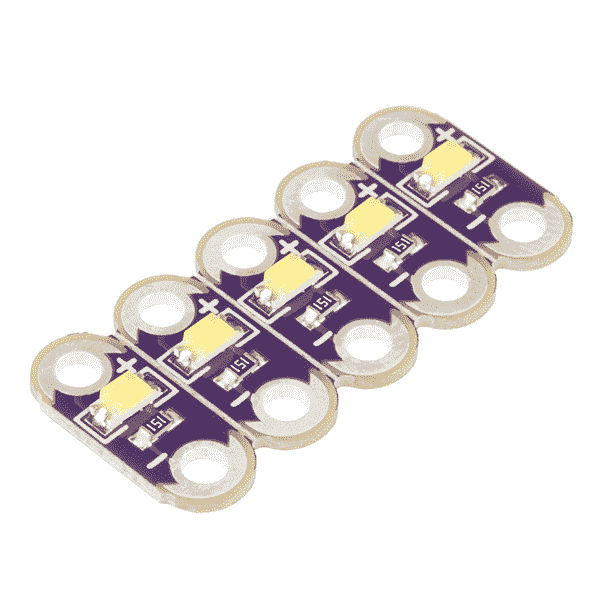
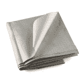
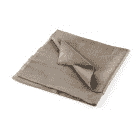

# 为 LilyPad LED 项目供电

> 原文：<https://learn.sparkfun.com/tutorials/powering-lilypad-led-projects>

## 介绍

开始使用电子纺织品时，最常见的问题之一是“我可以在我的项目中放多少个 led？”在本指南中，我们将介绍导电线的电阻及其对 led 供电的影响，预测电池和电源需求的计算，以及一些施工技巧。

### 推荐阅读

如果您对以下任何主题不熟悉，我们建议您在继续之前查看相应的教程。

*   [电压、电流、电阻和欧姆定律](https://learn.sparkfun.com/tutorials/voltage-current-resistance-and-ohms-law)
*   [如何使用万用表](https://learn.sparkfun.com/tutorials/how-to-use-a-multimeter)
*   [发光二极管](https://learn.sparkfun.com/tutorials/light-emitting-diodes-leds)
*   [短路](https://learn.sparkfun.com/tutorials/what-is-a-circuit/short-and-open-circuits)
*   [电池技术](https://learn.sparkfun.com/tutorials/battery-technologies)

如果这是您第一次使用电子纺织品，我们建议您从本教程开始:

 [### LilyPad 基础:电子缝纫

#### 2016 . 12 . 17](https://learn.sparkfun.com/tutorials/lilypad-basics-e-sewing) Learn how to use conductive thread with LilyPad components.[Favorited Favorite](# "Add to favorites") 16

## 导电线电阻

在构建可穿戴项目时，需要考虑的最重要的一点是导电线的电阻。与电阻很小的铜线不同，导电线的电阻会根据制造线的金属和线的厚度而变化。大多数导电线以欧姆/英尺为单位列出电阻。这个数字越低越好，因为电阻越小意味着更多的电可以通过你的项目中使用的组件。

基本电气特性[欧姆定律](https://learn.sparkfun.com/tutorials/voltage-current-resistance-and-ohms-law#ohms-law)指出，电流通过高电阻材料会导致电压下降。电流越大，电压降越大。这意味着，即使为你的 LilyPad 供电的[脂电池](https://www.sparkfun.com/products/13112)可能会输出 3.7 伏，但当它通过线到达你的组件时，它可能会降至 3.0 伏或更低。

许多电子元件，如发光二极管，需要一定的电压才能正常工作。例如，在使用 LilyPad LEDs 的项目中，如果电压降至 3 伏以下，蓝色 LED 将停止工作，然后是绿色，最后是红色。为了从像 [LilyPad RGB LED 板](https://www.sparkfun.com/products/8467)这样的 RGB LED 获得全彩色输出，您应该始终尝试在 3 伏或更高的电压下运行。

To figure out an LED's voltage needs, you can take a look at the **forward voltage** section of the LED's datasheet. Check out [this tutorial](https://learn.sparkfun.com/tutorials/light-emitting-diodes-leds?_ga=1.116596098.585794747.1436382744#get-the-details) for more detailed instructions on how to read an LED's datasheet.

### LilyPad LEDs 的正向电压

| LilyPad LED | 正向电压 |
| 蓝色 | 3.2 伏 |
| 格林（姓氏）；绿色的 | 3.2 伏 |
| 粉红色 | 2.5 伏 |
| *紫色(已退役)* | *2.8 伏* |
| 红色 | 2.0 伏 |
| 怀特（姓氏） | 3.3 伏 |
| 黄色 | 2.0 伏 |

### LilyPad RGB LEDs 的正向电压:

| LilyPad LED | 红色 LED 正向电压 | 绿色 LED 正向电压 | 蓝色 LED 正向电压 |
| LilyPad 三色 LED | 2.0 伏 | 3.5 伏 | 3.5 伏 |
| LilyPad 像素板 | 2.2 伏 | 3.4 伏 | 3.4 伏 |

为了最小化电压降，我们需要降低电源连接的电阻。有几种方法可以做到这一点:

*   **尽可能缩短电源连接的长度**。因为阻力随着长度增加，如果你减少长度，你就会减少阻力。

*   **减少线本身的阻力**。较粗的线比较细的线具有较低的阻力，一次使用多股线可以进一步降低阻力。

**TIP:**
Use a non conductive thread to stitch bundled thread (either placed together or braided) to your base fabric. Leave enough open spaces in the stitching so you are able to stitch conductive thread to the larger thread bundle when connecting components. This video from e-textile expert Lynne Bruning shows this technique at around the 4:10 mark:

[https://www.youtube.com/embed/G33nkPVcZRA?t=4m9s/?autohide=1&border=0&wmode=opaque&enablejsapi=1](https://www.youtube.com/embed/G33nkPVcZRA?t=4m9s/?autohide=1&border=0&wmode=opaque&enablejsapi=1)

### 导电线替代品:

对于需要线程长距离传输的大型项目，具有大量耗电部件的项目，如大量的 LilyPad 像素板，或者在线程可能因压力而断裂的地方，以下是一些适用于可穿戴设备的替代方案:

#### 导电带

 

### [【导电丝带-3-导体(1 码)](https://www.sparkfun.com/products/retired/10172)

[Retired](https://learn.sparkfun.com/static/bubbles/ "Retired") DEV-10172

这里我们有一些导电丝带。本质上，它是一种由 3 根导线织成的织物。它大致测量…

**Retired**[Favorited Favorite](# "Add to favorites") 25[Wish List](# "Add to wish list")

编织有柔性绞线的特种尼龙丝带是低电阻导电线的绝佳替代品。为了在项目中使用，你需要将焊接到丝带内的金属丝上。

**Tip:** For an example of how to solder the conductive ribbon conductor to plated through holes, check out some of these [archived images from fabrick.it](https://web.archive.org/web/20120715002818/http://www.fabrick.it/tutorials/soldering_the_ribbon).

#### 导电织物迹线

 

### [导电布- 12"x13 "防撕裂](https://www.sparkfun.com/products/retired/10056)

[Retired](https://learn.sparkfun.com/static/bubbles/ "Retired") DEV-10056

这是一种用于电子纺织品的导电针织物。它在手感上类似于尼龙防撕裂材料。这是高度导电的…

4 **Retired**[Favorited Favorite](# "Add to favorites") 9[Wish List](# "Add to wish list") 

### [导电布- 12"x13" MedTex130](https://www.sparkfun.com/products/retired/10070)

[Retired](https://learn.sparkfun.com/static/bubbles/ "Retired") DEV-10070

这是一种用于电子纺织品的导电针织物。镀银尼龙在两个方向上都有弹性。这是…

**Retired**[Favorited Favorite](# "Add to favorites") 4[Wish List](# "Add to wish list")

您可以使用导电织物薄带创建自己的低电阻走线。我们建议使用烫印粘合剂附着到织物或丝带上，然后使用导电线将元件手工缝合到走线上。

不要忘记像处理导线一样对织物迹线进行绝缘处理。

#### 绞线

 

将**添加到您的[购物车](https://www.sparkfun.com/cart)中！**

### 带状电缆- 6 线(15 英尺)

[In stock](https://learn.sparkfun.com/static/bubbles/ "in stock") CAB-10646

当你需要在没有大量电线的情况下进行大量连接时，带状电缆非常有用。没什么…

$3.503[Favorited Favorite](# "Add to favorites") 19[Wish List](# "Add to wish list")** **另一种选择是从导电线切换到传统线。电线的电阻比线低得多，这使得你可以使用比导电线电路更多的发光二极管。你将不得不从缝纫切换到焊接，但很容易将电线焊接到你通常会连接线的同一缝纫片上。

如果反复弯曲，金属丝容易断裂。对于需要最大灵活性的可穿戴项目，使用绞合线(非实心线)，并寻找特别柔软的硅树脂外套线。对于将被清洗的项目，水可能会渗入暴露的绞合线中，被截留并随着时间的推移可能会腐蚀它。在电线的切割端涂上少量硅酮密封胶，以防止这种情况发生。

When soldering, be careful not to melt or burn nearby fabric. Elevate or insulate the back of the LilyPad board from any backing fabric before applying heat.

如果你以前从未焊接或使用过导线，我们建议你访问以下教程。

 [### 如何焊接:通孔焊接](https://learn.sparkfun.com/tutorials/how-to-solder-through-hole-soldering) This tutorial covers everything you need to know about through-hole soldering.[Favorited Favorite](# "Add to favorites") 70 [### 使用导线](https://learn.sparkfun.com/tutorials/working-with-wire) How to strip, crimp, and work with wire.[Favorited Favorite](# "Add to favorites") 50

## 我的项目将在电池供电下运行多长时间？

要想知道你的项目将在电池供电下运行多长时间，你需要知道两件事:你的项目使用多少电流和你的电池容量。

您可以通过使用[万用表](https://learn.sparkfun.com/tutorials/how-to-use-a-multimeter#measuring-current)来测量您的项目使用了多少电流，但我们也可以通过查看 LED 数据手册和做一些数学计算来做出相当准确的猜测。

典型的 **LilyPad LED** 在全亮度下使用 20mA 的电流。将它乘以你使用的 led 数量，再加上运行所有功能的 LilyPad 的 10mA 电流，你就可以估算出你的平均电流消耗。

**Example:**
A project with 10 LilyPad LEDs controlled by a LilyPad Arduino

***20mA * 10 + 10mA = 210mA***

单个 **LilyPad 像素板**设置为白色时将使用 40mA(所有三个内部 led 完全打开)。对于最坏的情况估计，你可以乘以你的项目像素的数量。

然而，你可能会在 LilyPad 像素板上显示不同的颜色，并且有时会完全关闭它们。线中的电阻也将降低电压，这意味着 LilyPixels 将稍微变暗并使用更少的电流。通常，将上述估计值减半是安全的，这样我们可以得到 20mA。

*有关使用 LilyPad 像素板的更多详细信息，请查看我们的 [LilyPad 像素板连接指南](https://learn.sparkfun.com/tutorials/lilypad-pixel-board-hookup-guide)。*

### 蓄电池容量

现在，让我们看看电池。电池容量以**毫安-小时** (mAh)为单位。这个数字告诉你一个充满电的电池在一个小时内可以提供多少毫安。大多数 LilyPad Arduino 套件附带的[电子纺织品电池](https://www.sparkfun.com/products/13112)容量为 110 毫安时。对于许多项目，尤其是有大量 led 的项目，您可能希望使用更高容量的电池来延长运行时间。

To find out how long a battery will last, use this formula:
**Hours = Battery mAh / Project mA**

Let's use the calculation above to see how long a 110mAh battery will power the project we used in the last example:

***0.52 hrs = 110mAh / 210mA***

因此，电子纺织品电池只能为该项目供电大约半小时。这里有一个例子，如果项目需要长时间运行，例如在活动或展示期间，更大容量的电池是有意义的。代价是更高容量的电池也更大——确保为您的项目制定相应的电池存储/连接计划，以减少电线和织物的压力。

***以下是各种 SparkFun 电池和 lily pad led/lily pixels 数量的一些典型运行时间:***

| **发光二极管数量** | one | Two | five | Ten | Twenty |
| 电池名称 | 电池毫安时 | 工作时间 |
| [聚合物锂离子电池- 40mAh](https://www.sparkfun.com/products/11316) | Forty | One point three | Zero point eight | Zero point four | Zero point two | Zero point one |
| [电子纺织品电池-110 毫安时(2C 放电)](https://www.sparkfun.com/products/13112) | One hundred and ten | Three point seven | Two point two | One | Zero point five | Zero point three |
| [纽扣电池-20 毫米(CR2032) *](https://www.sparkfun.com/products/338) | Two hundred and fifty | Eight point three | Five | Two point three | One point two | .61 |
| [聚合物锂离子电池- 400mAh](https://www.sparkfun.com/products/10718) | four hundred | Thirteen point three | Eight | Three point six | One point nine | One |
| [聚合物锂离子电池- 850mAh](https://www.sparkfun.com/products/341) | Eight hundred and fifty | Twenty-eight point three | Seventeen | Seven point seven | Four | Two point one |
| [聚合物锂离子电池- 1000mAh](https://www.sparkfun.com/products/339) | One thousand | Thirty-three point three | Twenty | Nine point one | Four point eight | Two point four |
| [聚合物锂离子电池- 2000mAh](https://www.sparkfun.com/products/8483) | Two thousand | Sixty-six point seven | Forty | Eighteen point two | Nine point five | Four point nine |
| [聚合物锂离子电池- 6Ah](https://www.sparkfun.com/products/8484) | Six thousand | Two hundred | One hundred and twenty | Fifty-four point five | Twenty-eight point six | Fourteen point six |

`*`注意:纽扣电池是不可充电的。

The other [batteries](https://www.sparkfun.com/categories/54) in our catalog are not created especially for e-Textiles. Use caution to avoid shorting out conductive thread traces when using alternative batteries.

## 资源和更进一步

准备好开始缝合电路了吗？查看 LilyPad 可缝合电子套件中的这些项目:

 [### 发光长毛绒](https://learn.sparkfun.com/tutorials/light-up-plush) Craft a light-up plush with LilyPad LEDs controlled by pressing a button and sliding a switch in the creature's hands.[Favorited Favorite](# "Add to favorites") 8 [### 带 LilyMini ProtoSnap 的夜光三角旗](https://learn.sparkfun.com/tutorials/night-light-pennant-with-lilymini-protosnap) Use the pre-programmed LilyMini ProtoSnap to make an interactive pennant that reacts to ambient light levels.[Favorited Favorite](# "Add to favorites") 5 [### 发光针](https://learn.sparkfun.com/tutorials/glowing-pin) Create a quick and easy piece of e-textile art using a LilyPad LED, battery holder, conductive thread, and coin cell battery.[Favorited Favorite](# "Add to favorites") 4 [### 照明面罩](https://learn.sparkfun.com/tutorials/illuminated-mask) Use LilyPad LEDs, a switched battery holder, and coin cell battery to make a fun light up mask for your next costume party.[Favorited Favorite](# "Add to favorites") 6**