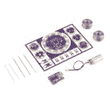
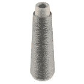
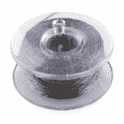
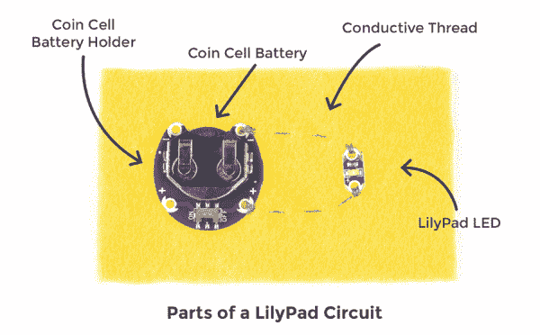
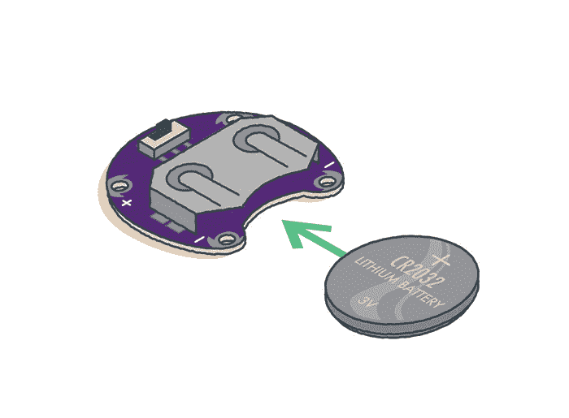

# LilyPad 基础:电子缝纫

> 原文：<https://learn.sparkfun.com/tutorials/lilypad-basics-e-sewing>

## 什么是可缝合电子产品？

可缝制电子产品将传统工艺流程(缝纫、时装设计和纺织品设计)与电气工程、计算机科学和硬件技能相结合。

有了可缝合电子产品，你可以制作电子纺织品(electronic textiles)，它们通常是可穿戴的、灵活的项目，看起来不像传统的电子产品，而更像工艺和艺术项目。许多电子纺织品项目用导电线和织物等柔性导电材料代替布线。对于本指南中的项目，我们将用导线将电路缝合在一起。

### 推荐阅读

如果你是电路概念的新手，在继续之前，你可能想看看下面的一些教程。

 [### 什么是电路？](https://learn.sparkfun.com/tutorials/what-is-a-circuit) Every electrical project starts with a circuit. Don't know what a circuit is? We're here to help.[Favorited Favorite](# "Add to favorites") 82 [### 电压、电流、电阻和欧姆定律](https://learn.sparkfun.com/tutorials/voltage-current-resistance-and-ohms-law) Learn about Ohm's Law, one of the most fundamental equations in all electrical engineering.[Favorited Favorite](# "Add to favorites") 132 [### 什么是电？](https://learn.sparkfun.com/tutorials/what-is-electricity) We can see electricity in action on our computers, lighting our houses, as lightning strikes in thunderstorms, but what is it? This is not an easy question, but this tutorial will shed some light on it 83 [### 极性](https://learn.sparkfun.com/tutorials/polarity) An introduction to polarity in electronic components. Discover what polarity is, which parts have it, and how to identify it.[Favorited Favorite](# "Add to favorites") 52

## 什么是 LilyPad？

LilyPad 系统是一套可缝合的电子部件，旨在帮助您构建柔软、可缝合的交互式电子纺织品项目。使用 LilyPad 是一种通过工艺镜头实验电子产品的好方法。每个 LilyPad 片具有大导电缝纫片，以便于缝纫，且具有圆形形状，以便不钩住织物或剪断线。

LilyPad 系统是 Leah Buechley 在科罗拉多大学博尔德分校攻读计算机科学博士学位时设计的。该套件的商业版本于 2007 年推出，由 Leah 和 SparkFun Electronics 合作设计。你可以在 SparkFun.com/LilyPad 的[了解更多关于 LilyPad 的信息。](http://SparkFun.com/LilyPad)

*LilyPad Creator [Leah Buechley](http://leahbuechley.com/)*

#### 更多 LilyPad 教程，请查看我们的[电子纺织品](https://learn.sparkfun.com/tutorials/tags/e-textiles)类别

#### 要浏览 LilyPad 产品，请访问 SparkFun 目录的 [LilyPad](https://www.sparkfun.com/categories/135) 部分

|  |  |

一些 LilyPad 产品采用 ProtoSnap 配置，这意味着所有的独立组件-如 led 灯、电池座、开关、按钮等。–在单个功能电路板上相互连接。这使您可以在将电路嵌入到项目中之前，轻松地对其进行编程，以实现您的目标。当您准备开始创建 LilyPad 项目时，ProtoSnap 板可以很容易地拆分成单独的部分。

 

将**添加到您的[购物车](https://www.sparkfun.com/cart)中！**

### [LilyPad LilyMini 原声](https://www.sparkfun.com/products/14063)

[In stock](https://learn.sparkfun.com/static/bubbles/ "in stock") DEV-14063

LilyMini ProtoSnap 是开始学习创建交互式电子纺织品电路的好方法，在您开始之前…

$17.503[Favorited Favorite](# "Add to favorites") 15[Wish List](# "Add to wish list")**** 

将**添加到您的[购物车](https://www.sparkfun.com/cart)中！**

### 

[In stock](https://learn.sparkfun.com/static/bubbles/ "in stock") DEV-11590

ProtoSnap 系列是一种无需试验板即可构建项目原型的新方法。所有东西都连接在一个单独的业务对象上…

$19.501[Favorited Favorite](# "Add to favorites") 18[Wish List](# "Add to wish list")**** 

### [LilyPad ProtoSnap 开发简单](https://www.sparkfun.com/products/retired/11201)

[Retired](https://learn.sparkfun.com/static/bubbles/ "Retired") DEV-11201

ProtoSnap 系列是一种无需试验板即可构建项目原型的新方法。所有东西都连接在一个单独的业务对象上…

**Retired**[Favorited Favorite](# "Add to favorites") 12[Wish List](# "Add to wish list") 

### [LilyPad ProtoSnap 开发板](https://www.sparkfun.com/products/retired/11262)

[Retired](https://learn.sparkfun.com/static/bubbles/ "Retired") DEV-11262

ProtoSnap 系列是一种无需试验板即可构建项目原型的新方法。所有东西都连接在一个单独的业务对象上…

5 **Retired**[Favorited Favorite](# "Add to favorites") 18[Wish List](# "Add to wish list")**** ****这与采用面板配置的 LilyPad 产品略有不同。LilyPad 指示灯连接在一起，但不在正常工作的电路中。在缝入电路之前，您需要将它们分开。

 

将**添加到您的[购物车](https://www.sparkfun.com/cart)中！**

### [【lily pad 彩虹 LED (6 色)](https://www.sparkfun.com/products/13903)

[In stock](https://learn.sparkfun.com/static/bubbles/ "in stock") DEV-13903

这是 LilyPad 彩虹 LED 灯条，有七个 LilyPad LEDs 灯，它们仍然相互连接，让您可以按下 LED 灯…

$3.955[Favorited Favorite](# "Add to favorites") 23[Wish List](# "Add to wish list")**** 

将**添加到您的[购物车](https://www.sparkfun.com/cart)中！**

### [LilyPad LED 白色(5pcs)](https://www.sparkfun.com/products/13902)

[In stock](https://learn.sparkfun.com/static/bubbles/ "in stock") DEV-13902

这是一个简单的由五个白色 LilyPad LEDs 组成的包，它们仍然彼此相连，让您可以在 y…

$3.5010[Favorited Favorite](# "Add to favorites") 17[Wish List](# "Add to wish list")**** 

将**添加到您的[购物车](https://www.sparkfun.com/cart)中！**

### [lily pad LED Red(5 PCs)](https://www.sparkfun.com/products/14013)

[Out of stock](https://learn.sparkfun.com/static/bubbles/ "out of stock") DEV-14013

这是一个简单的由五个红色 LilyPad LEDs 组成的包，它们仍然彼此相连，让你可以在你面前将 led 分开…

$3.502[Favorited Favorite](# "Add to favorites") 13[Wish List](# "Add to wish list")**** 

将**添加到您的[购物车](https://www.sparkfun.com/cart)中！**

### [【lily pad】LED 黄色(5pcs)](https://www.sparkfun.com/products/14014)

[In stock](https://learn.sparkfun.com/static/bubbles/ "in stock") DEV-14014

这是一个简单的由五个黄色 LilyPad LEDs 组成的包，它们仍然彼此相连，让您可以在…

$3.504[Favorited Favorite](# "Add to favorites") 9[Wish List](# "Add to wish list")******** ********## 什么是导电线？

导电线是由不锈钢纤维制成的特种线。它可以代替铜线将 LilyPad(或其他电子纺织品)连接在一起，形成电路。

如果您使用 LilyPad 套件，如 [LilyPad 可缝合电子套件](https://www.sparkfun.com/products/13927)，您将有一个[导电线轴](https://www.sparkfun.com/products/10867)可供使用。

SparkFun 提供了一些导电线选项:

 

将**添加到您的[购物车](https://www.sparkfun.com/cart)中！**

### [【导电线- 60g(不锈钢)](https://www.sparkfun.com/products/11791)

[In stock](https://learn.sparkfun.com/static/bubbles/ "in stock") DEV-11791

这是大约 360 码长的导电线，由不锈钢纤维纺成，缠绕在线轴上。你可以用它来创作…

$51.5010[Favorited Favorite](# "Add to favorites") 39[Wish List](# "Add to wish list")**** 

将**添加到您的[购物车](https://www.sparkfun.com/cart)中！**

### [导电线筒- 30ft(不锈钢)](https://www.sparkfun.com/products/10867)

[In stock](https://learn.sparkfun.com/static/bubbles/ "in stock") DEV-10867

这是由不锈钢纤维纺成的 30 英尺长的导电线，缠绕在塑料线轴上。用它来缝合你所有的…

$3.953[Favorited Favorite](# "Add to favorites") 44[Wish List](# "Add to wish list")**** 

将**添加到您的[购物车](https://www.sparkfun.com/cart)中！**

### [导电线线轴- 12m(光滑，不锈钢)](https://www.sparkfun.com/products/13814)

[In stock](https://learn.sparkfun.com/static/bubbles/ "in stock") DEV-13814

这是由不锈钢纤维纺成的 12 米长的光滑导电线，缠绕在塑料线轴上。用它来缝合…

$4.95[Favorited Favorite](# "Add to favorites") 34[Wish List](# "Add to wish list")************This tutorial will focus on hand sewing techniques, but conductive thread can also be used in a sewing machine and embroidery machines. Here are some specific resources on using conductive thread in machines:

*   [用 Janome MC 200E 绣花机绣导电线](http://v2.nl/lab/blog/embroidering-conductive-thread)
*   [缝纫机和导电线](http://www.instructables.com/id/eTextiles-Sewing-Machines-and-Conductive-Thread/)

## 用导电线缝纫

The examples in this tutorial will walk through creating a hand sewn conductive thread circuit connecting a LilyPad Coin Cell Battery Holder to LilyPad LEDs. These techniques will be useful for connecting any LilyPad pieces together.

大多数 LilyPad 项目使用导电线来完成电路。以下部分将向您介绍一些基本的缝纫技术，以及一些使用导电线构建工作电路的特殊指导。即使你已经熟悉了针线的使用，这一节对你可能还是有用的，特别是在用 LilyPad 部件缝纫的地方。

|  | 

## Protect your components

 |

每个 LilyPad 片都有大孔，上面有导电银垫，称为 sew tabs。这些垂片的设计是为了给你足够的空间让针和线穿过这个洞几次。在开始缝合电路之前，请确定要连接的缝合选项卡，并调整它们的方向，以便在设计中可以方便地使用它们。如果遵循 SparkFun 模板，这些作品将在设计上有一个特定的位置，以方便缝纫和视觉吸引力。

我们建议使用一小点热胶水(首选)或织物胶水将每个 LilyPad 片粘在织物上，防止它在缝纫时移动。确保不要意外地封住缝纫凸片上的孔。

为了帮助计划缝线的走向，您可以使用记号笔在组件之间画线。

|  | 

## Thread the needle

 |

剪一根大约 2 英尺长的导电线。将线的一端穿过针眼(开口)并拉出，留下大约 5 英寸的线尾。

在你开始缝纫你的项目之前，你需要在线的长端打一个结，以防止你将它完全穿过织物。你可以打一个简单的上手结或平结。接下来的部分将解释一些其他的结方法。

### 起动器结

起始结是一种直接在面料上打结开始缝合的方法。

### 奎尔特结

稍微高级一点的绗缝结是一种在线上快速安全打结的方法。经过一些练习，这个结可以很快打好。

Always remove your battery when working on your project to avoid damaging your components.

|  | 

## Connect to LilyPad sewing label

 |

我们将在电路中的 LilyPad 缝翼片周围缝上导线，将各部分连接在一起。重要的是，每次你把线绕在一个空的缝片上时，你要打三到四个圈，并且每次都把线拉紧。这样可以确保线和缝纫片之间有牢固的电气和物理连接。继续缝合前先把线圈拉紧。

|  | 

## Sewing Basis

 |

在缝上一圈后，用一根连续长度的导线将 LilyPad 片连接起来。请遵循以下步骤:

将针沿针迹方向穿过织物约 1/4 英寸。

把线的松弛部分拉出来，使它与布料平齐。

沿着缝合路径将针推回穿过织物 1/4 英寸。

把线的松弛部分拉出来，使它与布料平齐。

重复此过程，沿着路径移动到下一个要连接的 LilyPad 片，保持缝线间距均匀。

### 运行与隐藏缝合

在基本的连续针脚中，针脚在织物的两面是均匀的。

要隐藏针脚，使它们在项目外部看不到，请在项目背面缝一个较长的针脚，在项目正面缝一个非常小的针脚。这种方法被称为“隐藏针”

As you sew, flip your fabric over every so often to make sure the conductive thread isn’t getting knotted or tangled. If you are just starting out with sewing, your stitching may take some practice before it feels comfortable or easy. Remember to be patient with yourself and take your time while stitching. If your thread breaks, you can stitch onto existing conductive thread to continue the electrical connection.

|  | 

## Connect LilyPad component

 |

运行和隐藏缝线将使您能够用一根导电线将 LilyPad 组件连接在一起。要连接两个 LilyPad 片，请在缝合片周围完成三至四圈后继续缝合。

### 连接多个百合片

要连接两个以上的 LilyPad 片，不要修剪线并重新开始，继续缝合到下一片，做三到四个循环，必要时重复。如果这些部分将共享一个连接，则没有必要使用新的螺纹长度。

|  | 

## Completing the connection

 |

当你完成连接组件，使用一个完成结。线尾会导致短路，所以一定要在之后修剪你的线。

## 检查导线是否短路

注意你项目中的任何松散的线或结尾。如果电路正极(+)侧的任何一根导线意外接触到负极(–)侧，就会导致[短路](https://learn.sparkfun.com/tutorials/what-is-a-circuit#short-and-open-circuits)。短路会将电池连接到自身，并绕过项目的其余部分，从而导致电池产生不必要的电流。直接在电路另一部分的针脚上缝合也会导致短路。

One of the most common short circuits in e-sewing happens when a loose thread tail near the negative tab on the battery holder touches the battery. Always check your stitching before powering your project.

重要的是，你的缝线不要相互交叉或接触电路的其他部分。如果这些项目中使用的电池短路，应该不会烧伤或电击你(尽管它们可能会变热)，但更高电压的项目或电源可能会有危险。

## 安装电池并测试完成的电路

一旦你所有的零件都用导线连接起来，你完成的电路就需要一个电源。将您的纽扣电池正极(+)朝上安装到电池座中。下图显示了如何将电池放入 LilyPad 硬币电池盒中。

Always remove your battery if you need to continue working on your project to avoid damaging your components.

完成导线连接后，打开电路，看看它能做什么！如果电路不工作，你可能会短路，连接松动，元件颠倒，甚至像电池没电这样简单的事情。

当你打开电池盒开关时，电流通过导线流向电路的其他部分。

**在这里阅读更多关于电流和电力的信息:**

*   [什么是电路？](https://learn.sparkfun.com/tutorials/what-is-a-circuit)
*   [什么是电？](https://learn.sparkfun.com/tutorials/what-is-electricity)

或者继续进行[项目 LilyPad 可缝合电子套件的发光针](https://learn.sparkfun.com/tutorials/glowing-pin)来构建自己的电路。

## 解决纷争

当您从事电子缝纫项目时，您可能会遇到诸如连接松动等问题，这些问题会使发光二极管无法发光或导致电路故障。大多数 LilyPad 教程都有一个故障排除部分来帮助您识别和解决电路问题。

### 电路只是有时工作？检查连接是否松动。

如果导电线没有与 LilyPad 片的缝合片紧密连接，电流将无法持续流过。如果项目移动，导线可能会从“缝合”接片上脱离并断开电路。如果可能的话，用镊子或针将缝线拉紧。你也可以在现有线的上面缝纫，以产生更大的张力，并将线牢固地固定在缝纫标签上。

### 电路不工作？仔细检查你的极性。

一些 LilyPad 组件被极化，这意味着电流只能以一个方向流过它们。如果缝在电路中不正确，它们将不起作用。缝合前仔细检查标签上的缝纫标签，确保它们的方向正确。

**要检查的其他问题:**

*   确保电池盒上的开关处于打开位置。
*   检查一下你的电池是否没电了。你可以用[万用表](https://www.sparkfun.com/products/12966)来做。尝试安装备用电池。
*   如果遵循项目模板，请仔细检查组件是否以正确的配置连接在一起

如果您仍然有问题，您可以使用万用表来检查电路的连续性或问题。我们的[如何使用万用表](https://learn.sparkfun.com/tutorials/how-to-use-a-multimeter)教程将帮助你开始。

### 点击[此处](https://cdn.sparkfun.com/assets/learn_tutorials/5/8/1/Troubleshooting_LilyPadSewableElectronicsKit.pdf)查看来自 LilyPad 可缝合电子套件的 pdf 故障排除页面。

## 关注您的项目

与有涂层的铜线不同，导电线没有绝缘。这意味着线的行为就像裸线，如果分散的线股相互接触，可能会意外短路。

为了避免项目缝合和测试后出现任何意外短路，我们建议用一层薄薄的织物胶、织物漆或一层额外的织物覆盖线。这对于可穿戴或三维的项目尤其重要。使用导线时，切勿在金属表面上工作。有关更详细的绝缘说明，请参考本教程:

 [### 电子纺织品的绝缘技术

#### 2015 年 1 月 22 日](https://learn.sparkfun.com/tutorials/insulation-techniques-for-e-textiles) Learn a few different ways to protect your conductive thread and LilyPad components in your next wearables project.[Favorited Favorite](# "Add to favorites") 16

### 清理您的项目

如果你的项目变脏了，取出电池，小心地用温和的洗涤剂手洗。让你的项目风干；烘干机会损坏 LilyPad 片或缝线。

## 资源和更进一步

准备好开始缝合电路了吗？查看 LilyPad 可缝合电子套件中的这些项目:

*   项目 1: [发光针](https://learn.sparkfun.com/tutorials/glowing-pin)
*   项目 2: [发光面罩](https://learn.sparkfun.com/tutorials/illuminated-mask)
*   项目三:[点亮毛绒](https://learn.sparkfun.com/tutorials/light-up-plush)
*   项目四:[夜光锦旗](https://learn.sparkfun.com/tutorials/night-light-pennant-with-lilymini-protosnap)

 [### 发光长毛绒](https://learn.sparkfun.com/tutorials/light-up-plush) Craft a light-up plush with LilyPad LEDs controlled by pressing a button and sliding a switch in the creature's hands.[Favorited Favorite](# "Add to favorites") 8 [### 带 LilyMini ProtoSnap 的夜光三角旗](https://learn.sparkfun.com/tutorials/night-light-pennant-with-lilymini-protosnap) Use the pre-programmed LilyMini ProtoSnap to make an interactive pennant that reacts to ambient light levels.[Favorited Favorite](# "Add to favorites") 5 [### 发光针](https://learn.sparkfun.com/tutorials/glowing-pin) Create a quick and easy piece of e-textile art using a LilyPad LED, battery holder, conductive thread, and coin cell battery.[Favorited Favorite](# "Add to favorites") 4 [### 照明面罩](https://learn.sparkfun.com/tutorials/illuminated-mask) Use LilyPad LEDs, a switched battery holder, and coin cell battery to make a fun light up mask for your next costume party.[Favorited Favorite](# "Add to favorites") 6******************