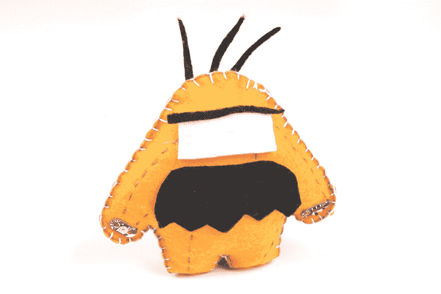

# 发光长毛绒

> 原文：<https://learn.sparkfun.com/tutorials/light-up-plush>

## 介绍

在这个项目中，我们将尝试单独控制电子纺织品电路中的 led。当我们制作一个有创意的毛绒动物时，我们将探索使用按钮和开关控制 LED 电流的两种方法。

设计和建造时间:2 - 3 小时

这是来自 [LilyPad 可缝合电子套件](https://www.sparkfun.com/products/13927)的项目 3，看看套件中的其他项目:

*   项目 1: [发光针](https://learn.sparkfun.com/tutorials/glowing-pin)
*   项目 2: [发光面罩](https://learn.sparkfun.com/tutorials/illuminated-mask)
*   项目四:[夜光锦旗](https://learn.sparkfun.com/tutorials/night-light-pennant-with-lilymini-protosnap)

### 推荐阅读

如果这是你的第一个可缝合电子项目，我们建议你阅读我们的 LilyPad 基础教程。

 [### LilyPad 基础:电子缝纫

#### 2016 . 12 . 17](https://learn.sparkfun.com/tutorials/lilypad-basics-e-sewing) Learn how to use conductive thread with LilyPad components.[Favorited Favorite](# "Add to favorites") 16

## 材料和工具

让我们来看一下将你的项目组合在一起所需要的所有东西。

 

将**添加到您的[购物车](https://www.sparkfun.com/cart)中！**

### [LilyPad 可缝电子套装](https://www.sparkfun.com/products/13927)

[In stock](https://learn.sparkfun.com/static/bubbles/ "in stock") KIT-13927

LilyPad 可缝制电子套件让您通过以下方式探索电子缝纫和电子纺织品的奇妙世界

$106.959[Favorited Favorite](# "Add to favorites") 39[Wish List](# "Add to wish list")** **### [LilyPad 可缝合电子套件](https://www.sparkfun.com/products/13927)中包含的项目:

*   lily pad E-seating proto snap 上有以下部件(仅在套件中提供)。
    *   [LilyPad 硬币电池座](https://www.sparkfun.com/products/13883)
    *   3x[lily pad led](https://www.sparkfun.com/products/13902)(小心地从五个面板中取出)
    *   [LilyPad 按钮板](https://www.sparkfun.com/products/8776)
    *   [LilyPad 滑动开关](https://www.sparkfun.com/products/9350)
*   [3V 纽扣电池](https://www.sparkfun.com/products/338)
*   [导电线](https://www.sparkfun.com/products/10867)
*   [针](https://www.sparkfun.com/products/10405)
*   豪华模板(1 件)-参见[规划您的项目](https://learn.sparkfun.com/tutorials/light-up-plush#planning-)获取可打印的下载
*   毛毡(一张 9 英寸 x12 英寸的工艺毛毡可以制成一个长毛绒；使用毛毡碎片来添加装饰)
*   纤维填充填料
*   刺绣或缝纫线

没有 LilyPad 可缝合电子套件？您也可以使用[E-sealing proto snap 套件](https://www.sparkfun.com/products/14528)来跟进这个项目:

 

将**添加到您的[购物车](https://www.sparkfun.com/cart)中！**

### [lily pad E-seating proto snap 套件](https://www.sparkfun.com/products/14528)

[In stock](https://learn.sparkfun.com/static/bubbles/ "in stock") KIT-14528

LilyPad E-Sewing ProtoSnap 套件是将按钮和开关整合到电子纺织品项目中的一个很好的方式，无需任何专业人员

$12.95[Favorited Favorite](# "Add to favorites") 9[Wish List](# "Add to wish list")** **### 您还需要:

*   钢笔、记号笔或粉笔
*   剪刀
*   热胶枪(带额外胶水)
*   可选:装饰用的工艺用品(羽毛、亮片、纽扣等。)

## 规划您的项目

For this project, we’ll be using the Light-Up Plush template (download below or use the template included with your kit). If needed, download and print the provided template. Right-click the image below and choose “Save Link As” to download the template to your computer.*Right-click and choose “Save Link As” or click image to download PDF*

在一块毛毡上描摹并裁剪出毛绒模板形状。为了完全隐藏你的缝线，剪下额外的半块毛毡(如图所示)放在你完成的毛绒上面(见[收尾](https://learn.sparkfun.com/tutorials/light-up-plush#finishing-touches))。

The two halves of what will become your plush are connected at the “feet” to allow your entire circuit to be on one surface and to make stuffing the project easier. **Don’t cut these two halves apart.**

### 使用 ProtoSnap

If you are using individual LilyPad components instead of the E-Sewing ProtoSnap, you will not be able to follow along with the experiment in the next section exactly, but read along to learn more about buttons and switches.

我们将使用电路中的 LilyPad 部件来打开和关闭不同的 led。使用 E-Sewing ProtoSnap，我们将检查按钮和开关的不同行为，然后将这些部分分开，并将它们构建成一个具有发光功能的毛绒动物。

在毛毡上布置电路之前，安装好电池，将电池座开关滑动到 on 位置。

Don’t snap apart your E-Sewing ProtoSnap board quite yet. You’ll need it intact for a brief experiment first.

## 了解您的电路

按钮和开关是控制电路电流的电子元件。当通过打开开关或按下按钮允许电流通过时，电路闭合。当通过关闭开关或按钮断开一段电路时，这是一个[开路](https://learn.sparkfun.com/tutorials/what-is-a-circuit#short-and-open-circuits)。

### LilyPad 滑动开关

LilyPad 滑动开关有一个标有开/关的小开关。当扳钮移动到 ON 位置时，开关上的两个 sew 凸耳连接，允许电流流过并闭合电路。当移动到“关”时，开关内部的部件相互远离并打开电路(断开电路)。这有助于将开关想象成电力的吊桥——当桥打开时，没有东西可以通过。当它关闭时，通路重新连接，电流可以沿着原来的路径流动。

### LilyPad 按钮

LilyPad 按钮板也是一种开关。当您按下电路板中间的按钮时，它会连接两个 sew 标签并允许电流通过。当您放开按钮时，连接会再次打开，按钮会弹回原位。该按钮是瞬时开关的一个例子，仅当应用一个动作时才激活。

这与滑动开关略有不同，滑动开关是维护开关的一个例子，这意味着它的状态保持不变，直到发生变化。

*Learn more about buttons and switches in our [Switch Basics](https://learn.sparkfun.com/tutorials/switch-basics) tutorial.*

## 布置您的电路

小心地将 E-Sewing ProtoSnap 面板上的连接部件分开。丢弃不可缝合的碎片和废料。你将得到六个 LilyPad 部件:一个带电池的电池座、三个 led、一个按钮和一个开关。

Always remove your battery when working on your circuit to avoid damaging your components.

根据下图在毛毡上排列棋子。在缝合之前，请务必检查 LilyPad 指示灯的方向。LED 的正极片连接到按钮或开关，负极片连接到电池盒的负极片。当你的电路设计完成后，在每个元件的背面涂上一点胶水，把它们粘在毛毡上。

For this project, we’ll be arranging the pieces slightly differently from on the E-Sewing ProtoSnap. To avoid any crossed conductive thread, we are connecting (+) with both the button and the switch instead of having two separate paths to the battery holder. When creating circuits with e-textiles, both the electrical properties of the circuit and aesthetic decisions are part of the design process.

这个项目有很多拼接。如果你想隐藏缝线，在你完成你的线路后，在线上使用一层毛毡或装饰品(见[收尾](https://learn.sparkfun.com/tutorials/light-up-plush#finishing-touches)部分)，或者使用隐藏缝线(见我们的[电子缝纫基础](https://learn.sparkfun.com/tutorials/lilypad-basics-e-sewing#sewing-with-conductive-thread)教程)。

## 缝合在一起

#### 如果你需要用导电线缝纫的帮助，本教程涵盖了基本知识。

### 第一步:

剪一根长的导电线，穿针，末端打个结。从最靠近折叠处或毛毡切口上的“脚”的电池座上的正极缝纫片开始缝纫。记得在缝纫时，在每个标签周围使用三到四个环。

使用连续针脚或隐藏针脚(参见[电子缝纫基础知识](https://learn.sparkfun.com/tutorials/lilypad-basics-e-sewing#sewing-with-conductive-thread)了解这些技术)将电池板上的正极缝纫片连接到开关上最近的缝纫片。在开关的缝片周围缝三到四个环来固定，然后打一个结并切断。

### 第二步:

用一根新的线，将开关的另一端连接到顶部两个发光二极管的正极缝翼片上，并在按钮最近的翼片上结束三到四个环。绑好切好。

### 第三步:

用一根新线，从钮扣的另一边开始，在缝片周围缝三到四圈。继续缝合到最后一个 LED 的正面，以三到四个环结束。

绑好切好。

### 第四步:

最后，我们将缝合所有的负面联系。用一根新的线，在第一个 LED 的负极(–)缝合片上缝合三到四个环，并连接到其他 LED 的负极片，如图所示，在电池座的负极片处结束。确保在每个连接上循环三到四次。

*After all the stitching is complete, turn the project over, and trim any loose thread tails before testing.*

## 安装电池和测试

将币形电池插入电池座，正极(标有+)面朝上。测试按钮和开关，确保指示灯亮起。如果是这样，请取出电池并继续完成最后一部分。

*How to place a battery in a LilyPad Battery Holder.*

### 解决纷争

对于任何电子项目来说，如果电路不工作，你都有需要排除故障的时候。如果您的电路没有点亮，请尝试使用新电池或检查您的项目是否已打开。检查您的缝纫是否有任何松动的线或末端，这些线或末端可能会接触到电路的其他部分并导致[短路](https://learn.sparkfun.com/tutorials/what-is-a-circuit#short-and-open-circuits)。在 [LilyPad 基础:电子缝纫](https://learn.sparkfun.com/tutorials/lilypad-basics-e-sewing#troubleshooting)教程中了解更多关于项目故障排除的信息。

## 收尾

Always remove your battery when working on your project to avoid damaging your components.

导电线可以是视觉设计的一部分，也可以是隐藏的。为了隐藏缝线，在顶部添加一层带有切口的毛毡，以允许 led 发光并接触到按钮和开关。

一旦你完成了测试，是时候让毛绒变得立体了。取出电池，在底部连接点(脚)处折叠毛毡，使 LilyPad 组件位于外侧。使用不导电的缝纫线或绣花线(或胶枪)密封长毛绒顶部除 2 英寸以外的所有部分；我们将在这个开口处加入纤维填料。

将纤维填充物推入孔中，填充长毛绒。用你的手指或铅笔填满手臂和腿。填充物除了作为内部导电缝线的绝缘体之外，还将赋予毛绒形状。用刺绣或缝纫线缝合开口，完成项目。

现在，您可以使用闪光、油漆或其他装饰材料来增强毛绒或隐藏 led 和缝线。为了保护电池座和电池，您可以制作一个小毛毡盖来盖住电池片，并用 velcro 固定，以便于拿取。

以下是一些成品毛绒项目的创意装饰示例:

## 资源和更进一步

寻找另一个项目？让我们继续项目 4:[lily pad 可缝合电子套件中的夜灯三角旗](https://learn.sparkfun.com/tutorials/night-light-pennant-with-lilymini-protosnap)。

 [### 带 LilyMini ProtoSnap 的夜光三角旗

#### 2016 . 12 . 16](https://learn.sparkfun.com/tutorials/night-light-pennant-with-lilymini-protosnap) Use the pre-programmed LilyMini ProtoSnap to make an interactive pennant that reacts to ambient light levels.[Favorited Favorite](# "Add to favorites") 5

这些教程将指导您完成更高级的项目和概念:

 [### 电子纺织品的绝缘技术](https://learn.sparkfun.com/tutorials/insulation-techniques-for-e-textiles) Learn a few different ways to protect your conductive thread and LilyPad components in your next wearables project.[Favorited Favorite](# "Add to favorites") 16 [### 规划可穿戴电子项目](https://learn.sparkfun.com/tutorials/planning-a-wearable-electronics-project) Tips and tricks for brainstorming and creating a wearables project.[Favorited Favorite](# "Add to favorites") 25 [### 为您的项目选择 LilyPad Arduino](https://learn.sparkfun.com/tutorials/choosing-a-lilypad-arduino-for-your-project) Not sure which LilyPad Arduino is right for you? We'll discuss the features of each and help you decide.[Favorited Favorite](# "Add to favorites") 13****