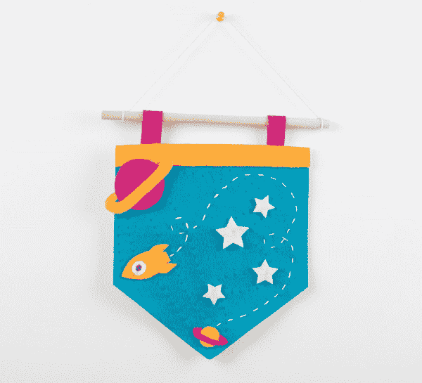
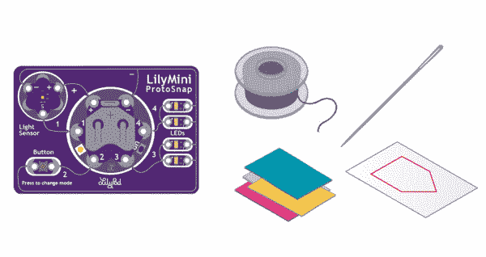

# 带 LilyMini ProtoSnap 的夜光三角旗

> 原文：<https://learn.sparkfun.com/tutorials/night-light-pennant-with-lilymini-protosnap>

## 介绍

在这个项目中，我们将使用 LilyMini ProtoSnap 控制 led。有了存储在 LilyMini 上的代码，我们的项目现在可以有更高级的行为，交互甚至可以重新编程。我们将把 LilyPad 组件缝在一个三角旗形状上，并定制主题和装饰。

设计和建造时间:3 - 4 小时

这是来自 [LilyPad 可缝合电子套件](https://www.sparkfun.com/products/13927)的项目 4，看看套件中的其他项目:

*   项目 1: [发光针](https://learn.sparkfun.com/tutorials/glowing-pin)
*   项目 2: [发光面罩](https://learn.sparkfun.com/tutorials/illuminated-mask)
*   项目三:[点亮毛绒](https://learn.sparkfun.com/tutorials/light-up-plush)

### 推荐阅读

如果这是你的第一个可缝合电子项目，我们建议你阅读我们的 LilyPad 基础教程。

 [### LilyPad 基础:电子缝纫

#### 2016 . 12 . 17](https://learn.sparkfun.com/tutorials/lilypad-basics-e-sewing) Learn how to use conductive thread with LilyPad components.[Favorited Favorite](# "Add to favorites") 16

关于 LilyMini ProtoSnap 的初级读本，请查看该详细指南。

 [### LilyMini ProtoSnap 连接指南

#### 2016 . 12 . 17](https://learn.sparkfun.com/tutorials/lilymini-protosnap-hookup-guide) Explore the LilyPad LilyMini ProtoSnap and learn how to use it.[Favorited Favorite](# "Add to favorites") 6

## 材料和工具

让我们来看一下将你的项目组合在一起所需要的所有东西。

 

将**添加到您的[购物车](https://www.sparkfun.com/cart)中！**

 **### [LilyPad 可缝电子套装](https://www.sparkfun.com/products/13927)

[In stock](https://learn.sparkfun.com/static/bubbles/ "in stock") KIT-13927

LilyPad 可缝制电子套件让您通过以下方式探索电子缝纫和电子纺织品的奇妙世界

$106.959[Favorited Favorite](# "Add to favorites") 39[Wish List](# "Add to wish list")** **### [LilyPad 可缝合电子套件](https://www.sparkfun.com/products/13927)中包含的项目:

*   [原始捕捉](https://www.sparkfun.com/products/14063)
*   [导电线](https://www.sparkfun.com/products/10867)
*   [针](https://www.sparkfun.com/products/10405)
*   三角旗模板(1 张)-参见[规划您的项目](https://learn.sparkfun.com/tutorials/night-light-pennant-with-lilymini-protosnap#planning-your-project)获取可打印的下载
*   毛毡(一张 9 英寸 x12 英寸的工艺毛毡可以制作一面三角旗；使用毛毡碎片来添加装饰)
*   刺绣或缝纫线

Don't have a LilyPad Sewable Electronics Kit? You can follow along with this project using this [wish list](https://www.sparkfun.com/wish_lists/132346) of individual LilyPad pieces. You will need to source your own felt and embroidery or sewing thread (available at local craft stores) to complete the project.**